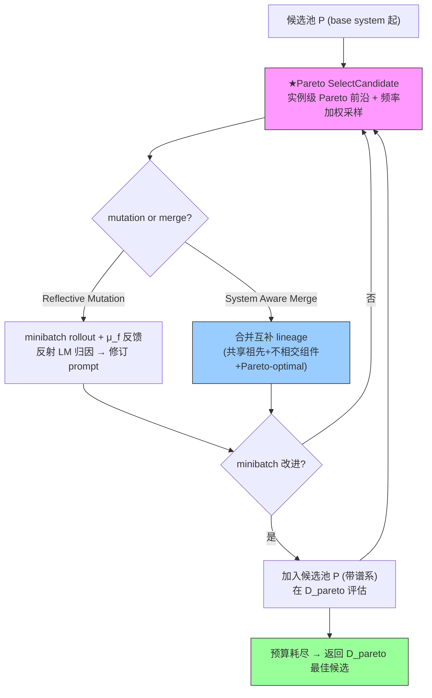

# GEPA: Reflective Prompt Evolution Can Outperform Reinforcement Learning

**作者**: Lakshya A Agrawal, Shangyin Tan, Dilara Soylu, ..., Matei Zaharia, Omar Khattab（UC Berkeley / Stanford / Databricks / MIT 等）
**会议/年份**: ICLR 2026（arXiv 2507.19457，2025）
**链接**: [arXiv](https://arxiv.org/abs/2507.19457) · [Code](https://github.com/gepa-ai/gepa)

## 一句话总结

**反射式 prompt 优化器**：把自然语言反射 + 多目标进化搜索结合。论点——语言的可解释性是比稀疏标量 reward 的 policy gradient 更丰富的学习媒介。采样 trajectory → 自然语言反射诊断/提出/测试 prompt 更新 → 从自己尝试的 **Pareto frontier** 组合互补经验。6 任务超 GRPO 6%（最高 20%）用 35× 更少 rollout，超 MIPROv2 10%+。**用户要借的是它的候选搜索/选择结构（Pareto illumination + genetic tree + merge）来治 Self-Harness 的 greedy 单谱系。**

> 📌 **本篇是"改进工具"不是"竞争工作"**：GEPA 是 prompt-only + 需标签，但其**搜索结构**正是 [Self-Harness](../%5BArxiv%202026%5D%20Self-Harness/) 缺的。重点读 §3.1 Pareto-based candidate selection + Table 3 消融。

## 核心贡献

1. **GEPA 反射式进化**：genetic prompt evolution + natural language reflection + Pareto-based candidate selection 三原则。
2. **Pareto illumination 候选选择**：实例级 Pareto 前沿 + 频率加权随机采样，逃离 greedy 的局部最优（Table 3：+12.44% vs greedy +6.05%）。
3. **System Aware Merge**：严格判据（共享祖先 + 不相交组件 + Pareto-optimal）合并互补 lineage。
4. **样本高效**：超 GRPO 6%（35× 更少 rollout），超 MIPROv2 10%+，跨模型泛化。

## 📖 批读导航

| Section | 内容 |
|---------|------|
| [00 - Abstract, Intro & Problem](sections/00-abstract-intro.md) | reflection > policy gradient、问题设定、对 harness 优化的可移植性 |
| [01 - Method & Experiments](sections/01-method-experiments.md) | 三原则、**★Pareto candidate selection (Algo 2 + Table 3)**、System Aware Merge、结果 |

## 关键数字

| 指标 | 数值 |
|------|------|
| vs GRPO | 平均 +6%（最高 +20%），35× 更少 rollout |
| vs MIPROv2 | +10~13% 聚合，prompt 短 9.2× |
| **候选选择消融** | **Pareto +12.44%** vs greedy +6.05% vs BeamSearch +5.11% |
| Merge | +2~5%（GPT-4.1 Mini 好，Qwen3 8B 需调超参） |
| 跨模型 | Qwen-opt → GPT-4.1-Mini +9%（超直接优化的基线） |
| 模型 | Qwen3 8B / GPT-4.1 Mini |

## 数据流：GEPA 优化循环

## 优缺点与还能做什么

### 优点
- **Pareto illumination 治局部最优**：实例级前沿 + 频率加权采样，同预算翻倍增益。
- **样本高效**：反射学习 >> policy gradient（35× 更少 rollout）。
- **genetic tree 累积经验 + merge 组合互补 lineage**。
- **富反馈**：$\mu_f$ 提取评估 trace（编译错误/失败 rubric），模块特定 credit assignment。

### 局限 / 风险（对 harness 优化）
- **prompt-only**：不编辑完整 harness（tools/middleware/memory）——需移植搜索结构到 harness。
- **需 validation 标签**（$D_{pareto}$ 用 μ 打分）——RHO Table 5 归为 validation-feedback 类。
- **用独立/强 reflection LM**——弱自 proposer 下 Pareto 是否成立未知。
- **Merge 预算分配/触发时机 open**（Qwen3 8B 上反而降）。

### 还能做什么（对用户改进 Self-Harness）
- **移植 Pareto candidate selection**：把 Self-Harness 的 greedy 单谱系换成 harness 候选池 + 实例级（per-task）Pareto 前沿 + 频率加权采样。
- **移植 genetic tree + merge**：维护多 harness lineage，用 GEPA 严格判据合并互补 lineage（回应 AHE 非加性交互）。
- **验证弱自 proposer + Pareto**：GEPA/Meta-Harness 用强 proposer，Self-Harness 用弱自 proposer——中间未知地带，可做实验贡献。
- **结合无标签**：GEPA 的 Pareto 搜索 + [RHO](../%5BArxiv%202026%5D%20RHO-Self-Preference/) 的 self-preference = 无标签的 Pareto illumination。

## 阅读 Q&A 记录

- **Q: GEPA 对用户最有用的一点？**
  A: Pareto-based candidate selection（§3.1/Algo 2/Table 3）——实例级 Pareto 前沿 + 频率加权采样，把 greedy +6% 提到 +12.44%，直接治 Self-Harness 的 greedy 单谱系。

- **Q: 为什么 greedy 陷局部最优？**
  A: 总选全局最佳 → 找到主导策略就反复精修、难超越、耗尽预算。Pareto 保留"在某任务上最佳"的候选，探索被掩盖的 winning 策略。

- **Q: Merge 判据？**
  A: 共享祖先 + 优化不相交 prompt/组件集（互补）+ 都 Pareto-optimal + 都超祖先。严格 → 稀疏发生。与 AHE 组件观测天然契合（不同 lineage 编辑不同组件文件）。

- **Q: GEPA 能直接当 harness 优化器吗？**
  A: prompt-only + 需标签。搜索结构可移植，但需换完整 harness 候选、解决弱自 proposer + 无标签（结合 RHO）。

## 📊 Citation Landscape

**本 topic 关系**
- [Meta-Harness](../%5BArxiv%202026%5D%20Meta-Harness/)——把 GEPA 归为"Summary 反馈类"（压缩太狠不适合 harness 搜索），但 Meta-Harness 也用 population/Pareto。
- [Self-Harness](../%5BArxiv%202026%5D%20Self-Harness/)——用户想用 GEPA 的 Pareto 搜索治其 greedy；[AHE](../%5BArxiv%202026%5D%20Agentic-Harness-Engineering/)/[RHO](../%5BArxiv%202026%5D%20RHO-Self-Preference/) 引用 GEPA 为反射式演化代表。

**方法来源 / 对照**
- Pareto illumination = MAP-Elites（Mouret & Clune 2015）；GRPO（Shao et al.，RL 对照）；MIPROv2/TextGrad/Trace（prompt 优化对照）；DSPy（compound system 框架）。
- Benchmark：HotpotQA、IFBench、HoVer、PUPA、AIME-2025、LiveBench-Math；code：NPUEval、KernelBench。
