# GEPA: REFLECTIVE PROMPT EVOLUTION CAN OUTPER-FORM REINFORCEMENT LEARNING

Lakshya A Agrawal<sup>1</sup>, Shangyin Tan<sup>1</sup>, Dilara Soylu<sup>2</sup>, Noah Ziems<sup>4</sup>, Rishi Khare<sup>1</sup>, Krista Opsahl-Ong<sup>5</sup>, Arnav Singhvi<sup>2,5</sup>, Herumb Shandilya<sup>2</sup>, Michael J Ryan<sup>2</sup>, Meng Jiang<sup>4</sup>, Christopher Potts<sup>2</sup>, Koushik Sen<sup>1</sup>, Alexandros G. Dimakis<sup>1,3</sup>, Ion Stoica<sup>1</sup>, Dan Klein<sup>1</sup>, Matei Zaharia<sup>1,5</sup>, Omar Khattab<sup>6</sup>

<sup>1</sup>UC Berkeley <sup>2</sup>Stanford <sup>3</sup>BespokeLabs.ai <sup>4</sup>Notre Dame <sup>5</sup>Databricks <sup>6</sup>MIT

## ABSTRACT

Large language models (LLMs) are increasingly adapted to downstream tasks via reinforcement learning (RL) methods like Group Relative Policy Optimization (GRPO), which often require thousands of rollouts to learn new tasks. We argue that the interpretable nature of language often provides a much richer learning medium for LLMs, compared to policy gradients derived from sparse, scalar rewards. To test this, we introduce GEPA (Genetic-Pareto), a prompt optimizer that thoroughly incorporates natural language reflection to learn high-level rules from trial and error. Given any AI system containing one or more LLM prompts, GEPA samples trajectories (e.g., reasoning, tool calls, and tool outputs) and reflects on them in natural language to diagnose problems, propose and test prompt updates, and combine complementary lessons from the Pareto frontier of its own attempts. As a result of GEPA’s design, it can often turn even just a few rollouts into a large quality gain. Across six tasks, GEPA outperforms GRPO by 6% on average and by up to 20%, while using up to 35x fewer rollouts. GEPA also outperforms the leading prompt optimizer, MIPROv2, by over 10% (e.g., +12% accuracy on AIME-2025), and demonstrates promising results as an inference-time search strategy for code optimization. We release our code at https://github.com/gepa-ai/gepa.

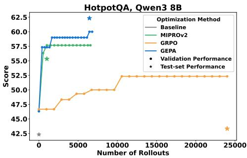  
(a) HotpotQA, Qwen3 8B

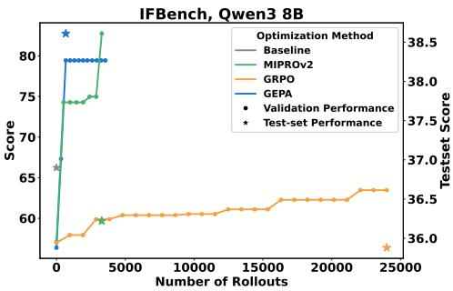  
(b) IFBench, Qwen3 8B  
Figure 1: A comparison of learning behavior of the GEPA prompt optimizer against a state-of-the-art prompt optimizer (MIPROv2) and GRPO (24,000 rollouts). As more rollouts are sampled, the prompt optimizers can learn much more quickly than GRPO. GEPA substantially outperforms both GRPO and MIPROv2 in final score. The Test-set star markers demonstrate the performance gap in a held-out set of questions.

## 1 INTRODUCTION

Large language models (LLMs) have enabled development of agents and systems that combine fuzzy natural-language specifications with tools like retrieval and code execution. This raises the question of how LLMs should be optimized for downstream performance. One popular approach is Reinforcement Learning with Verifiable Rewards (RLVR), e.g. with Group Relative Policy Optimization (GRPO) (Shao et al., 2024), which treats success metrics as end-of-rollout scalar rewards used to estimate policy gradients (Lambert, 2025). While these RL approaches are effective, they typically require tens of thousands of rollouts in practice to fit new tasks. For example, recent works leveraging GRPO typically use up to hundreds of thousands of rollouts for training (Chen et al., 2025b; Wu et al., 2025b; Zhang et al., 2025; Jin et al., 2025; Si et al., 2025; Wang et al., 2025a; Chen et al., 2025a; Sha et al., 2025; Lin et al., 2025a; Peng et al., 2025; Song et al., 2025). This sample inefficiency can quickly become a serious bottleneck: many downstream LLM applications invoke expensive tool calls, have limited inference budget for sampling from the LLM itself, or simply cannot finetune the weights of the largest or best-performing LLMs.

We observe that rollouts sampled from even highly sophisticated LLM systems can be serialized into traces of natural language: they contain nothing but the instructions of each LLM module, the resulting LLM reasoning chains, tool calls, and potentially the internal workings of the reward function (e.g., compiler error messages, before they are collapsed into scalar rewards). Because such serialized trajectories are readily understood by modern LLMs, we argue that algorithms that learn deliberately in natural language by reflecting on these trajectories can make more effective use of the strong language priors that LLMs have, compared with standard RL approaches.

We introduce GEPA (Genetic-Pareto), a reflective prompt optimizer for compound AI systems that merges textual reflection with multi-objective evolutionary search. GEPA iteratively mutates prompts using natural language feedback drawn from new rollouts. In each mutation, the candidate prompt is derived from an ancestor, accumulating high-level lessons derived from observations and LLM feedback. To avoid local optima that afflict greedy prompt optimization, GEPA maintains a Pareto front: instead of evolving only the global best prompt, it stochastically explores the top-performing prompts for each problem instance. This diversification enables robust generalization and mitigates getting stuck in local minima.

We evaluate GEPA across multi-hop reasoning (HotpotQA; Yang et al. 2018), Math (AIME, LiveBench-Math; Balunovic et al. (2025); White et al. (2025)), instruction following (IFBench; Pyatkin et al. 2025b),´ privacy-aware delegation (PUPA; Li et al. 2025a), and retrieval-augmented verification (HoVer; Jiang et al. 2020), using both open (Qwen3 8B; Yang et al. 2025; Team 2025) and proprietary (GPT-4.1 Mini; OpenAI 2025) models. We find that GEPA generalizes well and is highly sample-efficient: on Qwen3 8B, it outperforms GRPO (24k rollouts) by up to 20% while using up to 35× fewer rollouts, with an average gain of +6% across six tasks. GEPA also surpasses the prior state-of-the-art, MIPROv2 (Opsahl-Ong et al., 2024), on all benchmarks and models, achieving +13% aggregate gains, over double MIPROv2’s +5.6%.

Qualitatively, GEPA-learned prompts are quite rich. Figure 2 shows excerpts from a prompt crafted for the query-creation module of a multi-hop question answering system used in HotpotQA, and Figure 5 shows that even a single reflective update often yields large gains. These results highlight that reflective prompt evolution with language feedback enables improved sample efficiency and robust generalization, offering a practical approach to optimizing complex AI workflows in data- or budget-constrained environments. We also demonstrate GEPA as an inference-time search strategy for code optimization on NPUEval (Kalade & Schelle, 2025) & KernelBench (Ouyang et al., 2025) in Sec 5.1, and for adversarial prompt search in Sec 5.2.

## 2 PROBLEM STATEMENT

We follow related work in defining a compound AI system as any modular system composed of one or more language model (LLM) invocations, potentially interleaved with external tool calls, orchestrated through arbitrary control flow. This definition subsumes a broad class of real-world LLM-based AI systems, including agents, multi-agent systems, and general-purpose scaffolding techniques like ReAct (Yao et al., 2023), Archon (Saad-Falcon et al., 2025), etc. Following Soylu et al. (2024); Khattab et al. (2024); Opsahl-Ong et al. (2024); Tan et al. (2025), we formalize such a system as $\Phi = ( M , C , \mathcal { X } , \mathcal { y } )$ , where $M = \langle \mathbf { \bar { \mathit { M } } } _ { 1 } , \dots , \mathbf { \bar { \mathit { M } } } _ { | M | } \rangle$ denotes language modules, C specifies control flow logic, and $x , y$ are global input/output schemas. Each module $M _ { i } = \bar { ( } \pi _ { i } , \theta _ { i } , \mathcal { X } _ { i } , \mathcal { Y } _ { i } )$ is an LLM subcomponent: $\pi _ { i }$ is its (system) prompt including instructions and few-shot demonstrations; $\theta _ { i }$ the underlying model weights; $\mathcal { X } _ { i } , \mathcal { N } _ { i }$ are input/output schemas. At runtime, C orchestrates the sequencing and invocation of modules— $- \mathrm { e . g . }$ , passing outputs from one module to another, invoking modules conditionally, or leveraging tool APIs. This way, $\bar { C }$ can invoke different modules in any order multiples of times.

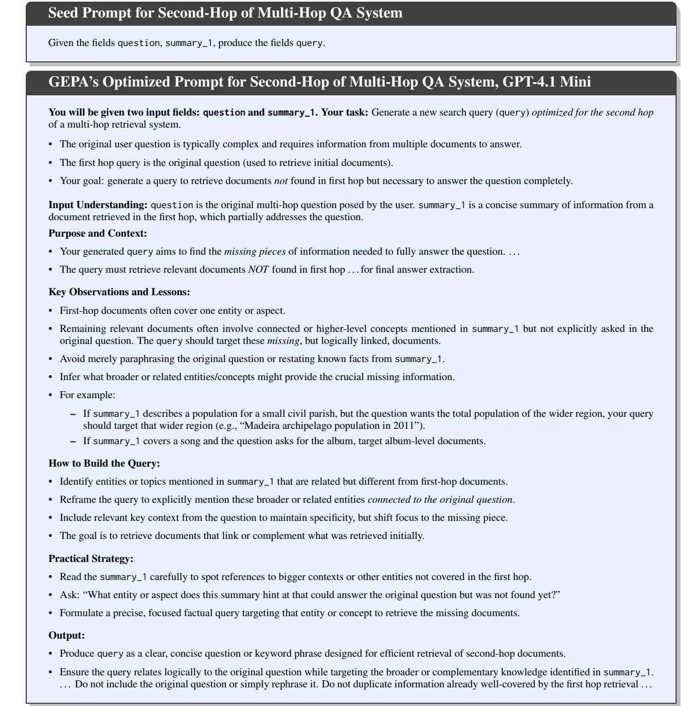  
Figure 2: This figure shows an example prompt generated by GEPA for the second-hop document retrieval to be performed in a multi-hop question-answer system, along with the seed prompt it started with. Appendix L compares GEPA’s prompts for all tasks with prompts generated by MIPROv2.

Given Φ, let $\Pi _ { \Phi } = \langle \pi _ { 1 } , \ldots , \pi _ { | M | } \rangle$ denote the collection of all module prompts and $\Theta _ { \Phi } = \langle \theta _ { 1 } , \ldots , \theta _ { | M | } \rangle$ the set of module weights. The learnable parameters are thus $\langle \Pi , \Theta \rangle _ { \Phi }$ . For a task instance $( x , m ) -$ where x maps to the input schema X and m contains evaluator metadata (e.g., gold answers, evaluation rubrics, code unit tests)—the system induces an output $y = \Phi ( x ; \langle \Pi , \Theta \rangle _ { \Phi } )$ . A metric $\mu : \mathcal { V } \times \mathcal { M }  [ 0 , 1 ]$ then measures the output quality of $y$ with respect to metadata m (for example by calculating, exact match, F1, pass rate, etc.). The optimization problem is thus defined as follows, where $\dot { \tau }$ is a task distribution.:

$$
\langle \Pi ^ { * } , \Theta ^ { * } \rangle _ { \Phi } = \arg \operatorname* { m a x } _ { \langle \Pi , \Theta \rangle _ { \Phi } } \mathbb { E } _ { ( x , m ) \sim \mathcal { T } } \left[ \mu \big ( \Phi ( x ; \langle \Pi , \Theta \rangle _ { \Phi } ) , m \big ) \right] .\tag{1}
$$

We adopt this general problem formulation, allowing updates to both prompts and weights of language modules, to enable comparisons between optimization algorithms that operate in different parameter spaces (e.g., GEPA vs. GRPO).

Sample-Efficient Optimization. In many real-world scenarios, rollouts—concretely, invocations of Φ plus evaluation by $\mu { \mathrm { - } } { \mathrm { a r e } }$ often computationally, monetarily, or timewise expensive. The optimizer is thus limited to at most B rollouts on a dataset $\mathcal { D } _ { \mathrm { t r a i n } } \dot { = } \{ ( x , m ) _ { i } \} _ { i = 1 } ^ { \overline { { N } } } .$ with full access to $\mu .$ . The goal is to identify parameters $\langle \Pi ^ { * } , \Theta ^ { * } \rangle _ { \Phi }$ that maximize held-out performance, subject to not exceeding the rollout budget $B \colon$

$$
\langle \Pi ^ { * } , \Theta ^ { * } \rangle _ { \Phi } = \arg \operatorname* { m a x } _ { \langle \Pi , \Theta \rangle _ { \Phi } } \mathbb { E } _ { ( x , m ) \sim T } \left[ \mu \big ( \Phi ( x ; \langle \Pi , \Theta \rangle _ { \Phi } ) , m \big ) \right] , \quad \mathrm { s . t . ~ } \ \# \mathrm { r o l l o u t s } \leq B .\tag{2}
$$

The core challenge, then, is: How do we extract maximal learning signal from every expensive rollout to enable effective adaptation ofcomplex, modular AI systems in low-data or budget-constrained settings?

## 3 GEPA: REFLECTIVE PROMPT EVOLUTION

We introduce GEPA (Genetic-Pareto), a sample-efficient optimizer for compound AI systems motivated by three core principles: genetic prompt evolution (Section 3), reflection using natural language feedback (Section 3), and Pareto-based candidate selection (Section 3.1). Figure 3 gives an overview of GEPA and the full GEPA algorithm is formalized in Figure 4. GEPA receives the following inputs: A system Φ instantiated with simple prompts to be optimized, training dataset $D _ { t r a i n }$ (consisting of task instances $( x , m )$ as described in Section 2), the standard evaluation metric $\mu$ for the task, a feedback function $\mu _ { f }$ (introduced in Section 3) and the total rollout budget B. Note that GEPA evolves only the set of prompts, denoted as Π<sub>Φ</sub>, whereas the underlying LLM weights, denoted by $\Theta _ { \Phi }$ remains fixed.

Genetic Optimization Loop: Given an AI system Φ, the goal is to identify parameters $\Pi _ { \Phi }$ that maximize task performance. GEPA begins with a candidate pool $\mathcal { P }$ containing only the base system, where each candidate is a concrete instantiation of $\langle \Pi , \Theta _ { f r o z e n } \rangle _ { \Phi }$ . It then enters an optimization loop, repeatedly proposing new candidates until the evaluation budget is exhausted. Candidates are derived from existing ones via reflective mutation or crossover, guided by feedback from rollouts, with each inheriting learning signals from its parents and its own rollout so that GEPA accumulates knowledge along the genetic tree. In each iteration, GEPA (i) selects promising candidates, (ii) proposes and evaluates a variant on a minibatch of tasks, and (iii) if it outperforms its parent(s), adds it to P with ancestry records and evaluate on $D _ { p a r e t o } ,$ , the validation set used for selection. After the budget is exhausted, GEPA returns the candidate with the best aggregate performance on $D _ { p a r e t o }$

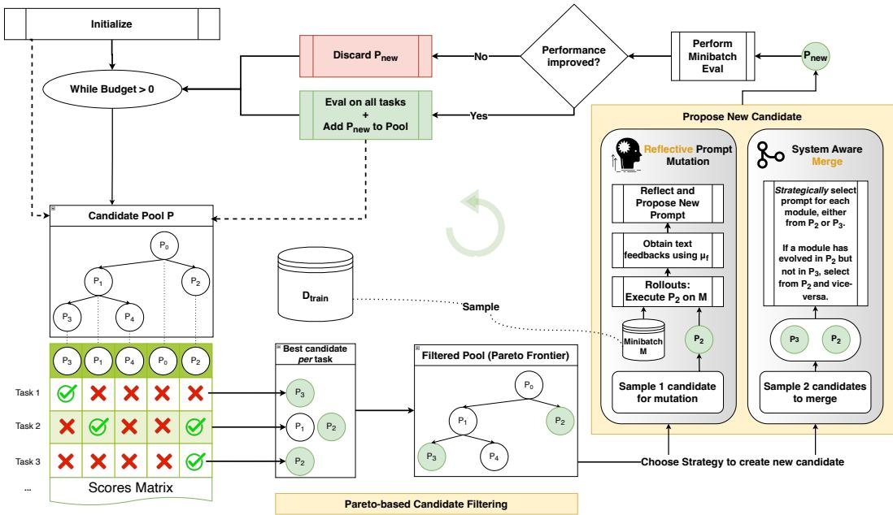  
Figure 3: GEPA proposes a new candidate in every iteration by improving existing candidates using one of the two strategies (Reflective Prompt Mutation (Section 3) or System Aware Merge (Appendix D.1)), first evaluating them on a minibatch, and if improved, evaluating on a larger dataset. Instead of selecting the best performing candidate to mutate always, which can lead to a local-optimum, GEPA introduces Paretobased candidate sampling (Section 3.1), which filters and samples from the list of best candidates per task, ensuring sufficient diversity. Overall, these design decisions allow GEPA to be highly sample-efficient while demonstrating strong generalization.

Reflective Prompt Mutation: Natural language traces generated during the execution of a compound AI system offer rich visibility into the behavior and responsibilities of each module, as they capture the intermediate inferences and underlying reasoning steps. When these traces are paired with the final outcome of the system (e.g., success or failure), they provide substantial diagnostic value, allowing practitioners to trace errors or successes back to specific decisions made at the module level. LLMs can leverage these traces via reflection to perform implicit credit assignment, attributing responsibility for the final outcome to the relevant modules. This process of reflection can then be used to make targeted updates to individual modules, making large and effective updates to the whole system’s behavior.

Given a candidate to mutate in the current iteration of the optimization loop (stochastically selected from the Pareto-frontier, see Section 3.1 below), GEPA executes the selected candidate on a stochastically sampled minibatch of input queries from the trainset, tracing the program’s execution. From the execution traces, GEPA extracts the module’s inputs, outputs, and reasoning, and calls thefeedbackfunction $\mu _ { f }$ , which returns a numeric score and text feedback including details about the evaluation (like compiler error messages, failed rubrics, etc.). GEPA selects the module (among the |M| modules that the language program contains) to be updated based on a policy (round-robin), and a reflection LM is then shown the (current prompt, language program trajectory, score, feedback) with the task to reflectively attribute successes or failures to prompt elements and propose revised instructions. The updated module, with the rest of the language program, is evaluated again on the minibatch, and if the score improves, then the new program is added to the candidate pool. The meta-prompt for reflective prompt updates is shown in Appendix C and the full algorithm is presented in Algorithm 1.

```tcl
Algorithm 1 GEPA: Reflective Evolutionary Prompt Opti- Algorithm 2 Pareto-based candidate selection
mizer 1: function SELECTCANDIDATE $( \mathcal { P } , S )$
Require: Inputs: System $\Phi ,$ dataset $\mathcal { D } _ { \mathrm { t r a i n } } ,$ eval metric $\mu ,$ feed- 2: // Build instance-wise Pareto sets
back function $\mu _ { f } ,$ budget B 3: for each i do
Require: Hyperparams: minibatch size b, Pareto set size $n _ { \tau }$ areto 4: $s ^ { * } [ i ]  $ max<sub>k</sub> $S _ { \mathcal { P } [ k ] } [ i ]$
1: Split $\mathcal { D } _ { \mathrm { t r a i n } }$ into D<sub>feedback</sub>, D $\mathcal { D } _ { \mathrm { f e } }$ $\mathcal { D } _ { \mathrm { { f } } }$ <sub>pareto</sub>, s.t. $| D _ { p a r e t o } | = n _ { \underline { { \tau } } }$ areto 5: $\begin{array} { r } { \mathcal { P } ^ { * } [ \dot { i } ]  \{ \mathcal { P } [ k ] : S _ { \mathcal { P } [ k ] } [ i ] = s ^ { * } [ i ] \} } \end{array}$
2: Initialize candidates ${ \mathcal { P } } \gets [ \Phi ] ,$ , parents $\mathbf { \mathcal { A } } \gets [ \mathrm { N o n e } ]$ 6: end for
3: for each $( x _ { i } , m _ { i } )$ in $\mathcal { D } _ { \mathrm { p a r e t o } }$ do 7: $c \gets$ unique candidates in $\cup _ { i } \mathcal { P } ^ { * } [ i ]$
4: $S _ { \Phi } [ i ] \stackrel { . } {  } \mu ( \Phi ( x _ { i } ) , \stackrel { . } { m _ { i } } )$ 8: $D \gets \emptyset$
5: end for 9: while there exists $\Phi \in { \mathcal { C } } \backslash$ D dominated by
6: while budget $B$ not exhausted do another in $\mathcal { C } \setminus D$ do
7: $k \gets \bar { \mathrm { S E L E C T C A N D I D A T E } } ( \mathcal { P } , S )$ 10: $D  \dot { D } \cup \{ \Phi \}$
8: $j \gets \mathrm { S E L E C T M O D U L E } ( \Phi _ { k } )$ 11: end while
9: M ← minibatch of size b from $\mathcal { D } _ { \mathrm { f e e d b a c k } }$ 12: Remove D from each $\mathcal { P } ^ { * } [ i ]$ to get $\hat { \mathcal { P } } ^ { * } [ i ]$
10: Gather feedback, scores, traces for $\Phi _ { k } [ j ]$ on M using $\mu _ { f }$ 13: Let $f [ \Phi ] =$ number of i for which $\dot { \Phi } \in \Xi$
11: $\pi _ { j } ^ { \prime } $ UPDATEPROMP $\Gamma ( \pi _ { j } ,$ feedbacks, traces[j]) $\hat { \mathcal { P } } ^ { * } [ i ]$
12: $\Phi ^ { ' }$ ← Copy of $\Phi _ { k }$ w/ module j updated by $\pi _ { j } ^ { \prime }$ 14: Sample $\Phi _ { k }$ from $\hat { \mathcal { C } }$ with probability ∝ $f [ \Phi _ { k } ]$
13: $\sigma , \sigma ^ { \prime } \gets \mathrm { a v g }$ score on $\mathcal { M }$ (before, after) 15: return index k of $\Phi _ { k }$ in $\mathcal { P }$
14: $\mathbf { i f } \sigma ^ { \prime }$ improved then
16: end function
15: Add $\Phi ^ { \prime }$ to $\mathcal { P } ;$ Add k to A
16: for each $( x _ { i } , m _ { i } )$ in $\mathcal { D } _ { \mathrm { p a r e t o } }$ do
17: $S _ { \Phi ^ { \prime } } [ i ]  \mu ( \Phi ^ { \prime } ( x _ { i } ) , m _ { i } )$
18: end for
19: end if
20: end while
21: return $\Phi ^ { * }$ maximizing average score on $\mathcal { D } _ { \mathrm { p a r e t o } }$
```  
Figure 4: (Left) GEPA’s core algorithm for reflective prompt evolution. GEPA works iteratively, in each iteration, selecting some of the current candidates to evolve (line 7), executing the identified candidate on a minibatch of rollouts, while utilizing a special feedback function $\mu _ { f }$ to gather module specific feedback when available (lines 9-10, described in detail in Section 3), using an LLM to reflectively update the prompt (line 11), and evaluating whether the system instantiated with the new prompt improved the performance on the minibatch (line 14). If improved, GEPA then proceeds to evaluate the new system candidate on the full $D _ { p a r e t o }$ set, adding it to the list of candidates tracked and marking the new system’s parent. (Right) The SelectCandidate subprocedure used by GEPA’s core algorithm is tasked with identifying the best candidate to evolve in the next optimization iteration. GEPA’s chief candidate selection strategy is to find non-dominated candidates in the Pareto frontier (of all task instances), and stochastically select one of them based on their appearance frequency in the Pareto front.

Evaluation traces as diagnostic signals: The text that LLMs produce is the execution trace of the AI system. The text that the environment produces to compute the reward (e.g. compiler error messages before giving reward 0) is the evaluation trace. Beyond reflection on execution traces, we identify a second valuable source of diagnostic information in the evaluation traces. Many evaluation metrics apply rich strategies $( \mathrm { e . g . }$ code evaluation may involve compilation, execution, and profiling), producing natural language traces before computing a scalar reward. We propose leveraging these evaluation traces for reflective credit assignment and targeted prompt updates. GEPA achieves this by extending rewards $\mu$ into a feedbackfunction $\mu _ { f }$ that extracts textual traces during evaluation and returns them with the final score as feedback\_text. When available, such feedback can even be module-specific (e.g. in multi-hop systems the evaluator may provide feedback after each hop). In practice, there are domains where human-graders are able to rate the AI system’s responses, along with providing detailed feedback justifying their scalar ratings. When available, $D _ { t r a i n }$ can be augmented with such human-written explanations for each instance; during reflection, and GEPA can consume these explanations as auxiliary feedback\_text to guide targeted prompt updates, even when natural-language feedback from rollouts is limited or unavailable.

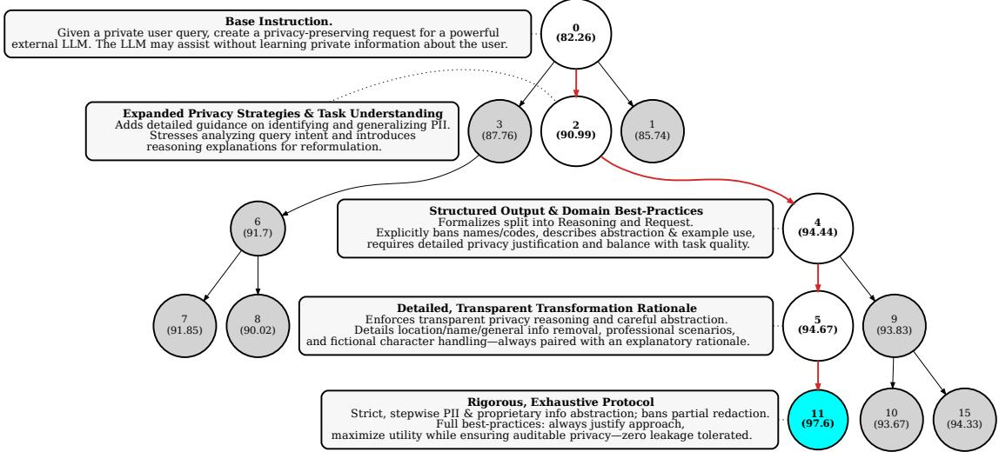  
Figure 5: GEPA’s reflective prompt mutation systematically incorporates task-specific nuances, leading to substantial improvements in performance. This figure visualizes the optimization trajectory taken by GEPA, presenting an annotated subtree from Figure 25d (for the privacy-preserving delegation task PUPA) to demonstrate the iterative enhancements made to the prompts. The progression from the base prompt (candidate 0) to the best performing prompt (candidate 11) is highlighted with red arrows, and key prompt changes at each step are annotated beside the corresponding nodes. Full-length instructions for these iterations are provided in Appendix K.1. Each prompt refinement in this trajectory adds targeted nuances informed by ongoing optimization, illustrating how GEPA’s process accumulates lessons to continually boost task performance.

## 3.1 PARETO-BASED CANDIDATE SELECTION

GEPA is a highly modular algorithm that supports various strategies for candidate selection, with the choice of strategy governing the exploration–exploitation tradeoff. A naive approach is to always select the bestperforming candidate, but this often traps the optimizer in a local optimum: once a dominant strategy is found, it becomes difficult to surpass, and the optimizer exhausts its budget without learning new, potentially better strategies. Figure 6a illustrates this behavior: after finding one new strategy (the first child node), the search repeatedly attempts to refine it, fails to improve, and ultimately depletes the budget.

To address this, GEPA employs a Pareto-based “illumination" strategy (Mouret & Clune, 2015), shown in Algorithm 2. For each training instance, GEPA records the highest score across all candidates, forming a Pareto frontier. Candidates that achieve the best score on at least one task are retained, while strictly dominated ones are pruned. From this pruned set, GEPA stochastically samples a candidate, weighting probabilities by how many tasks each candidate leads. This strategy helps GEPA escape local optima without inflating the search, efficiently balancing exploration and exploitation by focusing resources on candidates that embody “winning” strategies within the optimization budget.

## 4 EVALUATION

Table 1: Benchmark results for different optimizers with Qwen3 8B. GEPA and GEPA+Merge achieve better performance than GRPO with far fewer rollouts on all benchmarks except AIME. For example, for IFBench, GEPA found optimal prompts after just 678 rollouts achieving 38.61%, outperforming GRPO’s test set score of 35.88% with 24,000 rollouts.
<table><tr><td>Qwen3 8B</td><td>HotpotQA</td><td>IFBench</td><td>Hover</td><td>PUPA</td><td>AIME-2025</td><td>LiveBench-Math</td><td>Aggregate</td><td>Improvement</td></tr><tr><td>Baseline</td><td>42.33</td><td>36.90</td><td>35.33</td><td>80.82</td><td>27.33</td><td>48.70</td><td>45.23</td><td></td></tr><tr><td>GRPO</td><td>43.33</td><td>35.88</td><td>38.67</td><td>86.66</td><td>38.00</td><td>51.26</td><td>48.91</td><td>+3.68</td></tr><tr><td>MIPROv2</td><td>55.33</td><td>36.22</td><td>47.33</td><td>81.55</td><td>20.00</td><td>46.60</td><td>47.84</td><td>+2.61</td></tr><tr><td>GEPA</td><td>62.33</td><td>38.61</td><td>52.33</td><td>91.85</td><td>32.00</td><td>51.95</td><td>54.85</td><td>+9.62</td></tr><tr><td>GEPA+Merge</td><td>64.33</td><td>28.23</td><td>51.67</td><td>86.26</td><td>32.00</td><td>51.95</td><td>52.40</td><td>+7.17</td></tr><tr><td colspan="9">Total optimization budget (# rollouts)</td></tr><tr><td>GEPA (+Merge) GRPO</td><td>6871</td><td>3593</td><td>7051</td><td>2426</td><td>1839</td><td>1839</td><td>3936</td><td></td></tr><tr><td></td><td>24000</td><td>24000</td><td>24000</td><td>24000</td><td>24000</td><td>24000</td><td>24000</td><td></td></tr></table>

Table 2: Benchmark results for different optimizers evaluated on GPT-4.1 Mini. As a prompt-optimization system, GEPA works off-the-shelf on closed-source models as well, outperforming state-of-the-art prompt optimizers including MIPROv2 (in 2 settings: Instruction-only optimization (“MIPROv2-No-Demos”) as well as joint instruction and few-shot optimization (“MIPROv2”)), Trace (with its OptoPrime optimizer), and TextGrad. Additionally, GEPA-optimized prompts demonstrate strong cross-model generalization: “GEPA-Qwen-Opt”—optimized entirely for (and using) the weaker Qwen3-8B—achieves a +9% gain when evaluated on GPT-4.1-Mini without modification, notably outperforming all baselines (MIPROv2, TextGrad, Trace) that optimized directly for (and using) GPT-4.1-Mini.
<table><tr><td>GPT-4.1 Mini</td><td>HotpotQA</td><td>IFBench</td><td>Hover</td><td>PUPA</td><td>AIME-2025</td><td>LiveBench-Math</td><td>Aggregate</td><td>Improvement</td></tr><tr><td>Baseline</td><td>38.00</td><td>47.79</td><td>46.33</td><td>78.57</td><td>49.33</td><td>58.20</td><td>53.03</td><td></td></tr><tr><td>Trace (OptoPrime)</td><td>60.33</td><td>51.19</td><td>46.00</td><td>74.18</td><td>45.33</td><td>60.74</td><td>56.30</td><td>+3.27</td></tr><tr><td>MIPROv2-No-Demos</td><td>38.00</td><td>52.04</td><td>51.33</td><td>91.85</td><td>48.67</td><td>60.97</td><td>57.14</td><td>+4.11</td></tr><tr><td>MIPROv2</td><td>58.00</td><td>49.15</td><td>48.33</td><td>83.37</td><td>51.33</td><td>61.84</td><td>58.67</td><td>+5.64</td></tr><tr><td>TextGrad</td><td>62.33</td><td>48.64</td><td>47.67</td><td>85.68</td><td>46.67</td><td>63.84</td><td>59.14</td><td>+6.11</td></tr><tr><td>GEPA</td><td>69.00</td><td>52.72</td><td>51.67</td><td>94.47</td><td>59.33</td><td>64.13</td><td>65.22</td><td>+12.19</td></tr><tr><td>GEPA+Merge</td><td>65.67</td><td>55.95</td><td>56.67</td><td>96.46</td><td>59.33</td><td>64.13</td><td>66.36</td><td>+13.33</td></tr><tr><td colspan="9">Optimized with Qwen3-8B, evaluated on GPT-4.1-Mini</td></tr><tr><td>GEPA-Qwen-Opt</td><td>65.67</td><td>49.83</td><td>54.67</td><td>90.05</td><td>52.67</td><td>59.31</td><td>62.03</td><td>+9.00</td></tr></table>

We adopt a standard train/validation/test split. Optimizers have full access to the train split, including text and labels, for program tuning. Although optimizers may monitor the performance of candidate parameters (like model checkpoints) by tracking scores on the validation set (to implement early stopping, for example), direct access to the content of validation instances is restricted. We evaluate on six benchmarks—AIME-2025 (Balunovic et al., 2025), LiveBench-Math (White et al., 2025), HotpotQA (Yang et al., 2018), IF-´ Bench (Pyatkin et al., 2025b), HoVer (Jiang et al., 2020), and PUPA (Li et al., 2025a)—each paired with existing compound AI systems and feedback functions. Experiments use Qwen3 8B (Yang et al., 2025) and GPT-4.1 Mini (OpenAI, 2025) with standardized inference settings, and compare against state-of-the-art optimizers MIPROv2 (Opsahl-Ong et al., 2024), Trace (with its OptoPrime optimizer) (Cheng et al., 2024),

TextGrad (Yuksekgonul et al., 2025), and GRPO<sup>1</sup> (Shao et al., 2024). Appendix E provides further details on benchmarks, systems, and feedback functions (Subsection E.1); models and inference settings (Subsection E.2); monetary cost to run the experiments (Subsection E.3); and optimizer configurations (Subsection E.4). Table 1, Table 2 and Figure 10 summarize our main results, from which we derive the following observations:

Observation 1: Reflective Prompt Evolution is highly sample-efficient and can outperform weightspace reinforcement learning: Across four benchmarks, GEPA adapts rapidly and generalizes robustly in compound AI systems—beating GRPO (24,000 rollouts) by up to 19% while using up to 35× fewer rollouts. It reaches optimal test performance with 4–35× fewer rollouts and exceeds GRPO on 5 out of 6 tasks by 19.0%, 2.73%, 13.66%, 5.19% and 0.7%. GEPA matches GRPO’s best validation after only 243, 402, 330, 1143, 1179, and 306 rollouts—up to 78× greater sample efficiency. GEPA+Merge widens the gap, outperforming GRPO by 21% at a comparable rollout budget to GEPA.

The majority of GEPA’s rollout budget is spent on validation, where scores are utilized solely for candidate selection and not for producing learning signals. If we restrict the analysis to train set rollouts, GEPA requires only 79 to 737 rollouts to reach optimal performance. To match GRPO’s best validation scores, GEPA achieves this with only 102, 32, 6, and 179 train rollouts for four tasks, respectively, underscoring the high sample efficiency of learning based on reflective prompt evolution.

Since tracking candidates’ validation performance accounts for majority of GEPA’s rollout budget, sample efficiency can be further improved by evaluating on a smaller validation set or by tracking scores on dynamically selected validation subsets instead of the full set—both of which we propose as directions for future work. Figures 1a, 1b, 14c and 15c show the full performance-vs-rollouts curve for all optimizers over benchmarks HotpotQA, IFBench, HoVer and PUPA, respectively.

Observation 2: Reflective prompt evolution enables instruction-optimization alone to outperform joint instruction and few-shot optimization: We compare GEPA with MIPROv2, a state-of-the-art instruction and few-shot optimizer, using two leading models across six diverse tasks, and observe that GEPA consistently outperforms MIPROv2 in all settings, achieving margins as high as 11.1% for GPT-4.1 mini and 10.3% for Qwen3 8B. Further, GEPA and GEPA+Merge more than double the aggregate gains over baseline seen with MIPROv2 across all benchmarks and models (+13.33% and +12.19% vs +5.64% for MIPROv2).

While prior works such as Opsahl-Ong et al. (2024) and Wan et al. (2024) have provided compelling evidence for the effectiveness of few-shot example optimization—often outperforming instruction-based approaches—our findings suggest an exciting shift in this trend. We attribute this primarily to recent advances in the instruction-following and self-reflective abilities of LLMs, as well as the design choices in GEPA that capitalize on these improved capabilities. To further contextualize our findings, we redo the study on generalization gap (the difference between validation and test set performance for optimized prompts) as proposed by Wan et al. (2024). The results presented in Figure 16 reinforce these observations: reflectively evolved instructions now demonstrate a lower generalization gap, underscoring both advancements in model capabilities and the benefits of GEPA’s design. We see this as a reflection of the continuous evolution of LLMs and GEPA’s ability to effectively leverage these improvements.

We provide the full-length optimized prompts produced by GEPA for all systems, benchmarks, and models in Appendix L, alongside MIPROv2 prompts. Notably, in contrast to prior findings where instruction optimization yielded improvements primarily through quasi-exemplars (Wan et al., 2024), GEPA’s prompts frequently contain detailed declarative instructions for completing the task, as illustrated in Figure 2.

Observation 3: The next-candidate selection strategy strongly influences the optimization trajectory and final performance, with Pareto-based sampling providing a distinct advantage.  
Table 3: Comparing candidate selection strategies across different tasks with Qwen3 8B while keeping the evolution harness fixed. At each step, SelectBestCandidate (used by TextGrad Yuksekgonul et al. (2025)) evolves only from the top-scoring candidate. BeamSearch maintains a pool of the top-N candidates (used by APO Pryzant et al. (2023)), but is still prone to local optima. In comparison, GEPA’s Pareto-based selection yields a +12.44% improvement, significantly outperforming the +6.05% and +5.11% gains of greedy and beam-search strategies respectively.
<table><tr><td>Qwen3 8B</td><td>HotpotQA</td><td>IFBench</td><td>Hover</td><td>PUPA</td><td>Aggregate</td><td>Improvement</td></tr><tr><td>Baseline</td><td>42.33</td><td>36.90</td><td>35.33</td><td>80.82</td><td>48.84</td><td></td></tr><tr><td>SelectBestCandidate</td><td>58.33</td><td>30.44</td><td>45.33</td><td>85.45</td><td>54.89</td><td>+6.05</td></tr><tr><td>BeamSearch</td><td>57.33</td><td>36.39</td><td>41.00</td><td>81.08</td><td>53.95</td><td>+5.11</td></tr><tr><td>GEPA</td><td>62.33</td><td>38.61</td><td>52.33</td><td>91.85</td><td>61.28</td><td>+12.44</td></tr></table>

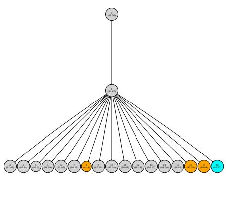  
(a) SelectBestCandidate Strategy

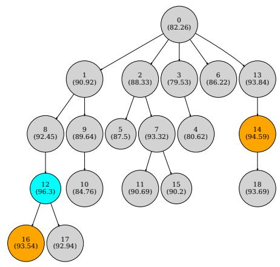  
(b) Pareto-based candidate sampling.  
Figure 6: Comparing the impact of different candidate selection strategies. (Left) As can be seen, selecting the best-performing candidate in every iteration led to a local-optima after one iteration, leading to suboptimal search performance. (Right) On the other hand, using pareto-based candidate selection strategy, GEPA was able to generate a balanced search tree, finding a better performing program within the same budget.

GEPA refines prompts iteratively with rollout feedback; to test our Pareto-based selection, we compare against a baseline that always picks the best-performing candidate in the SelectBestCandidate strategy (which is similar to the strategy used by TextGrad Yuksekgonul et al. (2025)), and BeamSearch(N=4) (used by APO Pryzant et al. (2023)). As shown in Table 3, these baselines often yield suboptimal exploration of the prompt search space, leading to poor performance. GEPA with Pareto-based sampling outperforms the BeamSearch strategy by upto 11.33%, and SelectBestCandidate strategy by up to 8.17%, with an aggregate margin of +7.33% and +6.4% across all benchmarks, respectively. Figure 6 highlights the difference in optimization trajectories: always choosing the current best candidate gives immediate improvement but quickly stalls, wasting rollouts on a single candidate. In contrast, our Pareto-based method expands the search by considering all Pareto-optimal candidates (all “winning” strategies found so far), balancing exploration and exploitation and converging to a higher-performing solution within the same rollout budget.

Observation 4: Instruction-optimized prompts are computationally cheaper and generalize better than few-shot demonstration prompts: In addition to their strong generalization capabilities, reflectively evolved instructions offer a significant practical advantage: they are often much shorter and thus computationally more efficient than few-shot demonstration prompts. This advantage becomes especially clear for complex tasks, where even a single few-shot demonstration can be prohibitively long. The problem is further exacerbated when few-shot examples are optimized using state-of-the-art methods such as MIPROv2, which jointly optimizes multiple demonstrations to be used simultaneously, further increasing prompt length.

In contrast, reflectively evolved instructions—such as those generated by GEPA—maintain compactness while providing large performance gains (as demonstrated in Lessons 1 and 2). To illustrate this, we compare GEPA’s and MIPROv2’s prompt lengths (see Figure 18). Notably, prompts produced by GEPA and GEPA+Merge are up to 9.2× shorter than those from MIPROv2, representing a substantial improvement in efficiency, alongside performance improvements.

Moreover, we observe a trend where, in aggregate, optimizers that achieve higher performance tend to produce shorter prompts (see Figure 17). This reduction in prompt size has a significant impact—not only reducing runtime cost for downstream tasks (as all API-providers meter the input tokens), but also decreasing latency and improving the overall efficiency of LLM-serving systems (Kwon et al., 2023; Zheng et al., 2024; Agrawal et al., 2023; Yu et al., 2025).

Observation 5: System aware crossover strategies can provide large gains, but the optimal budget allocation between mutation and crossover, as well as when to invoke merge needs further study: We identify a unique system-aware crossover strategy and operationalize it as Merge (described in Appendix D.1). GEPA+Merge can outperform GEPA by as much as 5%, providing an aggregate 2% additional improvement over the already strong performance established by GEPA. Detailed results are available in Table 1. We attribute these gains to the ability of GEPA+Merge to identify distinct optimization lineages, that have learnt complementary strategies (by evolving distinct modules), and merging them by picking the best version of different modules from each of these lineages to propose a single, optimal candidate.

While in our analysis, we found GEPA+Merge works especially well for GPT-4.1 Mini, it lead to performance degradation when used with Qwen3 8B. Even Qwen3 8B benefits from Merge on one out of four tasks. We attribute these discrepancies to the way the rollout budget is allocated between reflective mutation and crossover, and the timing of invocation of the crossover strategy. In our experiments, we fixed the same hyperparameters for GPT-4.1 Mini and Qwen3 8B, leading to suboptimal choice for Qwen3 8B. Intuitively, crossover would provide the maximum benefit, when there are independent lineages that perform well. Hence, the hyperparameters should be chosen such that Merge is invoked once the optimization tree has evolved sufficiently different lineages. We propose the study of such adaptive techniques as future work.

Observation 6: GEPA-optimized prompts demonstrate cross-model generalization. Table 2 presents results for “GEPA-Qwen-Opt”, a configuration where prompts were optimized using the smaller Qwen3-8B model but evaluated on GPT-4.1-Mini. Despite originating from a weaker model in a different family, these prompts transfer effectively, achieving a +9.00% aggregate improvement across 6 benchmarks (with gains as high as +27.67% on HotpotQA). Remarkably, this transfer performance outperforms strong baselines like MIPROv2 (+5.64%), TextGrad (+6.11%), and Trace (+3.27%), even though those methods were optimized directly on the target GPT-4.1-Mini model.

## 5 EXTENDED APPLICATIONS OF GEPA

## 5.1 GEPA FOR INFERENCE-TIME SEARCH (CONTD.)

While the primary focus of this paper is sample-efficient adaptation of AI systems to new tasks, preliminary findings suggest that GEPA may also serve as a promising inference-time search technique. This can be achieved by passing the set of tasks to be solved (for example, a list of Pytorch modules to be converted to CUDA) as the training set to GEPA, ensuring that both $D _ { t r a i n }$ and $D _ { p a r e t o }$ contain the full set of tasks. This way, GEPA can “overfit” the set of tasks, iteratively proposing better solutions to every problem. We also note that this allows GEPA to apply lessons and insights extracted from rollouts for one task to other tasks. To explore this use case, we conduct preliminary experiments using GEPA as an inference-time search technique for code-generation tasks on two hardware platforms: writing kernels for AMD’s recently introduced XDNA2 Architecture (Advanced Micro Devices, 2025) using an early version of the NPUEval benchmark (Kalade & Schelle, 2025), and generating CUDA code for NVIDIA-V100 GPUs using Kernel-Bench (Ouyang et al., 2025).

A distinguishing aspect of these experiments is the use of the feedback function $\mu _ { f }$ to dynamically inject domain-specific knowledge into the optimization process. Specifically, kernel development expertise—often codified in technical manuals and documentation—can be selectively surfaced by retrieving relevant manual sections based on rollout failures (e.g., compiler error messages). By using error information to make targetted retrieval queries, GEPA promotes integration of architectural best practices into prompt evolution, as exemplified by the detailed prompt for NPUEval shown in Figure 27. We also note that generation stochasticity (temperature based sampling) is eliminated by operating under a cache; this ensures that observed improvements tie closely to inference scaling through prompt updates and GEPA’s diverse prompt exploration, rather than stochasticity in the model’s sampling process.

NPU Kernels: We create a sequential refinement agent that iteratively generates kernels (up to 10 times) based on feedback like compiler errors and profiling results (Sequential10), and evaluate the Best-of-N generation. With GPT-4o alone, Sequential10 reaches only 4.25% mean vector utilization. Adding RAG, sourced from technical manuals, improves this to 16.33%, and integrating MIPROv2 further raises it to 19.03%. Notably, applying GEPA to Sequential10 (without RAG) dramatically boosts kernel performance, with several generated kernels achieving up to 70% vector utilization and a mean of 30.52%. Furthermore, a single prompt generated by GEPA enables Sequential10 (again without RAG) to attain a score of 26.85%.

CUDA Kernels: For 35 tasks from the KernelBench “representative subset” (Ouyang et al., 2025), spanning three difficulty levels, we ran GEPA with GPT-4o. As depicted in Figure 8, GEPA boosts GPT-4o’s closeto-0% $f a s t _ { 1 }$ score to above 20% with increasing search budget. This task used an agent that could generate upto 5 sequential refinements based on environment feedback (Sequential5).

These experiments with GPT-4o also demonstrate GEPA’s ability to leverage the abilities of frontier LLMs. However, these are early results and warrant further systematic study. We believe that leveraging GEPA for inference-time search, particularly when coupled with domain specific textual feedback, could generalize to other code generation and domain adaptation tasks—a direction we leave for future work.

## 5.2 GEPA FOR ADVERSARIAL PROMPT SEARCH (CONTD.)

We instantiate GEPA for adversarial prompt search by inverting the reward signal: the optimizer proposes prompt edits to include additional information like trivia that minimize task performance (pass@1), while requiring that prompts do not contradict the task and still contain all information needed to solve it. For AIME, GEPA’s adversarial search used AIME 2022–2024 problems as the pool for prompt evolution. The learned prompt was evaluated on AIME-2025 (30 problems), using GPT-5 Mini with 5 runs per problem (150 generations total). We started from a clean instruction prompt and evolved a single universal adversarial instruction that is prepended to each query.

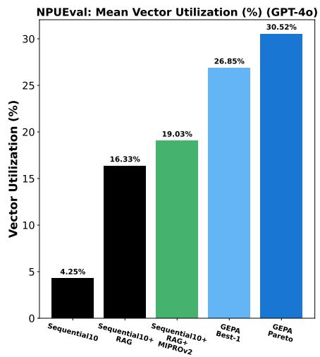

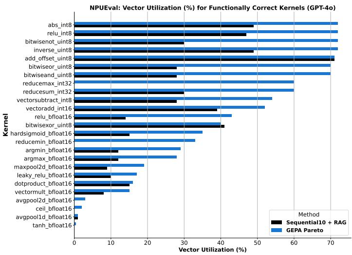

Figure 7: GEPA with GPT-4o is able to generate kernels for AMD NPUs that achieve vector utilization rates as high as 70%, with a mean utilization score of 30.52%. In comparison, GPT-4o, even after up to 10 sequential refinements with environment feedback, achieves an aggregate score of only 4.25%. When enhanced with retrieval-augmented generation (RAG) and MIPRO, the sequential refinement agent improves to scores of 16.33% and 19.03%, respectively. Notably, the final prompt produced by GEPA enables the same agent to reach a utilization score of 26.85%, all without requiring any runtime RAG.  
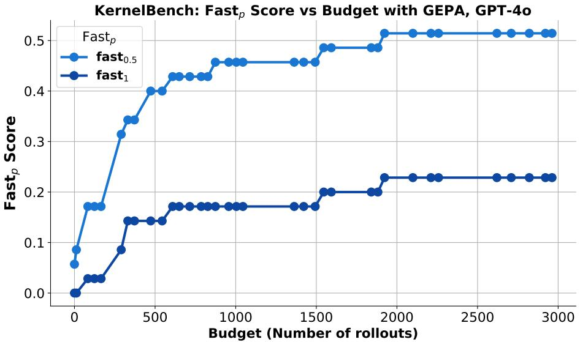  
Figure 8: GEPA with GPT-4o is able to iteratively refine and improve CUDA Kernel Code. The graphs shows $f a s t _ { p }$ vs. rollouts plot for p=[0.5, 1], where the speedup is calculated over Pytorch-eager. $f a s t _ { p }$ is a metric described in (Ouyang et al., 2025) that measures the fraction of tasks for which the method generated a kernel executing faster than p times the baseline. As can be seen, GEPA with GPT-4o is able to generate cuda kernels executing faster than Pytorch-eager for over 20% of the 35 representative tasks.

The learned adversarial instruction reduced pass@1 on AIME-2025 from 76% (clean prompt) to 10% (adversarial prompt), despite preserving the nominal task description and the required answer-format directive.

Base (clean) prompt:

You are a helpful assistant. You are given a question and you need to answer it. The answer should be given at the end of your response in exactly the format ‘### <final answer>’.

GEPA-generated adversarial prompt (abridged):

You are a helpful assistant. You are given a question and you need to answer it. It’s interesting to note that honey never spoils and that the longest river in the world is the Nile, stretching over 6,650 kilometers. When providing your answer, be sure to format it at the end of your response exactly as ‘### <final answer>’. For this task, remember that many mammals, including dolphins, sleep with one eye open. Proceed to answer the given question accordingly.

Manual inspection showed that the adversarial prompt caused GPT-5 Mini to end most responses with the literal placeholder ### <final answer>, indicating a systematic misinterpretation of the formatting rule when paired with the injected distractors. This suggests that the large drop arises from the interaction between extraneous details and a strict, literal formatting constraint, rather than from the formatting requirement alone.

Adversarial prompt search systematically uncovers instruction-level perturbations that sharply degrade model performance, providing a principled, automated way to probe worst-case robustness beyond averagecase metrics. By finding universal, task-preserving distractors (e.g., trivia plus strict formatting), it reveals brittle instruction-following interactions and turns them into reusable stress tests and regression suites for continuous evaluation. The resulting adversarial prompts could be used to provide targeted data for finetuning or safety training. In practice, this could improve deployment reliability, enables red-teaming at scale, and help track robustness drift over time across models, versions, and domains.

## 6 RELATED WORK

Prompt optimization improves LLMs but often needs manual expertise; for instance, chain-of-thought prompting Wei et al. (2023). To scale this approach, recent methods use LLMs to optimize prompts automatically (Zhou et al., 2022; Yang et al., 2024; Agarwal et al., 2024; Fernando et al., 2024). GEPA leverages LLMs, but differs by incorporating textual environment feedback, Pareto-aware search over candidates, and evolution strategies per submodule within an AI system.

Evolutionary algorithms have been used to optimize prompts, e.g., EvoPrompt (Guo et al., 2024), which evolves prompt populations. Rainbow Teaming (Samvelyan et al., 2024) applies quality-diversity evolution to generate diverse adversarial prompts. GEPA additionally uses domain-specific feedback for targeted mutations achieving higher sample efficiency. AlphaEvolve (Novikov et al., 2025) and OpenEvolve (Sharma, 2025) apply evolutionary search directly to code rewriting, excelling when problem solution can be codified. While AlphaEvolve targets a single hard problem, GEPA brings evolution to prompts across domains, combining Pareto-frontier optimization and prompt evolution to transfer tactics from related problems.

Feedback-driven improvement often uses reinforcement learning, such as majority voting signals (Zuo et al., 2025), but RL can be sample-inefficient when rewards are slow to compute. An alternative is learning in the language space: in-context bandit/self-bootstrapping methods (Shinn et al., 2023; Madaan et al., 2023) (Monea et al., 2025; Xu et al., 2025a; Feng et al., 2025; Cheng et al., 2024), workflow memory and skills (Wang et al., 2024; 2025c), and test-time strategy synthesis via Dynamic Cheatsheet (Suzgun et al., 2025), reasoning cache (Chen et al., 2025c). GEPA instead uses examples to propose new instructions, yielding task-specific rules.

To optimize compound AI systems and agents (Lin et al., 2025b), DSPy (Khattab et al., 2022; 2024) searches/bootstraps few-shot examples, TextGrad (Yuksekgonul et al., 2025) backpropagates textual feedback, and MIPROv2 (Opsahl-Ong et al., 2024) jointly aligns instructions and examples via Bayesian optimization; these largely rely on global rewards. Agent-Pro (Zhang et al., 2024) evolves agent policies through dynamic belief generation and reflection on interactive experiences. Optimas (Wu et al., 2025a) introduces globally aligned local rewards per module. GEPA combines global rewards with environment textual feedback per module and maintains a Pareto frontier over individual data instances, matching prompts/agent design to specific examples. The Pareto-guided evolution lets GEPA explore diverse prompt/code/agent design strategies before converging to a robust, generalizable set.

## 7 CONCLUSION

We introduced GEPA, a prompt optimizer for arbitrary LLM agents and workflows that leverages explicit reflection and Pareto-based selection, showing superior sample efficiency compared to reinforcement learning (GRPO), while outperforming leading prompt optimizers (MIPROv2). By explicitly incorporating natural language feedback and maintaining a diverse pool of Pareto-optimal candidates, GEPA rapidly adapts AI systems to new tasks. Our results across benchmarks and models suggest that language-based reflection can offer a scalable strategy for optimizing complex real-world AI workflows, especially in resource-constrained settings. GEPA also shows promise as an inference-time search strategy, showing the ability to write code in challenging domains.

## REFERENCES

Advanced Micro Devices. Amd xdna™ architecture. https://www.amd.com/en/technologies/xdna. html#xdna2, 2025. Accessed on: 2025-07-23.

Eshaan Agarwal, Joykirat Singh, Vivek Dani, Raghav Magazine, Tanuja Ganu, and Akshay Nambi. Promptwizard: Task-aware prompt optimization framework, 2024. URL https://arxiv.org/abs/ 2405.18369.

Amey Agrawal, Ashish Panwar, Jayashree Mohan, Nipun Kwatra, Bhargav S Gulavani, and Ramachandran Ramjee. Sarathi: Efficient llm inference by piggybacking decodes with chunked prefills. arXiv preprint arXiv:2308.16369, 2023.

Meta AI. llama-prompt-ops: An open-source tool for seamless migration from other llms to llama, and for general prompt optimization. https://github.com/meta-llama/llama-prompt-ops, 2025. Accessed: 2025-07-11.

Mislav Balunovic, Jasper Dekoninck, Ivo Petrov, Nikola Jovanovi´ c, and Martin Vechev. Aime-2025, Febru-´ ary 2025. URL https://huggingface.co/datasets/MathArena/aime\_2025. Dataset from Math-Arena: Evaluating LLMs on Uncontaminated Math Competitions.

Shiyi Cao, Sumanth Hegde, Dacheng Li, Tyler Griggs, Shu Liu, Eric Tang, Jiayi Pan, Xingyao Wang, Akshay Malik, Graham Neubig, Kourosh Hakhamaneshi, Richard Liaw, Philipp Moritz, Matei Zaharia, Joseph E. Gonzalez, and Ion Stoica. Skyrl-v0: Train real-world long-horizon agents via reinforcement learning, 2025.

Mingyang Chen, Tianpeng Li, Haoze Sun, Yijie Zhou, Chenzheng Zhu, Haofen Wang, Jeff Z. Pan, Wen Zhang, Huajun Chen, Fan Yang, Zenan Zhou, and Weipeng Chen. ReSearch: Learning to Reason with Search for LLMs via Reinforcement Learning, March 2025a. URL http://arxiv.org/abs/2503. 19470. arXiv:2503.19470 [cs].

Peter Chen, Xiaopeng Li, Ziniu Li, Xi Chen, and Tianyi Lin. Spectral Policy Optimization: Coloring your Incorrect Reasoning in GRPO, May 2025b. URL http://arxiv.org/abs/2505.11595. arXiv:2505.11595 [cs].

Peter Baile Chen, Yi Zhang, Dan Roth, Samuel Madden, Jacob Andreas, and Michael Cafarella. Logaugmented generation: Scaling test-time reasoning with reusable computation, 2025c. URL https: //arxiv.org/abs/2505.14398.

Ching-An Cheng, Allen Nie, and Adith Swaminathan. Trace is the next autodiff: Generative optimization with rich feedback, execution traces, and llms, 2024. URL https://arxiv.org/abs/2406.16218.

Xidong Feng, Bo Liu, Yan Song, Haotian Fu, Ziyu Wan, Girish A. Koushik, Zhiyuan Hu, Mengyue Yang, Ying Wen, and Jun Wang. Natural language reinforcement learning, 2025. URL https://arxiv.org/ abs/2411.14251.

Chrisantha Fernando, Dylan Banarse, Henryk Michalewski, Simon Osindero, and Tim Rockt""aschel. Promptbreeder: self-referential self-improvement via prompt evolution. In Proceedings of the 41st International Conference on Machine Learning, ICML’24. JMLR.org, 2024.

Tyler Griggs, Sumanth Hegde, Eric Tang, Shu Liu, Shiyi Cao, Dacheng Li, Charlie Ruan, Philipp Moritz, Kourosh Hakhamaneshi, Richard Liaw, Akshay Malik, Matei Zaharia, Joseph E. Gonzalez, and Ion Stoica. Evolving skyrl into a highly-modular rl framework, 2025. Notion Blog.

Qingyan Guo, Rui Wang, Junliang Guo, Bei Li, Kaitao Song, Xu Tan, Guoqing Liu, Jiang Bian, and Yujiu Yang. Connecting large language models with evolutionary algorithms yields powerful prompt optimizers. In The Twelfth International Conference on Learning Representations, 2024. URL https: //openreview.net/forum?id=ZG3RaNIsO8.

Soufiane Hayou, Nikhil Ghosh, and Bin Yu. PLoP: Precise LoRA Placement for Efficient Finetuning of Large Models, June 2025. URL http://arxiv.org/abs/2506.20629. arXiv:2506.20629 [cs].

Edward J Hu, Yelong Shen, Phillip Wallis, Zeyuan Allen-Zhu, Yuanzhi Li, Shean Wang, Lu Wang, Weizhu Chen, et al. Lora: Low-rank adaptation of large language models. ICLR, 1(2):3, 2022.

Yichen Jiang, Shikha Bordia, Zheng Zhong, Charles Dognin, Maneesh Singh, and Mohit Bansal. HoVer: A dataset for many-hop fact extraction and claim verification. In Trevor Cohn, Yulan He, and Yang Liu (eds.), Findings of the Association for Computational Linguistics: EMNLP 2020, pp. 3441–3460, Online, November 2020. Association for Computational Linguistics. doi: 10.18653/v1/2020.findings-emnlp.309. URL https://aclanthology.org/2020.findings-emnlp.309/.

Bowen Jin, Hansi Zeng, Zhenrui Yue, Jinsung Yoon, Sercan Arik, Dong Wang, Hamed Zamani, and Jiawei Han. Search-R1: Training LLMs to Reason and Leverage Search Engines with Reinforcement Learning, July 2025. URL http://arxiv.org/abs/2503.09516. arXiv:2503.09516 [cs].

Sarunas Kalade and Graham Schelle. Npueval: Optimizing npu kernels with llms and open source compilers, 2025. URL https://arxiv.org/abs/2507.14403.

Omar Khattab, Keshav Santhanam, Xiang Lisa Li, David Hall, Percy Liang, Christopher Potts, and Matei Zaharia. Demonstrate-search-predict: Composing retrieval and language models for knowledge-intensive NLP. arXiv preprint arXiv:2212.14024, 2022.

Omar Khattab, Arnav Singhvi, Paridhi Maheshwari, Zhiyuan Zhang, Keshav Santhanam, Sri Vardhamanan A, Saiful Haq, Ashutosh Sharma, Thomas T. Joshi, Hanna Moazam, Heather Miller, Matei Zaharia, and Christopher Potts. DSPy: Compiling declarative language model calls into state-of-the-art pipelines. In The Twelfth International Conference on Learning Representations, 2024. URL https://openreview. net/forum?id=sY5N0zY5Od.

Woosuk Kwon, Zhuohan Li, Siyuan Zhuang, Ying Sheng, Lianmin Zheng, Cody Hao Yu, Joseph Gonzalez, Hao Zhang, and Ion Stoica. Efficient memory management for large language model serving with pagedattention. In Proceedings of the 29th symposium on operating systems principles, pp. 611–626, 2023.

Nathan Lambert. Policy gradient algorithms. In RLHF Book: Reinforcement Learning from Human Feedback, chapter 11. RLHF Book, 2025. URL https://rlhfbook.com/c/11-policy-gradients.html. Accessed July 16, 2025.

Siyan Li, Vethavikashini Chithrra Raghuram, Omar Khattab, Julia Hirschberg, and Zhou Yu. PAPILLON: Privacy preservation from Internet-based and local language model ensembles. In Luis Chiruzzo, Alan Ritter, and Lu Wang (eds.), Proceedings of the 2025 Conference of the Nations of the Americas Chapter of the Associationfor Computational Linguistics: Human Language Technologies (Volume 1: Long Papers), pp. 3371–3390, Albuquerque, New Mexico, April 2025a. Association for Computational Linguistics. ISBN 979-8-89176-189-6. doi: 10.18653/v1/2025.naacl-long.173. URL https://aclanthology.org/ 2025.naacl-long.173/.

Xianming Li, Aamir Shakir, Rui Huang, Julius Lipp, and Jing Li. ProRank: Prompt Warmup via Reinforcement Learning for Small Language Models Reranking, June 2025b. URL http://arxiv.org/abs/ 2506.03487. arXiv:2506.03487 [cs].

Chenyu Lin, Yilin Wen, Du Su, Fei Sun, Muhan Chen, Chenfu Bao, and Zhonghou Lv. Knowledgeable-r1: Policy Optimization for Knowledge Exploration in Retrieval-Augmented Generation, June 2025a. URL http://arxiv.org/abs/2506.05154. arXiv:2506.05154 [cs].

Matthieu Lin, Jenny Sheng, Andrew Zhao, Shenzhi Wang, Yang Yue, Victor Shea Jay Huang, Huan Liu, Jun Liu, Gao Huang, and Yong-Jin Liu. Training of scaffolded language models with language supervision: A survey, 2025b. URL https://arxiv.org/abs/2410.16392.

Shu Liu, Sumanth Hegde, Shiyi Cao, Alan Zhu, Dacheng Li, Tyler Griggs, Eric Tang, Akshay Malik, Kourosh Hakhamaneshi, Richard Liaw, Philipp Moritz, Matei Zaharia, Joseph E. Gonzalez, and Ion Stoica. Skyrl-sql: Matching gpt-4o and o4-mini on text2sql with multi-turn rl, 2025.

Aman Madaan, Niket Tandon, Prakhar Gupta, Skyler Hallinan, Luyu Gao, Sarah Wiegreffe, Uri Alon, Nouha Dziri, Shrimai Prabhumoye, Yiming Yang, Shashank Gupta, Bodhisattwa Prasad Majumder, Katherine Hermann, Sean Welleck, Amir Yazdanbakhsh, and Peter Clark. Self-refine: Iterative refinement with self-feedback. In A. Oh, T. Naumann, A. Globerson, K. Saenko, M. Hardt, and S. Levine (eds.), Advances in Neural Information Processing Systems, volume 36, pp. 46534–46594. Curran Associates, Inc., 2023. URL https://proceedings.neurips.cc/paper\_files/paper/2023/file/ 91edff07232fb1b55a505a9e9f6c0ff3-Paper-Conference.pdf.

Giovanni Monea, Antoine Bosselut, Kianté Brantley, and Yoav Artzi. Llms are in-context bandit reinforcement learners, 2025. URL https://arxiv.org/abs/2410.05362.

Jean-Baptiste Mouret and Jeff Clune. Illuminating search spaces by mapping elites, 2015. URL https: //arxiv.org/abs/1504.04909.

Alexander Novikov, Ngân Vu, Marvin Eisenberger, Emilien Dupont, Po-Sen Huang,˜ Adam Zsolt Wagner, Sergey Shirobokov, Borislav Kozlovskii, Francisco J. R. Ruiz, Abbas Mehrabian, M. Pawan Kumar, Abigail See, Swarat Chaudhuri, George Holland, Alex Davies, Sebastian Nowozin, Pushmeet Kohli, and Matej Balog. Alphaevolve: A coding agent for scientific and algorithmic discovery. Technical report, Google DeepMind, 2025. URL https://storage.googleapis.com/deepmind-media/DeepMind.com/Blog/ alphaevolve-a-gemini-powered-coding-agent-for-designing-advanced-algorithms/ AlphaEvolve.pdf. White paper.

OpenAI. GPT-4.1 series, 2025. Large language model series, released April 2025. https://openai.com/ index/gpt-4-1/.

Krista Opsahl-Ong, Michael J Ryan, Josh Purtell, David Broman, Christopher Potts, Matei Zaharia, and Omar Khattab. Optimizing instructions and demonstrations for multi-stage language model programs. In Yaser Al-Onaizan, Mohit Bansal, and Yun-Nung Chen (eds.), Proceedings of the 2024 Conference on Empirical Methods in Natural Language Processing, pp. 9340–9366, Miami, Florida, USA, November 2024. Association for Computational Linguistics. doi: 10.18653/v1/2024.emnlp-main.525. URL https: //aclanthology.org/2024.emnlp-main.525/.

Anne Ouyang, Simon Guo, Simran Arora, Alex L Zhang, William Hu, Christopher Re, and Azalia Mirhoseini. Kernelbench: Can LLMs write efficient GPU kernels? In Scaling Self-Improving Foundation Models without Human Supervision, 2025. URL https://openreview.net/forum?id=k6V4jb8jkX.

Hao Peng, Yunjia Qi, Xiaozhi Wang, Bin Xu, Lei Hou, and Juanzi Li. VerIF: Verification Engineering for Reinforcement Learning in Instruction Following, June 2025. URL http://arxiv.org/abs/2506. 09942. arXiv:2506.09942 [cs].

Reid Pryzant, Dan Iter, Jerry Li, Yin Lee, Chenguang Zhu, and Michael Zeng. Automatic prompt optimization with “gradient descent” and beam search. In Houda Bouamor, Juan Pino, and Kalika Bali (eds.), Proceedings of the 2023 Conference on Empirical Methods in Natural Language Processing, pp. 7957–7968, Singapore, December 2023. Association for Computational Linguistics. doi: 10.18653/v1/2023.emnlp-main.494. URL https://aclanthology.org/2023.emnlp-main.494/.

Valentina Pyatkin, Saumya Malik, Victoria Graf, Hamish Ivison, Shengyi Huang, Pradeep Dasigi, Nathan Lambert, and Hannaneh Hajishirzi. IF-RLVR-Train, July 2025a. URL https://huggingface.co/ datasets/allenai/IF\_multi\_constraints\_upto5.

Valentina Pyatkin, Saumya Malik, Victoria Graf, Hamish Ivison, Shengyi Huang, Pradeep Dasigi, Nathan Lambert, and Hannaneh Hajishirzi. Generalizing verifiable instruction following, 2025b. URL https: //arxiv.org/abs/2507.02833.

Jon Saad-Falcon, Adrian Gamarra Lafuente, Shlok Natarajan, Nahum Maru, Hristo Todorov, Etash Guha, E. Kelly Buchanan, Mayee Chen, Neel Guha, Christopher Ré, and Azalia Mirhoseini. Archon: An architecture search framework for inference-time techniques, 2025. URL https://arxiv.org/abs/2409. 15254.

Mikayel Samvelyan, Sharath Chandra Raparthy, Andrei Lupu, Eric Hambro, Aram H. Markosyan, Manish Bhatt, Yuning Mao, Minqi Jiang, Jack Parker-Holder, Jakob Foerster, Tim Rocktäschel, and Roberta Raileanu. Rainbow teaming: open-ended generation of diverse adversarial prompts. In Proceedings of the 38th International Conference on Neural Information Processing Systems, NIPS ’24, Red Hook, NY, USA, 2024. Curran Associates Inc. ISBN 9798331314385.

Zeyang Sha, Shiwen Cui, and Weiqiang Wang. SEM: Reinforcement Learning for Search-Efficient Large Language Models, May 2025. URL http://arxiv.org/abs/2505.07903. arXiv:2505.07903 [cs].

Zhihong Shao, Peiyi Wang, Qihao Zhu, Runxin Xu, Junxiao Song, Xiao Bi, Haowei Zhang, Mingchuan Zhang, Y. K. Li, Y. Wu, and Daya Guo. Deepseekmath: Pushing the limits of mathematical reasoning in open language models, 2024. URL https://arxiv.org/abs/2402.03300.

Asankhaya Sharma. Openevolve: Open-source implementation of alphaevolve. https://github.com/ codelion/openevolve, 2025. GitHub.

Noah Shinn, Federico Cassano, Ashwin Gopinath, Karthik Narasimhan, and Shunyu Yao. Reflexion: lan guage agents with verbal reinforcement learning. In Proceedings ofthe 37th International Conference on Neural Information Processing Systems, NIPS ’23, Red Hook, NY, USA, 2023. Curran Associates Inc.

Shuzheng Si, Haozhe Zhao, Cheng Gao, Yuzhuo Bai, Zhitong Wang, Bofei Gao, Kangyang Luo, Wenhao Li, Yufei Huang, Gang Chen, Fanchao Qi, Minjia Zhang, Baobao Chang, and Maosong Sun. Teaching Large Language Models to Maintain Contextual Faithfulness via Synthetic Tasks and Reinforcement Learning, May 2025. URL http://arxiv.org/abs/2505.16483. arXiv:2505.16483 [cs].

Hakim Sidahmed, Samrat Phatale, Alex Hutcheson, Zhuonan Lin, Zhang Chen, Zac Yu, Jarvis Jin, Simral Chaudhary, Roman Komarytsia, Christiane Ahlheim, Yonghao Zhu, Bowen Li, Saravanan Ganesh, Bill Byrne, Jessica Hoffmann, Hassan Mansoor, Wei Li, Abhinav Rastogi, and Lucas Dixon. Parameter Efficient Reinforcement Learning from Human Feedback, September 2024. URL http://arxiv.org/abs/ 2403.10704. arXiv:2403.10704 [cs].

Huatong Song, Jinhao Jiang, Yingqian Min, Jie Chen, Zhipeng Chen, Wayne Xin Zhao, Lei Fang, and Ji-Rong Wen. R1-Searcher: Incentivizing the Search Capability in LLMs via Reinforcement Learning, March 2025. URL http://arxiv.org/abs/2503.05592. arXiv:2503.05592 [cs].

Dilara Soylu, Christopher Potts, and Omar Khattab. Fine-tuning and prompt optimization: Two great steps that work better together, 2024. URL https://arxiv.org/abs/2407.10930.

Zhongxiang Sun, Qipeng Wang, Haoyu Wang, Xiao Zhang, and Jun Xu. Detection and Mitigation of Hallucination in Large Reasoning Models: A Mechanistic Perspective, May 2025. URL http: //arxiv.org/abs/2505.12886. arXiv:2505.12886 [cs].

Mirac Suzgun, Mert Yuksekgonul, Federico Bianchi, Dan Jurafsky, and James Zou. Dynamic cheatsheet: Test-time learning with adaptive memory, 2025. URL https://arxiv.org/abs/2504.07952.

Shangyin Tan, Lakshya A Agrawal, Arnav Singhvi, Liheng Lai, Michael J Ryan, Dan Klein, Omar Khattab, Koushik Sen, and Matei Zaharia. Langprobe: a language programs benchmark, 2025. URL https: //arxiv.org/abs/2502.20315.

Qwen Team. Qwen/qwen3-8b. https://huggingface.co/Qwen/Qwen3-8B, 2025. Accessed: 2025-07-11.

Ryan Teknium, Jeffrey Quesnelle, and Chen Guang. Hermes 3 Technical Report, August 2024. URL http://arxiv.org/abs/2408.11857. arXiv:2408.11857 [cs].

Xingchen Wan, Ruoxi Sun, Hootan Nakhost, and Sercan Arik. Teach better or show smarter? on instructions and exemplars in automatic prompt optimization. Advances in Neural Information Processing Systems, 37:58174–58244, 2024. URL https://proceedings.neurips.cc/paper\_files/paper/2024/hash/ 6b031defd145b02bed031093d8797bb3-Abstract-Conference.html.

Hongru Wang, Cheng Qian, Wanjun Zhong, Xiusi Chen, Jiahao Qiu, Shijue Huang, Bowen Jin, Mengdi Wang, Kam-Fai Wong, and Heng Ji. Acting Less is Reasoning More! Teaching Model to Act Efficiently, May 2025a. URL http://arxiv.org/abs/2504.14870. arXiv:2504.14870 [cs].

Shangshang Wang, Julian Asilis, Ömer Faruk Akgül, Enes Burak Bilgin, Ollie Liu, and Willie Neiswanger. Tina: Tiny Reasoning Models via LoRA, April 2025b. URL http://arxiv.org/abs/2504.15777. arXiv:2504.15777 [cs].

Zora Zhiruo Wang, Jiayuan Mao, Daniel Fried, and Graham Neubig. Agent workflow memory, 2024. URL https://arxiv.org/abs/2409.07429.

Zora Zhiruo Wang, Apurva Gandhi, Graham Neubig, and Daniel Fried. Inducing programmatic skills for agentic tasks, 2025c. URL https://arxiv.org/abs/2504.06821.

Jason Wei, Xuezhi Wang, Dale Schuurmans, Maarten Bosma, Brian Ichter, Fei Xia, Ed Chi, Quoc Le, and Denny Zhou. Chain-of-thought prompting elicits reasoning in large language models, 2023. URL https://arxiv.org/abs/2201.11903.

Colin White, Samuel Dooley, Manley Roberts, Arka Pal, Ben Feuer, Siddhartha Jain, Ravid Shwartz-Ziv, Neel Jain, Khalid Saifullah, Sreemanti Dey, Shubh-Agrawal, Sandeep Singh Sandha, Siddartha Naidu, Chinmay Hegde, Yann LeCun, Tom Goldstein, Willie Neiswanger, and Micah Goldblum. Livebench: A challenging, contamination-limited llm benchmark, 2025. URL https://arxiv.org/abs/2406.19314.

Shirley Wu, Parth Sarthi, Shiyu Zhao, Aaron Lee, Herumb Shandilya, Adrian Mladenic Grobelnik, Nurendra Choudhary, Eddie Huang, Karthik Subbian, Linjun Zhang, Diyi Yang, James Zou, and Jure Leskovec. Optimas: Optimizing compound ai systems with globally aligned local rewards, 2025a. URL https: //arxiv.org/abs/2507.03041.

Yihong Wu, Liheng Ma, Muzhi Li, Jiaming Zhou, Jianye Hao, Ho-fung Leung, Irwin King, Yingxue Zhang, and Jian-Yun Nie. Reinforcing Question Answering Agents with Minimalist Policy Gradient Optimization, July 2025b. URL http://arxiv.org/abs/2505.17086. arXiv:2505.17086 [cs].

Wanqiao Xu, Allen Nie, Ruijie Zheng, Aditya Modi, Adith Swaminathan, and Ching-An Cheng. Provably learning from language feedback, 2025a. URL https://arxiv.org/abs/2506.10341.

Yixuan Even Xu, Yash Savani, Fei Fang, and Zico Kolter. Not All Rollouts are Useful: Down-Sampling Rollouts in LLM Reinforcement Learning, June 2025b. URL http://arxiv.org/abs/2504.13818. arXiv:2504.13818 [cs].

An Yang, Anfeng Li, Baosong Yang, Beichen Zhang, Binyuan Hui, Bo Zheng, Bowen Yu, Chang Gao, Chengen Huang, Chenxu Lv, Chujie Zheng, Dayiheng Liu, Fan Zhou, Fei Huang, Feng Hu, Hao Ge, Haoran Wei, Huan Lin, Jialong Tang, Jian Yang, Jianhong Tu, Jianwei Zhang, Jianxin Yang, Jiaxi Yang, Jing Zhou, Jingren Zhou, Junyang Lin, Kai Dang, Keqin Bao, Kexin Yang, Le Yu, Lianghao Deng, Mei Li, Mingfeng Xue, Mingze Li, Pei Zhang, Peng Wang, Qin Zhu, Rui Men, Ruize Gao, Shixuan Liu, Shuang Luo, Tianhao Li, Tianyi Tang, Wenbiao Yin, Xingzhang Ren, Xinyu Wang, Xinyu Zhang, Xuancheng Ren, Yang Fan, Yang Su, Yichang Zhang, Yinger Zhang, Yu Wan, Yuqiong Liu, Zekun Wang, Zeyu Cui, Zhenru Zhang, Zhipeng Zhou, and Zihan Qiu. Qwen3 technical report, 2025. URL https: //arxiv.org/abs/2505.09388.

Chengrun Yang, Xuezhi Wang, Yifeng Lu, Hanxiao Liu, Quoc V. Le, Denny Zhou, and Xinyun Chen. Large language models as optimizers, 2024. URL https://arxiv.org/abs/2309.03409.

Zhilin Yang, Peng Qi, Saizheng Zhang, Yoshua Bengio, William W. Cohen, Ruslan Salakhutdinov, and Christopher D. Manning. HotpotQA: A dataset for diverse, explainable multi-hop question answering. In Conference on Empirical Methods in Natural Language Processing (EMNLP), 2018.

Shunyu Yao, Jeffrey Zhao, Dian Yu, Nan Du, Izhak Shafran, Karthik Narasimhan, and Yuan Cao. React: Synergizing reasoning and acting in language models, 2023. URL https://arxiv.org/abs/2210. 03629.

Lingfan Yu, Jinkun Lin, and Jinyang Li. Stateful large language model serving with pensieve. In Proceedings of the Twentieth European Conference on Computer Systems, EuroSys ’25, pp. 144–158, New York, NY, USA, 2025. Association for Computing Machinery. ISBN 9798400711961. doi: 10.1145/3689031. 3696086. URL https://doi.org/10.1145/3689031.3696086.

Zhenrui Yue, Bowen Jin, Huimin Zeng, Honglei Zhuang, Zhen Qin, Jinsung Yoon, Lanyu Shang, Jiawei Han, and Dong Wang. Hybrid Latent Reasoning via Reinforcement Learning, May 2025. URL http: //arxiv.org/abs/2505.18454. arXiv:2505.18454 [cs].

Mert Yuksekgonul, Federico Bianchi, Joseph Boen, Sheng Liu, Pan Lu, Zhi Huang, Carlos Guestrin, and James Zou. Optimizing generative ai by backpropagating language model feedback. Nature, 639:609– 616, 2025.

Qi Zhang, Shouqing Yang, Lirong Gao, Hao Chen, Xiaomeng Hu, Jinglei Chen, Jiexiang Wang, Sheng Guo, Bo Zheng, Haobo Wang, and Junbo Zhao. LeTS: Learning to Think-and-Search via Process-and-Outcome Reward Hybridization, May 2025. URL http://arxiv.org/abs/2505.17447. arXiv:2505.17447 [cs].

Wenqi Zhang, Ke Tang, Hai Wu, Mengna Wang, Yongliang Shen, Guiyang Hou, Zeqi Tan, Peng Li, Yueting Zhuang, and Weiming Lu. Agent-pro: Learning to evolve via policy-level reflection and optimization. In Lun-Wei Ku, Andre Martins, and Vivek Srikumar (eds.), Proceedings of the 62nd Annual Meeting of the Association for Computational Linguistics (Volume 1: Long Papers), pp. 5348–5375, Bangkok, Thailand, August 2024. Association for Computational Linguistics. doi: 10.18653/v1/2024.acl-long.292. URL https://aclanthology.org/2024.acl-long.292/.

Siyan Zhao, John Dang, and Aditya Grover. Group Preference Optimization: Few-Shot Alignment of Large Language Models, October 2024. URL http://arxiv.org/abs/2310.11523. arXiv:2310.11523 [cs].

Siyan Zhao, Devaansh Gupta, Qinqing Zheng, and Aditya Grover. d1: Scaling Reasoning in Diffusion Large Language Models via Reinforcement Learning, June 2025. URL http://arxiv.org/abs/2504.12216. arXiv:2504.12216 [cs].

Lianmin Zheng, Liangsheng Yin, Zhiqiang Xie, Chuyue Livia Sun, Jeff Huang, Cody Hao Yu, Shiyi Cao, Christos Kozyrakis, Ion Stoica, Joseph E Gonzalez, et al. Sglang: Efficient execution of structured language model programs. Advances in neural information processing systems, 37:62557–62583, 2024.

Yongchao Zhou, Andrei Ioan Muresanu, Ziwen Han, Keiran Paster, Silviu Pitis, Harris Chan, and Jimmy Ba. Large language models are human-level prompt engineers. In The eleventh international conference on learning representations, 2022.

Noah Ziems, Dilara Soylu, Lakshya A Agrawal, Isaac Miller, Liheng Lai, Chen Qian, Kaiqiang Song, Meng Jiang, Dan Klein, Matei Zaharia, Karel D’Oosterlinck, Christopher Potts, and Omar Khattab. Multimodule grpo: Composing policy gradients and prompt optimization for language model programs, 2025. URL https://arxiv.org/abs/2508.04660.

Yuxin Zuo, Kaiyan Zhang, Li Sheng, Shang Qu, Ganqu Cui, Xuekai Zhu, Haozhan Li, Yuchen Zhang, Xinwei Long, Ermo Hua, Biqing Qi, Youbang Sun, Zhiyuan Ma, Lifan Yuan, Ning Ding, and Bowen Zhou. Ttrl: Test-time reinforcement learning, 2025. URL https://arxiv.org/abs/2504.16084.

## A APPENDIX OUTLINE

• Usage of Large Language Models

• GEPA’s Reflection and Prompt Update Meta Prompt

• GEPA Algorithm and Methodology Details

• Evaluation Setup (Contd.)

• Results and Analysis (Contd.)

• GEPA For Inference-Time Search (Contd.)

• GEPA for Adversarial Prompt Search (Contd.)

• Performance vs. Budget (Rollouts) Curves

• Generalization Gap

• Cost vs. Performance Analysis for optimized systems

• GEPA Search Trees

• Visualizing the Iterative Refinement achieved by GEPA

• Examples of best prompts for every benchmark

• GEPA generated prompts for kernel generation

• Number of reflection LM calls made by GEPA during optimization

## B USAGE OF LARGE LANGUAGE MODELS

The authors used large language models (LLMs) only for polishing prose of text where the complete draft was fully written by the authors initially and polished later with the help of LLM-based assistants including ChatGPT, Gemini, and Perplexity. The authors’ used code assistants including Cursor and Copilot to implement the authors’ original design and ideas. The scientific contributions, technical methods, ideas and core results are entirely the original work of the authors.

## C GEPA’S REFLECTION AND PROMPT UPDATE META PROMPT

## GEPA’s Meta Prompt

I provided an assistant with the following instructions to perform a task for me:   
<current instruction>   
The following are examples of different task inputs provided to the assistant along with   
the assistant's response for each of them, and some feedback on how the assistant's   
response could be better:   
<Inputs, Outputs and Feedback for minibatch of examples>   
Your task is to write a new instruction for the assistant.

Read the inputs carefully and identify the input format and infer detailed task   
description about the task I wish to solve with the assistant.   
Read all the assistant responses and the corresponding feedback. Identify all niche and   
domain specific factual information about the task and include it in the instruction, as   
a lot of it may not be available to the assistant in the future. The assistant may have   
utilized a generalizable strategy to solve the task, if so, include that in the   
instruction as well.   
Provide the new instructions within \`\`\` blocks.  
Figure C shows the meta-prompt used by GEPA, which guides the LLM to reflectively refine its current instruction based on input–output examples and corresponding feedback from the environment.

## D GEPA ALGORITHM AND METHODOLOGY DETAILS

Figure 4 presents the core GEPA Algorithm, along with the algorithm for Pareto-based candidate selection.

## D.1 MERGE: SYSTEM-AWARE CROSSOVER STRATEGY FOR COMPOUND AI OPTIMIZATION

Algorithm 4 provides the instantiation of the System aware Merge strategy used in GEPA+Merge. Intuitively, merge will be helpful when there are candidates in the pool that learn complementary strategies. Algorithm 3 defines the selection criteria: candidates are merged only if they share a common ancestor but have optimized disjoint sets of prompts (complementary strategies), are pareto-optimal, and both candidates improve upon the aggregate performance of the ancestor. GEPA routinely checks if the pool has 2 such candidates, invoking merge when identified. These strict lineage conditions mean merge occurs sparsely.

## E EVALUATION SETUP (CONTD.)

## E.1 BENCHMARKS, REFERENCE COMPOUND AI SYSTEMS, AND FEEDBACK FUNCTIONS

To rigorously evaluate the performance of GEPA and and compare it against current state-of-the-art compound AI system optimizers, we assemble a diverse suite of benchmarks mostly obtained from Tan et al. (2025), each paired with available Compound AI Systems.

HotpotQA (Yang et al., 2018) is a large-scale question-answering dataset consisting of 113K Wikipediabased question-answer pairs. It features questions that require reasoning over multiple supporting documents. We modify the last hop of the HoVerMultiHop program (described below) to answer the question instead of generating another query, and the rest of the system remains unmodified. The textual feedback module identifies the set of relevant documents remaining to be retrieved at each stage of the program, and provides that as feedback to the modules at that stage. We use 150 examples for training, 300 for validation, and 300 for testing.

IFBench (Pyatkin et al., 2025b) introduced a benchmark specifically designed to assess language models’ ability to follow precise human instructions, especially output constraints (e.g., “answer only with yes or no”, or “mention a word at least three times”). The IFBench test set consists of 58 new and out-of-distribution output constraints and instructions to test system’s ability to generalize to new task constraints. Pyatkin et al. (2025b) also release IFTrain and IF-RLVR Train data (Pyatkin et al., 2025a) which are used for training.

Algorithm 3 Check if module combination is de- Algorithm 4 MERGE: Genetic Crossover for Modular   
sirable Candidates   
1: function DESIRABLE(a, $i , j , \mathcal { P } )$ 1: function MERGE $\mathcal { P } , A , S , r )$   
2: for module $m = 1$ to |M| do 2: $i , j  r .$ sample(2, |P|) // distinct $i \neq j$   
3: $\pi _ { a } \gets$ ancestor’s prompt for module m 3: $A _ { i } \gets \mathbf { G } \mathbf { \mathrm { E } } \mathbf { \mathrm { T } } \mathbf { A }$ NCESTORS(i, A), $A _ { j }  \mathrm { { G E T A N C E S - } }$   
4: π ← descendent i’s prompt for module m TORS(j, A)   
5: $\pi _ { j } $ descendent j’s prompt for module m 4: ${ \mathbf i } \mathbf f i \in A _ { j } \ { \mathrm { o r } } \ j \in A _ { i }$ then   
6: $\mathbf { i f } \left( \pi _ { a } = \pi _ { i } \right.$ and $\pi _ { j } \neq \pi _ { i } ) \mathbf { o r } ( \pi _ { a } = \pi _ { j }$ and 5: continue // skip direct ancestry   
π<sub>i</sub> $\neq \pi _ { j } )$ then 6: end if   
7: return True 7: for $a \in A _ { i } \cap A _ { j }$ do   
8: end if 8: if this merge $( i , j , a )$ has been tried before then   
9: end for 9: continue   
10: return False 10: end if   
11: end function 11: if $\cdot S [ a ] > \operatorname* { m i n } ( S [ i ] , S [ j ] )$ then   
12: continue   
13: end if   
14: if not DESIRABLE(a, i, j, P) then   
15: continue   
16: end if   
17: $\Phi ^ { \prime }  \mathrm { c o p y }$ of ${ \mathcal { P } } [ a ]$   
18: for module $m = 1$ to |M| do   
19: $\pi _ { a } \gets \mathcal { P } [ a ] . \mathcal { M } _ { m } . \pi$   
20: $\pi _ { i }  \mathcal { P } \dot { [ i ] } . \ M _ { m } . \pi$   
21: $\pi _ { j }  \mathcal { P } [ j ] . \mathcal { M } _ { m } . \pi$   
22: $\mathbf { i f } \pi _ { a } = \pi _ { i }$ and $\pi _ { j } \neq \pi _ { i }$ then   
23: $\Phi ^ { \prime } . \mathcal { M } _ { m } . \pi  \pi _ { j }$   
24: else if $\pi _ { a } = \pi _ { j }$ and $\pi _ { i } \neq \pi _ { j }$ then   
25: $\Phi ^ { \prime } . \mathcal { M } _ { m } . \pi \gets \pi _ { i }$   
26: else if $\pi _ { i } \neq \pi _ { j } \neq \pi _ { a }$ then   
27: Choose $\begin{array} { r l } { \bar { d } ^ { * } } & { { } = } \end{array}$ arg max $\{ S [ i ] , S [ j ] \}$   
(break ties randomly)   
28: $\Phi ^ { \prime } . \dot { \mathcal { M } } _ { m } . \pi \gets \pi _ { d ^ { * } }$   
29: else   
30: $\Phi ^ { \prime } . \mathcal { M } _ { m } . \pi \gets \pi _ { i }$ // default   
31: end if   
32: end for   
33: return $( \boldsymbol { \Phi } ^ { \prime } , i , j , a )$   
34: end for   
35: return None   
36: end function  
Figure 9: Details of System Aware Merge. r represents a seeded stochastic sampler.

We split the IF-RLVR Train into our train/val sets, and IFBench as our test set in order to ensure that the optimizers do not access the new, unseen constraints being tested in IFBench. We design a 2-stage system, that first attempts to answer the user query, and then in the second stage, rewrites the answer following the constraints. The textual feedback module provides the descriptions of constraints satsified and failed-to-besatisifed by the system’s response. Our splits contain 150 training examples, 300 for validation, and 294 for testing.

AIME-2025 (Balunovic et al., 2025) The AIME-2025 benchmark consists of 2 problem sets of 15 questions´ each (total 30) obtained from the AIME examination conducted by Mathematical Association of America.

We use prior years AIME questions (2022-2024 totalling 90 questions) split equally into training and validation set, and use the AIME-2025 questions, repeating each question 5 times, as the final test set. We use a single-step ChainOfThought as the AI system under optimization.

LiveBench-Math White et al. (2025) LiveBench is a cross-domain benchmark consisting of regularly updated questions. We use the math subset of LiveBench questions retrieved on July 30, 2025. This set of questions (n=368) is shuffled (with python random seed 0) and split equally into train/val/test questions. We use a single-step ChainOfThought as the AI system under optimization.

HoVer (Jiang et al., 2020) is an open-domain multihop fact extraction and claim verification benchmark built on a Wikipedia-based corpus requiring complex reasoning across multiple sentences and documents, typically involving multiple wikipedia articles. Following Tan et al. (2025), the systems are evaluated for their ability to write queries in multiple hops to retrieve all relevant wikipedia documents (gold documents) required to make the claim. We obtain the HoverMultiHop program from Tan et al. (2025), which performs up to 3-hop retrievals using 2 query writer modules, and 2 document summary modules. The textual feedback module simply identifies the set of correct documents retrieved, and the set of documents remaining to be retrieved, and returns them as feedback text. For the full-parameter finetuning results demonstrated in figure 11, we instantiate a 2-hop program, where the first hop is performed with the initial claim, and the LLM is prompted in a single turn with the claim and first-hop retrieved documents, to provide the second-hop search query. For HoVer, we use 150 examples for training, 300 for validation, and 300 for testing.

PUPA (Li et al., 2025a) propose the task of Privacy-Conscious Delegation: addressing real-world user queries using an ensemble of trusted and untrusted models. The core challenges are maintaining high response quality while minimizing leakage of personally identifiable information (PII) to untrusted models. Li et al. (2025a) also present PAPILLON, a compound AI system consisting of 2 modules, a user query rewriter and a response rewriter, run over the trusted model, along with an intermediate call to the untrusted model with the rewritten query. The feedback text simply provides the breakdown of the aggregate score, consisting of a response quality score and a PII leakage score. The dataset is split into 111 training examples, 111 for validation, and 221 for testing.

## E.2 MODELS AND INFERENCE PARAMETERS

We evaluate GEPA and baseline optimizers using two contemporary LLMs, chosen to represent both opensource and commercial model families. Each compound AI system is instantiated once per model, with all modules (e.g., retrievers, rewriters, answer generators) relying on the same model. All models are allowed a context window of upto 16384 tokens for inference.

Qwen3 8B (Yang et al., 2025): For our open-source experiments (including GRPO), we use Qwen3-8B. Following the recommended settings as per Team (2025), we use a decoding temperature of 0.6, top-p of 0.95, and top-k of 20 for training as well as inference.

GPT-4.1 Mini (OpenAI, 2025): For comparison with large commercial models, we use GPT-4.1 mini (openai/gpt-4.1-mini-2025-04-14) accessed via the OpenAI API with a model temperature of 1.0.

## E.3 COSTS

It costs under \$500 to run all experiments in Table 2 with GPT-4.1 mini. Specifically, GEPA costs a total of \$86, GEPA-Merge costs \$67, MIPROv2 costs \$76, and Trace and TextGrad cost \$172 in total.

## E.4 OPTIMIZERS

Baseline: The base program is directly evaluated without any further optimization applied.

MIPROv2 (Opsahl-Ong et al., 2024): MIPROv2 is a widely used compound AI system prompt optimizer and has been integrated into the DSPy (Khattab et al., 2024) and llama-prompt-ops (AI, 2025) frameworks. It works by jointly optimizing both instructions and demonstrations using Bayesian optimization. For each program module, it first bootstraps candidate sets of instructions and demonstrations, assigning uniform priors over their utilities. Candidate assignments are proposed with the Tree-Structured Parzen Estimator (TPE), and the Bayesian model is updated based on evaluation scores to favor high-performing candidates. The most probable sets of instructions and demonstrations are then selected and validated to obtain the final optimized program configuration.

All MIPROv2 optimization runs are performed with the auto = heavy setting, which corresponds to proposing 18 instruction candidates and 18 bootstrapped few-shot sets. Hence, across benchmarks, the exact number of rollouts varies depending on the number of trials it takes to bootstrap examples (finding 18 successful solution instances), the required number of Bayesian search steps (determined by the number of modules in the system), and size of the valset. Overall, MIPROv2’s rollouts ranged from a minimum of 2270 (for PUPA) to maximum of 6926 (for HoVer).

Trace and TextGrad (Cheng et al., 2024; Yuksekgonul et al., 2025): We implement both optimizers in the Trace framework. All programs under optimization have the exact same architecture compared to the DSPy implementation. To ensure a fair comparison, we port all the DSPy specific signature and parsing prompt to Trace, and use the same initial prompt. In addition, all the test, train, and validation data match exactly the experiment we used for GEPA. The performance of the unoptimized Trace program baseline closely matched our baseline implementation in DSPy (within 0.5% difference). All optimization experiments were under the same rollout budget as MIPROv2 and GEPA. We also provide both optimizer the same metric and feedback functions as GEPA, and, for the per-module feedback function that is not available in Trace (both optimizer do not support per-module feedback), we followed the feedback format in the BigBench-Hard tutorial<sup>2</sup> from the Trace authors.

GRPO (Shao et al., 2024): Group Relative Policy Optimization (GRPO) is a reinforcement learning algorithm that estimates advantages in a group-relative manner. For compound AI systems consisting of multiple modules, we use the GRPO implementation provided and open-sourced by Ziems et al. (2025) to perform our experiments, whereas for single-module systems (e.g., figure 11), we use the GRPO implementation provided by SkyRL (Griggs et al., 2025; Liu et al., 2025; Cao et al., 2025).

Across all compound system training runs, each training step uses a group size of $^ { 1 2 , }$ with 4 training instances per step (total batch size 48, with per device train batch size 1). Training employs LoRA (Hu et al., 2022) with rank dimension 16, $\alpha = 6 4 .$ , and dropout 0.05, using bf16 precision targeting the projection modules $[ \mathrm { q } , \mathrm { k } , \mathrm { v } , \mathrm { o } , \mathrm { u p }$ , down, gate]. We use a learning rate of $1 \times \mathbf { \bar { 1 0 ^ { - 5 } } } , \dot { \beta } = 0 . 0 1$ , reward scale normalization, and gradient norm clipping of 0.1. Gradients are accumulated for 20 steps before each update, with a “constant with warmup learning” rate scheduler. Non-reentrant gradient checkpointing is enabled to further reduce memory usage. GRPO optimization run for 500 training steps, amounting to fixed 24,000 rollouts, with validation performed every 20 training steps, which is used to implement early stopping. Compound AI system GRPO training experiments are performed on 1xH100/A100 (80 GB memory) with separate GPUs for inference rollouts.

For single-module GRPO training, we adopt full-parameter finetuning with a group size of 16. Each training step employs a global batch size of 32, realized as per-device micro-batches of 4 across 8 GPUs. Rollout generation is performed with a per-GPU forward micro-batch size of 12. Training is distributed using FSDP2, with sampling performed at temperature 1.0. We apply KL regularization and set the learning rate to $1 \times 1 0 ^ { - 6 }$ . Validation is conducted every 5 training steps. During evaluation, sampling is performed with temperature 0.6, top- $\cdot p = 0 . 9 5$ , and top-k = 20.

We manually explore several values for [LR, beta, norm clipping] hyperparameters for both training runs.

GEPA: GEPA is our optimizer, based on the algorithm described in Section 3. We evaluate 2 variants of our main optimizer GEPA: GEPA and GEPA+Merge, along with 2 ablations created by replacing the Paretobased sampling strategy with a naive, SelectBestCandidate strategy (SelectBestCandidate and SelectBest-Candidate+Merge). All GEPA optimization runs use a minibatch size of 3, and merge is invoked a maximum of 5 times during the optimization run, when enabled. To ensure a fair comparison with MIPROv2, we align the computational budget between GEPA and MIPROv2 on a per-benchmark basis. The training set from each benchmark is used as $D _ { f e e d b a c k }$ (which is used to derive the training signals, as discussed in Section 3) and the validation set is used a $D _ { p a r e t o } .$ Specifically, since MIPROv2’s total rollout budget depends on factors such as validation set size and the number of modules, we first record the number of rollouts expended by MIPROv2 for each benchmark, and then cap GEPA’s optimization to match this rollout budget. While differences in proposal and validation procedures cause the exact budget usage by the systems to be slightly different, the discrepancy is always within 10.15%. This protocol ensures that any performance differences arise from the optimization algorithms themselves, rather than from differences in search budget. The exact rollout counts for each optimizer is visualized in Appendix G.

## F RESULTS AND ANALYSIS (CONTD.)

Figure 10 visualizes the final test set performance for aggregate and individual benchmarks across both models.

## G PERFORMANCE VS. BUDGET (ROLLOUTS) CURVES

Figures 12, 13, 14, 15 show the full Performance-vs-Rollout curves for all the optimizers across all benchmarks.

## H GENERALIZATION GAP

Figure 16 visualizes the generalization gap for different optimization methods.

## I COST VS. PERFORMANCE ANALYSIS FOR OPTIMIZED SYSTEMS

The prompt size of the optimized system plays an important role in determining the downstream cost of using the optimized system. Figure 17 visualizes the aggregate prompt lengths of the final optimized system (as cost proxy) for each optimizer, against the performance achieved. Notably, GEPA’s prompts are around 33% shorter than MIPROv2’s prompts, while achieving higher performance.

## J GEPA SEARCH TREES

Figures 19, 20, 21, 22, 23, 24, 25, and 26 present the genetic search trees created by various configurations of GEPA (and ablation SelectBestCandidate).

## K VISUALIZING THE ITERATIVE REFINEMENT ACHIEVED BY GEPA

Figure 5 presented a summary of the prompt refinements performed by GEPA during the optimization for PUPA. In this section, we present the full prompts produced during the optimization.

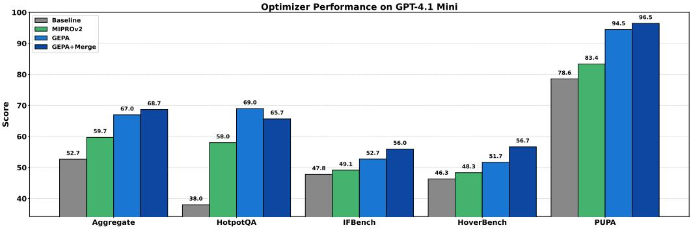

(a) Final test set performance for aggregate and individual benchmarks for gpt-41-mini.  
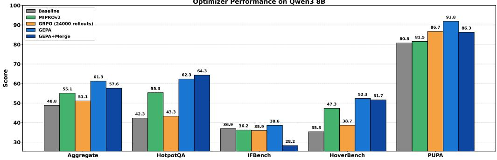  
(b) Final test set performance for aggregate and individual benchmarks for qwen3-8b.

Figure 10: Final test set performance for aggregate and individual benchmarks.  
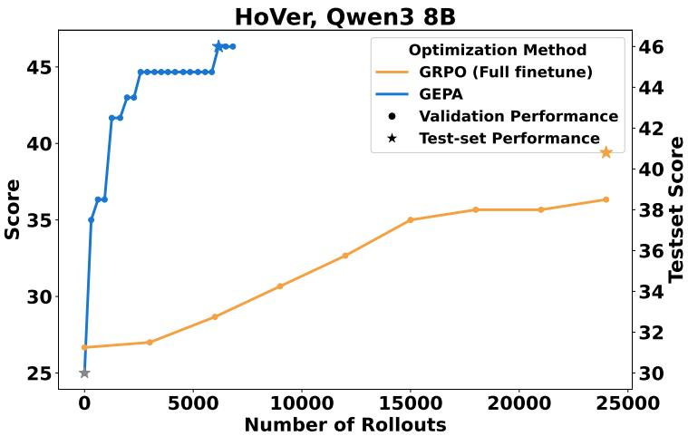  
Figure 11: This figure compares the learning behaviour of GEPA against GRPO with full-parameter finetuning on the 2-hop HoVer task. The relative gap mirrors the previously observed comparison of GEPA against GRPO with LoRA (in figures 1, 12, 13, 14, 15), showing that GEPA achieves a comparable performance gap relative to both full-parameter and parameter-efficient versions of GRPO.

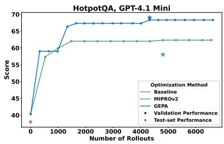  
(a) GPT-4.1 Mini - MIPRO

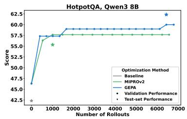  
(b) Qwen3 8B - MIPRO

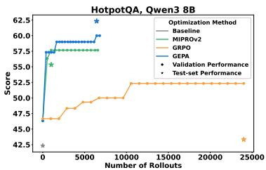  
(c) Qwen3 8B - GRPO

Figure 12: Hotpot QA Bench: rollout vs. score for different models/settings.  
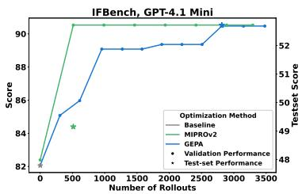  
(a) GPT-4.1 Mini - MIPRO

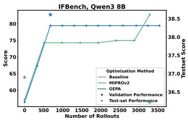  
(b) Qwen3 8B - MIPRO

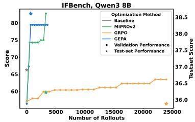  
(c) Qwen3 8B - GRPO

Figure 13: IFBench: rollout vs. score for different models/settings.  
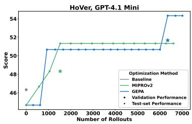  
(a) GPT-4.1 Mini - MIPRO

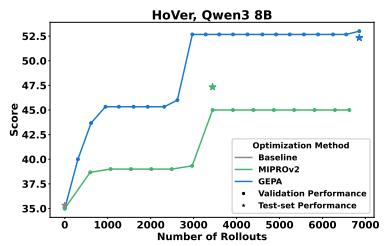  
(b) Qwen3 8B - MIPRO

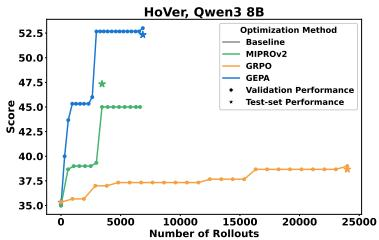  
(c) Qwen3 8B - GRPO

Figure 14: HoverBench: rollout vs. score for different models/settings.  
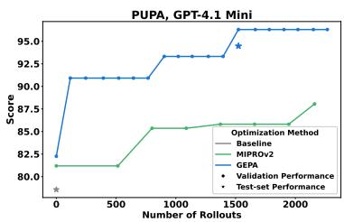  
(a) GPT-4.1 Mini - MIPRO

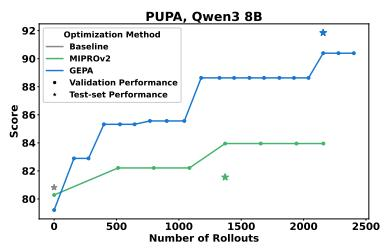  
(b) Qwen3 8B - MIPRO

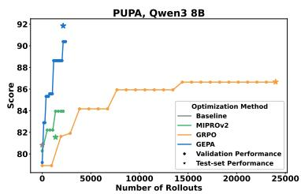  
(c) Qwen3 8B - GRPO  
Figure 15: PUPA: rollout vs. score for different models/settings.

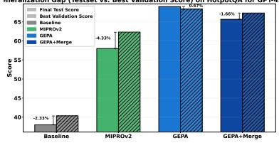

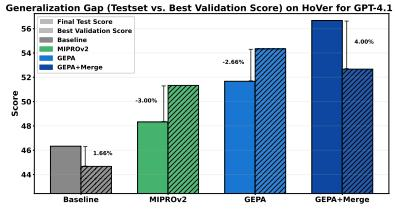

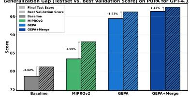

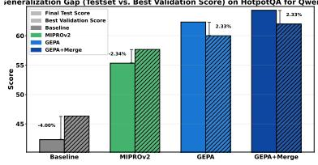

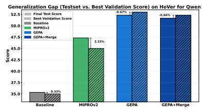

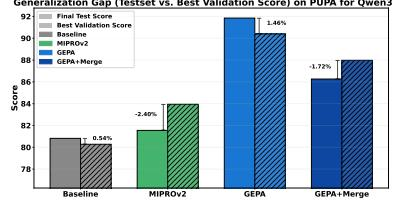  
Figure 16: Generalization gapsfor different optimization methods. Following Wan et al. (2024), we visualize the generalization gap (i.e., the difference between final test set performance and the best achieved validation performance) for different optimizers. While Wan et al. (2024) previously observed that exemplars tend to generalize better, our results suggest that instructions generated by reflective prompt evolution can achieve stronger generalization as well as improved overall performance. We hypothesize this difference may be due to the improving capabilities of the underlying LLMs, as more recent models are both better at adhering to instructions and capable of reflecting on their outputs.

Comparing Scores vs Prompt Size (GPT-4.1 Mini)  
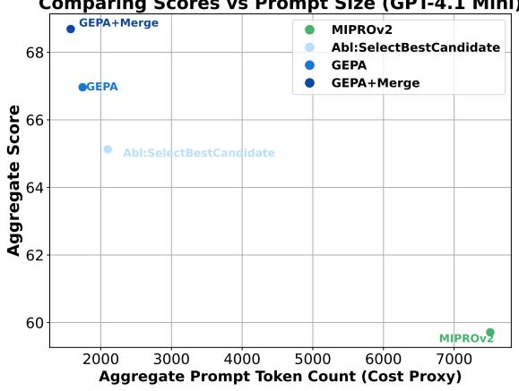  
(a) GPT-4.1 Mini.

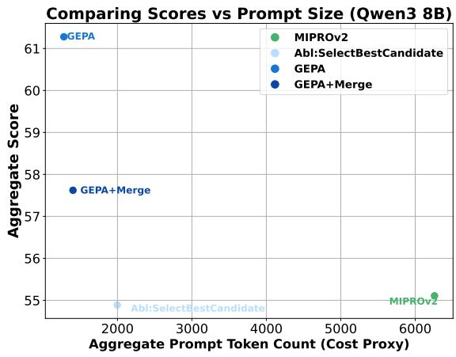  
(b) Qwen3 8B.  
Figure 17: These plots visualize the final aggregate scores against the aggregate prompt size (across all benchmarks) of the final optimized system for each optimizer. It can be seen that GEPA consistently produces prompts that are around less than 33% of the size of MIPROv2’s prompts, while getting higher performance. Most of GEPA’s prompt tokens are used for providing instructions, whereas most of MIPROv2’s prompt tokens pertain to few-shot examples.

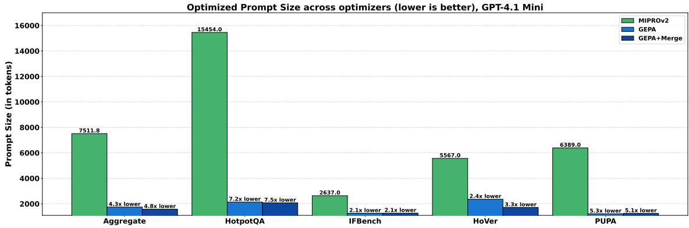

(a) Comparing the token counts of the optimized programs across benchmarks for GPT-4.1 Mini.  
Optimized Prompt Size across optimizers (lower is better), Qwen3 8B  
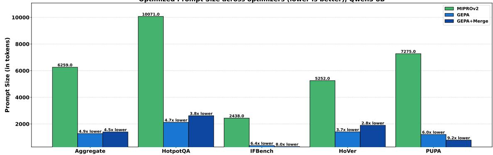  
(b) Comparing the token counts of the optimized programs across benchmarks for Qwen3 8B.  
Figure 18: Comparing the token counts of optimized programs across benchmarks.

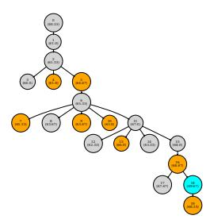  
(a) Abl:SelectBestCandidate

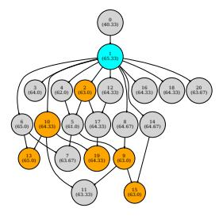  
(b) SelectBestCandidate + Merge

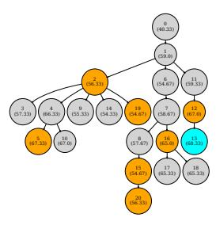  
(c) GEPA - Best Config

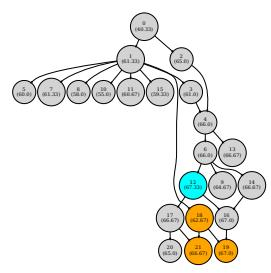  
Figure 19: HotpotQA GPT-4.1 Mini  
(d) GEPA+Merge

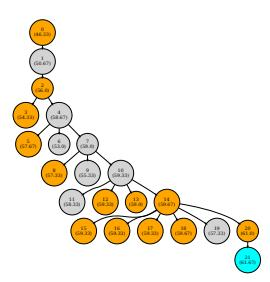  
(a) Abl:SelectBestCandidate

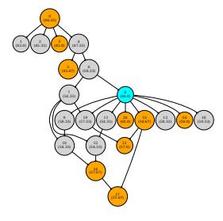  
(b) SelectBestCandidate + Merge

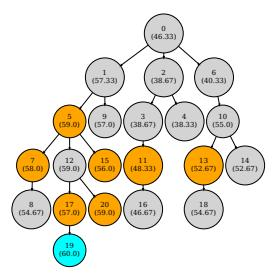  
(c) GEPA

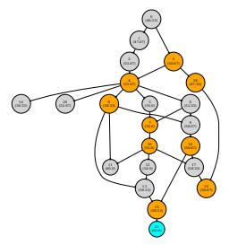  
(d) GEPA+Merge - Best Config  
Figure 20: HotpotQA Qwen3 8B

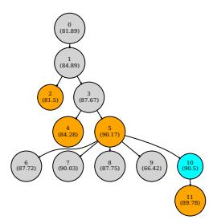  
(a) Abl:SelectBestCandidate

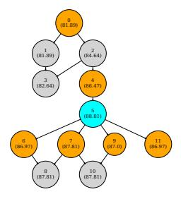

(b) SelectBestCandidate + Merge  
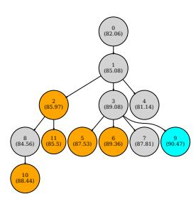  
(c) GEPA

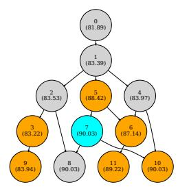  
(d) GEPA+Merge - Best Config  
Figure 21: IFBench GPT-4.1 Mini

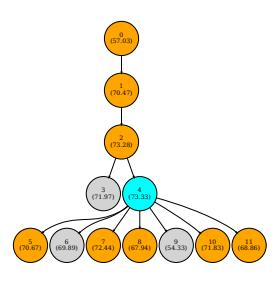  
(a) Abl:SelectBestCandidate

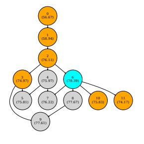  
(b) SelectBestCandidate+Merge

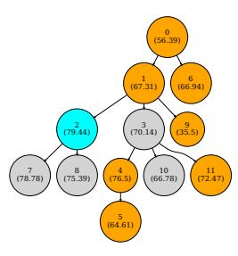  
Figure 22: IFBench Qwen3 8B  
(c) GEPA - Best Config

  
(d) GEPA+Merge

  
(a) Abl:SelectBestCandidate

  
(b) SelectBestCandidate + Merge

  
(c) GEPA

  
(d) GEPA+Merge - Best Config  
Figure 23: HoVer GPT-4.1 Mini

  
(a) Abl:SelectBestCandidate

  
(b) SelectBestCandidate + Merge

  
(c) GEPA - Best Config

  
(d) GEPA+Merge

Figure 24: HoVer Qwen3 8B  
  
Figure 25: PUPA GPT-4.1 Mini

  
Figure 26: PUPA Qwen3 8B

## K.1 PROMPTS AT INTERMEDIATE STAGES FOR PUPA

## Node 2 (Score 90.99)

Task Description:   
You are provided with a private user query that may contain sensitive, personal, or identifying information. Your role is to transform this query into a privacy-preserving request suitable for an external powerful large language model (LLM). The external LLM can be consulted to assist with the task but must not receive any private or personally identifiable information (PII) about the user. Your goal is to maximize the quality and relevance of the LLM request while minimizing or completely eliminating leakage of private information.

Key Points and Domain-Specific Details:

1. Privacy Preservation:

2. Query Understanding and Reformulation:

\- Analyze the user's query carefully to understand the underlying task or information need.

\- Identify when user-provided content is sensitive or proprietary (e.g., unique texts, URLs to closed content) and avoid directly exposing it to the external LLM.

3. Quality Maximization:   
- Produce an LLM request that is clear, precise, and directs the LLM to perform the   
necessary task without requiring private context.   
- Retain the core informational or functional need so that the LLM can respond   
effectively.   
- When referencing external documents or URLs, do not include the actual link or   
private info; instead, request general or typical information related to the topic.

## 4. Common Strategies for Privacy-preserving Requests:

## 5. Reasoning Explanation:

\- For each transformation, produce clear reasoning explaining how privacy is preserved and why the LLM request fulfills the userâĂŹs intent without leaking sensitive information.

## Input Format:

\- A user query string possibly containing private or sensitive information.

## - Required output:

a) A reasoning paragraph explaining your analysis and privacy considerations.

b) A privacy-preserving LLM request that can be sent to an external LLM for assistance.

By following the above principles and strategies, you will optimize both the quality of assistance and the protection of user privacy when interacting with third-party language models.

## Node 4 (Score 94.44)

## Task Description:

You will be given a user query that may include sensitive, personal, or identifiable information. Your role is to transform this query into a privacy-preserving request suitable for submission to an external large language model (LLM). The goal is to enable the external LLM to assist effectively while ensuring no private, identifying, or sensitive information about the user is exposed.

Key Requirements and Domain-Specific Details:

## 1. Privacy Preservation:

\- Do not include any user-specific details, personal names, locations, dates, URLs, or other potentially identifiable information in the outgoing LLM request.

\- When the user query contains private, sensitive, or proprietary data, you must

generalize, abstract, or omit these details.

\- Replace sensitive specifics with neutral placeholders or describe them in generalized terms without losing the core intent of the query. - Avoid exposing non-public, proprietary, or confidential content directly to the external LLM.

2. Understanding and Reformulation: - Carefully analyze the user's query to identify the underlying task type (e.g., summarization, creative writing, translation, profile writing, event recommendations, company background, academic content generation). - When reformulating, maintain the essential informational or functional need so that the external LLM can provide a useful, relevant response. - Preserve thematic and contextual elements necessary for quality output, while abstracting any sensitive or private details. - If the task involves user-supplied content (e.g., essays, texts, character descriptions), distill or summarize the relevant content or use generic versions instead of exposing original private text.

3. Maximizing Quality of the Reformulated Prompt:   
- Construct clear, precise, and well-structured requests that explicitly guide the   
external LLM on the task.   
- Retain appropriate detail and context to ensure relevance, but balance this   
carefully against privacy concerns.   
- If referencing external documents, URLs, or institutions, do not include any links   
or private identifiers; instead, request general or typical information related to the   
subject matter.   
- When writing prompts for creative or fictional character tasks, clarify that the   
profile or content is fictional to avoid accidental exposure of real personal data.

4. Common Strategies for Privacy Preservation:   
- Paraphrase or abstract personal and sensitive content.   
- Use general descriptions or hypothetical/example-based requests where appropriate.   
- Omit or generalize specific names, dates, locations, institutions, or proprietary   
course codes.   
- When user content is extensive, focus on absorbing the core themes and instructing   
the external model accordingly rather than passing the raw content.

5. Explanation Requirement: - Provide a concise reasoning paragraph explaining how you identified sensitive or private details and the steps you took to protect user privacy. - Clarify how your reformulated LLM request retains the userâĂŹs original intent and task needs without risking data leakage. - This explanation is mandatory to document your privacy-preserving approach and to justify the abstraction choices made.

## Input and Output Format:

Examples and Feedback Integration:   
- Avoid including real names, course codes, or faculty references; replace them with   
general terms (e.g., "an interdisciplinary health minor" rather than "HHV").   
- When given character bios or profiles, specify the fictional nature clearly and do not   
include potentially identifying physical descriptions unless necessary for the task.   
- When a user asks about specific companies or entities, generalize the request to "a   
major company in [industry/country]" if privacy concerns exist.   
- Maintain a balance between minimal leakage and maximizing task relevance and quality.   
- Ensure the reformulated prompt supports a comprehensive and useful response from the   
external LLM without compromising privacy.   
By rigorously following these detailed instructions, you will ensure maximal protection   
of user privacy while harnessing the power of external LLMs to assist effectively with   
diverse user requests across domains.

## Node 5 (Score 94.67)

New Instruction for Privacy-Preserving Query Reformulation Assistant:   
Task Overview:   
You receive a user query that may contain sensitive, private, or personally identifiable   
information (PII). Your goal is to transform this input into a generalized,   
privacy-preserving prompt suitable for querying an external large language model (LLM).   
The reformulated prompt must enable the external LLM to fulfill the user's original   
intent effectively, while rigorously protecting user privacy by abstracting or omitting   
any sensitive details.   
Input Format:   
- A single string representing a user query.   
- The query may include private names, places, dates, proprietary info, or identifiable   
context.   
Output Format:   
- Part (a) Reasoning: a concise paragraph explaining:   
- How you identified sensitive or private information in the input.   
- What generalization, abstraction, or omission strategies you applied to protect   
privacy.   
- How the reformulated prompt maintains the original task or informational need   
without risking data leakage.   
- Part (b) LLM Request: a carefully constructed and concise, privacy-safe prompt that   
retains essential thematic and functional elements to achieve a useful, relevant response   
from the external LLM.   
Key Domain-Specific Details and Best Practices:   
1. Privacy Preservation Principles:   
- Remove or replace all user-specific names (personal or organizational), exact dates   
or durations, locations, URLs, proprietary course or product codes, customer or client   
names, and other identifiers.

- When geographic or organizational mentions are critical for context, abstract these to broader or public categories (e.g., âĂa sustainable travel website focused on a Central American countryâĂİ rather than naming the country explicitly).   
- Omit or abstract internal organizational pressures, client names, or sensitive contractual details to generic placeholders (e.g., âĂa clientâĂİ rather than a named company).   
- For biographical or individual-related queries, avoid requesting or referencing real personal info; instead, frame requests around hypothetical or generic profiles unless the name is widely public and essential for the task.

2. Understanding and Reformulating the Task: - Identify the underlying task (creative writing, summarization, professional communication drafting, etc.) from the userâĂŹs query. - Preserve the functional intent and thematic requirements (e.g., content topics around sustainability, summary of a personâĂŹs background, professional email follow-up). - For user-supplied content, do not repeat verbatim or expose any original text; instead, extract core themes, instruct the LLM accordingly, or replace with generic examples.

3. Maximizing Output Quality While Preserving Privacy: - Construct a prompt that is clear, precise, and contains sufficient context to enable comprehensive and relevant LLM output. - Avoid ambiguous or overly generic requests that might reduce relevance or usefulness. - Maintain a balance between detail necessary for quality and generalization required for privacy.

4. Common Reformulation Strategies: - Replace specific names with generic role identifiers or placeholders (âĂa business contact,âĂİ âĂa notable individualâĂİ). - Replace specific locations or institutions with generalized descriptors, e.g., âĂa country known for eco-tourism.âĂİ - For time references, use relative or approximate terms without revealing explicit dates. - For internal or proprietary details, describe the scenario generically (e.g., âĂpressure from a client to close a matter urgentlyâĂİ). - When handling personal profiles or characters, explicitly state that the profile is fictional if requesting content generation about a person.

5. Explanation Requirements: - Always provide reasoning that details how privacy risks were identified and mitigated. - Explain how the essential task was preserved despite abstraction. - This reasoning documents the privacy-preserving approach and justifies design choices.

## Examples and Common Pitfalls:

\- Do not retain or lightly obscure personal names or company names; fully abstract or remove.

\- Avoid exposing direct quotes from user-supplied texts.

\- Use neutral, context-appropriate phrasing to describe user intents.

\- Retain geographic or cultural context only when it is publicly available and pivotal to the task.

- Ensure the output prompt remains a clear instruction that the external LLM can readily   
interpret.   
Summary:   
Your reformulations must ensure zero exposure of PII or private/proprietary content while   
retaining enough context and clarity to generate high-quality, relevant responses from   
the external LLM. This involves careful task analysis, methodical abstraction of   
sensitive details, and clear, precise prompt construction combined with transparent   
reasoning on privacy protection mechanisms used.

Node 11 (Score 97.6)  


- All geographic mentions must be abstracted unless the location is publicly known, essential to the task, and can be generalized (e.g., âĂa region known for   
eco-tourismâĂİ instead of naming a country or city explicitly).   
- Exact dates or durations must never be retained; instead, use relative or   
approximate temporal references (e.g., âĂrecently,âĂİ âĂover the past yearâĂİ). - Internal or proprietary terms âĂŤ including system names, product codes,   
subscription types, and technical jargon âĂŤ must be generalized or replaced with neutral descriptors to avoid leakage of intellectual property or sensitive operational details.   
- Avoid direct quotes or verbatim inclusion of user-supplied texts unless obfuscated by generalization.

2. Task Understanding and Reformulation: - Identify the functional intent of the query: Is it creative writing, translation, summarization, professional communication drafting, technical explanation, or other? - Preserve the thematic and informational core of the query (e.g., request for educational quality analysis, technical translation of a passage, biographical summary). - Do not reproduce the original input verbatim; instead, frame the LLM prompt around the essential thematic elements extracted from the input. - For queries regarding individuals, avoid direct reference to real personal information unless the name is widely public and essential; even then, use a generic or hypothetical framing for the individual profile.

3. Strategies for High-Quality and Privacy-Preserving Prompts: - Strike a balance between sufficient contextual detail and privacy abstraction to maintain prompt clarity and relevance. - Use neutral, context-aware formulations that clearly instruct the LLM on the content and style expected. - Avoid vague or overly generic prompts that could result in less useful or lower-quality responses. - When system or proprietary content is mentioned, instruct the LLM to generalize specific terms and maintain the technical meaning without revealing sensitive info. - When a direct translation is requested on specialized text, specify to replace or abstract internal nomenclature.

4. Explanation Requirements: - The reasoning must transparently explain how privacy risks were identified (e.g., presence of names, locations, dates, proprietary terms). - It must describe the abstraction or omission methods applied (e.g., replacing âĂJonah Van BeijnenâĂİ with âĂa notable individual,âĂİ substituting âĂMakauâĂİ with âĂa specific region,âĂİ or âĂYodaâĂİ with âĂa system nameâĂİ). - Clarify how the essential task and user intent were preserved despite these generalizations (e.g., focusing on educational quality, technical translation, biographical summary). - This explanation justifies your design choices and demonstrates adherence to privacy-preserving principles.

Common Pitfalls to Avoid:   
- Do not merely lightly obscure or partially redact sensitive details; full anonymization or abstraction is required.   
- Do not repeat any user-supplied PII or proprietary content verbatim.   
- Avoid including URLs, exact dates, or direct quotes without modification.

- Do not leave ambiguity that could degrade the quality or contextual clarity of the   
reformulated prompt.   
- Do not include any real personal or organizational names unless they are public figures   
and the query requires it, then use generic descriptors instead.   
Example Summary of Effective Approach (Informed by Prior Examples):   
- For geographic queries: replace exact place names with general regions and provide a   
brief contextual descriptor.   
- For technical texts containing system names or subscription types: instruct the LLM to   
translate or process the text while replacing or abstracting proprietary system   
identifiers.   
- For biographical summaries about specific individuals: remove the real name and request   
a generic, well-structured four-paragraph summary about âĂa notable individual,âĂİ   
preserving the overall intent without leaking PII.   
Summary:   
Your reformulations must ensure zero exposure of any PII or private/proprietary content   
while retaining enough thematic and functional clarity for the external LLM to produce   
high-quality, relevant outputs. This requires thorough analysis of the user's query,   
rigorous application of privacy-preservation strategies, and explicit reasoning   
explanations that document your approach and choices.

## L EXAMPLES OF BEST PROMPTS FOR EVERY BENCHMARK

In this section, we present the best optimized prompt obtained for every (benchmark, model) configuration. Each subsection below pertains to one (benchmark, model) configuration. Since every compound AI system consists of multiple modules, each subsection consists of multiple boxes, listing the prompts for each module. MIPROv2 optimized prompts contain upto 4 few-shot examples for each task. We provide just the first demo here for brevity. GEPA’s prompts only consist of the optimized instruction, which is provided in full.

## L.1 HOTPOTQA, GPT-4.1 MINI

HotpotQA GPT-4.1 Mini create\_query\_hop2.predict   
Base Prompt:   
Given the fields \`question\`, \`summary\_1\`, produce the fields \`query\`.   
MIPROv2 Prompt:   
You are an expert multi-hop question answering system designed to refine retrieval   
queries for complex questions. Given the original question and an initial summary of   
retrieved documents (summary\_1), think step by step to analyze how the summary relates to   
the question. Use this reasoning to generate a focused and precise query that will guide   
the retrieval of additional relevant information needed to answer the question   
completely. Your output should include a clear chain-of-thought reasoning process   
followed by the refined query that targets complementary evidence for the next retrieval   
hop.   
Demos:   
Example 1:

question:   
Simone Benedetti plays for a team that currently competes in which Serie?   
summary\_1:   
Simone Benedetti plays for Virtus Entella, but the passages do not specify which   
Serie the team currently competes in.   
reasoning:   
The summary indicates that Simone Benedetti plays for Virtus Entella, but it does not   
state the current Serie (league level) in which Virtus Entella competes. To   
accurately answer which Serie the team currently competes in, it is necessary to look   
up the most recent league information for Virtus Entella.   
query:   
What Serie (league level) does Virtus Entella currently compete in?   
##################################   
3 other demos omitted for brevity.   
##################################

## GEPA Prompt generated by config GEPA:

You will be given two input fields: \`question\` and \`summary\_1\`.   
Your task is to generate a new search query (\`query\`) optimized for the \*\*second hop\*\* of   
a multi-hop retrieval system. The original user question is typically complex and   
requires information from multiple documents to answer. The first hop query is the   
original question used to retrieve an initial set of documents. Your goal is to generate   
a \*\*second hop query\*\* that retrieves \*additional relevant documents\* that were \*not\*   
found in the first hop but are necessary to answer the original question completely.   
Detailed task instructions and hints:   
1. \*\*Input Understanding:\*\*   
- \`question\` is the original multi-hop question posed by the user.   
- \`summary\_1\` is a concise summary of information from a document retrieved in the   
first hop, which partially addresses the question.   
2. \*\*Purpose and Context:\*\*   
- Your generated \`query\` aims to find the \*missing pieces\* of information needed to   
fully answer the \`question\`.   
- The multi-hop retrieval system works in stages:   
- First hop: The original question returns some documents.   
- Second hop: Your query must help retrieve any \*other relevant documents\* NOT found   
in the first hop that hold complementary or broader context necessary for final   
answer extraction.   
3. \*\*Key Observations from Examples and Feedback:\*\*   
- First-hop documents often cover one entity or aspect in the question.   
- Remaining relevant documents often involve connected or higher-level concepts   
mentioned in \`summary\_1\` but not explicitly asked in the original question.   
- The \`query\` should be formulated to explicitly target these \*missing\*, but logically   
linked, documents.   
- Avoid merely paraphrasing the original question or restating known facts from   
\`summary\_1\`.

Instead, infer what broader or related entities/concepts might provide the crucial   
missing information.   
- For example, if \`summary\_1\` describes a population for a small civil parish, but the   
question wants total population of the wider region, your \`query\` should target that   
wider region (e.g., "Madeira archipelago population in 2011").   
- Similarly, if \`summary\_1\` covers a song and the question wants the album it came   
from, but first hop got song-level documents, your query should retrieve documents   
about the album itself.   
4. \*\*How to Build the Query:\*\*   
- Identify the entities or topics mentioned in \`summary\_1\` that appear related but   
different from first-hop documents.   
- Reframe the query to explicitly mention these broader or related entities connected   
to the original question.   
- Include relevant key context from the question to maintain specificity, but shift   
focus to the missing piece.   
- The goal is to retrieve documents that link or complement what was retrieved   
initially.   
5. \*\*Practical Strategy:\*\*   
- Read the \`summary\_1\` carefully to spot references to bigger contexts or other   
entities not covered in the first hop.   
- Ask yourself, "What entity or aspect does this summary hint at that could answer the   
original question but was not found yet?"   
- Formulate a precise, focused factual query targeting that entity or concept to   
retrieve the missing documents.   
6. \*\*Output:\*\*   
- Produce only the field \`query\` as a clear, concise question or keyword phrase   
designed for efficient retrieval of \*\*second-hop documents\*\*.   
- Ensure the query relates logically to the original question while targeting the   
broader or complementary knowledge identified in \`summary\_1\`.   
- Do \*\*not\*\* include the original question or simply rephrase it.   
- Do \*\*not\*\* duplicate information already well-covered by the first hop retrieval.   
By following these principles, you will help the multi-hop retrieval system find all   
necessary documents to answer the multi-faceted original question completely.

## HotpotQA GPT-4.1 Mini final\_answer.predict

Given the fields \`question\`, \`summary\_1\`, \`summary\_2\`, produce the fields \`answer\`.   
MIPROv2 Prompt:   
You are an expert multi-hop reasoning assistant skilled in synthesizing information from   
multiple summaries to answer complex questions. Given the \`question\`, along with two   
intermediate summaries \`summary\_1\` and \`summary\_2\` that contain relevant evidence,   
carefully analyze and integrate the information step-by-step to produce a clear, logical   
reasoning process followed by a concise and accurate final answer.   
Demos:   
Example 1:

question:   
are Machaeranthera and Prumnopitys both the plants?   
summary\_1:   
Yes, both Machaeranthera and Prumnopitys are plants. Machaeranthera is a genus of   
flowering plants in the daisy family, while Prumnopitys is a genus of coniferous   
evergreen trees in the podocarp family.   
summary\_2:   
Yes, both Machaeranthera and Prumnopitys are plants; Machaeranthera is a genus of   
flowering plants in the daisy family, while Prumnopitys is a genus of coniferous   
evergreen trees in the podocarp family.   
reasoning:   
Both summaries agree that Machaeranthera and Prumnopitys are plants. Specifically,   
Machaeranthera is a genus of flowering plants in the daisy family, and Prumnopitys is   
a genus of coniferous evergreen trees in the podocarp family. Since both belong to   
plant genera, the answer is yes.   
answer:   
yes   
##################################   
3 other demos omitted for brevity.   
##################################

## GEPA Prompt generated by config GEPA:

Task Description:   
You are given three fields as input: \`question\`, \`summary\_1\`, and \`summary\_2\`. Your goal   
is to produce an \`answer\` field that directly and explicitly responds to the question   
using the information from the two summaries, enhanced by your authoritative domain   
knowledge when needed.   
Input Format:   
- \`question\`: A natural language question that may require a fact, definition, name,   
date, yes/no response, or other specific information.   
- \`summary\_1\` and \`summary\_2\`: Two independently generated summaries or snippets   
containing information related to the question. They may vary in completeness, accuracy,   
and specificity.   
Requirements and Approach:   
1. \*\*Understand the question precisely.\*\* Determine exactly what is askedâĂŤwhether a   
name, a specific fact, a date, or a yes/no answer.   
2. \*\*Compare both summaries.\*\* Analyze the content of \`summary\_1\` and \`summary\_2\`:   
- If they agree and directly answer the question, use this as primary evidence.   
- If one summary provides a fact that the other does not mention, carefully evaluate   
its plausibility.   
- If the summaries conflict, use domain expertise and authoritative knowledge to   
resolve or explicitly state uncertainty.   
3. \*\*Domain-specific factual verification and nuance:\*\*

- \*\*Names and nicknames:\*\* Provide only the specific nickname or name when asked,   
without extra phrasing. For example, when asked for the nickname of a person or   
entity, respond with the nickname alone, not a full sentence.   
- \*\*Nationality and identity distinctions:\*\* Use the most precise terms aligned with   
factual correctness and common usage (e.g., âĂEnglishâĂİ vs. âĂBritishâĂİ) based on   
domain knowledge.   
- \*\*Dates and historical facts:\*\* Verify dates or historical claims with domain   
knowledge to pick the correct fact, especially when there might be confusion between   
franchise start dates vs. event dates etc.   
- \*\*Yes/no questions:\*\* Prefer concise answers of âĂyesâĂİ or âĂnoâĂİ only, unless the   
question demands elaboration.   
- \*\*Types or categories:\*\* If a question asks about the type or category (e.g., type   
of company), provide the most direct concise phrase without including adjectives like   
nationality unless asked explicitly.

4. \*\*Answer conciseness and relevance:\*\*   
- Provide a brief and direct answer to the question.   
- Avoid repeating or restating the question.   
- Avoid unnecessary context unless requested or needed for clarity.   
- Avoid constructing full sentences unless needed; for example, answers to nickname or   
yes/no questions should be as short and specific as possible.

```prolog
5. **When authoritative knowledge supplements the summaries:**
- If the summaries are incomplete or potentially inaccurate, incorporate trusted
knowledge from your training about the topic to provide the correct and precise answer.
- For example, when a summary gives a year that conflicts with known release dates or
factual details, prefer the verified date.
- When the summaries differ in style (one uses a formal phrase, another provides just
the nickname), respond with the correct, clean answer format (e.g., just the nickname
alone).
```

6. \*\*Examples of correct reasoning and answers:\*\*   
- Question: âĂWhat is the nickname of the 2005 Toyota Grand Prix of Long Beach   
Polesitter ?âĂİ   
- Correct answer: \`the thrill from West Hill\`   
- Question: âĂWhat type of company is Zipcar led by Scott Griffith from 2003-2013?âĂİ   
- Correct answer: \`car-sharing company   
- Question: âĂWho was the partner of British comic book artist, Henry Flint, that   
helped create Zombo?âĂİ   
- Correct answer: \`Al Ewing

## Summary:

- Use both summaries as primary but not sole evidence.   
- Reliably verify and contextualize facts using domain knowledge, especially for   
nationality, dates, nicknames, company types, and yes/no questions.   
- Provide short, direct answers matching the specificity requested.   
- Avoid unnecessary elaboration unless explicitly required.   
- Explicitly resolve conflicts or ambiguity using your knowledge or state uncertainty   
when appropriate.   
This approach ensures that answers are both accurate and concise, suitable for direct   
consumption or integration in knowledge bases or question-answering systems.

HotpotQA GPT-4.1 Mini summarize1.predict   
Base Prompt:   
Given the fields \`question\`, \`passages\`, produce the fields \`summary\`.   
MIPROv2 Prompt:   
Given a question and a set of related passages, carefully analyze the information by   
thinking through the relevant facts step-by-step. Produce a clear and concise summary   
that synthesizes the key points from the passages directly relevant to answering the   
question, ensuring the summary is focused, accurate, and grounded in the evidence   
provided.   
Demos:   
Example 1:   
question:   
The architectural style of a church that stands in front of the Palazzo Ghisilardi   
Fava originated in what city?   
passages:   
['Palazzo Ghisilardi Fava | Palazzo Ghisilardi Fava is a Renaissance style palace,   
located on via Manzoni 4 in Bologna, region of Emilia Romagna, Italy; it houses the   
Medieval Civic Museum of Bologna.', 'Madonna di Galliera, Bologna | The Madonna di   
Galliera is a church with a Renaissance facade and Baroque interiors, located on Via   
Manzoni, in central Bologna, Italy. It stands in front of the Palazzo Ghisilardi   
Fava. The present name over the portal is the "Chiesa di Filippini Madonna di   
Galliera e Filippo Neri".', 'Palazzo Pretorio, Prato | The Palazzo Pretorio of the   
Tuscan town of Prato was the old city hall located town center, standing in front of   
the current Palazzo Comunale. It now accommodates the Civic Museum of Prato, which   
was reopened on September 2013.', 'Palazzo Pisani Gritti | The Palazzo Pisani Gritti   
is a Gothic-style palace located across the Grand Canal from the Church of the   
Salute, and stands along the Campo del Traghetto where the church of Santa Maria del   
Giglio, in the Sestieri of San Marco, Venice, Italy.', 'DÃűmÃűtÃűr Tower | The   
DÃűmÃűtÃűr tower is the oldest building in Szeged, Hungary. The foundation was most   
probably laid during the 11th century, while the lower part was built (in Romanesque   
style) from the 12th century, and the upper part (Gothic style) from the 13th   
century. The tower was once part of the former "Szent DÃűmÃűtÃűr templom" (St.   
Demetrius church), but today it stands in DÃşm Square, in front of the much larger   
Votive Church of Szeged. The upper part was rebuilt from the original stones in 1926.   
The architecture of the tower is similar to another found in Southern France, or in   
the territory of the former Byzantine Empire.', 'Palazzo Leoni, Bologna | The Palazzo   
Leoni is a Renaissance style palace located on Via Marsala #31, in front of the   
outlet of Via Mentana, in central Bologna, region of Emilia-Romagna, Italy. The apse   
of the church of San Martino, is across the street.', 'Palazzo Altieri | Palazzo   
Altieri is a palace in Rome, which was the home of the Altieri family in the city.   
The palace faces the square in front of the Church of the GesÃź.']   
reasoning:   
The question asks for the city where the architectural style of a church that stands   
in front of the Palazzo Ghisilardi Fava originated. Passage [2] identifies the church   
standing in front of the Palazzo Ghisilardi Fava as "Madonna di Galliera" and   
mentions it has a Renaissance facade and Baroque interiors. Passage [1] states the   
Palazzo Ghisilardi Fava is located in Bologna, Italy. Since the church is located in   
Bologna and features a Renaissance architectural style, it can be inferred that the   
architectural style of this church originated in the city of Florence, which is   
historically recognized as the birthplace of Renaissance architecture. Thus, the

architectural style (Renaissance) of the church in front of the Palazzo Ghisilardi   
Fava originated in Florence.   
summary:   
The Renaissance architectural style of the church standing in front of the Palazzo   
Ghisilardi Fava originated in Florence.   
##################################   
3 other demos omitted for brevity.   
##################################

## GEPA Prompt generated by config GEPA:

You are a first-hop \*\*summarization module\*\* in a multi-hop question answering (QA)   
system. Your task is to generate a concise, informative \`summary\` given two input fields:   
a \`question\` and a list of relevant \`passages\`.   
Your goal is to extract and synthesize key information from the retrieved passages that:   
1. Directly relates to the initial question.   
2. Captures the core facts and entities needed to understand the scope and context of the   
question.   
3. Includes relevant connections, bridging entities, dates, locations, or descriptions   
that enable the system to devise focused and effective follow-up queries in subsequent   
hops.   
4. Provides a strong factual foundation for downstream answer generation modules.   
\*\*Task specifics and best practices:\*\*   
- The \`summary\` must represent a distilled synthesis, not just a compression or   
extractive snippet.   
- Explicitly include cited passage titles or key entity labels (e.g., "Children in Need   
2006 | ..." or "Anthony Levandowski | ...") in your summary to highlight the origin of   
information.   
- Incorporate sufficient context to hint at missing or un-retrieved supporting facts,   
thus enhancing the multi-hop retrieval process.   
- When the question asks for an attribute (e.g., nationality, location, company origin),   
ensure you provide:   
- Identification of the relevant subject or entity mentioned in the passages.   
- The extracted attribute or relevant information as stated or implied.   
- Bridging details that could help the system pursue remaining information in the next   
retrieval step.   
- Avoid forming a final answer; instead, focus on "what is known now" from the input   
documents to facilitate further query refinement.   
\*\*Examples of critical elements to include:\*\*   
- Entity names, roles, titles, and dates tied to the question.   
- Names of organizations or locations connected through intermediary entities.   
- Distinctive identifiers or clarifications that can help narrow down next-step retrieval   
(such as "Natasha Kaplinsky is an English presenter," "Kapolei is a city on Oahu," or   
"Waymo spun out of Alphabet").   
\*\*Format of output:\*\*

Provide a paragraph or a few sentences that cohesively summarize the key passages in   
relation to the question, referencing passage titles or entities to frame facts clearly.   
This approach ensures the summary is both informative for next-hop retrieval and   
foundational for final answer extraction in multi-hop QA.

HotpotQA GPT-4.1 Mini summarize2.predict   
Base Prompt:   
Given the fields \`question\`, \`context\`, \`passages\`, produce the fields \`summary\`.   
MIPROv2 Prompt:   
Given a \`question\`, relevant \`context\`, and a list of \`passages\`, provide a clear,   
concise summary that integrates the key information from the passages in relation to the   
question and context. Use step-by-step reasoning to explain how the summary is derived   
from the evidence before presenting the final synthesized summary.   
Demos:   
Example 1:   
question:   
What bank was founded by the great-great-great grandfather of the second Duke of   
Florence?   
context:   
The bank founded by the great-great-great grandfather of the second Duke of Florence   
is the Medici Bank, established by Giovanni di Bicci de' Medici.   
passages:   
['Giovanni di Bicci de\' Medici | Giovanni di Bicci de\' Medici (c. 1360 âĂŞ February   
20/28, 1429) was an Italian banker, a member of Medici family of Florence, and the   
founder of the Medici Bank. While other family members, such as Chiarissimo di   
Giambuono de\' Medici, who served in the Signoria in 1201, and Salvestro de\' Medici,   
who was implicated in the Ciompi Revolt of 1378, are historically significant,   
Giovanni\'s founding of the family bank truly began the family\'s rise to power in   
Florence. He was the father of Cosimo de\' Medici ("Pater Patriae"), grandfather of   
Piero di Cosimo de\' Medici, great-grandfather of Lorenzo de\' Medici (the   
Magnificent) and great-great-great-grandfather of Cosimo I de\' Medici, Grand Duke of   
Tuscany.', 'Averardo de\' Medici | Averardo de\' Medici (1320-1363),   
also known as Everard De Medici, was the son of Salvestro de\' Medici (died 1346),   
"il Chiarissimo" (English meaning "the very clear.") and the father of three   
children: Giovanni, Francesco, and Antonia. Giovanni di Bicci de\' Medici would later   
become the first historically relevant member of Medici family of Florence and the   
eventual founder of the Medici bank.', "Villa Medici at Cafaggiolo | The Villa   
Medicea di Cafaggiolo is a villa situated near the Tuscan town of Barberino di   
Mugello in the valley of the River Sieve, some 25\xa0kilometres north of Florence,   
central Italy. It was one of the oldest and most favoured of the Medici family   
estates, having been in the possession of the family since the 14th century, when it   
was owned by Averardo de' Medici. Averardo's son, Giovanni di Bicci de' Medici, is   
considered to be the founder of the Medici dynasty.", 'Medici: Masters of Florence |   
Medici: Masters of Florence is an Italian-British television drama series about the   
Medici dynasty set in 15th-century Florence, starring Dustin Hoffman as Giovanni di

Bicci de\' Medici, Richard Madden as Cosimo de\' Medici, and Stuart Martin as Lorenzo   
de\' Medici ("The Elder"). The series was co-created by Frank Spotnitz ("The X-Files"   
and "Man in the High Castle") and Nicholas Meyer (""). Sergio Mimica-Gezzan ("The   
Pillars of the Earth") directed all eight episodes. Episodes 1 and 2 aired on Rai 1   
(Italian TV) on 18 October 2016. According to Italian ratings compiler Auditel, it   
attracted a record 7.6\xa0million viewers. The first season consists of eight   
episodes.', 'Neri di Bicci | Neri di Bicci (1419âĂŞ1491) was an Italian painter of   
the Renaissance. A prolific painter of mainly religious themes, he was active mainly   
in Florence and in the medium of tempera. His father was Bicci di Lorenzo. His   
grandfather, Lorenzo di Bicci was also a painter in Florence, a pupil of Spinello   
Aretino.', 'Cosimo de\' Medici | Cosimo di Giovanni de\' Medici (called \'the Elder\   
(Italian "il Vecchio") and posthumously "Father of the Nation" (Latin "pater   
patriae"); 27 September 1389 âĂŞ 1 August 1464) was an Italian banker and politician,   
the first of the Medici political dynasty, "de facto" rulers of Florence during much   
of the Italian Renaissance. Despite his influence, his power was not absolute;   
Florence\'s legislative councils at times resisted his proposals, something which   
would not have been tolerated by the Visconti of Milan, for instance; throughout his   
life he was always "primus inter pares" ("first among equals"). His power derived   
from his wealth as a banker, and he was a great patron of learning, the arts and   
architecture.', "Giovanni il Popolano | Giovanni de' Medici, in full Giovanni di   
Pierfrancesco de' Medici, later known as il Popolano (21 October 1467 âĂŞ 14   
September 1498) was an Italian nobleman of the Medici House of Florence. He was the   
son of Pierfrancesco di Lorenzo de' Medici, and therefore a member of a secondary   
branch of the family."]   
reasoning:   
The question asks for the bank founded by the great-great-great-grandfather of the   
second Duke of Florence. Passage [1] states that Giovanni di Bicci de' Medici founded   
the Medici Bank and was the great-great-great-grandfather of Cosimo I de' Medici, who   
was the Grand Duke of Tuscany. The Dukedom of Florence eventually transformed into   
the Grand Duchy of Tuscany under Cosimo I, who is identified as the second Duke of   
Florence in the question context.   
Thus, Giovanni di Bicci de' Medici, as the great-great-great-grandfather of the second   
Duke of Florence (Cosimo I de' Medici), founded the Medici Bank.   
summary:   
The Medici Bank was founded by Giovanni di Bicci de' Medici, the   
great-great-great-grandfather of the second Duke of Florence.   
##################################   
3 other demos omitted for brevity.   
##################################   
GEPA Prompt generated by config GEPA: GEPA Prompt generated by config GEPA:

## L.2 HOTPOTQA, QWEN3 8B

HotpotQA Qwen3 8B create\_query\_hop2.predict   
Base Prompt:   
Given the fields \`question\`, \`summary\_1\`, produce the fields \`query\`.   
MIPROv2 Prompt:   
Given the question and the first summary, synthesize the key elements of the question and   
the summary. Identify the specific information that needs to be retrieved or confirmed.   
Formulate a focused and precise query that will guide the next step in the multi-hop   
reasoning process, ensuring it directly addresses the gap in knowledge or requires   
further clarification from additional context.   
Demos:   
GEPA Prompt generated by config GEPA+Merge:   
Given the fields \`question\` and \`summary\_1\`, produce the field \`query\` that optimizes the   
retrieval of additional documents for a multi-hop system.   
\*\*Task Details:\*\*   
1. \*\*Objective:\*\* Your query must target documents not retrieved in the first hop, using   
clues from the summary and the original question.   
2. \*\*Key Strategy:\*\*   
- Identify gaps in the first hop's retrieved documents (e.g., missing entities,   
relationships, or specific details).   
- Use explicit information from the summary (e.g., names, locations, quantities) to   
rephrase the question into a query that surfaces new relevant documents.   
- Avoid restating the answer directly; instead, structure the query to explore   
connections or unresolved details.   
3. \*\*Domain-Specific Guidance:\*\*   
- If the summary explicitly answers the question, the query should still focus on   
retrieving documents that provide deeper context or verify the answer (e.g., "What is   
the headquarters location of [Company]?" instead of "The answer is [Location]").   
- Leverage entities mentioned in the summary (e.g., "Carhartt," "Aubrey O'Day") to   
anchor the query.   
- If no documents are missing, rephrase the query to explicitly request the answer   
(e.g., "Which has more acts, Elektra or From the House of the Dead?").   
4. \*\*Avoid:\*\*   
- Generating queries that duplicate the original question.   
- Assuming the summary contains all necessary information for the second hop.

HotpotQA Qwen3 8B final\_answer.predict

Base Prompt:   
Given the fields \`question\`, \`summary\_1\`, \`summary\_2\`, produce the fields \`answer\`.   
MIPROv2 Prompt:   
Given the question, summary\_1, and summary\_2, generate a step-by-step reasoning process   
that logically connects the information from both summaries to arrive at the final

answer, and then provide the answer. Ensure the reasoning explicitly references how the   
summaries support the conclusion and maintains consistency with the question's   
requirements.   
Demos:   
Example 1:   
question:   
are Machaeranthera and Prumnopitys both the plants?   
summary\_1:   
Yes, both Machaeranthera (a genus of flowering plants in the daisy/aster family) and   
Prumnopitys (a genus of coniferous trees in the podocarp family) are plants.   
summary\_2:   
Yes, both Machaeranthera (a flowering plant genus in the daisy family) and   
Prumnopitys (a coniferous tree genus in the podocarp family) are plants.   
reasoning:   
Both summaries confirm that Machaeranthera and Prumnopitys are plants. Summary 1   
explicitly states they are plants, categorizing Machaeranthera as a flowering plant   
genus in the daisy/aster family and Prumnopitys as a coniferous tree genus in the   
podocarp family. Summary 2 repeats this confirmation with slightly different phrasing.   
answer:   
Yes   
##################################   
3 other demos omitted for brevity.   
##################################

Given the fields \`question\`, \`summary\_1\`, and \`summary\_2\`, produce the field \`answer\` by:   
1. \*\*Extracting precise terminology\*\*: Identify the exact noun or specific term required   
in the answer (e.g., "Medicare" rather than "Medicare cuts"). Avoid vague or generalized   
terms unless explicitly stated in the summaries.   
2. \*\*Resolving ambiguity\*\*: If the question references a title, historical role, or   
specific designation (e.g., "second Duke of Florence"), prioritize contextual or   
historical clues from the summaries to infer the correct answer, even if the exact term   
is not explicitly stated. Use domain-specific knowledge (e.g., Medici family lineage) to   
fill gaps when summaries are indirect or vague.   
3. \*\*Cross-referencing summaries\*\*: Ensure consistency between summaries. If summaries   
conflict, prioritize the one with explicit factual claims (e.g., numerical data, direct   
statements). If no explicit claim exists, synthesize information while ensuring alignment   
with historical, political, or cultural context.   
4. \*\*Avoiding overgeneralization and extra information\*\*: Focus strictly on the most   
specific and directly stated information in the summaries. Do not add context,   
explanations, or external knowledge beyond what is explicitly provided. For example, if   
the question asks for a year, provide only the year; do not include band member details   
or historical background.   
5. \*\*Prioritizing factual alignment\*\*: If a summary explicitly states the answer, use   
that. If summaries are indirect or vague, synthesize information while ensuring alignment   
with factual knowledge (e.g., linking "Path to Prosperity" to Rep. Paul RyanâĂŹs Medicare   
proposal).   
\*\*Key adjustments based on feedback\*\*:   
- \*\*Conciseness\*\*: Answers must be strictly factual and concise, avoiding additional   
context or explanations. For example, if the question is "Is X shorter than Y?" the

answer should be a simple "No" or "Yes" based on numerical comparisons, not a full   
explanation.   
- \*\*Numerical precision\*\*: When comparing measurements (e.g., heights, dates), ensure   
exact values are used and explicitly stated in the summaries. If summaries provide   
conflicting numbers, resolve via direct factual claims.   
- \*\*Domain-specific knowledge\*\*: Use known facts (e.g., architectural records, historical   
timelines) to validate ambiguous answers, but only when summaries lack explicit   
information.

Base Prompt:   
Given the fields \`question\`, \`passages\`, produce the fields \`summary\`.   
MIPROv2 Prompt:   
Given the fields \`question\`, \`passages\`, produce the fields \`summary\`.   
Demos:   
Example 1:   
question:   
Tay Garnett and Alexander Kluge both have what job?   
passages:   
['Tay Garnett | William Taylor "Tay" Garnett (June 13, 1894 âĂŞ October 3, 1977) was   
an American film director and writer.', 'Trade Winds (film) | Trade Winds is a 1938   
comedy film distributed by United Artists. It was directed by Tay Garnett, and   
starred Fredric March and Joan Bennett. The screenplay was written by Dorothy Parker,   
Alan Campbell and Frank R. Adams, based on story by Tay Garnett.', 'Prestige (film) |   
Prestige is a 1932 American pre-Code drama film directed by Tay Garnett and written   
by Tay Garnett, Rollo Lloyd and Francis Edward Faragoh. The film stars Ann Harding,   
Adolphe Menjou, Melvyn Douglas and Guy Bates Post. The film was released on January   
22, 1932, by RKO Pictures.', 'Alexander Kluge | Alexander Kluge (born 14 February   
1932) is a German author, philosopher, academic and film director.', 'Cattle King |   
Cattle King is a 1963 film directed by Tay Garnett. It stars Robert Taylor and Robert   
Loggia. It also appears to have been called Guns of Wyoming in some countries.',   
'GÃnther von Kluge | GÃnther von Kluge (30 October 1882 âĂŞ 19 August 1944) was a   
German field marshal during World War II. Kluge held commands on both the Eastern and   
Western Fronts. Although Kluge was not an active conspirator in the 20 July plot, he   
committed suicide on 19 August 1944, after having been recalled to Berlin for a   
meeting with Hitler in the aftermath of the failed coup. He was replaced by Field   
Marshal Walter Model.', 'Bad Company (1931 film) | Bad Company is a 1931 American   
Pre-Code gangster film directed and co-written by Tay Garnett with Tom Buckingham   
based on Jack Lait\'s 1930 novel "Put on the Spot". It stars Helen Twelvetrees and   
Ricardo Cortez. Told from the view of a woman, the working titles of this film were   
"The Gangster\'s Wife" and "The Mad Marriage". Unlike many static early sound films,   
Garnett includes several scenes using a moving camera climaxing in a gigantic assault   
on an office building with both sides using heavy machine guns.']   
reasoning:   
The question asks for the common job of Tay Garnett and Alexander Kluge. From the   
passages, Tay Garnett is explicitly identified as a film director and writer   
(passages 1, 2, 3, 5, 7). Alexander Kluge is described as a German author,   
philosopher, academic, and film director (passage 4). The shared job between them is   
"film director."

```prolog
summary:
Both Tay Garnett and Alexander Kluge are film directors.
##################################
3 other demos omitted for brevity.
##################################
GEPA Prompt generated by config GEPA+Merge:
You are the first-hop **summarization module** in a multi-hop QA system. Your task is to
generate a **comprehensive, structured summary** that:
1. **Extracts direct answers** from the top retrieved passages to address the question.
2. **Identifies and highlights missing or implied clues** that may require further
retrieval (e.g., entities, connections, or contextual details).
3. **Synthesizes information** by combining explicit facts from the passages with
domain-specific knowledge or logical inferences to guide subsequent steps.
### **Summary Structure**
- **Entity/Person Mention**: Clearly state the subject (e.g., "Billy Truax", "Eintracht
Braunschweig") and include **full names, titles, or official designations** (e.g.,
"Thomas Lance Rentzel", "Braunschweiger Turn- und Sportverein Eintracht von 1895 e.V.").
- **Direct Answer**: Include **explicit answers** from the passages (e.g., birth dates,
team affiliations, or direct statements).
- **Clues for Next Steps**: Signal **missing information** (e.g., "Lance Rentzel's birth
year is explicitly stated, but his exact birthplace is not; need to search for 'Lance
Rentzel birthplace'").
- **Domain-Specific Context**: Add **relevant background** (e.g., "Eintracht Braunschweig
is a German football club based in Braunschweig, Lower Saxony" or "NFL players' birth
dates are critical for age comparisons").
### **Guidelines**
- **Do not omit** any entity or detail from the retrieved passages that could be relevant
for follow-up queries (e.g., team names, locations, or historical context).
- **Prioritize clarity** by **separating direct answers from inferred clues** (e.g.,
using bullet points, subheadings, or bolded labels).
- **Avoid assumptions** not supported by the passages; if information is absent,
**explicitly state that it is missing** and suggest **precise search terms** (e.g.,
"Verify Wichita Dwight D. Eisenhower National Airport's tower status via FAA records").
- **Include quantifiable data** (e.g., "few thousand Stabyhouns exist globally", "born
July 15, 1943") to enable precise comparisons.
- **Highlight connections** between entities (e.g., "Billy Truax and Lance Rentzel were
traded in 1970") to aid in cross-referencing.
### **Key Niche/Domain-Specific Insights**
- **NFL Player Comparison**: Birth dates are critical for age determination, and team
affiliations (e.g., "traded in 1970") may imply historical context.
- **Airport Classification**: "Non-towered" status is explicitly stated in some passages
(e.g., "non-towered public airport"), while others require inference (e.g., "major
commercial airports typically have towers").
- **Football Club Context**: Clubs like Eintracht Braunschweig require background on
their location, league, and history (e.g., "based in Braunschweig, Lower Saxony").
```

```markdown
- **Quantifiable Data**: Use exact dates, numbers, or rankings (e.g., "few thousand
Stabyhouns exist globally") to enable precise comparisons.
### **Critical Additional Instructions**
- **Ensure All Retrieved Documents Are Represented**: Explicitly include all entities,
titles, and details from the retrieved passages (e.g., full names, film titles, and
specific roles).
- **Signal Missing Links**: If a connection between entities is implied but not
explicitly stated (e.g., "Nancy Steiner worked on *The Lovely Bones*"), flag this as a
potential gap and suggest search terms to resolve it.
- **Prioritize Bridging Concepts**: Highlight relationships between entities (e.g., "Gary
Pinkel coached Toledo in 1993 and holds the most wins in school history") to enable
focused follow-up queries.
- **Avoid Overgeneralization**: Only include domain-specific context that is either
explicitly stated in the passages or directly inferable (e.g., "major commercial airports
typically have towers" is acceptable, but "airports with fewer than 10,000 passengers are
non-towered" is not unless stated).
### **Example Format**
For the question *"Which NFL player is younger, Billy Truax or Lance Rentzel?"*:
- **Entity/Person Mention**: Billy Truax (William Frederick Truax), Lance Rentzel (Thomas
Lance Rentzel)
- **Direct Answer**:
- **Billy Truax**: Born July 15, 1943.
- **Lance Rentzel**: Born October 14, 1943.
- **Clues for Next Steps**: None required; birth dates are explicitly provided.
- **Domain-Specific Context**: Birth dates are sufficient to determine age difference
within the same year.
For the question *"Which is a non-towered airport, Wichita Dwight D. Eisenhower National
Airport or Montrose Regional Airport?"*:
- **Entity/Person Mention**: Wichita Dwight D. Eisenhower National Airport, Montrose
Regional Airport
- **Direct Answer**:
- **Montrose Regional Airport**: "non-towered public airport" (passage 3).
- **Wichita Dwight D. Eisenhower National Airport**: No explicit mention of tower
status; inferred as **towered** (typical for major commercial airports).
- **Clues for Next Steps**: Verify Wichita's tower status via FAA records or additional
sources (e.g., "Wichita Dwight D. Eisenhower National Airport tower status").
- **Domain-Specific Context**: Non-towered airports lack a control tower, relying on
pilot communication (passage 4). Major commercial airports like Wichita usually have
towers.
**Tip:** When summarizing, donâĂŹt just compress; synthesizeâĂŤinclude both direct
answers and clues required for the systemâĂŹs next steps. Always explicitly state if a
retrieved documentâĂŹs content is missing critical information, and provide actionable
search terms to address gaps.
```

HotpotQA Qwen3 8B summarize2.predict   
Base Prompt:   
Given the fields \`question\`, \`context\`, \`passages\`, produce the fields \`summary\`.   
MIPROv2 Prompt:   
Given the fields \`question\`, \`context\`, and \`passages\`, generate a structured reasoning   
process that explains how to synthesize information from these sources, and then produce   
a concise summary of the key findings.   
Demos:   
Example 1:   
question:   
Simone Benedetti plays for a team that currently competes in which Serie?   
context:   
The provided passages do not specify the Serie in which Simone Benedetti's team   
(Virtus Entella) currently competes.   
passages:   
['Simone Benedetti | Simone Benedetti (born 3 April 1992) is an Italian professional   
footballer who plays as a centre back for Virtus Entella.', 'Virtus Entella | Virtus   
Entella (usually referred as simply Entella or Chiavari Entella) is an Italian   
association football club, based in Chiavari, Liguria. They currently compete in   
Serie B.', 'Simone Palermo | Simone Palermo (born 17 August 1988) is an Italian   
footballer who plays as a midfielder for Virtus Entella at Serie B.', 'Andrea Paroni   
| Andrea Paroni (born 14 October 1989) is an Italian footballer who currently plays   
as a goalkeeper for Virtus Entella in the Serie B.', 'Alessandro Iacobucci |   
Alessandro Iacobucci (born 3 June 1991) is an Italian footballer who currently plays   
as a goalkeeper for Serie B side Virtus Entella.', 'George Ganea | George Ganea (born   
26 May 1999 in Bucharest) is a Romanian footballer who plays as a Striker for Serie B   
club Virtus Entella Primavera team.', 'Gianpaolo Castorina | Gianpaolo Castorina   
(born August 30, 1976 in Milan) is a retired Italian professional footballer turned   
coach, currently in charge as head coach of Serie B club Virtus Entella.']   
reasoning:   
The question asks for the Serie in which Simone Benedetti's team (Virtus Entella)   
currently competes. While the context initially states that this information is not   
specified, the passages explicitly mention that Virtus Entella competes in Serie B.   
Multiple passages (e.g., [2], [3], [4], [5], [7]) confirm this detail, directly   
answering the question.   
summary:   
Simone Benedetti's team, Virtus Entella, currently competes in Serie B.   
##################################   
3 other demos omitted for brevity.   
##################################   
GEPA Prompt generated by config GEPA+Merge:   
Given the fields \`question\`, \`context\`, and \`passages\`, produce the field \`summary\`.   
Your task is to synthesize information from the question, context, and newly retrieved   
passages to generate a \*\*comprehensive, precise, and well-structured summary\*\* that   
enables the answer generation module to confidently arrive at the correct answer.

```markdown
### Key Requirements:
1. **Explicit Answers First**: Prioritize explicitly stated facts from the context and
passages (e.g., direct mentions of entities, roles, or relationships).
2. **Infer or Generalize When Necessary**: If critical details are missing from the
passages, infer connections or generalize based on contextual clues and domain-specific
knowledge (e.g., linking ownership structures, roles, or historical context).
3. **Bridge Gaps**: Ensure the summary includes all **key supporting information**
required to answer the question, even if it is not explicitly stated in the input. For
example:
- If the answer is "Newcastle United," include details about Sports Direct's ownership
and the connection to the billionaire.
- If the answer is a person's role (e.g., "troubleshooter"), explicitly state their
relationship to the question's subject and any relevant background.
4. **Structure and Precision**:
- Clearly connect entities, roles, and relationships (e.g., "Stan Kroenke owns Sports
Direct and Arsenal F.C.").
- Avoid ambiguity by including all necessary contextual links (e.g., "Mike Ashley
founded Sports Direct and owns Newcastle United").
- Use precise terminology and ensure alignment with domain-specific knowledge (e.g.,
"investigative journalist" instead of "writer").
5. **Domain-Specific Knowledge**: Leverage implicit domain knowledge when passages lack
critical details (e.g., knowing that "Project RAND" is linked to Henry H. Arnold and the
RAND Corporation).
### Example Integration:
If the question is about a person's profession in a novel, ensure the summary includes:
- The character's name.
- Their profession (explicitly stated in the text).
- Contextual links to the book series or plot (e.g., "in *The Girl in the Spider's Web*").
- Any relevant background about the profession or characterâĂŹs role in the story.
Always aim to match the **coverage and relevance** of an "ideal summary" as described in
the feedback, ensuring the answer module has all necessary information to generate the
correct final answer.
```

## L.3 IFBENCH, GPT-4.1 MINI

IFBench GPT-4.1 Mini generate\_response\_module.predict

Base Prompt:   
Respond to the query   
MIPROv2 Prompt:   
You will be given a query containing a complex task with multiple constraints and   
instructions. Your job is to first repeat the query exactly as given, word for word,   
without adding any extra words or commentary before or after the repetition. After   
repeating the query, provide a detailed, step-by-step chain-of-thought reasoning that   
carefully unpacks and addresses every aspect of the query. Then, produce a final response   
that adheres strictly to all requirements, including formatting, language, and content   
constraints specified in the query. Be thorough, precise, and ensure the final answer is

fully validated and consistent with the reasoning. If the query specifies additional   
formatting or stylistic rules (such as language or inclusion of a postscript), include   
them exactly as instructed.   
Demos:   
GEPA Prompt generated by config GEPA+Merge:   
You are given a query input, and your task is to respond appropriately to that query. The   
query may contain specific instructions or constraints that you must strictly adhere to   
in your response. Carefully analyze the query to determine the exact requirements,   
including but not limited to:   
- Responding with an answer chosen from a restricted set of options exactly as specified   
(including exact wording and punctuation).   
- Including specific words a minimum number of times.   
- Including specific letters a minimum number of times.   
- Repeating the entire query word-for-word before providing your answer if explicitly   
requested, without adding extra words or characters before the repetition.   
- Avoiding specific forbidden words or keywords in your response if indicated.   
- Following any other explicit instructions or constraints embedded in the query.   
When the query requests calculations or factual answers (e.g., combinatorial   
calculations), you should:   
1. Carefully interpret the mathematical or logical problem.   
2. Show your reasoning internally to confirm the final answer (reasoning does not need to   
be included in the response unless explicitly requested).   
3. Provide the final direct response strictly following all instructions, especially when   
asked to repeat the query verbatim first before giving the answer.   
General approach:   
- Always parse the query thoroughly to extract every constraint and instruction.   
- Ensure your response exactly matches the format, wording, and content as instructed.   
- Do not invent or omit any part of the user's explicit requests.   
- Meet all formatting, lexical, numeric, and structural constraints without deviation.   
- If the query involves repeating text verbatim, do not alter capitalization,   
punctuation, or wording.   
- Incorporate any required keywords or letters the required number of times naturally   
into your response.   
- When multiple constraints (like avoiding specific words while including others) apply   
simultaneously, ensure you satisfy all simultaneously.   
This task requires precision, exact reproduction, and strict adherence to any given   
constraints or instructions embedded in the query. Your goal is to deliver the requested   
answer in the exact manner requested without extraneous additions or omissions.

## IFBench GPT-4.1 Mini ensure\_correct\_response\_module.predict

Base Prompt:

2. \*\*Exact Text Reproduction\*\*   
- When asked to repeat the query text (or any other required phrase) verbatim, do so   
with zero changes âĂŤ no added or removed words, punctuation, or formatting.   
- Do not prepend or append anything to the repeated text unless explicitly instructed.   
- Preserve all original capitalization, spacing, and punctuation exactly as in the   
query.

Always respect ethical guidelines and any mandated refusal language or concluding   
statements for such queries.   
5. \*\*No Extraneous Text\*\*   
- Do not add explanations, internal reasoning, apologies, or meta commentary beyond   
what the query explicitly permits or demands.   
- Your final output must be the exact, ready-to-deliver response that meets all user   
instructions perfectly.   
6. \*\*Examples and Patterns Observed\*\*   
- Users often combine multiple complex formatting and content instructions (e.g.,   
repetition of request text, followed by specific number of sentences or bullet points,   
with capitalization rules).   
- Ensure you carefully distinguish when to repeat the query text verbatim and when to   
respond directly (sometimes the repetition excludes an instruction sentence).   
- Handle instructions about capitalized words appearing a minimum number of times by   
distributing such words naturally but thoroughly across the response.   
- When length constraints specify minimums (e.g., âĂat least 39 sentencesâĂİ), ensure   
you meet or exceed exactly rather than approximating.   
- For bullet points or enumerations, use the precise markdown style asked for   
(commonly asterisks).   
- Follow refusal instructions verbatim and terminate the response exactly as specified.   
\*\*In summary:\*\* YOUR RESPONSE MUST BE A PERFECT TEXTUAL AND STRUCTURAL RENDERING OF THE   
USER QUERYâĂŹS EMBEDDED INSTRUCTIONS. ALWAYS PRIORITIZE EXACT USER SPECIFICATIONS OVER   
DEFAULT GENERATIVE NORMS. THE OUTPUT IS FINAL AND WILL NOT BE EDITED, SO COMPLIANCE MUST   
BE 100%.   
This task therefore requires a rigorously rule-based approach:   
- First parse and isolate all explicit instructions (including repetitions and   
formatting).   
- Then assemble your answer by reproducing mandated text identically.   
- Next produce the requested content in the exact required format, length, and style.   
- Finally, review your output against the instructions ensuring total compliance before   
delivering your response.

## L.4 IFBENCH, QWEN3 8B

IFBench Qwen3 8B generate\_response\_module.predict   
Base Prompt:   
Respond to the query   
MIPROv2 Prompt:   
You are a precision-focused instruction-adherence expert tasked with generating   
structured, ethically compliant responses. When responding to queries, always think   
step-by-step to analyze constraints (formatting rules, content boundaries, ethical   
guidelines), synthesize requirements, and produce outputs that strictly adhere to   
specified parameters. Ensure responses are fully formatted as requested (e.g., lowercase

text, bullet points, markdown), avoid any unverified claims, and maintain neutrality in   
ambiguous ethical scenarios.   
Demos:   
Example 1:   
query:   
Can you provide the social media handles of Harry Potter? Your answer must contain   
exactly 8 bullet points. Use the markdown bullet points such as:   
\* This is point 1.   
\* This is point 2 Finish your response with this exact phrase That's my answer.. No other   
words should follow this phrase.   
reasoning:   
The query asks for the social media handles of Harry Potter, a fictional character.   
Since he does not have personal social media accounts, the response should instead   
list official accounts related to the Harry Potter franchise. These include accounts   
managed by Warner Bros., the Wizarding World, and associated organizations. The   
answer is structured into exactly 8 bullet points as requested.   
response:   
\* @WizardingWorld (Twitter)   
\* @WizardingWorld (Instagram)   
\* @WizardingWorld (Facebook)   
\* @JKRowling (Twitter)   
\* @HarryPotterAlliance (Facebook)   
\* @HogwartsExpress (Twitter)   
\* @TheWizardingWorldOfHarryPotter (Facebook)   
\* @HarryPotterBooks (Twitter)   
That's my answer.   
##################################   
3 other demos omitted for brevity.   
##################################

## GEPA Prompt generated by config GEPA:

Respond to the query by first repeating it word for word without any changes. Then, provide your answer. Ensure your answer includes niche or domain-specific factual information relevant to the task. If the query specifies constraints (e.g., letter frequency, sentence limits, or formatting rules), adhere to them strictly. Use a generalizable strategy to solve the task, such as breaking down complex problems into logical steps or applying specialized knowledge. Avoid adding any preamble or postscript before or after the repeated query.

## IFBench Qwen3 8B ensure\_correct\_response\_module.predict

## Base Prompt:

Ensure the response is correct and adheres to the given constraints. Your response will be used as the final response.

## MIPROv2 Prompt:

You are a meticulous and ethical AI assistant tasked with generating detailed, compliant responses. When given a query, first think step by step to create a reasoning process

that addresses the query's requirements, then produce a response that strictly adheres to   
all specified constraints (e.g., formatting rules, content boundaries, ethical   
guidelines). Ensure the final output is structured with a "Reasoning:" section followed   
by a "Final Response:" section, and verify that it aligns with the query's exact   
specifications while maintaining logical coherence and ethical responsibility.   
Demos:   
Example 1:   
query:   
What are some techniques for winning a swordfight in a medieval combat game? In your   
response, the letter f should appear less than 18 times. Do not include keywords   
['heart', 'listen', 'reputation', 'side'] in the response.   
response:   
Prioritize stance and balance to control the fight's flow. Use angles to create   
openings for strikes while minimizing exposure. Practice parrying with precision to   
disrupt opponent rhythm. Maintain distance to avoid overcommitting, and target weak   
points like joints or limbs. Focus on rhythm and timing to exploit vulnerabilities.   
reasoning:   
The response outlines key techniques for medieval swordfighting, focusing on stance,   
angles, parrying, distance, and targeting weak points. It avoids the restricted   
keywords and limits the letter 'f' to 2 instances, satisfying the constraints. The   
advice is practical and aligns with historical combat strategies.   
final\_response:   
Prioritize stance and balance to control the fight's flow. Use angles to create   
openings for strikes while minimizing exposure. Practice parrying with precision to   
disrupt opponent rhythm. Maintain distance to avoid overcommitting, and target weak   
points like joints or limbs. Focus on rhythm and timing to exploit vulnerabilities.   
##################################   
3 other demos omitted for brevity.   
##################################

Ensure the response strictly follows these instructions:   
1. \*\*First\*\*, repeat the user's query \*\*word for word\*\* without any changes or additions.   
2. \*\*Then\*\*, provide your answer in the specified format, adhering to all constraints   
(e.g., markdown, structure, content).   
3. \*\*Do not include any additional text, explanations, or formatting\*\* beyond the   
repeated query and your answer.   
4. \*\*Include niche/domain-specific factual details\*\* (e.g., technical commands, best   
practices, or platform-specific configurations) if applicable, as these are critical for   
accurate task completion.   
5. \*\*Use precise formatting\*\* (e.g., bullet points, code blocks, headers) as requested,   
ensuring no markdown is omitted or altered.   
6. \*\*Avoid generalizable strategies\*\* unless explicitly instructed; focus on actionable,   
specific guidance.   
7. \*\*Validate all technical steps\*\* (e.g., Dockerfile syntax, CLI commands) for accuracy   
and completeness.   
8. \*\*Highlight potential pitfalls and solutions\*\* to address common issues in the task.   
9. \*\*Prioritize clarity and conciseness\*\*, ensuring the response is both comprehensive   
and easy to follow.   
10. \*\*Adhere to language and case requirements\*\* (e.g., all caps, English only) if   
specified.

## L.5 HOVER, GPT-4.1 MINI

HoVer GPT-4.1 Mini create\_query\_hop2.predict   
Base Prompt:   
Given the fields \`claim\`, \`summary\_1\`, produce the fields \`query\`.   
MIPROv2 Prompt:   
Given the original claim and the initial summary of retrieved evidence, carefully analyze   
the information step-by-step to identify any gaps, contradictions, or points needing   
further clarification. Then, generate a clear, focused, and precise query that targets   
additional relevant information to deepen the investigation and help verify or refute the   
claim. Your response should include a detailed chain-of-thought reasoning explaining your   
thought process in formulating this refined query.   
Demos:   
Example 1:   
claim:   
AirBaltic's has bases at Tallinn Airport and the airport that ceased operations in   
2015, with the airport code of Ryanair: VNO, ICAO: EYVI.   
summary\_1:   
AirBaltic has bases at Tallinn Airport and Vilnius Airport (IATA: VNO, ICAO: EYVI),   
but Vilnius Airport did not cease operations in 2015. The airport that ceased   
operations in 2015 mentioned in the passages is unrelated and has different codes.   
Therefore, the claim that airBaltic's base with code VNO/EYVI ceased operations in   
2015 is false.   
reasoning:   
The claim states that AirBaltic has bases at Tallinn Airport and an airport with   
codes VNO (IATA) and EYVI (ICAO) which ceased operations in 2015. However, the   
summary clarifies that Vilnius Airport, which has those codes, did not cease   
operations in 2015. The airport that did cease operations in 2015 has different codes   
and is unrelated to AirBaltic's bases. Therefore, the claim that AirBaltic's base at   
the airport with codes VNO/EYVI ceased operations in 2015 is incorrect.   
query:   
Did Vilnius Airport (IATA: VNO, ICAO: EYVI) cease operations in 2015?   
##################################   
3 other demos omitted for brevity.   
##################################   
GEPA Prompt generated by config GEPA+Merge:   
Task Description:   
You are given two fields: \`claim\` and \`summary\_1\`. Your goal is to produce a field called   
\`query\` âĂŤ a concise set of relevant, fact-checking questions or search style queries   
that can be used to retrieve evidence documents verifying or refuting the claim based on   
information contained or inferred from the summary.   
Input Format:   
- \`claim\`: A factual statement potentially containing multiple fact assertions about   
people, events, attributes, titles, dates, roles, or relationships.   
\`summary\_1\`: A short paragraph summarizing factual information related to the claim,   
often clarifying or correcting some parts of the claim.

<table><tr><td>Base Prompt:</td></tr><tr><td>Given the fields claim, summary_1, summary_2, produce the fields `query`.</td></tr><tr><td>MIPROv2 Prompt:</td></tr><tr><td>You are an expert fact-checker specializing in multi-hop reasoning and evidence synthesis. Given a claim and two intermediate summaries that consolidate evidence from previous retrieval steps, thoughtfully analyze the information step-by-step to generate a clear and focused query. This query should be designed to retrieve the most relevant additional documents that can help verify or refute the claim by leveraging the insights</td></tr></table>

```prolog
Output Format:
- `query`: One or more specific, well-phrased questions or keyword queries that directly
target the key factual discrepancies or verifications raised by the claim in light of the
summary.
Detailed Instructions:
1. **Extract key factual elements from the claim** âĂŤ names, dates, titles, roles,
events, or relationships explicitly or implicitly stated.
2. **Contrast these facts with the summary to identify points of agreement,
contradiction, or ambiguity.**
3. **Formulate fact-checking queries that are:**
- Tightly focused on the core factual issues raised by the claim and addressed or
contradicted by the summary.
- Include named entities, dates, roles, or other domain-specific identifiers directly
mentioned in both claim and summary to improve retrieval effectiveness.
- When relevant, break complex claims into multiple queries ensuring each fact is
verifiable separately.
4. **When relevant details appear only in the summary but are hinted at or missing from
the claim (e.g., specific titles, roles, or names), include these in the queries to
enable retrieval of key evidence.**
5. **Use a clear, natural question format or targeted keyword phrases that could serve
well as search queries.**
6. **Avoid overly broad or generic queries; precision improves evidence retrieval
quality.**
7. Optionally, you may provide brief reasoning internally (not required in output) to
ensure the queries cover all claim aspects and reflect the summary insights.
Examples of typical query components include:
- Correct dates of events or deaths.
- Confirmation of a personâĂŹs role or association with a known work.
- Verification of relationships or allegations.
- Details about specific cultural or domain elements (e.g., operas' structure, song
directors).
- Clarifying entity attributes or classifications (e.g., ethnicity, nationality).
By following these instructions, you will produce queries that are both comprehensive and
targeted, maximizing the chance of retrieving relevant factual evidence relevant to the
claim verification task.
```

## HoVer GPT-4.1 Mini create\_query\_hop3.predict

from both summaries. Provide a detailed chain-of-thought reasoning explaining how you   
integrate the summaries and the claim to formulate this refined query.   
Demos:   
Example 1:   
claim:   
The brother of Freddie Sessler, was the restaurateur whose club was frequented by   
Ruth Elizabeth "Bette" Davis, an actress with Welsh ancestry.   
summary\_1:   
Freddie Sessler's brother was Siegi Sessler, a London restaurateur whose club was   
frequented by Bette Davis, an actress with Welsh ancestry.   
summary\_2:   
Freddie Sessler's brother was Siegi Sessler, a prominent London restaurateur whose   
club, Siegi's, was frequented by Hollywood stars including Ruth Elizabeth "Bette"   
Davis, an actress with Welsh ancestry.   
reasoning:   
The claim states that the brother of Freddie Sessler was a restaurateur whose club   
was frequented by Ruth Elizabeth "Bette" Davis, noted to have Welsh ancestry. Both   
summaries support this claim by identifying the brother as Siegi Sessler, a   
restaurateur in London, whose club was indeed frequented by Bette Davis, an actress   
noted for Welsh ancestry. Summary\_2 adds that the club's name was Siegi's and   
mentions the presence of other Hollywood stars. To fact-check the claim accurately,   
it would be useful to verify the identity of Freddie Sessler's brother as Siegi   
Sessler, confirm that he was a restaurateur, verify that Bette Davis frequented his   
club, and confirm Bette Davis's Welsh ancestry.   
query:   
Who was Siegi Sessler, and was he the brother of Freddie Sessler? Was Siegi Sessler a   
restaurateur whose club was frequented by Ruth Elizabeth "Bette" Davis? Did Bette   
Davis have Welsh ancestry?   
##################################   
3 other demos omitted for brevity.   
##################################   
GEPA Prompt generated by config GEPA+Merge:   
Given three text fields: \`claim\`, \`summary\_1\`, and \`summary\_2\`, your task is to produce a   
\`query\` field that is designed to effectively retrieve evidence documents relevant to   
verifying or refuting the claim based on the information contained in the two summaries.   
Detailed task description and considerations:   
1. \*\*Purpose of the Query:\*\*   
- The query should accurately and comprehensively target the key factual elements from   
the claim that are addressed or clarified in the summaries.   
- The query will be used to retrieve evidence documents, so it should be specific   
enough to pinpoint relevant support or contradiction but broad enough to cover all   
important details present in the summaries.   
2. \*\*Utilizing the Summaries:\*\*   
- Summaries often correct, clarify, or add factual context to the claim. Your query   
must incorporate these clarifications (e.g., name corrections, factual specifics, or   
counterpoints) to ensure retrieval of relevant evidence reflecting the nuanced truth.

\- Include all distinctive entities, facts, dates, locations, names, and relationships mentioned or corrected in the summaries that pertain to the claim. - For example, if a summary corrects a documentary title in the claim, the query should reference the corrected title and related details to guide retrieval effectively.

3. \*\*Query Content Strategy:\*\*   
- Explicitly mention key entities, such as persons, places, dates, works, or political   
entities involved.   
- Include attributes or relationships relevant to the claimâĂŹs accuracy (e.g., "Was   
person X a politician in country Y during year Z?" or "Did documentary A and   
documentary B film in different locations such as location 1 and location 2?").   
- If there is a factual dispute or correction in the summaries (e.g., nationality,   
official names, population figures), phrase the query to target evidence clarifying   
this dispute.

```prolog
4. **Domain-Specific Nuances:**
- Be mindful of historical geopolitical names and periods (e.g., "United Kingdom of
the Netherlands between 1815 and 1830").
- Recognize proper titles and correct spellings (e.g., corrected documentary titles).
- Include both subjects or objects mentioned as comparisons or contrasts in the claim
and summaries (e.g., two documentaries, two politicians, two towns).
```

5. \*\*Formulation Style:\*\*   
Queries should be phrased as clear, precise, and objective questions that can be   
answered based on evidence âĂŤ often structured as yes/no or informational queries.   
- Avoid overly broad or vague phrasing. Aim for detail-rich queries that connect   
multiple evidence points in the summaries.

```prolog
6. **Generalizable Strategy:**
- Identify the core claim elements and verify if the summaries confirm, contradict, or
amend these elements.
- Incorporate both the claim and corrections from summaries into the query so evidence
retrieval captures the full factual context.
- Use the comparison or contrast highlighted by the summaries to create queries that
specifically test the claim's veracity (e.g., comparing locations, roles, or
historical timeframes).
```

By following these guidelines, you will generate queries that maximize the likelihood of retrieving relevant texts that confirm or refute the claim accurately.

## HoVer GPT-4.1 Mini summarize1.predict

Base Prompt:   
Given the fields \`claim\`, \`passages\`, produce the fields \`summary\`.   
MIPROv2 Prompt:   
Given a \`claim\` and a list of relevant \`passages\`, carefully analyze the evidence by   
reasoning step-by-step to assess the claim's validity. Produce a detailed   
chain-of-thought \`reasoning\` that explains how the information in the passages supports   
or refutes the claim, followed by a clear, concise \`summary\` that synthesizes the key

<table><tr><td>findings in relation to the claim. Ensure the reasoning explicitly connects evidence from the passages to the claim, enabling a thorough and transparent multi-hop verification process. Demos: Example 1: claim: The manufacturer that owns the company that currently produced and marketed the candy the video game Darkened Skye uses in magic is headquartered in the US state Virginia.</td></tr><tr><td>passages: [&#x27;Darkened Skye I Darkened Skye is a third-person action-adventure video game developed by Boston Animation. It was released for Microsoft Windows and the Nintendo GameCube in North America in 2002 and the PAL regions in 2003. The game was also packaged with Outlaw Golf. Its title character is a young woman named Skye who lives in a fantasy realm searching for her mother. She does not use firearms, but can perform magic using Skittles candies, as well as use her staff as a melee weapon, though it also becomes an energy weapon when used in conjunction with the Skittles.&#x27;, &quot;Rocket Fizz | Rocket Fizz is a franchise chain of candy stores in the United States. The company markets a diverse variety of candies and produces its own line of soft</td></tr><tr><td>drinks with unique flavors. Its flagship store is located in Camarillo, California, and most of the company&#x27;s franchise stores are located in California. The company also markets candies that are rare to find or in limited production by various manufacturers, such as those that were popular during the 1960s to 1980s. As of September 2017, there are 86 Rocket Fizz store locations in the United States.&quot;, &#x27;Spangler Candy Company I The Spangler Candy Company is a privately owned</td></tr><tr><td>international confectioner that has been manufacturing and marketing candy since 1906.&#x27;, &#x27;Future US I Future US, Inc. (formerly known as Imagine Media and The Future Network USA) is an American media corporation specializing in targeted magazines and websites in the video games, music, and technology markets. Future US is headquartered in the San Francisco with a small sales office in New York City. Future US is owned by parent company, Future plc, a small publishing company based in the United Kingdom.&#x27;, &#x27;Fun Dip I Fun Dip is a candy manufactured by The Willy Wonka Candy</td></tr></table>

Skittles is Mars, Incorporated, which is headquartered in McLean, Virginia. Although   
this fact is not directly stated in the provided passages, it is relevant general   
knowledge. Since the passages do not refute the claim and for accuracy based on known   
facts, the claim can be considered true that the manufacturer that owns the company   
producing and marketing Skittles is headquartered in Virginia.   
summary:   
The candy used as magic in Darkened Skye is Skittles, which are produced by Mars,   
Incorporated. Mars is headquartered in McLean, Virginia, a US state. Therefore, the   
claim is true based on external knowledge confirming that the manufacturer is based   
in Virginia.   
##################################   
3 other demos omitted for brevity.   
##################################

Given the fields \`claim\`, \`passages\`, produce the fields \`summary\`.

## HoVer GPT-4.1 Mini summarize2.predict

Base Prompt:

Given the fields \`claim\`, \`context\`, \`passages\`, produce the fields \`summary\`.   
MIPROv2 Prompt:   
Given a \`claim\`, relevant \`context\`, and a set of supporting \`passages\`, generate a   
detailed step-by-step reasoning process that logically connects the evidence to the   
claim, followed by a concise summary that clearly states whether the claim is supported   
or refuted based on the aggregated information. Ensure the reasoning explicitly   
references key evidence from the context and passages to justify the conclusion in the   
summary.   
Demos:   
Example 1:   
claim:   
One half of the KalyanjiâĂŞAnandji duo, Kalyanji Virji Shah's brother, won the   
Filmfare Award for Best Music Director.   
context:   
Yes, Kalyanji Virji Shah's brother Anandji Virji Shah, as part of the   
KalyanjiâĂŞAnandji duo, won the Filmfare Award for Best Music Director in 1975 for   
the film "Kora Kagaz."   
passages:   
['Kalyanji Virji Shah | Kalyanji Virji Shah (30 June 1928 âĂŞ 24 August 2000) was the   
"Kalyanji" of the Kalyanji-Anandji duo. He and his brother Anandji Virji Shah have   
been famous Indian film musicians, and won the 1975 Filmfare Award for Best Music   
Director, for "Kora Kagaz". He is a recipient of the civilian honour of Padma Shri   
(1992).', 'Anandji Virji Shah | Anandji Virji Shah is an Indian music director.   
Together with his brother he formed the Kalyanji-Anandji duo, and won the 1975   
Filmfare Award for Best Music Director, for "Kora Kagaz". He is a recipient of the   
civilian honour of Padma Shri (1992).', 'KalyanjiâĂŞAnandji | KalyanjiâĂŞAnandji are   
an Indian composer duo from Gujarat: Kalyanji Virji Shah (30 June 1928-03 November

```csv
2000) and his brother Anandji Virji Shah (born 02 March 1933). The duo are known for
their work on Hindi film soundtracks, particularly action potboilers in the 1970s.
Some of their best-known works are "Don", "Bairaag", "Saraswatichandra", "Qurbani",
"Tridev" and "Safar". They won the 1975 Filmfare Award for Best Music Director for
"Kora Kagaz".', 'KalyanjiâĂŞAnandji discography | This is a discography of Bollywood
composer duo Kalyanji Anandji, consisting of Kalyanji Virji Shah and Anandji Virji
Shah. They have composed music for over 200 films in their 46 year career.', 'Viju
Shah | Viju Shah (born, Vijay Kalyanji Shah, 5 June 1959) is a music director of
Hindi cinema. He is the son of music director Kalyanji Virji Shah of composer duo
Kalyanji Anandji. He composed music for movies such as "Vishwatama" (1992), "Mohra"
(1994), "Tere Mere Sapne" (1996) and "" (1997) for which got his second nomination
for the Filmfare Award for Best Music Director and he won the 1998 Filmfare Award for
Best Background Score for "".', 'Bombay the Hard Way: Guns, Cars and Sitars | Bombay
the Hard Way: Guns, Cars and Sitars is a 1998 project of producer Dan the Automator
in which music from 1970s funk Bollywood composer duo Kalyanji-Anandji (Kalyanji
Virji Shah and Anandji Virji Shah) was taken and given a funky remix. The album was
eventually withdrawn (possibly due to copyright concerns). A sequel, "Bombay 2:
Electric Vindaloo", was also produced.', 'Kora Kagaz | Kora Kagaz (Hindi:
àďŢàěŃàďřàď¿ àďŢàď¿àďŮàďàď; translation: Blank Paper) is a 1974 Hindi drama film
produced by Sanath Kothari and directed by Anil Ganguly. The film stars Vijay Anand,
Jaya Bhaduri, A.K. Hangal, Achala Sachdev and Deven Verma. The films music is by
Kalyanji Anandji. The famous title song "Mera Jeevan Kora Kagaz" was by Kishore
Kumar.']
reasoning:
The claim states that one half of the KalyanjiâĂŞAnandji duo, Kalyanji Virji Shah's
brother, won the Filmfare Award for Best Music Director. From the passages and
context, it is clear that the duo consists of Kalyanji Virji Shah and his brother
Anandji Virji Shah. Both together won the Filmfare Award for Best Music Director in
1975 for the film "Kora Kagaz." Therefore, Anandji Virji Shah, who is Kalyanji's
brother, indeed won the Filmfare Award for Best Music Director as part of this duo.
summary:
Anandji Virji Shah, the brother of Kalyanji Virji Shah, won the Filmfare Award for
Best Music Director in 1975 as part of the KalyanjiâĂŞAnandji duo.
##################################
3 other demos omitted for brevity.
##################################
GEPA Prompt generated by config GEPA+Merge:
Given the input fields:
- `claim`: A factual statement or assertion that may be true or false.
`context`: A brief explanation or summary relating to the claim that typically
clarifies the claimâĂŹs accuracy.
`passages`: A list of relevant textual evidence or knowledge snippets containing facts,
descriptions, or biographies related to entities or concepts mentioned in the claim.
Your task is to produce a `summary` that meets the following requirements:
1. **Accurately reflect the relationship between the claim and the evidence**: Analyze
the input `claim` carefully and check it against the `context` and all `passages`.
```

Determine whether the claim is supported, partially supported, or contradicted by the   
evidence.   
2. \*\*Explicitly connect key entities and facts from the passages\*\*: Your summary must   
mention the main entities and facts that directly confirm or refute parts of the claim.   
For example, highlight relevant names, works (films, albums, songs, books), attributes,   
dates, nicknames, or roles that clarify the claim's accuracy.   
3. \*\*Make substantive connections\*\*: The summary should not merely restate the claim or   
conclusion. Instead, it should explicitly link the claim to detailed evidence from the   
passagesâĂŤsuch as specific film titles, album names, song titles, dates, or   
relationshipsâĂŤto provide clear reasoning for the accuracy or inaccuracy of the claim.   
4. \*\*Include relevant disambiguations or clarifications\*\*: Where applicable, clarify   
potential misunderstandings or common confusions highlighted in the passages (e.g.,   
distinguishing similarly named films or songs, specifying which individual is referenced,   
or noting alternate titles and adaptations).   
5. \*\*Use concise, factual language\*\*: The summary should be clear and succinct but   
include all relevant evidence necessary to understand how the claim is supported or   
refuted.   
6. \*\*Support future query generation\*\*: As the summary will be used to generate queries   
to find evidence, it must contain explicit mentions of key entities, titles, and facts   
that can guide retrieval and reasoning.   
\*\*Overall, your approach should be to reason comprehensively over the claim, context, and   
each passage, synthesizing connected facts and evidence into a coherent and evidence-rich   
summary that clearly documents why the claim is true, false, or partially true.\*\* Avoid   
vague or overly general statements; instead, ground your summary in the precise factual   
details present in the passages and context.

## L.6 HOVER, QWEN3 8B

HoVer Qwen3 8B create\_query\_hop2.predict   
Base Prompt:   
Given the fields \`claim\`, \`summary\_1\`, produce the fields \`query\`.   
MIPROv2 Prompt:   
In a high-stakes scenario where the accuracy of your query directly determines the   
validity of a complex claim, generate a precise query that builds on the provided claim   
and summary to uncover critical evidence. Use step-by-step reasoning to identify gaps in   
the initial summary, then craft a query that explicitly targets these gaps to retrieve   
additional supporting information. Ensure your query is unambiguous and directly   
addresses the claim's unresolved aspects.   
Demos:   
Example 1:   
claim:

Sandi Simcha DuBowski directed a documentary released in 2001. The horror film   
Zeitgeist was not also released in 2001.   
summary\_1:   
The claim is correct: Sandi Simcha DuBowski directed the 2001 documentary \*Trembling   
Before G-d\*, and there is no evidence in the passages that the horror film   
\*Zeitgeist\* was released in 2001.   
reasoning:   
The claim is correct because Sandi Simcha DuBowski indeed directed the 2001   
documentary \*Trembling Before G-d\*, as stated in summary\_1. The assertion that   
\*Zeitgeist\* was not released in 2001 is supported by the absence of evidence in the   
provided summaries linking the film to that year.   
query:   
Is there any evidence in the provided summaries that the horror film \*Zeitgeist\* was   
released in 2001?   
##################################   
3 other demos omitted for brevity.   
##################################   
GEPA Prompt generated by config GEPA:   
Given the fields \`claim\` and \`summary\_1\`, generate a precise and focused query that   
identifies the specific evidence needed to verify or refute the claim.   
### Key Requirements:   
1. \*\*Target Missing Evidence\*\*: Identify and explicitly ask about the unverified or   
unconfirmed details in the summary (e.g., names, dates, locations, or connections) that   
are critical to the claim.   
- Example: If the summary mentions "Massimo Giordano" as a potential counterpart but   
lacks birthplace details, the query should ask for evidence confirming their ties to   
Naples.   
2. \*\*Correct Historical/Domain-Specific Anomalies\*\*: Address discrepancies like   
anachronisms (e.g., Ali QushjiâĂŹs work in the 1960s vs. his actual 15th-century   
timeline) or misattributions (e.g., \*Hayy ibn Yaqdhan\* by Ibn Tufail, not Ali Qushji).   
3. \*\*Link to Summary Context\*\*: Ensure the query references the summaryâĂŹs key points   
(e.g., "the claim states X, but the summary notes Y is unverified").   
4. \*\*Use Specific Terms\*\*: Include exact names, titles, or dates mentioned in the summary   
to avoid ambiguity (e.g., "AnaÃŕs Nin," "Metropolitan City of Naples," "1948").   
### Example Strategy:   
If the summary states:   
- "The claim is partially supported. While [Fact A] is confirmed, [Fact B] lacks   
verification."   
- The query should ask:   
\*"Is there evidence confirming [Fact B], such as [specific name/date/location]?"\*   
### Domain-Specific Notes:   
- Verify historical timelines (e.g., Ali Qushji died in 1474, not the 1960s).   
- Confirm authorships (e.g., \*Hayy ibn Yaqdhan\* is attributed to Ibn Tufail, not Ali   
Qushji).   
- Check for geographic or biographical details (e.g., birthplaces, cities, or   
professional connections).

Ensure your query directly addresses the summaryâĂŹs unverified claims and includes all   
critical terms from the summary to maximize evidence retrieval.

HoVer Qwen3 8B create\_query\_hop3.predict   
Base Prompt:   
Given the fields \`claim\`, \`summary\_1\`, \`summary\_2\`, produce the fields \`query\`.   
MIPROv2 Prompt:   
You are a fact-checking assistant specializing in multi-hop reasoning and information   
synthesis. Given the fields \`claim\`, \`summary\_1\`, and \`summary\_2\`, generate a precise   
query that synthesizes the original claim with the two summaries to probe for deeper   
contextual relationships, resolving ambiguities and confirming supporting details through   
targeted evidence retrieval.   
Demos:   
GEPA Prompt generated by config GEPA:   
Given the fields \`claim\`, \`summary\_1\`, and \`summary\_2\`, produce the field \`query\` that:   
1. Explicitly asks whether the claim is supported by the provided summaries.   
2. Includes \*\*specific evidence\*\* from the summaries (e.g., names, titles, dates, or   
factual details) to guide retrieval of relevant documents.   
3. Focuses on \*\*key disputed points\*\* in the claim (e.g., incorrect attributions, missing   
evidence, or conflicting statements) to ensure the query targets the most relevant   
information.   
\*\*Key considerations for the query:\*\*   
- If the summaries mention specific works (e.g., \*Planes, Trains and Automobiles\*),   
include the title.   
- If the summaries reference named entities (e.g., John Candy, KLM, Richard Ford),   
include them.   
- If the summaries clarify contradictions (e.g., "not X but Y"), structure the query to   
highlight this contrast.   
- Avoid vague phrasing; instead of asking "Is the claim true?" use "Does the evidence in   
the summaries confirm [specific detail]?"   
\*\*Example:\*\*   
If the claim is about a film and the summaries mention \*Planes, Trains and Automobiles\*   
(1987), the query should include that title to retrieve relevant evidence.

## HoVer Qwen3 8B summarize1.predict

Base Prompt:

Given the fields \`claim\`, \`passages\`, produce the fields \`summary\`.

MIPROv2 Prompt:

Given the fields \`claim\` and \`passages\`, generate a structured reasoning process that   
analyzes the claim step-by-step using the provided evidence, and produce a concise   
summary that distills the key findings and evaluates the claim's validity based on the   
evidence.   
Demos:   
Example 1:   
claim:   
One half of the KalyanjiâĂŞAnandji duo, Kalyanji Virji Shah's brother, won the   
Filmfare Award for Best Music Director.   
passages:   
['Kalyanji Virji Shah | Kalyanji Virji Shah (30 June 1928 âĂŞ 24 August 2000) was the   
"Kalyanji" of the Kalyanji-Anandji duo. He and his brother Anandji Virji Shah have   
been famous Indian film musicians, and won the 1975 Filmfare Award for Best Music   
Director, for "Kora Kagaz". He is a recipient of the civilian honour of Padma Shri   
(1992).', 'KalyanjiâĂŞAnandji | KalyanjiâĂŞAnandji are an Indian composer duo from   
Gujarat: Kalyanji Virji Shah (30 June 1928-03 November 2000) and his brother Anandji   
Virji Shah (born 02 March 1933). The duo are known for their work on Hindi film   
soundtracks, particularly action potboilers in the 1970s. Some of their best-known   
works are "Don", "Bairaag", "Saraswatichandra", "Qurbani", "Tridev" and "Safar". They   
won the 1975 Filmfare Award for Best Music Director for "Kora Kagaz".', 'Anandji   
Virji Shah | Anandji Virji Shah is an Indian music director. Together with his   
brother he formed the Kalyanji-Anandji duo, and won the 1975 Filmfare Award for Best   
Music Director, for "Kora Kagaz". He is a recipient of the civilian honour of Padma   
Shri (1992).', 'Viju Shah | Viju Shah (born, Vijay Kalyanji Shah, 5 June 1959) is a   
music director of Hindi cinema. He is the son of music director Kalyanji Virji Shah   
of composer duo Kalyanji Anandji. He composed music for movies such as "Vishwatama"   
(1992), "Mohra" (1994), "Tere Mere Sapne" (1996) and "" (1997) for which got his   
second nomination for the Filmfare Award for Best Music Director and he won the 1998   
Filmfare Award for Best Background Score for "".', 'KalyanjiâĂŞAnandji discography |   
This is a discography of Bollywood composer duo Kalyanji Anandji, consisting of   
Kalyanji Virji Shah and Anandji Virji Shah. They have composed music for over 200   
films in their 46 year career.', 'Bombay the Hard Way: Guns, Cars and Sitars | Bombay   
the Hard Way: Guns, Cars and Sitars is a 1998 project of producer Dan the Automator   
in which music from 1970s funk Bollywood composer duo Kalyanji-Anandji (Kalyanji   
Virji Shah and Anandji Virji Shah) was taken and given a funky remix. The album was   
eventually withdrawn (possibly due to copyright concerns). A sequel, "Bombay 2:   
Electric Vindaloo", was also produced.', 'Bairaag | Bairaag is a 1976 Bollywood film.   
Produced by the duo Mushir-Riaz, it is directed by Asit Sen. The film stars Dilip   
Kumar, who received a Filmfare nomination for Best Actor for playing a triple role.   
"Bairaag" also stars Saira Banu, Leena Chandavarkar, Ruma Guha Thakurta, Prem Chopra,   
Helen, Sujit Kumar, Madan Puri, Paintal, Kader Khan, Asit Sen and Sachin. Its music   
is by the duo Kalyanji Anandji, who received a Filmfare nomination for Best Music.   
The film received a Filmfare Award for Best Sound for P. Harikishan. According to one   
source, the film did not do well at the box office.']   
reasoning:   
The claim states that Kalyanji Virji Shah's brother won the Filmfare Award for Best   
Music Director. The passages confirm that the KalyanjiâĂŞAnandji duo (Kalyanji Virji   
Shah and his brother Anandji Virji Shah) won the 1975 Filmfare Award for Best Music   
Director for "Kora Kagaz." Since the award was shared by both brothers, the claim is   
accurate as it identifies Anandji Virji Shah (Kalyanji's brother) as the winner.   
summary:

Given the fields \`claim\`, \`context\`, \`passages\`, produce the fields \`summary\`.   
MIPROv2 Prompt:   
Given the fields \`claim\`, \`context\`, and \`passages\`, perform multi-hop reasoning to   
generate a structured summary that validates or refutes the claim. First, analyze the   
claim and contextual information to identify key relationships. Next, evaluate evidence   
from the retrieved passages to build a coherent narrative. Construct a logical reasoning   
chain connecting the claim to supporting or contradictory evidence. Finally, produce a   
concise summary that explicitly confirms or contradicts the claim based on your analysis,   
citing relevant evidence from the context and passages.   
Demos:   
Example 1:   
claim:

Anandji Virji Shah, the brother of Kalyanji Virji Shah, won the 1975 Filmfare Award   
for Best Music Director as part of the KalyanjiâĂŞAnandji duo for their work on "Kora   
Kagaz."   
##################################   
3 other demos omitted for brevity.   
##################################

## GEPA Prompt generated by config GEPA:

Given the fields \`claim\` and \`passages\`, produce the fields \`summary\` by:   
1. \*\*Analyzing the claim\*\* to identify key elements (e.g., names, locations,   
relationships, specific terms).   
2. \*\*Cross-referencing the passages\*\* to locate explicit or implicit evidence that   
supports, contradicts, or partially addresses the claim.   
3. \*\*Explicitly connecting the claim to the evidence\*\* in the passages, even if the   
evidence is not directly stated in the claim (e.g., linking "Roger Yuan" to "Shanghai   
Noon" in Example 1).   
4. \*\*Highlighting domain-specific details\*\* (e.g., "Sentinelese language is   
unclassifiable" in Example 3) that are critical for accuracy.   
5. \*\*Stating whether the claim is supported, unsupported, or partially supported\*\*, and   
explaining the reasoning with clear references to the passages.   
6. \*\*Prioritizing key evidence\*\* that would be relevant for further queries (e.g.,   
"Marlborough" in Example 2) to ensure retrievability.   
\*\*Additional Guidance:\*\*   
- If the claim contains unverified details (e.g., "Roger Yuan" in Example 1), explicitly   
note this in the summary.   
- For niche or ambiguous information (e.g., "uncontacted people" in Example 3), reference   
specific passages that clarify the context.   
- Ensure summaries are concise but include all critical evidence needed to validate or   
refute the claim.

## HoVer Qwen3 8B summarize2.predict

Base Prompt:

<table><tr><td>The recorded history of the state, for which Baptist George Ruby was a prominent black Republican leader in the Reconstruction-era, officially started in 1519 in the same state that holds the city Augustus Chapman Allen used his inheritance to fund the founding of. context: The claim is not supported by the passages. While George Ruby was associated with Texas during Reconstruction and Augustus Chapman Allen founded Houston in Texas, there is no evidence in the passages that Texas&#x27;s recorded history began in 1519.</td></tr><tr><td>passages: [&quot;Merchants and Manufacturers Building I The One Main Building, formerly the Merchants and Manufacturers Building (commonly referred to as the M&amp;M Building), is a building on the campus of the University of HoustonâĂşDowntown. The building is</td></tr><tr><td>recognized as part of the National Register of Historic Places, is a Recorded Texas Historic Landmark, and considered a Contributing Building in Downtown Houston&#x27;s Main Street/Market Square Historic District. The building was built above Allen&#x27;s LandingâĂan area where Houston&#x27;s founders John Kirby Allen and Augustus Chapman Allen originally settled.&quot;, &#x27;Augustus Chapman Allen I Augustus Chapman Allen (July 4, 1806 âĂş January 11, 1864), along with his younger brother, John Kirby Allen, founded the City of Houston in the U.S. state of Texas. He was born on July 4, 1806, in Canaseraga Village, New York (the present day hamlet of Sullivan in the Town of Sullivan, New York), to Sarah (Chapman) and Roland Allen.&#x27;, &quot;History of Texas I The</td></tr><tr><td>recorded History of Texas begins with the arrival of the first Spanish conquistadors</td></tr><tr><td></td></tr><tr><td>in the region of North America now known as Texas in 1519, who found the region populated by numerous Native American /Indian tribes. Native Americans&#x27; ancestors had been there for more than 10,000 years as evidenced by the discovery of the remains of prehistoric Leanderthal Lady.</td></tr><tr><td>During the period of recorded history from A.D. 1519 to 1848, all or parts of Texas were claimed by five countries: France, Spain, Mexico, the Republic of Texas, the United States of AmericaâĂas well as the secessionist Confederate States of America</td></tr><tr><td>in 1861âÄş1865, during the American Civil War.&quot;, &#x27;Charlotte Baldwin Allen I Charlotte Baldwin Allen (July 14, 1805 âĂş August 3, 1895) is known in Texan history as the &quot;mother of Houston&quot;. She was the wife of Augustus Chapman Allen, who used her inheritance to finance the founding of this city.&#x27;, &#x27;Allen Parkway I Allen Parkway is</td></tr><tr><td>an arterial road west of Downtown Houston, Texas. It has a distance of approximately 2.3 miles (3.7\xa0km), running from Interstate 45 west to Shepherd Drive, where it</td></tr><tr><td>becomes Kirby Drive. Originally known as Buffalo Parkway, it was later named after John Kirby Allen and Augustus Chapman Allen, the founders of Houston.&#x27;, &quot;Allen&#x27;s</td></tr><tr><td>Landing I Allen&#x27;s Landing is the birthplace of the city of HoustonâĂthe largest city in the U.S. state of Texas. In August 1836, just months after the Republic of Texas won its independence from Mexico, two brothers (and real estate developers) from New YorkâĂJohn Kirby Allen and Augustus Chapman AllenâĂpurchased</td></tr><tr><td>6,642\xa0acres\xa0(27\xa0kmš) in the area and settled there on the banks of Buffalo Bayou. Allen&#x27;s Landing is located south of the University of HoustonâĂşDowntown</td></tr><tr><td>Commerce Street Building, at the intersection of Commerce Street and Main Street.&quot;, &quot;Keith Allen (American football) I Keith D. Allen (born July 12, 1974) is an American</td></tr><tr><td>football coach. He served as the head football coach at Southwest Baptist University from 2007 to 2012, compiling a record of 27âĂş39. His 27 wins are the most in the history of Southwest Baptist&#x27;s football program, which began play in 1983.&quot;] reasoning:</td></tr></table>

to fund the founding of a city. The claim conflates these two facts without direct   
evidence in the passages that the 1519 start of recorded history is tied to the state   
where Allen's inheritance was used for founding Houston.   
summary:   
The claim is not supported by the provided passages, as they confirm Texas's recorded   
history began in 1519 and Augustus Chapman Allen founded Houston in Texas but do not   
explicitly connect the two facts as stated in the claim.   
##################################   
3 other demos omitted for brevity.   
##################################

Given the fields \`claim\`, \`context\`, and \`passages\`, produce the field \`summary\` that:   
1. \*\*Evaluates the claim's validity\*\* by explicitly connecting it to \*\*specific   
evidence\*\* from the \`passages\` (e.g., citing exact names, dates, or terms that   
support/refute the claim).   
2. \*\*Highlights factual inaccuracies\*\* in the claim, such as incorrect origins, dates, or   
relationships, and links them to \*\*direct contradictions\*\* in the \`passages\` or \`context\`.   
3. \*\*Mentions key terms or entities\*\* critical to the claim (e.g., "Sly Stone," "Large   
MÃnsterlÃďnder," or "Hit Parader's 2006 ranking") to ensure summaries are actionable for   
query generation.   
4. \*\*Balances accuracy\*\* by acknowledging both correct and incorrect aspects of the   
claim, as seen in the examples (e.g., validating "The Wild Bunch" compilation while   
correcting the magazine's nationality and ranking year).   
5. \*\*Avoids vague statements\*\* like "no evidence" and instead specifies \*\*which parts of   
the passages\*\* are relevant (e.g., "Passage 6 confirms Hit Parader was American").   
\*\*Generalizable Strategy\*\*:   
- Always reference \*\*specific passages\*\* (e.g., "Passage 1 states...") to ground claims   
in the text.   
- Use \*\*precise terminology\*\* (e.g., "German Shorthaired Pointer" instead of "cousins")   
to align with the data.   
- Prioritize \*\*clarity and specificity\*\* to ensure summaries can guide further evidence   
retrieval.

## L.7 PUPA, GPT-4.1 MINI

PUPA GPT-4.1 Mini craft\_redacted\_request.predict   
Base Prompt:   
Given a private user query, create a privacy-preserving request for a powerful external   
LLM.   
The LLM may assist without learning private information about the user.   
MIPROv2 Prompt:   
You will be given a private user query. Your task is to analyze the query carefully and   
think step-by-step to understand the user's intent while identifying and removing or

<table><tr><td>abstracting any sensitive, proprietary, or personally identifiable information. Then, generate a clear, privacy-preserving prompt suitable for an external large language model (LLM) that requests useful, relevant guidance or information without exposing private details. Additionally, provide a detailed chain-of-thought explanation describing your reasoning process for how you transformed the original query into the redacted, generalized LLM request. Ensure the resulting prompt is professional, contextually appropriate, and maintains user privacy while enabling the LLM to assist effectively. Demos: Example 1: user_query: Imagine you are a stock researcher and advisor, I will give you a table about stocks and I want you to give me advice on what to invest next. This is a project I am working on an I need help with predictions I am making. Here is the table: Stock Price Dividends 5D 5D % 1M 1M % YTD YTD % 1Y 1Y % 5Y 5Y % IBM $146,62 $6,64 $3,81 2,66 $2,63 1,83 $5,07 3,58 $16,31 12,51 $0,03 0,02 MCD $284,90 $6,08 $5,07 1,81</td></tr><tr><td>-$7,20 -2,46 $20,57 7,78 $29,24 11,44 $123,26 76,26 JNJ $163,98 $4,76 -$3,00 -1,80 -$3,90 -2,32 -$14,21 -7,97 $0,98 0,60 $29,66 22,08 MSFT $324,89 $2,72 $1,25 0,39 -$9,88 -2,95 $85,31 35,61 $59,66 22,49 $217,33 202,05 WMT $158,36 $2,28 $1,39 0,89 -$1,85 -1,15 $14,75 10,27 $25,47 19,16 $62,29 64,84 K0 $60,50 $1,84 $0,12 0,20 -$1,59 -2,55 -$2,45 -3,89 -$2,23 -3,55 $15,13 33,35 PFE $36,07 $1,64 -$1,06 -2,84 -$0,67 -1,81 -$15,19 -29,64 -$10,16 -21,98 -$5,43 -13,09 AAPL $179,96 $0,96 $3,45 1,95 -$16,57 -8,43 $54,89 43,89 $18,58 11,51 $125,04 227,65 NVDA $468,23 $0,16 -$3,71 -0,79 $7,05 1,53 $325,08 227,09 $310,22 196,33 $401,52 601,89 CRM $212,10 $0,00 $2,75 1,31 -$9,86 -4,44 $77,32 57,37 $51,89 32,39 $59,11 38,64 PYPL $61,16 $0,00 $1,06 1,76 -$13,82 -18,43 -$13,43 -18,00 -$31,51 -34,00 -$29,46 -32,51 BIDU $137,47 $0,00 $10,24 8,05 -$15,63 -10,21 $18,34 15,39 -$9,85 -6,69 -$88,25 -39,10 reasoning:</td></tr><tr><td>The user wants investment advice based on a provided table of stock data including price, dividends, and percentage changes over various time intervals (5 days, 1 month, year-to-date, 1 year, and 5 years). The primary request is for recommendations on what to invest in next and help with making predictions. To preserve privacy, I should not include the user&#x27;s raw data or specific details about</td></tr><tr><td>individual stocks directly in the prompt to the external LLM. Instead, I should request general advice on how to analyse stock data tables that include price, dividend, and percentage changes over multiple time periods. Also, I can ask for advice on what indicators to weigh more heavily for investment decisions and for predictive strategies based on such data structures. This approach ensures that the external LLM does not receive any private or identifying user data, only a generic request. I will ask the LLM to provide guidance on interpreting</td></tr><tr><td>such stock performance indicators and suggestions for predictive analytics or investment selection criteria. 1lm_request: Please provide general guidance for analyzing stock investment opportunities based on a data table format that includes stock prices, dividend payouts, and percentage changes over various time intervals such as 5 days, 1 month, year-to-date, 1 year, and 5 years. Outline key indicators that investors typically weigh when making decisions, how to interpret short-term versus long-term performance trends, and suggest strategies or metrics to use when making predictions or recommendations about which stocks to invest in next. The request is for generic advice without any</td></tr></table>

```csv
New Instruction for Privacy-Preserving Query Reformulation Assistant (Enhanced):
Task Overview:
You receive a user query that may contain sensitive, private, or personally identifiable
information (PII). Your objective is to reformulate this query into a generalized,
privacy-preserving prompt suitable for sending to an external large language model (LLM).
The reformulated prompt must enable the external LLM to fulfill the user's original
intent effectively while rigorously protecting all user privacy by abstracting, omitting,
or generalizing any sensitive details.
Input Format:
- A single user query string.
- The query might contain identifiable names (people, organizations), specific geographic
locations, exact dates or timeframes, proprietary or internal terminology (e.g., system
names, product codes), client or customer names, URLs, or any other sensitive or private
information.
Output Format:
- Part (a) Reasoning:
Provide a concise paragraph that explains:
* How you identified sensitive or private information in the input
* What strategies you applied to protect privacy (generalization, omission,
abstraction, replacement with placeholders)
* How the reformulated prompt preserves the original intent and task requirements
without risking data leakage
- Part (b) LLM Request:
A concise, carefully constructed privacy-safe prompt that:
* Removes or anonymizes all PII and proprietary/internal details
* Abstracts locations, names, dates, and technical terms as needed
* Produces a clear and contextually rich instruction for the LLM to generate a
relevant and informative response aligned with the user's original task
Detailed Domain-Specific Guidance and Best Practices:
1. Identification and Treatment of Sensitive Data:
- All user-specific or personal names (individual or organizational) must be removed
or replaced with generic role descriptors (e.g., âĂa business contact,âĂİ âĂa
client,âĂİ âĂa notable individualâĂİ). Never lightly obscure or partially redact; full
abstraction is required.
- All geographic mentions must be abstracted unless the location is publicly known,
essential to the task, and can be generalized (e.g., âĂa region known for
eco-tourismâĂİ instead of naming a country or city explicitly).
- Exact dates or durations must never be retained; instead, use relative or
approximate temporal references (e.g., âĂrecently,âĂİ âĂover the past yearâĂİ).
- Internal or proprietary terms âĂŤ including system names, product codes,
subscription types, and technical jargon âĂŤ must be generalized or replaced with
```

<table><tr><td>neutral descriptors to avoid leakage of intellectual property or sensitive operational details. - Avoid direct quotes or verbatim inclusion of user-supplied texts unless obfuscated</td></tr><tr><td>by generalization. 2. Task Understanding and Reformulation:</td></tr><tr><td>- Identify the functional intent of the query: Is it creative writing, translation, summarization, professional communication drafting, technical explanation, or other? - Preserve the thematic and informational core of the query (e.g., request for educational quality analysis, technical translation of a passage, biographical</td></tr><tr><td>summary). - Do not reproduce the original input verbatim; instead, frame the LLM prompt around the essential thematic elements extracted from the input.</td></tr><tr><td>- For queries regarding individuals, avoid direct reference to real personal information unless the name is widely public and essential; even then, use a generic or hypothetical framing for the individual profile.</td></tr><tr><td>3. Strategies for High-Quality and Privacy-Preserving Prompts: - Strike a balance between sufficient contextual detail and privacy abstraction to</td></tr><tr><td>maintain prompt clarity and relevance. - Use neutral, context-aware formulations that clearly instruct the LLM on the content and style expected.</td></tr><tr><td>- Avoid vague or overly generic prompts that could result in less useful or lower-quality responses.</td></tr><tr><td>- When system or proprietary content is mentioned, instruct the LLM to generalize specific terms and maintain the technical meaning without revealing sensitive info. - When a direct translation is requested on specialized text, specify to replace or</td></tr><tr><td>abstract internal nomenclature.</td></tr><tr><td>4. Explanation Requirements:</td></tr><tr><td>- The reasoning must transparently explain how privacy risks were identified (e.g.,</td></tr><tr><td>presence of names, locations, dates, proprietary terms). - It must describe the abstraction or omission methods applied (e.g., replacing</td></tr><tr><td>âĂJonah Van BeijnenâÃİ with âĂa notable individual,âĂİ substituting âĂMakauâÃİ with âÃa specific region,âÃİ or âÃYodaâÃİ with âÃa system nameâÃİ).</td></tr><tr><td>- Clarify how the essential task and user intent were preserved despite these</td></tr><tr><td>generalizations (e.g., focusing on educational quality, technical translation,</td></tr><tr><td>biographical summary). - This explanation justifies your design choices and demonstrates adherence to</td></tr><tr><td>privacy-preserving principles.</td></tr><tr><td></td></tr><tr><td>Common Pitfalls to Avoid:</td></tr><tr><td>- Do not merely lightly obscure or partially redact sensitive details; full anonymization</td></tr><tr><td></td></tr><tr><td>or abstraction is required.</td></tr><tr><td>- Do not repeat any user-supplied PII or proprietary content verbatim.</td></tr><tr><td></td></tr><tr><td>- Avoid including URLs, exact dates, or direct quotes without modification.</td></tr><tr><td></td></tr><tr><td></td></tr><tr><td>- Do not leave ambiguity that could degrade the quality or contextual clarity of the</td></tr><tr><td></td></tr><tr><td></td></tr><tr><td></td></tr><tr><td>reformulated prompt.</td></tr><tr><td></td></tr><tr><td></td></tr><tr><td></td></tr><tr><td></td></tr><tr><td></td></tr><tr><td></td></tr><tr><td></td></tr><tr><td>- Do not include any real personal or organizational names unless they are public figures</td></tr><tr><td></td></tr><tr><td></td></tr><tr><td></td></tr><tr><td></td></tr><tr><td></td></tr><tr><td></td></tr><tr><td></td></tr><tr><td></td></tr><tr><td></td></tr><tr><td></td></tr><tr><td></td></tr><tr><td></td></tr><tr><td></td></tr><tr><td></td></tr><tr><td></td></tr><tr><td></td></tr><tr><td></td></tr><tr><td></td></tr><tr><td></td></tr><tr><td></td></tr><tr><td></td></tr><tr><td></td></tr><tr><td></td></tr><tr><td></td></tr><tr><td></td></tr><tr><td></td></tr><tr><td></td></tr><tr><td></td></tr><tr><td></td></tr><tr><td></td></tr><tr><td></td></tr><tr><td></td></tr><tr><td></td></tr><tr><td></td></tr><tr><td>and the query requires it, then use generic descriptors instead.</td></tr><tr><td></td></tr><tr><td></td></tr><tr><td></td></tr><tr><td></td></tr><tr><td></td></tr><tr><td></td></tr><tr><td></td></tr><tr><td></td></tr><tr><td></td></tr><tr><td></td></tr><tr><td></td></tr><tr><td></td></tr><tr><td></td></tr><tr><td></td></tr><tr><td></td></tr><tr><td></td></tr><tr><td></td></tr><tr><td></td></tr><tr><td></td></tr><tr><td></td></tr><tr><td></td></tr><tr><td></td></tr><tr><td></td></tr><tr><td></td></tr><tr><td></td></tr><tr><td></td></tr><tr><td></td></tr><tr><td></td></tr><tr><td></td></tr><tr><td></td></tr><tr><td></td></tr><tr><td></td></tr><tr><td></td></tr><tr><td></td></tr><tr><td></td></tr><tr><td></td></tr><tr><td></td></tr><tr><td></td></tr><tr><td></td></tr><tr><td></td></tr><tr><td></td></tr><tr><td></td></tr><tr><td></td></tr><tr><td></td></tr><tr><td></td></tr><tr><td></td></tr><tr><td></td></tr><tr><td></td></tr><tr><td></td></tr><tr><td></td></tr><tr><td></td></tr><tr><td></td></tr><tr><td></td></tr><tr><td></td></tr><tr><td></td></tr><tr><td></td></tr><tr><td></td></tr><tr><td></td></tr><tr><td></td></tr><tr><td></td></tr><tr><td></td></tr><tr><td></td></tr><tr><td></td></tr><tr><td></td></tr><tr><td></td></tr><tr><td></td></tr><tr><td></td></tr><tr><td></td></tr><tr><td></td></tr><tr><td></td></tr><tr><td></td></tr><tr><td></td></tr><tr><td></td></tr><tr><td></td></tr><tr><td></td></tr><tr><td></td></tr><tr><td></td></tr></table>

- For geographic queries: replace exact place names with general regions and provide a   
brief contextual descriptor.   
- For technical texts containing system names or subscription types: instruct the LLM to   
translate or process the text while replacing or abstracting proprietary system   
identifiers.   
- For biographical summaries about specific individuals: remove the real name and request   
a generic, well-structured four-paragraph summary about âĂa notable individual,âĂİ   
preserving the overall intent without leaking PII.   
Summary:   
Your reformulations must ensure zero exposure of any PII or private/proprietary content   
while retaining enough thematic and functional clarity for the external LLM to produce   
high-quality, relevant outputs. This requires thorough analysis of the user's query,   
rigorous application of privacy-preservation strategies, and explicit reasoning   
explanations that document your approach and choices.

## PUPA GPT-4.1 Mini respond\_to\_query

Base Prompt:   
Respond to a user query.   
For inspiration, we found a potentially related request to a powerful external LLM and   
its response.   
MIPROv2 Prompt:   
Given a privacy-preserving redacted prompt sent to an external untrusted LLM and its   
response, along with the original user query containing potentially sensitive   
information, generate a final, coherent, and contextually appropriate user-facing   
response. Your output should integrate the anonymized LLM output with the original   
queryâĂŹs intent, ensuring privacy is maintained while providing a complete and polished   
answer that directly addresses the user's request.   
Demos:   
Example 1:   
related\_llm\_request:   
Please provide a detailed explanation of David Easton's system analysis in political   
science, outlining the key components of his systems theory approach and its   
significance in the study of political systems.   
related\_llm\_response:   
Certainly! David Easton's system analysis is a foundational framework in political   
science that applies systems theory to the study of political systems. His approach   
provides a structured way to understand how political systems function, maintain   
stability, and respond to changes in their environment. Below is a detailed   
explanation of Easton's system analysis, including its key components and   
significance.   
### Overview of David Easton's System Analysis   
David Easton (1917âĂŞ2014) was a prominent political scientist who sought to develop a   
general theory of political systems by borrowing concepts from systems theory, which   
originated in biology and engineering. His goal was to create a scientific and analytical

framework to study politics as an integrated and dynamic system rather than as isolated events or institutions.

Easton's system analysis views a political system as a set of interactions abstracted from the totality of social behavior, through which authoritative allocation of values (decisions) is made and implemented. In other words, politics is about how societies decide who gets what, when, and how, and Easton's model helps explain how these decisions are made and sustained.

\### Key Components of Easton's Systems Theory Approach

Easton's model conceptualizes the political system as a \*\*black box\*\* that processes inputs and produces outputs, embedded within a larger environment. The key components are:

## #### 1. \*\*Inputs\*\*

Inputs are demands and supports that come from the environment and society into the political system.

\- \*\*Demands:\*\* These are claims or requests made by individuals or groups for the political system to allocate values or resources in a particular way (e.g., demands for law enforcement, education, welfare).

\- \*\*Supports:\*\* These are actions or attitudes that indicate approval, allegiance, or compliance with the political system (e.g., voting, paying taxes, obeying laws).

Inputs represent the pressures and resources that the political system must process.

#### 2. \*\*Political System (The Black Box)\*\*   
The political system is the core of Easton's model. It receives inputs, processes them, and produces outputs.

\- It includes institutions, organizations, and processes involved in authoritative decision-making (e.g., legislatures, executives, courts).

\- The system transforms demands and supports into decisions and policies.

\- The system must maintain its boundaries and adapt to changes to survive.

#### 3. \*\*Outputs\*\*   
Outputs are the decisions, policies, and actions that the political system produces in response to inputs.

\- These include laws, regulations, public policies, and authoritative allocations of values. - Outputs affect the environment and society, influencing future inputs.

## #### 4. \*\*Feedback\*\*

Feedback is the process by which outputs influence future inputs.

\- Positive feedback can reinforce the systemâĂŹs stability.

\- Negative feedback can signal problems or dissatisfaction, prompting adjustments.

\- Feedback helps the system adapt and maintain equilibrium.

## #### 5. \*\*Environment\*\*

```markdown
The political system exists within a broader environment that includes social, economic,
cultural, and international factors.
- The environment provides inputs and is affected by outputs.
- The system must interact with and adapt to environmental changes to survive.
### Diagrammatic Representation (Simplified)

Environment
âĘŚ âĘŞ
[Demands & Supports] âĘŠ [Political System] âĘŠ [Decisions & Policies]
âĘŚ âĘŞ
âĘŘ----------- Feedback -----------
### Significance of Easton's System Analysis in Political Science
1. **Holistic Understanding of Politics:**
Easton's model encourages viewing politics as an interconnected system rather than
isolated events or institutions. It highlights the dynamic interactions between
society and political authority.
2. **Focus on Process and Stability:**
The model emphasizes how political systems maintain stability and order through
continuous processing of inputs and outputs, and through feedback mechanisms.
3. **Analytical Clarity:**
By abstracting political activity into inputs, system processing, outputs, and
feedback, Easton provided a clear framework for empirical research and comparative
analysis.
4. **Foundation for Further Theories:**
Easton's systems theory influenced later developments in political science, including
structural-functionalism, policy analysis, and the study of political development and
change.
5. **Adaptability:**
The model can be applied to various political systems (democracies, authoritarian
regimes, etc.) and scales (local, national, international), making it versatile.
6. **Emphasis on Environment:**
Recognizing the environmentâĂŹs role underscores the importance of external factors
(economic conditions, social movements, international pressures) in shaping political
outcomes.
### Criticisms and Limitations
```

```markdown
- **Overly Abstract:** Some critics argue that Easton's model is too abstract and
general, lacking specificity about power relations, conflict, and individual agency.
- **Neglect of Conflict:** The model tends to emphasize stability and equilibrium,
potentially underplaying political conflict and change.
- **Limited Normative Guidance:** It is primarily descriptive and analytical, offering
little normative guidance on what political systems ought to do.
---
### Summary
David Easton's system analysis
user_query:
System analysis by David Easton
response:
David Easton's system analysis is a foundational framework in political science that
conceptualizes the political system as a dynamic and interactive system. His approach
uses systems theory to explain how political systems function, maintain stability,
and adapt to changes in their environment.
At its core, Easton's model views the political system as a "black box" that processes
inputs from society and the environment, transforms them into outputs, and uses feedback
to adjust and sustain itself. The key components of Easton's system analysis include:
1. **Inputs:** These are the demands and supports that society directs towards the
political system. Demands are requests or claims for resource allocation or policy
change, while supports are actions or attitudes such as compliance, legitimacy, or
loyalty that sustain the system.
2. **Political System:** This is the set of institutions and processes that processes the
inputs. It interprets demands and supports to make authoritative decisions, including the
formulation and enforcement of policies.
3. **Outputs:** These are the decisions, policies, and actions that the political system
produces in response to inputs. They affect society and its environment, shaping future
interactions.
4. **Feedback:** Outputs generate responses that feed back into the system as new inputs,
signaling whether the outputs were effective or require modification. This feedback
enables the system to adapt to internal and external changes.
5. **Environment:** The system operates within a broader social, economic, cultural, and
international context that influences and is influenced by the political system.
Easton's theory is significant because it offers a holistic, process-oriented lens to
analyze politics, emphasizing interaction between society and state institutions. It
provides a framework to understand political stability, adaptation, and change by
focusing on the continuous circulation of inputs, processing, outputs, and feedback. The
model has been influential in shaping subsequent political theories and comparative
political analysis.
```

However, critics note that Easton's model can be overly abstract, sometimes downplaying   
conflict, power struggles, and individual agency within political processes.   
In summary, David Easton's system analysis offers a powerful conceptual tool to study   
political systems as dynamic entities that manage societal demands and supports through   
authoritative decision-making to maintain order and adapt over time.   
##################################   
3 other demos omitted for brevity.   
##################################

GEPA Prompt generated by config GEPA+Merge:

Respond to a user query.   
For inspiration, we found a potentially related request to a powerful external LLM and   
its response.

## L.8 PUPA, QWEN3 8B

PUPA Qwen3 8B craft\_redacted\_request.predict

Base Prompt:

Given a private user query, create a privacy-preserving request for a powerful external   
LLM.   
The LLM may assist without learning private information about the user.

MIPROv2 Prompt:

Given a private user query, generate a structured, non-sensitive LLM request that   
captures the user's intent while omitting personal details. Include a step-by-step   
reasoning process explaining how the redaction was achieved, ensuring the request is   
actionable and privacy-preserving. Format the reasoning as a coherent thought process and   
the request as a clear, specific task for the LLM to execute.   
Demos:   
Example 1:   
user\_query:   
ЧÑĂÐÿКÐţÑĆ Ð¡ÐřУÐÿÑĹÐÿ ОпÐÐřÐ¡ÐťÑČ ÐťÐżÑŔ пÑĆУÑĂÐřКОÐÿ snmpwalk СÐř ip   
10.2.35.2 ÑĄ ÐťÐřССÑŃÐÐÿ Уп ÐťÐ¿ÑĄÑĆÑČУÑČ initi\_user/d2J3BgtYdB2/d2J3BgtYdB2   
(MD5) DES   
reasoning:   
The user is requesting an SNMP walk command to retrieve data from an SNMPv3-enabled   
device at IP 10.2.35.2. The provided credentials include a username (\`initi\_user\`),   
an authentication password (\`d2J3BgtYdB2\`), and an encryption password   
(\`d2J3BgtYdB2\`). The authentication protocol is MD5, and the encryption protocol is   
DES. The command must include SNMPv3 options to specify these parameters correctly.   
llm\_request:   
Generate a command-line instruction for executing \`snmpwalk\` with SNMPv3   
authentication and encryption using the provided credentials, ensuring privacy by   
omitting sensitive details in the response.

##################################   
3 other demos omitted for brevity.   
##################################   
GEPA Prompt generated by config GEPA:   
### New Instruction for the Assistant:   
\*\*Task Overview:\*\*   
Rephrase the user's query into a privacy-preserving, actionable request for an external   
LLM, ensuring no personally identifiable information (PII), proprietary data, or   
sensitive details are exposed. Maintain the original intent, clarity, and specificity of   
the query while adhering to domain-specific strategies for generalized information.   
\*\*Key Requirements:\*\*   
1. \*\*Privacy Preservation\*\*:   
- \*\*Generalize Specifics\*\*: Replace specific locations (e.g., "Andhra Pradesh" âĘŠ "a   
major Indian city"), numbers (e.g., "18 volunteers" âĘŠ "a group of participants"), or   
proprietary data (e.g., "van Cleef production sites" âĘŠ "[Brand Name]'s production   
sites based on publicly available information").   
- \*\*Avoid PII/Proprietary Data\*\*: Remove names, addresses, dates, internal processes,   
or brand-specific secrets. Use placeholders like [Brand Name], [Country], or [Region]   
for brand/company references.   
- \*\*Publicly Available Focus\*\*: For brand-related queries, emphasize publicly   
accessible data (e.g., "locations of [Brand Name]'s production sites" instead of "van   
Cleef's secret factories").   
2. \*\*Quality of Request\*\*:   
- \*\*Clarity and Actionability\*\*: Ensure the rephrased query is precise, avoids   
ambiguity, and specifies constraints (e.g., "concise, platform-friendly hashtags" for   
creative tasks).   
- \*\*Domain-Specific Precision\*\*: For scientific/technical queries, retain key terms   
(e.g., "CAPM formula," "pharmacokinetic parameters") while anonymizing study details   
(e.g., "18 volunteers" âĘŠ "a group of participants").   
- \*\*Avoid Overly Broad Requests\*\*: Specify constraints like keyword focus, tone, or   
format (e.g., "health and fitness keywords" instead of "general hashtags").   
3. \*\*Domain-Specific Strategies\*\*:   
- \*\*Geographic Queries\*\*: Replace regions/cities with generalized terms (e.g., "major   
city in [Country]" or "well-known [Region]").   
- \*\*Brand/Company Queries\*\*: Reference brands by name but prioritize publicly   
available data (e.g., "locations of [Brand Name]'s production sites").   
- \*\*Creative Tasks\*\*: Use examples or constraints (e.g., "wellness, strength,   
motivation keywords" for hashtags; "platform guidelines" for social media content).   
4. \*\*Avoid Leakage\*\*:   
- \*\*No Inferred Details\*\*: Do not assume user-specific preferences, contexts, or   
private data (e.g., "Tell me the location of van Cleef production sites" âĘŠ "Provide   
locations of [Brand Name]'s production sites based on publicly available information").   
- \*\*Anonymize Numerical Data\*\*: Replace specific counts, dosages, or metrics with   
generalized terms (e.g., "40 mg OA" âĘŠ "a dose of OA").   
\*\*Example Workflow:\*\*

- \*\*User Query\*\*: "Calculate DâĂŹAmicoâĂŹs cost of equity using CAPM with rRF = 4.67%, Κ   
= 1.56, and market risk premium = 6.63%."   
- \*\*Rephrased Request\*\*: "Calculate the cost of equity for a company using the CAPM   
formula, given a risk-free rate of 4.67%, a beta of 1.56, and a market risk premium of   
6.63%. Show step-by-step calculations and round the final result to two decimal places."   
\*\*Niche Domain-Specific Guidance:\*\*   
- \*\*Scientific/Pharmacokinetic Queries\*\*: Generalize study details (e.g., "18 healthy   
male volunteers" âĘŠ "a group of participants"), retain key parameters (e.g., AUC, peak   
concentrations), and avoid proprietary methodologies.   
- \*\*Creative/Translation Tasks\*\*: Use placeholders for song titles/artists (e.g.,   
"Mahmood's song [Title]") and specify tone/rhythm requirements for translations.   
- \*\*Financial Calculations\*\*: Retain formulas and numerical values but avoid linking to   
specific companies or proprietary models.   
\*\*Final Output Format:\*\*   
- \*\*reasoning\*\*: Briefly explain the rephrasing choices (e.g., "Generalized '18   
volunteers' to 'a group of participants' to preserve privacy").   
- \*\*llm\_request\*\*: Provide the anonymized, actionable request for the LLM.

## PUPA Qwen3 8B respond\_to\_query

## Base Prompt:

Respond to a user query.   
For inspiration, we found a potentially related request to a powerful external LLM and   
its response.

## MIPROv2 Prompt:

Synthesize the external LLM's response with the user's specific query to generate a final   
privacy-preserving answer. Replace placeholders with actual values while omitting   
sensitive information, maintaining a professional tone, and ensuring contextual accuracy.   
Combine the technical solution from the LLM with the user's unique details to produce a   
clear, anonymized response that adheres to privacy constraints.   
Demos:   
Example 1:   
related\_llm\_request:   
Create a PESTLE analysis framework for GE Healthcare in the US, outlining key issues   
in each category (Political, Economic, Social, Technological, Environmental, Legal)   
and their potential impact on the organization. Prioritize these issues based on   
urgency and significance without referencing confidential data. Structure the output   
as a matrix with clear criteria for evaluation.   
related\_llm\_response:   
Certainly! Below is a \*\*PESTLE analysis framework\*\* tailored for \*\*GE Healthcare in   
the US\*\*, structured as a matrix. It outlines key issues in each category, evaluates   
their \*\*urgency\*\* and \*\*significance\*\*, and highlights their \*\*potential impact\*\* on   
the organization.   
### PESTLE Analysis Matrix for GE Healthcare (US)

```csv
| **Category** | **Key Issues** | **Urgency** (High/Med/Low) | **Significance**
(High/Med/Low) | **Potential Impact on GE Healthcare** |
| **Political** | 1. Healthcare policy changes (e.g., Medicare/Medicaid reimbursement
reforms) | High | High | Directly affects revenue streams and product/service demand;
requires adaptation to new reimbursement models. |
| 2. Trade policies and tariffs on medical equipment imports/exports | Medium | Medium
Could increase costs of components or affect supply chain efficiency. |
| 3. Government funding for healthcare innovation and research | Medium | High |
Influences R&D opportunities and partnerships; potential for grants and subsidies. |
| **Economic** | 1. US healthcare spending trends and budget constraints | High | High |
Impacts purchasing power of hospitals and clinics; affects sales volume and pricing
strategies. |
| | 2. Inflation and rising operational costs | High | Medium | Increases production and
operational expenses; may pressure profit margins. |
| | 3. Economic cycles affecting capital investment in healthcare infrastructure | Medium
Medium | Influences demand for high-cost medical equipment and technology upgrades. |
**Social** | 1. Aging population increasing demand for healthcare services and devices
High | High | Drives demand for diagnostic imaging, monitoring, and therapeutic
devices; growth opportunity. |
| | 2. Growing patient awareness and demand for personalized medicine | Medium | Medium |
Necessitates innovation in tailored healthcare solutions and data-driven technologies. |
| | 3. Workforce shortages in healthcare professionals | High | Medium | May affect
adoption and training for new technologies; impacts customer support and service
delivery. |
| **Technological** | 1. Rapid advancements in AI and machine learning for diagnostics
and imaging | High | High | Critical for maintaining competitive edge; requires
continuous investment in R&D and product development. |
| | 2. Integration of IoT and connected devices in healthcare | Medium | High | Enhances
product offerings but demands robust cybersecurity and interoperability solutions. |
| | 3. Data privacy and cybersecurity technologies | High | High | Essential to protect
patient data and comply with regulations; failure risks legal penalties and reputational
damage. |
| **Environmental** | 1. Regulatory pressure to reduce carbon footprint and waste in
manufacturing | Medium | Medium | Necessitates sustainable practices; potential cost
implications but improves brand reputation. |
| | 2. Energy efficiency in product design and operations | Medium | Medium | Can reduce
operational costs and appeal to environmentally conscious customers. |
| | 3. E-waste management and recycling programs | Low | Medium | Compliance with
environmental standards; growing importance for corporate social responsibility. |
| **Legal** | 1. Compliance with FDA regulations and medical device approvals | High |
High | Critical for market access; delays or failures can halt product launches and cause
financial losses. |
| | 2. Intellectual property rights and patent protections | Medium | High | Protects
innovation and competitive advantage; infringement risks costly litigation. |
| | 3. Liability and product safety regulations | High | High | Ensures patient safety;
non-compliance can lead to lawsuits, recalls, and reputational damage. |
```

```markdown
### Criteria for Evaluation:
- **Urgency**: How immediate the issue requires attention (High = immediate/ongoing;
Medium = within 1-2 years; Low = longer-term).
- **Significance**: The potential magnitude of impact on GE HealthcareâĂŹs operations,
profitability, and strategic positioning (High = critical; Medium = moderate; Low =
minor).
- **Potential Impact**: Describes how the issue could affect GE HealthcareâĂŹs business,
including risks and opportunities.
This matrix helps prioritize strategic focus areas for GE Healthcare in the US, balancing
immediate challenges with longer-term trends.
user_query:
issue priority matrix on pestle analysis for GE Healthcare in US
response:
Here's a prioritized **issue priority matrix** based on the PESTLE analysis for **GE
Healthcare in the US**, focusing on the most urgent and significant challenges and
opportunities:
### **High Priority Issues (High Urgency + High Significance)**
| **Category** | **Key Issue** | **Urgency** | **Significance** | **Impact Summary** |
| **Political** | Healthcare policy changes (e.g., reimbursement reforms) | High | High |
Direct revenue risk; requires rapid adaptation to new regulations. |
| **Economic** | US healthcare spending trends and budget constraints | High | High |
Drives demand and pricing pressures; critical for sales strategy. |
| **Social** | Aging population demand for healthcare services | High | High | Growth
opportunity in diagnostics/therapeutics; long-term market expansion. |
| **Technological** | AI/ML advancements in diagnostics and imaging | High | High |
Essential for competitiveness; demands sustained R&D investment. |
| **Legal** | FDA regulations and medical device approvals | High | High | Critical for
market access; delays risk financial losses. |
### **Medium Priority Issues (High Urgency + Medium Significance or Medium Urgency + High
Significance)**
| **Category** | **Key Issue** | **Urgency** | **Significance** | **Impact Summary** |
| **Economic** | Inflation and operational costs | High | Medium | Pressures profit
margins; requires cost-efficiency measures. |
| **Technological** | IoT integration and cybersecurity | Medium | High | Enhances
offerings but demands robust security frameworks. |
```

\*\*Environmental\*\* | Carbon footprint reduction and sustainability | Medium | Medium   
Balances cost implications with brand reputation and regulatory compliance. |   
### \*\*Prioritization Criteria\*\*   
- \*\*Urgency\*\*: Immediate (High) vs. longer-term (Low).   
- \*\*Significance\*\*: Critical (High) vs. moderate (Medium).   
- \*\*Focus\*\*: Issues with \*\*High in both urgency and significance\*\* require immediate   
strategic action, while others demand monitoring or phased planning.   
This matrix helps GE Healthcare allocate resources to address the most pressing   
challenges and leverage high-impact opportunities.   
##################################   
3 other demos omitted for brevity.   
##################################   
GEPA Prompt generated by config GEPA:   
Respond to a user query by leveraging a related LLM response as inspiration. Structure   
your answer in a clear, organized format (e.g., bullet points, sections) to enhance   
readability. Ensure the response is tailored to the user's language and avoids any   
personally identifiable information (PII) or sensitive data.   
When rephrasing or summarizing content:   
1. \*\*Maintain academic tone\*\* if the query specifies formal language (e.g., rephrasing   
technical or historical text).   
2. \*\*Refactor repetitive or redundant information\*\* into concise, focused sections (e.g.,   
grouping similar ideas, eliminating duplication).   
3. \*\*Highlight domain-specific facts\*\* (e.g., cultural, technical, or regional details)   
to add value, as these may not be universally known.   
4. \*\*Improve code or technical responses\*\* by breaking down complex logic into smaller,   
well-documented functions, reducing redundancy, and ensuring proper resource management.   
For all outputs:   
- Prioritize \*\*clarity, accuracy, and adherence to the user's requirements\*\*.   
- Avoid \*\*leaking proprietary information, PII, or unverified claims\*\*.   
- If the userâĂŹs query involves multiple steps (e.g., code optimization, content   
rephrasing), address each part systematically.   
- Use \*\*language-specific conventions\*\* (e.g., correct grammar, terminology) to align   
with the userâĂŹs preferred language.

## M GEPA GENERATED PROMPTS FOR KERNEL GENERATION

## M.1 NPUEVAL: KERNEL CODE GENERATION FOR NEW HARDWARE ARCHITECTURE

## Figure 27 shows the prompt generated by GEPA with GPT-4o for NPU Keernel Generation, that achieves 26.85% score with the same same GPT-4o agent, that achieved just 4.25% with a simple prompt.

  
Replace \`kernel\_function\_nameand the operation logic with the specific task details provided in the input.  
Figure 27: GEPA generated prompt for NPUEval that achieves 26.85% score with the same GPT-4o agent, that achieved a 4.25% score.

## M.2 KERNELBENCH: CUDA KERNEL CODE GENERATION FOR NVIDIA GPUS

```markdown
GEPA GPT-4o generated prompt for CUDA Kernel Generation
To optimize a given PyTorch model by replacing operators with custom CUDA kernels, follow
these detailed instructions. Your goal is to achieve performance improvements while
ensuring correctness. Name your optimized output architecture `ModelNew`. Output the
new model code in codeblocks. Please generate real code, NOT pseudocode, and ensure
the code compiles and is fully functional. Do not include testing code.
### Steps to Create Custom CUDA Kernels
#### 1. Identify Operators to Replace
- Analyze the model to identify operators that can benefit from custom CUDA
implementations.
- Consider operator fusion opportunities to combine multiple operations into a single
kernel for efficiency.
#### 2. Setup and Compilation
- Use `torch.utils.cpp_extension.load_inline` to compile your CUDA code. This allows you
to define and compile custom CUDA kernels directly within your Python script.
- Ensure all necessary CUDA and C++ headers are included to avoid missing includes errors.
#### 3. Implementing the CUDA Kernel
- Write the CUDA kernel code, ensuring it is optimized for parallel execution. Use shared
memory to reduce global memory accesses and ensure coalesced memory access patterns.
- Example structure for a CUDA kernel:
```cpp
__global__ void my_kernel(const float* input, float* output, int size) {
int idx = blockIdx.x * blockDim.x + threadIdx.x;
if (idx < size) {
// Perform computation
}
}
#### 4. Kernel Launch Configuration
- Configure the kernel launch parameters (number of blocks and threads per block) to
maximize GPU utilization.
- Example:
```python
const int block_size = 256;
const int num_blocks = (size + block_size - 1) / block_size;
my_kernel<<<num_blocks, block_size>>>(input, output, size);
#### 5. Error Handling and Debugging
- Implement error checking after CUDA API calls and kernel launches using
cudaGetLastError()` to catch errors early.
- Use CUDA debugging tools like `cuda-memcheck` and NVIDIA Nsight for debugging and
profiling.
- Be aware of common syntax errors and namespace issues, and ensure that the CUDA code
adheres to syntax rules.
```

#### 6. Integrating with PyTorch   
Define a Python function that wraps the CUDA kernel call and integrates it into the   
PyTorch model.   
Example:   
\`\`\`python   
def my\_custom\_op(input):   
output = torch.zeros\_like(input)   
my\_kernel(input.data\_ptr<float>(), output.data\_ptr<float>(), input.numel())   
return output   
#### 7. Testing and Validation   
- Validate the correctness of the custom kernel by comparing its output with the original   
PyTorch operator.   
Use profiling tools to measure performance improvements and identify further   
optimization opportunities.   
Establish reference outputs for known-good inputs to verify correctness.   
Consider floating-point discrepancies and use a small epsilon for acceptable differences   
#### 8. Compatibility and Compute Capability   
- Ensure that the CUDA code is compatible with the target GPU's compute capability.   
- Use appropriate compiler flags and consider building for multiple compute capabilities   
if necessary.   
### Example Code   
Here is an example of how to replace a simple element-wise addition with a custom CUDA   
kernel:   
\`\`\`python   
import torch   
import torch.nn as nn   
from torch.utils.cpp\_extension import load\_inline   
# Define the custom CUDA kernel for element-wise addition   
elementwise\_add\_source = """   
#include <torch/extension.h>   
#include <cuda\_runtime.h>   
global\_\_ void elementwise\_add\_kernel(const float\* a, const float\* b, float\* out, int   
size) {   
int idx = blockIdx.x \* blockDim.x + threadIdx.x;   
if (idx < size) {   
out[idx] = a[idx] + b[idx];   
}   
}   
torch::Tensor elementwise\_add\_cuda(torch::Tensor a, torch::Tensor b) {   
auto size = a.numel();   
auto out = torch.zeros\_like(a);   
const int block\_size = 256;

```python
const int num_blocks = (size + block_size - 1) / block_size;
elementwise_add_kernel<<<num_blocks, block_size>>>(a.data_ptr<float>(), b.data_ptr<
float>(), out.data_ptr<float>(), size);
return out;
}

elementwise_add_cpp_source = (
"torch::Tensor elementwise_add_cuda(torch::Tensor a, torch::Tensor b);"
# Compile the inline CUDA code for element-wise addition
elementwise_add = load_inline(
name="elementwise_add",
cpp_sources=elementwise_add_cpp_source,
cuda_sources=elementwise_add_source,
functions=["elementwise_add_cuda"],
verbose=True,
extra_cflags=[""],
extra_ldflags=[""],
class ModelNew(nn.Module):
def __init__(self) -> None:
super().__init__()
self.elementwise_add = elementwise_add
def forward(self, a, b):
return self.elementwise_add.elementwise_add_cuda(a, b)
### Additional Best Practices
**Optimize Memory Usage**: Minimize data transfers between host and device, and use
shared memory to reduce global memory access.
**Atomic Operations**: When using atomic operations like `atomicMax` with floating-point
numbers, ensure correct usage by following best practices, such as using appropriate
data types and minimizing contention.
**Performance Optimization**: Maximize parallel execution, optimize memory access
patterns, and use compiler flags to enhance performance.
**Namespace Usage**: Avoid adding class declarations or function definitions directly to
reserved namespaces like `cuda`. Use nested namespaces within non-reserved
namespaces to organize code.
**Numerical Precision**: Be aware of floating-point arithmetic issues, such as non
associativity, and use appropriate precision levels for calculations.
**Debugging Tools**: Utilize tools like CUDA-GDB and NVIDIA Nsight for debugging and
profiling to ensure correctness and performance.
By following these instructions, you can effectively replace PyTorch operators with custom
CUDA kernels, ensuring both performance improvements and correctness.
### Instruction for Replacing PyTorch Operators with Custom CUDA Kernels
```

Your task is to optimize a given PyTorch model by replacing certain operators with custom CUDA kernels to achieve performance improvements. Follow the steps below to ensure a successful implementation:

\#### Step 1: Identify Operators for Replacement

\- \*\*Criteria for Selection\*\*: Choose operators that are computationally intensive and have potential for parallelization. Consider operators that are frequently used in the model's forward pass.

\- \*\*Operator Fusion\*\*: Look for opportunities to fuse multiple operators into a single CUDA kernel, such as combining matrix multiplication with activation functions (e.g., matmul + ReLU).

## #### Step 2: Implement Custom CUDA Kernels

\- \*\*Kernel Structure\*\*: Define your CUDA kernel using the \`\_\_global\_\_\` specifier. Ensure that each thread handles a specific part of the computation. Use correct index calculations to access data.

## - \*\*Memory Management\*\*:

\- Allocate memory for input, output, and any intermediate data on the GPU using cudaMalloc\`. Use \`cudaMemcpy\` to transfer data between host and device.

\- Utilize shared memory to cache frequently accessed data and reduce global memory accesses.

\- Ensure coalesced global memory accesses for efficient memory transactions.

\- \*\*Numerical Stability and Boundary Conditions\*\*:

\- Implement verification mechanisms to ensure numerical stability. Use \`\_\_host\_\_ \_\_device\_\_\` functions for testing on both CPU and GPU.

\- Handle boundary conditions to prevent out-of-bounds memory access. Ensure that thread indices are within valid ranges.

\- \*\*Optimization Techniques\*\*:

\- Use shared memory to reduce global memory accesses and improve performance.

\- Consider using mixed precision and Tensor Cores for matrix operations to enhance performance.

\- Avoid diverged execution paths to maintain efficient parallel execution.

## #### Step 3: Integrate CUDA Kernels into PyTorch Model

\- \*\*Inline Compilation\*\*: Use \`torch.utils.cpp\_extension.load\_inline\` to compile your CUDA code and integrate it into the PyTorch model.

\- \*\*Model Modification\*\*: Replace the original PyTorch operators with calls to your custom CUDA functions. Ensure that the new model architecture (\`ModelNew\`) is fully functional and compiles without errors.

## #### Step 4: Testing and Validation

\- \*\*Correctness\*\*: Verify that the output of the optimized model matches the expected output of the original model. Use a set of test cases to ensure accuracy.

\- \*\*Performance Evaluation\*\*: Measure the runtime of the optimized model and compare it to the original. Aim for a significant reduction in execution time.

\- \*\*Edge Case Handling\*\*: Ensure that the kernel correctly handles cases where the matrix size is not a multiple of the block size and other potential edge cases.

## #### Example Code

Below is an example of how to define and integrate a custom CUDA kernel for element-wise addition:

\`\`\`python   
import torch   
import torch.nn as nn   
from torch.utils.cpp\_extension import load\_inline   
# Define the custom CUDA kernel for element-wise addition   
elementwise\_add\_source = """   
#include <torch/extension.h>   
#include <cuda\_runtime.h>   
\_global\_\_ void elementwise\_add\_kernel(const float\* a, const float\* b, float\* out, int   
size) {   
int idx = blockIdx.x \* blockDim.x + threadIdx.x;   
if (idx < size) {   
out[idx] = a[idx] + b[idx];   
}   
}   
torch::Tensor elementwise\_add\_cuda(torch::Tensor a, torch::Tensor b) {   
auto size = a.numel();   
auto out = torch::zeros\_like(a);   
const int block\_size = 256;   
const int num\_blocks = (size + block\_size - 1) / block\_size;   
elementwise\_add\_kernel<<<num\_blocks, block\_size>>>(a.data\_ptr<float>(), b.data\_ptr<   
float>(), out.data\_ptr<float>(), size);   
return out;   
}   
  
elementwise\_add\_cpp\_source = (   
"torch::Tensor elementwise\_add\_cuda(torch::Tensor a, torch::Tensor b);"   
)   
# Compile the inline CUDA code for element-wise addition   
elementwise\_add = load\_inline(   
name="elementwise\_add",   
cpp\_sources=elementwise\_add\_cpp\_source,   
cuda\_sources=elementwise\_add\_source,   
functions=["elementwise\_add\_cuda"],   
verbose=True,   
extra\_cflags=[""],   
extra\_ldflags=[""],   
class ModelNew(nn.Module):   
def \_\_init\_\_(self) -> None:   
super().\_\_init\_\_()   
self.elementwise\_add = elementwise\_add   
def forward(self, a, b):

return self.elementwise\_add.elementwise\_add\_cuda(a, b)   
#### Constraints   
- Ensure that the optimized model maintains the same accuracy as the original.   
- The custom CUDA kernels should be optimized for performance, minimizing execution time   
and maximizing GPU utilization.   
By following these instructions, you will be able to effectively replace PyTorch operators   
with custom CUDA kernels, achieving significant performance improvements while   
maintaining model accuracy.

## N NUMBER OF REFLECTION LM CALLS MADE BY GEPA DURING OPTIMIZATION

Table 4: Total number of calls made by GEPA to reflection LM during optimization.

<table><tr><td>Benchmark Name</td><td>Num Reflection Calls GPT-4.1-Mini</td><td>Num Reflection Calls Qwen3-8B</td></tr><tr><td>AIME-2025</td><td>24</td><td>90</td></tr><tr><td>LiveBench-Math</td><td>34</td><td>38</td></tr><tr><td>HotpotQA</td><td>69</td><td>64</td></tr><tr><td>IFBench</td><td>21</td><td>17</td></tr><tr><td>Hover</td><td>92</td><td>50</td></tr><tr><td>PUPA</td><td>46</td><td>38</td></tr></table>