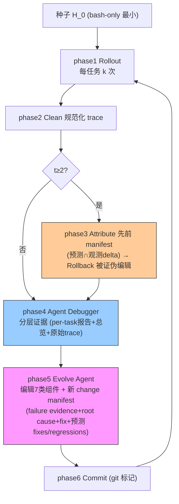

# Agentic Harness Engineering (AHE): Observability-Driven Automatic Evolution of Coding-Agent Harnesses

**作者**: Jiahang Lin, Shichun Liu, Chengjun Pan, Lizhi Lin, Shihan Dou, Zhiheng Xi, Xuanjing Huang, Hang Yan, Zhenhua Han, Tao Gui, Yu-Gang Jiang（复旦 / 北大 / 上海奇迹智锋）
**会议/年份**: arXiv 2026（2604.25850）
**链接**: [arXiv](https://arxiv.org/abs/2604.25850) · [Code](https://github.com/china-qijizhifeng/agentic-harness-engineering)

## 一句话总结

**observability 驱动的闭环 coding-agent harness 演化**：三个匹配的 observability 支柱——❶ component（7 类组件即文件，动作空间可回滚）❷ experience（Agent Debugger 把百万 token trajectory 蒸馏成分层可下钻证据 + 保留原始 trace）❸ decision（change manifest 给每个编辑配自声明预测，下一轮验证）——把每个 harness 编辑变成**可证伪契约**。Terminal-Bench 2 10 轮 69.7%→77.0%，超人工 Codex/ 自演化 ACE·TF-GRPO；冻结 harness 跨基准/跨模型族迁移。**关键发现：self-attribution 对 fix 可靠（5×random）对 regression 盲（2×random）。**

> 📌 **与 [Self-Harness](../%5BArxiv%202026%5D%20Self-Harness/) 高度相似的并行独立工作**。同为 `trajectory → diagnosis → edit → verify → rollback/retain`；AHE 的 **evidence ledger / change manifest** 是 Self-Harness Validation 的强化版，可直接借鉴。

## 核心贡献

1. **AHE 三支柱闭环**：把"自动演化 harness"归结为跨组件/trajectory/决策的 observability 问题，每个编辑变成可证伪的文件级契约。
2. **实证 SOTA + 迁移**：Terminal-Bench 2 69.7%→77.0%，超人工和自动基线；冻结 harness 迁移 SWE-bench（少 12% token）和 3 个模型族（+5.1~+10.1pp）。
3. **揭示两个极限**：组件**非加性交互**（叠加 cap 增益）；self-attribution **对 fix 可靠、对 regression 盲**（regression foresight = 未来最清晰方向）。

## 📖 批读导航

| Section | 内容 |
|---------|------|
| [00 - Abstract, Intro & Related](sections/00-abstract-intro-related.md) | 三支柱、瓶颈在 observability、regression blindness 预告、三足定位 |
| [01 - Method & Experiments](sections/01-method-experiments.md) | NexAU/Agent Debugger/Evolve Agent、change manifest 证据账本、Algorithm 1、组件消融、**RQ3b self-attribution 可靠性** |

## 关键数字

| 指标 | 数值 |
|------|------|
| 组件类型 | 7（system prompt/tool desc/tool impl/middleware/skill/sub-agent/long-term memory） |
| 角色 agent | 3（Code/Agent Debugger/Evolve）共享 GPT-5.4 high |
| Terminal-Bench 2 | 69.7%→77.0%（10 轮 ~32h），超 Codex 71.9% |
| 跨基准 | SWE-bench-verified 最高聚合，少 12% token |
| 跨模型族 | +5.1~+10.1pp（离饱和越远增益越大） |
| 组件消融 | memory 75.3/tool 73.0/middleware 71.9 超种子；prompt −2.3pp |
| **fix 自预测** | precision 33.7% / recall 51.4%（~5× random） |
| **regression 自预测** | precision 11.8% / recall 11.1%（仅 ~2× random，blind） |

## 数据流：AHE 闭环

## 优缺点与还能做什么

### 优点
- **三支柱系统化**：把自动 harness 演化拆成 observability 问题，比单看某一环更完整。
- **evidence ledger 强验证**：change manifest 显式分 fixes/regressions，跨轮求交 + 文件级 rollback。
- **experience observability 折中**：分层蒸馏 + 原始 trace 可下钻（Meta-Harness 全 trace 与 Self-Harness 压缩之间的最优点）。
- **迁移性强 + 增益可定位**：跨基准/模型族迁移，消融定位到结构性组件。

### 局限 / 风险
- **regression blindness**：self-prediction 预测不到会破坏什么（仅 2× random）。
- **组件非加性交互**：叠加有效编辑 cap 总增益，未做 interaction-aware evolution。
- **operating-point 耦合**：step budget/timeout 适配 GPT-5.4 high，跨模型数字混淆可迁移性。
- **governance 不完整**：非完整 guardrail 栈，受控研究原型。

### 还能做什么（对用户改进 Self-Harness）
- **移植 evidence ledger**：把 change manifest（含 fixes/regressions 预测 + 跨轮求交 + 文件级 rollback）用到 Self-Harness Validation。
- **主动预测 regression**：AHE 亲口承认这是最清晰的开放方向——配合 [Phantom-Guardrails](../%5BArxiv%202026%5D%20Phantom-Guardrails/) 的反事实去幻觉，做**双向 falsification** 的验证器。
- **interaction-aware merge**：Self-Harness 的 MergeAccepted / GEPA 式 crossover 必须考虑组件非加性交互，否则叠加增益被 cap。
- **experience 载体**：用分层蒸馏 + 原始 trace 可下钻替代 Self-Harness 的纯压缩 evidence bundle，让 proposer 能反事实验证。

## 阅读 Q&A 记录

- **Q: AHE 和 Self-Harness 关系？**
  A: 并行独立工作（都 2026），结构高度相似（trajectory→diagnosis→edit→verify→rollback）。AHE 引用 Meta-Harness 但与 Self-Harness 是同一问题的两个独立实现。

- **Q: change manifest / evidence ledger 是什么？**
  A: 每个编辑绑定 failure evidence + root cause + targeted fix + predicted impact（expected fixes + at-risk regressions）；下一轮把预测与观测 delta 求交 → per-edit verdict → 自动文件级 rollback 被证伪的编辑。

- **Q: 最重要的负面发现？**
  A: regression blindness（RQ3b）——self-prediction 对 fix 可靠（5×random）对 regression 盲（2×random）。加 Phantom-Guardrails 的 fix 侧假阳性，说明 self-assessment 双向不可信。

- **Q: 增益在哪？**
  A: tools/middleware/long-term memory（结构性），不在 system prompt（散文级，单独 −2.3pp）；且组件非加性交互，叠加 cap 增益。

- **Q: 为什么用最小种子？**
  A: 避免种子污染增益归因——已适配 benchmark 的种子会让人分不清增益来自演化还是种子。Self-Harness 同理。

## 📊 Citation Landscape

**直接相关（本 topic）**
- [Meta-Harness](../%5BArxiv%202026%5D%20Meta-Harness/)（引用 [16]）——AHE 明确对照，都演化全 harness，AHE 强调人类先验最小。
- [Self-Harness](../%5BArxiv%202026%5D%20Self-Harness/)——结构最相似的并行工作。
- [GEPA](../%5BArxiv%202025%5D%20GEPA/)（引用 [1]）——Pareto-frontier trace 反射更新；[Phantom-Guardrails](../%5BArxiv%202026%5D%20Phantom-Guardrails/)——regression blindness 的互补（fix 侧假阳性）。

**方法来源 / 基线**
- NexAU 框架、Agent Debugger（Lizhi Lin）；ACE（playbook）、TF-GRPO（trajectory-feedback GRPO）自演化基线。
- 人工 harness：OpenCode、Terminus-2、Codex。
- Benchmark：Terminal-Bench 2、SWE-bench-verified；base：GPT-5.4、qwen-3.6-plus、gemini-3.1-flash-lite、deepseek-v4-flash。
