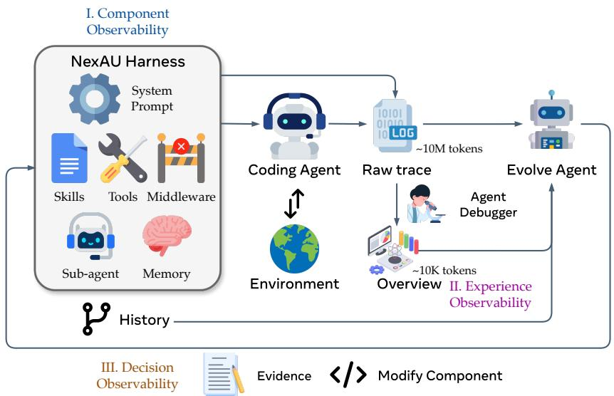
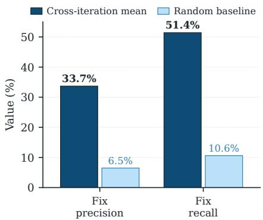

[← 返回 README](../README.md)

# Method & Experiments 方法与实验

## 📌 预览

方法三支柱 + 闭环：(3.1) **NexAU** 可编辑解耦 substrate（7 类组件即文件，最小 bash-only 种子）；(3.2) **Agent Debugger** 分层 trajectory 证据（原始 trace → per-task 分析报告 → benchmark 总览，保留原始 trace 可下钻）；(3.3) **Evolve Agent** 证据驱动可审计编辑（controllability 约束 + change manifest 证据账本）。Algorithm 1：rollout → clean → attribute+rollback → distill → edit → commit。实验：Terminal-Bench 2 69.7%→77.0%，跨基准/跨模型迁移，组件消融定位增益到 tools/middleware/memory，**self-attribution 对 fix 可靠（5× random）对 regression 盲（2× random）**。

---

## 3. Method — 三支柱闭环



*Figure 2: AHE 管线把三个可观测表面连成一个闭环。组件、rollout 经验、编辑决策各作为结构化 artifact 被另一个 agent 读取，每个编辑成为下一轮验证的可证伪预测。*

**设计原则**：base model 固定，只编辑显式 harness；循环每个阶段都必须 observable（忠实记录每阶段产出的 artifact，用结构化分层形式表示，让另一个 agent 能读能作用）。

### 3.1 NexAU：可编辑、解耦的 harness substrate（component observability）

harness $H$ 实例化在 NexAU 框架上，暴露 **7 类正交组件**为固定挂载点的显式文件：system prompt、tool description、tool implementation、middleware、skill、sub-agent config、long-term memory。组件松耦合（加 middleware 不需改 system prompt）。**每个失败模式映射到一个组件类**，每个逻辑编辑 = 一个 git commit（文件级 diff + 回滚粒度免费）。

**种子 $H_0$ 刻意最小**：单个 shell 执行工具，无 middleware/skill/sub-agent。*已适配目标 benchmark 的种子会污染后续每个编辑的归因*——最小种子强迫每个组件靠 rollout 证据挣得存在。

> 💡 **最小种子原则（对用户实验设计的直接启示）**（Hao 批注）：AHE 和 Self-Harness 都刻意用**最小种子**（AHE：bash-only；Self-Harness：短 prompt + 默认 fs/shell 工具），理由一致——**避免种子污染增益归因**。这是自动 harness 演化实验的一条方法论纪律：如果种子已经很强/已适配 benchmark，就分不清增益来自演化循环还是来自种子。用户复现/改进时必须遵守。

### 3.2 Agent Debugger：分层 trajectory 证据（experience observability）

每个任务用 harness $H$ 生成 $k$ 条 trace（含可操作的错误，但散布在百万 token 原始消息里）。用 **Agent Debugger** 把 trajectory 框成**可导航的文件式环境**（每条消息一个文件，用通用 shell/脚本工具访问）。同 query 的 trace 放一个环境，debugger 分析失败 root cause 或成功模式，存成 **per-task 分析报告**（含 pass/fail 状态 ground 住 Evolve Agent）。最后聚合成 **benchmark 级总览**作每轮入口。**额外提供原始 trace**（raw + 轻处理两种形式）供 agent 验证报告中的 claim——progressive disclosure 省 token 又利于决策。

> 💡 **分层证据 + 保留原始 trace = 折中方案（对用户改 Weakness Mining 的关键参考）**（Hao 批注）：AHE 的 experience observability 是 [Meta-Harness](../../%5BArxiv%202026%5D%20Meta-Harness/)（全 trace）和 [Self-Harness](../../%5BArxiv%202026%5D%20Self-Harness/)（压缩 evidence bundle）之间的**折中**，也可能是最优点：
> - **既蒸馏**（per-task 报告 + 总览，让 evolver 消费结构化 root cause，省 token）；
> - **又保留原始 trace 可下钻**（agent 需要验证报告中的 claim 时能读原始 trace）。
>
> 这直接回应了 Meta-Harness 消融的教训（压缩丢诊断信号）**和** Self-Harness 的效率需求。**对用户改 Weakness Mining 的启示**：不要么全压缩（Self-Harness，易幻觉失败）要么全展开（Meta-Harness，贵）——AHE 式的"蒸馏报告 + 原始 trace 可下钻验证"可能是让 proposer 既高效又能反事实验证（去幻觉）的最佳载体。

### 3.3 Evolve Agent：证据驱动、可审计的编辑（decision observability）

Evolve Agent 每轮读分层证据语料，决定增/改/删哪些组件，应用编辑并记录每个编辑的推理。两条约束实现 decision observability：

1. **Controllability**：Evolve Agent 只在 harness workspace 内写；runs 目录、tracer、verifier、LLM 配置只读，种子 system prompt 标记不可删。这挡住无约束自修改者会走的捷径（禁用 verifier、换模型、加推理预算），保证每个记录的增益都可归因到 harness 编辑。
2. **Evidence-driven + 记录预测**：每个编辑附一个 manifest 条目，命名 **failure evidence、inferred root cause、targeted fix、predicted impact（expected fixes + at-risk regressions）**；这个 manifest 就是循环的 **evidence ledger（证据账本）**。下一轮把 predicted-fix/predicted-regression 集合与观测到的 task 级 delta 求交，产生 per-edit verdict。**每个编辑因此对下一次评估可证伪，用可测契约取代 rationale 驱动的自我辩护。**

> 💡 **change manifest = evidence ledger（用户明确标注的关键机制）**（Hao 批注）：这是用户在任务里特别点名的机制——"每个修改都必须绑定 failure evidence、root cause、expected fix 和 regression risk"。它比 Self-Harness 的 audit 记录 $a_j$ **更结构化、更强**：
> - Self-Harness $a_j$：targeted 失败模式 + 编辑面 + 预期行为效果 + 回归风险。
> - AHE manifest：failure evidence + root cause + targeted fix + **predicted impact（明确分 expected-fixes 和 at-risk-regressions 两个集合）**。
> - **关键增强**：AHE 下一轮把预测集合与观测 delta **求交**产生 per-edit verdict，**自动 rollback 被证伪的编辑**（文件级粒度）。Self-Harness 的验证是"接受/拒绝当轮候选"，AHE 是"跨轮验证已 commit 的编辑并回滚"——一个**闭环 falsification**。
> - **对用户的直接价值**：这个 evidence-ledger + 跨轮求交验证 + 文件级 rollback 是比 Self-Harness 更成熟的 Proposal Validation 范式，用户可直接借鉴到"明显更强的 Self-Harness"的验证阶段。

**Algorithm 1（AHE 外层循环）**：
```
Require: 种子 H_0, base model M, benchmark D, 每任务 rollout 数 k, 最大迭代 N
1: H_best ← H_0
2: for t = 1 to N:
3:   T_t ← Rollout(M, H_{t-1}, D, k)              # phase1: 每任务 k 次 rollout
4:   T̃_t ← Clean(T_t)                             # phase2: trace 规范化
5:   if t ≥ 2:                                     # phase3: 归因先前 manifest, 再回滚
6:     V_t ← Attribute(C_{t-1}, T_{t-1}, T_t)
7:     H_{t-1} ← Rollback(H_{t-1}, V_t)
8:   else V_t ← ∅
9:   R_t ← AgentDebugger(T̃_t)                     # phase4: 分层蒸馏
10:  (H_t, C_t) ← Evolve(H_{t-1}, R_t, V_t)        # phase5: workspace 编辑 + 新 manifest
11:  Commit(H_t, C_t, t)                           # phase6: git 标记迭代
12:  if pass@1(T_t) > pass@1(H_best): H_best ← H_t
13: return H_best
```
**归因在蒸馏之前**——verdict 落进证据语料，把每个先前 manifest 条目绑成契约而非 rationale。$k\geq 2$ rollout 让每任务带 pass-rate 信号。

## 4. Experiments

**Setup**：Terminal-Bench 2 全 89 任务驱动演化（4 easy/55 medium/30 hard，超时延到 1 小时）；SWE-bench-verified（500 任务）测跨基准迁移。**三个角色 agent（Code Agent / Agent Debugger / Evolve Agent）共享一个 base model GPT-5.4 high**。指标：pass@1 + tokens/trial。

**RQ1 主结果（Table 1）**：单个 10 轮 AHE campaign（约 32 小时）从 bash-only 种子出发：

| 方法 | All 89 | Easy 4 | Med 55 | Hard 30 |
|------|--------|--------|--------|---------|
| OpenCode（人工） | 47.2% | 75.0% | 52.7% | 33.3% |
| Terminus-2（人工） | 62.9% | 75.0% | 74.5% | 40.0% |
| Codex（人工） | 71.9% | 75.0% | 80.0% | 56.7% |
| NexAU₀（种子） | 69.7% | 87.5% | 78.2% | 51.7% |
| ACE（自演化） | 68.9% | 91.7% | 78.2% | 48.9% |
| TF-GRPO（自演化） | 72.3% | 100% | 79.4% | 55.6% |
| **AHE** | **77.0%** | **100%** | **88.2%** | 53.3% |

AHE 超所有基线（Hard 层略逊 Codex，归因于长 horizon 上组件间干扰而非缺能力）。**prompt-only 自演化（ACE/TF-GRPO）错过了 AHE 增益所在的组件**——ACE 蒸自然语言 playbook、TF-GRPO 强化成功工具序列，都不开放周边 scaffolding 编辑；AHE 联合演化 prompt+tools+middleware+memory，增益集中在后三者（正是 ACE/TF-GRPO 不碰的层）。

**RQ2 迁移**：冻结 harness **不再演化**迁移——SWE-bench-verified 上最高聚合成功率、比种子少 12% token；跨模型族 +5.1~+10.1pp（deepseek-v4-flash +10.1、qwen-3.6-plus +6.3、gemini-3.1-flash-lite +5.1，都超同族 GPT-5.4 的 +2.3）。**离饱和越远的 base 越依赖 AHE 固化在 tools/middleware/memory 里的协调模式**。

**RQ3a 组件消融（Table 3）**：单组件换入种子——memory-only 75.3%、tool-only 73.0%、middleware-only 71.9% 都超种子，**system-prompt-only 67.4% 唯一 regress（−2.3pp）**。**组件非加性交互**：三个正的单组件增益求和 +11.1pp > 完整 AHE +7.3pp——memory/middleware/prompt 都推向同种 closure 式验证，叠加浪费回合在冗余复检。

> 💡 **组件消融批读（增益在结构不在散文 + 非加性）**（Hao 批注）：两个关键结论对用户和 Self-Harness 都重要：
> - **增益在"事实性 harness 结构"（tools/middleware/memory），不在"散文级策略"（system prompt）**：system prompt 单独换入反而 −2.3pp。这印证 [Self-Harness](../../%5BArxiv%202026%5D%20Self-Harness/) 的定性发现（不是把 prompt 变长），并更进一步——**prose-level 策略不跨任务/模型迁移，结构性组件才迁移**。对用户：改进 Self-Harness 时应重视 tool/middleware/memory 类结构编辑，而非纠结 prompt 措辞。
> - **组件非加性交互 → 叠加 cap 增益**：这是 Self-Harness 的 MergeAccepted（合并多个通过的编辑）会遇到的**同一陷阱**——多个各自有效的编辑合并后可能因交互而不是简单相加。AHE 明确指出"interaction-aware evolution"是 future work。用户改进 Proposal Search 时（尤其是 GEPA 式 merge/crossover 多 lineage），必须考虑组件交互，否则叠加的增益会被 cap。

**RQ3b self-attribution 可靠性（Figure 4，最关键发现）**：



*Figure 4: GPT-5.4 AHE 循环 9 轮的自预测跨迭代平均 precision/recall（对比随机基线）。左：fix 预测；右：regression 预测。*

- **Fix 预测**：precision 33.7% / recall 51.4%，~**5× 随机基线**（6.5% / 10.6%）→ evidence-driven targeting，每个编辑落在真实、agent 预期的目标上。
- **Regression 预测**：precision 11.8% / recall 11.1%，仅 ~**2× 随机**（5.6% / 5.4%）→ **regression blindness**：agent 能论证编辑为何 help，却无法可靠命名它将破坏哪些 task。这产生演化曲线的非单调步。**闭合此 gap 是未来自演化循环最清晰的方向。**

> 💡 **RQ3b = 本 topic 最重要的实证发现（务必内化）**（Hao 批注）：这是整个 Harness topic 里对"self-improving harness 可靠性"最硬的实证，直接支撑用户的研究方向：
> - **不对称的自评估可靠性**：LLM 对"我修好了什么"预测尚可（5× random），对"我弄坏了什么"预测几乎失灵（2× random）。
> - **与 [Phantom-Guardrails](../../%5BArxiv%202026%5D%20Phantom-Guardrails/) 合起来夹击**：Phantom 说 fix 侧也有假阳性（诊断出不存在的失败）；AHE 说 regression 侧有严重假阴性（预测不到破坏）。**两篇合起来 = self-improving harness 的 self-assessment 在 fix 和 regression 两个方向都不可信。**
> - **对"明显更强的 Self-Harness"的直接指令**：Validation 阶段必须做**双向 falsification**——(1) 对提出的 fix 做反事实验证（Phantom：这个失败真存在吗？）；(2) 对 regression 做主动预测+验证（AHE：这个编辑会破坏什么？现在预测不准，需要专门机制）。Self-Harness 现在的 held-out 回归门是**被动**发现 regression（评估后才知道），AHE 指出**主动预测** regression 是开放问题——用户若能让 proposer 主动、可靠地预测 regression，就是一个明确的贡献点。

## 5. Conclusion & Limitations

**结论**：AHE 把 coding-agent harness 变成可学习的适配面（base model 固定）——组件即文件、rollout 蒸馏成分层证据、每个编辑绑定可证伪的下一轮预测。harness 级演化是模型侧训练的互补轴：一个外部化、可审计的、coding-agent 经验可累积的表面。

**局限**：(1) benchmark scope 有限（Terminal-Bench 2 演化 + SWE-bench 迁移，未测更广语言/repo 级部署/human-in-loop）；(2) **evolution operating point 耦合**（step budget/timeout 适配 GPT-5.4 high，跨模型数字混淆了 harness 可迁移性与 operating-point 耦合）；(3) **self-modification governance 不完整**（编辑限于 workspace + manifest 归因 + 文件级回滚，但非完整 guardrail 栈，应视为受控研究原型）。

> 💡 **总结 + 对用户的三点行动价值**（Hao 批注）：AHE 对用户"改进 Self-Harness"的三点直接价值：
> 1. **evidence ledger / change manifest**：比 Self-Harness audit 更结构化的验证机制（failure evidence + root cause + fix + predicted fixes/regressions + 跨轮求交 + 文件级 rollback），可直接移植到 Self-Harness 的 Validation。
> 2. **experience observability 的折中**：分层蒸馏报告 + 原始 trace 可下钻——既避免 Self-Harness 压缩过度（易幻觉），又避免 Meta-Harness 全 trace 太贵，是 Weakness Mining 的理想载体。
> 3. **regression blindness 的实证 + interaction-aware evolution 的空白**：两个 AHE 亲口承认的 open problem，正是用户可攻的点——主动预测 regression（配合 Phantom 的反事实去幻觉）+ 考虑组件非加性交互的 merge/crossover（配合 GEPA 的 population）。

> 💡 **Q&A 批注记录**（Hao 批注）：
> - **Q：AHE 和 Self-Harness 谁引用谁？**
>   A：并行独立工作（都 2026）。AHE 引用了 Meta-Harness [16] 但结构上与 Self-Harness 高度相似（都是 trajectory→diagnosis→edit→verify→rollback）。可视为对同一问题的两个独立实现。
> - **Q：AHE 的 evidence ledger 比 Self-Harness 强在哪？**
>   A：manifest 显式分 expected-fixes / at-risk-regressions 两个集合，下一轮与观测 delta 求交产生 per-edit verdict，自动文件级 rollback 被证伪的编辑。是跨轮闭环 falsification，比 Self-Harness 当轮 accept/reject 更强。
> - **Q：最重要的负面发现？**
>   A：regression blindness（RQ3b）——self-prediction 对 fix 可靠（5×random）对 regression 盲（2×random）。加上 Phantom-Guardrails 的 fix 侧假阳性，说明 self-assessment 双向不可信。
> - **Q：增益在哪个组件？**
>   A：tools/middleware/long-term memory（结构性），不在 system prompt（散文级，单独换入 −2.3pp）。且组件非加性交互，叠加会 cap 增益。
