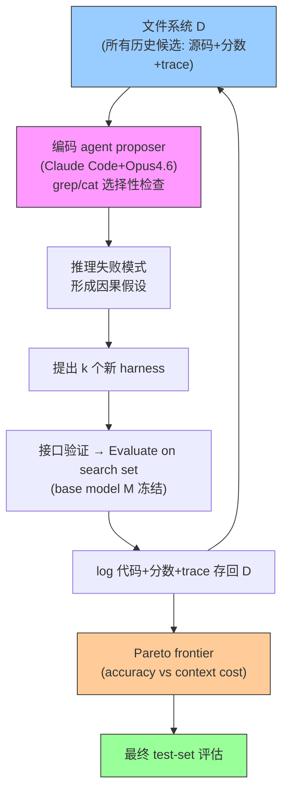

# Meta-Harness: End-to-End Optimization of Model Harnesses

**作者**: Yoonho Lee, Roshen Nair, Qizheng Zhang, Kangwook Lee, Omar Khattab, Chelsea Finn（Stanford / KRAFTON / MIT）
**会议/年份**: arXiv 2026（2603.28052）
**链接**: [arXiv](https://arxiv.org/abs/2603.28052) · [Project](https://yoonholee.com/meta-harness/) · [Artifact](https://github.com/stanford-iris-lab/meta-harness-tbench2-artifact)

## 一句话总结

**搜索 harness 代码的外层循环**：一个编码 agent proposer（Claude Code + Opus-4.6）通过**文件系统全访问所有历史候选的源码、分数、执行 trace**（grep/cat 选择性检查，单评估 up to 10M token），维护 population + Pareto frontier 搜索最优 harness。中心论点：现有 text optimizer 把反馈压得太狠、不适配长 horizon 的 harness 搜索；raw trace 访问才是命门（消融：full 50.0 vs scores-only 34.6）。三域验证：文本分类 +7.7、数学推理 +4.7 跨 5 模型、TerminalBench-2 Haiku 4.5 #1。

> 📌 **[Self-Harness](../%5BArxiv%202026%5D%20Self-Harness/) 最直接的前作**。Self-Harness = 沿它"往前推一步"：external meta-agent 优化 target harness → target 自己优化自己的 harness。读透本篇才能定位 Self-Harness 的 novelty 与代价。

## 核心贡献

1. **Meta-Harness 系统**：把 harness 工程自动化为代码空间的外层搜索，proposer = 编码 agent + 文件系统全历史访问（而非压缩摘要）。
2. **feedback richness 论点 + 消融**：raw execution trace 访问是 harness 搜索的关键成分（full traces 50.0 vs scores+summary 34.9 vs scores-only 34.6）。
3. **三域 SOTA**：文本分类（超 ACE 7.7、4× 更少 context）、数学检索（+4.7 跨 5 held-out 模型）、TerminalBench-2（Opus 4.6 #2、Haiku 4.5 #1）。

## 📖 批读导航

| Section | 内容 |
|---------|------|
| [00 - Abstract, Intro & Related](sections/00-abstract-intro-related.md) | 摘要、feedback 压缩问题、Table 1 反馈规模对比、方法血统 |
| [01 - Method & Experiments](sections/01-method-experiments.md) | 形式化、搜索循环 Algorithm 1、**Meta-Harness vs Self-Harness 对比表**、三域实验、Table 3 消融 |

## 关键数字

| 指标 | 数值 |
|------|------|
| proposer | Claude Code + Opus-4.6（读 median 82 文件/轮，引用 20+ 历史候选） |
| 反馈规模 | Full history，10 MTok/iter（比第二名大 ~400×） |
| 文本分类 | 48.6%，超 ACE +7.7 / MCE +8.6，context 11.4K vs 50.8K/28.5K |
| 数学推理 | 200 IMO 题，+4.7 平均跨 5 held-out 模型 |
| TerminalBench-2 | Opus 4.6 76.4%（#2）/ Haiku 4.5 37.6%（#1） |
| 消融 | full traces 50.0 vs scores+summary 34.9 vs scores-only 34.6 |

## 数据流：Meta-Harness 搜索循环

## 优缺点与还能做什么

### 优点
- **rich diagnostic access**：全 trace 让 proposer 做因果推理（识别 confound、隔离因果变量、反事实测试）——消融证明这是命门。
- **泛化 + 可迁移**：发现的 harness 迁移到 OOD 数据集和未见 base 模型；可读、可复用到更强模型。
- **代码空间正则**：程序表示偏向连贯算法而非脆弱 hard-code；过拟合可检查。
- **无手工搜索结构**：不用固定 scaffold/archive，随编码 agent 变强自动改进。

### 局限 / 风险
- **依赖一个特别强的 proposer**（Claude Code + Opus-4.6）——换弱 proposer 效果未知（正是 Self-Harness 的场景）。
- **成本高**：10M token/评估，60 harness/run。
- **TerminalBench-2 无独立 split**（search=eval 同 89 任务），靠手工审计防泄漏。
- **未 co-evolve 模型权重**（future work）。

### 还能做什么（对 Harness topic / 用户研究）
- **理解 Self-Harness 的坐标**：Self-Harness = 内化（去外部强 proposer），代价是 proposer 变弱 + 反馈压缩 + 搜索退化。
- **融合方向**：自 proposer（内化）+ rich-trace 访问（Meta-Harness 证明关键）+ population/Pareto（Meta-Harness 已用）+ 反事实去幻觉（Phantom-Guardrails）——可能是"明显更强的 Self-Harness"。
- **尖锐研究问题**：弱自 proposer 相比强外部 proposer 损失多少？能否用更好的搜索/验证补回来？

## 阅读 Q&A 记录

- **Q: Meta-Harness vs Self-Harness 一句话区别？**
  A: Meta-Harness 用外部强编码 agent 搜索 target 的 harness；Self-Harness 让 target 自己改自己。后者去外部依赖但 proposer 变弱、反馈压缩、搜索退化。

- **Q: 为什么强调文件系统全访问？**
  A: Table 3 消融——raw trace 让 acc 从 34.6 涨到 50.0；summary 几乎没用甚至有害。harness 长 horizon，压缩丢诊断信号。

- **Q: Meta-Harness 有 population/Pareto，为什么 Self-Harness 没有？**
  A: Meta-Harness 强外部 proposer 撑得起 population；Self-Harness 弱自 proposer 退化成单谱系 greedy。用户借 GEPA 加回 population 需验证"弱自 proposer + population"是否成立。

- **Q: 对用户改 Weakness Mining 的启示？**
  A: 除加反事实验证去幻觉外，还应考虑给 proposer 更多原始 trace 访问（而非只给聚类摘要）——Meta-Harness 用消融证明这是关键。

## 📊 Citation Landscape

**直接相关（本 topic）**
- [Self-Harness](../%5BArxiv%202026%5D%20Self-Harness/)——直接后继，内化改进循环。
- [GEPA](../%5BArxiv%202025%5D%20GEPA/)——Table 1 里的 "Summary" 类 text optimizer，Meta-Harness 的最近反馈对照（Meta-Harness 说它压缩太狠；用户想借它的搜索结构）。
- [Agentic Harness Engineering](../%5BArxiv%202026%5D%20Agentic-Harness-Engineering/) / [RHO](../%5BArxiv%202026%5D%20RHO-Self-Preference/) / [Phantom-Guardrails](../%5BArxiv%202026%5D%20Phantom-Guardrails/)——同 topic 的并行/反问题工作。

**方法来源 / 对照**
- Text optimizer：OPRO、TextGrad、ProTeGi、Feedback Descent、AlphaEvolve/OpenEvolve、TTT-Discover。
- Code/agent search：Evolution through LLMs、FunSearch、ADAS、AFlow、MemEvolve。
- 手工 harness baseline：ACE（Agentic Context Engineering）、MCE（Meta Context Engineering）、Terminus-KIRA。
- credit assignment / meta-learning 血统；RAG / MemGPT / Recursive LMs（自适应外部访问）。
