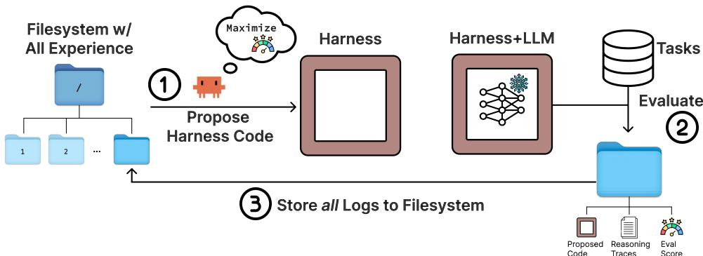

[← 返回 README](../README.md)

# Abstract, Intro & Related Work 摘要、引言与相关工作

## 📌 预览

Meta-Harness = **搜索 harness 代码的外层循环系统**。核心设计：一个 **agentic proposer（编码 agent = Claude Code + Opus-4.6）通过文件系统访问所有历史候选的源码、分数、执行 trace**（用 grep/cat 选择性检查），而非从压缩的 per-candidate 摘要优化。中心论点：现有 text optimizer 把反馈压得太狠（memoryless / 只看标量分 / 短模板摘要）——而 harness 作用于长 horizon，压缩反馈丢掉了追溯下游失败到早期设计决策的信息。单次评估可产 up to 10M token 诊断信息（比现有 text optimizer 的反馈预算大 3 个数量级）。

> 📌 **这是 [Self-Harness](../%5BArxiv%202026%5D%20Self-Harness/) 最直接的前作**。用户明确指出：Self-Harness 的 Introduction "基本就是沿着 Meta-Harness 往前推一步"——**external meta-agent 优化 target harness → target agent 自己优化自己的 harness**。读透这篇才能定位 Self-Harness 的 novelty。

---

## Abstract

The performance of LLM systems depends not only on model weights, but also on their **harness**: the code that determines what information to store, retrieve, and present to the model. Yet harnesses are still designed largely by hand, and existing text optimizers are poorly matched to this setting because they **compress feedback too aggressively**: they are memoryless, condition only on scalar scores, or restrict feedback to short templates or summaries. We introduce **Meta-Harness**, an outer-loop system that searches over harness code for LLM applications. It uses an agentic proposer that accesses the **source code, scores, and execution traces of all prior candidates through a filesystem**. On online text classification, Meta-Harness improves over a SOTA context management system (ACE) by 7.7 points while using 4× fewer context tokens. On retrieval-augmented math reasoning, a single discovered harness improves accuracy on 200 IMO-level problems by 4.7 points on average across five held-out models. On agentic coding, discovered harnesses surpass the best hand-engineered baselines on TerminalBench-2.

> 💡 **核心洞察（feedback richness 是 harness 搜索的命门）**（Hao 批注）：Meta-Harness 的立论极其锋利，且直接影响如何理解 Self-Harness 的取舍：
> - **问题**：换 harness 能在同一 benchmark 上造成 6× 性能差（[47]）。harness 和模型本身一样重要，但 harness 工程仍主要靠手工。
> - **为什么现有 text optimizer 不行**：OPRO（只看过去 solution-score 对）、TextGrad（当前 artifact 的文本反馈）、GEPA（rollout trace 的反射式摘要）、AlphaEvolve（program database + 标量分）——都把反馈压到 100~30,000 token。但 **harness 作用于长 horizon**：一个"存什么/何时取/怎么呈现"的选择会影响很多推理步之后的行为，压缩反馈丢掉了追溯下游失败到早期 harness 决策的信息。
> - **Meta-Harness 的解法**：给 proposer **文件系统全访问**——所有历史候选的源码+分数+执行 trace，用 grep/cat 选择性检查，单次评估可产 10M token 诊断信息（比现有大 3 个数量级）。
>
> **⚠️ 对理解 Self-Harness 的关键**：Meta-Harness 论证"**丰富的原始 trace 访问是 harness 搜索的命门，压缩会丢诊断信号**"。而 Self-Harness 恰恰**把失败压缩成 evidence bundle（聚类失败模式）**喂给 proposer——这是一个刻意的简化（因为 proposer 换成了较弱的 target 模型自己）。这个取舍是双刃剑：Self-Harness 更轻更自足，但可能因丢诊断细节而**更易受 [Phantom-Guardrails](../%5BArxiv%202026%5D%20Phantom-Guardrails/) 的幻觉失败影响**（Meta-Harness 能看原始 trace 去证伪假设，Self-Harness 看的是已聚类的失败签名）。

## 1. Introduction & Table 1（feedback 规模对比）

*Figure 2: Meta-Harness 搜索循环。(1) agent 读一个含所有历史候选源码、执行 trace、分数的文件系统，提出新 harness；(2) 在评估任务上评估；(3) 所有 log（提出的代码、推理 trace、评估分数）存进文件系统新目录，循环重复。*

**Table 1（text optimization 方法的反馈规模对比）**：

| 方法 | History | Log 内容 | MTok/iter |
|------|---------|----------|-----------|
| OPRO | Window | 过去 (solution, score) 对 | 0.002 |
| TextGrad | Last | 当前 artifact 的文本反馈 | 0.015 |
| AlphaEvolve | Window | program database + 评估分 | 0.022 |
| GEPA | Summary | rollout trace 的反射式反馈 | 0.008 |
| Feedback Descent | Summary | 比较 + 文本反馈 | 0.012 |
| TTT-Discover | Window | 前一个 solution 片段 | 0.026 |
| **Meta-Harness** | **Full** | **所有 log 和分数** | **10.0** |

> 💡 **Table 1 批读（Meta-Harness 的定位坐标）**（Hao 批注）：这张表是 Meta-Harness 全文的定位坐标——它把自己放在所有 text optimizer 的"反馈规模"极端（Full history，10 MTok/iter，比第二名大 ~400×）。注意 **GEPA 在这里是 "Summary" 类**（rollout trace 的反射摘要，0.008 MTok/iter）——这正是用户想用来改进 Self-Harness 的 GEPA。有意思的张力：Meta-Harness 说 GEPA 的 summary 压缩太狠、不适合 harness 搜索；但用户想借 GEPA 的**搜索结构**（population/Pareto/crossover）而非它的 feedback 压缩。**这两者可以分开**：借 GEPA 的 candidate-search 结构 + 保留 Meta-Harness 式的 rich trace 访问，是一个自洽的组合。

## 2. Related Work

**External memory & adaptive access**：RAG、interleaved retrieval+reasoning、memory-based agents、recursive LMs——都是自适应访问外部 context 的机制。Meta-Harness 用类似访问模式，但在更苛刻的 harness 工程场景（proposer 选择性检查大量外部历史）。

**Executable code search**：用大模型当 mutation/crossover 算子的进化程序搜索、FunSearch（在固定 scaffold 内进化函数）、ADAS（meta-agent 编程新 agent）、AFlow（搜 workflow graph）、memory design 搜索。Meta-Harness 区别：搜索**领域特定 harness**（prompt 构造、检索、状态更新策略，任务间 reset），外层循环刻意最小化——不依赖固定 scaffold / archive / 持久 memory，给 proposer 无限制文件系统访问。

**Text optimization**：ProTeGi、TextGrad、OPRO、GEPA、AlphaEvolve/OpenEvolve、Feedback Descent——迭代改进 prompt/文本 artifact。Meta-Harness 区别：优化目标是**完整可执行过程**，相关环境反馈分布在代码/分数/trace 里、难以提前摘要。

> 💡 **相关工作批读（Meta-Harness 的方法血统）**（Hao 批注）：Meta-Harness 把自己定位在 **credit assignment + meta-learning** 的血统里，但用一个新机制（编码 agent 的文件系统访问）实现——不更新模型权重，而在 **harness 层做 credit assignment**：用历史 rollout 经验推理哪些步骤/组件对失败负责，然后重写治理未来行为的外部代码。这个"harness 层 credit assignment"的框架对 CKMIL 无关，但对理解整个 Harness topic 很重要：**Weakness Mining（Self-Harness）本质就是 harness 层的 credit assignment**——把失败归因到 agent 行为机制。Meta-Harness 用全 trace 做归因，Self-Harness 用聚类失败签名做归因。
