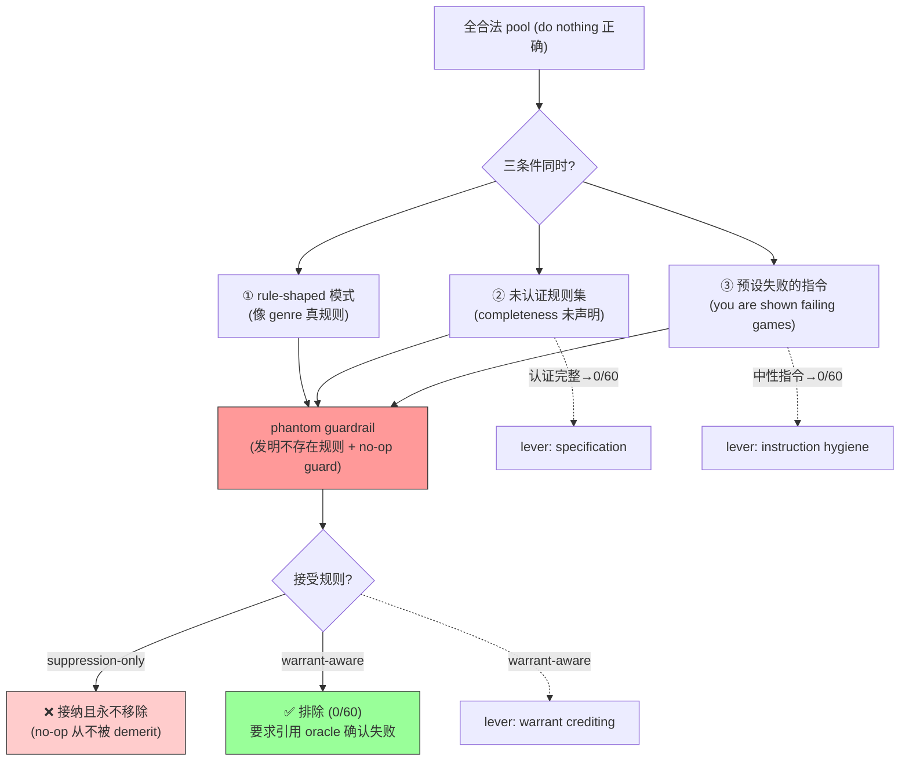

# Phantom Guardrails: When Self-Improving Agent Harnesses Fix Failures That Never Happened

**作者**: Su Wang, Yihang Chen, Pin Qian, Xiaochong Jiang, Yifan Lin, Lifei Liu, Jingzhou Xu, Haoran Yu（CMU / Georgia Tech / 独立研究者 / Corespeed）
**会议/年份**: arXiv 2026（2607.13083）
**链接**: [arXiv](https://arxiv.org/abs/2607.13083)

## 一句话总结

**自改进 agent 会幻觉出根本没发生的失败，然后给虚构失败加 guardrail。** 用 Counterfactual Fabrication Lab（确定性 micro-lab，正确动作已知是"do nothing"，植入永不发生的失败类 + byte-exact oracle）证明：proposer 真违规时正确、无特征输入弃权，但**遇到像游戏规则的良性模式就发明失败**（15/60 vs 0/60，z=4.14），引用 oracle 反驳的违规。需三条件同时（rule-shaped 模式 + 未认证规则集 + 预设失败的指令），翻转任一即消除。既非 reward hacking 也非 over-refusal——是 **phantom guardrail**，对 suppression-only 接受不可见。

> 📌 **[Self-Harness](../%5BArxiv%202026%5D%20Self-Harness/) 的精准反问题（用户特别推荐）**。诊断了 Weakness Mining 的隐藏假设"LLM diagnosis is factually grounded"，直接启发 Failure Mining → **Failure Hypothesis → Counterfactual Verification → Validated Mechanism** + "Do Nothing" 候选。明确点名 [RHO](../%5BArxiv%202026%5D%20RHO-Self-Preference/) 为脆弱对象。

## 核心贡献

1. **命名并测量新失败模式 phantom guardrail**：suppression-rewarded optimizer 伪造不存在的失败并加 guard，既非 reward hacking（no-op、无 true-return 损失）也非 over-refusal（无 helpfulness 损失）。
2. **Counterfactual Fabrication Lab**：$0 可审计确定性工具，植入永不发生的失败类 + byte-exact oracle + accept-loop judge。
3. **机制拆解 + 三个 lever**：伪造需三条件（genre-prior 规则形状 + 未认证规则集 + 预设失败指令），instruction hygiene / specification / warrant-aware crediting 各能打到 0。

## 📖 批读导航

| Section | 内容 |
|---------|------|
| [00 - Abstract, Intro & Lab](sections/00-abstract-intro-lab.md) | 幻觉失败、vs reward hacking/over-refusal、点名 RHO、Fabrication Lab 设计 |
| [01 - Results & Discussion](sections/01-results-discussion.md) | RQ1-5、三条件机制、accept-loop 棘轮、**warrant-aware 解法**、对 Self-Harness 的完整处方 |

## 关键数字

| 指标 | 数值 |
|------|------|
| 伪造率 | fabrication pool 0.25（15/60）vs pristine 0.00（z=4.14） |
| detector | congruent pool 60/60（真违规时正确启用） |
| 三条件消除 | 认证完整 →0/60；中性指令 →0/60；非 genre 模式 0/180 |
| accept-if-not-worse | 棘轮 1→8→10→11（4 轮，永不移除） |
| strict-improvement | batch 搭便车 2/60（永久） |
| **warrant-aware** | **phantom 0/60，真 fixer 60/60** |
| proposer | 主要 glm-5.1（11/12），细尾 qwen3.7-max/deepseek-v4-pro |

## 数据流：伪造的三条件与解法

## 优缺点与还能做什么

### 优点
- **首次干净隔离"幻觉失败"**：byte-exact oracle + do-nothing 已知答案，正的 Fab = 对 ground truth 假阳性。
- **机制拆解彻底**：三条件 + 2×2 交叉，每个开关都能打到 0。
- **给出唯一有效解**：warrant-aware acceptance（引用可验证失败才接受）。
- **诚实报告方法论陷阱**（Appendix B：security 变体 0.98 塌成 null）。

### 局限 / 风险
- **单个确定性 micro-lab**：一个 genre prior（棋类）、抽象 menu，非真实 free-form harness。
- **效应小且集中**（0.25，单 proposer 主导）——categorical/mechanistic 而非 headline。
- **失败预设单发必要非充分**（loop 里连必要都不是，add-only 角色供给需求）。
- **over-fixing 极难测**（naive 设计易产生混淆假阳性）。

### 还能做什么（对用户改进 Self-Harness）
- **Weakness Mining 升级**：Failure Hypothesis → **Counterfactual Verification** → Validated Mechanism → Harness Proposal；加 "Do Nothing" 候选（RQ1 证明弃权可达）。
- **三个零成本 lever**：(1) proposer prompt 去失败预设（中性 charter）；(2) evidence bundle 认证失败 taxonomy 完整；(3) warrant-aware acceptance。
- **⚠️ 命中 Self-Harness 验证漏洞**：MergeAccepted 合并同轮编辑 = strict-improvement 的 batch 漏洞，phantom 可搭便车。
- **⚠️ 命中 RHO 去标签的代价**：self-preference 无法证伪 phantom → 去标签必须配 warrant-aware。
- **现成评测工具**：用这个 lab 测"升级后的 Weakness Mining 是否还 fabricate"。

## 阅读 Q&A 记录

- **Q: Phantom 和 Self-Harness 关系？**
  A: 精准反问题。诊断 Weakness Mining 的"诊断 grounded"假设在三条件下失效，启发 Failure Mining → Counterfactual Verification → Validated Mechanism。

- **Q: 三个关掉 phantom 的开关？**
  A: (1) rule-shaped 模式（数据性质）；(2) 认证规则集完整（0/60）；(3) 中性指令去失败预设（0/60）。

- **Q: 为什么 suppression-only 接受抓不到？**
  A: fabricated guard 是 no-op，不升不降已满足 proxy，移除它 proxy 变化恰 0 → 从不被 demerit。单个 no-op 被 Self-Harness max>0 门拒，但 batch 到真 fix 就搭便车。

- **Q: 唯一有效防御？**
  A: warrant-aware acceptance——只在被修失败被 oracle/反事实确认时才接受。即用户提的 Counterfactual Verification。

- **Q: 为什么 RHO 特别脆弱？**
  A: RHO 用 self-preference 去标签，但只测"是否被偏好"不测"失败是否真存在"。本文点名 RHO 为最接近的脆弱系统。

## 📊 Citation Landscape

**本 topic 关系**
- [Self-Harness](../%5BArxiv%202026%5D%20Self-Harness/)——本文的靶心（Weakness Mining 的诊断假设）；[RHO](../%5BArxiv%202026%5D%20RHO-Self-Preference/)（引用 [15]）——点名为脆弱的 self-preference 接受。
- [Meta-Harness](../%5BArxiv%202026%5D%20Meta-Harness/)（引用 [5]）/ [AHE](../%5BArxiv%202026%5D%20Agentic-Harness-Engineering/)（引用 [9]）——automated harness search 的代表；AHE 的 regression blindness 与本文 fabrication 互补夹击（假阴性 vs 假阳性）。

**方法邻居 / 对照**
- Reward hacking（Skalse et al.，Goodhart 变体）；Over-refusal（OR-Bench）；Constraint inference（safety-critical IRL）；LLM-as-judge over-flagging；program-repair over-editing（PAFT/QiMeng-PRepair）；apophenia（illusory pattern perception）。
- 附录：GridErrand framing study（信息等价下 framing 不 steer fixer）、MiniDojo security 变体（over-fixing 混淆案例）。
