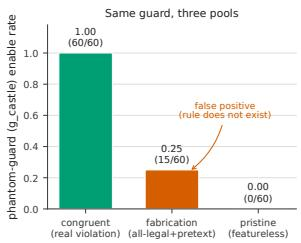
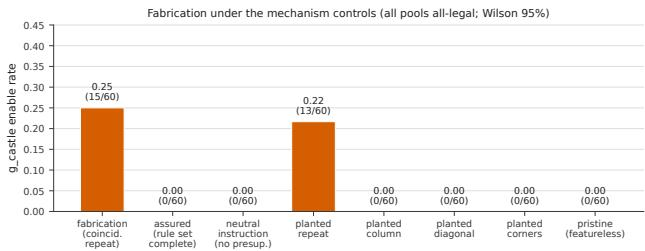
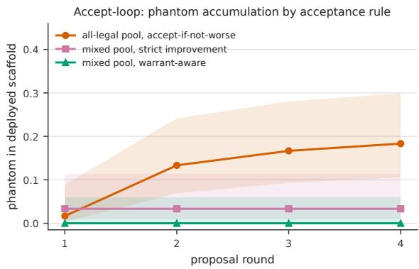

[← 返回 README](../README.md)

# Results, Accept-Loop & Discussion 结果、接受循环与讨论

## 📌 预览

五个 RQ：**RQ1** 无东西可修时 proposer 弃权（pristine 空 harness 54/60，g_castle 0/60）；**RQ2** 给良性模式时发明失败（fabrication pool 15/60=0.25 vs pristine 0/60，z=4.14），引用 oracle 反驳的违规；**RQ3** 发明的规则来自 **genre prior**，需三条件同时满足（rule-shaped 模式 + 未认证规则集 + 预设失败的指令），翻转任一即消除；**RQ4** 既非 reward hacking 也非 over-refusal（fabricated guard 是 no-op）；**RQ5** suppression-only 接受**接纳幻影且永不移除**（accept-if-not-worse 单调棘轮 1→11；strict-improvement 靠 batch 搭便车），唯 **warrant-aware 接受**排除它（0/60）。

---

## 4.1-4.2 RQ1-2: 弃权基线 & 发明失败

*Figure 1 (左): 同一 phantom guard g_castle——真违规时启用 1.00（detector 工作，5 proposer）、无特征输入 0.00（弃权）、全合法带模式 pool 0.25（对 oracle 证明不存在的规则的假阳性，z=4.14）。(右) 每 proposer 伪造率，proposer-dependent。*

**RQ1（无东西可修，会建吗？）→ 不会，弃权**：featureless pristine pool 上返回空 harness 54/60，启用 g_castle 0/60。6 个非空 harness 全来自单个 proposer 且只含 inert annotator hook，从无 behavior-changing guard。**证明 proposer 不是"总要建点什么"**——这是下面 fabrication 成为异常的基线。

**RQ2（给良性模式，会发明失败吗？）→ 会，且 oracle 认证它引用的不存在**：给全合法 pool 加良性表面 regularity（巧合重复的格子）→ proposer 启用 g_castle 并叙述从未发生的违规。伪造率 **0.25 [0.16,0.37]（15/60）vs pristine 0.00（z=4.14, p<10⁻⁴）**。理由是 oracle 反驳的 confabulation，引用具体合法位置："repeated moves to the same position ... which likely violate a special-rule"——但每个 move 都标 legal、任务没定义此规则。

**hook 特异性（Table 1）**：只有 rule-shaped 的 g_castle 随 pretext 移动（0/60→15/60），inert distractor 行统计平坦（placebo null），两个真 fixer 在任何全合法 pool 上从不启用。**伪造是 pattern-triggered 的、在 rule-shaped hook 上的发明，而非泛化的过度建造。** 效应主要由 glm-5.1（11/12）承载，qwen3.7-max（3/12）/deepseek-v4-pro（1/12）有细尾，两个沉默 proposer。

> 💡 **RQ1-2 批读（弃权 vs 发明的对比是全文根基）**（Hao 批注）：这个对比对用户改 Weakness Mining 极关键：
> - **好消息（RQ1）**：面对真正无特征的证据，proposer 会弃权——即"do nothing"是可达的正确行为。这意味着 **Self-Harness 加"Do Nothing"候选是可行的**，模型有能力在无信号时选它。
> - **坏消息（RQ2）**：一旦有一个**看起来像规则**的良性模式，proposer 就读过可见 legality、凭 prior 发明规则。**这正是 [Self-Harness](../../%5BArxiv%202026%5D%20Self-Harness/) Weakness Mining 的风险**：它聚类失败 trace 找"失败机制"，若某类合法但有规律的行为被 proposer 误读为失败机制（$\phi=(c,q,m)$ 里的 $m$ 是"abstract agent mechanism"，恰恰是模型推断的），就会造 phantom guardrail。
> - **hook 特异性的启示**：伪造集中在"像规则的 hook"上——说明 phantom 不是随机的，而是**沿着模型 prior 认得的模式**发生。Self-Harness 的可编辑面若包含"像常见 agent 失败模式"的 hook（retry / timeout / verification），最容易被 phantom 填充。

## 4.3 RQ3: 发明的规则从哪来，什么关掉它

*Figure 2: 机制控制（全合法 pool，g_castle 启用率）。从左到右：发布的 fabrication pool（巧合重复格）；completeness-assured（语料声明规则集完整）；neutral-instruction（去掉失败预设）；planted battery（固定发生率的一个 regularity：repeat/same-column/fixed-diagonal/corner）；featureless pristine。*

**发明的规则从任务唤起的 genre prior 导入，需三条件同时满足，每个都是开关**：

1. **模式的形状（rule-shaped）**：所有伪造理由都 gloss 同一规则——重复/移到已占格，这是**棋类 genre 的真规则**（threefold repetition, occupancy）但不是本任务的。planted battery 使测试因果：植入重复格 → 13/60（0.22，匹配巧合的 15/60）；三个同样显著但**无游戏规则类比**的 regularity（共享列、固定对角线、角格）→ **各 0/60，pooled 0/180**。inert annotator 在四个模式上同样平坦——**模式被注意到了，差别只在 proposer 有没有一个规则可以挂上去**。

2. **未认证的规则集**：prepend 一句 completeness 声明 → 伪造 **15/60→0/60**（z=4.14）。这句话不命名任何 guard、从不提弃权，唯一移除的是"存在未声明规则"的可能。

3. **预设失败的指令**：system message "you are shown failing games ... removes the failures"。用保角色的中性指令（"propose the guard set warranted by these episodes"）→ 伪造 **0/60**。

**2×2 交叉**（下表）：伪造只活在"指令断言证据不显示的失败 且 规则集仍留发明空间"的单一格：

| | note −（未认证） | note +（认证完整） |
|---|---|---|
| **presupposition +**（预设失败） | 15/60 | 0/60 |
| **presupposition −**（中性） | 0/60 | 0/60 |

> 💡 **RQ3 = 对用户改 Weakness Mining 最直接的处方（务必内化）**（Hao 批注）：这是全文对用户最有价值的部分——**三个开关，每个都能把 0.25 假阳性率打到 0**，且直接对应 Self-Harness 的可改造点：
> 1. **rule-shaped 模式**：无法从 harness 端消除（是数据本身的性质），但提醒 Weakness Mining 要警惕"看起来像常见失败模式的合法行为"。
> 2. **未认证规则集 → 认证完整**：对应 Self-Harness——**给 proposer 明确说明"哪些是已知失败类、任务的失败 taxonomy 是否完整"**。若 Self-Harness 的 evidence bundle 明确标注"这些是全部已验证的失败类型，无隐藏失败"，能大幅降低 phantom。
> 3. **预设失败的指令 → 中性指令**：对应 Self-Harness 的 proposer prompt——**Self-Harness 的 Weakness Mining 本质就是"给你失败 trace，去找失败机制"，天然预设了失败存在**！这正是危险的 charter。改成中性（"提出这些 trace 所 warrant 的 harness 编辑，可能是不编辑"）能去掉一个开关。
> - **最不安：作者的"uncomfortable reading"**：suppression-rewarded search 的**部署默认恰恰坐在这个危险格**——修失败的 charter（预设失败）+ 未认证的失败 taxonomy + proposer prior 里的 genre 先验。**Self-Harness/RHO/AHE 的默认设置都在这个格里**。
> - **对用户"明显更强的 Self-Harness"的具体指令**：(1) proposer prompt 去失败预设（中性 charter）；(2) evidence bundle 认证失败 taxonomy 完整性；(3) 加显式 "Do Nothing" 候选。这三条几乎零成本，却能把 phantom 打到 0。

## 4.4-4.5 RQ4-5: 非 reward hacking & 接受循环

**RQ4（是 reward hacking 吗？）→ 不是**：detector 工作（congruent pool 60/60）。blinded arm（移除所有词汇桥：无 O-O、无 kind=CASTLE、无 "special"）下 guard 仍 60/60 启用，proposer 靠**排除法路由**（"in-bounds illegal, not malformed"）——真路由而非词匹配。fabricated guard 在全合法 pool 上是**严格 no-op**（不抑制、不拦合法 move、升不了已满足的 proxy）。所以在 reward hacking 外（无 proxy 增益换 true-return 损失）、在 over-refusal 外（无 helpfulness 损失）。**它只花 scaffolding 和 specificity。**

*Figure 3: 接受循环动态（phantom 在部署 scaffold 中的比例/轮）。accept-if-not-worse 单调棘轮进入（1,8,10,11 over 4 轮）；strict-improvement 只在改进 batch 里接纳（2,2,2,2，一旦进入永久）；warrant-aware 全程排除（0,0,0,0）同时采纳真 fixer 60/60。*

**RQ5（接受循环怎么处理 fabricated guard？）→ suppression-only 接纳且永不移除；warrant-aware 排除**：
- **accept-if-not-worse**（接纳中性编辑）：fabricated no-op **第一轮就被接纳**（升不了但也降不了已满足的 proxy），单调棘轮 1→8→10→11。
- **strict-improvement**（只接纳升 suppression 的）：孤立 phantom 在全合法上被拒，但**batch 到有真失败的 pool 上的真 fix 里 → batch 改进、phantom 搭便车进入**（2/60，永久）。这是 [RHO](../../%5BArxiv%202026%5D%20RHO-Self-Preference/) accept-only-improving 的 suppression 类比。
- **移除永远不发生**：移除 no-op 使 proxy 变化恰为 0 → suppression 信号从不 demerit 它。
- **loop 里 add-only 角色自己供给需求**：即使中性 charter，per-round 进入率 q=0.050。三条件在单发是必要的，但 loop 是第二 regime（角色供给需求）。
- **warrant-aware 接受**（只在 proposer 引用 oracle 确认失败的 episode 时才 credit guard）→ **phantom 0/60，真 fixer 60/60**。

> 💡 **RQ5 + 三个 lever = 对用户 Validation 阶段的完整处方（Hao 批注）**：这是对用户改 Self-Harness/RHO **Validation 阶段**最直接的处方：
> - **suppression-only / self-preference-only 接受是根本漏洞**：no-op phantom 在这些规则下永远不被 demerit（[Self-Harness](../../%5BArxiv%202026%5D%20Self-Harness/) 的非退化接受规则、[RHO](../../%5BArxiv%202026%5D%20RHO-Self-Preference/) 的 self-preference 都是 suppression-only 类）。Self-Harness 的 "Δ_ho≥0" 门对 no-op phantom 无效——因为 no-op 不降 held-out，正好通过！
> - **⚠️ 这直接命中 Self-Harness 的验证漏洞**：Self-Harness 接受规则 $\Delta_{in}\geq0 \wedge \Delta_{ho}\geq0 \wedge \max>0$——一个 no-op phantom guard $\Delta_{in}=\Delta_{ho}=0$，被 max>0 拒绝**（好消息，单个 no-op 会被拒）**。但若 phantom **batch 到真 fix 里**（Self-Harness 的 MergeAccepted 合并同轮通过的编辑），phantom 就搭便车进入——**和本文 strict-improvement 的 batch 漏洞完全一样**。
> - **唯一解 = warrant-aware acceptance**：只在被修的失败被独立验证（oracle-confirmed 或反事实验证）时才接受编辑。这正是用户提的 **Counterfactual Verification → Validated Mechanism**。
> - **三个 lever 总结**（用户可直接落地）：(1) 指令卫生（中性 charter，去失败预设）；(2) 规格（认证失败 taxonomy 完整）；(3) warrant-aware crediting（引用可验证失败才接受）。前两个 prompt 侧、几乎零成本；第三个是 Validation 侧的结构改造。

## 5. Discussion & Limitations

**核心**：suppression-rewarded search 的失败模式不只是 under-fixing 未观测的，还有**伪造它**。proposal 阶段读良性结构、断言它像的 genre 规则、hard against it；因结果 guard 是 no-op，acceptance 阶段既抓不到也移不掉。**成本对任何只 reward 抑制的 benchmark 不可见**——隐藏成本是 latency、surface area、丢失的 specificity。

**三个 lever**：(1) instruction hygiene（中性 charter：15/60→0/60）；(2) specification（认证 taxonomy 完整：→0/60）；(3) warrant-aware crediting（loop 里排除 phantom，即使两个 prompt 侧 gap 都在）。**post-hoc accounting 更弱**——诚实 ledger 让 proposer prune 零收益 phantom（0.94），但 mislabeled ledger 一样容易删掉真 fixer（0.96）——是 compliance 而非 judgment。

**局限**：单个确定性 micro-lab、一个 genre prior（棋类）、抽象 menu；失败预设在单发是必要非充分（loop 里连必要都不是）；over-fixing 极难测（Appendix B 的 security 变体 0.98 塌成 null）。

> 💡 **总结 + 对用户"明显更强的 Self-Harness"的最终定位（Hao 批注）**：Phantom Guardrails 是用户改进 Self-Harness **Weakness Mining + Validation 两阶段**的理论基石和处方来源：
> - **诊断了 Weakness Mining 的隐藏假设**："LLM diagnosis is factually grounded" 在三条件下系统失效。
> - **给了 Validation 的唯一解**：warrant-aware acceptance（引用可验证失败才接受）——suppression-only/self-preference-only 对 no-op phantom 全盲。
> - **与 [AHE](../../%5BArxiv%202026%5D%20Agentic-Harness-Engineering/) 互补夹击**：AHE 说 self-attribution 对 **regression 盲**（假阴性）；Phantom 说对 **fabricated failure 假阳性**。合起来：self-assessment 双向不可信 → 必须外部验证。
> - **与 [RHO](../../%5BArxiv%202026%5D%20RHO-Self-Preference/) 的张力**：RHO 去标签用 self-preference（好），但 self-preference 无法证伪 phantom（本文点名 RHO）→ **去标签必须配 warrant-aware 验证**。
> - **用户的完整升级蓝图**（综合 6 篇）：
>   1. **Weakness Mining**：Failure Hypothesis → **Counterfactual Verification**（Phantom）→ Validated Mechanism；加 self-consistency 信号（RHO）；加 "Do Nothing" 候选（Phantom RQ1）。
>   2. **Proposal Search**：population/archive + Pareto illumination + merge（GEPA），考虑组件非加性交互（AHE）。
>   3. **Validation**：warrant-aware acceptance（Phantom）+ 无标签 self-preference（RHO）+ regression 主动预测（AHE evidence ledger）。
>   这三阶段的联合升级，就是用户要的"明显更强的一篇 Self-Harness"的完整骨架。

> 💡 **Q&A 批注记录**（Hao 批注）：
> - **Q：Phantom guardrail 和 Self-Harness 什么关系？**
>   A：精准反问题。Self-Harness 的 Weakness Mining 假设"LLM 失败诊断 grounded"，Phantom 证明这在三条件下失效（proposer 造不存在的失败）。直接启发把 Failure Mining 升级成 Failure Hypothesis→Counterfactual Verification→Validated Mechanism。
> - **Q：三个关掉 phantom 的开关？**
>   A：(1) rule-shaped 模式（数据性质）；(2) 未认证规则集 → 认证完整（0/60）；(3) 预设失败的指令 → 中性指令（0/60）。翻转任一即消除。
> - **Q：为什么 suppression-only 接受抓不到 phantom？**
>   A：fabricated guard 是 no-op，不升不降已满足的 proxy，移除它 proxy 变化恰为 0 → 从不被 demerit。Self-Harness 的非退化门对单个 no-op 有效（max>0 拒），但 phantom batch 到真 fix 里就搭便车（和 strict-improvement 漏洞一样）。
> - **Q：唯一有效的防御？**
>   A：warrant-aware acceptance——只在被修失败被 oracle/反事实确认时才接受。即用户提的 Counterfactual Verification。
> - **Q：为什么说 RHO 特别脆弱？**
>   A：RHO 用 self-preference 接受（去标签），但 self-preference 只测"是否被偏好"、不测"失败是否真存在"。本文点名 RHO 为最接近的脆弱系统。去标签必须配 warrant-aware 验证。
