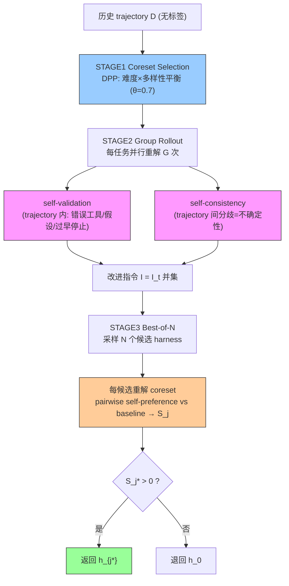

# RHO: Evolving Agents in the Dark — Retrospective Harness Optimization via Self-Preference

**作者**: Wenbo Pan, Shujie Liu, Chin-Yew Lin, Jingying Zeng, Xianfeng Tang, Xiangyang Zhou, Yan Lu, Xiaohua Jia（香港城市大学 / 微软亚洲研究院）
**会议/年份**: arXiv 2026（2606.05922）
**链接**: [arXiv](https://arxiv.org/abs/2606.05922) · [Code](https://github.com/wbopan/retro-harness) · [Site](https://paper-rho.wenbo.io)

## 一句话总结

**只用无标签历史 trajectory 优化完整 harness**：现有 harness 优化全需 labeled validation set，但部署难获取。RHO 用 agent 自己的 **self-preference** 代替 latent utility——DPP 选 difficulty×diversity 平衡的 coreset → 每任务并行重解 G 次提 **self-validation + self-consistency** 诊断 → best-of-N 采样候选、pairwise self-preference 选最优。单轮 SWE-Bench Pro 59%→78%（无外部打分），用 ~1/3 compute 达 Meta-Harness 10 轮天花板。

> 📌 **对 [Self-Harness](../%5BArxiv%202026%5D%20Self-Harness/) Validation + Weakness Mining 最直接的改进来源**：去掉 labeled held-out 依赖（self-preference 替代回归门），并新增 self-consistency 无标签诊断信号。

## 核心贡献

1. **Retrospective Harness Optimization**：仅从无标签 trajectory 改进**完整 harness**（memory/context/skills/tools），填补"无标签 + 全 harness + 单次 pass"的空白（Table 5 三轴独占）。
2. **self-preference 代替 latent utility**：self-validation（trajectory 内对错）+ self-consistency（trajectory 间分歧=不确定性）+ pairwise self-preference 选择。
3. **实证**：三域一致提升（SWE +19 / TB2 +5 / GAIA +8），超 feedback-free 基线，可比预算下超 validation-feedback 演化。

## 📖 批读导航

| Section | 内容 |
|---------|------|
| [00 - Abstract, Intro & Problem](sections/00-abstract-intro.md) | 无标签动机、latent utility、self-preference、Table 5 三轴定位 |
| [01 - Method & Experiments](sections/01-method-experiments.md) | DPP coreset、self-validation/consistency、best-of-N、vs Meta-Harness、消融 |

## 关键数字

| 指标 | 数值 |
|------|------|
| base agent | Codex + GPT-5.5 high |
| 超参 | coreset k=10, group G=3, candidates N=3 |
| SWE-Bench Pro | 0.59→0.78（+19pp，无标签，单轮） |
| Terminal-Bench 2 | 0.71→0.76（+5pp） |
| GAIA-2 | 0.29→0.37（+8pp） |
| vs Meta-Harness | RHO 0.78 @103 calls 无标签 = MH 10轮 0.80 @320 calls 需标签 |
| 诊断消融 | 去 self-consistency 0.78→0.56；去 self-validation →0.70；raw →0.60 |

## 数据流：RHO 单轮

## 优缺点与还能做什么

### 优点
- **无标签**：完全去 ground-truth 依赖，部署友好（labeled validation 稀缺场景）。
- **全 harness**：编辑 tools+skills+instructions，不只 memory（超 experience-based 基线）。
- **省 compute**：单轮达 Meta-Harness 10 轮天花板的 ~1/3 compute。
- **新诊断信号**：self-consistency（跨重解分歧）是无标签的不确定性代理。

### 局限 / 风险
- **self-preference 不可靠**：Table 3 只避最差、不总选最优；AHE/Phantom 证明 self-judgment 系统性不可信。
- **需环境干净重置 + 容忍重复**：group rollout 重放，one-shot/不可逆任务不适用。
- **信任历史 trajectory**：对抗内容注入会固化坏行为。
- **单轮**：非持续在线演化（虽单轮已够强）。

### 还能做什么（对用户改进 Self-Harness）
- **Validation 去标签**：self-preference（best-of-N，S_j>0）替代 Self-Harness 的 held-out 回归门 → label-free。
- **Weakness Mining 加 self-consistency**：跨重解分歧发现"表面通过但不稳定"的弱点（Self-Harness 没有）。
- **coreset DPP 选择**：难度×多样性平衡，避免 proposer 过拟合某类失败。
- **⚠️ 但必须配可靠性补丁**：RHO 的 self-preference 软肋需 [Phantom-Guardrails](../%5BArxiv%202026%5D%20Phantom-Guardrails/) 反事实去幻觉 + [AHE](../%5BArxiv%202026%5D%20Agentic-Harness-Engineering/) regression 预测叠加。

## 阅读 Q&A 记录

- **Q: RHO 和 Self-Harness 核心区别？**
  A: 都从历史 trajectory 改完整 harness，但 RHO 无标签（self-preference + self-consistency）单轮；Self-Harness 用 labeled held-out 回归门、多轮。RHO 补 Self-Harness"需标签"软肋。

- **Q: self-preference 可靠吗？**
  A: 有偏但有用（Table 3 避最差不选最优）。AHE/Phantom 证明 self-judgment 不可信，但 RHO 证明它足够好到无标签逼近 Meta-Harness 10 轮天花板。

- **Q: self-consistency 为什么重要？**
  A: 同任务重解 G 次看分歧=不确定性，即使表面通过也暴露 harness 弱点。Self-Harness 没有此信号；消融去掉它 SWE 从 0.78 暴跌 0.56。

- **Q: 为什么用 DPP？**
  A: 需 difficulty×diversity 平衡；纯难度聚成一簇无增益、纯多样次优、随机偶尔有用，DPP 平衡最优。

- **Q: 对"明显更强的 Self-Harness"的贡献？**
  A: 去标签 + 加 self-consistency + DPP coreset，让 Self-Harness 满足 label-free 三轴；但需叠加 Phantom/AHE 补 self-preference 可靠性。

## 📊 Citation Landscape

**直接相关（本 topic）**
- [Meta-Harness](../%5BArxiv%202026%5D%20Meta-Harness/)——RHO 的主要 validation-feedback 对照（Table 2）；[Self-Harness](../%5BArxiv%202026%5D%20Self-Harness/)——RHO 补其标签依赖软肋。
- [GEPA](../%5BArxiv%202025%5D%20GEPA/)（Table 5 validation-feedback 类）；[AHE](../%5BArxiv%202026%5D%20Agentic-Harness-Engineering/)/[Phantom-Guardrails](../%5BArxiv%202026%5D%20Phantom-Guardrails/)——self-judgment 可靠性的互补视角。

**方法来源 / 对照**
- DPP（Kulesza & Taskar）；group relative advantage（DeepSeekMath GRPO 启发）；self-consistency（Wang et al.）；semantic entropy/uncertainty（Farquhar et al.）。
- Experience-based 基线：Dynamic Cheatsheet、ReasoningBank、Sleep-time Compute、MemMA、M⋆、SkillOS。
- Benchmark：SWE-Bench Pro、Terminal-Bench 2、GAIA-2；base：Codex + GPT-5.5。
