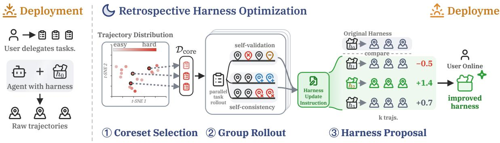

[← 返回 README](../README.md)

# Method & Experiments 方法与实验

## 📌 预览

RHO 三阶段（Algorithm 1，一个 backbone 实例化所有算子）：(4.1) **Coreset Selection** — 用 DPP（行列式点过程）从历史 trajectory 选 difficulty × diversity 平衡的小 coreset；(4.2) **Group Rollout** — 每任务并行重解 G 次，提 self-validation（trajectory 内对错）+ self-consistency（trajectory 间分歧）两诊断信号；(4.3) **Best-of-N Proposal** — 采样 N 个候选 harness，用 pairwise self-preference 打分选最优（$S_j>0$ 才接受）。实验：SWE-Bench Pro 59→78、TB2 71→76、GAIA-2 29→37，全无外部打分；vs Meta-Harness 用 ~1/3 compute 达其 10 轮天花板且无需标签。

---

## 4. Method — RHO 三阶段



*Figure 2: RHO 管线。Coreset Selection 用 DPP 选 difficulty-diverse 小子集；Group Rollout 每任务重解 G 次、诊断 trajectory 内失败（self-validation）和 trajectory 间分歧（self-consistency）；Harness Proposal 采样 N 个候选、保留 rollout 最被偏好的。无 ground-truth 标签。*

### 4.1 Coreset Selection（DPP：难度 × 多样性）

在全部历史 trajectory 上优化太贵、且会用琐碎信号稀释重要信号。用 **DPP（Determinantal Point Process）** 选 coreset $\mathcal{D}_{core}$，要求**同时 challenging 和 diverse**。LM judge 给每条 trajectory 打难度分 $r_i$ + 文本描述（挑战/失败模式）；描述 embedding 的 cosine 相似度作相似矩阵 $S$。核矩阵：

$$K = \text{diag}(\tilde{r})\, S\, \text{diag}(\tilde{r})$$

$\theta=0.7$ 平衡难度（$\theta=1$ 纯难度）和多样性（$\theta=0$ 纯多样）。

> 💡 **coreset 消融的关键教训（Fig 5）**（Hao 批注）：Fig 5 的消融很重要——**纯难度选择会聚成一小簇**（LM judge 把某类任务判为最难、忽略其他类型），**无有意义增益**；纯多样性也次优；随机偶尔有用。**只有 DPP 平衡难度+多样性才达最高增益**。对用户改 Weakness Mining 的启示：Self-Harness 现在按失败签名 $\phi=(c,q,m)$ 确定性聚类，**没有显式的 difficulty × diversity 平衡**——若失败集中在某类任务，Self-Harness 的 proposer 可能过拟合该类。引入 DPP 式的 coreset 选择（覆盖多样失败模式），可能改善 Self-Harness 增益的泛化。

### 4.2 Group Rollout（两个诊断信号）

每个 coreset 任务并行跑 $G$ 次 agent solve，用组内对比信号形成优化指令。两个维度：

- **Self-validation（rank_val）**：检查每条 trajectory 内的正确性——对照任务和环境观测判断目标是否高效达成，**标记错误工具调用、错误假设、过早停止**。利用模型"部分识别自己知识边界"的能力。
- **Self-consistency（rank_con）**：检查 trajectory 间行为是否一致——低自一致性通常表示高不确定性。**识别有后果的分歧**（分歧的计划、工具序列、最终答案），生成鼓励更一致行为的指令。

两者并集形成任务改进指令 $I_t = \text{rank}_{val} \cup \text{rank}_{con}$，跨 coreset 合并成最终 harness 改进指令。

> 💡 **两个诊断信号 = Self-Harness 没有的新武器（Hao 批注）**：这是 RHO 相对 [Self-Harness](../%5BArxiv%202026%5D%20Self-Harness/) Weakness Mining 的**关键新增**：
> - **Self-validation** ≈ Self-Harness 的失败诊断（标记错误工具调用/假设/过早停止），但 RHO 在**多次重解**上做，不只看历史失败。
> - **Self-consistency（全新）**：Self-Harness **完全没有**这个信号。RHO 用**跨并行 trajectory 的分歧**作不确定性代理——同一任务重解多次，若计划/工具序列/答案分歧大，说明 harness 在该任务上不稳定/不确定。这是一个**无标签的、比"失败/成功"更细的信号**：即使任务表面通过，高分歧也暴露 harness 弱点。
> - **诊断消融（Table 4）**：去掉 self-consistency（SWE 0.78→0.56，暴跌）或 self-validation（0.78→0.70）都降；full > raw-trajectory baseline（0.60）——**两个信号都 essential，且显式诊断 > 直接给原始 trajectory**。
> - **对用户的直接价值**：给 Self-Harness 的 Weakness Mining **加 self-consistency 信号**（重解多次看分歧），可在无标签下发现 held-out verifier 发现不了的"不稳定"弱点。这与 [AHE](../%5BArxiv%202026%5D%20Agentic-Harness-Engineering/) 的 $k\geq2$ rollout（每任务带 pass-rate 信号）异曲同工，但 RHO 用的是分歧而非 pass-rate。

### 4.3 Best-of-N Harness Proposal（self-preference 选择）

harness 优化本质随机、即使有效输入信号也未必可靠改进（[Meta-Harness](../%5BArxiv%202026%5D%20Meta-Harness/)/ADAS/GEPA 都观察到）。RHO 并行采样 $N$ 个候选 harness $h_1,\ldots,h_N$，用 self-preference 过滤。对每个候选在 $k$ 个 coreset 任务上重解，把新 trajectory 与原 harness 旧 trajectory 做 **pairwise self-preference 排序**，聚合成相对优势分：

$$S_j = \frac{1}{|\mathcal{D}_{core}|} \sum_{t \in \mathcal{D}_{core}} \text{rank}(t, \tau_t^{(j)}, \tau_t^{(0)})$$

返回最大优势的候选，**仅当 $S_j > 0$ 才接受**（否则退回 $h_0$）。

**Algorithm 1**（一个 backbone 实例化 judge/solve/optimize/rank 所有算子，无 ground-truth）：
```
STAGE 1 Coreset: r_i ← judge(t_i,τ_i); D_core ← DPP-greedy({(t_i,r_i)}; θ,k)
STAGE 2 Group Rollout: 每 t 并行 solve G 次; I_t ← rank_val ∪ rank_con; I ← ∪ I_t
STAGE 3 Best-of-N: 并行 optimize N 次得 h_j; 重解算 S_j (self-preference vs baseline);
        j* ← argmax S_j; return h_{j*} if S_{j*}>0 else h_0
```

> 💡 **best-of-N + self-preference = 无标签的 Proposal Validation（Hao 批注）**：这是 RHO 对 [Self-Harness](../%5BArxiv%202026%5D%20Self-Harness/) **Proposal Validation 的直接替代**：
> - **Self-Harness**：候选在 labeled held-out 上评估，非退化接受规则（Δ_in≥0 ∧ Δ_ho≥0）。**需标签**。
> - **RHO**：候选重解 coreset，pairwise self-preference 排序 vs baseline，$S_j>0$ 接受。**无标签**。
> - **可靠性（Table 3）**：N=3 候选方差中等，**最低分候选也超 baseline**，选择"避开最差但不总选最优"。即 self-preference 是"安全但非最优"的选择器。
> - **对用户**：把 Self-Harness 的 held-out 回归门换成/补充 RHO 的 self-preference，就能在无干净 verifier 时也工作。但要注意 self-preference 的"非最优"局限——理想是**self-preference 初筛 + 少量标签精验**的混合，或叠加 [AHE](../%5BArxiv%202026%5D%20Agentic-Harness-Engineering/) 的 regression 预测。

## 5-6. Experiments & Analysis

**Setup**：base = Codex agent（GPT-5.5 high reasoning）。harness = 可配置 workspace 文件夹（脚本作 tool + 文本作 skill/instruction）。coreset $k=10$，$G=N=3$。SWE-Bench Pro / Terminal-Bench 2 / GAIA-2 三域。

**主结果（Table 1，held-out pass）**：

| 方法 | 编辑面 | SWE-Bench Pro | TB2 | GAIA-2 |
|------|--------|---------------|-----|--------|
| Vanilla Codex | None | 0.59 | 0.71 | 0.29 |
| Dynamic Cheatsheet | Skills | 0.62 (+3) | 0.73 | 0.30 |
| ReasoningBank | Memory | 0.61 (+2) | 0.73 | 0.28 |
| Sleep-time Compute | Memory | 0.64 (+5) | 0.73 | 0.32 |
| **RHO** | **Skills+Tools** | **0.78 (+19)** | **0.76 (+5)** | **0.37 (+8)** |

RHO 一致超所有 feedback-free 基线。**+19pp on SWE-Bench Pro 无任何 validation 打分**——归因于更灵活的 harness 优化（能创建新 tool/skill/instruction，而非仅 memory）+ self-preference 的一致性。

**vs Meta-Harness（Table 2，validation-feedback 对照）**：

| 方法 | 需标签 | Agent calls | SWE-Bench Pro |
|------|--------|-------------|---------------|
| **RHO** | **无** | 103 (1.0×) | **0.78** |
| Meta-Harness (1 轮) | 需 | 41 (0.4×) | 0.62 |
| Meta-Harness (10 轮) | 需 | 320 (3.1×) | 0.80 |

> 💡 **Table 2 批读（RHO vs Meta-Harness 的关键对照）**（Hao 批注）：这是全文最有说服力的对照——**RHO 用 ~1/3 的 compute、且完全无标签，达到 Meta-Harness 10 轮（需标签、3.1× compute）的天花板（0.78 vs 0.80）**。单轮 Meta-Harness（匹配 compute）只有 0.62，远低于 RHO 0.78。含义：
> - **无标签不是性能妥协**——RHO 证明 self-preference 能在无标签下逼近 validation-feedback 的上限。
> - **对用户**：Self-Harness 用标签换来的增益，RHO 说明**大部分可以用 self-preference 无标签拿到**。这让"把 Self-Harness 改成 label-free"从"可能损失性能"变成"可能不损失甚至更省 compute"——一个更有吸引力的贡献。

**行为分析（Fig 4）**：RHO 增益主要来自**长 horizon 任务**成功率提升；改变 action mix——SWE 上更频繁**验证**（proactive verification），TB2/GAIA 上更多**执行**（用新开发的 tool）。

**消融**：coreset（Fig 5）DPP 平衡难度+多样性最优，单一维度不如随机；诊断（Table 4）self-validation + self-consistency 都 essential，显式诊断 > 原始 trajectory；best-of-N（Table 3）避开最差但不总选最优。

**局限**：(1) group rollout 重放假设环境**干净重置、容忍重复尝试**——one-shot/不可逆任务不适用；(2) 假设能力由可编辑 harness 中介；(3) 信任历史 trajectory——开放环境的对抗内容注入风险（受损 trajectory 会固化坏行为）。

> 💡 **总结 + 对用户"明显更强的 Self-Harness"的定位（Hao 批注）**：RHO 是用户改进 Self-Harness **Validation + Weakness Mining 两个阶段**的直接武器：
> - **Validation 去标签**：self-preference（best-of-N，$S_j>0$）替代 held-out verifier 回归门 → Self-Harness 变 label-free（满足 RHO 三轴）。
> - **Weakness Mining 加信号**：self-consistency（跨重解分歧=不确定性）是 Self-Harness 没有的无标签信号，能发现"表面通过但不稳定"的弱点。
> - **coreset 选择**：DPP 难度×多样性平衡，避免 proposer 过拟合某类失败。
> - **但 RHO 自身的软肋 = self-preference 不可靠**（Table 3 只避最差不选最优；[AHE](../%5BArxiv%202026%5D%20Agentic-Harness-Engineering/)/[Phantom-Guardrails](../%5BArxiv%202026%5D%20Phantom-Guardrails/) 证明 self-judgment 不可信）。**所以最强方案 = RHO 无标签信号 + Phantom 反事实去幻觉 + AHE regression 预测 + GEPA population 搜索**——四者叠加，既去标签依赖、又保可靠性、又广探索。这就是"明显更强的一篇"的骨架。

> 💡 **Q&A 批注记录**（Hao 批注）：
> - **Q：RHO 和 Self-Harness 核心区别？**
>   A：都从历史 trajectory 改完整 harness，但 RHO **无标签**（self-preference + self-consistency）、单轮 retrospective；Self-Harness 用 **labeled held-out** 回归门、多轮。RHO 直接补 Self-Harness 的"需标签"软肋。
> - **Q：self-preference 可靠吗？**
>   A：有偏但有用——Table 3 显示"避开最差但不总选最优"。AHE/Phantom 证明 self-judgment 不可信，但 RHO 证明它足够好到无标签逼近 Meta-Harness 10 轮天花板。
> - **Q：self-consistency 信号是什么？为什么重要？**
>   A：同任务重解 G 次，看计划/工具序列/答案的分歧——低一致性=高不确定性。Self-Harness 没有这个信号。消融显示去掉它 SWE 从 0.78 暴跌到 0.56。
> - **Q：为什么用 DPP 选 coreset？**
>   A：需 difficulty × diversity 平衡。纯难度会聚成一簇（LM judge 偏好某类难题）无增益；纯多样也次优；DPP 平衡两者最优。
