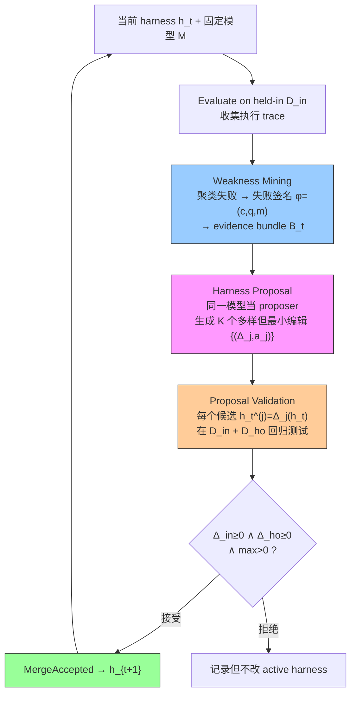

# Self-Harness: Harnesses That Improve Themselves

**作者**: Hangfan Zhang, Shao Zhang, Kangcong Li, Chen Zhang, Yang Chen, Yiqun Zhang, Lei Bai, Shuyue Hu（Shanghai AI Laboratory）
**会议/年份**: arXiv 2026（2606.09498）
**链接**: [arXiv](https://arxiv.org/abs/2606.09498)

## 一句话总结

**让 LLM agent 改进它自己运行所依赖的 harness**（system prompt / 工具 / 运行时策略 / 验证规则 / 编排逻辑），无需人类工程师、也无需更强的外部 agent。三阶段自改进循环：**Weakness Mining**（聚类执行 trace 挖模型特定失败）→ **Harness Proposal**（生成多样但最小、绑定失败机制的 harness 编辑）→ **Proposal Validation**（held-out 回归门通过才接受）。3 模型 × 3 benchmark 全部 held-in/held-out 双升，相对增益最高 **+132%**。

> 📌 **本 topic 锚论文**：Harness 新分类围绕它组织；用户的研究目标是把它的三个阶段（Weakness Mining / Proposal Search / Validation）改成"明显更强的一篇"。前置理解看 [Meta-Harness](../%5BArxiv%202026%5D%20Meta-Harness/)，改进灵感看 [GEPA](../%5BArxiv%202025%5D%20GEPA/) + [Phantom-Guardrails](../%5BArxiv%202026%5D%20Phantom-Guardrails/)。

## 核心贡献

1. **Self-Harness 新范式**：agent 设计并精炼自己运行的 harness，无人类工程、无更强外部 agent。相对 Meta-Harness（external meta-agent 优化 target harness）往前推一步（target 自己优化自己）。
2. **操作化为 propose–evaluate–accept 迭代循环**：Weakness Mining → Harness Proposal → Proposal Validation，模型和评估器全程固定，只改 harness（干净的因果隔离）。
3. **实验证明**：9/9 模型-benchmark 组合改进，最高 +40.6pp / +132%；定性证实不同模型受益于**不同** harness 改变（harness 本质 model-specific）。

## 📖 批读导航

| Section | 内容 |
|---------|------|
| [00 - Abstract & Introduction](sections/00-abstract-intro.md) | 摘要+引言、三种 harness 改进范式（Fig 1）、harness 定义、模型特定编辑 |
| [01 - Method](sections/01-method.md) | 形式化、Weakness Mining（失败签名 φ）、Harness Proposal（K 候选）、Validation（回归门）、Algorithm 1 |
| [02 - Experiments & Conclusion](sections/02-experiments-conclusion.md) | Table 1（9 组合）、模型特定编辑、局限、**三条改进主线表** |

## 关键数字

| 指标 | 数值 |
|------|------|
| 模型 | MiniMax M2.5 / Qwen3.5-35B-A3B / GLM-5 |
| Benchmark | Terminal-Bench-2.0（64）/ SWE-bench Verified（100）/ AppWorld（180） |
| 初始 harness | 最小 DeepAgent SDK（短 system prompt + 默认 fs/shell 工具） |
| 结果 | 9/9 组合 held-in & held-out 双升 |
| 最大绝对增益 | +40.6pp（GLM-5 AppWorld 44.4%→85.0%） |
| 最大相对增益 | +132%（Qwen3.5 AppWorld 22.5%→52.2%） |
| 接受规则 | Δ_in≥0 ∧ Δ_ho≥0 ∧ max>0（保守非退化） |

## 数据流：一个 Self-Harness 循环

## 优缺点与还能做什么

### 优点
- **去外部依赖**：不需人类工程师、不需更强外部 agent，对前沿模型也适用。
- **干净因果隔离**：模型/评估器/环境全固定，增益纯来自 harness，说服力强。
- **增益可迁移**：held-out 也涨（4 组合 held-out 涨幅超 held-in）——机制而非 case 过拟合。
- **可审计、可回滚**：每次编辑记录证据/面/split 结果/决定，harness 谱系可审计。

### 局限 / 风险（= 用户的改进机会）
- **Weakness Mining 隐含"LLM 诊断 grounded"假设** → 可能修幻觉失败（Phantom-Guardrails）。
- **Proposal 是 greedy 单谱系**（K 提案挑通过 merge） → 探索窄、无 lineage 多样性（GEPA）。
- **Validation 依赖 labeled held-out + 仅 pass-rate 门** → 无干净 verifier 时失效、门槛弱（RHO / AHE ledger）。
- **只研究固定 benchmark 下 bounded 编辑**，非 open-ended；编辑可能仍 benchmark-specific。

### 还能做什么（用户的核心研究目标）
把三个阶段同时升级，可能就是"明显更强的下一篇 Self-Harness"：

| 阶段 | 升级 | 来源 |
|------|------|------|
| Weakness Mining | Failure Hypothesis → **Counterfactual Verification** → Validated Mechanism；加 **Do Nothing** 候选 | [Phantom-Guardrails](../%5BArxiv%202026%5D%20Phantom-Guardrails/) |
| Harness Proposal | reflection + semantic mutation + **population/archive + Pareto**；多 harness lineage + crossover | [GEPA](../%5BArxiv%202025%5D%20GEPA/) |
| Proposal Validation | 无标签**自偏好**（self-validation+cross-trajectory consistency+pairwise）；结构化 **evidence ledger** | [RHO](../%5BArxiv%202026%5D%20RHO-Self-Preference/) / [AHE](../%5BArxiv%202026%5D%20Agentic-Harness-Engineering/) |

## 阅读 Q&A 记录

- **Q: Self-Harness vs Meta-Harness 一句话区别？**
  A: Meta-Harness 用更强外部 agent 优化弱 target 的 harness；Self-Harness 让 target 模型自己优化自己的 harness。后者去掉外部依赖。

- **Q: 为什么增益能迁移到 held-out？**
  A: Weakness Mining 聚类的是可复用失败机制（φ=(c,q,m) 分离症状与机制），proposal 针对机制而非 case；held-out 从不喂 proposer 却也涨。

- **Q: 最大的隐藏假设 / 最脆弱处？**
  A: "LLM 对失败的诊断 factually grounded"。Phantom-Guardrails 证明未必——可能修一个不存在的失败。

- **Q: 为什么 proposal 是 greedy？**
  A: 单一 harness 谱系 h_0→h_1→...，每轮 K 提案挑通过 merge，无 population/Pareto/crossover。GEPA 补这个。

- **Q: 谁受益最大？**
  A: 弱模型（Qwen3.5-35B-A3B，+104%~+132%）——弱模型有更多 harness 层可修复的失败；强/高基线模型增益小（GLM-5 SWE-bench +7%）。

## 📊 Citation Landscape

**直接前作 / 最相关**
- [Meta-Harness](../%5BArxiv%202026%5D%20Meta-Harness/)（Lee et al. 2026）——最直接前作，external meta-agent 优化 harness。
- [Agentic Harness Engineering](../%5BArxiv%202026%5D%20Agentic-Harness-Engineering/)（Lin et al. 2026）——并行的 observability-driven harness evolution + evidence ledger。
- [RHO / Evolving in the Dark](../%5BArxiv%202026%5D%20RHO-Self-Preference/)（Pan et al. 2026）——无标签自偏好优化 harness。
- [GEPA](../%5BArxiv%202025%5D%20GEPA/)（Agrawal et al. 2025）——reflective prompt evolution，candidate search/selection 升级方向。
- [Phantom Guardrails](../%5BArxiv%202026%5D%20Phantom-Guardrails/)（Wang et al. 2026）——对 self-improving harness 的反问题（幻觉失败）。

**方法谱系**
- 自改进 agent：Reflexion（verbal feedback）、STOP（递归自改进代码）、Agentic Context Engineering（演化 context）。
- 自动 agent 设计：ADAS（搜 agent 设计）、Language Agents as optimizable graphs。
- 自演化系统：AI Scientist、AlphaEvolve、Alita、Gödel Agent、Darwin Gödel Machine。
- Harness / 框架：ReAct、SWE-agent、Claude Code、OpenHands、SemaClaw/OpenClaw、DeepAgent SDK。
- Benchmark：Terminal-Bench-2.0、SWE-bench Verified、AppWorld。
