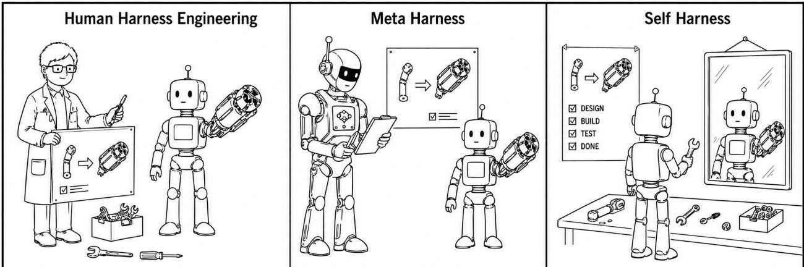

[← 返回 README](../README.md)

# Abstract & Introduction 摘要与引言

## 📌 预览

**Self-Harness = 让 agent 改进它自己运行所依赖的 harness**（system prompt / 工具 / 运行时策略 / 验证规则 / 编排逻辑），无需人类工程师、也无需更强的外部 agent。三阶段循环：**Weakness Mining**（从执行 trace 聚类挖模型特定失败模式）→ **Harness Proposal**（生成多样但最小的 harness 修改，每个绑定一个失败机制）→ **Proposal Validation**（回归测试通过才接受）。3 模型 × 3 benchmark 全部 held-in/held-out 双升，相对增益最高 +132%。

---

## Abstract

The performance of LLM-based agents is jointly shaped by their base models and the **harnesses** that mediate their interaction with the environment. Because different models exhibit distinct behaviors, effective harness design is inherently model-specific. Yet agent harnesses are still largely engineered by human experts, a paradigm that scales poorly as modern LLMs become increasingly diverse and rapidly evolving. In this paper, we introduce **Self-Harness**, a new paradigm in which an LLM-based agent improves its own operating harness, **without relying on human engineers or stronger external agents**. We operationalize Self-Harness as an iterative loop with three stages: **Weakness Mining**, which identifies model-specific failure patterns from execution traces; **Harness Proposal**, which generates diverse yet minimal harness modifications tied to these failures; and **Proposal Validation**, which accepts candidate edits only after regression testing. We instantiate Self-Harness across Terminal-Bench-2.0, SWE-bench Verified, and AppWorld using a minimal initial harness and three base models from diverse families: MiniMax M2.5, Qwen3.5-35B-A3B, and GLM-5. Across all nine model–benchmark combinations, every final harness improves both held-in and held-out pass rates, with overall relative gains of **up to 132%**.

> 💡 **本 topic 的锚论文（务必内化定位）**（Hao 批注）：这是 **Harness 新分类的主论文**，用户后续所有工作都围绕它展开。一句话抓住它：**把"改 harness"这件事从人类工程师手里，交给 agent 自己做**——而且是让**同一个固定模型**、在**当前 harness 下**，提出改进**自己未来行为**的 harness 编辑。三个阶段构成用户后续要改进的三个抓手：
> - **Weakness Mining（失败挖掘）** → 后续可被 [Phantom-Guardrails](../%5BArxiv%202026%5D%20Phantom-Guardrails/) 的"幻觉失败"问题攻击、升级为反事实验证。
> - **Harness Proposal（提案搜索）** → 后续可被 [GEPA](../%5BArxiv%202025%5D%20GEPA/) 的 Pareto/population 搜索升级（当前是 greedy 的 K-proposal→pick）。
> - **Proposal Validation（提案验证）** → 与 [Agentic-Harness-Engineering](../%5BArxiv%202026%5D%20Agentic-Harness-Engineering/) 的 evidence ledger、[RHO](../%5BArxiv%202026%5D%20RHO-Self-Preference/) 的无标签自偏好信号密切相关。

> 💡 **术语澄清：harness 到底是什么**（Hao 批注）：harness = 模型与环境之间的**非参数脚手架**（non-parametric scaffolding）：system prompt、工具集、内存/状态管理、验证规则、权限策略、运行时控制、失败恢复流程、编排逻辑。**它不改模型权重**，只改"模型如何观察任务、采取动作、调工具、检查中间产物、产出最终答案"的执行协议。关键洞察：**很多重要的 agent 失败是这一层的失败，而非模型单次响应的失败**——agent 可能不检查产物就报成功、反复无效重试、在长上下文里丢失 source of truth、缺少恢复动作。所以改这一层能带来独立于模型能力的增益。

## 1. Introduction — 三种 harness 改进范式

*Figure 1: 三种 harness 改进范式。(1) 人类工程：人类手动改 harness；(2) Meta-Harness：更强的外部 agent 指导弱 target agent 的改进；(3) Self-Harness：agent 改进自己的运行 harness。*

> 💡 **Figure 1 批读（三范式 = 本 topic 的坐标系）**（Hao 批注）：这张图定义了整个 Harness topic 的坐标系，务必记牢：
> - **人类工程（human harness engineering）**：ReAct → Claude Code / Codex / OpenHands，全靠人类专家手调。问题：模型爆发式增长（不同模型行为/工具习惯/错误模式/prompt 敏感性各异），一个 harness 对 A 模型好、对 B 模型未必好，人工逐模型重调不可持续。
> - **Meta-Harness（外部优化器）**：一个**更强的外部 agent** 优化**较弱的 target agent** 的 harness（[Meta-Harness](../%5BArxiv%202026%5D%20Meta-Harness/) 就是这条线的直接前作）。问题：外部指导可能昂贵、对前沿模型不可得、或与 target 模型的失败模式不匹配。
> - **Self-Harness（本文）**：把改进循环**内化到 target agent 自身**——固定模型在当前 harness 下，提出改进自己未来行为的 bounded 编辑。
>
> **用户的研究定位**：Self-Harness 的 Introduction "基本就是沿着 Meta-Harness 往前推一步"（external meta-agent → agent 自己）。所以要真正理解 Self-Harness 的 novelty 在哪、天花板在哪，必须先读透 Meta-Harness（见该篇批注的对比表）。

**核心问题**：人类中心范式不随模型多样性/快速演化 scale。不同模型有不同行为模式、工具使用习惯、错误模式、prompt 敏感性；一个 harness 对某模型好对另一个可能次优。手工逐模型重设计越来越昂贵、不可持续。

**Self-Harness 的解法**：让 agent 改进它据以运行的那个 harness。相比用更强外部 agent 改弱 agent 的 harness，Self-Harness 把改进循环内化到 target agent 自身，减少对外部指导的依赖（外部指导可能昂贵、对前沿模型不可得、或与 target 模型失败模式不匹配）。作者借 Bergson 的话把它类比为"self-creation"：系统不只被外部改变，而是持续"going on creating itself"。

**三阶段循环**（Figure 2 详解见 method）：
1. **Weakness Mining**：固定模型在初始 harness 上跑一组任务，产出可验证结果的执行 trace；聚类失败 trace，让 agent 推理**模型特定的失败模式**而非孤立错误。
2. **Harness Proposal**：基于失败模式，生成一小组**多样但最小**的 harness 修改，每个绑定一个具体失败机制（约束确保编辑 targeted 而非过度泛化）。
3. **Proposal Validation**：候选修改经回归测试评估，只有在 held-out 任务上不引起可测退化、且能改进性能时才被提升（promote）。多个通过的候选合并进下一版 harness。

> 💡 **定性发现（不是简单把 prompt 变长）**（Hao 批注）：作者强调 Self-Harness **不是加通用指令或把 prompt 变长**，而是引入反映每个模型执行中反复出现问题的 targeted 改变——把模型特定弱点转成具体的 harness 级干预：
> - **MiniMax M2.5**：更早创建必需的输出文件、更小心处理结构化工具输出、在无效工具循环变太长前停止。
> - **Qwen3.5-35B-A3B**：提前检查依赖、避免重复失败命令、打破无尽探索循环、工具报错后提醒产出必需产物。
> - **GLM-5**：跨 shell 命令保持环境设置、更快从探索转向实现和测试。
> - 甚至能引入**更大结构机制**：subagent 分解、middleware 创建——超越局部失败修复，改善整体问题求解组织。
> 这是"模型特定 harness"的直接证据：**不同模型受益于不同 harness 改变**——支撑了"harness 设计本质上 model-specific"的立论。

**贡献**：(1) 提出 Self-Harness 新范式；(2) 操作化为 propose–evaluate–accept 迭代循环；(3) 9 个模型-benchmark 组合全部改进，最高 +40.6pp / +132%，定性证实不同模型受益于不同 harness 改变。
