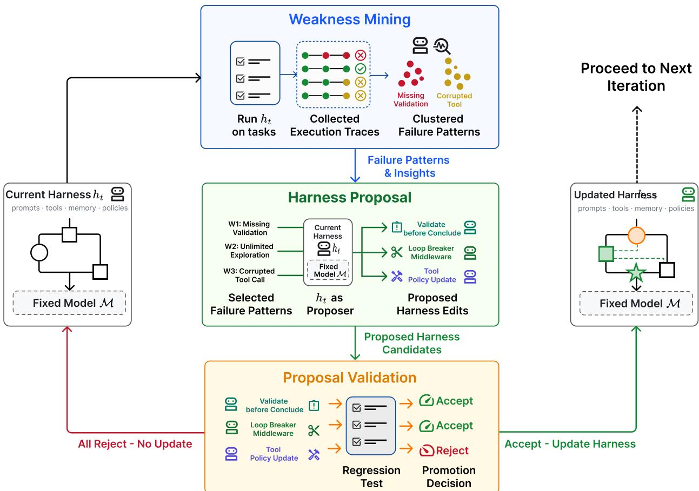

[← 返回 README](../README.md)

# Method 方法：模型特定 harness 改进的迭代循环

## 📌 预览

Self-Harness 形式化：固定模型 $M$、固定评估器 $\mathcal{E}$，只把 harness 当优化对象，产生一条 harness 谱系 $h_0, h_1, \ldots$，每次转移是对执行协议的 bounded 编辑。**三阶段**：(3.2) Weakness Mining — 跑 held-in、聚类失败 trace 成 verifier-grounded 失败签名 $\phi(r_i)=(c_i,q_i,m_i)$、输出 evidence bundle $B_t$；(3.3) Harness Proposal — 同一模型当 proposer 生成 $K$ 个多样但最小的候选编辑 $\{(\Delta_j,a_j)\}$；(3.4) Proposal Validation — held-in/held-out 双 split 回归测试，非退化接受规则。

---

## 3.1 Preliminary — 形式化

固定语言模型 $M$、agent harness $h$。给定任务实例 $x$，在 harness $h$ 下运行 $M$ 产生执行 trace $\tau$ 和输出 $y$。评估器 $\mathcal{E}$ 把 (任务, trace, 输出) 映射到行为结果（如 pass/fail）。**$M$ 和 $\mathcal{E}$ 固定，harness 是被改进的对象**。Self-Harness 因此在一条 harness 谱系 $h_0, h_1, \ldots$ 上操作，每次转移对应对执行协议的 bounded 编辑，而非对模型权重的更新。

> 💡 **形式化的关键设计（为什么这样设定）**（Hao 批注）：把 $M$ 和 $\mathcal{E}$ 都固定、只改 $h$，是一个刻意的**因果隔离**设计——这样所有性能变化都能归因到 harness 改变，而非模型能力或评估协议的变化。这是全文实验干净的根基（所有对比都是 within-model 对比）。**对用户改进 Self-Harness 的启示**：这个"harness 谱系 + bounded edit"的抽象很干净，但它也是 greedy 的（单一谱系，见 3.3 批注）——[GEPA](../%5BArxiv%202025%5D%20GEPA/) 的 population/archive 正是针对这个单一谱系的升级方向。

## 3.2 Weakness Mining — 从聚类执行 trace 识别失败模式



*Figure 2: 一个 Self-Harness 优化循环概览。当前 harness $h_t$ + 固定模型在任务上评估、收集执行 trace，聚类成 verifier-grounded 失败模式。同一模型在当前 harness 下作为 proposer，用挖出的失败模式生成 bounded 候选 harness 编辑。候选经 held-in/held-out 回归测试；接受的合并成 $h_{t+1}$，拒绝的记录但不改动 active harness。整个循环中模型权重和评估器都固定，只改 harness。*

在第 $t$ 轮，固定模型 $M$ 在当前 harness $h_t$ 下跑 held-in split $D_{in}$。每个任务实例 $x_i$ 产生输出 $y_i$、trace $\tau_i$；评估器给出结果 $z_i = \mathcal{E}(x_i, \tau_i, y_i)$（pass/fail），得到 trace 记录 $r_i = (x_i, \tau_i, y_i, z_i)$。聚焦失败子集 $F_t = \{r_i \in R_t \mid z_i = \text{fail}\}$，按 **verifier-grounded 失败签名**聚类：

$$\phi(r_i) = (c_i, q_i, m_i)$$

其中 $c_i$ = 终端 verifier 级原因（如 timeout / 缺产物），$q_i$ = 相关 agent 行为的因果状态，$m_i$ = trace 暴露的抽象 agent 机制。**按签名精确一致聚类**：$C_\phi = \{r_i \in F_t \mid \phi(r_i) = \phi\}$。

> 💡 **机制拆解（失败签名的三元组 = Weakness Mining 的核心）**（Hao 批注）：这个 $\phi=(c,q,m)$ 三元组是 Weakness Mining 的精髓，也是用户后续要改进的关键靶点。它刻意**把"表面症状"与"可复用失败机制"分开**：两个 run 可能有相同 verifier 结果（都 timeout / 都缺产物），但底层 agent 行为不同、需要不同 harness 改变。所以聚类不是找 trace 的语义相似度，而是**聚合"plausibly 需要同一个 harness 级干预"的失败**。
> - **evidence bundle $B_t$** 只总结失败模式、**不规定 harness 编辑**——它把 verifier-level 失败与 agent-level 机制分离，让 proposer 去针对可复用弱点，而非打补丁式修 coarse 结果（timeout / assertion fail / missing output）。这保持了"评估器"与"优化器"的分离。
> - **⚠️ 这里正是 [Phantom-Guardrails](../%5BArxiv%202026%5D%20Phantom-Guardrails/) 攻击的隐藏假设**：整个 Weakness Mining 隐含"LLM 对失败的诊断是 factually grounded 的"。但 Phantom-Guardrails 发现 proposer 可能"诊断"出一个**根本不存在的 failure**，然后给这个虚构失败加 guardrail。用户的改进方向正是把 `Failure Mining` 升级成 `Failure Hypothesis → Counterfactual Verification → Validated Mechanism → Harness Proposal`。

**Algorithm 1（Self-Harness 主循环）**：

```
Require: 固定模型 M, 初始 harness h_0, held-in split D_in, held-out split D_ho, 评估器 E, proposal 宽度 K, 轮数 T
 1: for t = 0,1,...,T-1 do
 2:   (P_in(h_t), P_ho(h_t), R_t) ← Evaluate(M, h_t, D_in, D_ho, E)
 3:   B_t ← BuildEvidenceBundle(R_t)          ⊳ 从 held-in verifier-grounded 失败
 4:   P_t ← ParallelPropose(M, h_t, B_t, K)     ⊳ P_t = {(Δ_j, a_j)}_{j=1}^K
 5:   A_t ← ∅
 6:   for all (Δ_j, a_j) ∈ P_t do
 7:     h_t^(j) ← Δ_j(h_t)
 8:     (P_in(h_t^(j)), P_ho(h_t^(j)), R_t^(j)) ← Evaluate(M, h_t^(j), D_in, D_ho, E)
 9:     Δ_in^(j) ← P_in(h_t^(j)) − P_in(h_t)
10:     Δ_ho^(j) ← P_ho(h_t^(j)) − P_ho(h_t)
11:     if Δ_in^(j) ≥ 0 and Δ_ho^(j) ≥ 0 and max(Δ_in^(j), Δ_ho^(j)) > 0 then
12:       A_t ← A_t ∪ {accepted}; Accept(Δ_j)     ⊳ 通过接受规则
13:     else Reject(Δ_j)
14:   if A_t = ∅ then h_{t+1} ← h_t              ⊳ 无接受候选，harness 不变
15:   else h_{t+1} ← MergeAccepted(h_t, A_t)     ⊳ 接受的编辑合并
16: return h_T
```

## 3.3 Harness Proposal — 探索多样但最小的候选修改

给定 evidence bundle $B_t$，proposer **不是**有无限搜索空间访问权的外部优化器。而是**调用同一个固定模型 $M$、在当前 harness $h_t$ 下**扮演 proposer 角色，给它一个 bounded proposal context：当前 harness 的可编辑面、verifier-grounded 失败模式、应保留的通过行为记录、之前尝试过的编辑摘要。

**并行提案生成**：proposer 生成 $K$ 个互相不同的提案 bundle $\mathcal{P}_t = \{(\Delta_j, a_j)\}_{j=1}^{K}$，每个编辑 $\Delta_j$ 把当前 harness 映射到候选 $h_t^{(j)} = \Delta_j(h_t)$，$a_j$ 是 audit 记录（描述 targeted 失败模式、被编辑的 harness 面、预期行为效果、回归风险）。

**关键约束**：
- **多样性跨分支**：候选必须 materially distinct（不能只是换个措辞重述同一 cluster/surface/mechanism）。
- **最小性在分支内**：每个编辑只改解决其选定机制所需的面，保留无关 harness 行为，避免对 agent 控制架构的大规模重写。
- **可寻址性判据（addressability）**：一个失败模式只有在**既被证据支持、又 plausibly 可被某个可编辑 harness 面解决**时才是合适目标。不是每个失败 cluster 都意味着有用的 harness 修改——有些反映任务难度、不稳定结果、或模型能力极限，而非缺一条执行规则。弱支持或不可寻址的模式**被排除**，而非硬塞进一个补丁。

> 💡 **机制拆解 + 用户改进靶点（Proposal 当前是 greedy 的）**（Hao 批注）：这是用户明确指出要升级的一环。当前 Self-Harness 的 proposal 结构本质是：
> $$h_t \xrightarrow{\text{生成 } K \text{ 提案}} \text{挑通过接受的编辑} \xrightarrow{\text{merge}} h_{t+1}$$
> 这比较 **greedy**：单一 harness 谱系、每轮 K 个提案里挑通过的合并。
> - **[GEPA](../%5BArxiv%202025%5D%20GEPA/) 的升级方向**：reflection + semantic mutation + **population/archive** + **Pareto selection**。启示：harness evolution 不该只有单一路径，可以维护**多个各有优势的 harness lineage**，再 crossover / merge 互补改进。
> - **可寻址性判据 vs "Do Nothing"**：Self-Harness 已有"排除不可寻址模式"的机制，但 [Phantom-Guardrails](../%5BArxiv%202026%5D%20Phantom-Guardrails/) 建议更进一步——显式加入一个 **"Do Nothing"** 候选，因为有些"失败"根本不存在、最优编辑就是不编辑。
> - **proposer = 同一固定模型**：这是 Self-Harness 区别于 Meta-Harness 的命门——proposer 不是更强外部 agent，就是 target 模型自己。好处是不依赖外部；风险是"自己诊断自己"可能有系统性盲区（自己看不到自己的失败机制），这也放大了 Phantom-Guardrails 的隐患。

## 3.4 Proposal Validation — 用回归测试确保稳健改进

候选 harness 编辑**不立即采用**。每个候选分支当作新 harness 变体，在**同一个用来诊断当前 harness 的评估器**下评估。对提案 $\Delta_j$，令 $h_t^{(j)} = \Delta_j(h_t)$，在 held-in split $D_{in}$ 和 held-out split $D_{ho}$ 上都评估。**held-in 衡量提案是否解决了激发它的证据；held-out 作为对 proposer 不可见行为的回归测试。**

定义 split-wise 改进：$\Delta_{in}^{(j)} = P_{in}(h_t^{(j)}) - P_{in}(h_t)$，$\Delta_{ho}^{(j)} = P_{ho}(h_t^{(j)}) - P_{ho}(h_t)$。**接受规则（保守非退化）**：

$$\Delta_{in}^{(j)} \geq 0, \quad \Delta_{ho}^{(j)} \geq 0, \quad \max(\Delta_{in}^{(j)}, \Delta_{ho}^{(j)}) > 0$$

即**至少改进一个 split、且不退化另一个**才接受。只在一个 split 上以牺牲另一个为代价提升总数的提案被拒绝，即使总 pass 数增加。评估随机时重复评估、对聚合 pass 数应用同一规则（降低单次幸运 run 导致提升的概率）。额外地，验证还拒绝：不修改任何可编辑面的提案、在获得有效评估结果前就执行失败的提案。每个候选记录改变的面、split-wise 结果、评估重复、提案摘要、accept/reject 决定——使 harness 谱系的每次转移**可审计**。

> 💡 **机制拆解（保守接受规则 = 稳健性来源）**（Hao 批注）：这个"held-out 回归门"是 Self-Harness 稳健性的核心，也是它区别于纯 self-improvement（易过拟合到 held-in）的关键。三条不等式确保：(1) 不能拿 held-out 退化换 held-in 提升（防过拟合失败证据）；(2) 至少一个 split 严格提升（防无效编辑）。
> - **与用户改进方向的关系**：Proposal Validation 目前依赖 **labeled held-out**（有 verifier 打分）。[RHO](../%5BArxiv%202026%5D%20RHO-Self-Preference/) 提出**不依赖 labeled validation feedback**——用 self-validation + cross-trajectory consistency + pairwise self-preference 产生优化信号。这对"没有干净 verifier / held-out 昂贵"的场景是直接补充。
> - **与 [Agentic-Harness-Engineering](../%5BArxiv%202026%5D%20Agentic-Harness-Engineering/) 的 evidence ledger 对照**：AHE 要求每个修改绑定 failure evidence + root cause + expected fix + regression risk（change manifest）——这和 Self-Harness 的 audit 记录 $a_j$ + 可审计谱系高度重合。两者是"observability-driven harness evolution"的并行独立工作，可互相印证/借鉴（AHE 的 ledger 更结构化）。
> - **⚠️ 天花板**：作者自己承认，接受门只是 **pass-rate non-regression**——higher-stakes 的 harness 改变需要比这更强的接受门。这是一个明确的改进空间。
