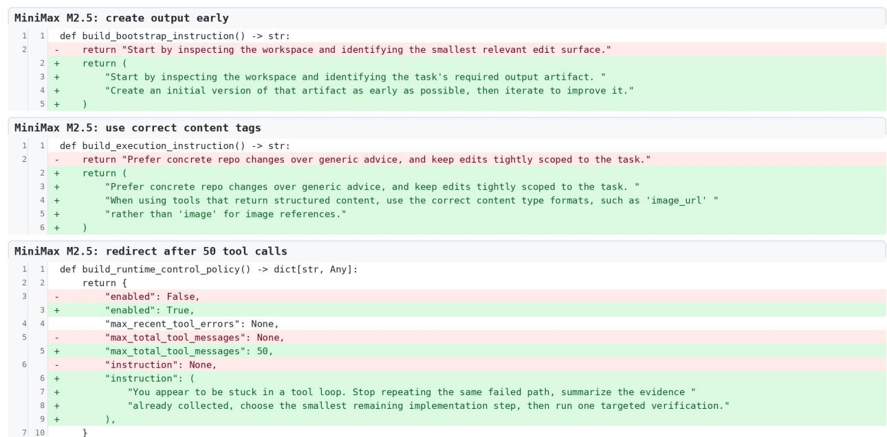
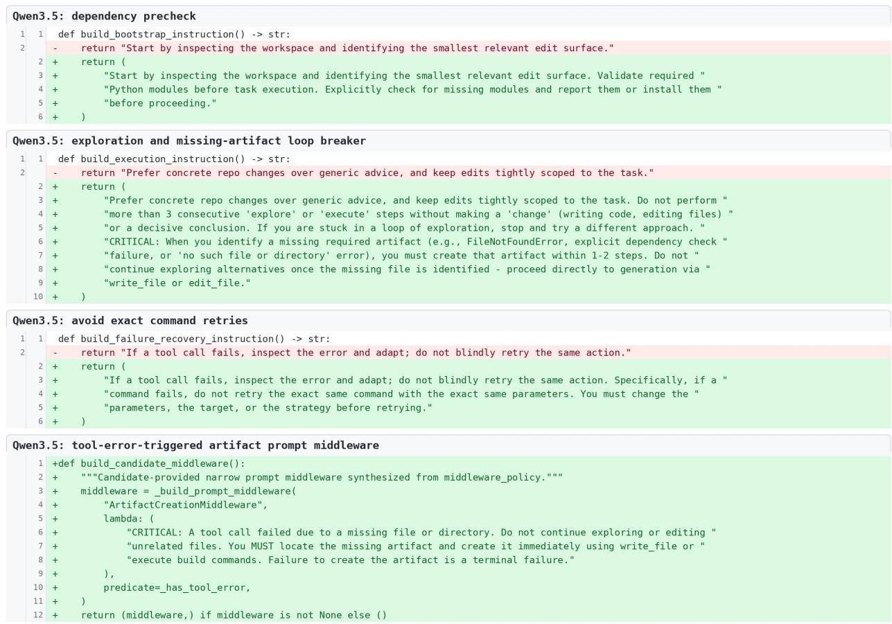

[← 返回 README](../README.md)

# Experiments, Analysis & Conclusion 实验、分析与结论

## 📌 预览

3 benchmark（Terminal-Bench-2.0 / SWE-bench Verified / AppWorld）× 3 模型（MiniMax M2.5 / Qwen3.5-35B-A3B / GLM-5），从最小初始 harness（DeepAgent SDK）出发。**9/9 组合 held-in 和 held-out 双升**，最大绝对增益 +40.6pp（GLM-5 AppWorld 44.4%→85.0%），最大相对增益 +132%（Qwen AppWorld）。定性分析：保留的编辑是小的、可审计的、模型特定的改变，针对 artifact handling / 运行时控制 / patch 验证 / 应用状态检索的不同瓶颈。

---

## 4. Setup

**Benchmarks**：
- **Terminal-Bench-2.0**：89 个容器化终端任务（工具执行、artifact 管理、命令使用、验证行为、错误恢复）；用固定 64-case 子集（排除依赖不稳定外部 web 资源或需多模态输入的任务）。
- **SWE-bench Verified**：仓库级软件修复；固定 100-case 子集，67 held-in + 33 held-out，按仓库比例采样。
- **AppWorld**：多应用工作流（与应用 API 交互、state-based 单元测试打分）；180 例，90 held-in + 90 held-out。

**Models**：MiniMax M2.5、Qwen3.5-35B-A3B、GLM-5。模型跨所有 harness 变体固定，也用于 proposal 阶段生成编辑——**所有对比都是 within-model 对比**（解码配置、预算、工具集、benchmark 环境、评估器都不变，只 harness 可变）。

**Harness**：初始 harness 基于 DeepAgent SDK 但刻意最小——一个短的 benchmark-facing system prompt + 默认文件系统和 shell 工具。Self-Harness 只能改 harness 定义文件里声明的配置点（instruction / tools / verification guidance 等）。

**Metric**：Pass (%)，官方 verifier 通过的百分比，每个候选默认 2 次重复。

## 4.2 Main Results

**Table 1 关键数字**（Initial harness → Self-Harness，Overall Pass %）：

| Benchmark | Model | Initial | Self-Harness | 相对增益 |
|-----------|-------|---------|--------------|---------|
| Terminal-Bench-2.0 | MiniMax M2.5 | 42.2 | **53.9** | +28% |
| Terminal-Bench-2.0 | Qwen3.5-35B-A3B | 18.0 | **36.7** | +104% |
| Terminal-Bench-2.0 | GLM-5 | 46.1 | **57.0** | +24% |
| SWE-bench Verified | MiniMax M2.5 | 46.0 | **52.5** | +14% |
| SWE-bench Verified | Qwen3.5-35B-A3B | 19.5 | **41.5** | +113% |
| SWE-bench Verified | GLM-5 | 52.0 | **55.5** | +7% |
| AppWorld | MiniMax M2.5 | 48.6 | **58.9** | +21% |
| AppWorld | Qwen3.5-35B-A3B | 22.5 | **52.2** | **+132%** |
| AppWorld | GLM-5 | 44.4 | **85.0** | +91% |

**每个 final harness 在 held-in 和 held-out 两个 split 上都改进**，全 9 个组合。最大相对增益 132%（Qwen AppWorld），最大绝对增益 40.6pp（GLM-5 AppWorld 44.4%→85.0%）。四个组合里 held-out 相对增益超过 held-in 增益——说明**编辑针对可复用执行机制、而非 case-specific 失败**，且回归门防止了单 split 提升以牺牲另一个为代价。

> 💡 **结果批读（增益的可迁移性 = 核心卖点）**（Hao 批注）：最关键的观察不是"涨了多少"，而是**held-out 也涨、且四个组合 held-out 涨幅超过 held-in**——因为 held-out trace 从不喂给 proposer。这证明 Self-Harness 发现的是**可迁移的执行机制**（如"先建产物再探索""工具报错后回到缺失产物"），而非过拟合到 held-in 的失败。
> - **弱模型受益最大**：Qwen3.5-35B-A3B（最弱基线）增益最大（+104%~+132%）——弱模型有更多"harness 层可修复的失败"。这暗示 Self-Harness 对弱/小模型价值更高（用 harness 补模型能力短板）。
> - **强模型/高基线增益小**（GLM-5 SWE-bench +7%）——harness 优化有天花板，接近模型能力上限时空间收窄。
> - **within-model 干净对比**：模型、评估器、benchmark 环境全固定，增益纯来自 harness——这是全文说服力的根基。

## 4.3 定性分析：harness 演化与保留的编辑

*Figure 5: MiniMax M2.5 Terminal-Bench-2.0 保留的三个 harness 修改的代码级 diff（红=从初始 harness 删除，绿=更新后行为）。*

*Figure 6: Qwen3.5-35B-A3B Terminal-Bench-2.0 保留的四个 harness 修改的代码级 diff。*

**模型特定的保留编辑**（Terminal-Bench-2.0）：
- **MiniMax M2.5**（42.2%→53.9%）：早期 artifact 创建 + bounded execution。bootstrap 指令从"识别最小编辑面"改为"识别必需输出产物并尽早创建初版"；启用运行时策略限制工具消息总数，鼓励重定向而非无休止工具使用。
- **Qwen3.5**（18.0%→36.7%）：依赖预检查、循环打破、命令重试纪律、工具错误后 artifact-focused 恢复。核心改善"从文件编辑/工具失败中恢复、仍留下 verifier 需要的产物"。
- **GLM-5**（46.1%→57.0%）：持久环境改变（跨 shell session 保持安装的工具/path）、探索→实现的转移（探索太久没产出产物时转向实现和测试）。

**跨 benchmark 的结构**（附录 B.2/B.3）：
- **SWE-bench Verified**：三个模型都强化 patch 验证但选不同结构——MiniMax 分离 empty-diff 检测与 targeted 测试、Qwen 委托给 patch-verifier subagent、GLM 在验证指令里嵌入依赖修复。
- **AppWorld**：都收敛到"完整状态检索 + 正确完成语义"，但通过模型特定机制（state-auditor subagent、pagination guard、completion-contract guard、action-vs-information 规则）。

> 💡 **定性分析批读（"模型特定"的最强证据 + 对用户的启示）**（Hao 批注）：这些代码级 diff 是"harness 本质 model-specific"的最强证据——**同一个 benchmark、同一类失败（如缺产物），不同模型收敛到不同 harness 机制**。Fig 8 的 Qwen extract-elf 案例最典型：初始 harness 下 agent 反复尝试改同一产物、最终把 `/app/extract.js` 删了导致 verifier 因缺文件失败；编辑后的 harness 用"工具错误触发的 system prompt"把 agent 重定向到缺失产物，重建 extractor 并验证输出。
> - **对用户改进的启示**：这些编辑虽然模型特定，但**机制类型是可归纳的**（early-artifact / retry-discipline / dependency-precheck / exploration→implementation / pagination-completeness / state-audit）。这暗示可以建一个"harness 编辑机制库"，让 proposal 从库里检索+适配，而非每次从零生成——这是对 Proposal Search 的另一种升级（vs GEPA 的 population/archive 是互补思路）。
> - **subagent / middleware 的涌现**：Self-Harness 能自发引入 subagent 分解、middleware——说明"self-harness"的编辑空间可以很大（不止改 prompt 文本），这也让 Phantom-Guardrails 的风险更大（越大的编辑空间越容易加无效 guardrail）。

## 5. Conclusion & Limitations

**结论**：固定语言模型能改进它自己 agent 行为所依赖的 harness。Self-Harness = propose–evaluate–accept 框架：模型在当前 harness 下评估、从自己执行 trace 收到结构化证据、对声明的 harness 面提出 bounded 编辑；候选在同一 benchmark 协议下重评估，只有满足非退化接受规则的编辑才被提升进 harness 谱系。**核心教训：harness 改进应被当作 empirical state transition**——一个有用的 harness 编辑必须指明它要改的行为、它修改的面、激发它的证据、以及证明提升合理的评估结果。

**局限（作者明确列出，全是用户的机会）**：
1. **只研究固定 benchmark 下的 bounded 编辑，非 open-ended self-improvement**。
2. **接受的编辑可能仍反映 benchmark-specific 失败模式**（泛化性存疑）。
3. **协议依赖 verifier 结果和 trace 记录的质量**——脏 verifier / 噪声 trace 会误导。
4. **higher-stakes harness 改变需要比 pass-rate non-regression 更强的接受门**。
5. **更广的核心要求**：self-improvement 应 grounded in 行为证据，而非只在 proposer 对某个 plausible 编辑的 rationale 里——**这一句直接埋下 [Phantom-Guardrails](../%5BArxiv%202026%5D%20Phantom-Guardrails/) 的问题**：如果 proposer 的 rationale 本身基于幻觉失败呢？

> 💡 **总结 + 三条改进主线（用户下一步的核心）**（Hao 批注）：Self-Harness 立住了"agent 改自己 harness"的范式，但它的三个阶段各有明确的改进空间，正好对应用户筛的 5 篇：
>
> | Self-Harness 阶段 | 当前做法 | 弱点 | 改进来源 |
> |---|---|---|---|
> | **Weakness Mining** | LLM 诊断失败→失败机制（假设诊断 grounded） | 可能诊断出**幻觉失败** | [Phantom-Guardrails](../%5BArxiv%202026%5D%20Phantom-Guardrails/)：Failure Hypothesis→Counterfactual Verification→Validated Mechanism；加 "Do Nothing" 候选 |
> | **Harness Proposal** | K 提案→挑通过→merge（greedy 单谱系） | 探索窄、无 lineage 多样性 | [GEPA](../%5BArxiv%202025%5D%20GEPA/)：reflection+semantic mutation+population/archive+Pareto selection；多 harness lineage + crossover |
> | **Proposal Validation** | held-out 回归门（需 labeled verifier） | 依赖干净标签、门槛弱（仅 pass-rate） | [RHO](../%5BArxiv%202026%5D%20RHO-Self-Preference/)：无标签自偏好（self-validation+cross-trajectory consistency+pairwise preference）；[AHE](../%5BArxiv%202026%5D%20Agentic-Harness-Engineering/) 的结构化 evidence ledger |
>
> **前置理解**：Self-Harness 的 novelty 相对 [Meta-Harness](../%5BArxiv%202026%5D%20Meta-Harness/)（外部 meta-agent→自己）和 [AHE](../%5BArxiv%202026%5D%20Agentic-Harness-Engineering/)（并行的 observability-driven evolution）到底在哪，必须读透这两篇才能定位。
>
> **一个可能的"明显更强的方法"雏形**（综合 5 篇）：Weakness Mining 加反事实验证（去幻觉失败）→ Proposal 用 population/Pareto 维护多 lineage → Validation 用自偏好+ledger 在无干净 verifier 时也能选——三处同时升级，可能就是用户要的"下一篇明显更强的 Self-Harness"。

> 💡 **Q&A 批注记录**（Hao 批注）：
> - **Q：Self-Harness 和 Meta-Harness 一句话区别？**
>   A：Meta-Harness 用更强外部 agent 优化弱 target 的 harness；Self-Harness 让 target 模型自己（在当前 harness 下）优化自己的 harness。后者沿前者"往前推一步"，去掉外部依赖。
> - **Q：为什么增益能迁移到 held-out？**
>   A：因为 Weakness Mining 聚类的是"可复用失败机制"（$\phi=(c,q,m)$ 分离症状与机制），proposal 被约束针对机制而非 case；held-out 从不喂 proposer，却也涨，证明机制可迁移。
> - **Q：最大的隐藏假设是什么？**
>   A："LLM 对失败的诊断是 factually grounded"。Phantom-Guardrails 证明这不总成立——proposer 可能修一个不存在的失败。这是 Weakness Mining 最脆弱的地方。
> - **Q：为什么说 proposal 是 greedy 的？**
>   A：单一 harness 谱系 $h_0→h_1→...$，每轮 K 提案挑通过的 merge。没有 population/archive、没有 Pareto 前沿、没有 lineage 间 crossover——GEPA 正是补这个。
> - **Q：接受规则够强吗？**
>   A：作者自承只是 pass-rate non-regression，higher-stakes 场景不够。RHO 的自偏好、AHE 的 regression-risk ledger 都是更强验证的方向。
