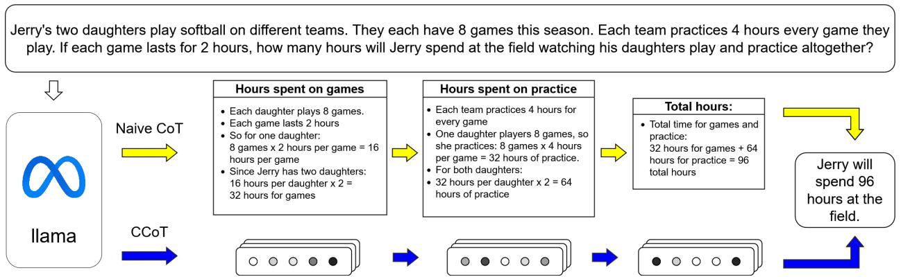
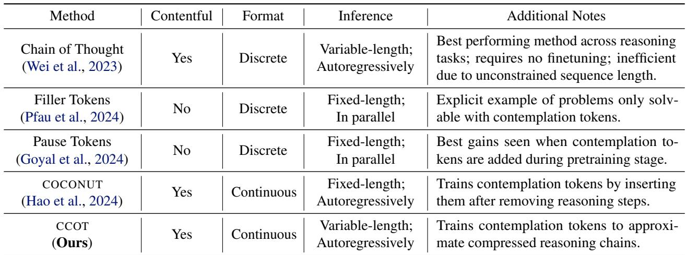

[← 返回 README](../README.md)

## 📌 预览
相关工作比较 CoT distillation、pause/filler tokens、context compression，并给出 contemplation token 分类。

---

# 2. Related Work

Distillation of Knowledge Chains There has been work in distilling the computations done explicitly when decoding the reasoning chains into computation of the hidden states of the answer (Deng et al., 2023; 2024). Contemporaneous work distills reasoning paths into continuous latent tokens (Hao et al., 2024). Our method differs in that the contemplation tokens we generate are grounded in text rather than only used as a signal to decode from. This is a critical distinction: our grounding offers the future potential for decoding the reasoning chain from the compressed representations, allowing for post-hoc human inspection of the LLM’s reasoning. Moreover, our method successfully adapts a much larger model (7B compared to 1.5B) using a fraction of data $\approx 9 0 0 0$ instances in GSM8K compared to $\approx 4 0 0 0 0 0$ instances in an unreleased augmented GSM8K). This suggests that our method can scale better to larger models and is more data efficient.

> 💡 **和隐式 CoT 蒸馏的区别**: CCoT 强调 contentful grounding。它不是只让 answer hidden state 内化推理，而是让 contemplation tokens 近似 reasoning-chain hidden states，因此理论上更有机会做 post-hoc inspection。

Figure 1. Two approaches to step by step reasoning. Chain of Thought (CoT) prompting reasons via discrete language tokens, leading to long sequences that incur significant generation costs. In contrast Compressed Chain of Thought (CCOT) elicits reasoning with a short sequence of continuous embeddings, allowing for much greater throughput.

> 💡 **Figure 1 批读**: 左边是显式 CoT 的长离散路径，右边是短连续 embedding 路径。图的重点不是说 CCoT 完全免费，而是把 token 数从完整 reasoning chain 压缩到 $r m$。

Filler (Pause) Tokens Many previous methods have considered decoding contemplation tokens to provide an LLM with more compute during inference time. These tokens have gone by many names, such as pause tokens (Goyal et al., 2024), memory tokens (Burtsev et al., 2021), filler tokens (Pfau et al., 2024), and thinking tokens (Herel & Mikolov, 2024). These works mainly focus on noncontentful contemplation tokens, whose main advantage is their ability to be decoded in parallel, providing the model with a greater computational width without the need to autoregressively decode.

They have been shown to increase the theoretical computational ability of Transformer LLMs (Pfau et al., 2024), but cannot simply be naively applied to induce reasoning gains (Lanham et al., 2023). However, through careful pretraining and finetuning, pause tokens have been shown to improve reasoning in both RNNs (Herel & Mikolov, 2024) and Transformers (Goyal et al., 2024). In contrast, the contemplation tokens generated by CCOT are contentful as they are compressed representations of reasoning chains. Moreover, they are decoded autoregressively resulting in a greater computational depth as well as width.

> 💡 **CCoT vs Pause**: Pause/filler token 多数提供并行宽度；CCoT autoregressive 生成 latent，因此也提供顺序深度。对 GSM8K 这种多步算术任务，作者认为深度比单纯宽度更关键。

Contextual Compression Transformer LLMs are the de facto standard architecture for modern NLP applications. However, due to the quadratic complexity of its selfattention mechanism, these LLMs are inefficient in tasks with long contexts. Many techniques have been proposed to alleviate this issue, including memory slots (Ge et al., 2024), dynamic compression into nuggets (Qin et al., 2024), and low level cache encoding (Liu et al., 2024). While most techniques rely on access to the intermediate hidden states of LLMs, there has also been work done in the context of APIonly LLMs (Jiang et al., 2023). Overall, most of the work in contextual compression deals with efficient compression of known context in order to improve generation latency. The compressed context can then be used in downstream tasks such as retrieval augmented generation or summarization.

The area of context compression is orthogonal to contemplation tokens. The memory slots of (Ge et al., 2024) and the nuggets from (Qin et al., 2024) encode contentful representations of known context, but they are only attended to and never generated during inference. While our work focuses on contentful representations of text, there are two crucial differences: our compressed representations are autoregressively decoded during inference and they encode content that is a priori unknown.

> 💡 **Context compression 对比**: context compression 压缩已知上下文，CCoT 压缩的是本来还没生成的 reasoning chain。这个区别很重要：CCoT 在推理时生成未知的 latent thoughts，而不是摘要已知文本。

Chain of Thought Chain-of-thought (Wei et al., 2023) was introduced as a prompting method leveraging in-context learning (ICL) using hand crafted demonstrations. Kojima et al. (2023) showed similar behavior could be elicited in a zero-shot context by instructing a model to “think stepby-step.” There have been a variety of innovations to CoT, improving on its efficiency and performance.

In terms of efficiency, novel techniques include getting an LLM to generate steps in parallel from a generated template (Ning et al., 2024) and generating reasoning chains in parallel using Jacobi decoding (Kou et al., 2024; Zhang et al., 2024). In terms of performance, techniques include generating multiple reasoning paths (Yao et al., 2023), and finetuning on human feedback on generated chains (Liu et al., 2023; Puerto et al., 2024). Our method differs from prior work in improving the efficiency of CoT as it is not prompt-based and does not rely on Jacobi decoding.

Table 1. A comparison of different methods to generate contemplation tokens in order to introduce extra computation into models during inference. We characterize several aspects of the tokens: (1) contentful, the tokens are either intrinsically contentful or approximate/are distilled from contentful text; (2) format, whether the tokens are drawn from a discrete set of embeddings or are drawn from continuous space; and (3) inference, how the tokens are generated during inference. Any additional notes for each method are included as well.

*Table 1: MinerU extracted table image.*

> 💡 **Table 1 批读**: 表格把方法按 contentful / format / inference 三轴分类。CCoT 的独特点是三者组合：contentful + continuous + variable-length autoregressive，这也是它比 PAUSE 更慢但更准的原因。

---

## 🔖 Section 总结

> 💡 **Section 小结**:
> - CCoT 位于 CoT distillation、pause/filler tokens、context compression 的交叉处。
> - 与 DCA 相比，它更贴近“压缩显式推理链”；与 Pause 相比，它有内容来源；与 context compression 相比，它生成未知 reasoning representation。
