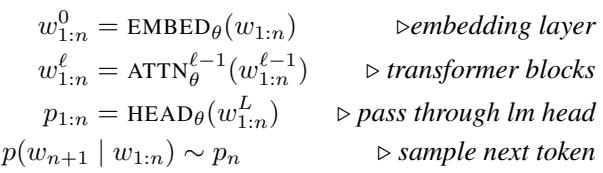

[← 返回 README](../README.md)

## 📌 预览
本节定义 decoder hidden-state 符号、contentful contemplation tokens，以及压缩 reasoning chain 的经验观察。

---

# 3. Contemplation Tokens

# 3.1. Preliminaries and Notation

We first give a brief overview of a causal decoder-only language model, equipped with standard Transformer blocks (Vaswani et al., 2023). Let $V$ be the vocabulary and $w _ { 1 : n }$ be an input sequence, $w _ { i } \in V$ . Let $d$ be the hidden dimension, $L$ be the number of layers, and $\theta$ be the parameters of the model. The sequence is firlayer, resulting in a vector $w _ { 1 : n } ^ { 0 }$ ssed through where each $w _ { i } ^ { 0 } \in \mathbb { R } ^ { d }$ dding. The entire vector $\boldsymbol { w _ { 1 : n } ^ { 0 } } \in \mathbb { R } ^ { n \times d }$ is then passed through a series of Transformer blocks, $T ^ { i } : \mathbb { R } ^ { n \times { \bar { d } } }  \mathbb { R } ^ { n \times d }$ . We denote the output of each $T ^ { i }$ as the hidden states. The output of the final Transformer block, $w _ { 1 : n } ^ { L } \in \mathbb { R } ^ { n \times d }$ , is then passed through the language model head to generate a distribution $p _ { 1 : n } , \bar { p } _ { i } \in \mathbb { R } ^ { | V | }$ , from which the next token is sampled.

> 💡 **符号预览**: 本节先把 causal decoder 的 embedding、hidden state、LM head 写清楚。后面 CCoT 会在 hidden-state 层操作，所以需要区分 token、embedding、每层 hidden states。

*Equation 1: Display equation rendered from MinerU extraction.*

> 💡 **Equation 1 批读**: 这是标准 decoder-only LM 的前向：token -> embedding -> Transformer hidden states -> LM head。CCoT 的创新点是中间 hidden state 可以被取出来当连续输入，而不必先映射回离散 token。

Notation-wise, any lowercase letter will refer to a token, lying in $V$ . Any lowercase letter with superscripts will refer to the hidden state after passing through the corresponding layer, lying in $\mathbb { R } ^ { d }$ . Any subscripts refers to a sequence. We will often omit superscripts and instead refer to embeddings with bars ${ \bf \Xi } ( { \bf \Lambda } ^ { - } )$ and the entire hidden state with hats ${ \bf \Xi } ( { \bf \Lambda } \hat { \bf \Lambda } )$ Under this notation, we instead have EMBED $( w _ { 1 : n } ) = \bar { w } _ { 1 : n }$ and with slight abuse of notation, $\mathrm { A T T N } \big ( \bar { w } _ { 1 : n } \big ) = \hat { w } _ { 1 : n }$ .

There are also instances where hidden states of an input are computed under two different sets of weights. Suppose we have two sequences of embeddings $\bar { w } , \bar { x }$ , and we want to compute the hidden states $\hat { w }$ under weights $\theta$ and compute the hidden states of $\hat { x }$ under $\psi$ , but crucially conditioned on $\hat { w }$ . In this case, we will write $\mathrm { A T T N } _ { \theta , \psi } \big ( [ \bar { w } ; \bar { x } ] \big ) = \big [ \hat { w } ; \hat { x } \big ]$ where semicolons indicate vector concatenation.

# 3.2. Motivation

In question-answer settings, the input $w _ { 1 : n }$ is a query, and the answer $w _ { n + 1 : n + o } = a _ { 1 : o }$ is generated autoregressively as described above. However as seen in the above description of forward passes through Transformer models, the amount of computations for each query is directly proportional to the query length $n$ . As such, we can introduce more computations to the model by attending to an a set of contemplation tokens, defined to be any additional tokens generated during inference used to introduce addition memory allowing for additional computations during inference. Rather than solely attending to a query $q = w _ { 1 : n }$ , we first can generate a set of contemplation tokens $t = t _ { 1 : m }$ and attend to $[ q ; t ]$ in order to decode a better answer. We emphasize that contemplation tokens are not a novel idea, but a term introduced to unify the many names given to this

concept (Section 2).

We define the contemplation tokens $t$ to be contentful if either the tokens themselves are semantically contentful or the hidden states corresponding to the contemplation tokens are derived from semantically contentful tokens. We define contemplation tokens that do not fulfill either of these conditions to be noncontentful. An example of contentful contemplation tokens are the reasoning chains in chain of thought (Wei et al., 2023); they describe the model’s reasoning, fulfilling the first condition of being semantically meaningful. On the other hand, an example of noncontentful contemplation tokens are filler tokens (Pfau et al., 2024), as they are simply period characters and their hidden states are trained without any signal from semantically contentful hidden states.

> 💡 **概念定义**: contentful 不要求 token 本身可读；只要 hidden states 来源于有语义的文本也算。这个定义为 CCoT 铺路：dense token 不可读，但它蒸馏自 CoT hidden states。

Chain of thought turns out to be the only prior method involving contentful contemplation tokens. The performance gains from utilizing chain of thought are clear; however these benefits are offset by the high generation latency. Suppose the input query consists of $n$ tokens and its corresponding reasoning chain consists of $m$ tokens. As each of the tokens in the reasoning chain need to be autoregressively decoded, the generation of the reasoning chain incurs the cost of $m$ extra passes through the model. Moreover when decoding the answer, the model has to attend to the additional $m$ tokens, resulting in $O ( m ^ { 2 } )$ more computations when passing through each attention module. As reasoning chains are often many times longer than the query, the amount of extra computations increases dramatically.1

# 3.3. Compressing Reasoning Chains

Prior work showed that noncontentful contemplation tokens only improved reasoning when the task was computationally bottlenecked (Pfau et al., 2024) or when the tokens were introduced during pretraining (Goyal et al., 2024). We instead aim to utilize contentful contemplation tokens as we believe they would be more applicable to a wider set of tasks. To generate contentful contemplation tokens, we take inspiration from an empirical observation of CoT decoding.

Suppose we have an input query $w _ { 1 : n }$ and its corresponding reasoning chain $t _ { 1 : m }$ . We compute the hidden states of concatenated input as $x = [ \hat { w } _ { 1 : n } ; \hat { t } _ { 1 : m } ]$ . Decoding an answer conditioned on the hidden states $x$ is equivalent to prompting a language model with the query and chain of thought. Consider taking a subset of $\hat { t } _ { 1 : m }$ along the sequence length axis, denoted as $z _ { 1 : k }$ for some $k < < m$ . Specifically, for each $1 \leq i \leq k$ , there exists some $1 \leq j \leq m$ such that $z _ { i } = \hat { t } _ { j }$ at each layer. We observe that training an adapter to decode conditioning on this shortened $\left[ x _ { 1 : n } ; z _ { 1 : k } \right]$ results in lossless performance on downstream tasks.

> 💡 **关键观察**: 作者发现 full reasoning chain 的 hidden states 可以抽子集而基本不损失下游表现。这是 CCoT 成立的前提：如果 reasoning 信息在 hidden sequence 中有冗余，就可以压缩。

Given a query $q$ , the naive method utilizing this observation would be to autoregressively generate the reasoning chain $t$ , select some learned subset of the encoded hidden states $z$ , and train an adapter to decode from the query and subset of hidden states. While this method results in a shorter input sequence when generating the answer and thus reduces the attention computations when decoding the answer, it would still incur the linear cost in generating the reasoning chain. We instead propose learning a module to generate the compressed representations $z$ directly. We denote this module as CCOT, short for compressed chain of thought, as the contemplation tokens it generates are compressed representations of reasoning chains instead of the full chain.

> 💡 **机制转折**: naive 做法仍要先生成完整 CoT 再取 hidden subset，省不了线性生成成本。CCoT 的关键是直接学习生成 compressed representations。

---

## 🔖 Section 总结

> 💡 **Section 小结**:
> - CoT 是 contentful 但离散且长。
> - Pause/filler 是短但 noncontentful。
> - CCoT 的路线是学习直接生成 compressed hidden states，绕开完整 CoT token 生成。
