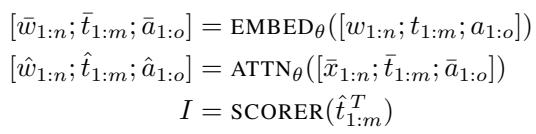
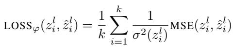
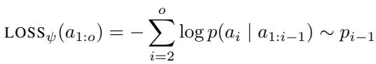

[← 返回 README](../README.md)

## 📌 预览
方法节拆解 CCOT/DECODE 两阶段训练、hidden-state subset supervision 和 inference 流程。

---

# 4. Approach

Assume we have a pretrained causal decoder-only language model LM, parameterized by weights $\theta$ . We wish to train two modules, CCOT and DECODE, respectively parameterized by weights $\varphi$ and $\psi$ . At a high level given a query, $\mathrm { C C O T } _ { \varphi }$ is responsible for the generation of contemplation tokens. $\mathrm { D E C O D E } _ { \psi }$ is responsible for decoding the answer conditioned on the initial query and contemplation tokens.

> 💡 **Section 概览**: 方法分两段训练：$CCOT_\varphi$ 负责从 query 生成 compressed contemplation tokens，$DECODE_\psi$ 负责在 query + latent tokens 条件下输出 answer。

Consider a training instance consisting of a query, full reasoning chain and answer, denoted as $w _ { 1 : n } , t _ { 1 : m }$ and $a _ { 1 : o }$ , respectively. Assume some fixed compression ratio $0 < r < 1$ and let $k = \lceil r \cdot m \rceil$ . This compression ratio controls how much the reasoning chains are compressed; $r = 1$ corresponds to finetuning on the full reasoning chain while a $r = 0$ corresponds to finetuning on just the answer. $\varphi$ and $\psi$ are fine-tuned successively, each initialized from $\theta$ .

> 💡 **压缩率解释**: $r=1$ 等于完整 CoT，$r=0$ 等于没有 contemplation tokens；中间值就是 latent thinking budget。它把推理收益从一个离散开关变成可调滑杆。

# 4.1. Finetuning $\mathbf { C C O T } _ { \varphi }$

The goal of $\mathrm { C C O T } _ { \varphi }$ is to generate contemplation tokens. Under CCOT, these tokens are a compressed representation of a full reasoning chain, equivalent to a size $k$ subset of the hidden states $\bar { \hat { t } } _ { 1 : m }$ produced by $\mathbf { L M } _ { \theta }$ . Since processing all of $t$ and then performing a subset selection still incurs the linear cost of generating all $m$ tokens, $\mathrm { C C O T } _ { \varphi }$ is thus trained to approximate a subset of precomputed hidden states.

To achieve this, we first precompute the hidden states of the concatenated input. We next use a checkpoint of a scorer used to perform a similar subset selection from Qin et al. (2024) in order to perform the subset selection of the hidden states. This scorer is simply a linear layer that takes the embeddings from a predetermined layer $T$ as input, and returns the indices of the selected subset. We discuss other methods of subset selection in Section 5.2.

*Equation 1: Display equation rendered from MinerU extraction.*

> 💡 **Equation 2 批读**: 这一步先用原始 LM 处理 query + full reasoning chain + answer，再从 reasoning-chain hidden states 中选出 gold subset。CCoT 学的是“直接生成这个 subset”，而不是生成文字链。

We have that $| I | = k$ , and we can index the hidden states $z _ { 1 : k } = \hat { w } _ { I }$ to serve as the gold labels. We aim to generate $k$ contemplation tokens $\hat { z } _ { 1 : k }$ conditioned on $w _ { 1 : n }$ under $\varphi$ to approximate the labels, but is not immediately clear what inputs we should use to generate the contemplation tokens.

A reasonable choice is to use the embeddings of the tokens corresponding to the selected indices, $\hat { w } _ { I }$ . This choice would make the hidden state approximation easier due to skip connections in the attention layer: $\hat { w } _ { I }$ are the exact inputs used to compute the hidden states in the noncompressed case. However, the selected tokens are usually punctuation tokens and articles. This choice would require predicting a random sequence of semantically empty tokens when autoregressively decoding as we pass the last layer embeddings $\hat { z } _ { i } ^ { L }$ through the language model head. Another option would be to learn a single embedding as input to generate each hidden state, but this choice removes the additional computational depth induced by autoregressive decoding.

> 💡 **输入设计难点**: 如果直接用被选中 token 的 embedding 作为输入，模型可能要预测一串无意义的标点/冠词。作者改用上一 contemplation token 的中间层 hidden state，避免把 latent generation 退化成无意义 token prediction。

We instead take inspiration from reasoning over continuous space and use the intermediate hidden layers of the previous contemplation token as input to the next token. Formally, the inputs to generate the contemplation tokens $\hat { z } _ { 1 : k }$ are the embeddings of $z _ { 0 : k - 1 } ^ { l }$ at some fixed layer $l$ where $z _ { 0 }$ represents the hidden state of the last token of the query.

This choice is quite natural as it generalizes the naive autoregressive decoding strategy (Section 4.3). We train the parameters of $\varphi$ layer by layer with the following loss:

*Equation 2: Display equation rendered from MinerU extraction.*

> 💡 **Equation 3 批读**: $CCOT_\varphi$ 用按方差缩放的 MSE 去拟合各层 gold hidden states。缩放是工程必要项，因为不同层 hidden norm 差异很大，否则统一 learning rate 会不稳定。

where $\sigma ^ { 2 } ( z )$ denotes the variance of $z$ and MSE denotes the usual mean squared error between two vectors. We use a scaled mean squared error in order to normalize hidden states with average $L ^ { 1 }$ norms. These norms differ drastically between different layers within the same model, so the scaled loss allows us to keep a consistent learning rate.

To train the ith layer, we pass in the inputs described above and compute forward passes through $i$ Transformer layers, crucially only updating the parameters corresponding to the ith layer. When training subsequent layers, the parameters corresponding to the $i$ th layer are frozen. This provides a natural segmentation to the approximation task, and we found this improved the generated contemplation tokens.

# 4.2. Finetuning DECODEψ

We assume a trained module $\mathrm { C C O T } _ { \varphi }$ . Compressed reasoning chains are out of distribution for $\theta$ , so we need a separate module in order to effectively condition on the generated contemplation tokens. We train $\mathrm { D E C O D E } _ { \psi }$ to decode the answer from the query and contemplation tokens.

> 💡 **为什么要 DECODE**: base LM 没见过这种 compressed latent sequence，直接让 $\theta$ 解码不可靠。因此训练 $DECODE_\psi$ 适配 query + generated contemplation tokens 的分布。

To do this, we first encode the hidden states of the query and autoregressively generate contemplation tokens $z _ { 1 : k } ^ { * }$ . Con-

# Algorithm 1 Chain of Thought inference

# Algorithm 2 CCOT inference

# Require: Query $w$ , parameters $\theta$

1: $\bar { w }  \mathrm { E M B E D } _ { \theta } ( w )$ $\triangleright$ embed query
2: $\hat { w } \gets \mathrm { A T T N } _ { \theta } ( \bar { w } )$ ▷ compute hidden states
3: $z \gets$ ]
4: while $z _ { - 1 } \neq \langle A N S \rangle$ do
5: $\begin{array}{c} \begin{array} { r l } { [ \hat { w } ; \hat { z } ]  \mathrm { A T T N } ( [ \bar { w } ;  } & { { } \mathrm { ~ } } \end{array} ] )  \end{array}$
6: $\_$
7: $z \gets [ z ; x ]$
8: end while
9: $a \gets [ \langle A N S \rangle ]$
10: while $a _ { - 1 } \neq \langle E O S \rangle$ do
11: $\begin{array} { r } { [ \hat { w } ; \hat { z } ; \hat { a } ] \gets \mathrm { A T T N } ( [ \bar { w } _ { 1 : n } ; \begin{array} { l l l l l l l l l l } \end{array}  } \end{array}$
12: $x \sim \mathrm { H E A D } \ \left( \hat { a } _ { - 1 } ^ { L } \right)$ ▷ sample answer token
13: $a \gets [ a ; x ]$
14: end while
15: return $a$
Require: Query $w$ , parameters $\theta , \varphi , \psi$ , autoregressive layer l
1: $\bar { w }  \mathrm { E M B E D } _ { \theta } ( w )$ ▷ embed query
2: $\hat { w } \gets \mathrm { A T T N } _ { \theta } ( \bar { w } )$ ▷ compute hidden states
3: $z \gets [ \hat { w } _ { - 1 } ^ { l } ]$
4: while $\mathrm { E N D } _ { \psi } \big ( \hat { z } ^ { L } \big )$ is False do
5: $[ \hat { w } ; \hat { z } ] \gets \mathrm { A T T N } _ { \theta , \varphi } ( [ \bar { w } ; z ] )$ ▷ gen. cont. token
6:
7: $z \gets [ z ; \hat { z } _ { - 1 } ^ { l } ]$ ▷ append cont. token
8: end while
9: $a \gets [ \langle A N S \rangle ]$
10: while $a _ { - 1 } \neq \langle E O S \rangle$ do
11: $\begin{array} { r } { [ \hat { w } ; \hat { z } ; \hat { a } ] \gets \mathrm { A T T N } _ { \theta , \varphi , \psi } \big ( [ \bar { w } _ { 1 : n } ; z ; \mathrm { E M B E D } _ { \theta } ( a ) ] \big ) } \end{array}$
12: $x \sim \mathrm { H E A D } _ { \psi } \big ( \hat { a } _ { - 1 } ^ { L } \big )$ $\triangleright$ sample answer token
13: $a \gets [ a ; x ]$
14: end while
15: return a

trasting the training of $\mathrm { C C O T } _ { \varphi }$ , we perform this generation autoregressively rather than using the precomputed embeddings $z _ { 0 : k - 1 } ^ { l }$ described in Section 4.1 We start by passing in $z _ { 0 } ^ { l }$ and compute the hidden states $\hat { z } _ { 1 }$ . We then autoregressively take $\hat { z } _ { 1 } ^ { l }$ as the next input to generate $\hat { z } _ { 2 }$ , until an entire sequence $\hat { z } _ { 1 : k }$ is generated. Then, conditioning on the query and contemplation tokens, we pass in the answer tokens $a _ { 1 : o }$ and compute the next-token distributions $p _ { 1 : o }$ .

We finetune $\psi$ with the usual cross-entropy loss given the computed distributions where the probabilities of the next token $a _ { i }$ are drawn from the distribution $p _ { i - 1 }$ .

*Equation 3: Display equation rendered from MinerU extraction.*

> 💡 **Equation 4 批读**: $DECODE_\psi$ 用普通 answer cross-entropy 训练，目标是让答案 token 在 generated latent 条件下可预测。这里开始把 latent approximation 和最终任务表现连接起来。

The tokens of $a$ are conditioned on the contemplation tokens $\hat { z }$ generated under $\varphi$ . By unfreezing the parameters $\varphi$ when finetuning the parameters $\psi$ using $\mathrm { L O S S } _ { \psi }$ , we note that the parameters $\varphi$ receive signal from the downstream task.

Empirically, we find that this signal is not entirely useful – downstream performance decreased if all the parameters $\varphi$ are unfrozen. We hypothesize that updating the parameters corresponding to earlier layers affects the autoregressive generation of the contemplation tokens. As such, we find that unfreezing the parameters corresponding to layers after the autoregressive layer $l$ ends up improving performance.

$k$ will not be known during test time, so we additionally train a binary classifier $\mathrm { E N D } _ { \psi }$ that takes the final layer of generated hidden states $\hat { z } _ { i } ^ { L }$ as input and either predicts whether another contemplation token token should be generated. We stop generating contemplation tokens after $h$ tokens. We set $h = 2 0 0 r$ , which would only prematurely terminate less than $3 \%$ of the long tailed distribution of reasoning chains.

# 4.3. Inference

Assume we have a pretrained causal decoder-only language model parameterized by weights $\theta$ . Additionally, assume trained modules $\operatorname { C C O T } _ { \varphi }$ , $\mathrm { D E C O D E } _ { \psi }$ and the end predictor $\mathrm { E N D } _ { \psi }$ . Given a query $w$ , we describe inference in Algorithm 2. We remark that our method to generate contemplation tokens is quite natural; Algorithm 1 describes the usual chain of thought inference and the differences are marked, cyan for our method and Yellow for naive CoT decoding.

The most crucial difference is that when CCOT generates contemplation tokens (lines 4-7), it uses lth layer of the last token’s hidden state as a continuous next input. In contrast when CoT generates contemplation tokens, it uses the final Lth layer to do the usual autoregressive decoding described in Section 3.1, passing to a discrete set of tokens. Moreover, if $m$ is the average length of reasoning chains under $\theta$ , CCOT will generate on average only $\boldsymbol { k } = \intercal \boldsymbol { r } \times \boldsymbol { m } \intercal$ contemplation tokens, whereas CoT will generate on average all $m$ tokens.

> 💡 **Inference 机制**: CCoT 生成 latent token 时，不经过 vocabulary sampling，而是把第 $l$ 层 hidden state 当作下一步输入。这保留了 autoregressive depth，但避免了自然语言 CoT 的长文本输出。

# 4.4. Implementation Details

We use LORA (Hu et al., 2021) in order to finetune $\varphi$ and $\psi$ with ranks of 128 and 64, respectively. When generating the gold hidden states, we pass the $T = 3$ layer to perform our subset selection and the $l = 1 5$ as inputs. We also take the hidden state at the lth layer to do autoregressive generation of contemplation tokens when finetuning $\psi$ and during inference. We use the decoder-only Transformer architecture of LLAMA for our experiments, taking the LLAMA2-7B-CHAT checkpoint (Touvron et al., 2023) as our base model.

> 💡 **实现细节**: 实验基座是 Llama2-7B-chat，$\varphi$ LoRA rank 128，$\psi$ rank 64；subset scorer 用第 3 层，autoregressive latent 输入取第 15 层。这些超参说明 CCoT 依赖中间层表示选择。

---

## 🔖 Section 总结

> 💡 **Section 小结**:
> - 输入: query + 训练时可见 full CoT。
> - teacher: full CoT 的 hidden-state subset。
> - latent 生成: 中间层 hidden state autoregressive rollout。
> - 输出: DECODE 模块根据 query + compressed latent 生成 answer。
