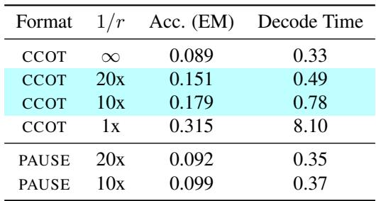

[← 返回 README](../README.md)

## 📌 预览
实验节在 GSM8K 上比较 CCoT、PAUSE、无思考和完整 CoT 的准确率/延迟。

---

# 5. Experiments

# 5.1. Experimental Setups

We evaluate our CCOT framework on the reasoning dataset GSM8K (Cobbe et al., 2021). For the reasoning chains required to train both modules, we use the chains of thought provided with the dataset. We remove all calculator annotations present in the reasoning chain, only keeping the natural language reasoning. We finetune $\varphi$ with precomputed gold states with two compression ratios, $r = [ 0 . 0 5 , 0 . 1 0 ]$ . We emphasize that the choice of $r$ is a training time decision, $\operatorname { C C O T } _ { \varphi }$ approximates the hidden states under the fixed compression ratio $r$ .

> 💡 **实验边界**: 本文实验集中在 GSM8K，训练链来自数据集自带 CoT，并移除 calculator annotations。结论强在算术推理效率，但覆盖面不如 DCA 的多 benchmark。

We compare our results to two baselines of $r = [ 0 . 0 , 1 . 0 ]$ These compression ratios are the two extreme values of the compression spectrum we introduce, corresponding to the cases of no reasoning chain and full reasoning chain. We finetune the model with the usual cross entropy loss on the dataset; For $r = 0 . 0$ , the model directly outputs the answer without generating any contemplation tokens. For $r = 1 . 0$ , the model generates the explicit reasoning chain as its contemplation tokens during inference.

> 💡 **baseline 设计**: $r=0$ 是无思考，$r=1$ 是完整 CoT；PAUSE 用相同 token budget 但 noncontentful。这个设计能把“内容来源”和“额外 token 数”分开比较。

Additionally, we compare to PAUSE, a method derived from Goyal et al. (2024). We finetune the model with no reasoning chains, but for a given ratio $r$ , append $\boldsymbol { k } = \intercal \times \boldsymbol { m } \intercal$ contemplation tokens between the query and answer where $m$ is the length of the reasoning chain. We learn the input embedding of the special token, chosen to be $\langle p a u s e \rangle$ These pause tokens are added to provide the model with an enhanced computational width (See Section 6.2 for further discussion). We evaluate with the same compression ratios $r = [ 0 . 0 5 , 0 . 1 0 ]$ to measure the effect of the tokens.

# 5.2. Results and Discussion

We provide our main results in Table 2. Accuracy refers to the exact match accuracy obtained on the test set with no in-context examples. Decode time refers to the average time to generate an answer to a test set query, measured in seconds by wall clock time on a single Nvidia A100 GPU.

Table 2. Accuracy and decode time on GSM8K (Cobbe et al., 2021) contrasting our method, CCOT, and PAUSE (Goyal et al., 2024) each equipped with two different compression ratios against baselines of no compression (full reasoning chains) and infinite compression (no contemplation tokens). Higher accuracy indicates better performance, while lower decode time indicates better efficiency.

*Table 1: MinerU extracted table image.*

> 💡 **Table 2 批读**: CCoT 20x compression 达 0.151 EM、0.49s；10x 达 0.179 EM、0.78s；full CoT 是 0.315 EM、8.10s。它没有追上完整 CoT，但用很小延迟换来明显高于 no-token baseline 的准确率。

With a compression ratio of $r = 0 . 1 0$ , we see a 9 point improvement over the baseline with no contemplation tokens. This accuracy gain is achieved with an only 0.4 second increase in generation time. If we reduce $r$ to 0.05, we still see a sizable 6 point improvement over the baseline, with a generation time increase of only around 0.15 seconds. In contrast, even though the contemplation tokens generated by PAUSE could be decoded faster, they were only able to nominally improve performance. We hypothesize that even though these tokens provide the model with additional computations, reasoning datasets like GSM8K require more sequential computations over parallel ones. Ultimately, our results show equipping a model with dense, contentful contemplation tokens produced by CCOT allows the model to reason better than if it had no contemplation tokens, or used a discrete set of noncontentful ones.

> 💡 **证据链**: PAUSE 20x/10x 只到 0.092/0.099，接近 baseline 0.089；CCoT 同样压缩率显著更高。这个差异支撑“contentful dense tokens 比 noncontentful pause tokens 更适合 GSM8K”。

---

## 🔖 Section 总结

> 💡 **Section 小结**:
> - CCoT 是效率-性能折中，不是无损替代完整 CoT。
> - 10x/20x compression 的收益明显，但 full CoT 仍最强。
> - 关键限制是实验只覆盖 GSM8K，且准确率数值仍偏低。
