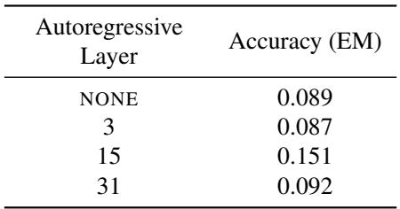
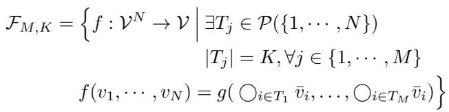

[← 返回 README](../README.md)

## 📌 预览
附录保留 references、层选择实验和理论 formalization。

---

# References

Burtsev, M. S., Kuratov, Y., Peganov, A., and Sapunov, G. V. Memory transformer, 2021. URL https://arxiv. org/abs/2006.11527.

Cobbe, K., Kosaraju, V., Bavarian, M., Chen, M., Jun, H., Kaiser, L., Plappert, M., Tworek, J., Hilton, J., Nakano, R., Hesse, C., and Schulman, J. Training verifiers to solve math word problems, 2021. URL https://arxiv. org/abs/2110.14168.

Deng, Y., Prasad, K., Fernandez, R., Smolensky, P., Chaudhary, V., and Shieber, S. Implicit chain of thought reasoning via knowledge distillation, 2023. URL https: //arxiv.org/abs/2311.01460.

Deng, Y., Choi, Y., and Shieber, S. From explicit cot to implicit cot: Learning to internalize cot step by step, 2024. URL https://arxiv.org/abs/2405.14838.

Ge, T., Hu, J., Wang, L., Wang, X., Chen, S.-Q., and Wei, F. In-context autoencoder for context compression in a large language model, 2024. URL https://arxiv. org/abs/2307.06945.

Goyal, S., Ji, Z., Rawat, A. S., Menon, A. K., Kumar, S., and Nagarajan, V. Think before you speak: Training language models with pause tokens, 2024. URL https: //arxiv.org/abs/2310.02226.

Hao, S., Sukhbaatar, S., Su, D., Li, X., Hu, Z., Weston, J., and Tian, Y. Training large language models to reason in a continuous latent space, 2024. URL https:// arxiv.org/abs/2412.06769.

Herel, D. and Mikolov, T. Thinking tokens for language modeling, 2024. URL https://arxiv.org/abs/ 2405.08644.

Hu, E. J., Shen, Y., Wallis, P., Allen-Zhu, Z., Li, Y., Wang, S., Wang, L., and Chen, W. Lora: Low-rank adaptation of large language models, 2021. URL https://arxiv. org/abs/2106.09685.

Jiang, H., Wu, Q., Lin, C.-Y., Yang, Y., and Qiu, L. Llmlingua: Compressing prompts for accelerated inference of large language models, 2023. URL https: //arxiv.org/abs/2310.05736.

Kojima, T., Gu, S. S., Reid, M., Matsuo, Y., and Iwasawa, Y. Large language models are zero-shot reasoners, 2023. URL https://arxiv.org/abs/2205.11916.

Kou, S., Hu, L., He, Z., Deng, Z., and Zhang, H. Cllms: Consistency large language models, 2024. URL https: //arxiv.org/abs/2403.00835.

Lanham, T., Chen, A., Radhakrishnan, A., Steiner, B., Denison, C., Hernandez, D., Li, D., Durmus, E., Hubinger, E., Kernion, J., Lukosiˇ ut¯ e, K., Nguyen, K., Cheng, N., ˙ Joseph, N., Schiefer, N., Rausch, O., Larson, R., McCandlish, S., Kundu, S., Kadavath, S., Yang, S., Henighan, T., Maxwell, T., Telleen-Lawton, T., Hume, T., Hatfield-Dodds, Z., Kaplan, J., Brauner, J., Bowman, S. R., and Perez, E. Measuring faithfulness in chain-of-thought reasoning, 2023. URL https://arxiv.org/abs/ 2307.13702.

Liu, H., Sferrazza, C., and Abbeel, P. Chain of hindsight aligns language models with feedback, 2023. URL https://arxiv.org/abs/2302.02676.

Liu, Y., Li, H., Cheng, Y., Ray, S., Huang, Y., Zhang, Q., Du, K., Yao, J., Lu, S., Ananthanarayanan, G., Maire, M., Hoffmann, H., Holtzman, A., and Jiang, J. Cachegen: Kv cache compression and streaming for fast large language model serving. In Proceedings of the ACM SIGCOMM 2024 Conference, ACM SIGCOMM ’24, pp. 38–56, New York, NY, USA, 2024. Association for Computing Machinery. ISBN 9798400706141. doi: 10.1145/3651890.3672274. URL https://doi. org/10.1145/3651890.3672274.

Ning, X., Lin, Z., Zhou, Z., Wang, Z., Yang, H., and Wang, Y. Skeleton-of-thought: Prompting llms for efficient parallel generation, 2024. URL https://arxiv.org/ abs/2307.15337.

Pfau, J., Merrill, W., and Bowman, S. R. Let’s think dot by dot: Hidden computation in transformer language models, 2024. URL https://arxiv.org/abs/2404. 15758.

Qin, G., Rosset, C., Chau, E. C., Rao, N., and Durme, B. V. Dodo: Dynamic contextual compression for decoder-only lms, 2024. URL https://arxiv.org/abs/2310. 02409.

Touvron, H., Martin, L., Stone, K., Albert, P., Almahairi, A., Babaei, Y., Bashlykov, N., Batra, S., Bhargava, P., Bhosale, S., Bikel, D., Blecher, L., Ferrer, C. C., Chen, M., Cucurull, G., Esiobu, D., Fernandes, J., Fu, J., Fu, W., Fuller, B., Gao, C., Goswami, V., Goyal, N., Hartshorn, A., Hosseini, S., Hou, R., Inan, H., Kardas, M., Kerkez, V., Khabsa, M., Kloumann, I., Korenev, A., Koura, P. S., Lachaux, M.-A., Lavril, T., Lee, J., Liskovich, D., Lu, Y., Mao, Y., Martinet, X., Mihaylov, T., Mishra, P., Molybog, I., Nie, Y., Poulton, A., Reizenstein, J., Rungta, R.,

Saladi, K., Schelten, A., Silva, R., Smith, E. M., Subramanian, R., Tan, X. E., Tang, B., Taylor, R., Williams, A., Kuan, J. X., Xu, P., Yan, Z., Zarov, I., Zhang, Y., Fan, A., Kambadur, M., Narang, S., Rodriguez, A., Stojnic, R., Edunov, S., and Scialom, T. Llama 2: Open foundation and fine-tuned chat models, 2023. URL https://arxiv.org/abs/2307.09288.

Vaswani, A., Shazeer, N., Parmar, N., Uszkoreit, J., Jones, L., Gomez, A. N., Kaiser, L., and Polosukhin, I. Attention is all you need, 2023. URL https://arxiv.org/ abs/1706.03762.

Wei, J., Wang, X., Schuurmans, D., Bosma, M., Ichter, B., Xia, F., Chi, E., Le, Q., and Zhou, D. Chain-ofthought prompting elicits reasoning in large language models, 2023. URL https://arxiv.org/abs/ 2201.11903.

Yao, S., Yu, D., Zhao, J., Shafran, I., Griffiths, T. L., Cao, Y., and Narasimhan, K. Tree of thoughts: Deliberate problem solving with large language models, 2023. URL https://arxiv.org/abs/2305.10601.

Zhang, H., Liu, Z., Zhao, Y., Zheng, J., Zhuang, C., Gu, J., and Chen, G. Fast chain-of-thought: A glance of future from parallel decoding leads to answers faster, 2024. URL https://arxiv.org/abs/2311.08263.

# A. Varying the autoregressive layer

Our method CCOT autoregressively generates contemplation tokens by using the hidden state at the lth layer at index $i$ as the input embedding at index $i + 1$ . We show the results of varying this autoregressive layer $l$ . We have that $l = 0$ corresponds to the embedding layer and $l = L$ corresponds to the final layer prior to passing through the model head.

Table 3. Accuracy on GSM8K with our method CCOT with a compression ratio of $r = 0 . 0 5$ when varying the autoregressive layer l. NONE refers to the baseline where no contemplation tokens are decoded during inference.

*Table 1: MinerU extracted table image.*

> 💡 **Table 3 批读**: $l=15$ 的 EM=0.151，明显高于 none=0.089、layer 3=0.087、layer 31=0.092。这个附录直接支撑主文对中间层的选择。

# B. Further Theoretical Considerations

In this section, we formalize the two insights outlined in Section 6.2. We note that an analysis of the enhanced computation width provided by contemplation tokens decoded in parallel was provided by Goyal et al. (2024). They established a series of assumptions and defined a class of problems involving many parallel operations that a 2-layer Transformer is able to solve only if it leverages contemplation tokens.

We observe that any tasks able to be solved by decoding contemplation tokens in parallel can also be solved by decoding contemplation tokens autoregressively. We thus extend the results from Goyal et al. (2024) by defining a more general set of problems that a 2-layer Transformer is able to solve only if it decodes contemplation tokens autoregressively.

In CCOT, contemplation tokens are decoded autoregressively by using the hidden state at the lth layer as the next input. As we take $l \approx L / 2$ , we adapt this framework to a 2-layer Transformer by using the only intermediate layer, $l = 1$ . We formally introduce the new class of problems and outline the assumptions made by Goyal et al. (2024) below.

Assumption B.1. (structure of underlying task) Assume a vocabulary $\nu$ and a embedding dimension of d. Let $\circ$ be a genetic 2-ary operator on the embedding space $\mathbb { R } ^ { d }$ . For $a$ given input length $N$ , define the class of functions $\mathcal { F } _ { M , K }$ to be the set of all functions $f : \mathcal { V } ^ { N } \to \mathcal { V }$ that require applying computing $M$ different $\circ$ operations of depth $K$ , followed by a generic aggregation function $g : \mathbb { R } ^ { M \times d }  \mathcal { V }$ .

Here, we assume that the vocabulary is passed into the embedding space through an embedding layer prior to the

Transformer blocks. This embedding layer is given as $h$ : $\mathcal { V } \to \mathbb { R } ^ { d }$ . We define $\mathcal { F } _ { \mathcal { M } , \mathcal { K } }$ symbolically as

*Equation 1: Display equation rendered from MinerU extraction.*

Previous work only considered the case of $K = 2$ (Goyal et al., 2024), which lends itself well to parallel tasks. This structure extends this case by considering inputs to $g$ that require more sequential computation. Examples of these tasks that require more sequential computations include computing the sums of all triplets in a list of numbers, multi-hop QA tasks, and generally any problem requiring recursion.

The following assumptions are taken from Goyal et al.
(2024). Further details can be found in the original paper.

Assumption B.2. (information bandwidth limit of Transformer hidden states) We assume that the hidden state corresponding to the ith token at any layer can be represented as $( u _ { i } , i )$ by a mapping $h : \mathbb R ^ { d } \to \mathcal { V } \times \mathbb N$ .

Assumption B.3. (representational limits of Transformer operations) Let $v \in \mathbb { R } ^ { N \times d }$ be a sequence of hidden states. Assume that at every index $i \in \{ 1 , \cdots , N \}$ , $\mathbf { A T T N } ( v ) _ { i }$ can represent two types of functions.

• The $\circ$ operation on the hidden states of two arbitrary indices $j , k$ . We keep the same assumptions that the self-attention module can select the two indices and the feed-forward module can implement the $\circ$ operation, $\mathrm { A T T N } ( v ) _ { i } = v _ { j } \circ v _ { k } .$ . • The aggregating function $g$ , the Transformer block can represent $\mathrm { A T T N } ( v ) _ { i } = ( g ( v _ { 1 } , \cdot \cdot \cdot , v _ { N } ) , i )$ .

Assumption B.4. (the capacity of the Transformer block is independent of input length) We assume that the selfattention module has at least $2 T \log T$ parameters for some $T > > N$ and thus can implement any of the $T ^ { T }$ possible index mappings This means that the self-attention module can select up to $T$ pairs of .

Theorem B.5. Under the conditions outlined in Assumptions B.1 to B.4, the three following statements are true assuming an input sequence of length $N$ .

> 💡 **理论补充**: 附录把 width/depth 直觉写成函数类表达。它更像能力边界的 construction，不等同于真实 LLM 一定会学到这些算法。

• Standard inference with a 2-layer Transformer can only represent the function class $\mathcal { F } _ { M , 2 }$ for $M \leq N$ . • For any $M \leq T$ , a 2-layer Transformer that decodes $M - N$ contemplation tokens in parallel can represent the function class $\mathcal { F } _ { M , 2 }$ . • For any $K > 2$ , $M K \leq T$ , a 2-layer Transformer that decodes $M K - M$ contemplation tokens autoregressively can represent the function class $\mathcal { F } _ { M , K }$ .

Proof: To prove the first point, it suffices to show that we can represent the function class $\mathcal { F } _ { N , 2 }$ under standard inference with an input sequence length of $N$ tokens. We demonstrate this via construction, computing $N$ distinct $\circ$ operations in the first Transformer block, and the aggregation in the second Transformer block. In order to represent all possible choices of pairs, we need to have the $N$ representations of each token at the embedding layer. Expressing $N$ representations must use all $N$ indices by Assumption B.2. We use the natural choice of using the ith index to represent the ith token’s embedding. By Assumption B.4, we can compute the $N$ distinct $\circ$ operations in the first Transformer block, and aggregate them using the second Transformer block. Thus, we show that we can represent $\mathcal { F } _ { N , 2 }$ .

To prove the second point, it suffices to show that we can represent the function class $\mathcal { F } _ { N + 1 , 2 }$ by appending a singular contemplation token. We know from Assumption B.2 that the second Transformer block can aggregate $N + 1$ inputs. Assuming $N + 1 \leq T$ , the first layer can compute the addition $\circ$ operation by Assumption B.4. This argument follows by finite induction for any $N + i \leq T$ .

For the last point, we observe that the autoregressive inputs will “save” an intermediate step which allows it to be conditioned on in the same layer. For instance, to compute $\bar { v } _ { 1 } \circ \bar { v } _ { 2 } \circ \bar { v } _ { 3 }$ given the input $\boldsymbol { v } = v _ { 1 } v _ { 2 } v _ { 3 }$ , we would let the output of the first block be $\mathrm { A T T N } ( \bar { v } ) _ { 3 } = \bar { v } _ { 1 } \circ \bar { v } _ { 2 }$ . This gets passed autoregressively as the next input, denoted as $\bar { w }$ Then $\mathrm { A T T N } \big ( \bar { v } \big ) _ { 4 }$ can select the index of the new token and the index of the third token to compute $\bar { w } \circ \bar { v } _ { 3 } = \bar { v } _ { 1 } \circ \bar { v } _ { 2 } \circ \bar { v } _ { 3 }$

In order to compute a $\circ$ operation of depth $K$ , we need to compute the sequential prefix $\circ$ operations of depth $K - 1 , \cdots , 2$ . This requires a total of $K - 1$ extra autoregressively generated contemplation tokens just to compute a single $\circ$ operation of depth $K$ . The worst case scenario is that none of the prefix $\circ$ operations are shared, so autoregressively decoding $M ( K - 1 )$ contemplations will allow us to compute all $M \circ$ operations. We have at most $M K$ total tokens, so given $M K \leq T$ , we can compute the desired $\circ$ operations by Assumption B.4. □

---

## 🔖 Section 总结

> 💡 **Section 小结**:
> - 附录用层选择实验和理论 construction 支撑 autoregressive latent 的 depth 优势。
> - 实验层面最可复用的是：中间层 hidden state 比 embedding/final layer 更适合 latent rollout。
> - 理论层面可视为 intuition，不应过度解读为真实 LLM 的充分证明。
