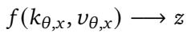
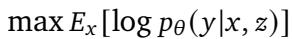
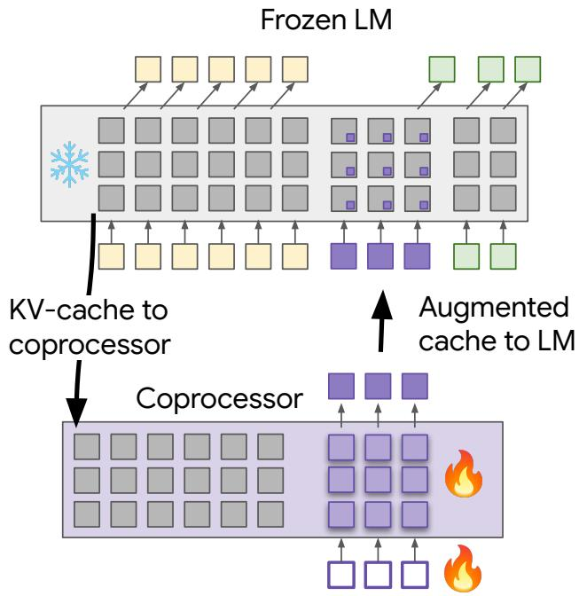
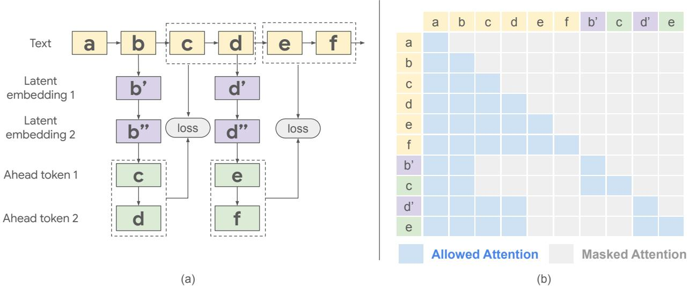
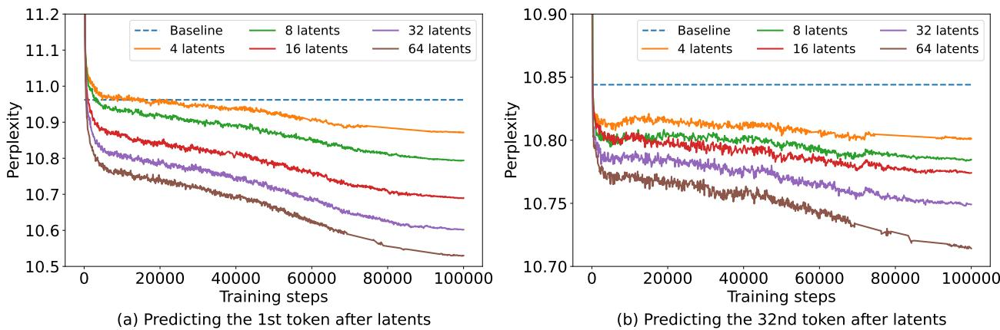

[← 返回 README](../README.md)

## 📌 预览
方法节拆解 problem statement、cache-level coprocessor、multi-position augmentation 与 ahead-token training。

---

# 2. Methodology

We enhance a frozen LLM by training a coprocessor that inputs a key-value (kv) cache, and augments it with a set of soft tokens. This section details the architecture and training process of our approach.

> 💡 **Section 概览**: 方法有三层：先形式化目标，再定义 coprocessor 架构，最后说明 multi-position/ahead-token 预训练。数据流始终是 input text -> frozen LLM cache -> coprocessor latent -> augmented cache -> frozen LLM decoding。

# 2.1. Problem statement

Given an input $x$ and a desired target output $y$ , and a pretrained, frozen LLM parameterized by $\theta$ , we seek to learn a coprocessor, denoted by $f$ . This coprocessor takes the kv-cache $( k _ { \theta , x } , \nu _ { \theta , x } )$ generated by the frozen LLM when processing the input $x$ as input, and outputs a sequence of latent representations $\mathfrak { z }$ :

*Equation 1: Display equation rendered from MinerU extraction.*

> 💡 **Equation 1 批读**: 这个式子只定义 coprocessor 的接口：输入 frozen LLM 在 $x$ 上产生的 key/value cache，输出 latent $z$。重点不是压缩 cache，而是为后续 decoding 额外提供可 attend 的 latent memory。

The objective of learning $f$ is to produce latent embeddings $\mathfrak { z }$ that, when combined with the input $x$ , improve the frozen LLM’s ability to generate the correct target $y$ . Specifically, we aim to maximize the expected log-likelihood of the target $y$ given the input $x$ and the learned latent embeddings $\mathfrak { z }$ , as predicted by the frozen LLM:

*Equation 2: Display equation rendered from MinerU extraction.*

> 💡 **Equation 2 批读**: 训练目标仍是标准 language modeling log-likelihood，decoder $p_\theta$ 冻结，只有 $f$ 学会生成让 $y$ 更容易预测的 latent。这避免了 RL/reward design，但也意味着 latent 的监督来自 next-token prediction，而不是显式 reasoning correctness。

# 2.2. Model architecture

Our proposed architecture enhances a frozen, pretrained LLM with a dedicated coprocessor module operating on the kv-cache. As illustrated in Figure 1, the interaction between these components unfolds in three stages:

• KV-cache Generation: The input sequence, $x$ , is first processed by the frozen LLM to generate its corresponding kv-cache $( k _ { \theta , x } , \nu _ { \theta , x } )$ . This cache encapsulates the LLM’s internal representations of the input. Crucially, the LLM’s weights remain frozen throughout the entire process.

Figure 1 | Overview of the proposed architecture. The input sequence is processed by a frozen LLM, generating a kv-cache. This cache is then passed to a coprocessor, along with trainable soft tokens. The coprocessor outputs latent embeddings which are used to augment the original kv-cache before being fed back into the LLM for output generation.

> 💡 **Figure 1 批读**: 图里最关键的是环路：LLM 先产生 kv-cache，coprocessor 读 cache + trainable soft tokens，输出 latent embeddings，再把 latent 追加回原 cache。这个 latent 不是插入文本序列，而是直接扩展 decoder 可见的内部上下文。

• Augmentation: The kv-cache is then passed to the coprocessor module, which adopts the same model architecture as the pretrained LLM. The coprocessor also receives a sequence of distinct extra soft tokens with trainable embeddings. These tokens do not correspond to actual words or sub-words but serve as abstract prompts for the coprocessor. The coprocessor ingests the kv-cache and these tokens to produce a sequence of latent embeddings, $\mathfrak { z }$ .

> 💡 **软 token 角色**: 这些 trainable soft tokens 像 coprocessor 的查询槽位，决定它从 kv-cache 中抽取多少个 latent。它们不对应词表，因此不会带来自然语言可读性，但能承载连续空间计算。

• LLM Generation with Augmented Context: Finally, $\mathfrak { z }$ is appended to the original kv-cache. This augmented cache is then fed back into the frozen LLM, providing it with enriched contextual information derived from the coprocessor. The LLM then proceeds to generate the output sequence, $y$, conditioned on both the original input $x$ and the coprocessor’s output $\mathfrak { z }$ . This allows the LLM to leverage the coprocessor’s latent inferences without requiring it to explicitly verbalize intermediate steps.

Training focuses solely on optimizing the coprocessor and trainable embeddings’ weights. The coprocessor shares the same model architecture as the pretrained LLM, and its weights are initialized with the pretrained weights of the LLM. The loss is calculated on the final output $y$, and backpropagation is used to update only the coprocessor’s parameters. This targeted training approach allows for efficient fine-tuning without altering the pretrained LLM. In practice, the coprocessor’s augmentation can potentially be performed offline and asynchronously, in parallel with the LLM’s decoding process. This could enable continuous refinement of the LLM’s contextual memory, leading to improved efficiency and faster response times.

# 2.3. Pretraining setup

We employ a pretraining strategy designed to encourage the coprocessor to learn augmentations that will be useful for predicting larger segments of text beyond the next token after the augmentation.

Figure 2 | Our coprocessor training framework. (a) Illustration of multi-position augmentation and ahead token prediction. For each selected augmentation position, latent embeddings are generated by the coprocessor and inserted after the corresponding token’s embedding. The target tokens for prediction ("ahead tokens") are then appended. A causal mask is applied to all sequences following these insertion points. (b) Structure of the modified input and attention mask for model training. We show an example of 1 latent embedding and 1 ahead token here for simplicity.

> 💡 **Figure 2 批读**: 训练不是只在序列末尾加一次 latent，而是在一个长序列里随机选多个 augmentation positions。每个位置只看它之前的原文 token，预测若干 ahead tokens；这样一个 batch 内能并行产生多个训练信号。

This strategy involves generating augmentations for multiple randomly selected positions and training the coprocessor to predict many tokens ahead.

Instead of training on a single split of a sequence into input $x$ and target $y$ (which limits scalability), we augment at multiple points within each sequence. As shown in Figure 2 (a), given an input text sequence (e.g., "a b c d e f "), we randomly select a subset of positions (e.g., "b" and "d"). For each selected position, the coprocessor generates a configurable number of latent embeddings (e.g., b’, b” and $\mathrm { d } '$ , $\vec { \mathrm { d } } ^ { \prime \prime }$ in the figure, where the number of latent embeddings is a hyperparameter $N _ { L }$ ) in one transformer forward call. The training objective is to predict a number of tokens (another hyperparameter $N _ { A }$ ) beyond the placement of the augmentation, in a teacher-forcing way. For instance, if "b" is chosen, and we are predicting two tokens ahead, the coprocessor uses the generated latent embeddings $( \boldsymbol { \mathrm { b } } ^ { \prime } , \boldsymbol { \mathrm { b } } ^ { \prime \prime } )$ and the kv-cache of the preceding text "a" and "b" to predict "c" and "d". This process can be viewed as a form of latent space interpolation: the coprocessor learns to bridge the gap between the known preceding context ("a", "b") and the future context $( " \mathrm { c } " , " \mathrm { d } " )$ by generating meaningful latent representations (b’, b”). Similarly, if "d" is chosen, the targets would be "e" and "f ", based on $\mathrm { d } '$ , $\vec { \mathrm { { d } } ^ { \prime \prime } }$ and the preceding context "a b c d". This approach is similar to the parallel decoding introduced in Quiet-Star (Zelikman et al., 2024), but since we generate latent embeddings instead of thoughts in token space, our approach has the advantages of fully differentiability while keeping the LLM frozen. Furthermore, because the base LLM remains frozen, the coprocessor can be called asynchronously and its computations can potentially be performed in parallel with the LLM’s decoding operation, and there is no need to insert between every pair of consecutive tokens.

> 💡 **机制拆解**: “latent interpolation” 的含义是：latent 需要补足当前位置到未来 token 之间的信息缺口。它不是复述未来文本，而是在连续表示里给 frozen decoder 一个更容易预测未来的中间状态。

We implement an efficient training framework by modifying the input, attention mask, position index, and target, to enable training everything together in one forward pass. Figure 2(b) illustrates how we modify the input and attention mask to enable training on multiple positions. Instead of sequentially processing each augmentation position in multiple decoder forward calls, we construct a single, extended input sequence and corresponding attention mask. This allows us to compute the loss from all selected augmentation points in parallel. For each selected augmentation position, we insert the generated latent embeddings after the corresponding token’s embedding in the input sequence. The ahead tokens for that position are then appended after the latent embeddings. This creates a concatenated input sequence containing the original text followed by multiple groups of latent embeddings and their corresponding ahead tokens. The attention mask is constructed to ensure correct causal attention. The original tokens attend to all preceding original tokens, as usual. Crucially, the latent embeddings and their corresponding ahead tokens only attend to the original tokens preceding their insertion point. They are masked from attending to any subsequent original tokens, other latent embeddings, or other ahead tokens as shown in Figure 2(b). The resulting output is then used to calculate the loss and train the coprocessor.

> 💡 **训练细节**: 这个 mask 防止信息泄漏。latent 和 ahead tokens 只能 attend 到插入点之前的原文，不能看后面的原文或其他 augmentation 组；否则 perplexity 降低可能只是偷看答案。

Figure 3 | Validation perplexity of the baseline frozen Gemma-2 2B model and augmented models with varying numbers of latents (8, 16, 32, 64), when predicting the 1st and 32nd tokens following latent augmentation. Lower perplexity indicates better performance.

> 💡 **Figure 3 批读**: 这里验证训练目标是否有效：latent 数越多，1st token 和 32nd token 的 perplexity 都更低。尤其 32nd token 仍受益，支持作者的异步/离线设想：一次 cache augmentation 的收益可以延续到多个后续 token。

Rather than capturing different aspects of a single token’s context, these embeddings are trained to generate information useful for predicting future tokens, effectively enabling the model to perform a form of "latent thinking" before making predictions. This contrasts with standard next-token prediction and allows the coprocessor to learn more generalizable representations. By learning to anticipate future tokens in this manner, the coprocessor develops a stronger understanding of sequential dependencies within text, which proves valuable in downstream tasks.

---

## 🔖 Section 总结

> 💡 **Section 小结**:
> - 输入: frozen Gemma-2 2B 的 kv-cache。
> - 中间表示: coprocessor 生成的 $N_L$ 个 latent embeddings。
> - 训练信号: 多位置、16 ahead tokens 的 LM loss。
> - 关键风险: latent 是否表示“推理”不可直接观察，证据主要来自 perplexity 与任务准确率。
