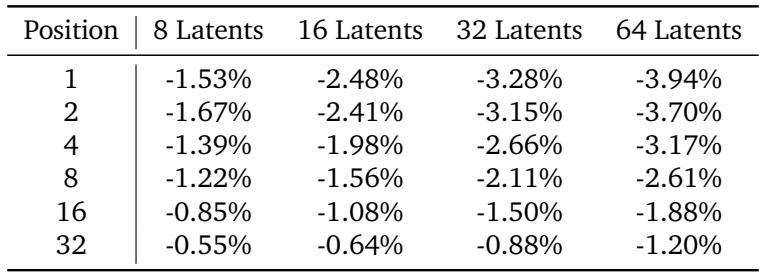
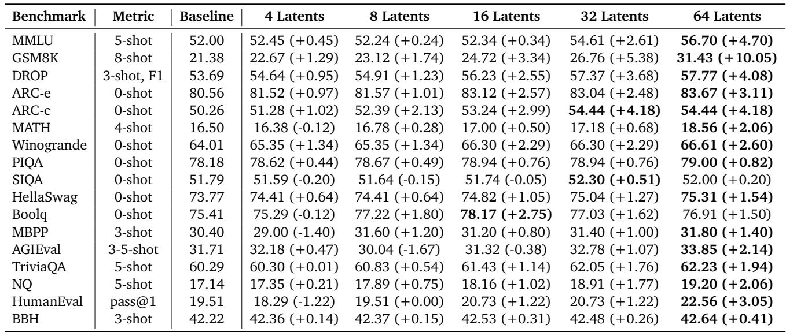
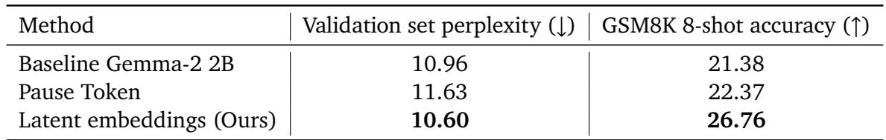
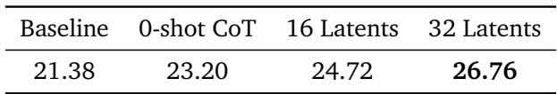
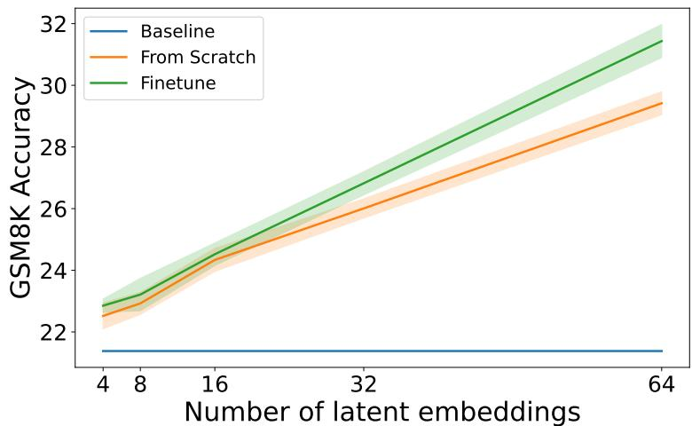
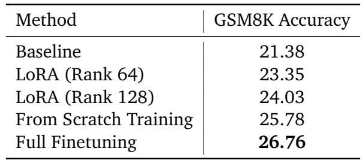
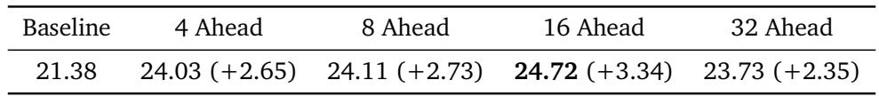

[← 返回 README](../README.md)

## 📌 预览
实验节验证 perplexity、公共 benchmark、Pause Token/CoT/LoRA/scratch 等消融，重点看 latent 数和收益关系。

---

# 3. Experiments

We validate our approach using the frozen Gemma-2 2B model. Our augmented Gemma-2 models, with only the coprocessor being trained and the decoder-only LLM kept frozen, are trained on the same 2 trillion token, primarily-English dataset used for Gemma-2 pretraining (Team-Gemma et al., 2024), following the setup described in Section 2.2. This dataset includes a variety of sources, such as web documents, code, and scientific articles. We trained the model for 100,000 steps using a batch size of 1024, packed sequences of length 2048, 16 ahead tokens $\left( N _ { A } \right)$ , and 128 randomly sampled augmentation positions (“traces”) for all training experiments. Importantly, no task-specific training is performed for any of the experiments; all training is done on the pretraining dataset.

> 💡 **实验边界**: 所有主实验固定 base decoder 为 Gemma-2 2B，并在同类预训练数据上训练 coprocessor 100k steps。这里不是 task finetuning，因此 benchmark 提升更能说明 latent cache augmentation 的通用性。

# 3.1. Perplexity Evaluation

Our augmented Gemma model is able to achieve lower perplexity on the validation dataset compared to the pretrained Gemma model on many tokens ahead, even beyond the ahead token $N _ { A }$ we defined during training. We evaluate this using a proprietary validation dataset (Same as the one used in

Gemma (Team-Gemma et al., 2024)) and evaluate the effect of augmenting the frozen Gemma-2 2B LLM’s kv-cache on future token prediction. For each sequence in the validation set, we generate $N _ { L }$ latent embeddings after each token using our coprocessor. These embeddings are then used to augment the cache at each token position. We then measure the model’s ability to predict the $n$ -th future token. Specifically, the "1st token" perplexity measures the model’s performance predicting the token immediately following the inserted latent embeddings. The "32nd token" perplexity measures the model’s performance predicting the token 32 positions ahead, given the context preceding the latent embeddings, the embeddings themselves, and the following 31 tokens. This demonstrates that even though we train with $N _ { A } = 1 6$ , the benefits of cache augmentation extend beyond this range, improving predictions even at position 32. Figure 3 presents perplexity curves during training for the baseline frozen Gemma-2 2B model and our augmented models using $N _ { L } { = } 8$ , 16, 32, and 64 latent embeddings. Across all latent sizes, our approach consistently reduces perplexity, with the improvement scaling with the number of latent embeddings. This demonstrates that augmenting the cache with the coprocessor improves both short-range and longer-range prediction accuracy.

Table 1 quantifies the perplexity reduction achieved by our cache augmentation approach. The consistent reduction, generally correlating with the number of latents, confirms that the benefit of our method extends to multiple subsequent token predictions, suggesting improved internal representations within the decoder, leading to more accurate and coherent generation.

*Table 1: MinerU extracted table image.*

Table 1 | Relative perplexity reduction $( \mathrm { i n } ~ \% )$ ) achieved by augmented Gemma-2 2B models compared to the baseline, for various numbers of latents and prediction positions following latent augmentation. "Position" indicates the token position relative to the augmentation point (e.g., Position 1 is the immediately following token).

> 💡 **Table 1 批读**: perplexity 降幅随 latent 数增加而更明显，且从 position 1 到 position 32 都保留正收益。64 latents 在 position 1 降 3.94%，position 32 仍降 1.20%，说明 latent 不是只帮下一个 token。

# 3.2. Public Benchmark Evaluation

We evaluated cache augmentation on a range of public benchmarks spanning natural language understanding and reasoning tasks (Table 2). In this setting, we only call the coprocessor once, at the end of the prompt. Our method consistently improves performance compared to the baseline frozen Gemma-2 2B model, with particularly substantial gains on reasoning-intensive benchmarks. Several tasks, including MMLU, GSM8K, TriviaQA, NQ, and MATH, exhibit a strong correlation between the number of latent embeddings and performance improvement. For example, on GSM8K, accuracy steadily climbs from a $+ 1 . 2 9 \%$ gain with 4 latent embeddings to a notable $+ 1 0 . 0 5 \%$ with 64. Similarly, MATH improves from $- 0 . 1 2 \%$ with 4 to $+ 2 . 0 6 \%$ with 64, and MMLU shows a jump from $+ 0 . 4 5 \%$ with 4 to $+ 4 . 7 0 \%$ with 64. This trend suggests that for certain challenging reasoning tasks, providing more latent embeddings allows the model to perform more extensive “thinking” in the latent space, significantly enhancing its reasoning capabilities.

Other reasoning tasks, including ARC-e/c, Winogrande, and Boolq, also show improvements with increasing latent counts. While some tasks, such as AGIEval, BBH, and HumanEval, show less pronounced improvements or occasional performance dips with higher latent embedding counts, our method still frequently provides a benefit. This broad improvement across diverse benchmarks

*Table 2: MinerU extracted table image.*

Table 2 | Performance of baseline and augmented models across various benchmarks. Results are shown for the baseline (frozen Gemma-2 2B pretrained model) and the model augmented with a learned coprocessor using 4, 8, 16, 32, and 64 latent embeddings, respectively. Results are reported for zero/few-shot settings as indicated in the “Metric” column. Results are accuracy $\left( \mathrm { i n } \ \% \right)$ ) if not specified in the Metric column. Improvements over the baseline are shown in parentheses. In this setting, the coprocessor is called once, at the end of the prompt.

> 💡 **Table 2 批读**: GSM8K 从 21.38 提到 31.43，MMLU 从 52.00 到 56.70，DROP/ARC/MATH 也多为正向。收益最大集中在 reasoning-intensive 任务；AGIEval、BBH、HumanEval 有波动，说明 latent 数增多不是全任务单调万能。

underscores the effectiveness and general applicability of cache augmentation for enhancing frozen language models.

We further provide analysis in the appendix, showing that our method’s performance scales with increasing training data (Section A.1) and that it effectively adapts to downstream tasks (Section A.2).

# 3.3. Comparison with other baselines and variations

# 3.3.1. Pause Token

We compare our approach with a closely related baseline: the Pause Token method (Goyal et al., 2023). Pause Token introduces trainable embeddings inserted between the input $( x )$ and output $( y )$ sequences, encouraging the LLM to perform latent "thinking" before generating the output. The crucial distinction between our approach and Pause Token lies in how these latent embeddings are generated. While Pause Token utilizes fixed and pretrained embeddings that do not condition on the input $x$ , our method employs a coprocessor that generates context-dependent, dynamic embeddings based on the input. This allows our approach to tailor the latent representations to the specific input, potentially leading to more effective reasoning.

> 💡 **baseline 差异**: Pause Token 的 embedding 是固定、非输入条件化；DCA 的 latent 是 coprocessor 基于当前 kv-cache 动态生成。这解释了为什么同样是 32 embeddings，DCA 比 Pause Token 在 perplexity 和 GSM8K 上更强。

Table 3 directly compares the performance of the baseline Gemma-2 2B model against both Pause Token and our approach, with the latter two using 32 embeddings. Notably, the Pause Token model was trained using the same training data and under the same experimental setup as our method. On the validation set, our method achieves a perplexity of 10.60 on the first token prediction, significantly lower than both the baseline (10.96) and Pause Token (11.63). Furthermore, our method achieves an accuracy of $2 6 . 7 6 \%$ on the GSM8K dataset, outperforming both the baseline $( 2 1 . 3 8 \% )$ and Pause Token $( 2 2 . 3 7 \% )$ . These improvements underscore the effectiveness of our dynamic, contextuallyinformed embeddings, which provide a richer representation compared to the fixed embeddings in

Table 3 | Comparison between the baseline Gemma-2 2B model, the Pause Token method (Goyal et al., 2023) (using 32 embeddings), and our approach (also using 32 embeddings). Lower perplexity indicates better next token prediction. Higher accuracy indicates better performance on GSM8K.

> 💡 **Table 3 批读**: Pause Token 让 validation perplexity 变差到 11.63，而 DCA 降到 10.60；GSM8K 从 21.38 到 26.76。这张表支撑“content-conditioned latent > fixed latent”的主张。

*Table 3: MinerU extracted table image.*

*Table 4: MinerU extracted table image.*

Table 4 | Accuracy on GSM8K 8-shot for the baseline Gemma-2 2B model, zero-shot Chain-of-Thought (CoT) prompting, and our approach with 16 and 32 latent embeddings.

> 💡 **Table 4 批读**: 0-shot CoT 提到 23.20，但 16/32 latent 分别到 24.72/26.76。注意这里比较的是准确率，不含生成 token 延迟；但它说明 latent cache route 可以在不显式生成 CoT 的情况下超过简单 CoT prompt。

Pause Token, leading to better next token prediction and improved performance on reasoning tasks.

# 3.3.2. Zero-shot CoT

Our technique can be viewed as a form of latent Chain-of-Thought (CoT) prompting. Therefore, we compare our approach to standard zero-shot CoT (Kojima et al., 2022), which involves appending “Let’s think step by step” to the input prompt. While zero-shot CoT can be effective, it relies on the LLM to generate intermediate reasoning steps token by token, which can be computationally expensive during inference. Our method, on the other hand, generates latent embeddings in a single forward pass, potentially offering a more efficient approach to guiding reasoning.

Table 4 presents the accuracy on GSM8K for the baseline Gemma-2 2B model, zero-shot CoT, and our approach with 16 and 32 latent embeddings. Our method shows clear improvements. With 16 latent embeddings, we achieve an accuracy of $2 4 . 7 2 \%$ , surpassing both the baseline $( 2 1 . 3 8 \% )$ and zero-shot CoT $( 2 3 . 2 0 \% )$ . Performance further improves to $2 6 . 7 6 \%$ with 32 embeddings. This suggests that our learned, context-dependent latent embeddings provide a more efficient and effective mechanism for guiding reasoning compared to the generic prompt and sequential token generation of zero-shot CoT.

# 3.3.3. Alternative Coprocessor Configurations

We explored alternative configurations for our coprocessor to assess the importance of design choices. Our default setup involves finetuning the pretrained LLM to serve as the coprocessor (i.e., the coprocessor’s weights are initialized with the pretrained weights of the LLM), which serves as the primary comparison point for the following experiments.

Training the Coprocessor from scratch: We also investigated training the coprocessor from scratch– randomly initializing its weights rather than finetuning from the pretrained weights of Gemma-2 2B. While training from scratch improves performance on all downstream tasks compared to the baseline, finetuning from pretrained weights yields even better results. This suggests that the coprocessor benefits from the foundational knowledge encoded in the pretrained LLM. Figure 4 illustrates this improvement in GSM8K accuracy as the number of latent embeddings increases, with the finetuned model consistently outperforming the model trained from scratch. Results of other benchmarks can be found in Table 7 in the Appendix Section A.3.

Figure 4 | Finetuning the coprocessor from Gemma-2 2B pretrained weights significantly improves GSM8K accuracy compared to training from scratch. Lines represent the mean and shaded areas represent the $9 5 \%$ confidence interval, both estimated from the last 5 checkpoints.

> 💡 **Figure 4 批读**: 从 pretrained LLM 初始化 coprocessor 明显好于 scratch，说明 coprocessor 不是任意网络都能读懂 kv-cache；它需要继承与 base LLM 相近的表示几何。

LoRA Finetuning the pretrained LLM as the Coprocessor: In addition to full finetuning the pretrained LLM and from-scratch training, we explored the efficacy of Low-Rank Adaptation (LoRA) (Hu et al., 2021) for tuning the coprocessor from the pretrained LLM’s weights. LoRA freezes the pretrained model weights and introduces trainable rank-decomposition matrices, significantly reducing the number of trainable parameters. This approach offers substantial memory benefits, as only the relatively small LoRA weights need to be stored in addition to the base model. We experimented with LoRA using ranks of 64 and 128, comparing their performance on GSM8K to the baseline Gemma-2 2B model, the from-scratch training approach discussed above, and our fully finetuned coprocessor. As shown in Table 5, which presents results using 32 latent embeddings for all methods, LoRA finetuning achieves reasonable improvements over the baseline, demonstrating that even a parameter-efficient approach can effectively train the coprocessor for improved reasoning. Specifically, LoRA with rank 64 achieved an accuracy of $2 3 . 3 5 \%$ , while LoRA with rank 128 reached $2 4 . 0 3 \%$ . These results fall between the baseline performance $( 2 1 . 3 8 \% )$ and the performance achieved by from-scratch training $( 2 5 . 7 8 \% )$ , indicating that while the LoRA-tuned coprocessor benefits from the pretrained weights, generating high-quality latent embeddings for effective reasoning appears to require more substantial parameter updates than those provided by parameter-efficient methods like LoRA. While these results are not as strong as the $2 6 . 7 6 \%$ achieved by full finetuning, they represent a notable improvement over the baseline and highlight the potential of LoRA for efficient training/inference of our coprocessor, especially in memory-constrained environments.

*Table 5: MinerU extracted table image.*

Table 5 | GSM8K accuracy comparison of different finetuning methods for the coprocessor, all using 32 latent embeddings. LoRA offers a memory-efficient alternative to full finetuning, achieving reasonable performance gains.

> 💡 **Table 5 批读**: LoRA rank 128 有 24.03，但 full finetuning 到 26.76；参数高效训练可行但不足。对后续工作来说，这是压缩部署和效果之间的明确 trade-off。

*Table 6: MinerU extracted table image.*

Table 6 | GSM8K accuracy for varying numbers of ahead tokens during coprocessor training. 16 ahead tokens achieves the highest accuracy $( 2 4 . 7 2 \%$ , $+ 3 . 3 4 \%$ over the baseline of $2 1 . 3 8 \%$ ). 16 latent embeddings are used for all these experiments.

> 💡 **Table 6 批读**: 16 ahead tokens 最优，32 ahead 反而下降。训练目标不是越远越好；过长 lookahead 会牺牲近端 token 建模，可能让 latent 难以被 decoder 立即利用。

Augmentation using Last Layer’s Activations: Instead of using the kv-cache as input to the coprocessor, we experimented with providing the last layer’s activations from the frozen LLM, concatenated with the soft token embeddings. This approach, using 32 latent embeddings, yielded a perplexity of 10.81 on the validation set and an accuracy of $2 3 . 2 0 \%$ on the GSM8K benchmark under the same training setup. Both metrics are notably worse than those achieved with kv-cache augmentation, which resulted in a perplexity of 10.69 and a GSM8K accuracy of $2 6 . 7 6 \%$ (also with 32 latent embeddings). We hypothesize that the last layer’s activations alone do not provide as rich a representation for the coprocessor as the information aggregated across multiple layers in the kv-cache, hindering both next-token prediction (reflected in the higher perplexity) and reasoning ability (reflected in the lower GSM8K accuracy).

> 💡 **消融解读**: last-layer activation 不如 kv-cache，说明“全层 key/value 记忆”比最终 hidden state 更适合 coprocessor 读取。kv-cache 保存了多层 attention 的可复用上下文，而最后一层更贴近当前 next-token 分布。

# 3.4. Impact of the number of ahead token in training

We investigated the impact of varying the number of ahead tokens—the number of future tokens the model is trained to predict—during coprocessor training. While larger lookahead improves perplexity on later tokens, it often leads to higher perplexity on earlier tokens. Though learning rate scaling might mitigate this, we empirically chose 16 ahead tokens for most experiments in this paper, given its strong performance on GSM8K, as shown in the Table 6.

---

## 🔖 Section 总结

> 💡 **Section 小结**:
> - 最强主结果: 64 latents 下 GSM8K +10.05、MMLU +4.70。
> - 关键证据链: perplexity 降低 -> benchmark 提升 -> Pause/CoT/LoRA/scratch 消融。
> - 剩余问题: 额外 coprocessor 训练成本、latents 数量带来的计算成本、以及 latent 可解释性仍未解决。
