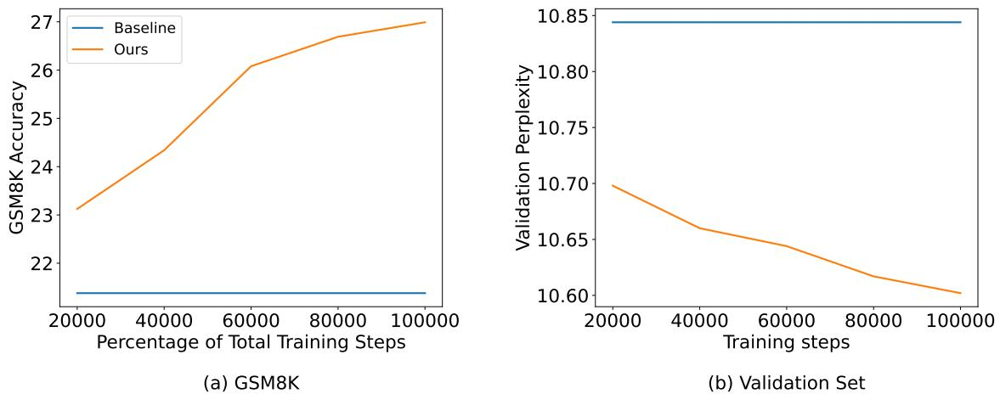
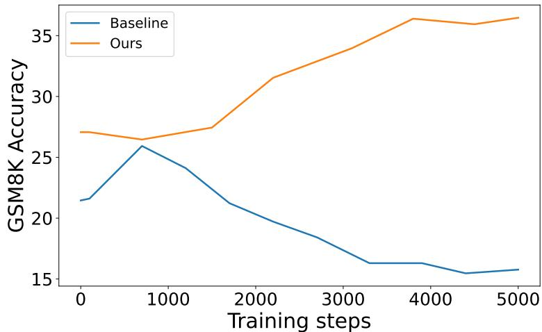

[← 返回 README](../README.md)

## 📌 预览
附录补充训练数据 scaling、下游 LoRA 适配和 scratch coprocessor 结果。

---

# References

J.-B. Alayrac, J. Donahue, P. Luc, A. Miech, I. Barr, Y. Hasson, K. Lenc, A. Mensch, K. Millican, M. Reynolds, et al. Flamingo: a visual language model for few-shot learning. Advances in Neural Information Processing Systems, 35:23716–23736, 2022.
A. Ansell, E. M. Ponti, J. Pfeiffer, S. Ruder, G. Glavaš, I. Vulić, and A. Korhonen. MAD-G: Multilingual adapter generation for efficient cross-lingual transfer. In Findings of the Association for Computational Linguistics: EMNLP 2021, pages 4762–4781, Punta Cana, Dominican Republic, Nov. 2021. Association for Computational Linguistics. doi: 10.18653/v1/2021.findings-emnlp.410. URL https://aclanthology.org/2021.findings-emnlp.410.
R. Bansal, B. Samanta, S. Dalmia, N. Gupta, S. Vashishth, S. Ganapathy, A. Bapna, P. Jain, and P. Talukdar. Llm augmented llms: Expanding capabilities through composition. arXiv preprint arXiv:2401.02412, 2024.
L. Bertinetto, J. F. Henriques, J. Valmadre, P. H. S. Torr, and A. Vedaldi. Learning feedforward one-shot learners. In Advances in Neural Information Processing Systems 29: Annual Conference on Neural Information Processing Systems 2016, December 5-10, 2016, Barcelona, Spain, pages 523–531, 2016. URL https://proceedings.neurips.cc/paper/2016/hash/ 839ab46820b524afda05122893c2fe8e-Abstract.html.
E. Biran, D. Gottesman, S. Yang, M. Geva, and A. Globerson. Hopping too late: Exploring the limitations of large language models on multi-hop queries. In Y. Al-Onaizan, M. Bansal, and Y.-N. Chen, editors, Proceedings of the 2024 Conference on Empirical Methods in Natural Language Processing, pages 14113–14130, Miami, Florida, USA, Nov. 2024. Association for Computational Linguistics. doi: 10.18653/v1/2024.emnlp-main.781.
T. Chen, M. Lučić, N. Houlsby, and S. Gelly. On self modulation for generative adversarial networks. In 7th International Conference on Learning Representations, ICLR 2019, New Orleans, LA, USA, May 6-9, 2019. OpenReview.net, 2019. URL https://openreview.net/forum?id $\cdot ^ { = }$ Hkl5aoR5tm.
X. Chen, X. Wang, S. Changpinyo, A. Piergiovanni, P. Padlewski, D. Salz, S. Goodman, A. Grycner, B. Mustafa, L. Beyer, et al. Pali: A jointly-scaled multilingual language-image model. arXiv preprint arXiv:2209.06794, 2022.
H. de Vries, F. Strub, J. Mary, H. Larochelle, O. Pietquin, and A. C. Courville. Modulating early visual processing by language. In Advances in Neural Information Processing Systems 30: Annual Conference on Neural Information Processing Systems 2017, December 4-9, 2017, Long Beach, CA, USA, pages 6594–6604, 2017. URL https://proceedings.neurips.cc/paper/2017/hash/ 6fab6e3aa34248ec1e34a4aeedecddc8-Abstract.html.
Y. Deng, Y. Choi, and S. Shieber. From explicit cot to implicit cot: Learning to internalize cot step by step. arXiv preprint arXiv:2405.14838, 2024.
D. Driess, F. Xia, M. S. Sajjadi, C. Lynch, A. Chowdhery, B. Ichter, A. Wahid, J. Tompson, Q. Vuong, T. Yu, et al. Palm-e: An embodied multimodal language model. arXiv preprint arXiv:2303.03378, 2023.
T. Ge, H. Jing, L. Wang, X. Wang, S.-Q. Chen, and F. Wei. In-context autoencoder for context compression in a large language model. In The Twelfth International Conference on Learning Representations(ICLR), 2024.
A. Goyal, A. Lamb, J. Hoffmann, S. Sodhani, S. Levine, Y. Bengio, and B. Schölkopf. Recurrent independent mechanisms. In 9th International Conference on Learning Representations, ICLR 2021, Virtual Event, Austria, May 3-7, 2021. OpenReview.net, 2021. URL https://openreview.net/ forum?id=mLcmdlEUxy-.
S. Goyal, Z. Ji, A. S. Rawat, A. K. Menon, S. Kumar, and V. Nagarajan. Think before you speak: Training language models with pause tokens. arXiv preprint arXiv:2310.02226, 2023.
D. Ha, A. M. Dai, and Q. V. Le. Hypernetworks. In 5th International Conference on Learning Representations, ICLR 2017, Toulon, France, April 24-26, 2017, Conference Track Proceedings. OpenReview.net, 2017. URL https://openreview.net/forum?id $\equiv$ rkpACe1lx.
S. Hao, S. Sukhbaatar, D. Su, X. Li, Z. Hu, J. Weston, and Y. Tian. Training large language models to reason in a continuous latent space, 2024.
Y. He, H. S. Zheng, Y. Tay, J. P. Gupta, Y. Du, V. Aribandi, Z. Zhao, Y. Li, Z. Chen, D. Metzler, H. Cheng, and E. H. Chi. Hyperprompt: Prompt-based task-conditioning of transformers. In International Conference on Machine Learning, ICML 2022, 17-23 July 2022, Baltimore, Maryland, USA, volume 162 of Proceedings of Machine Learning Research, pages 8678–8690. PMLR, 2022. URL https://proceedings.mlr.press/v162/he22f.html.
D. Hendrycks, C. Burns, S. Kadavath, A. Arora, S. Basart, E. Tang, D. Song, and J. Steinhardt. Measuring mathematical problem solving with the math dataset. NeurIPS, 2021.
M. D. Hoffman, D. Phan, D. Dohan, S. Douglas, T. A. Le, A. Parisi, P. Sountsov, C. Sutton, S. Vikram, and R. A Saurous. Training chain-of-thought via latent-variable inference. Advances in Neural Information Processing Systems, 36, 2024.
N. Houlsby, A. Giurgiu, S. Jastrzebski, B. Morrone, Q. de Laroussilhe, A. Gesmundo, M. Attariyan, and S. Gelly. Parameter-efficient transfer learning for NLP. In K. Chaudhuri and R. Salakhutdinov, editors, Proceedings of the 36th International Conference on Machine Learning, ICML 2019, 9-15 June 2019, Long Beach, California, USA, volume 97 of Proceedings of Machine Learning Research, pages 2790–2799. PMLR, 2019. URL http://proceedings.mlr.press/v97/houlsby19a.html.
E. J. Hu, Y. Shen, P. Wallis, Z. Allen-Zhu, Y. Li, S. Wang, L. Wang, and W. Chen. Lora: Low-rank adaptation of large language models. arXiv preprint arXiv:2106.09685, 2021.
T. Kojima, S. S. Gu, M. Reid, Y. Matsuo, and Y. Iwasawa. Large language models are zero-shot reasoners. Advances in neural information processing systems, 35:22199–22213, 2022.
B. Lester, R. Al-Rfou, and N. Constant. The power of scale for parameter-efficient prompt tuning. arXiv preprint arXiv:2104.08691, 2021.
X. L. Li and P. Liang. Prefix-tuning: Optimizing continuous prompts for generation. arXiv preprint arXiv:2101.00190, 2021.
Y. Li, B. Dong, F. Guerin, and C. Lin. Compressing context to enhance inference efficiency of large language models. In H. Bouamor, J. Pino, and K. Bali, editors, Proceedings of the 2023 Conference on Empirical Methods in Natural Language Processing, pages 6342–6353, Singapore, Dec. 2023. Association for Computational Linguistics. doi: 10.18653/v1/2023.emnlp-main.391.
H. Lightman, V. Kosaraju, Y. Burda, H. Edwards, B. Baker, T. Lee, J. Leike, J. Schulman, I. Sutskever, and K. Cobbe. Let’s verify step by step. arXiv preprint arXiv:2305.20050, 2023.
R. K. Mahabadi, S. Ruder, M. Dehghani, and J. Henderson. Parameter-efficient multi-task fine-tuning for transformers via shared hypernetworks. In Proceedings of the 59th Annual Meeting of the Association for Computational Linguistics and the 11th International Joint Conference on Natural Language Processing (Volume 1: Long Papers), pages 565–576, Online, Aug. 2021. Association for Computational Linguistics. doi: 10.18653/v1/2021.acl-long.47. URL https://aclanthology. org/2021.acl-long.47.
J. Mu, X. Li, and N. Goodman. Learning to compress prompts with gist tokens. Advances in Neural Information Processing Systems, 36, 2024.
E. Perez, F. Strub, H. de Vries, V. Dumoulin, and A. C. Courville. Film: Visual reasoning with a general conditioning layer. In Proceedings of the Thirty-Second AAAI Conference on Artificial Intelligence, (AAAI-18), the 30th Innovative Applications of Artificial Intelligence (IAAI-18), and the 8th AAAI Symposium on Educational Advances in Artificial Intelligence (EAAI-18), New Orleans, Louisiana, USA, February 2-7, 2018, pages 3942–3951. AAAI Press, 2018. URL https://www.aaai.org/ocs/ index.php/AAAI/AAAI18/paper/view/16528.

J. Pfau, W. Merrill, and S. R. Bowman. Let’s think dot by dot: Hidden computation in transformer language models. In First Conference on Language Modeling, 2024.

J. Pfeiffer, S. Ruder, I. Vulic, and E. M. Ponti. Modular deep learning. Transactions of Machine Learning Research, 2023, 2023. URL https://openreview.net/forum?id=z9EkXfvxta.

E. A. Platanios, M. Sachan, G. Neubig, and T. Mitchell. Contextual parameter generation for universal neural machine translation. In Proceedings of the 2018 Conference on Empirical Methods in Natural Language Processing, pages 425–435, Brussels, Belgium, Oct.-Nov. 2018. Association for Computational Linguistics. doi: 10.18653/v1/D18-1039. URL https://aclanthology.org/D18-1039.

E. M. Ponti, I. Vulić, R. Cotterell, M. Parovic, R. Reichart, and A. Korhonen. Parameter space factorization for zero-shot learning across tasks and languages. Transactions of the Association for Computational Linguistics, 9:410–428, 2021. doi: 10.1162/tacl_a_00374. URL https:// aclanthology.org/2021.tacl-1.25.

S. Rebuffi, H. Bilen, and A. Vedaldi. Learning multiple visual domains with residual adapters. In Advances in Neural Information Processing Systems 30: Annual Conference on Neural Information Processing Systems 2017, December 4-9, 2017, Long Beach, CA, USA, pages 506–516, 2017. URL https://proceedings.neurips.cc/paper/2017/hash/ e7b24b112a44fdd9ee93bdf998c6ca0e-Abstract.html.

S. Rebuffi, H. Bilen, and A. Vedaldi. Efficient parametrization of multi-domain deep neural networks. In 2018 IEEE Conference on Computer Vision and Pattern Recognition, CVPR 2018, Salt Lake City, UT, USA, June 18-22, 2018, pages 8119–8127. Computer Vision Foundation / IEEE Computer Society, 2018. doi: 10.1109/CVPR.2018.00847. URL http://openaccess.thecvf.com/content cvpr_2018/html/Rebuffi_Efficient_Parametrization_of_CVPR_2018_paper.html.

T. Schuster, A. Fisch, J. Gupta, M. Dehghani, D. Bahri, V. Tran, Y. Tay, and D. Metzler. Confident adaptive language modeling. Advances in Neural Information Processing Systems, 35:17456–17472, 2022.

Y. Shalev, A. Feder, and A. Goldstein. Distributional reasoning in llms: Parallel reasoning processes in multi-hop reasoning. arXiv preprint arXiv:2406.13858, 2024.

Team-Gemma, M. Riviere, S. Pathak, P. G. Sessa, C. Hardin, S. Bhupatiraju, L. Hussenot, T. Mesnard, B. Shahriari, A. Ramé, et al. Gemma 2: Improving open language models at a practical size. arXiv preprint arXiv:2408.00118, 2024.

A. Üstün, A. Bisazza, G. Bouma, and G. van Noord. UDapter: Language adaptation for truly Universal Dependency parsing. In Proceedings of the 2020 Conference on Empirical Methods in Natural Language Processing (EMNLP), pages 2302–2315, Online, Nov. 2020. Association for Computational Linguistics. doi: 10.18653/v1/2020.emnlp-main.180. URL https://aclanthology.org/2020. emnlp-main.180.

X. Wang and D. Zhou. Chain-of-thought reasoning without prompting. arXiv preprint arXiv:2402.10200, 2024.

X. Wang, J. Wei, D. Schuurmans, Q. Le, E. Chi, S. Narang, A. Chowdhery, and D. Zhou. Self-consistency improves chain of thought reasoning in language models. arXiv preprint arXiv:2203.11171, 2022.

J. Wei, X. Wang, D. Schuurmans, M. Bosma, F. Xia, E. Chi, Q. V. Le, D. Zhou, et al. Chain-of-thought prompting elicits reasoning in large language models. Advances in neural information processing systems, 35:24824–24837, 2022.

Y. Wu, Z. Sun, S. Li, S. Welleck, and Y. Yang. Inference scaling laws: An empirical analysis of computeoptimal inference for problem-solving with language models. arXiv preprint arXiv:2408.00724, 2024.
S. Yao, D. Yu, J. Zhao, I. Shafran, T. Griffiths, Y. Cao, and K. Narasimhan. Tree of thoughts: Deliberate problem solving with large language models. Advances in Neural Information Processing Systems, 36, 2024.
J. Yu, Z. Wang, V. Vasudevan, L. Yeung, M. Seyedhosseini, and Y. Wu. Coca: Contrastive captioners are image-text foundation models. arxiv 2022. arXiv preprint arXiv:2205.01917, 2022.
E. Zelikman, Y. Wu, J. Mu, and N. Goodman. Star: Bootstrapping reasoning with reasoning. Advances in Neural Information Processing Systems, 35:15476–15488, 2022.
E. Zelikman, G. Harik, Y. Shao, V. Jayasiri, N. Haber, and N. D. Goodman. Quiet-star: Language models can teach themselves to think before speaking. arXiv preprint arXiv:2403.09629, 2024.
D. Zhou, N. Schärli, L. Hou, J. Wei, N. Scales, X. Wang, D. Schuurmans, C. Cui, O. Bousquet, Q. V. Le, and E. H. Chi. Least-to-most prompting enables complex reasoning in large language models. In The Eleventh International Conference on Learning Representations, 2023.

# A. Appendix

# A.1. Scaling with Training Data

The scaling of performance with increasing training data is a crucial aspect of evaluating the effectiveness of our approach. Figure 5 demonstrates the impact of training duration on both GSM8K accuracy and validation perplexity for our method. The x-axis represents the total number of training steps for the coprocessor. The baseline performance, representing the frozen Gemma-2 2B model, is shown for reference at corresponding intervals along this axis. As shown, we observe a clear trend of improved performance for our method with increased training data (i.e., more tokens seen during training of the coprocessor). Specifically, our method ("Ours") demonstrates a clear benefit from increased training exposure, with GSM8K accuracy exhibiting a consistent upward trend and validation perplexity showing a decreasing trend. This indicates that the coprocessor learns to generate more useful latent embeddings and better integrate with the frozen LLM as it is exposed to more data, improving next token prediction. This trend highlights the importance of scaling with training data for our approach.

Figure 5 | Scaling of GSM8K accuracy and validation perplexity with increasing training steps for the coprocessor (using 32 latent embeddings). The baseline performance of the frozen Gemma-2 2B model is shown for reference.

> 💡 **Figure 5 批读**: 训练步数越多，GSM8K accuracy 上升、validation perplexity 下降，说明 coprocessor 不是短程 trick，而是能随着预训练暴露继续学习更好的 cache-to-latent 映射。

# A.2. Adaptation to Downstream Tasks

All experiments described thus far have focused on training the coprocessor using the pretraining dataset. To assess the adaptability of our approach to downstream tasks, we conducted experiments using a data mixture containing the training sets of the GSM8K and MATH (Hendrycks et al., 2021) datasets. We employed LoRA finetuning (with a rank of 128) on both the baseline model and our augmented model. For the baseline, LoRA was applied directly to the base LLM, while for our augmented model, LoRA was applied specifically to the coprocessor, leaving the base LLM frozen.

Figure 6 presents the results of this downstream adaptation. We observe a substantial improvement in performance for our augmented model compared to the baseline after LoRA finetuning. This improvement is likely attributable to the strong regularization imposed by keeping the base LLM frozen during coprocessor training. This freezing prevents overfitting to the relatively small downstream datasets, allowing the coprocessor to effectively learn task-specific reasoning patterns without disrupting the general knowledge encoded in the pretrained LLM. The baseline model, with LoRA applied directly to the LLM, likely suffers from overfitting to the downstream data, limiting its performance gains. These results demonstrate the effectiveness of our approach in adapting to downstream tasks while maintaining the robustness of the pretrained LLM.

Figure 6 | Accuracy on GSM8K’s test set after LoRA finetuning. Our augmented model shows a significant improvement compared to the baseline.

> 💡 **Figure 6 批读**: 下游 LoRA 只调 coprocessor、冻结 base LLM，反而可能比直接 LoRA base 更稳。这说明 coprocessor 可作为任务适配层，减少对 base knowledge 的破坏。

# A.3. Training Coprocessor from Scratch

We observed performance gains across most benchmarks when training the coprocessor from scratch (with randomly initialized weights), but finetuning from the pretrained LLM consistently yielded better results.

*Table 1: MinerU extracted table image.*

Table 7 | Performance of baseline and augmented models across various benchmarks with coprocessor training from scratch. Check Table 2 for more detailed description.

> 💡 **Table 7 批读**: scratch coprocessor 仍然能超过 baseline，但整体弱于 pretrained initialization。它说明 latent processor 不是纯靠参数量就能工作，而是需要和 base LLM 的表示空间对齐。

---

## 🔖 Section 总结

> 💡 **Section 小结**:
> - 训练数据 scaling、下游适配、scratch coprocessor 都支持主文结论。
> - scratch 也有效但弱于 pretrained 初始化，说明表示空间兼容性是关键。
> - 后续可追问：是否能用更小、更专门的 coprocessor 达到类似效果。
