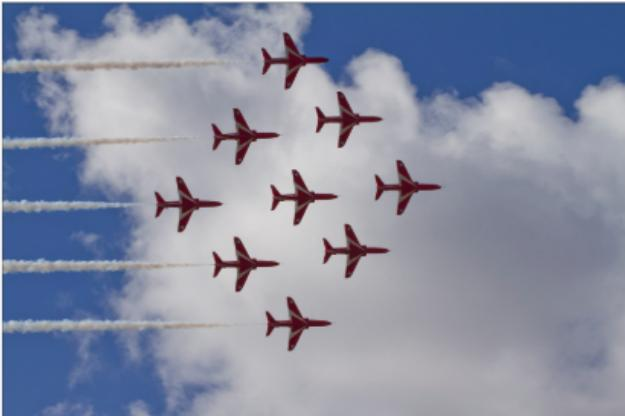
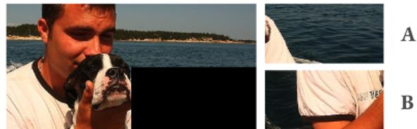
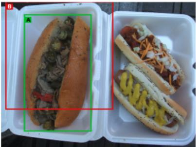
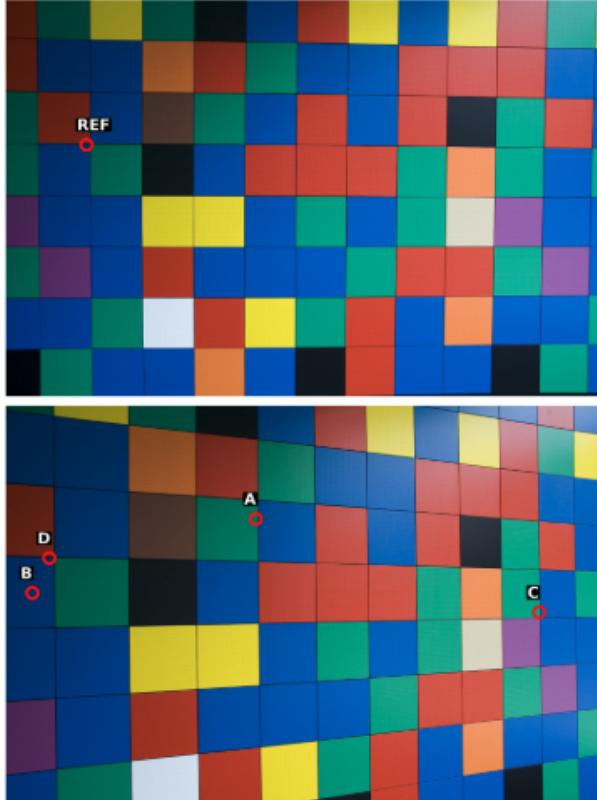
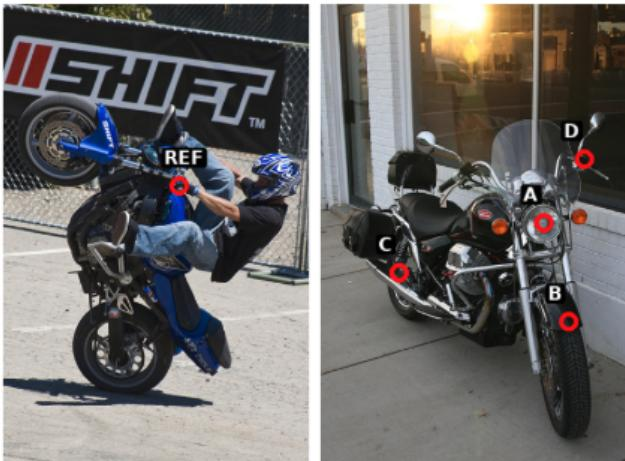
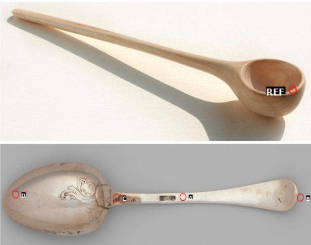
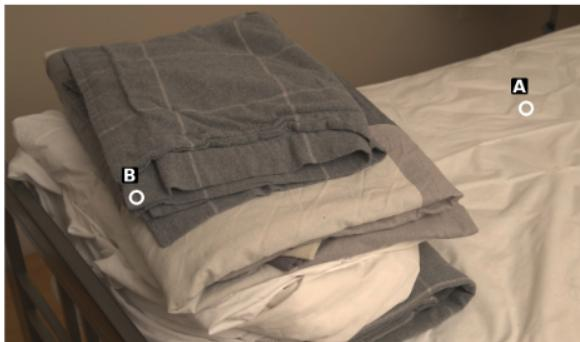
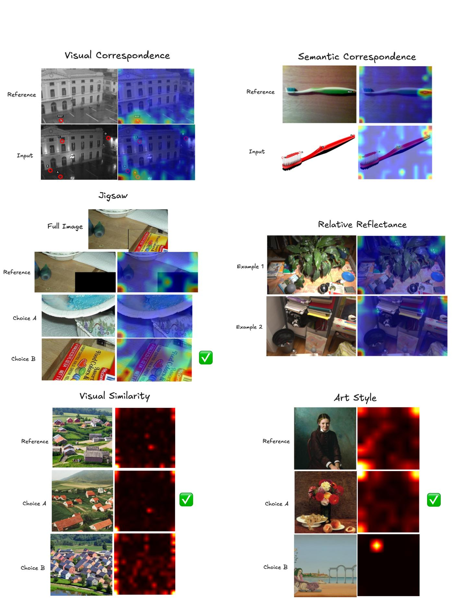

# Latent Implicit Visual Reasoning

Kelvin Li1∗ Chuyi Shang1∗ Leonid Karlinsky2 Rogerio Feris3 Trevor Darrell1 Roei Herzig1,3 1University of California, Berkeley 2 Xero 3MIT-IBM Watson AI Lab

# Abstract

While Large Multimodal Models (LMMs) have made significant progress, they remain largely text-centric, relying on language as their core reasoning modality. As a result, they are limited in their ability to handle reasoning tasks that are predominantly visual. Recent approaches have sought to address this by supervising intermediate visual steps with helper images, depth maps, or image crops. However, these strategies impose restrictive priors on what “useful” visual abstractions look like, add heavy annotation costs, and struggle to generalize across tasks. To address this critical limitation, we propose a task-agnostic mechanism that trains LMMs to discover and use visual reasoning tokens without explicit supervision. These tokens attend globally and re-encode the image in a task-adaptive way, enabling the model to extract relevant visual information without hand-crafted supervision. Our approach outperforms direct fine-tuning and achieves state-of-the-art results on a diverse range of vision-centric tasks – including those where intermediate abstractions are hard to specify – while also generalizing to multi-task instruction tuning.

# 1. Introduction

In recent years, Large Multimodal Models (LMMs) have demonstrated great progress in visual understanding. However, they still struggle with vision-centric tasks that require heavy visual processing. This limitation stems from several factors. Firstly, most modern LMMs follow a LLaVA [20] style architecture, where visual inputs are projected into a language model that is trained to output text only. This introduces significant language bias, forcing the LMM to reason about visual information through text alone. Textbased representations may inherently lack the expressivity required to form the sophisticated visual abstractions needed for complex reasoning tasks. For example, humans can visualize objects from different angles, solve jigsaw puzzles, or identify visual patterns through mental imagery alone, without relying on language. Attempting to solve such tasks using language alone, however, may be extremely difficult. Moreover, recent LMM progress has largely focused on tasks requiring limited visual reasoning, such as document understanding or mathematical problem solving, where most of the reasoning occurs in the text space after initial visual information extraction.

Given these limitations, many works have attempted to train LMMs to be more “visual” through explicit supervision. However, this approach faces several challenges. First, it requires large amounts of task-specific supervised data, which both incurs substantial annotation costs and embeds human biases about what constitutes “useful” visual reasoning. For example, models are often trained to predict intermediate visual steps, such as bounding boxes and image crops, even though the intermediate steps that are intuitive for human reasoning may not be the most effective for the model to learn. Second, such supervision is difficult to specify for tasks that require complex or abstract visual structure, and the resulting models often generalize poorly beyond the supervision regimes they were designed for. As a result, this data-dependent approach does not scale well to a diverse range of vision-centric reasoning tasks.

Consider the task in Figure 1, where the model is given a reference image and must select the most visually similar image from a set of choices. Describing the relationship between the sets of images using only text can be challenging and ambiguous. Training the model with explicit supervision is difficult as well since it is not clear what intermediate visual representations would be helpful to provide to the model. Even if we could identify useful intermediate steps, we would need to create large amounts of task-specific data, which is impractical to scale across different tasks.

Our proposed approach, Latent Implicit Visual Reasoning (LIVR), enables models to autonomously discover useful intermediate visual representations without explicit supervision. LIVR augments the LMM with latent tokens that are learned implicitly through a novel visual bottlenecking approach, requiring no task-specific supervision.

To summarize, our main contributions are as follows: (i) We introduce LIVR, a new method for visual reasoning that allows the model to implicitly learn useful visual information through latent tokens, without the need for additional data or explicit supervision. (ii) We show that our approach outperforms direct supervised fine-tuning and achieves state-of-the-art results on multiple single-task finetuning setups. (iii) We demonstrate strong generalization capabilities by outperforming supervised fine-tuning on a general, multi-task fine-tuning setup.

Figure 1. The model is asked to determine which image option is most similar to the reference image. Standard LMMs can only output text, which cannot capture all visual information and may introduce ambiguity. While methods using explicit supervision can train models to output intermediate reasoning steps, these approaches may fail when the reasoning steps themselves are unclear. Our approach allows the model to learn useful representations implicitly. Visualizing the attention maps of the latent tokens shows that the model has learned to recognize underlying visual structures relevant to answering the question that would have been hard for humans to design supervision for.

# 2. Related Work

Text-Based Visual Reasoning. Chain-of-thought (CoT) prompting has shown that explicitly generating intermediate text steps can substantially improve LLM performance on complex reasoning tasks [28, 33, 37]. Recent works extend CoT into the multimodal regime by training the model to describe its visual understanding in text before producing an answer [30, 34, 36]. For example, LLaVA-CoT finetunes an LMM to generate structured textual rationales that describe the image before concluding with an answer [34]. More recent works like Visual-RFT, Vision-R1, and R1-VL use RL-based post-training to encourage long, step-by-step textual explanations to help answer questions [13, 21, 38]. In all of these approaches, the entire intermediate reasoning process is represented with text. Thus, it can be difficult for these methods to form rich, spatially structured visual abstractions that go beyond what can be easily verbalized.

Interleaved Multimodal Reasoning Text-only reasoning often struggles on visual tasks, motivating recent work that interleaves visual representations into the reasoning process itself. We group these methods into two main classes: visual token recycling and visual intermediates.

Visual Token Recycling. Visual CoT [27], Argus [22] and VGR [31] predict bounding boxes and reintegrate the selected visual regions into the reasoning chain, usually by cropping and resampling. Other works like UV-COT [39] avoid manual bounding-box annotations by using learned rewards to guide where the model should look. However, these methods can limit expressivity, since the model can only reuse tokens from the original input. Moreover, these methods depend on explicit supervision and hand-designed crops, potentially introducing suboptimal human biases.

Visual Intermediates. Another approach generates visual representations of intermediate reasoning steps. Some methods do this multimodally: MVoT [17] and CoT-VLA [40] explicitly render intermediate images or future frames as visual chain-of-thought. Others instead inject these intermediate visual representations into the language backbone of the LMM: Aurora [5] learns discrete perception tokens for targets like depth maps and bounding boxes, while Mirage [35] introduces latent tokens that are trained to reconstruct intermediate embeddings. However, these methods have inherent limitations: these visual intermediates need to be explicitly supervised which incurs large annotation costs, many tasks may lack well-defined visual intermediate targets, and human-designed abstractions may not be optimal for the model to learn. Our approach bypasses these issues by learning implicit visual representations in latent space, without explicit intermediate targets or additional data.

Figure 2. An illustration of our method and bottleneck attention masking. Latent tokens are appended to the prompt and losses are computed on the answer tokens. In our bottleneck attention masking, answers and prompt tokens cannot attend to image tokens.

Latent Reasoning. A separate line of work explores allocating additional computation in latent space. Coconut treats hidden states as continuous “thoughts” that are iteratively fed back into the model [11], while Think Before You Speak uses pause tokens to trigger extra forward passes without emitting visible tokens [10]. Together, these works suggest that latent representations provide a more flexible internal representation space for reasoning than natural language, and that extra compute in latent space can be beneficial. Decoupling internal computation from external tokens lets the model refine its internal state solely to optimize task performance, rather than being constrained by what can be explicitly verbalized. Recent approaches have begun to explore latent-space reasoning in LMMs, but their latent variables are still trained with explicit intermediate supervision [16, 35]. In contrast, we study latent reasoning in an LMM without explicit supervision on intermediate solutions: dedicated latent tokens operate on joint visual–text states and are trained end-to-end from task objectives, allowing the model to learn implicit, task-specific visual abstractions.

# 3. Method

We begin by describing some background on the LMM architectures (Section 3.1), then introduce our method (Section 3.2) and implementation details (Section 3.3). An illus-

tration of our method is shown in Figure 2.

# 3.1. Preliminaries

Large Multimodal Models. LMMs are generative models that process both visual and textual inputs to perform various tasks. They typically consist of three parts, a visual encoder, a language model decoder, and a projector that projects outputs from the visual encoder into the embedding space of the language model. To be more precise, given a text prompt $Q$ and visual input $I$ , the prompt $Q$ is first encoded by a language encoder $l$ . The image $I$ is encoded using a visual encoder $v$ , then projected into the language model’s embedding space via a projector $p$ . Finally, the language model $M$ processes these embeddings to output a textual response $R$ :

$$
R = M \left( p ( v ( I ) ) , l ( Q ) \right) )
$$

Visual Question Answering. In Visual Question Answering (VQA), the LMM is provided with a set of images and tasked with answer questions about the images. Typically, the model is evaluated through top- $I$ accuracy. In the openended setting, the model is provided prompt $Q$ and visual inputs $I$ , and is asked to output the best answer $a$ . In the multiple choice setting, the model is additionally provided with a set of possible choices $a _ { 1 } , a _ { 2 } , \cdots , a _ { n }$ and tasked with selecting the best $a _ { i }$ . Next, we introduce our method.

# 3.2. Latent Implicit Visual Reasoning

Current LMMs are trained to autoregressively generate text tokens for visual tasks. Visual information is projected once into the language space at the beginning of the inputs, after which the LMM reasons in the text space. We hypothesize that LMMs’ abilities can be improved by providing extra visual compute space, allowing them to implicitly learn how to best utilize visual information. We do this by equipping the LMM with latent tokens and training the model to use them through a novel visual bottlenecking approach.

Latent Tokens. To provide the LMM more expressivity to reason beyond the discrete text space, we equip it with latent tokens. Specifically, we introduce $K$ new special tokens, $L = \left\{ l _ { 1 } , l _ { 2 } , \cdots , l _ { K } \right\}$ , to the model’s existing vocabulary, $V$ . The new vocabulary becomes $V \cup L$ , with a total size of $| V | + K$ . During training, we append these latent tokens to the input. Thus, given an original prompt $Q$ , the new prompt $Q ^ { \prime }$ becomes ${ \textit { Q } } + L$ . While these tokens are randomly initialized, their corresponding rows in the embedding table remain unfrozen during training. Crucially, the model does not need to learn how to generate these latent tokens. Instead, it only needs to learn how to use them to represent important visual information.

Visual Bottlenecking. In order to train our latent tokens, we introduce a bottlenecking approach where we force visual information to pass through the latent tokens. We do this by modifying the attention mask so that the answer tokens can only attend to the prompt tokens $Q$ and the latent tokens $L$ , but cannot attend to the visual inputs $I$ . To avoid residual visual leakage to the answer tokens, we also prevent the prompt tokens $Q$ from attending to the visual inputs $I$ . In this setup, the model can only “see” visual information through the latent tokens, which serve as the bottleneck.

This bottlenecking may help for a few reasons. Firstly, it forces the latents to carry visual information, providing extra “visual computation” that may be more expressive than pre-trained text tokens. Secondly, the model must focus on these visual latents to answer the question correctly, which may reduce existing language biases for the model.

Multi-Stage Training. We utilize a 2-stage approach to train our model. In Stage 1, we apply the masking described above and train the model using the standard negative log likelihood (NLL) objective:

$$
L = - { \frac { 1 } { | x | } } \sum _ { i = 1 } ^ { | x | } \log P ( x _ { i } | x _ { < i } )
$$

where we compute the loss only on the answer tokens. By doing so, our objective directly optimizes the latent tokens to capture the most useful visual information for solving the question. Moreover, this approach allows the model to implicitly discover optimal ways to use latent tokens without requiring explicit supervision or additional data.

After the latent tokens are trained to contain useful visual information in Stage 1, we revert to a standard attention mask that allows the answer tokens to attend to both the original image tokens and the latent tokens. The loss remains the same and is still computed only on the answer tokens. The goal of this stage is to train the model to jointly use both the original image tokens and the now-enriched latent tokens to answer the question.

# 3.3. Implementation Details

We fine-tune the language backbone using LoRA (applied to attention and MLP blocks) [12, 26], while keeping the vision encoder and projector frozen. In addition to LoRA parameters, we unfreeze only the embedding rows corresponding to the $K$ new latent tokens. Full optimization and schedule details are provided in Appendix B.

# 4. Evaluation

We evaluate our method on the tasks described in Section 4.1, and compare it to baselines in Section 4.2. Finally, results and ablations are in Section 4.3 and Section 4.4, and visualizations are in Section 4.5.

# 4.1. Tasks and Datasets

We evaluate our method on nine perception-heavy tasks adapted from the BLINK benchmark [9]: counting, jigsaw, object localization, visual correspondence, art style classification, semantic correspondence, functional correspondence, relative reflectance, and visual similarity. We choose these tasks because they require a strong degree of visual reasoning and abstraction. However, BLINK and most other challenging visual-centric datasets are designed for evaluation only, and there is a lack of readily available VQA-style training data. As such, we create our own training data sets from popular vision datasets. We note that all data we generate consists only of direct question-answer pairs, without any additional chains-of-thought or visual intermediate steps. All tasks except for counting are framed as BLINK-style multiple-choice VQA using top-1 accuracy as the evaluation metric; counting is evaluated in the standard open-ended setting with exact-match accuracy.

Counting uses the official PixMo-Count splits [6]. We adopt PixMo-Count to evaluate a more challenging open-ended counting setting, where the model must generate the count rather than choose from discrete options. For the remaining tasks, we build training/validation splits from COCO [19] (Jigsaw, Localization), ArtBench-10 [18] (art style), SPair-71k [23] (semantic correspondence), HPatches [3] (visual correspondence), FunK-Point [14] (functional correspondence), MID [24] (relative reflectance), and DreamSim [7] (visual similarity). We test on the official BLINK validation sets for Jigsaw, Object Localization, Art Style, Semantic Correspondence, Relative Reflectance, and Visual Similarity. For Visual Correspondence and Functional Correspondence, we evaluate on heldout HPatches and FunKPoint splits (rather than BLINK) due to the small size of these source datasets. For all tasks, we de-duplicate custom train/validation data against their corresponding test sets. Full construction details and prompt templates are provided in Appendix A.

# 4.2. Baselines and Models

We experiment with three recent open-source LMMs of similar scale: Qwen2.5-VL-3B-Instruct [2], Qwen3-VL-4B-Instruct [29], and LLaVA-OneVision-1.5-4B-Instruct [1]. These models are competitive on a broad range of vision-language benchmarks, providing strong and comparable backbones for our study. For each task and backbone, we consider three settings: (i) Zero-shot, the pretrained instruct model evaluated without any task-specific training; (ii) Direct SFT, standard supervised fine-tuning on our task training set; and (iii) LIVR, our proposed training method, run with the same task data and training setup as Direct SFT. We also compare against Mirage [35], a recent latent reasoning approach that relies on explicit visual supervision via task-specific helper images. For Mirage, we evaluate on two tasks: Jigsaw, where we generate helper images for our BLINK-style Jigsaw data following their protocol, and Visual Spatial Planning (VSP), where we use their released dataset and helper images. We do not extend Mirage to other tasks, as there is no clear way to define helper images and no additional Mirage data has been released.

Table 1. Single-task fine-tuning accuracy.

<table><tr><td>Method</td><td>Counting</td><td>Jigsaw</td><td>Local.</td><td>Vis. Corr.</td><td>Art Style</td><td></td><td>Sem. Corr. Func. Corr. Rel. Refl.</td><td></td><td>Vis. Sim.</td><td>Mean</td></tr><tr><td>Random Choice</td><td>11.11</td><td>50.00</td><td>50.00</td><td>25.00</td><td>50.00</td><td>25.00</td><td>25.00</td><td>33.33</td><td>50.00</td><td>35.49</td></tr><tr><td colspan="9">Qwen2.5-VL-3B-Instruct</td><td></td><td></td></tr><tr><td>Zero-shot</td><td>46.78</td><td>49.33</td><td>56.56</td><td>29.86</td><td>55.56</td><td>32.37</td><td>26.71</td><td>45.52</td><td>50.37</td><td>43.67</td></tr><tr><td>Direct SFT</td><td>60.04</td><td>53.33</td><td>75.41</td><td>88.00</td><td>83.76</td><td>41.01</td><td>18.49</td><td>44.78</td><td>89.63</td><td>61.61</td></tr><tr><td>Ours</td><td>63.64</td><td>65.33</td><td>79.51</td><td>90.43</td><td>87.18</td><td>46.76</td><td>31.51</td><td>51.49</td><td>94.82</td><td>67.85</td></tr><tr><td>Δ vs SFT</td><td>(+3.60)</td><td>(+12.00)</td><td>(+4.10)</td><td>(+2.43)</td><td>(+3.42)</td><td>(+5.75)</td><td>(+13.02)</td><td>(+6.71)</td><td>(+5.19)</td><td>(+6.24)</td></tr><tr><td colspan="9">Qwen3-VL-4B-Instruct</td><td></td><td></td></tr><tr><td>Zero-shot</td><td>58.52</td><td>84.67</td><td>59.02</td><td>55.43</td><td>77.78</td><td>39.57</td><td>31.51</td><td>47.76</td><td>82.22</td><td>59.61</td></tr><tr><td>Direct SFT</td><td>66.86</td><td>83.33</td><td>79.51</td><td>90.86</td><td>78.63</td><td>61.15</td><td>58.90</td><td>56.72</td><td>91.11</td><td>74.12</td></tr><tr><td>Ours</td><td>66.67</td><td>85.33</td><td>83.61</td><td>93.29</td><td>81.20</td><td>64.75</td><td>67.81</td><td>62.69</td><td>92.59</td><td>77.55</td></tr><tr><td>Δ vs SFT</td><td>(-0.19)</td><td>(+2.00)</td><td>(+4.10)</td><td>(+2.43)</td><td>(+2.57)</td><td>(+3.60)</td><td>(+8.91)</td><td>(+5.97)</td><td>(+1.48)</td><td>(+3.43)</td></tr><tr><td colspan="9">LLaVA-OneVision-1.5-4B-Instruct</td><td></td><td></td></tr><tr><td>Zero-shot</td><td>53.98</td><td>56.00</td><td>56.56</td><td>36.86</td><td>56.41</td><td>29.50</td><td>21.92</td><td>35.82</td><td>51.11</td><td>44.24</td></tr><tr><td>Direct SFT</td><td>60.42</td><td>65.33</td><td>68.85</td><td>86.86</td><td>76.92</td><td>46.76</td><td>23.29</td><td>52.24</td><td>92.59</td><td>63.70</td></tr><tr><td>Ours</td><td>63.64</td><td>70.67</td><td>72.95</td><td>88.71</td><td>80.34</td><td>51.08</td><td>50.69</td><td>53.73</td><td>91.85</td><td>69.30</td></tr><tr><td>Δ vs SFT</td><td>(+3.22)</td><td>(+5.34)</td><td>(+4.10)</td><td>(+1.85)</td><td>(+3.42)</td><td>(+4.32)</td><td>(+27.40)</td><td>(+1.49)</td><td>(-0.74)</td><td>(+5.60)</td></tr></table>

# 4.3. Experiments

Single-Task Fine-Tuning. For single-task experiments, we use 1k training examples per task. Direct supervised fine-tuning runs for 10 epochs. LIVR uses a two-stage schedule: 4 epochs of Stage 1 (visual bottlenecking) followed by 6 epochs of Stage 2 (standard masking) with $K \ : = \ : 1 6$ latent tokens. These hyperparameters were determined through ablation studies on 3 tasks (Section 4.4.3) and kept fixed across all tasks, though we hypothesize that task-specific tuning could further improve results. For all runs, we select checkpoints by highest validation accuracy.

Table 1 reports single-task accuracy across the nine visual-centric tasks for all three backbones. With Qwen2.5- VL, our method achieves significantly better results across all tasks, outperforming Direct SFT by an average of $6 . 2 4 \%$

The improvements are particularly pronounced on challenging tasks that require complex visual abstractions: gains of $12 \%$ on Jigsaw and $1 3 . 0 2 \%$ on Functional Correspondence demonstrate that our method effectively enhances the LMM’s ability to form useful visual abstractions.We also observe gains on tasks such as Art Style, Visual Similarity, and Relative Reflectance, where explicit visual intermediates are difficult to specify; in these settings, LIVR provides a way to learn useful latent visual abstractions when it is hard—even for humans—to define hand-designed intermediate labels. On Qwen3-VL and LLaVA-OneVision-1.5, we also improve results across datasets by an average of $3 . 4 3 \%$ and $5 . 6 0 \%$ respectively, demonstrating the generalizability of our approach across multiple models.

Multi-Task Fine-Tuning. To test if our approach generalizes to multi-task setups, we use Qwen3-VL-4B-Instruct, the strongest backbone, and train on a combined dataset of six tasks: Counting, Localization, Visual Correspondence, Semantic Correspondence, Functional Correspondence, and Relative Reflectance, using 1k examples per task (6k total). We omit Jigsaw, Art Style, and Visual Similarity, as single-task baseline accuracies for Qwen3-VL-4B-Instruct on these tasks are already high, making relative improvements harder to interpret. Direct SFT is trained for 5 epochs, while LIVR is trained for 2 epochs of Stage 1 and 3 epochs of Stage 2, maintaining the same 2:3 ratio as in single-task experiments and using $K = 1 6$ latent tokens. We report performance using the final checkpoint.

Table 2 shows results for multi-task training on Qwen3- VL-4B-Instruct across the six perception tasks. LIVR improves over Direct SFT on all tasks, demonstrating that the latent mechanism effective in single-task settings also benefits joint multi-task training. A key advantage of LIVR is its task-agnostic nature: because it trains latent tokens implicitly from the end-task loss without requiring task-specific helper images or intermediate labels, the same method applies directly to multi-task settings. This contrasts with approaches that tie latent tokens to task-specific visual targets (e.g., depth maps, bounding boxes, helper images), which require different supervision per task and are difficult to extend to heterogeneous multi-task setups. This makes our method well-suited as a simple, general-purpose enhancement for perception-heavy multi-task fine-tuning.

Table 2. Multi-task fine-tuning accuracy on Qwen3-VL-4B-Instruct.

<table><tr><td>Method</td><td>Counting</td><td>Local.</td><td>Vis. Corr.</td><td>Sem. Corr.</td><td>Func. Corr.</td><td>Rel. Refl.</td><td>Mean</td></tr><tr><td>Zero-shot</td><td>58.52</td><td>59.02</td><td>55.43</td><td>39.57</td><td>31.51</td><td>47.76</td><td>48.64</td></tr><tr><td>Direct SFT</td><td>66.10</td><td>77.87</td><td>91.29</td><td>62.59</td><td>63.01</td><td>56.72</td><td>69.60</td></tr><tr><td>Ours</td><td>67.80</td><td>81.97</td><td>92.00</td><td>67.63</td><td>64.38</td><td>60.45</td><td>72.37</td></tr><tr><td>Δ vs SFT</td><td>(+1.70)</td><td>(+4.10)</td><td>(+0.71)</td><td>(+5.04)</td><td>(+1.37)</td><td>(+3.73)</td><td>(+2.77)</td></tr></table>

Mirage Comparison. We compare LIVR with Mirage [35], a visual reasoning approach that relies on explicit visual supervision. We evaluate on Jigsaw and Visual Spatial Planning (VSP). For Jigsaw, we train on the same 1k instances, synthesize helper images following Mirage, and evaluate on the BLINK Jigsaw validation set; for VSP, we use the dataset and helper images released by Mirage. For a fair comparison, both methods use Qwen2.5-VL-3B-Instruct with Mirage’s training configuration and $K = 4$ latents. On Jigsaw, zero-shot accuracy is 49.33, Mirage achieves 48.60, and LIVR reaches 68.00 $( + 1 9 . 4 0 )$ . On VSP, zero-shot accuracy is 6.00, Mirage achieves 46.00, and LIVR reaches 66.00 $( + 2 0 . 0 0 )$ . LIVR outperforms Mirage on both tasks without task-specific visual supervision.

# 4.4. Ablations and Additional Experiments

# 4.4.1. Usefulness of Latent Tokens

We next test whether the model truly relies on latent tokens rather than ignoring them. We compare LIVR against a latents-only variant that adds $K = 1 6$ latent tokens but trains only with Stage 2 (no bottlenecking). This control is designed to match LIVR’s added capacity while providing no explicit pressure for latent tokens to carry visual information, creating an “unused-latents” baseline. We report results on the Localization task using Qwen3-VL-4B-Instruct.

When latent tokens are removed at evaluation, the latents-only model maintains the same accuracy $( 7 9 . 5 1  $ 79.51), indicating it has learned to ignore the extra tokens. In contrast, in the standard (unmasked) setting LIVR achieves higher accuracy than the latents-only model (83.61 vs. 79.51) and suffers a clear drop when latents are removed $8 3 . 6 1  7 6 . 2 3$ ), showing that it depends on them. This is further confirmed by attention patterns: measuring the mean attention from answer tokens to latent tokens (averaged over all heads, layers, and positions), we find much higher scores for LIVR than for the latents-only model (0.076 vs. 0.028). To test whether latents encode useful visual information, we evaluate both models under a bottleneck mask at test time, where the model can only view the image through latent tokens. Under this bottleneck, the latents-only model performs on par with random guessing (43.44), indicating its latents carry no useful visual information, while LIVR retains much higher accuracy (70.49). As a sanity check, if we additionally drop latent tokens under the bottleneck mask, accuracy falls to 43.44, since the image pathway is removed entirely. Together, these results show that the latents in our method are both actually used by the model and encode task-relevant visual information.

Table 3. Design ablations and additional controls.

<table><tr><td>Method</td><td>Local.</td><td>Sem. Corr.</td><td>Func. Corr.</td></tr><tr><td>Baseline</td><td>59.02</td><td>39.57</td><td>31.51</td></tr><tr><td>Direct SFT</td><td>79.51</td><td>61.15</td><td>58.90</td></tr><tr><td>Ours</td><td>83.61</td><td>64.75</td><td>67.81</td></tr><tr><td>Latents only (no mask)</td><td>79.51</td><td>61.15</td><td>58.22</td></tr><tr><td>Mask only (no latents)</td><td>80.33</td><td>61.16</td><td>59.59</td></tr><tr><td>Input image twice</td><td>78.69</td><td>61.16</td><td>58.22</td></tr><tr><td>Prompt tuning</td><td>71.31</td><td>49.64</td><td>36.30</td></tr></table>

# 4.4.2. Design Ablations for LIVR

We individually test the effectiveness of the two main components of our approach, latent tokens and bottlenecking. We perform these ablations using Qwen3-VL-4B-Instruct as our base model across three challenging tasks: Localization, Semantic Correspondence, and Functional Correspondence. The results are displayed in Table 3.

Bottleneck Ablation. We first revisit the latents-only variant described in Section 4.4.1, which adds latent tokens but skips Stage 1 bottlenecking. This isolates the effect of added capacity. However, simply introducing extra tokens without bottleneck training significantly underperforms LIVR, showing that capacity alone is insufficient.

Latent Ablation. Second, we test a mask-only variant that applies the Stage 1 bottleneck without adding latent tokens. Here, answer tokens cannot attend directly to vision tokens, but prompt tokens can still see the image. The goal is to force existing prompt tokens to act as a visual bottleneck without adding new capacity. This variant also underperforms LIVR. A plausible explanation is that existing text tokens already carry pre-trained semantics, making them harder to repurpose to form abstract visual representations. In contrast, newly introduced latent tokens are free to adapt and can more easily learn to form rich visual abstractions.

Figure 3. An illustration of latent-to-image attention maps for different tasks. The left columns show the input images, and the right columns show the attention overlays. In the Semantic Correspondence task, the model identifies the option in the second image that aligns with the REF point in the first image. In the Localization task, it selects bounding boxes that best localize the motorcycle and the dog, and in the Counting task, it counts the cows and balloons. We observe that latent-to-image attention concentrates on regions corresponding to the correct answers or the visual evidence needed to resolve each task. Although some attention sinks persist, the dominant patterns align with task-relevant regions, indicating that the latents capture meaningful visual structure without explicit supervision.

Table 4. Ablations of latent-token design choices on Qwen3-VL-4B-Instruct. All numbers are accuracies $( \% )$

<table><tr><td colspan="4">(a) Masking Strategy</td></tr><tr><td>Method</td><td>Loc.</td><td>Sem.</td><td>Func.</td></tr><tr><td>Ans→Vis only</td><td>77.87</td><td>60.43</td><td>60.27</td></tr><tr><td>Ans+Prompt→Vis (ours)</td><td>83.61</td><td>64.75</td><td>67.81</td></tr><tr><td>Ours+Latent→Prompt</td><td></td><td>81.15 62.59</td><td> 63.01</td></tr></table>

<table><tr><td colspan="4">(b) Stage-1 / Stage-2 Epochs</td></tr><tr><td>(S1, S2)</td><td>Loc.</td><td>Sem.</td><td>Func.</td></tr><tr><td>0, 10</td><td>79.51</td><td>61.15</td><td>58.22</td></tr><tr><td>2,8</td><td>80.33</td><td>58.27</td><td>65.75</td></tr><tr><td>4, 6</td><td>83.61</td><td>64.75</td><td>67.81</td></tr><tr><td>6,4</td><td>81.15</td><td>61.87</td><td>66.44</td></tr><tr><td>8, 2</td><td>77.87</td><td>59.71</td><td>60.27</td></tr></table>

(c) Number of Latents

<table><tr><td># Lat.</td><td>Loc.</td><td>Sem.</td><td>Func.</td></tr><tr><td>4</td><td>81.15</td><td>62.59</td><td>66.40</td></tr><tr><td>8</td><td>80.33</td><td>63.31</td><td>67.12</td></tr><tr><td>16</td><td>83.61</td><td>64.75</td><td>67.81</td></tr><tr><td>32</td><td>80.33</td><td>62.59</td><td>63.01</td></tr></table>

Together, these results suggest that both the dedicated latent tokens and the visual bottleneck are necessary for LIVR’s full gains. For completeness, we include two additional controls in the same table: duplicating the input image tokens (“input image twice”), where we concatenate two copies of the same image tokens at both training and inference as a generic control for extra visual compute, and prompt tuning [15], a lightweight adaptation baseline. Neither matches LIVR’s improvements.

# 4.4.3. Architectural and Training Choices

We ablate design choices of LIVR on Qwen3-VL-4B-Instruct, again focusing on Localization, Semantic Correspondence, and Functional Correspondence. We vary each design choice independently, keeping all others fixed to our defaults: latents placed after the prompt, our default masking scheme (blocking both answer-to-vision and prompt-tovision attention), unshared latent embeddings, $K = 1 6$ , and a 4-epoch Stage 1, 6-epoch Stage 2 schedule.

Position of latents. We compare placing latents before versus after the prompt. Placing latents after the prompt (our default) as opposed to before the prompt yields higher accuracy across all three tasks. Specifically, for the Localization, Semantic Correspondence, and Functional Correspondence tasks, we get scores of (83.61 vs. 80.33), (64.75 vs. 61.87), and (67.81 vs. 63.70), respectively, for placing the latents after vs. before the prompts. We hypothesize that when latents appear before the prompt, they cannot condition on the question and are farther from answer tokens, making them harder for the model to exploit effectively.

Masking strategy. Table 4(a) compares three masking schemes. Our default approach blocks both answer-tovision and prompt-to-vision attention, forcing all visual information to flow through latents, and achieves the best performance. Blocking only answer-to-vision attention is insufficient: visual information can still reach answer tokens via the prompt, so latents never become a true bottleneck. Conversely, further blocking latents from attending to the prompt is too restrictive, as latents need to see the question to determine what visual information to encode.

Stage-1 / Stage-2 schedule. For our main experiments, we train the model for 4 epochs in Stage 1 and 6 epochs in Stage 2. We experiment with different allocations of Stage 1 and Stage 2 epochs in Table 4(b), while keeping the total number of epochs at at 10. Using only Stage 2 (0,10) corresponds to the latents-only setting from Section 4.4.1 and underperforms LIVR, again highlighting the importance of bottleneck training. Conversely, an (8,2) split also hurts; we hypothesize that in this case the model does not have enough Stage 2 training to learn how to integrate the latent representations with the original image tokens under the standard mask. A balanced schedule with 4 Stage 1 and 6 Stage 2 epochs provides the best trade-off, giving latents enough time to learn visual information while still allowing ample joint training with standard masking.

Shared vs. unshared latent embeddings. In our method, we use different embeddings for each of our $K$ latent tokens. However, we can also insert the same latent token $K$ times, in a configuration we call ”shared embeddings”. We find that using unshared embeddings (one learnable embedding per latent) yields higher accuracy compared to shared embeddings across all 3 tasks. Specifically, we have scores of (83.61 vs. 81.15), (64.75 vs. 61.87), and (67.81 vs. 63.70) for the Localization, Semantic Correspondence, and Functional Correspondence tasks, respectively. This is consistent with the idea that giving each latent its own embedding increases the expressivity of the latent set.

Number of latents. For our standard experiments, we set $K = 1 6$ , inserting 16 latent tokens per prompt. We experiment with varying $K$ by using values of 4, 8, 16, 32, which is displayed in Table 4(c). Accuracy generally improves as $K$ increases from 4 to 16, with $K = 1 6$ (our default) performing best. We hypothesize that 4 and 8 latents do not provide enough capacity, while 16 strikes a good balance between expressivity and learnability. At $K = 3 2$ , performance drops; one possible explanation is that attention becomes more diffuse over a larger latent set, making it harder for the model to learn to use each latent effectively.

# 4.5. Visualizations

Latent Attention Visualization. We map the latent-toimage attention maps in Figure 3. Our method allows latent tokens to learn useful features across different tasks without explicit supervision. The latent tokens are able to match the handle of the motorcycle in the Semantic Correspondence task, identify the best bounding boxes of the motorcycle and the dog in the Localization task, and focus on all of the objects it needs to count in the Counting task.

Latent Token t-SNE. To probe what our latent tokens represent, we visualize token hidden states using t-SNE. We first train Qwen3-VL-4B-Instruct in the multi-task setting on the six-task mixture used in Sec. 4.3. We then extract the final-layer hidden states for all token positions (latent, image, and text) from the first 50 evaluation examples of each of the six tasks, and embed them with t-SNE (Fig. 4; red: latent, blue: image, green: text). Latent tokens largely occupy the same region as image tokens in the t-SNE projection, suggesting that many latent representations align with the model’s visual feature space. At the same time, a compact cluster of latent tokens forms a distinct region, suggesting that some latents learn specialized representations not fully captured by the image-token manifold.

Figure 4. t-SNE Visualization of Different Tokens

# 5. Conclusion

We introduce LIVR, a method that enables LMMs to perform richer visual reasoning without requiring additional supervision or data. We do this by introducing latent tokens and training them with a novel visual bottlenecking approach, allowing the model to learn useful visual representations implicitly. Across nine perception-heavy tasks, LIVR consistently outperforms direct SFT in singletask training on three LMMs and improves joint multi-task training on Qwen3-VL. Through extensive experiments, we demonstrate that LIVR offers a simple, effective, and taskagnostic way to enhance visual reasoning.

# 6. Limitations and Future Work

We introduce a simple and effective method for improving visual reasoning in LMMs using latent tokens. A key limitation is that latent tokens may be less interpretable than textual explanations. Future work includes scaling to larger models, increasing latent capacity, and training on larger datasets. Overall, this work highlights a new avenue for enhancing visual reasoning via architectural inductive biases rather than explicit supervision, paving the way towards more capable LMMs.

# References

[1] Xiang An, Yin Xie, Kaicheng Yang, Wenkang Zhang, Xiuwei Zhao, Zheng Cheng, Yirui Wang, Songcen Xu, Changrui Chen, Chunsheng Wu, Huajie Tan, Chunyuan Li, Jing Yang, Jie Yu, Xiyao Wang, Bin Qin, Yumeng Wang, Zizhen Yan, Ziyong Feng, Ziwei Liu, Bo Li, and Jiankang Deng. Llava-onevision-1.5: Fully open framework for democratized multimodal training, 2025. 5
[2] Shuai Bai, Keqin Chen, Xuejing Liu, Jialin Wang, Wenbin Ge, Sibo Song, Kai Dang, Peng Wang, Shijie Wang, Jun Tang, Humen Zhong, Yuanzhi Zhu, Mingkun Yang, Zhaohai Li, Jianqiang Wan, Pengfei Wang, Wei Ding, Zheren Fu, Yiheng Xu, Jiabo Ye, Xi Zhang, Tianbao Xie, Zesen Cheng, Hang Zhang, Zhibo Yang, Haiyang Xu, and Junyang Lin. Qwen2.5-vl technical report, 2025. 4
[3] Vassileios Balntas, Karel Lenc, Andrea Vedaldi, and Krystian Mikolajczyk. Hpatches: A benchmark and evaluation of handcrafted and learned local descriptors. In Proceedings of the IEEE Conference on Computer Vision and Pattern Recognition (CVPR), 2017. 4, 3
[4] Sean Bell, Kavita Bala, and Noah Snavely. Intrinsic images in the wild. ACM Trans. Graph., 33(4), 2014. 6
[5] Mahtab Bigverdi, Zelun Luo, Cheng-Yu Hsieh, Ethan Shen, Dongping Chen, Linda G. Shapiro, and Ranjay Krishna. Perception tokens enhance visual reasoning in multimodal language models. In Proceedings of the IEEE/CVF Conference on Computer Vision and Pattern Recognition (CVPR), pages 3836–3845, 2025. 3
[6] Matt Deitke, Christopher Clark, Sangho Lee, Rohun Tripathi, Yue Yang, Jae Sung Park, Mohammadreza Salehi, Niklas Muennighoff, Kyle Lo, Luca Soldaini, Jiasen Lu, Taira Anderson, Erin Bransom, Kiana Ehsani, Huong Ngo, YenSung Chen, Ajay Patel, Mark Yatskar, Chris Callison-Burch, Andrew Head, Rose Hendrix, Favyen Bastani, Eli VanderBilt, Nathan Lambert, Yvonne Chou, Arnavi Chheda, Jenna Sparks, Sam Skjonsberg, Michael Schmitz, Aaron Sarnat, Byron Bischoff, Pete Walsh, Chris Newell, Piper Wolters, Tanmay Gupta, Kuo-Hao Zeng, Jon Borchardt, Dirk Groeneveld, Crystal Nam, Sophie Lebrecht, Caitlin Wittlif, Carissa Schoenick, Oscar Michel, Ranjay Krishna, Luca Weihs, Noah A. Smith, Hannaneh Hajishirzi, Ross Girshick, Ali Farhadi, and Aniruddha Kembhavi. Molmo and pixmo: Open weights and open data for state-of-the-art vision-language models. In Proceedings of the IEEE/CVF Conference on Computer Vision and Pattern Recognition (CVPR), pages 91–104, 2025. 4, 1
[7] Stephanie Fu, Netanel Tamir, Shobhita Sundaram, Lucy Chai, Richard Zhang, Tali Dekel, and Phillip Isola. Dreamsim: Learning new dimensions of human visual similarity using synthetic data. In Advances in Neural Information Processing Systems, pages 50742–50768, 2023. 4, 6
[8] Xingyu Fu, Ben Zhou, Ishaan Preetam Chandratreya, Carl Vondrick, and Dan Roth. There is a time and place for reasoning beyond the image, 2022. 2
[9] Xingyu Fu, Yushi Hu, Bangzheng Li, Yu Feng, Haoyu Wang, Xudong Lin, Dan Roth, Noah A. Smith, Wei-Chiu Ma, and Ranjay Krishna. Blink: Multimodal large language models can see but not perceive. In Computer Vision – ECCV 2024, pages 148–166, Cham, 2025. Springer Nature Switzerland. 4
[10] Sachin Goyal, Ziwei Ji, Ankit Singh Rawat, Aditya Krishna Menon, Sanjiv Kumar, and Vaishnavh Nagarajan. Think before you speak: Training language models with pause tokens, 2024. 3
[11] Shibo Hao, Sainbayar Sukhbaatar, DiJia Su, Xian Li, Zhiting Hu, Jason Weston, and Yuandong Tian. Training large language models to reason in a continuous latent space, 2025. 3
[12] Edward J. Hu, Yelong Shen, Phillip Wallis, Zeyuan Allen-Zhu, Yuanzhi Li, Shean Wang, Lu Wang, and Weizhu Chen. Lora: Low-rank adaptation of large language models, 2021. 4
[13] Wenxuan Huang, Bohan Jia, Zijie Zhai, Shaosheng Cao, Zheyu Ye, Fei Zhao, Zhe Xu, Yao Hu, and Shaohui Lin. Vision-r1: Incentivizing reasoning capability in multimodal large language models, 2025. 2
[14] Zihang Lai, Senthil Purushwalkam, and Abhinav Gupta. The functional correspondence problem. In Proceedings of the IEEE/CVF International Conference on Computer Vision (ICCV), pages 15772–15781, 2021. 4, 5
[15] Brian Lester, Rami Al-Rfou, and Noah Constant. The power of scale for parameter-efficient prompt tuning. In Proceedings of the 2021 Conference on Empirical Methods in Natural Language Processing, pages 3045–3059, Online and Punta Cana, Dominican Republic, 2021. Association for Computational Linguistics. 7
[16] Bangzheng Li, Ximeng Sun, Jiang Liu, Ze Wang, Jialian Wu, Xiaodong Yu, Hao Chen, Emad Barsoum, Muhao Chen, and Zicheng Liu. Latent visual reasoning, 2025. 3
[17] Chengzu Li, Wenshan Wu, Huanyu Zhang, Yan Xia, Shaoguang Mao, Li Dong, Ivan Vulic, and Furu Wei. Imag- ´ ine while reasoning in space: Multimodal visualization-ofthought, 2025. 3
[18] Peiyuan Liao, Xiuyu Li, Xihui Liu, and Kurt Keutzer. The artbench dataset: Benchmarking generative models with artworks, 2022. 4, 3
[19] Tsung-Yi Lin, Michael Maire, Serge Belongie, James Hays, Pietro Perona, Deva Ramanan, Piotr Dollar, and C. Lawrence ´ Zitnick. Microsoft coco: Common objects in context. In Computer Vision – ECCV 2014, pages 740–755, Cham, 2014. Springer International Publishing. 4, 1, 2
[20] Haotian Liu, Chunyuan Li, Qingyang Wu, and Yong Jae Lee. Visual instruction tuning. In Advances in Neural Information Processing Systems, pages 34892–34916. Curran Associates, Inc., 2023. 1
[21] Ziyu Liu, Zeyi Sun, Yuhang Zang, Xiaoyi Dong, Yuhang Cao, Haodong Duan, Dahua Lin, and Jiaqi Wang. Visualrft: Visual reinforcement fine-tuning, 2025. 2
[22] Yunze Man, De-An Huang, Guilin Liu, Shiwei Sheng, Shilong Liu, Liang-Yan Gui, Jan Kautz, Yu-Xiong Wang, and Zhiding Yu. Argus: Vision-centric reasoning with grounded chain-of-thought. In Proceedings of the IEEE/CVF Conference on Computer Vision and Pattern Recognition (CVPR), pages 14268–14280, 2025. 2
[23] Juhong Min, Jongmin Lee, Jean Ponce, and Minsu Cho. Spair-71k: A large-scale benchmark for semantic correspondence, 2019. 4
[24] Lukas Murmann, Michael Gharbi, Miika Aittala, and Fredo Durand. A dataset of multi-illumination images in the wild. In Proceedings of the IEEE/CVF International Conference on Computer Vision (ICCV), 2019. 4, 6
[25] Alec Radford, Jong Wook Kim, Chris Hallacy, Aditya Ramesh, Gabriel Goh, Sandhini Agarwal, Girish Sastry, Amanda Askell, Pamela Mishkin, Jack Clark, Gretchen Krueger, and Ilya Sutskever. Learning transferable visual models from natural language supervision. In Proceedings of the 38th International Conference on Machine Learning, pages 8748–8763. PMLR, 2021. 1
[26] John Schulman and Thinking Machines Lab. Lora without regret. Thinking Machines Lab: Connectionism, 2025. https://thinkingmachines.ai/blog/lora/. 4
[27] Hao Shao, Shengju Qian, Han Xiao, Guanglu Song, Zhuofan Zong, Letian Wang, Yu Liu, and Hongsheng Li. Visual cot: Advancing multi-modal language models with a comprehensive dataset and benchmark for chain-of-thought reasoning. In Advances in Neural Information Processing Systems, pages 8612–8642. Curran Associates, Inc., 2024. 2
[28] Charlie Snell, Jaehoon Lee, Kelvin $\mathrm { X u }$ , and Aviral Kumar. Scaling llm test-time compute optimally can be more effective than scaling model parameters, 2024. 2
[29] Qwen Team. Qwen3 technical report, 2025. 4
[30] Omkar Thawakar, Dinura Dissanayake, Ketan More, Ritesh Thawkar, Ahmed Heakl, Noor Ahsan, Yuhao Li, Mohammed Zumri, Jean Lahoud, Rao Muhammad Anwer, Hisham Cholakkal, Ivan Laptev, Mubarak Shah, Fahad Shahbaz Khan, and Salman Khan. Llamav-o1: Rethinking step-bystep visual reasoning in llms, 2025. 2
[31] Jiacong Wang, Zijian Kang, Haochen Wang, Haiyong Jiang, Jiawen Li, Bohong Wu, Ya Wang, Jiao Ran, Xiao Liang, Chao Feng, and Jun Xiao. Vgr: Visual grounded reasoning, 2025. 2
[32] Zhou Wang, A.C. Bovik, H.R. Sheikh, and E.P. Simoncelli. Image quality assessment: from error visibility to structural similarity. IEEE Transactions on Image Processing, 13(4): 600–612, 2004. 1
[33] Jason Wei, Xuezhi Wang, Dale Schuurmans, Maarten Bosma, brian ichter, Fei Xia, Ed Chi, Quoc V Le, and Denny Zhou. Chain-of-thought prompting elicits reasoning in large language models. In Advances in Neural Information Processing Systems, pages 24824–24837. Curran Associates, Inc., 2022. 2
[34] Guowei Xu, Peng Jin, Ziang Wu, Hao Li, Yibing Song, Lichao Sun, and Li Yuan. Llava-cot: Let vision language models reason step-by-step. In Proceedings of the IEEE/CVF International Conference on Computer Vision (ICCV), pages 2087–2098, 2025. 2
[35] Zeyuan Yang, Xueyang Yu, Delin Chen, Maohao Shen, and Chuang Gan. Machine mental imagery: Empower multimodal reasoning with latent visual tokens, 2025. 3, 5, 6
[36] Huanjin Yao, Jiaxing Huang, Wenhao Wu, Jingyi Zhang, Yibo Wang, Shunyu Liu, Yingjie Wang, Yuxin Song, Haocheng Feng, Li Shen, and Dacheng Tao. Mulberry: Empowering mllm with o1-like reasoning and reflection via collective monte carlo tree search, 2024. 2
[37] Shunyu Yao, Dian Yu, Jeffrey Zhao, Izhak Shafran, Tom Griffiths, Yuan Cao, and Karthik Narasimhan. Tree of thoughts: Deliberate problem solving with large language models. In Advances in Neural Information Processing Systems, pages 11809–11822. Curran Associates, Inc., 2023. 2
[38] Jingyi Zhang, Jiaxing Huang, Huanjin Yao, Shunyu Liu, Xikun Zhang, Shijian Lu, and Dacheng Tao. R1-vl: Learning to reason with multimodal large language models via stepwise group relative policy optimization, 2025. 2
[39] Kesen Zhao, Beier Zhu, Qianru Sun, and Hanwang Zhang. Unsupervised visual chain-of-thought reasoning via preference optimization, 2025. 2
[40] Qingqing Zhao, Yao Lu, Moo Jin Kim, Zipeng Fu, Zhuoyang Zhang, Yecheng Wu, Zhaoshuo Li, Qianli Ma, Song Han, Chelsea Finn, Ankur Handa, Tsung-Yi Lin, Gordon Wetzstein, Ming-Yu Liu, and Donglai Xiang. Cot-vla: Visual chain-of-thought reasoning for vision-language-action models. In Proceedings of the IEEE/CVF Conference on Computer Vision and Pattern Recognition (CVPR), pages 1702– 1713, 2025. 3

# Latent Implicit Visual Reasoning

Supplementary Material

Here, we provide additional details on datasets (Section A), training setup (Section B), and visualizations (Section C).

# A. Datasets

We evaluate LIVR on nine complementary, perceptionheavy tasks that together span low-level (visual correspondence, relative reflectance), mid-level (jigsaw, art style classification), and higher-level (localization, counting, visual similarity, semantic correspondence, functional correspondence) visual reasoning. Building on the BLINK benchmark and PixMo-Count, we derive evaluation splits that represent a broad and diverse testbed that stresses the model across heterogeneous task types and difficulty levels.

We provide detailed descriptions of the datasets and task setups used in our experiments. For each of the nine perception-heavy tasks - counting, jigsaw, object localization, visual correspondence, art style, semantic correspondence, functional correspondence, relative reflectance, and visual similarity - we describe: (i) the data sources and train/validation/test splits, and (ii) the VQA-style prompt templates used during training and evaluation.

# A.1. Counting

# A.1.1. Data Sources and Splits

We use the PixMo-Count dataset [6], available as allenai/pixmo-count on HuggingFace, which provides an image URL, an object label (e.g., “people”, “cars”), and an integer count for each example, with official train, validation, and test splits.

For training, we construct a 1,000-example subset of the PixMo-Count train split by first discarding any examples whose remote image URLs no longer resolve and then restricting to images whose ground-truth counts lie in the range $c \in \{ 2 , 3 , . . . , 1 0 \}$ and sampling examples so that these counts are approximately uniformly represented, matching the range we evaluate on. The PixMo authors note that the official splits may contain overlapping images, so we perform an additional visual de-duplication step between our train $^ +$ validation images and the official PixMo-Count test images: using CLIP [25] embeddings together with perceptual hashing and SSIM-based image similarity [32], we flag near-duplicate pairs and remove any training/validation example whose image is a near-duplicate of a test image. From the remaining pool, we obtain 1,000 training instances.

For validation and test, we use the official PixMo-Count validation and test splits, discarding any examples whose remote image URLs no longer resolve; these contain 534 and 528 examples, respectively.

# A.1.2. Prompt Template

We phrase Counting as an open-ended task, using the following prompt template:

# Counting

Prompt: How many {airplanes} are there in

Gold: 9

# A.2. Jigsaw

# A.2.1. Data Sources and Splits

We construct BLINK-style Jigsaw training and validation sets from COCO [19]. Starting from COCO2017 train2017 and val2017, we sample 1,000 and $2 5 0 \mathrm { i m } \cdot$ - ages for our train and val splits, respectively. For each image, we first sample a horizontal canvas of fixed width $4 0 0 \ \mathsf { p x }$ and random height in [170, 230] px, then crop a $4 0 0 \times h$ region from the original image. We partition this canvas into four equal quadrants and treat the bottom-right quadrant as the ground-truth patch. The input image is obtained by blacking out this quadrant, while the correct option is the original bottom-right patch. We then sample a distractor patch of the same size from the same COCO image, enforcing that it (i) intersects the canvas, (ii) does not overlap the ground-truth patch, and (iii) has its center at least a fixed fraction of the canvas size away from the ground-truth center. Finally, we randomly assign the ground-truth patch to option A or B, and use the other as the distractor. We ensure that each COCO image (identified by its file stem) appears in at most one of our Jigsaw train/val splits, so there is no cross-split image overlap within our generated data.

For our test split, we use the official BLINK Jigsaw val split (150 examples), which is constructed from the TARA dataset [8] rather than COCO. Because our COCObased Jigsaw training/validation sets and the BLINK Jigsaw benchmark come from disjoint source datasets, we do not perform any additional train–test de-duplication across them.

# A.2.2. Prompt Template

We phrase Jigsaw as a two-way multiple-choice question over candidate patches, using the following prompt template:

Jigsaw

Prompt: Given the first image with the image is the missing part? Imagine which Select from the following choices.

Gold: A

# A.3. Object Localization

# A.3.1. Data Sources and Splits

We construct a 1,000-example training set and 250-example validation set for object localization from the COCO 2017 detection splits [19]. Starting from the official train2017 and $\mathtt { v a l } 2 0 1 7$ annotations, we first filter for non-crowd instances whose bounding boxes cover between $15 \%$ and $50 \%$ of the image area and whose segmentation masks fill at least $60 \%$ of the box area. For each selected instance, we treat its COCO bounding box as the “gold” localization and generate a distractor box by jittering the four box corners until the resulting box attains an IoU in [0.2, 0.5] with the gold box. We then render both boxes onto the image, label them as A and B, and phrase the task as a two-way multiple-choice question asking which box more accurately localizes the object. Because both our COCO-based data and the BLINK Object Localization benchmark are derived from the same underlying COCO imagery and overlay annotated bounding boxes, we perform an explicit visual deduplication step between our COCO candidates (train $^ +$ validation) and the BLINK Object Localization val images: using CLIP embeddings together with perceptual hashing and SSIM-based image similarity (on both raw and blurred grayscale images), we flag near-duplicate pairs and remove any COCO example whose image is a near-duplicate of a BLINK image. We also enforce that each COCO image (identified by its image ID) appears in at most one of our object-localization train/val splits, so there is no crosssplit image overlap within our generated data. From the remaining pool of candidates, we obtain 1,000 training and 250 validation instances.

For our test split, we use the BLINK Object Localization val split (122 examples).

# A.3.2. Prompt Template

We phrase Object Localization as a two-way multiplechoice question over candidate bounding boxes, using the following prompt template:

Object Localization

Prompt: A bounding box is an annotated rectangle surrounding an object. The edges of bounding boxes being labeled. Given the two bounding boxes on the image, labeled by A and B, which bounding box more accurately localizes and encloses the {sandwich}?

Gold: A

# A.4. Visual Correspondence

# A.4.1. Data Sources and Splits

We construct BLINK-style visual correspondence data from the HPatches sequences dataset [3]. We download the official HPatches sequence release (including homographies) and treat each sequence of six aligned images as a unit. Viewpoint and Illumination sequences are shuffled separately and then split 80/10/10 into train, val, and test subsets, after which we merge the viewpoint and illumination partitions for each split. This ensures that each HPatches sequence, and hence each source/target image pair, appears in exactly one split.

Within each sequence, we consider all forward image pairs $( i , j )$ with $1 \ \leq \ i \ < \ j \ \leq \ 6$ and $j \ : - \ : i \ : \geq \ : 2$ , following the six-image HPatches protocol. For a given pair, we use the provided homographies to map points from the source image $i$ to the target image $j$ . On the source image, we repeatedly sample reference points away from the image boundary and from one another, warp them to the target using the $i  j$ homography, and retain only those whose projections lie safely inside the target image. For each valid reference point, we create a single multiple-choice example: the source image shows the reference point annotated as “REF”, and the target image shows four candidate locations (labeled A–D), one of which is the true correspondence and three of which are distractors sampled to be far from the true location and from each other. We randomly assign the correct correspondence to one of the four labels, yielding BLINK-style MCQs. Across the HPatches sequences, we generate 1,000 training, 500 validation, and 700 test examples.

Because both the BLINK Visual Correspondence benchmark and our training data are derived from HPatches, using the official BLINK split together with strict de-duplication would leave too little training and validation data. Instead, we adopt the BLINK task format but evaluate on the HPatches-based test split constructed above.

# A.4.2. Prompt Template

We phrase Visual Correspondence as a four-way multiplechoice question over candidate correspondence points, using the following prompt template:

# Visual Correspondence

Prompt: A point is circled on the first image, labeled with REF. We change the camera position or lighting

(B) Point B

Gold: D

# A.5. Art Style

# A.5.1. Data Sources and Splits

We construct a 1,000-example training set and 250-example validation set for binary art-style classification from the ArtBench-10 dataset [18]. Starting from the official $2 5 6 \times$ 256 ImageFolder variant with train/test splits, we first build a style-balanced pool of paintings from the ArtBench train split. Each example is then converted into a binary multiple-choice question: given a reference painting and two candidate paintings (A and B), the model must decide which candidate shares the same style as the reference. For each reference, we sample a positive candidate from the same ArtBench style (but a different image) and a negative candidate from a different style, and we randomize whether the positive candidate appears as option A or B. We ensure that each underlying ArtBench image appears in at most one of our train/val splits, so there is no cross-split image overlap within our generated data. Because ArtBench-10 also draws from large online art repositories (including WikiArt), the ArtBench and BLINK corpora can share overlapping images. To prevent train–test leakage, we perform an explicit crossdataset de-duplication between our ArtBench-based training/validation pool (considering all three images per example: reference and both candidates) and the BLINK Art Style val images. Using CLIP image embeddings to retrieve high-similarity pairs, followed by perceptual hashing and SSIM-based image similarity checks, we flag nearduplicate pairs and remove any training/validation example whose images are near-duplicates of BLINK Art Style examples. From the remaining pool of candidates, we obtain 1,000 training and 250 validation examples.

For our test split, we use the BLINK Art Style val split (117 examples).

# A.5.2. Prompt Template

We phrase Art Style as a two-way multiple-choice question over candidate images, using the following prompt template:

# Art Style

Prompt: Some most common art painting styles

Given the following images of art paintings, use the first image as the reference image, and determine which one

# A.6. Semantic Correspondence

# A.6.1. Data Sources and Splits

For semantic correspondence, we construct a 1,000- example training set and 250-example validation set from SPair-71k [23], which provides object-category image pairs with dense keypoint annotations. We use the official training split (trn) and filter to pairs with at least four valid keypoint correspondences (finite, non-negative coordinates in both source and target). From this pool, we construct BLINK-style four-way MCQs: for each selected pair, we mark a single reference point on the source image at one annotated keypoint (labeled “REF”), and on the target image we place four candidate circles (A–D), consisting of the true corresponding keypoint and three distractor keypoints sampled from the remaining annotations. All annotations are drawn directly on the original-resolution images, and we randomly assign the correct correspondence to one of the four labels. From the resulting candidates, we obtain 1,000 training and 250 validation examples. Because both our custom subset and BLINK’s Semantic Correspondence task are derived from SPair-71k, we explicitly de-duplicate our SPair-based train/validation pool against the BLINK Semantic Correspondence val split. We perform a pair-aware similarity check: for each BLINK pair, we retrieve a small set of nearest custom pairs under CLIP-based image similarity, consider both aligned and swapped orientations, and treat a pair as a duplicate only if both images pass strict perceptual-hash and SSIM criteria. Any flagged custom examples are removed. We obtain a total of 1,000 training and 250 validation instances.

For our test split, we use the BLINK Semantic Correspondence val split (139 examples) as the held-out test set, without further resampling or modification.

# A.6.2. Prompt Template

We phrase Semantic Correspondence as a four-way multiple-choice question over candidate correspondence points, using the following prompt template:

Semantic Correspondence

Prompt: Humans can find corresponding points for and the right front paw of one cat corresponds to the right front paw of the other cat.

Given the following two images, a reference point is annotated on the first image, labeled with REF. You are ${ } ^ { \prime \prime } \mathrm { A } .$ $\mathrm { D ^ { \prime \prime } }$ are drawn beside each circle.

Select between the choices on the second image and find the corresponding point for the reference point. Which point is corresponding to the reference point?

(B) Point B

Gold: D

# A.7. Functional Correspondence

# A.7.1. Data Sources and Splits

For functional correspondence, we construct BLINK-style multiple-choice questions from the FunKPoint dataset [14], which provides per-image action labels (e.g., “pour”, “scoop”) together with five normalized functional keypoints. We first form a global, disjoint 80/10/10 split of FunKPoint images into train, val, and test, using an action-aware balancing scheme so that the per-action image counts are approximately preserved across splits. Each underlying FunKPoint image appears in exactly one split.

Within each split and action, we then pair images that share the same action using a one-use-per-image policy: images are randomly shuffled and grouped into disjoint pairs, ensuring that no image is reused within that split and action. For a given pair, we treat one image as the left (source) and the other as the right (target). On the left image, we sample a reference keypoint index $k \in \{ 1 , \ldots , 5 \}$ and mark the corresponding functional keypoint with a red circle labeled “REF”. On the right image, we annotate four candidate keypoints (A–D): the keypoint with the same index $k$ (the true correspondence) and three distractor keypoints sampled from the remaining indices $\{ 1 , \ldots , 5 \} \setminus \{ k \}$ . We randomly assign the correct correspondence to one of the four labels and phrase the task as a BLINK-style MCQ: given the action and the left “REF” point, select which candidate (A–D) on the right matches it. Across all actions, this procedure yields 1,000 training, 144 validation, and 146 test examples.

Because both our functional-correspondence data and the BLINK Functional Correspondence benchmark are derived from FunKPoint, using the official BLINK split together with strict de-duplication would leave too little training and validation data. As in our visual-correspondence setup, we therefore adopt the BLINK task format but evaluate on the FunKPoint-based test split constructed above, rather than on BLINK’s Functional Correspondence split.

# A.7.2. Prompt Template

We phrase Functional Correspondence as a four-way multiple-choice question over candidate correspondence points, using the following prompt template:

# Functional Correspondence

Prompt: Humans can find corresponding points for the same action between different objects. For instance, if a person uses a

the first image, labeled with REF.

$\mathrm { D ^ { \prime \prime } }$

(B) Point B

Gold: D

# A.8. Relative Reflectance

# A.8.1. Data Sources and Splits

For relative reflectance, we construct three-way multiplechoice questions from the Multi-Illumination Dataset (MID) [24], which provides images of indoor scenes under multiple point-light directions together with per-pixel diffuse albedo. Starting from the official MID training split, we select a subset of scenes and 25 illumination directions per scene, download sRGB images at a fixed mip level, and attach the corresponding albedo images from the released archives. For each RGB–albedo pair, we generate a single example by sampling two spatially separated points on the image, converting the albedo to linear RGB, and computing the local disk-averaged luminance at each point. Let $Y _ { A }$ and $Y _ { B }$ be the luminance values at the two locations; we define the relative difference

$$
\mathrm { r e l } = \frac { \left| Y _ { A } - Y _ { B } \right| } { \operatorname* { m a x } ( Y _ { A } , Y _ { B } , 1 0 ^ { - 8 } ) } .
$$

If rel $\leq 0 . 1 0$ , we assign label (C) “About the same”; otherwise we assign (A) “A is darker” or (B) “B is darker” according to which point has lower luminance. We control the sampling schedule so that the “About the same” class constitutes roughly one quarter of the data. From this generated pool, we randomly subsample 1,000 training and 250 validation examples.

For our test split, we use the BLINK Relative Reflectance val split (134 examples). Because our training and validation data are derived from MID while BLINK Relative Reflectance is built on IIW [4], no additional crossdataset de-duplication is required.

# A.8.2. Prompt Template

We phrase Relative Reflectance as a three-way multiplechoice question over relative surface brightness, using the following prompt template:

# Relative Reflectance

Prompt: Two points are annotated on the image, labeled by A darker surface color, or the colors is about the same?

(B) B is darker

Gold: B

# A.9. Visual Similarity

# A.9.1. Data Sources and Splits

For visual similarity, we use the NIGHTS dataset introduced in the DreamSim work [7] as our training and validation source, NIGHTS provides human-tested triplets consisting of a reference image and two candidates, together with votes indicating which candidate is perceptually closer to the reference. Each triplet is converted into a threeimage example (image 1, image 2, image 3), where image 1 is the reference, image 2 and image 3 are the two candidates in randomized order, and the label is “A” or “B” depending on whether the second or third image is judged more similar to the reference. Because both our NIGHTS triads and BLINK Visual Similarity are derived from the same underlying source, we enforce strict data deduplication. We deduplicate against BLINK by dropping any triad whose reference or candidate image is a near-duplicate of a BLINK Visual Similarity image, using a CLIP-based pre-filter followed by perceptual hashing and SSIM to confirm matches. After de-duplication, we retain 1,000 training and 250 validation triads from NIGHTS.

For our test split, we use the BLINK Visual Similarity val split (135 examples).

# A.9.2. Prompt Template

We phrase Visual Similarity as a two-way multiple-choice question over candidate images, using the following prompt template:

# Visual Similarity

Prompt: Given three similar but different images, take the first images is most similar to the first one?

Gold: B

# B. Training Setup

Single-task experiments. Single-task experiments use the following protocol. For each of the nine perceptionheavy tasks, we construct an independent training set of 1,000 examples and fine-tune a separate model per task. For a given task, the Direct SFT baseline is trained for 10 epochs on the 1,000 training examples. LIVR uses a twostage schedule with 4 epochs of Stage 1 (masked bottleneck training) followed by 6 epochs of Stage 2 (unmasked fine-tuning) on the same per-task training set, with $K = 1 6$ latent tokens. We select the checkpoint with the highest validation accuracy for reporting.

Multi-task experiments. For the multi-task setting with Qwen3-VL-4B-Instruct, we train on a combined dataset of six tasks (counting, localization, visual correspondence, semantic correspondence, functional correspondence, relative reflectance), using 1,000 training examples per task (6,000 total). Direct SFT is trained for 5 epochs, while LIVR is trained for 2 epochs of Stage 1 and 3 epochs of Stage 2, with $K = 1 6$ latent tokens. We report performance using the final checkpoint.

Optimization details. We adopt LoRA for both attention and MLP modules of the language backbone, with rank $r = 1 6$ , $\alpha = 3 2$ , and dropout 0.05. We keep the vision encoder and projector frozen. For Direct SFT, only the LoRA parameters are trainable; for LIVR we additionally unfreeze the rows of the embedding table corresponding to the $K$ latent tokens, while all other embeddings remain frozen. We use AdamW with learning rate $1 \times 1 0 ^ { - 4 }$ , weight decay 0.01, betas (0.9, 0.999), and $\epsilon = 1 0 ^ { - 8 }$ . Training uses a per-device batch size of 1 with 8 gradient-accumulation steps, giving an effective batch size of 8. The learning-rate schedule uses a $5 \%$ linear warmup followed by cosine decay; LIVR applies a separate schedule to each stage with the same warmup and cosine decay.

Mirage comparison. For the head-to-head comparison with Mirage, we align the number of stages and epochs but keep each method’s own two-stage objective. For LIVR, we set $K \ = \ 4$ latent tokens and train for 10 epochs in Stage 1 (LIVR’s masked bottleneck) and 10 epochs in Stage 2 (LIVR’s unmasked fine-tuning). For Mirage, we likewise use $K = 4$ latent tokens, training for 10 epochs with Mirage’s Stage 1 objective and 10 epochs with Mirage’s Stage 2 objective. In this comparison we use full finetuning of the language backbone (while keeping the vision encoder and projector frozen), with AdamW (learning rate $1 \times 1 0 ^ { - 5 }$ , weight decay 0.01, betas (0.9, 0.999), $\epsilon = 1 0 ^ { - 8 }$ ) and the same effective batch size of 8 (per-device batch size 1 with 8 gradient-accumulation steps). The learning-rate schedule again uses a $5 \%$ linear warmup followed by cosine decay for each stage.

Compute resources. All experiments are run with a fixed random seed of 42 on a single node equipped with 8 NVIDIA RTX 6000 Ada GPUs, using single-GPU training for each run.

# C. Additional Visualizations

# C.1. Additional Latent to Image Attentions

We show in Figure 5 some additional examples of latent-toimage attentions for Qwen-3-VL-4B. For the Visual Similarity and Art Style tasks, we display the raw attention maps instead. For question types where images serve as the choices (Jigsaw, Visual Similarity, and Art Style), we display a check mark symbol next to the correct answer. We can see that in the Visual Correspondence example, the latent tokens focus correctly on the parking line that is indicated by the REF point. In the Semantic Correspondence task, the model focuses correctly on the toothbrush handle. In the Jigsaw task, the latent tokens actually focus on diagonal ledge of the table in the masked out reference image, and finds this feature in Choice B, which is the correct answer. In Relative Reflectance, the latent tokens focus on the 2 points that it needs to compare. Finally, in the Visual Similarity and the Art Style tasks, the attention maps for the latent tokens of the correct answers are much more similar to attention maps of the reference images. For these tasks, it may be hard for humans to define explicit representations, but our approach allows latent tokens to learn these useful representations implicitly.

Figure 5. Additional visualizations of latent token to image attention.