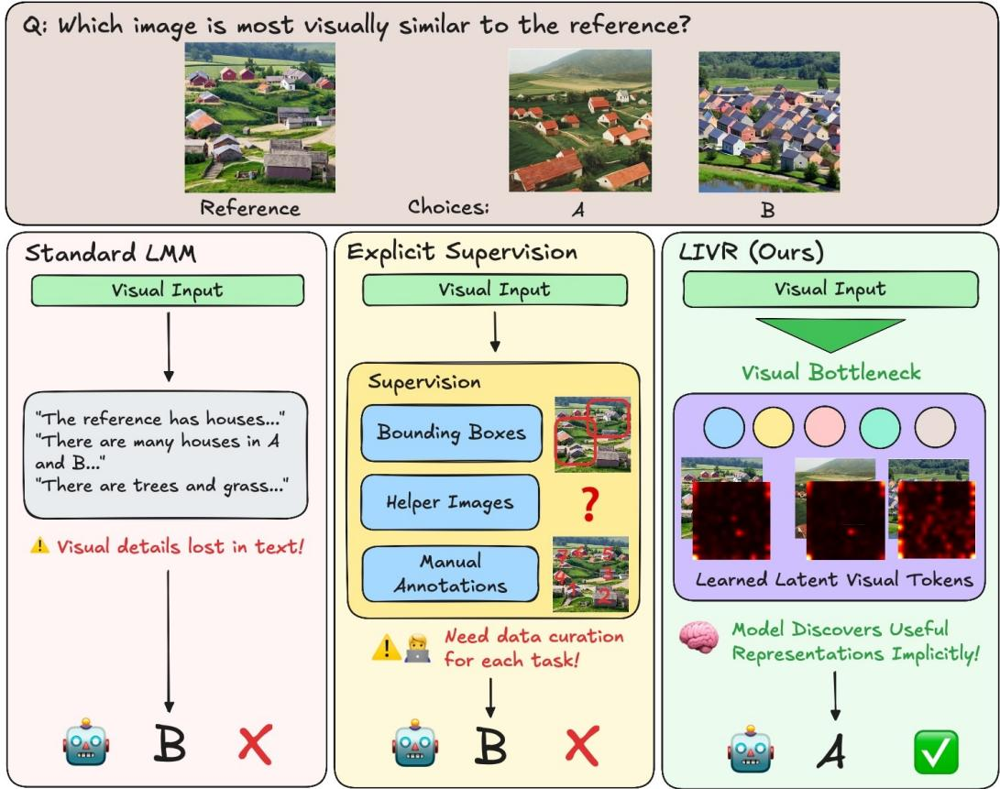

[← 返回 README](../README.md)

## 📌 预览
Introduction 从 text-centric LMM 的表达瓶颈切入，说明为什么视觉相似、拼图、对应关系这类任务难以靠自然语言中间步骤覆盖。

---

# 1. Introduction

In recent years, Large Multimodal Models (LMMs) have demonstrated great progress in visual understanding. However, they still struggle with vision-centric tasks that require heavy visual processing. This limitation stems from several factors. Firstly, most modern LMMs follow a LLaVA [20] style architecture, where visual inputs are projected into a language model that is trained to output text only. This introduces significant language bias, forcing the LMM to reason about visual information through text alone. Textbased representations may inherently lack the expressivity required to form the sophisticated visual abstractions needed for complex reasoning tasks. For example, humans can visualize objects from different angles, solve jigsaw puzzles, or identify visual patterns through mental imagery alone, without relying on language. Attempting to solve such tasks using language alone, however, may be extremely difficult. Moreover, recent LMM progress has largely focused on tasks requiring limited visual reasoning, such as document understanding or mathematical problem solving, where most of the reasoning occurs in the text space after initial visual information extraction.

> 💡 **Text-centric 瓶颈**: 作者不是说 LMM 看不到图，而是说视觉 token 被投到语言模型后，后续推理主要被文本生成目标牵引。这个设定天然偏向可命名、可描述的视觉证据。

Given these limitations, many works have attempted to train LMMs to be more “visual” through explicit supervision. However, this approach faces several challenges. First, it requires large amounts of task-specific supervised data, which both incurs substantial annotation costs and embeds human biases about what constitutes “useful” visual reasoning. For example, models are often trained to predict intermediate visual steps, such as bounding boxes and image crops, even though the intermediate steps that are intuitive for human reasoning may not be the most effective for the model to learn. Second, such supervision is difficult to specify for tasks that require complex or abstract visual structure, and the resulting models often generalize poorly beyond the supervision regimes they were designed for. As a result, this data-dependent approach does not scale well to a diverse range of vision-centric reasoning tasks.

> 💡 **显式监督的代价**: bounding box、crop、depth map 看起来更“视觉”，但它们把人类认为有用的中间表示硬塞给模型。LIVR 要反过来让模型自己学哪个视觉抽象对任务 loss 有用。

Consider the task in Figure 1, where the model is given a reference image and must select the most visually similar image from a set of choices. Describing the relationship between the sets of images using only text can be challenging and ambiguous. Training the model with explicit supervision is difficult as well since it is not clear what intermediate visual representations would be helpful to provide to the model. Even if we could identify useful intermediate steps, we would need to create large amounts of task-specific data, which is impractical to scale across different tasks.

> 💡 **Figure 1 批读**: 视觉相似任务是很好的动机例子，因为答案依赖形状、纹理、构图等混合线索。让模型先写出文本理由，很可能把连续视觉差异离散化成模糊词。

Our proposed approach, Latent Implicit Visual Reasoning (LIVR), enables models to autonomously discover useful intermediate visual representations without explicit supervision. LIVR augments the LMM with latent tokens that are learned implicitly through a novel visual bottlenecking approach, requiring no task-specific supervision.

> 💡 **方法预告**: LIVR 的关键不是生成新的图片，也不是预测人工中间标签，而是在原 prompt 后放一组可学习 latent token，让它们在训练中承担视觉信息压缩和重编码。

To summarize, our main contributions are as follows: (i) We introduce LIVR, a new method for visual reasoning that allows the model to implicitly learn useful visual information through latent tokens, without the need for additional data or explicit supervision. (ii) We show that our approach outperforms direct supervised fine-tuning and achieves state-of-the-art results on multiple single-task finetuning setups. (iii) We demonstrate strong generalization capabilities by outperforming supervised fine-tuning on a general, multi-task fine-tuning setup.

> 💡 **贡献拆解**: 三个贡献对应三层 claim：方法上无显式监督，单任务上优于 Direct SFT，多任务上仍能泛化。后文实验必须分别支撑这三点。

Figure 1. The model is asked to determine which image option is most similar to the reference image. Standard LMMs can only output text, which cannot capture all visual information and may introduce ambiguity. While methods using explicit supervision can train models to output intermediate reasoning steps, these approaches may fail when the reasoning steps themselves are unclear. Our approach allows the model to learn useful representations implicitly. Visualizing the attention maps of the latent tokens shows that the model has learned to recognize underlying visual structures relevant to answering the question that would have been hard for humans to design supervision for.

---

## 🔖 Section 总结

> 💡 **Section 小结**:
> - 核心矛盾: text-centric LMM 难以表达复杂视觉抽象，显式视觉监督又成本高且带人类先验。
> - 核心洞察: 视觉中心任务需要模型自己发现中间表示，而不是预设 box/crop/depth。
> - 可追问点: 无监督 latent 是否能跨任务共享，还是每个任务都学一套局部技巧?
