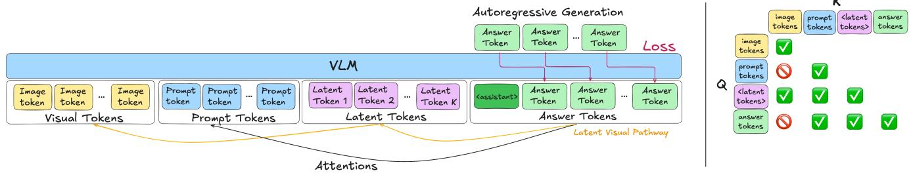

[← 返回 README](../README.md)

## 📌 预览
Related Work 把 LIVR 放在三条线之间：文本 CoT、显式视觉中间表示、latent reasoning。关键差异是 LIVR 不需要显式中间监督。

---

# 2. Related Work

Text-Based Visual Reasoning. Chain-of-thought (CoT) prompting has shown that explicitly generating intermediate text steps can substantially improve LLM performance on complex reasoning tasks [28, 33, 37]. Recent works extend CoT into the multimodal regime by training the model to describe its visual understanding in text before producing an answer [30, 34, 36]. For example, LLaVA-CoT finetunes an LMM to generate structured textual rationales that describe the image before concluding with an answer [34]. More recent works like Visual-RFT, Vision-R1, and R1-VL use RL-based post-training to encourage long, step-by-step textual explanations to help answer questions [13, 21, 38]. In all of these approaches, the entire intermediate reasoning process is represented with text. Thus, it can be difficult for these methods to form rich, spatially structured visual abstractions that go beyond what can be easily verbalized.

> 💡 **和文本 CoT 的分界**: 文本 CoT 擅长把逻辑步骤显式化，但视觉结构不一定适合语言化。LIVR 的位置是把“思考空间”从可读文本移到连续视觉 latent。

Interleaved Multimodal Reasoning Text-only reasoning often struggles on visual tasks, motivating recent work that interleaves visual representations into the reasoning process itself. We group these methods into two main classes: visual token recycling and visual intermediates.

> 💡 **相关工作地图**: 作者把多模态推理拆成 visual token recycling 和 visual intermediates。前者复用原图局部 token，后者生成/注入中间视觉表示；两者都更依赖人为设计路径。

Visual Token Recycling. Visual CoT [27], Argus [22] and VGR [31] predict bounding boxes and reintegrate the selected visual regions into the reasoning chain, usually by cropping and resampling. Other works like UV-COT [39] avoid manual bounding-box annotations by using learned rewards to guide where the model should look. However, these methods can limit expressivity, since the model can only reuse tokens from the original input. Moreover, these methods depend on explicit supervision and hand-designed crops, potentially introducing suboptimal human biases.

> 💡 **Token recycling 的上限**: crop/box 方案的优势是 grounding 强，问题是表达空间被原图区域选择限制。若任务需要“风格相似”或“功能对应”，可用区域不一定等于所需抽象。

Visual Intermediates. Another approach generates visual representations of intermediate reasoning steps. Some methods do this multimodally: MVoT [17] and CoT-VLA [40] explicitly render intermediate images or future frames as visual chain-of-thought. Others instead inject these intermediate visual representations into the language backbone of the LMM: Aurora [5] learns discrete perception tokens for targets like depth maps and bounding boxes, while Mirage [35] introduces latent tokens that are trained to reconstruct intermediate embeddings. However, these methods have inherent limitations: these visual intermediates need to be explicitly supervised which incurs large annotation costs, many tasks may lack well-defined visual intermediate targets, and human-designed abstractions may not be optimal for the model to learn. Our approach bypasses these issues by learning implicit visual representations in latent space, without explicit intermediate targets or additional data.

> 💡 **LIVR 对 Mirage/Aurora 的差异**: Aurora/Mirage 仍需要指定要学什么中间视觉目标；LIVR 只给最终答案 loss，通过瓶颈迫使 latent 自己发现有用视觉特征。

Figure 2. An illustration of our method and bottleneck attention masking. Latent tokens are appended to the prompt and losses are computed on the answer tokens. In our bottleneck attention masking, answers and prompt tokens cannot attend to image tokens.

Latent Reasoning. A separate line of work explores allocating additional computation in latent space. Coconut treats hidden states as continuous “thoughts” that are iteratively fed back into the model [11], while Think Before You Speak uses pause tokens to trigger extra forward passes without emitting visible tokens [10]. Together, these works suggest that latent representations provide a more flexible internal representation space for reasoning than natural language, and that extra compute in latent space can be beneficial. Decoupling internal computation from external tokens lets the model refine its internal state solely to optimize task performance, rather than being constrained by what can be explicitly verbalized. Recent approaches have begun to explore latent-space reasoning in LMMs, but their latent variables are still trained with explicit intermediate supervision [16, 35]. In contrast, we study latent reasoning in an LMM without explicit supervision on intermediate solutions: dedicated latent tokens operate on joint visual–text states and are trained end-to-end from task objectives, allowing the model to learn implicit, task-specific visual abstractions.

> 💡 **Latent reasoning 接口**: Coconut/pause token 说明连续隐藏状态能承载额外计算。LIVR 把这个思想搬到 LMM，但 latent 不是纯语言推理 token，而是可 attend joint visual-text state 的视觉推理 token。

---

## 🔖 Section 总结

> 💡 **Section 小结**:
> - 相关路径: text CoT、visual token recycling、visual intermediates、latent reasoning。
> - LIVR 差异: 不生成文本 rationale，不预测 helper image，不依赖中间视觉标签。
> - 可追问点: LIVR 和 Mirage/Latent Visual Reasoning 的公平比较需要哪些任务与监督预算对齐?
