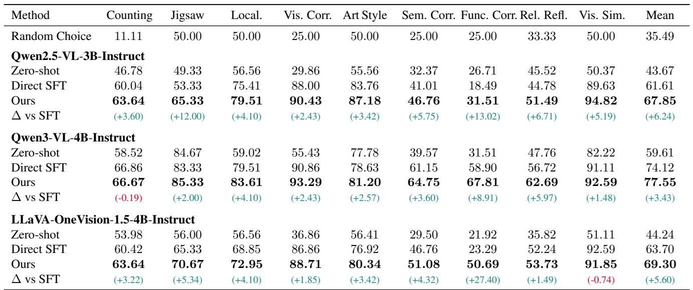
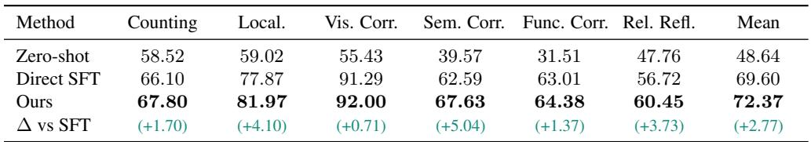
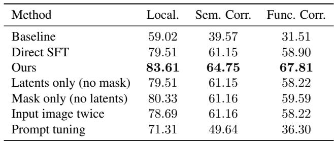
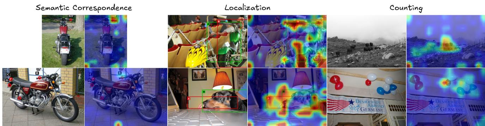
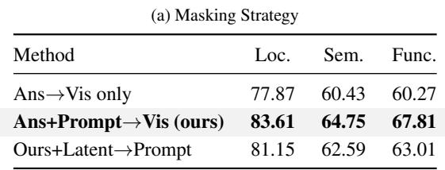
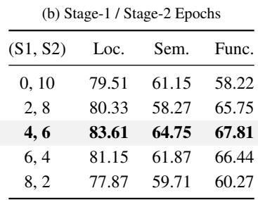
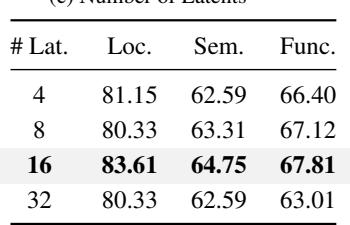
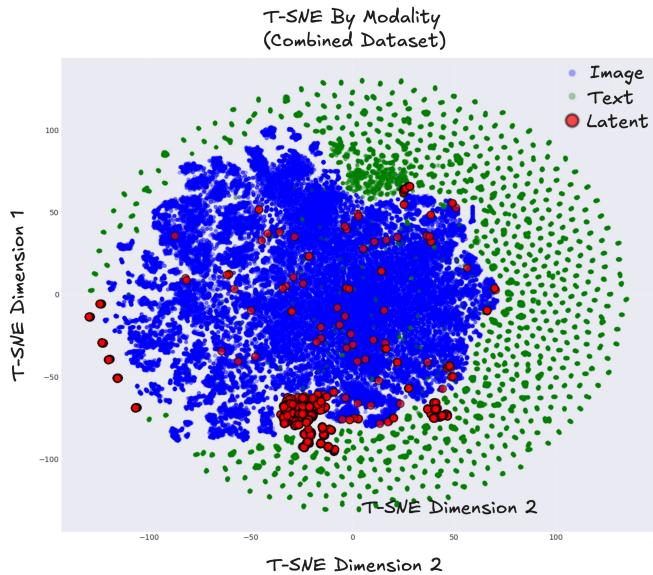

[← 返回 README](../README.md)

## 📌 预览
Evaluation 证明 LIVR 的提升不是只来自额外 token 容量：单任务、多任务、Mirage 对比、latents-only/mask-only、K 值和 attention 可视化共同构成证据链。

---

# 4. Evaluation

We evaluate our method on the tasks described in Section 4.1, and compare it to baselines in Section 4.2. Finally, results and ablations are in Section 4.3 and Section 4.4, and visualizations are in Section 4.5.

> 💡 **实验路线图**: Evaluation 不是单表刷分，而是四类证据：任务覆盖、backbone 泛化、多任务泛化、机制消融与可视化。

# 4.1. Tasks and Datasets

We evaluate our method on nine perception-heavy tasks adapted from the BLINK benchmark [9]: counting, jigsaw, object localization, visual correspondence, art style classification, semantic correspondence, functional correspondence, relative reflectance, and visual similarity. We choose these tasks because they require a strong degree of visual reasoning and abstraction. However, BLINK and most other challenging visual-centric datasets are designed for evaluation only, and there is a lack of readily available VQA-style training data. As such, we create our own training data sets from popular vision datasets. We note that all data we generate consists only of direct question-answer pairs, without any additional chains-of-thought or visual intermediate steps. All tasks except for counting are framed as BLINK-style multiple-choice VQA using top-1 accuracy as the evaluation metric; counting is evaluated in the standard open-ended setting with exact-match accuracy.

> 💡 **实验路线图**: Evaluation 不是单表刷分，而是四类证据：任务覆盖、backbone 泛化、多任务泛化、机制消融与可视化。

> 💡 **任务选择**: 九个任务覆盖 counting、jigsaw、localization、correspondence、reflectance、similarity 等视觉抽象。关键是训练数据只有 QA，没有 CoT 或视觉中间标签，正好测试 LIVR 的无监督中间表示 claim。

Counting uses the official PixMo-Count splits [6]. We adopt PixMo-Count to evaluate a more challenging open-ended counting setting, where the model must generate the count rather than choose from discrete options. For the remaining tasks, we build training/validation splits from COCO [19] (Jigsaw, Localization), ArtBench-10 [18] (art style), SPair-71k [23] (semantic correspondence), HPatches [3] (visual correspondence), FunK-Point [14] (functional correspondence), MID [24] (relative reflectance), and DreamSim [7] (visual similarity). We test on the official BLINK validation sets for Jigsaw, Object Localization, Art Style, Semantic Correspondence, Relative Reflectance, and Visual Similarity. For Visual Correspondence and Functional Correspondence, we evaluate on heldout HPatches and FunKPoint splits (rather than BLINK) due to the small size of these source datasets. For all tasks, we de-duplicate custom train/validation data against their corresponding test sets. Full construction details and prompt templates are provided in Appendix A.

> 💡 **数据构建细节**: 作者为 BLINK 风格任务补训练集，并做 train/test de-dup。这一点重要，因为如果相似图片泄漏，latent attention 的效果会被高估。

# 4.2. Baselines and Models

We experiment with three recent open-source LMMs of similar scale: Qwen2.5-VL-3B-Instruct [2], Qwen3-VL-4B-Instruct [29], and LLaVA-OneVision-1.5-4B-Instruct [1]. These models are competitive on a broad range of vision-language benchmarks, providing strong and comparable backbones for our study. For each task and backbone, we consider three settings: (i) Zero-shot, the pretrained instruct model evaluated without any task-specific training; (ii) Direct SFT, standard supervised fine-tuning on our task training set; and (iii) LIVR, our proposed training method, run with the same task data and training setup as Direct SFT. We also compare against Mirage [35], a recent latent reasoning approach that relies on explicit visual supervision via task-specific helper images. For Mirage, we evaluate on two tasks: Jigsaw, where we generate helper images for our BLINK-style Jigsaw data following their protocol, and Visual Spatial Planning (VSP), where we use their released dataset and helper images. We do not extend Mirage to other tasks, as there is no clear way to define helper images and no additional Mirage data has been released.

> 💡 **Baseline 设计**: Zero-shot、Direct SFT、LIVR 三组把“预训练能力”“普通任务微调”“带 latent+瓶颈微调”分开。Mirage 对比则专门回答显式 helper image 监督是否必要。

Table 1. Single-task fine-tuning accuracy.

> 💡 **Table 1 主结果**: 单任务表显示 LIVR 在三种 backbone 上平均都优于 Direct SFT：Qwen2.5-VL +6.24、Qwen3-VL +3.43、LLaVA-OneVision +5.60。最大增益出现在 Functional Correspondence，说明 latent 对复杂视觉关系更有价值。

*Table 1: Single-task fine-tuning accuracy.*

> 💡 **Table 1 批读**: 表格横跨 3 个 backbone 和 9 个视觉中心任务。关键读法不是单点最高分，而是均值相对 Direct SFT 的一致增益：Qwen2.5-VL +6.24、Qwen3-VL +3.43、LLaVA-OneVision +5.60，说明 LIVR 对不同架构都能形成额外视觉抽象能力。

# 4.3. Experiments

Single-Task Fine-Tuning. For single-task experiments, we use 1k training examples per task. Direct supervised fine-tuning runs for 10 epochs. LIVR uses a two-stage schedule: 4 epochs of Stage 1 (visual bottlenecking) followed by 6 epochs of Stage 2 (standard masking) with $K \ : = \ : 1 6$ latent tokens. These hyperparameters were determined through ablation studies on 3 tasks (Section 4.4.3) and kept fixed across all tasks, though we hypothesize that task-specific tuning could further improve results. For all runs, we select checkpoints by highest validation accuracy.

> 💡 **训练预算**: 单任务每个任务 1k 样本，Direct SFT 10 epochs；LIVR 用 4 epoch bottleneck + 6 epoch standard mask，并固定 $K=16$。这使比较主要落在训练机制而不是数据量。

Table 1 reports single-task accuracy across the nine visual-centric tasks for all three backbones. With Qwen2.5- VL, our method achieves significantly better results across all tasks, outperforming Direct SFT by an average of $6 . 2 4 \%$

> 💡 **证据链读法**: Qwen2.5 上所有任务提升，Qwen3/LLaVA 个别任务略降但均值提升。这个结果支持“通用增强”，但也提示 latent 对已经很强或接近饱和的任务不一定稳定增益。

The improvements are particularly pronounced on challenging tasks that require complex visual abstractions: gains of $12 \%$ on Jigsaw and $1 3 . 0 2 \%$ on Functional Correspondence demonstrate that our method effectively enhances the LMM’s ability to form useful visual abstractions.We also observe gains on tasks such as Art Style, Visual Similarity, and Relative Reflectance, where explicit visual intermediates are difficult to specify; in these settings, LIVR provides a way to learn useful latent visual abstractions when it is hard—even for humans—to define hand-designed intermediate labels. On Qwen3-VL and LLaVA-OneVision-1.5, we also improve results across datasets by an average of $3 . 4 3 \%$ and $5 . 6 0 \%$ respectively, demonstrating the generalizability of our approach across multiple models.

Multi-Task Fine-Tuning. To test if our approach generalizes to multi-task setups, we use Qwen3-VL-4B-Instruct, the strongest backbone, and train on a combined dataset of six tasks: Counting, Localization, Visual Correspondence, Semantic Correspondence, Functional Correspondence, and Relative Reflectance, using 1k examples per task (6k total). We omit Jigsaw, Art Style, and Visual Similarity, as single-task baseline accuracies for Qwen3-VL-4B-Instruct on these tasks are already high, making relative improvements harder to interpret. Direct SFT is trained for 5 epochs, while LIVR is trained for 2 epochs of Stage 1 and 3 epochs of Stage 2, maintaining the same 2:3 ratio as in single-task experiments and using $K = 1 6$ latent tokens. We report performance using the final checkpoint.

> 💡 **多任务设置**: 多任务只选 6 个未饱和任务，6k 总训练样本，LIVR 用 2:3 的两阶段比例。这是在检验同一组 latent 机制能否跨任务学习，而不是为每个任务定制中间目标。

Table 2 shows results for multi-task training on Qwen3- VL-4B-Instruct across the six perception tasks. LIVR improves over Direct SFT on all tasks, demonstrating that the latent mechanism effective in single-task settings also benefits joint multi-task training. A key advantage of LIVR is its task-agnostic nature: because it trains latent tokens implicitly from the end-task loss without requiring task-specific helper images or intermediate labels, the same method applies directly to multi-task settings. This contrasts with approaches that tie latent tokens to task-specific visual targets (e.g., depth maps, bounding boxes, helper images), which require different supervision per task and are difficult to extend to heterogeneous multi-task setups. This makes our method well-suited as a simple, general-purpose enhancement for perception-heavy multi-task fine-tuning.

> 💡 **Table 2 多任务解读**: LIVR 平均 72.37 vs Direct SFT 69.60，六个任务全提升。最强信号是 Semantic Correspondence +5.04 和 Localization +4.10，说明 latent 在定位/对应类视觉证据上确实有帮助。

Table 2. Multi-task fine-tuning accuracy on Qwen3-VL-4B-Instruct.

*Table 2: Multi-task fine-tuning accuracy on Qwen3-VL-4B-Instruct.*

> 💡 **Table 2 批读**: 多任务设置下六个任务全部提升，Mean 从 69.60 到 72.37。这个表说明 latent visual tokens 不是只记住单任务捷径，而能在混合任务训练中作为共享视觉抽象接口。

Mirage Comparison. We compare LIVR with Mirage [35], a visual reasoning approach that relies on explicit visual supervision. We evaluate on Jigsaw and Visual Spatial Planning (VSP). For Jigsaw, we train on the same 1k instances, synthesize helper images following Mirage, and evaluate on the BLINK Jigsaw validation set; for VSP, we use the dataset and helper images released by Mirage. For a fair comparison, both methods use Qwen2.5-VL-3B-Instruct with Mirage’s training configuration and $K = 4$ latents. On Jigsaw, zero-shot accuracy is 49.33, Mirage achieves 48.60, and LIVR reaches 68.00 $( + 1 9 . 4 0 )$ . On VSP, zero-shot accuracy is 6.00, Mirage achieves 46.00, and LIVR reaches 66.00 $( + 2 0 . 0 0 )$ . LIVR outperforms Mirage on both tasks without task-specific visual supervision.

> 💡 **和显式视觉监督对比**: Mirage 需要 helper images，LIVR 不需要。Jigsaw 68.00 vs Mirage 48.60、VSP 66.00 vs 46.00，说明至少在这两个任务上，隐式 latent 不是弱替代，而可能比人工中间视觉目标更合适。

# 4.4. Ablations and Additional Experiments

# 4.4.1. Usefulness of Latent Tokens

We next test whether the model truly relies on latent tokens rather than ignoring them. We compare LIVR against a latents-only variant that adds $K = 1 6$ latent tokens but trains only with Stage 2 (no bottlenecking). This control is designed to match LIVR’s added capacity while providing no explicit pressure for latent tokens to carry visual information, creating an “unused-latents” baseline. We report results on the Localization task using Qwen3-VL-4B-Instruct.

> 💡 **Latent 是否真的被用**: latents-only 去掉 latent 不掉分，说明模型会忽略无压力的额外 token；LIVR 去掉 latent 从 83.61 掉到 76.23，并且 answer-to-latent attention 更高，证明瓶颈训练让 latent 进入决策路径。

When latent tokens are removed at evaluation, the latents-only model maintains the same accuracy $( 7 9 . 5 1  $ 79.51), indicating it has learned to ignore the extra tokens. In contrast, in the standard (unmasked) setting LIVR achieves higher accuracy than the latents-only model (83.61 vs. 79.51) and suffers a clear drop when latents are removed $8 3 . 6 1  7 6 . 2 3$ ), showing that it depends on them. This is further confirmed by attention patterns: measuring the mean attention from answer tokens to latent tokens (averaged over all heads, layers, and positions), we find much higher scores for LIVR than for the latents-only model (0.076 vs. 0.028). To test whether latents encode useful visual information, we evaluate both models under a bottleneck mask at test time, where the model can only view the image through latent tokens. Under this bottleneck, the latents-only model performs on par with random guessing (43.44), indicating its latents carry no useful visual information, while LIVR retains much higher accuracy (70.49). As a sanity check, if we additionally drop latent tokens under the bottleneck mask, accuracy falls to 43.44, since the image pathway is removed entirely. Together, these results show that the latents in our method are both actually used by the model and encode task-relevant visual information.

Table 3. Design ablations and additional controls.

> 💡 **Table 3 消融读法**: Latents only、mask only、input image twice、prompt tuning 都不如 LIVR，说明收益不是单纯额外容量、不是单纯 mask regularization，也不是重复图像 token 带来的 compute。

*Table 3: Design ablations and additional controls.*

> 💡 **Table 3 批读**: Latents-only 和 mask-only 都接近 Direct SFT，只有 latent + bottleneck 的组合显著提升，排除了“额外 token 容量”“额外视觉输入”“prompt tuning”这些替代解释。

# 4.4.2. Design Ablations for LIVR

We individually test the effectiveness of the two main components of our approach, latent tokens and bottlenecking. We perform these ablations using Qwen3-VL-4B-Instruct as our base model across three challenging tasks: Localization, Semantic Correspondence, and Functional Correspondence. The results are displayed in Table 3.

Bottleneck Ablation. We first revisit the latents-only variant described in Section 4.4.1, which adds latent tokens but skips Stage 1 bottlenecking. This isolates the effect of added capacity. However, simply introducing extra tokens without bottleneck training significantly underperforms LIVR, showing that capacity alone is insufficient.

> 💡 **瓶颈必要性**: 只加 latent 没有 Stage 1 bottleneck，模型会走原有 image→answer 路径，latent 学不到承担视觉信息的职责。

Latent Ablation. Second, we test a mask-only variant that applies the Stage 1 bottleneck without adding latent tokens. Here, answer tokens cannot attend directly to vision tokens, but prompt tokens can still see the image. The goal is to force existing prompt tokens to act as a visual bottleneck without adding new capacity. This variant also underperforms LIVR. A plausible explanation is that existing text tokens already carry pre-trained semantics, making them harder to repurpose to form abstract visual representations. In contrast, newly introduced latent tokens are free to adapt and can more easily learn to form rich visual abstractions.

> 💡 **新 token 必要性**: mask-only 让 prompt token 承担瓶颈，但 prompt token 已有语言语义负担，不如新 latent token 灵活。这解释了为什么“用现有文本 token 传视觉”不够。

Figure 3. An illustration of latent-to-image attention maps for different tasks. The left columns show the input images, and the right columns show the attention overlays. In the Semantic Correspondence task, the model identifies the option in the second image that aligns with the REF point in the first image. In the Localization task, it selects bounding boxes that best localize the motorcycle and the dog, and in the Counting task, it counts the cows and balloons. We observe that latent-to-image attention concentrates on regions corresponding to the correct answers or the visual evidence needed to resolve each task. Although some attention sinks persist, the dominant patterns align with task-relevant regions, indicating that the latents capture meaningful visual structure without explicit supervision.

> 💡 **Figure 3 批读**: latent-to-image attention 对准 toothbrush handle、motorcycle/dog boxes、counting objects，说明 latent 不是均匀吸收图像，而是在任务条件下聚焦答案证据。attention sink 仍存在，不能把图当作完整可解释性证明。

Table 4. Ablations of latent-token design choices on Qwen3-VL-4B-Instruct. All numbers are accuracies $( \% )$

> 💡 **Table 4 设计选择**: 最优组合是 prompt 后放 latent、阻断 answer/prompt 到 vision、4/6 两阶段、unshared embeddings、$K=16$。这些结果把 LIVR 从一个想法压成可复现 recipe。

*Table 4a: Masking strategy ablation.*

> 💡 **Table 4a 批读**: 默认的 Ans+Prompt→Vis 阻断最好，说明 prompt token 本身也是视觉泄漏通道。若只挡 answer 到 image，模型仍可让 prompt 先读图，再把信息传给答案，latent 就不会成为必要中介。

*Table 4b: Stage-1 / Stage-2 epoch schedule.*

> 💡 **Table 4b 批读**: 4/6 训练日程最好。Stage 1 太少则 latent 没学会承载视觉，Stage 1 太多则缺少 standard mask 下的联合适配，说明 LIVR 依赖“先建瓶颈、再放开协作”的节奏。

(c) Number of Latents

*Table 4c: Number of latent tokens.*

> 💡 **Table 4c 批读**: $K=16$ 是当前 sweet spot。4/8 个 latent 容量不足，32 个 latent 又让 attention 和学习信号变分散，说明 latent budget 需要按任务难度控制。

Together, these results suggest that both the dedicated latent tokens and the visual bottleneck are necessary for LIVR’s full gains. For completeness, we include two additional controls in the same table: duplicating the input image tokens (“input image twice”), where we concatenate two copies of the same image tokens at both training and inference as a generic control for extra visual compute, and prompt tuning [15], a lightweight adaptation baseline. Neither matches LIVR’s improvements.

# 4.4.3. Architectural and Training Choices

We ablate design choices of LIVR on Qwen3-VL-4B-Instruct, again focusing on Localization, Semantic Correspondence, and Functional Correspondence. We vary each design choice independently, keeping all others fixed to our defaults: latents placed after the prompt, our default masking scheme (blocking both answer-to-vision and prompt-tovision attention), unshared latent embeddings, $K = 1 6$ , and a 4-epoch Stage 1, 6-epoch Stage 2 schedule.

Position of latents. We compare placing latents before versus after the prompt. Placing latents after the prompt (our default) as opposed to before the prompt yields higher accuracy across all three tasks. Specifically, for the Localization, Semantic Correspondence, and Functional Correspondence tasks, we get scores of (83.61 vs. 80.33), (64.75 vs. 61.87), and (67.81 vs. 63.70), respectively, for placing the latents after vs. before the prompts. We hypothesize that when latents appear before the prompt, they cannot condition on the question and are farther from answer tokens, making them harder for the model to exploit effectively.

> 💡 **位置消融**: latent 放在 prompt 后更好，因为它能条件化在问题上。视觉任务的有用信息不是固定的，同一张图面对 counting 和 localization 需要不同摘要。

Masking strategy. Table 4(a) compares three masking schemes. Our default approach blocks both answer-tovision and prompt-to-vision attention, forcing all visual information to flow through latents, and achieves the best performance. Blocking only answer-to-vision attention is insufficient: visual information can still reach answer tokens via the prompt, so latents never become a true bottleneck. Conversely, further blocking latents from attending to the prompt is too restrictive, as latents need to see the question to determine what visual information to encode.

> 💡 **泄漏路径分析**: 只挡 answer→vision 不够，因为 prompt 仍可先吸收 image 信息再传给 answer。LIVR 同时挡 prompt→vision，才形成真正 image→latent→answer 的路径。

Stage-1 / Stage-2 schedule. For our main experiments, we train the model for 4 epochs in Stage 1 and 6 epochs in Stage 2. We experiment with different allocations of Stage 1 and Stage 2 epochs in Table 4(b), while keeping the total number of epochs at at 10. Using only Stage 2 (0,10) corresponds to the latents-only setting from Section 4.4.1 and underperforms LIVR, again highlighting the importance of bottleneck training. Conversely, an (8,2) split also hurts; we hypothesize that in this case the model does not have enough Stage 2 training to learn how to integrate the latent representations with the original image tokens under the standard mask. A balanced schedule with 4 Stage 1 and 6 Stage 2 epochs provides the best trade-off, giving latents enough time to learn visual information while still allowing ample joint training with standard masking.

> 💡 **训练日程解读**: 0/10 退化成 latents-only，8/2 又缺少标准 mask 下的联合适配。4/6 最好，说明 latent 先学承载视觉，再学和原始 image token 协作。

Shared vs. unshared latent embeddings. In our method, we use different embeddings for each of our $K$ latent tokens. However, we can also insert the same latent token $K$ times, in a configuration we call ”shared embeddings”. We find that using unshared embeddings (one learnable embedding per latent) yields higher accuracy compared to shared embeddings across all 3 tasks. Specifically, we have scores of (83.61 vs. 81.15), (64.75 vs. 61.87), and (67.81 vs. 63.70) for the Localization, Semantic Correspondence, and Functional Correspondence tasks, respectively. This is consistent with the idea that giving each latent its own embedding increases the expressivity of the latent set.

> 💡 **Embedding 容量**: unshared latent embeddings 更强，说明 K 个 token 不是重复占位符，而是可以分化成不同视觉槽位。

Number of latents. For our standard experiments, we set $K = 1 6$ , inserting 16 latent tokens per prompt. We experiment with varying $K$ by using values of 4, 8, 16, 32, which is displayed in Table 4(c). Accuracy generally improves as $K$ increases from 4 to 16, with $K = 1 6$ (our default) performing best. We hypothesize that 4 and 8 latents do not provide enough capacity, while 16 strikes a good balance between expressivity and learnability. At $K = 3 2$ , performance drops; one possible explanation is that attention becomes more diffuse over a larger latent set, making it harder for the model to learn to use each latent effectively.

> 💡 **K 值批读**: 从 4 到 16 提升，32 下降，表明 latent capacity 有甜点区。太少装不下任务相关视觉信息，太多会稀释 attention 和学习信号。

# 4.5. Visualizations

Latent Attention Visualization. We map the latent-toimage attention maps in Figure 3. Our method allows latent tokens to learn useful features across different tasks without explicit supervision. The latent tokens are able to match the handle of the motorcycle in the Semantic Correspondence task, identify the best bounding boxes of the motorcycle and the dog in the Localization task, and focus on all of the objects it needs to count in the Counting task.

> 💡 **Figure 3 批读**: latent-to-image attention 对准 toothbrush handle、motorcycle/dog boxes、counting objects，说明 latent 不是均匀吸收图像，而是在任务条件下聚焦答案证据。attention sink 仍存在，不能把图当作完整可解释性证明。

> 💡 **可视化证据**: attention map 支持 latent 捕捉任务相关区域，但它仍是相关性证据。真正的因果证据来自前面的 drop-latent 和 bottleneck 测试。

Latent Token t-SNE. To probe what our latent tokens represent, we visualize token hidden states using t-SNE. We first train Qwen3-VL-4B-Instruct in the multi-task setting on the six-task mixture used in Sec. 4.3. We then extract the final-layer hidden states for all token positions (latent, image, and text) from the first 50 evaluation examples of each of the six tasks, and embed them with t-SNE (Fig. 4; red: latent, blue: image, green: text). Latent tokens largely occupy the same region as image tokens in the t-SNE projection, suggesting that many latent representations align with the model’s visual feature space. At the same time, a compact cluster of latent tokens forms a distinct region, suggesting that some latents learn specialized representations not fully captured by the image-token manifold.

> 💡 **t-SNE 批读**: latent hidden states 多数靠近 image token，说明它们偏视觉；另有紧凑独立簇，可能代表任务特化的视觉摘要。这个图帮助理解 latent 不是普通文本 token。

Figure 4. t-SNE Visualization of Different Tokens

---

## 🔖 Section 总结

> 💡 **Section 小结**:
> - 关键数字: Qwen2.5 +6.24、Qwen3 +3.43、LLaVA-OneVision +5.60；multi-task Qwen3 +2.77；Jigsaw/VSP 对 Mirage 分别 +19.40/+20.00。
> - 核心洞察: latent 的收益需要瓶颈训练，单纯加 token、mask-only 或复制图像 token 都不够。
> - 可追问点: attention 可视化能解释“看哪里”，但还不能完整解释 latent 内部编码了什么。
