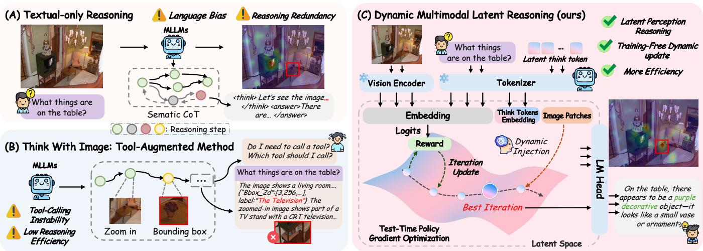
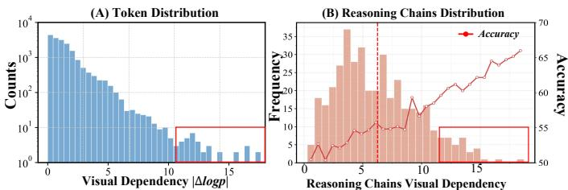
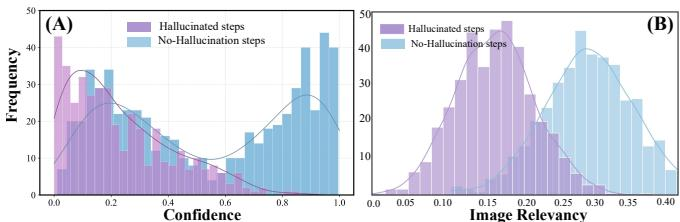
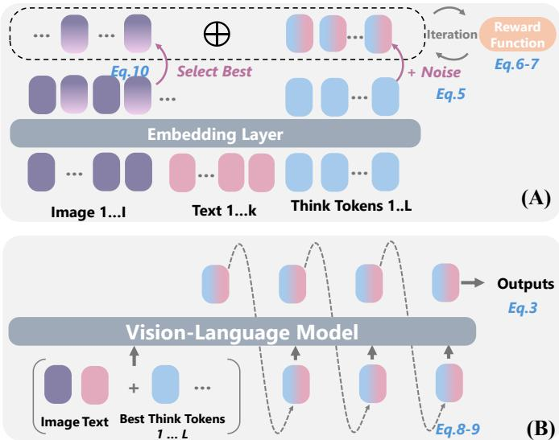
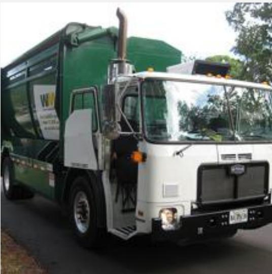
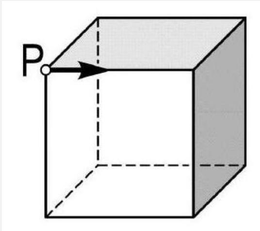

# Reasoning Within the Mind: Dynamic Multimodal Interleaving in Latent Space

Chengzhi Liu\*1 Yuzhe Yang\* Yue Fan3 Qingyue Wei2 Sheng Liu†2 Xin Eric Wang†1 1 University of California, Santa Barbara 2 Stanford University 3 University of California, Santa Cruz \* Equal contribution † Equal advising {chengzhi,yuzheyang,ericxwang}@ucsb.edu, shengl@stanford.edu

Abstract: Recent advancements in Multimodal Large Language Models (MLLMs) have significantly enhanced cross-modal understanding and reasoning by incorporating Chain-of-Thought (CoT) reasoning in the semantic space. Building upon this, recent studies extend the CoT mechanism to the visual modality, enabling models to integrate visual information during reasoning through external tools or explicit image generation. However, these methods remain dependent on explicit step-by-step reasoning, unstable perception–reasoning interaction and notable computational overhead. Inspired by human cognition, we posit that thinking unfolds not linearly but through the dynamic interleaving of reasoning and perception within the mind. Motivated by this perspective, we propose DMLR, a test-time Dynamic Multimodal Latent Reasoning framework that employs confidence-guided latent policy gradient optimization to refine latent think tokens for in-depth reasoning. Furthermore, a Dynamic Visual Injection Strategy is introduced, which retrieves the most relevant visual features at each latent think token and updates the set of best visual patches. The updated patches are then injected into latent think token to achieve dynamic visual–textual interleaving. Experiments across seven multimodal reasoning benchmarks and various model architectures demonstrate that DMLR significantly improves reasoning and perception performance while maintaining high inference efficiency.

§ Project Page: https://mllm-dmlr.github.io/

Figure 1: Comparison between DMLR and two reasoning paradigms. (A) Text-only reasoning: relies solely on explicit CoT, often causing visual grounding errors and redundant steps. (B) Think-with-Image reasoning: depends on external perception tools, leading to unstable tool calls and extra overhead. (C) DMLR (ours): refines latent think tokens in the latent space through confidence-guided optimization and dynamically injects visual information, achieving self-improving reasoning without additional training while maintaining high efficiency.

# 1. Introduction

Multimodal Large Language Models (MLLMs) [1, 2, 3, 4] have achieved remarkable breakthroughs in integrating visual and linguistic information. This progress has facilitated the incorporation of Chain-of-Thought (CoT) reasoning into multimodal tasks, enabling models to construct structured reasoning paths across visual and textual modalities. Current multimodal reasoning approaches can be broadly categorized into three types: (1) Textual-only Reasoning [5, 6, 7], which generates intermediate reasoning steps in the sematic space. Such methods explicitly express reasoning logic through language generation but often suffer from language bias and insufficient visual grounding, as shown in Figure. 1(a). (2) Think with Images attempts to directly manipulate or augment images during reasoning, such as local zooming [8, 9], region highlighting [10, 11], or generating intermediate reasoning steps via diffusion models [12, 13] to enhance visual alignment. Despite their effectiveness in improving reasoning to a certain extent, they still face challenges such as unstable tool invocation and high inference overhead, as reflected in Figure 1(b). Recently, latent-space reasoning has emerged as a promising paradigm for enhancing reasoning capabilities in large language models, as exemplified by approaches such as CoCoNut [14] and LatentSeek [15]. Its core idea is to perform implicit reasoning in the latent space, replacing explicit textual steps with latent vectors to reduce redundant generation and capture more compact information. However, recent studies [16, 17, 18, 19] still rely on extra training to enforce latent reasoning triggered at fixed positions (via special tokens). This rigidity prevents the model from adaptively allocating reasoning effort.

Inspired by human cognition, we argue that reasoning is not fixed. Instead, humans dynamically revisit visual information, specifically when they encounter uncertainty. Drawing on this intuition, we empirically analyze the interplay between the model’s visual reliance and its internal confidence. Our analysis reveals two key phenomena: (i) Visual information is used only at a few specific stages of the reasoning process rather than at fixed positions, and (ii) Internal confidence serves as a natural indicator for the need of visual grounding as it strongly correlates with reasoning correctness. These findings suggest that effective multimodal reasoning relies on dynamic visual usage guided by internal confidence.

In light of these observations, we propose DMLR, a Test-time Dynamic Multimodal Latent Reasoning Framework, as shown in Figure 1(c). Specifically, it introduces optimizable latent think tokens to serve as a mental draft, which are iteratively refined through confidence-guided policy gradient updates. Crucially, we design a confidence-driven dynamic visual injection strategy. At each step, the model autonomously determines whether to revisit visual information and which contents to select (ranging from none to a few specific patches). This mechanism allows the model to naturally skip visual injection when internal confidence is sufficient, or actively integrate targeted visual clues when necessary, all driven by the objective of maximizing reasoning confidence, effectively mimicking the human cognitive process of checking visual clues to build confidence. After several iterations, the optimized latent tokens are decoded with the input without extra inference cost. Extensive experiments demonstrate that DMLR consistently outperforms existing methods across diverse architectures and tasks while maintaining high efficiency. The main contributions can be summarized as follows:

$\bullet$ We reveal two key phenomena: Visual information contributes only at specific reasoning steps; and confidence reflects both reasoning quality and visual grounding.
$\pmb { \varrho }$ We propose DMLR, a test-time framework for multimodal latent reasoning that integrates confidenceguided latent optimization with dynamic visual injection.
$\pmb { \otimes }$ Extensive evaluations show that DMLR consistently outperforms other methods across diverse architectures and multimodal tasks, while maintaining high efficiency.

# 2. Related Work

Explicit Reasoning. Many prior works have explored visual reasoning. Early approaches mainly relied on semantic CoT, where the model performs all inference in the text space after a one-time visual encoding [5, 4, 20, 21]. However, this separation between perception and reasoning often leads to misalignment and hallucination [6, 22, 23, 24, 22, 25]. To address these limitations, recent studies adopt a Thinking-with-Images paradigm, where the model can draw auxiliary elements [13, 26, 27], zoom or crop regions [11, 8, 28, 29], or generate intermediate visual cues [30, 10, 9], enabling it to reason directly over visual structures.

Latent Reasoning. Recently, an increasing number of studies have begun to shift reasoning from the explicit token space to the model’s latent representation space. Some methods introduce dedicated training frameworks that optimize latent representations to support more effective internal reasoning [31, 14, 32, 33, 34, 35], while others propose training-free approaches that manipulate latent activations during inference to refine the reasoning process [15, 36, 37, 38, 39]. In addition, several recent works explore injecting visual information into the latent space [16, 17, 40, 41, 18], enabling models to iteratively operate over both latent semantic features and latent visual cues, thereby supporting a more flexible form of interleaved multimodal reasoning.

# 3. Preliminary and Motivation

As shown in Figure 12, existing reasoning paradigms commonly suffer from insufficient visual grounding, unstable tool invocation, and high computational overhead. These limitations motivate a fundamental question: why can’t MLLMs reason like humans do, dynamically deciding how to reason and which visual information to pay attention on during the thinking process? To this end, we organize the section around two research questions: (RQ1) Whether multimodal models require visual perception at every step of reasoning? (RQ2) If not, can their internal representations indicate when visual perception and reasoning is required?

# 3.1 Dynamic Perception-Reasoning is Necessary

Definition 3.1 (Visual Dependency Score). Let the visual input be denoted as I, and its perturbed version as $\tilde { I } .$ Given a query $q _ { \ast }$ , the model’s dependence on visual information can be quantified by measuring the output discrepancy between the original and perturbed visual inputs. Specifically, for the i-th generated sequence $\mathcal { X } _ { i } = \{ x _ { i , 1 } , x _ { i , 2 } , . . . , x _ { i , t } \} _ { \mathrm { { \scriptsize { : \scriptsize ~ } } } }$ , the visual dependency score at position $t$ is defined as:

$$
S _ { i , t } = \log \pi _ { \theta } ( x _ { i , t } \mid x _ { i , < t } , I , q ) - \log \pi _ { \theta } ( x _ { i , t } \mid x _ { i , < t } , \tilde { I } , q )
$$

where $\pi _ { \theta } ( \cdot )$ denotes the token-level conditional probability distribution of the model. A larger $S _ { i , t }$ indicates a stronger dependency of the generated token on visual information. Building upon the above metric, we analyze visual dependency on the Math-Vision benchmark using the Qwen2.5-VL-7B [42] at two levels. First, for individual reasoning chains, we compute token-level visual dependency scores, capturing how much each generated token relies on visual information, as illustrated in Figure 2(a). Second, as shown in Figure 2(b), we aggregate these

Figure 2: Analysis of visual dependency in reasoning. (A) Token-level distribution shows visual sensitivity is concentrated in a few tokens. (B) Chain-level distribution reveals large variation in visual reliance across reasoning trajectories.

scores across full reasoning trajectories to obtain chain-level visual dependency, which reveals how different reasoning paths vary in their reliance on visual perception. These results reveal that:

Takeaway 1. The dependency on visual input across the reasoning process is highly uneven: only a small subset of tokens show strong sensitivity to visual features, while the majority operate independently of the image.

$\blacktriangle$ Takeaway 2. Across reasoning chains sampled from the same model, visual dependency varies substantially.
Chains exhibiting stronger visual reliance consistently yield higher accuracy.

# 3.2 Internal Confidence Affects Multimodal Reasoning

Definition 3.2 (Confidence Gain). Let $I$ denote the visual input, $q$ the query, and $\mathcal { T } _ { t }$ denotes the reasoning at step t. The Confidence Gain at step $t$ is defined as the change in the probability of the ground-truth answer $Y _ { g t }$ after adding step $x _ { t }$ . $A$ positive $\mathcal { G } _ { t }$ suggests that step $x _ { t }$ strengthens the confidence, whereas a negative value indicates the opposite.

$$
\mathcal { G } _ { t } = \log \pi _ { \theta } ( Y _ { g t } \mid I , q , \mathcal { T } _ { \leq t } ) - \log \pi _ { \theta } ( Y _ { g t } \mid I , q , \mathcal { T } _ { < t } )
$$

❖ Observation 1: Higher Confidence Tends to Indicate Higher Reasoning Accuracy. We analyze reasoning chains generated by various reasoning models across four benchmarks, where all chains are partitioned into a correct set $\tau ^ { + }$ and an incorrect set $\mathcal { T } ^ { - }$ based on their answer correctness. We then compute the proportion of reasoning steps for each chain that obtain a positive confidence reward. As shown in Figure 3(a), reasoning chains in ${ { \mathcal { T } } ^ { + } }$ exhibit a substantially higher proportion of positive confidence increments compared to those in $\mathcal { T } ^ { - }$ , indicating that the reasoning leading to correct answers tends to exhibit more stable and higher confidence.

❖ Observation 2: Confidence Reflects Reasoning Chains Quality. We investigate whether confidence dynamics reflect reasoning quality by evaluating reasoning chains within the correct set ${ { \mathcal { T } } ^ { + } }$ using the evaluator GPT-4o [43]. Each chain is assessed for logical validity and factual consistency, and categorized into Faithful and Spurious groups. As shown in Figure 3(b), faithful reasoning chains exhibit a higher proportion of positive confidence increments, suggesting that confidence improvement not only correlates with answer accuracy but also reveals the intrinsic quality of the reasoning process.

Figure 3: Analysis of the relationship between confidence and reasoning quality. (A) Correct reasoning chains exhibit substantially higher frequencies of positive confidence gains than incorrect ones. (B) Faithful reasoning shows consistently stronger confidence improvement than spurious reasoning.

Figure 4: Analysis of the relationship between confidence and visual grounding. (A) Hallucinated steps show lower confidence than non-hallucinated ones. (B) Hallucinated steps exhibit weaker image relevancy than their counterparts.

❖ Observation 3: High Confidence Aligns with Stronger Visual Grounding. We further evaluate various reasoning models on the perception benchmark to analyze the relationship between confidence and visual grounding. Each step in the reasoning chain is categorized as hallucinated or non-hallucination based on whether it refers to an object actually present in the image. As shown in Figure 4, hallucinated steps exhibit lower confidence and weaker visual grounding, while non-hallucinatory steps maintain higher and more stable confidence with stronger visual alignment. The results indicate that confidence acts as an intrinsic signal of visual faithfulness, with higher confidence consistently associated with more reliable reasoning.

# 4. Methodology

# 4.1 Problem Formulation

Given a text input sequence $\mathcal { Q } = \left( q _ { 1 } , \ldots , q _ { k } \right)$ and a set of visual embeddings $\mathcal { Z } = \left( z _ { 1 } , \ldots , z _ { I } \right)$ extracted by a visual encoder, the MLLM $\pi _ { \theta }$ encodes the text sequence into embeddings and incorporates visual features to generate the reasoning sequence $\mathcal { X } = ( x _ { 1 } , x _ { 2 } , \ldots , x _ { N } )$ .

$$
\pi _ { \boldsymbol { \theta } } ( { \mathcal { X } } \mid q , z ) = \prod _ { n = 1 } ^ { N } \pi _ { \boldsymbol { \theta } } ( x _ { n } \mid { \mathcal { X } } _ { < n } , q , z )
$$

where $x _ { < n }$ denotes the sequence of tokens preceding position $n$ . Different from approaches that use the last hidden state of the previous reasoning step as latent think tokens [44, 18], we introduce $L$ learnable latent think tokens into the input sequence, whose embeddings after projection are denoted as $\mathcal { T } = \left[ \pmb { \tau } _ { 1 } , \pmb { \tau } _ { 2 } , \dots , \pmb { \tau } _ { L } \right]$ . These tokens are concatenated with the original inputs and fed into the model. During test-time inference, our core idea is to keep model parameters fixed and improve reasoning solely by optimizing the embeddings of the latent think tokens. Motivated by the observations in Section 3, we define a reward function $\mathcal { R }$ to quantify the confidence of the current latent reasoning state. This leads to the following test-time optimization objective:

$$
\mathcal { T } ^ { * } = \arg \operatorname* { m a x } _ { \mathcal { T } } \mathcal { R } ( \mathcal { T } , \mathcal { Q } , \mathcal { Z } ) ,
$$

In practice, the model iteratively update the latent think tokens for $T$ steps, allowing them to progressively evolve toward directions that maximize the reward.

# 4.2 Dynamic Multimodal Latent Reasoning

In light of the observations in Section 3, DMLR comprises two key processes: dynamic visual injection strategy for RQ1, and confidence-guided optimization of latent think tokens for RQ2, as shown in Figure 5 and Algorithm 1.

Latent Think Tokens Initialization. We initialize the latent think tokens before each iteration to facilitate exploration in the latent space. To this end, we adopt a stochastic perturbation strategy that adds controlled randomness while preserving representation stability. Specifically, multiplicative noise sampled from a Gaussian distribution is applied as a local perturbation to the current latent state:

$$
\boldsymbol { { \mathcal { T } } } ^ { \prime ( t ) } = \boldsymbol { { \mathcal { T } } } ^ { ( t ) } + \boldsymbol { \xi } ^ { ( t ) } , \quad \boldsymbol { \xi } ^ { ( t ) } \sim \mathcal { N } ( 0 , \sigma ^ { 2 } I )
$$

Figure 5: Overview of the proposed DMLR framework. The model performs exploration through controlled noise (Eq. 5) and iteratively optimizes the latent think tokens via confidence-guided policy updates (Eq. 8–9). Dynamic Visual Injection (Eq. 10) selects and updates the best visual patches during optimization, and the optimized latent tokens are decoded (Eq. 3) to produce the output.

where $\sigma ^ { 2 }$ is a variance hyperparameter that controls the magnitude of exploration and $\xi ^ { ( t ) }$ is the multiplicative Gaussian noise sampled at iteration $t$ . More analyses and results are shown in Section 5.3.

Reward Formulation. We propose a confidence-guided reward that dynamically optimizes latent think tokens during reasoning. In contrast to prior approaches [45, 30] that use confidence ony for post-hoc evaluation, we treats it as an intrinsic feedback signal that continuously guides latent reasoning optimization. Given the latent think state $\mathscr { T } ^ { ( t ) }$ , the query $q$ , and visual features $z$ , the model $\pi _ { \theta }$ generates token-level probability distributions $\mathcal { P } _ { i } ^ { ( t ) }$ over the vocabulary $w$ . We further quantify the model’s confidence for each latent think token by computing the truncated entropy over its top- $k$ most probable tokens, defined as:

$$
\mathcal { H } _ { k } \big ( \mathcal { P } _ { i } ^ { ( t ) } \big ) = - \sum _ { w \in \mathrm { T o p } _ { k } \big ( \mathcal { P } _ { i } ^ { ( t ) } \big ) } \mathcal { P } _ { i } ^ { ( t ) } ( w ) \log \big ( \mathcal { P } _ { i } ^ { ( t ) } ( w ) \big )
$$

where $\mathrm { T o p } _ { k } ( \cdot )$ denotes the set of the $k$ tokens with the highest probabilities. A lower value of the entropy $\mathcal { H } _ { k } ( \cdot )$ corresponds to higher confidence in the model’s prediction at that position. The reward for the entire latent reasoning sequence is defined as the complement of the mean truncated entropy computed over all $L$ latent think tokens:

$$
\mathcal { R } ( \mathcal { T } ^ { ( t ) } ) = 1 - \frac { 1 } { L } \sum _ { i = 1 } ^ { L } \mathcal { H } _ { k } ( \mathcal { P } _ { i } ^ { ( t ) } )
$$

Test-Time Latent Optimization. Recent works [15, 46, 38] have explored test-time gradient optimization to enable adaptation in language tasks, whereas we focus on optimization processes for multimodal latent reasoning. Specifically, during the test-time inference, guided by the objective defined in Equation 7, we adopt a REINFORCE-based [47] direct policy gradient method to adaptively optimize the latent think tokens $\left. T ^ { ( t ) } \right.$ . Assuming that each latent think token is independent, the update rule is formulated as:

$$
\mathcal { T } ^ { ( t ) }  \mathcal { T } ^ { ( t ) } + \eta \nabla _ { \mathcal { T } ^ { ( t ) } } \mathcal { I } ( \mathcal { T } ^ { ( t ) } )
$$

where $\eta$ denotes the learning rate. According to the Policy Gradient Theorem and Equation 5, the gradient can be formulated and further expressed as:

$$
\nabla _ { T } \mathcal { J } ( T ) = \mathbb { E } _ { T ^ { \prime } \sim \pi ( \cdot \vert \mathcal { T } ) } \left[ \mathcal { R } ( T ^ { \prime } ) \nabla _ { T } \log \pi ( \mathcal { T } ^ { \prime } \mid \mathcal { T } ) \right] = \mathbb { E } \left[ \mathcal { R } ( T ^ { \prime } ) \frac { \xi } { \sigma ^ { 2 } } \right] .
$$

Visual Injection Strategy. Different from methods that directly inject high-attention regions [41], our strategy updates the most informative visual patches based on the reward at each iteration and injects them as latent visual tokens. As illustrated in Algorithm 1, we first use the initial attention of the latent think token to collect $m$ highly relevant image patches (see Section 5.1), which serve as the initial best patch $\mathcal { V } _ { b e s t }$ . At each iteration, the model resamples $m$ candidate patches $\mathcal { Z } _ { c a n d } = \{ \mathcal { Z } _ { 1 } , \ldots , \mathcal { Z } _ { m } \}$ based on the updated attention and injects them together with the previous best patch into the latent sequence for reward, as formulated in Equation 10. If the reward $r > r _ { b e s t }$ , indicating that the candidate patches provide enhanced visual evidence, the best patch $\nu _ { \mathrm { b e s t } }$ is updated; otherwise, the previous best is retained.

$$
r = \mathcal { R } { \left( \mathcal { Z } , \mathcal { Q } , [ { T } ^ { ( t ) } , \mathcal { V } _ { b e s t } , \mathcal { Z } _ { c a n d } ] \right) }
$$

As the iterations progress, the best visual patch converges to the regions most relevant to the latent think state, guiding the latent reasoning toward more effective optimization.

# Algorithm 1: Dynamic Multimodal Latent Reasoning

<table><tr><td>Reqie: mage embeding Z, text mbedings Q, latent tokens T, earning rate , iterations T, best visal Topk(Pi) = πθ([Q, Z, T]); r ← R(Pi) reward</td><td>patch Vbest, top-k probability Topk(Pi), the number of candidate patches m</td></tr><tr><td># Latent Policy Gradient Optimization for T = 1 . . . t do</td><td></td></tr><tr><td> ∼ N (0, σ2I)</td><td>latent perturbation</td></tr><tr><td>T (t)′ ← T (t) + E</td><td></td></tr><tr><td>T (t) ← T (t) + ηTτ(t) J (T (t))</td><td> latent update</td></tr><tr><td># Dynamic Visual Injection</td><td></td></tr><tr><td>Vbest ← Initialize(T (0), m)</td><td>initialize best patch</td></tr><tr><td>for L = 1 . . . l do</td><td></td></tr><tr><td>Zcand ← AttentionSelect(T (t), m)</td><td>&gt; select m candidate visual patches</td></tr><tr><td>τ (t) ← [T (t , Zcand, Vbest]</td><td></td></tr><tr><td>r ← R(Q, Z, τ (t)</td><td></td></tr><tr><td>if r &gt; rbest then</td><td></td></tr><tr><td>Vbest ← Vbest U Zcand;</td><td></td></tr><tr><td>T (t) ← τ(t)</td><td></td></tr><tr><td></td><td>update best</td></tr><tr><td></td><td></td></tr><tr><td>else</td><td></td></tr><tr><td></td><td></td></tr><tr><td>L T(t) ← [τ (t), Vbest]</td><td> revert to previous best</td></tr></table>

X ← Decode(T (t), Z , Q) return X

# 4.3 Theoretical Analysis

To further understand why DMLR achieves high efficiency and robust performance, we provide theoretical explanations through the following two theorems.

Theorem 4.1 (Confidence Reflects Reasoning Quality). Let $h$ denote the latent reasoning state in DMLR, where $C ( h )$ represents the model’s confidence level and $Q ( h )$ denotes the corresponding reasoning quality. If and only if the gradients of $C ( h )$ and $Q ( h )$ are positively aligned, the DMLR update along the confidence ascent direction will consequently improve the reasoning quality:

$$
\nabla C ( h ) \cdot \nabla Q ( h ) > 0
$$

Theorem 4.2. (Visual Injection Enhances Confidence). Let $\tau$ be the latent reasoning states, $\hat { \tau }$ denote the updated states after visual injection, and $z _ { v }$ be the visual features. Visual injection in DMLR increases the mutual information between latent states and visual features, thereby enhancing the expected confidence $J _ { c o n f } ( { \boldsymbol { T } } ) _ { \cdot }$ , satisfying:

$$
I ( \hat { T } ; z _ { v } ) \geq I ( \mathcal T ; z _ { v } ) \Rightarrow J _ { \mathrm { c o n f } } ( \hat { T } ) \geq J _ { \mathrm { c o n f } } ( \mathcal T )
$$

# 5. Experiments

# 5.1 Experiment Setup

Baselines. We evaluate the proposed DMLR using two types of baselines: model-based and method-based. For the model baselines, we consider six representative MLLMs, including two reasoning models, R1- OneVision [48] and VLAA-Thinking [49], as well as four non-reasoning models, Qwen2.5-VL-3B/7B [42] and Qwen3-VL-4B/8B [50]. For method baselines, we consider two reasoning paradigms: Text-only Reasoning (CCoT [51]) and Vision-Text Involved Reasoning (ICoT [41], Multimodal-CoT [52]). We further include a Vanilla baseline where non-reasoning models answer directly and reasoning models use their default prompts.

Evaluation Benchmarks. We evaluate our method on three tasks across six benchmarks: (1) Mathematics Reasoning (MathVista $\mathrm { \ m i n i }$ [53], MathVision $\mathrm { \ m i n i }$ [54], MM Math [55] ); (2) Visual Reasoning (Hallusion-Bench [56], MMVP [24]); (3) Multimodal Composition (MMStar [57], ScienceQA [58]). Details are provided in Appendix A.1.

Implementation Details. All frameworks adopt the eager attention mode to enable access to internal attention maps. A total of 4 latent think tokens $\tau$ are used, with $m = 2$ visual candidate patches injected at each iteration. The defaultnumber of optimization iterations is set to 15, with a learning rate of $1 0 ^ { - 3 }$ . To ensure stable exploration in the latent space, the perturbation magnitude $\sigma$ is set to $1 0 \%$ . All experiments are conducted on four NVIDIA H100 GPUs, with further detailed parameter analyses in Appendix A.3.

# 5.2 Main Results

Overall Results. As shown in Table 1, models integrated with DMLR achieve the best performance on over $9 5 \%$ of tasks. On mathematical and visual reasoning benchmarks, Qwen2.5-VL-7B achieves average improvements of $+ 1 . 5 \%$ in mathematics and $+ 0 . 9 \%$ in visual reasoning, while the reasoning counterpart R1-OneVision attains average gains of $+ 4 . 5 \%$ and $+ 3 . 4 5 \%$ on the two domains, respectively. These results indicate that DMLR generalizes robustly across diverse model paradigms and scales. Unlike other baseline methods that often involve trade-offs between reasoning and perception, DMLR consistently improves performance in both domains. For instance, while ICoT yields noticeable gains on mathematical tasks but provides only limited improvements on visual reasoning (e.g., MMVP), DMLR delivers more stable cross domain enhancements, with DMLR-integrated VLAA-Thinking averaging $+ 2 . 4 3 \%$ higher across all benchmarks.

# 5.3 Ablation Study

Table 2: Ablation on Latent Visual Injection. We compare different injection strategies across multiple benchmarks. All injects all visual patches at every iteration, while Ours injects the best visual patches. Refer to Section 5.1 for detailed settings.

<table><tr><td>Method</td><td colspan="4">MathVista MathVision MMStar ScienceQA</td></tr><tr><td>w/o Injection</td><td>0.627</td><td>0.321</td><td>0.687</td><td>0.536</td></tr><tr><td>+ Injection (All)</td><td>0.621</td><td>0.327</td><td>0.676</td><td>0.527</td></tr><tr><td>+ DVI (Ours)</td><td>0.634</td><td>0.340</td><td>0.694</td><td>0.549</td></tr></table>

Impact of Visual Injection Strategies. We evaluate various visual injection strategies to assess their effects on reasoning performance. As shown in Table 2, removing visual injection maintains stable reasoning results but leads to a clear drop in perceptual accuracy, underscoring the necessity of visual cues during latent optimization. Injecting all visual patches enhances perception but introduces instability due to redundant visual information. In contrast, DMLR exhibits consistently more stable performance, indicating that its continuously selects more relevant and stable visual information throughout the iterative optimization.

Table 1: Comparison of different reasoning methods and DMLR across various benchmarks. All metrics are reported in Accuracy $( \% )$ . Results are evaluated over a diverse suite of mathematics reasoning, visual reasoning, and multimodal composition tasks under multiple backbone models.

<table><tr><td></td><td></td><td colspan="3">Mathematics Reasoning ↑</td><td colspan="2">Visual Reasoning ↑</td><td colspan="2">Multimodal Composition ↑</td></tr><tr><td>Method</td><td></td><td>Model MathVistamini MathVisionmini</td><td></td><td>MM-Math</td><td>HallusionBench</td><td>MMVP</td><td>MMStar</td><td>ScienceQA</td></tr><tr><td>Vanilla</td><td></td><td>58.7</td><td>21.6</td><td>37.5</td><td>65.4</td><td>68.7</td><td>59.3</td><td>49.7</td></tr><tr><td>Multimodal COT</td><td></td><td>56.4</td><td>21.8</td><td>35.6</td><td>63.6</td><td>68.1</td><td>57.9</td><td>49.5</td></tr><tr><td>CCOT</td><td>Cwtc</td><td>57.8</td><td>22.5</td><td>36.3</td><td>64.9</td><td>69.0</td><td>58.7</td><td>50.2</td></tr><tr><td>ICoT</td><td>M</td><td>58.9</td><td>23.3</td><td>37.0</td><td>65.5</td><td>69.3</td><td>60.4</td><td>50.4</td></tr><tr><td>+DMLR (Ours)</td><td></td><td>59.1 ↑0.40%</td><td>24.4 ↑2.8%</td><td>38.8 ↑1.3%</td><td>65.8 ↑0.4%</td><td>70.1 ↑1.4% 60.1 ↑0.8%</td><td></td><td>51.3 ↑1.6%</td></tr><tr><td>Vanilla</td><td></td><td>48.2</td><td>15.7</td><td>29.0</td><td>64.2</td><td>55.6</td><td>50.2</td><td>44.1</td></tr><tr><td>Multimodal COT</td><td></td><td>47.3</td><td>14.3</td><td>28.5</td><td>63.8</td><td>54.4</td><td>48.5</td><td>42.9</td></tr><tr><td>CCOT</td><td>Pw S</td><td>48.0</td><td>15.6</td><td>30.2</td><td>64.0</td><td>55.5</td><td>49.3</td><td>44.5</td></tr><tr><td>ICoT</td><td></td><td>49.8</td><td>16.0</td><td>30.6</td><td>64.7</td><td>55.9</td><td>49.6</td><td>45.0</td></tr><tr><td>+DMLR (Ours)</td><td></td><td>51.0 ↑2.80%</td><td>17.7 ↑2.74%</td><td>33.3 ↑4.3%</td><td>64.7 ↑0.5%</td><td>56.8 ↑1.26% 51.2 ↑1.00%</td><td></td><td>46.9 ↑2.8%</td></tr><tr><td>Vanilla</td><td></td><td>61.1</td><td>23.5</td><td>41.5</td><td>62.0</td><td>68.3</td><td>58.9</td><td>50.6</td></tr><tr><td>Multimodal COT</td><td>Shi</td><td>59.6</td><td>23.1</td><td>40.6</td><td>62.8</td><td>67.2</td><td>57.1</td><td>48.2</td></tr><tr><td>CCOT</td><td>AAAA</td><td>60.5</td><td>24.8</td><td>41.8</td><td>64.6</td><td>68.0</td><td>59.0</td><td>49.4</td></tr><tr><td>ICoT</td><td>R</td><td>61.4</td><td>25.0</td><td>42.3</td><td>65.9</td><td>68.3</td><td>58.2</td><td>50.6</td></tr><tr><td>+DMLR (Ours)</td><td></td><td>62.9 ↑1.80%</td><td>27.6 ↑4.10%</td><td>43.9 ↑2.41%</td><td>67.9 ↑5.94%</td><td>69.4 ↑1.1%</td><td>59.2 ↑0.3%</td><td>51.98 ↑1.38%</td></tr><tr><td>Vanilla</td><td></td><td></td><td></td><td></td><td></td><td></td><td></td><td></td></tr><tr><td>Multimodal COT</td><td>Son</td><td>51.2</td><td>18.7</td><td>40.7</td><td>62.1</td><td>67.0</td><td>52.1</td><td>50.9</td></tr><tr><td>CCOT</td><td>R</td><td>52.5</td><td>18.9</td><td>39.6</td><td>62.5</td><td>68.0</td><td>51.6</td><td>51.7</td></tr><tr><td>ICoT</td><td>R</td><td>53.4 55.6</td><td>20.3 21.5</td><td>40.8</td><td>63.0 63.8</td><td>68.9</td><td>53.5</td><td>52.8</td></tr><tr><td>+DMLR (Ours)</td><td></td><td>58.0 ↑6.81%</td><td>23.3 ↑4.56%</td><td>41.7</td><td></td><td>69.6</td><td>54.0</td><td>54.4</td></tr><tr><td></td><td></td><td></td><td></td><td>42.9 ↑2.21%</td><td>64.1 ↑2.09%</td><td></td><td>71.9 ↑4.93% 56.2 ↑4.14%</td><td>55.4 ↑4.52%</td></tr><tr><td>Vanilla</td><td></td><td>66.0</td><td>32.9</td><td>66.2</td><td>73.2</td><td>71.9</td><td>68.1</td><td>54.1</td></tr><tr><td>Multimodal COT</td><td>Puen </td><td>64.8</td><td>32.8</td><td>65.1</td><td>73.0</td><td>69.6</td><td>66.9</td><td>53.2</td></tr><tr><td>CCOT</td><td></td><td>66.5</td><td>33.3</td><td>65.5</td><td>73.5</td><td>70.3</td><td>68.8</td><td>54.4</td></tr><tr><td>ICoT +DMLR (Ours)</td><td></td><td>66.2</td><td>34.9</td><td>66.8</td><td>74.5</td><td>71.8</td><td>69.3</td><td>55.8</td></tr><tr><td></td><td></td><td>66.9 ↑0.9%</td><td>36.2 ↑3.34%</td><td>67.7 ↑1.51%</td><td>74.6 ↑1.48%</td><td></td><td>72.8 ↑0.97% 70.0 ↑1.91%</td><td>55.6 ↑1.48%</td></tr><tr><td>Vanilla</td><td></td><td>64.7</td><td>24.2</td><td>65.4</td><td>71.6</td><td>71.3</td><td>57.4</td><td>52.4</td></tr><tr><td>Multimodal COT</td><td></td><td>62.3</td><td>24.8</td><td>63.9</td><td>70.0</td><td>69.6</td><td>57.7</td><td>53.0</td></tr><tr><td>CCOT</td><td></td><td>64.5</td><td>26.6</td><td>64.8</td><td>71.5</td><td>71.2</td><td>58.8</td><td>52.9</td></tr><tr><td>ICoT</td><td>Pmn</td><td>64.5</td><td>27.5</td><td>65.0</td><td>72.2</td><td>72.5</td><td>59.3</td><td>53.7</td></tr><tr><td>+DMLR (Ours)</td><td></td><td>65.6 ↑0.93%</td><td>29.4 ↑5.20%</td><td>65.9 ↑0.5%</td><td>72.7 ↑1.12%</td><td>72.3 ↑0.98% 60.3 ↑2.88%</td><td></td><td>54.9 ↑2.48%</td></tr><tr><td></td><td></td><td></td><td></td><td></td><td></td><td></td><td></td><td></td></tr></table>

Impact of Iteration Number. As shown in Figure 6, increasing the number of iterations leads to a steady improvement on both reasoning and perception tasks, indicating that iterative optimization effectively enhances latent reasoning. Morever, the reasoning model maintains consistently higher accuracy throughout the process and continues to yield gains even after multiple iterations, demonstrating a stronger ability to benefit from iterative refinement.

Impact of Noise Scale. We further analyze the influence of the perturbation magnitude $\sigma$ on latent optimization. As shown in Figure 7(b), increasing the initial noise scale promotes effective exploration, allowing the model to cover a wider range of latent trajectories and identify higher-confidence reasoning paths. However, when $\sigma$ becomes excessively large, the injected perturbation makes the updates unstable, leading to a subsequent drop in performance. This indicates that latent reasoning benefits from only a modest level of perturbation.

Impact of Visual Patch Number. As shown in Figure 7(a), performance improves when a moderate number of candidate visual patches are injected, whereas injecting an excessive number of patches leads to a clear decline. This trend indicates that a limited number of candidates is sufficient for effective updates, while excessive patches introduce redundant visual information that negatively affect optimization. Furthermore, Figure 8 shows that as the iterations progress, the reward steadily increases and the selected best patch becomes increasingly stable, exhibiting a clear convergence trend. This trend indicates that the dynamic injection strategy does not continually introduce additional visual patches into the latent space, but instead converges toward a small set of highly relevant patches during optimization.

Figure 6: Effect of iterations on performance. For both the base model and the reasoning model, accuracy on both datasets increases as the number of iterations grows.

Figure 7: (A) Effect of the number of injected candidate visual patches on performance. (B) Impact of noise magnitude $( \% )$ on performance. All results are evaluated on the MathVision dataset.

Figure 8: Confidence reward and best visual patch injection across iterations. Both the base model and the reasoning model exhibit a clear positive correlation.

Figure 9: Effect of the number of latent tokens. Increasing the number of latent tokens initially improves performance, but excessive tokens lead to noticeable degradation.

Number of Latent Think Tokens. We further evaluate the impact of the number of latent think tokens on overall performance. As shown in Figure 9, setting the number of latent tokens to a small range (2–4) yields stable improvements on both reasoning and perception tasks. However, as the number of tokens continues to increase, performance on both tasks begins to decline, with the reasoning model exhibiting more pronounced fluctuations. This overall trend indicates that increasing the number of latent tokens beyond a moderate level does not provide additional benefits and instead makes the optimization process less stable.

# 5.4 Quantitative Analysis

Visual Grounding Analysis. We visualize the attention heatmaps of VLAA-Thinking during the reasoning process. As shown in Figure 10(a), the explicit CoT baseline often shifts its attention toward task-irrelevant regions, whereas DMLR maintains a stable focus on task-relevant areas. This demonstrates that latent multimodal reasoning produces more consistent and reliable visual grounding throughout the reasoning process. Figure 10(b) further shows the evolution of attention across iterations. The attention distribution gradually converges toward task-relevant regions in models integrated with DMLR, reflecting a more stable and consistent focus throughout the optimization.

Figure 10: Qualitative analysis of our DMLR framework. (A) Visual comparison of visual grounding behaviors between Explicit CoT and DMLR across diverse queries. DMLR produces more focused and stable visual grounding than explicit CoT. (B) Perception optimization across latent think token iterations, where visual attention becomes progressively sharper and better aligned with relevant regions. (C) Visualization of latent embeddings showing the geometric separation of latent think tokens, text tokens, and image tokens, illustrating the structured organization of the latent reasoning space.

Latent Behavior Analysis. We visualize the final distributions of latent think tokens, text tokens, and image tokens using t-SNE [59] to analyze the effect of the iterative optimization on the latent reasoning. As shown in Figure 10(c), the latent think tokens form a tight cluster that is well separated from both text and visual embeddings, and are located in a stable intermediate region between the two modalities. This distribution suggests that the optimized latent tokens become modality-independent, forming a unified cross-modal semantic representation. The compactness of the cluster further indicates that the optimization process yields more stable and consistent latent reasoning states.

Inference Efficiency Analysis. As shown in Figure 11, different reasoning paradigms exhibit distinct tradeoffs between accuracy and efficiency. The explicit methods such as Multimodal CoT rely on long-chain text generation, incurring substantial computational overhead. Although ICoT enhances reasoning to some extent, it injects a large volume of visual information during decoding, which significantly slows inference. In contrast, DMLR performs optimization entirely within the latent space, introducing no additional sequence generation cost. Moreover, its dynamic visual injection strategy selects only the relevant visual patches to the current latent state at each iteration, eliminating redundant visual computation. By preserving accuracy gains while reducing inference overhead, DMLR achieves a more favorable balance between efficiency and performance.

# 6. Conclusion

In this work, we analyze how MLLMs utilize visual information and confidence during reasoning. Based on these observations, we introduce DMLR, a test-time multimodal latent reasoning framework that integrates confidence-guided latent optimization with dynamic visual injection.This method enables models to refine their reasoning, retrieve visual evidence only when need without training. Extensive experiments across various tasks show that DMLR consistently boosts both reasoning and perception tasks, offering a stable and training-free alternative to other methods.

Figure 11: Comparison of efficiency and accuracy across various reasoning methods on the MathVision Benchmark. DMLR achieves the best overall trade-off, delivering higher accuracy while maintaining strong inference efficiency. The $\mathbf { X }$ -axis reports the efficiency metric (Acc/AvgBatchTime)2.

# References

[1] Shuai Bai, Keqin Chen, Xuejing Liu, Jialin Wang, Wenbin Ge, Sibo Song, Kai Dang, Peng Wang, Shijie Wang, Jun Tang, et al. Qwen2. 5-vl technical report. arXiv preprint arXiv:2502.13923, 2025.
[2] Weiyun Wang, Zhangwei Gao, Lixin Gu, Hengjun Pu, Long Cui, Xingguang Wei, Zhaoyang Liu, Linglin Jing, Shenglong Ye, Jie Shao, et al. Internvl3. 5: Advancing open-source multimodal models in versatility, reasoning, and efficiency. arXiv preprint arXiv:2508.18265, 2025.
[3] V Team, Wenyi Hong, Wenmeng Yu, Xiaotao Gu, Guo Wang, Guobing Gan, Haomiao Tang, Jiale Cheng, Ji Qi, Junhui Ji, Lihang Pan, Shuaiqi Duan, Weihan Wang, Yan Wang, Yean Cheng, Zehai He, Zhe Su, Zhen Yang, Ziyang Pan, Aohan Zeng, Baoxu Wang, Bin Chen, Boyan Shi, Changyu Pang, Chenhui Zhang, Da Yin, Fan Yang, Guoqing Chen, Jiazheng Xu, Jiale Zhu, Jiali Chen, Jing Chen, Jinhao Chen, Jinghao Lin, Jinjiang Wang, Junjie Chen, Leqi Lei, Letian Gong, Leyi Pan, Mingdao Liu, Mingde Xu, Mingzhi Zhang, Qinkai Zheng, Sheng Yang, Shi Zhong, Shiyu Huang, Shuyuan Zhao, Siyan Xue, Shangqin Tu, Shengbiao Meng, Tianshu Zhang, Tianwei Luo, Tianxiang Hao, Tianyu Tong, Wenkai Li, Wei Jia, Xiao Liu, Xiaohan Zhang, Xin Lyu, Xinyue Fan, Xuancheng Huang, Yanling Wang, Yadong Xue, Yanfeng Wang, Yanzi Wang, Yifan An, Yifan Du, Yiming Shi, Yiheng Huang, Yilin Niu, Yuan Wang, Yuanchang Yue, Yuchen Li, Yutao Zhang, Yuting Wang, Yu Wang, Yuxuan Zhang, Zhao Xue, Zhenyu Hou, Zhengxiao Du, Zihan Wang, Peng Zhang, Debing Liu, Bin Xu, Juanzi Li, Minlie Huang, Yuxiao Dong, and Jie Tang. Glm-4.5v and glm-4.1v-thinking: Towards versatile multimodal reasoning with scalable reinforcement learning, 2025. URL https://arxiv.org/abs/2507.01006.

[4] Bo Li, Yuanhan Zhang, Dong Guo, Renrui Zhang, Feng Li, Hao Zhang, Kaichen Zhang, Peiyuan Zhang,

Yanwei Li, Ziwei Liu, et al. Llava-onevision: Easy visual task transfer. arXiv preprint arXiv:2408.03326, 2024.

[5] Debjyoti Mondal, Suraj Modi, Subhadarshi Panda, Rituraj Singh, and Godawari Sudhakar Rao. Kam-cot: Knowledge augmented multimodal chain-of-thoughts reasoning. In Proceedings of the AAAI conference on artificial intelligence, volume 38, pages 18798–18806, 2024.

[6] Zhaochen Su, Peng Xia, Hangyu Guo, Zhenhua Liu, Yan Ma, Xiaoye Qu, Jiaqi Liu, Yanshu Li, Kaide Zeng, Zhengyuan Yang, et al. Thinking with images for multimodal reasoning: Foundations, methods, and future frontiers. arXiv preprint arXiv:2506.23918, 2025.

[7] Wenxuan Huang, Bohan Jia, Zijie Zhai, Shaosheng Cao, Zheyu Ye, Fei Zhao, Zhe Xu, Yao Hu, and Shaohui Lin. Vision-r1: Incentivizing reasoning capability in multimodal large language models. arXiv preprint arXiv:2503.06749, 2025.

[8] Alex Su, Haozhe Wang, Weiming Ren, Fangzhen Lin, and Wenhu Chen. Pixel reasoner: Incentivizing pixel-space reasoning with curiosity-driven reinforcement learning. arXiv preprint arXiv:2505.15966, 2025.

[9] Ziwei Zheng, Michael Yang, Jack Hong, Chenxiao Zhao, Guohai Xu, Le Yang, Chao Shen, and Xing Yu. Deepeyes: Incentivizing" thinking with images" via reinforcement learning. arXiv preprint arXiv:2505.14362, 2025.

[10] Xingyu Fu, Minqian Liu, Zhengyuan Yang, John Corring, Yijuan Lu, Jianwei Yang, Dan Roth, Dinei Florencio, and Cha Zhang. Refocus: Visual editing as a chain of thought for structured image understanding. arXiv preprint arXiv:2501.05452, 2025.

[11] Yue Fan, Xuehai He, Diji Yang, Kaizhi Zheng, Ching-Chen Kuo, Yuting Zheng, Sravana Jyothi Narayanaraju, Xinze Guan, and Xin Eric Wang. Grit: Teaching mllms to think with images, 2025. URL https://arxiv.org/abs/2505.15879.

[12] Chengzu Li, Wenshan Wu, Huanyu Zhang, Yan Xia, Shaoguang Mao, Li Dong, Ivan Vulić, and Furu Wei. Imagine while reasoning in space: Multimodal visualization-of-thought. arXiv preprint arXiv:2501.07542, 2025.

[13] Huanyu Zhang, Wenshan Wu, Chengzu Li, Ning Shang, Yan Xia, Yangyu Huang, Yifan Zhang, Li Dong, Zhang Zhang, Liang Wang, Tieniu Tan, and Furu Wei. Latent sketchpad: Sketching visual thoughts to elicit multimodal reasoning in mllms, 2025. URL https://arxiv.org/abs/2510.24514.

[14] Shibo Hao, Sainbayar Sukhbaatar, DiJia Su, Xian Li, Zhiting Hu, Jason Weston, and Yuandong Tian. Training large language models to reason in a continuous latent space, 2025. URL https://arxiv. org/abs/2412.06769.

[15] Hengli Li, Chenxi Li, Tong Wu, Xuekai Zhu, Yuxuan Wang, Zhaoxin Yu, Eric Hanchen Jiang, Song-Chun Zhu, Zixia Jia, Ying Nian Wu, and Zilong Zheng. Seek in the dark: Reasoning via test-time instance-level policy gradient in latent space, 2025. URL https://arxiv.org/abs/2505.13308.

[16] Bangzheng Li, Ximeng Sun, Jiang Liu, Ze Wang, Jialian Wu, Xiaodong Yu, Hao Chen, Emad Barsoum, Muhao Chen, and Zicheng Liu. Latent visual reasoning, 2025. URL https://arxiv.org/abs/2509. 24251.

[17] Zeyuan Yang, Xueyang Yu, Delin Chen, Maohao Shen, and Chuang Gan. Machine mental imagery: Empower multimodal reasoning with latent visual tokens, 2025. URL https://arxiv.org/abs/ 2506.172182.

[18] Tan-Hanh Pham and Chris Ngo. Multimodal chain of continuous thought for latent-space reasoning in vision-language models, 2025. URL https://arxiv.org/abs/2508.12587.

[19] Guibin Zhang, Muxin Fu, and Shuicheng Yan. Memgen: Weaving generative latent memory for self-evolving agents, 2025. URL https://arxiv.org/abs/2509.24704.

[20] Hardy Chen, Haoqin Tu, Fali Wang, Hui Liu, Xianfeng Tang, Xinya Du, Yuyin Zhou, and Cihang Xie. Sft or rl? an early investigation into training r1-like reasoning large vision-language models. arXiv preprint arXiv:2504.11468, 2025.

[21] Haozhe Wang, Chao Qu, Zuming Huang, Wei Chu, Fangzhen Lin, and Wenhu Chen. Vl-rethinker: Incentivizing self-reflection of vision-language models with reinforcement learning, 2025. URL https: //arxiv.org/abs/2504.08837.

[22] Chengzhi Liu, Zhongxing Xu, Qingyue Wei, Juncheng Wu, James Zou, Xin Eric Wang, Yuyin Zhou, and Sheng Liu. More thinking, less seeing? assessing amplified hallucination in multimodal reasoning models, 2025. URL https://arxiv.org/abs/2505.21523.

[23] Sheng Liu, Haotian Ye, and James Zou. Reducing hallucinations in large vision-language models via latent space steering. In The Thirteenth International Conference on Learning Representations, 2025.

[24] Shengbang Tong, Zhuang Liu, Yuexiang Zhai, Yi Ma, Yann LeCun, and Saining Xie. Eyes wide shut? exploring the visual shortcomings of multimodal llms, 2024. URL https://arxiv.org/abs/2401. 06209.

[25] Feilong Tang, Chengzhi Liu, Zhongxing Xu, Ming Hu, Zile Huang, Haochen Xue, Ziyang Chen, Zelin Peng, Zhiwei Yang, Sijin Zhou, Wenxue Li, Yulong Li, Wenxuan Song, Shiyan Su, Wei Feng, Jionglong Su, Mingquan Lin, Yifan Peng, Xuelian Cheng, Imran Razzak, and Zongyuan Ge. Seeing far and clearly: Mitigating hallucinations in mllms with attention causal decoding. In Proceedings of the IEEE/CVF Conference on Computer Vision and Pattern Recognition (CVPR), pages 26147–26159, June 2025.

[26] Zhaochen Su, Linjie Li, Mingyang Song, Yunzhuo Hao, Zhengyuan Yang, Jun Zhang, Guanjie Chen, Jiawei Gu, Juntao Li, Xiaoye Qu, and Yu Cheng. Openthinkimg: Learning to think with images via visual tool reinforcement learning, 2025. URL https://arxiv.org/abs/2505.08617.

[27] Yushi Hu, Weijia Shi, Xingyu Fu, Dan Roth, Mari Ostendorf, Luke Zettlemoyer, Noah A Smith, and Ranjay Krishna. Visual sketchpad: Sketching as a visual chain of thought for multimodal language models, 2024. URL https://arxiv.org/abs/2406.09403.

[28] Jack Hong, Chenxiao Zhao, ChengLin Zhu, Weiheng Lu, Guohai Xu, and Xing Yu. Deepeyesv2: Toward agentic multimodal model, 2025. URL https://arxiv.org/abs/2511.05271.

[29] Xintong Zhang, Zhi Gao, Bofei Zhang, Pengxiang Li, Xiaowen Zhang, Yang Liu, Tao Yuan, Yuwei Wu, Yunde Jia, Song-Chun Zhu, et al. Chain-of-focus: Adaptive visual search and zooming for multimodal reasoning via rl. arXiv preprint arXiv:2505.15436, 2025.

[30] Xin Zou, Yizhou Wang, Yibo Yan, Yuanhuiyi Lyu, Kening Zheng, Sirui Huang, Junkai Chen, Peijie Jiang, Jia Liu, Chang Tang, and Xuming Hu. Look twice before you answer: Memory-space visual retracing for hallucination mitigation in multimodal large language models, 2025. URL https: //arxiv.org/abs/2410.03577.

[31] Sheng Liu, Tianlang Chen, Pan Lu, Haotian Ye, Yizheng Chen, Lei Xing, and James Zou. Fractional reasoning via latent steering vectors improves inference time compute. arXiv preprint arXiv:2506.15882, 2025.

[32] Chi-Pin Huang, Yueh-Hua Wu, Min-Hung Chen, Yu-Chiang Frank Wang, and Fu-En Yang. Thinkact: Vision-language-action reasoning via reinforced visual latent planning, 2025. URL https://arxiv. org/abs/2507.16815.

[33] Yapeng Mi, Hengli Li, Yanpeng Zhao, Chenxi Li, Huimin Wu, Xiaojian Ma, Song-Chun Zhu, Ying Nian Wu, and Qing Li. Milr: Improving multimodal image generation via test-time latent reasoning, 2025. URL https://arxiv.org/abs/2509.22761.

[34] Jingcheng Deng, Liang Pang, Zihao Wei, Shichen Xu, Zenghao Duan, Kun Xu, Yang Song, Huawei Shen, and Xueqi Cheng. Latent reasoning in llms as a vocabulary-space superposition, 2025. URL https://arxiv.org/abs/2510.15522.

[35] Siyuan Huang, Xiaoye Qu, Yafu Li, Yun Luo, Zefeng He, Daizong Liu, and Yu Cheng. Spotlight on token perception for multimodal reinforcement learning, 2025. URL https://arxiv.org/abs/ 2510.09285.

[36] Zhen Zhang, Xuehai He, Weixiang Yan, Ao Shen, Chenyang Zhao, Shuohang Wang, Yelong Shen, and Xin Eric Wang. Soft thinking: Unlocking the reasoning potential of llms in continuous concept space, 2025. URL https://arxiv.org/abs/2505.15778.

[37] Natasha Butt, Ariel Kwiatkowski, Ismail Labiad, Julia Kempe, and Yann Ollivier. Soft tokens, hard truths, 2025. URL https://arxiv.org/abs/2509.19170.

[38] Wengao Ye, Yan Liang, and Lianlei Shan. Thinking on the fly: Test-time reasoning enhancement via latent thought policy optimization, 2025. URL https://arxiv.org/abs/2510.04182.

[39] Zihao Li, Xu Wang, Yuzhe Yang, Ziyu Yao, Haoyi Xiong, and Mengnan Du. Feature extraction and steering for enhanced chain-of-thought reasoning in language models. In Christos Christodoulopoulos, Tanmoy Chakraborty, Carolyn Rose, and Violet Peng, editors, Proceedings of the 2025 Conference on Empirical Methods in Natural Language Processing, pages 10904–10924, Suzhou, China, November 2025. Association for Computational Linguistics. ISBN 979-8-89176-332-6. doi: 10.18653/v1/2025. emnlp-main.552. URL https://aclanthology.org/2025.emnlp-main.552/.

[40] Guohao Sun, Hang Hua, Jian Wang, Jiebo Luo, Sohail Dianat, Majid Rabbani, Raghuveer Rao, and Zhiqiang Tao. Latent chain-of-thought for visual reasoning, 2025. URL https://arxiv.org/abs/ 2510.23925.

[41] Jun Gao, Yongqi Li, Ziqiang Cao, and Wenjie Li. Interleaved-modal chain-of-thought, 2025. URL https://arxiv.org/abs/2411.19488.

[42] Shuai Bai, Keqin Chen, Xuejing Liu, Jialin Wang, Wenbin Ge, Sibo Song, Kai Dang, Peng Wang, Shijie Wang, Jun Tang, Humen Zhong, Yuanzhi Zhu, Mingkun Yang, Zhaohai Li, Jianqiang Wan,

Pengfei Wang, Wei Ding, Zheren Fu, Yiheng Xu, Jiabo Ye, Xi Zhang, Tianbao Xie, Zesen Cheng, Hang Zhang, Zhibo Yang, Haiyang Xu, and Junyang Lin. Qwen2.5-vl technical report, 2025. URL https://arxiv.org/abs/2502.13923.

OpenAI, :, Aaron Hurst, Adam Lerer, Adam P. Goucher, Adam Perelman, Aditya Ramesh, Aidan Clark, AJ Ostrow, Akila Welihinda, Alan Hayes, Alec Radford, Aleksander Mądry, Alex Baker-Whitcomb, Alex Beutel, Alex Borzunov, Alex Carney, Alex Chow, Alex Kirillov, Alex Nichol, Alex Paino, Alex Renzin, Alex Tachard Passos, Alexander Kirillov, Alexi Christakis, Alexis Conneau, Ali Kamali, Allan Jabri, Allison Moyer, Allison Tam, Amadou Crookes, Amin Tootoochian, Amin Tootoonchian, Ananya Kumar, Andrea Vallone, Andrej Karpathy, Andrew Braunstein, Andrew Cann, Andrew Codispoti, Andrew Galu, Andrew Kondrich, Andrew Tulloch, Andrey Mishchenko, Angela Baek, Angela Jiang, Antoine Pelisse, Antonia Woodford, Anuj Gosalia, Arka Dhar, Ashley Pantuliano, Avi Nayak, Avital Oliver, Barret Zoph, Behrooz Ghorbani, Ben Leimberger, Ben Rossen, Ben Sokolowsky, Ben Wang, Benjamin Zweig, Beth Hoover, Blake Samic, Bob McGrew, Bobby Spero, Bogo Giertler, Bowen Cheng, Brad Lightcap, Brandon Walkin, Brendan Quinn, Brian Guarraci, Brian Hsu, Bright Kellogg, Brydon Eastman, Camillo Lugaresi, Carroll Wainwright, Cary Bassin, Cary Hudson, Casey Chu, Chad Nelson, Chak Li, Chan Jun Shern, Channing Conger, Charlotte Barette, Chelsea Voss, Chen Ding, Cheng Lu, Chong Zhang, Chris Beaumont, Chris Hallacy, Chris Koch, Christian Gibson, Christina Kim, Christine Choi, Christine McLeavey, Christopher Hesse, Claudia Fischer, Clemens Winter, Coley Czarnecki, Colin Jarvis, Colin Wei, Constantin Koumouzelis, Dane Sherburn, Daniel Kappler, Daniel Levin, Daniel Levy, David Carr, David Farhi, David Mely, David Robinson, David Sasaki, Denny Jin, Dev Valladares, Dimitris Tsipras, Doug Li, Duc Phong Nguyen, Duncan Findlay, Edede Oiwoh, Edmund Wong, Ehsan Asdar, Elizabeth Proehl, Elizabeth Yang, Eric Antonow, Eric Kramer, Eric Peterson, Eric Sigler, Eric Wallace, Eugene Brevdo, Evan Mays, Farzad Khorasani, Felipe Petroski Such, Filippo Raso, Francis Zhang, Fred von Lohmann, Freddie Sulit, Gabriel Goh, Gene Oden, Geoff Salmon, Giulio Starace, Greg Brockman, Hadi Salman, Haiming Bao, Haitang Hu, Hannah Wong, Haoyu Wang, Heather Schmidt, Heather Whitney, Heewoo Jun, Hendrik Kirchner, Henrique Ponde de Oliveira Pinto, Hongyu Ren, Huiwen Chang, Hyung Won Chung, Ian Kivlichan, Ian O’Connell, Ian O’Connell, Ian Osband, Ian Silber, Ian Sohl, Ibrahim Okuyucu, Ikai Lan, Ilya Kostrikov, Ilya Sutskever, Ingmar Kanitscheider, Ishaan Gulrajani, Jacob Coxon, Jacob Menick, Jakub Pachocki, James Aung, James Betker, James Crooks, James Lennon, Jamie Kiros, Jan Leike, Jane Park, Jason Kwon, Jason Phang, Jason Teplitz, Jason Wei, Jason Wolfe, Jay Chen, Jeff Harris, Jenia Varavva, Jessica Gan Lee, Jessica Shieh, Ji Lin, Jiahui Yu, Jiayi Weng, Jie Tang, Jieqi Yu, Joanne Jang, Joaquin Quinonero Candela, Joe Beutler, Joe Landers, Joel Parish, Johannes Heidecke, John Schulman, Jonathan Lachman, Jonathan McKay, Jonathan Uesato, Jonathan Ward, Jong Wook Kim, Joost Huizinga, Jordan Sitkin, Jos Kraaijeveld, Josh Gross, Josh Kaplan, Josh Snyder, Joshua Achiam, Joy Jiao, Joyce Lee, Juntang Zhuang, Justyn Harriman, Kai Fricke, Kai Hayashi, Karan Singhal, Katy Shi, Kavin Karthik, Kayla Wood, Kendra Rimbach, Kenny Hsu, Kenny Nguyen, Keren Gu-Lemberg, Kevin Button, Kevin Liu, Kiel Howe, Krithika Muthukumar, Kyle Luther, Lama Ahmad, Larry Kai, Lauren Itow, Lauren Workman, Leher Pathak, Leo Chen, Li Jing, Lia Guy, Liam Fedus, Liang Zhou, Lien Mamitsuka, Lilian Weng, Lindsay McCallum, Lindsey Held, Long Ouyang, Louis Feuvrier, Lu Zhang, Lukas Kondraciuk, Lukasz Kaiser, Luke Hewitt, Luke Metz, Lyric Doshi, Mada Aflak, Maddie Simens, Madelaine Boyd, Madeleine Thompson, Marat Dukhan, Mark Chen, Mark Gray, Mark Hudnall, Marvin Zhang, Marwan Aljubeh, Mateusz Litwin, Matthew Zeng, Max Johnson, Maya Shetty, Mayank Gupta, Meghan Shah, Mehmet Yatbaz, Meng Jia Yang, Mengchao Zhong, Mia Glaese, Mianna Chen, Michael Janner, Michael Lampe, Michael Petrov, Michael Wu, Michele Wang, Michelle Fradin, Michelle Pokrass, Miguel Castro, Miguel Oom Temudo de Castro, Mikhail Pavlov, Miles Brundage, Miles Wang, Minal Khan, Mira Murati, Mo Bavarian, Molly Lin, Murat Yesildal, Nacho Soto, Natalia Gimelshein,

Natalie Cone, Natalie Staudacher, Natalie Summers, Natan LaFontaine, Neil Chowdhury, Nick Ryder, Nick Stathas, Nick Turley, Nik Tezak, Niko Felix, Nithanth Kudige, Nitish Keskar, Noah Deutsch, Noel Bundick, Nora Puckett, Ofir Nachum, Ola Okelola, Oleg Boiko, Oleg Murk, Oliver Jaffe, Olivia Watkins, Olivier Godement, Owen Campbell-Moore, Patrick Chao, Paul McMillan, Pavel Belov, Peng Su, Peter Bak, Peter Bakkum, Peter Deng, Peter Dolan, Peter Hoeschele, Peter Welinder, Phil Tillet, Philip Pronin, Philippe Tillet, Prafulla Dhariwal, Qiming Yuan, Rachel Dias, Rachel Lim, Rahul Arora, Rajan Troll, Randall Lin, Rapha Gontijo Lopes, Raul Puri, Reah Miyara, Reimar Leike, Renaud Gaubert, Reza Zamani, Ricky Wang, Rob Donnelly, Rob Honsby, Rocky Smith, Rohan Sahai, Rohit Ramchandani, Romain Huet, Rory Carmichael, Rowan Zellers, Roy Chen, Ruby Chen, Ruslan Nigmatullin, Ryan Cheu, Saachi Jain, Sam Altman, Sam Schoenholz, Sam Toizer, Samuel Miserendino, Sandhini Agarwal, Sara Culver, Scott Ethersmith, Scott Gray, Sean Grove, Sean Metzger, Shamez Hermani, Shantanu Jain, Shengjia Zhao, Sherwin Wu, Shino Jomoto, Shirong Wu, Shuaiqi, Xia, Sonia Phene, Spencer Papay, Srinivas Narayanan, Steve Coffey, Steve Lee, Stewart Hall, Suchir Balaji, Tal Broda, Tal Stramer, Tao Xu, Tarun Gogineni, Taya Christianson, Ted Sanders, Tejal Patwardhan, Thomas Cunninghman, Thomas Degry, Thomas Dimson, Thomas Raoux, Thomas Shadwell, Tianhao Zheng, Todd Underwood, Todor Markov, Toki Sherbakov, Tom Rubin, Tom Stasi, Tomer Kaftan, Tristan Heywood, Troy Peterson, Tyce Walters, Tyna Eloundou, Valerie Qi, Veit Moeller, Vinnie Monaco, Vishal Kuo, Vlad Fomenko, Wayne Chang, Weiyi Zheng, Wenda Zhou, Wesam Manassra, Will Sheu, Wojciech Zaremba, Yash Patil, Yilei Qian, Yongjik Kim, Youlong Cheng, Yu Zhang, Yuchen He, Yuchen Zhang, Yujia Jin, Yunxing Dai, and Yury Malkov. Gpt-4o system card, 2024. URL https://arxiv.org/abs/2410.21276.

[44] Chao Chen, Zhixin Ma, Yongqi Li, Yupeng Hu, Yinwei Wei, Wenjie Li, and Liqiang Nie. Reasoning in the dark: Interleaved vision-text reasoning in latent space, 2025. URL https://arxiv.org/abs/ 2510.12603.

[45] Zhuo Zhi, Chen Feng, Adam Daneshmend, Mine Orlu, Andreas Demosthenous, Lu Yin, Da Li, Ziquan Liu, and Miguel R. D. Rodrigues. Seeing and reasoning with confidence: Supercharging multimodal llms with an uncertainty-aware agentic framework, 2025. URL https://arxiv.org/abs/2503.08308.

[46] Guibin Zhang, Fanci Meng, Guancheng Wan, Zherui Li, Kun Wang, Zhenfei Yin, Lei Bai, and Shuicheng Yan. Latentevolve: Self-evolving test-time scaling in latent space, 2025. URL https://arxiv.org/ abs/2509.24771.

[47] Ronald J Williams. Simple statistical gradient-following algorithms for connectionist reinforcement learning. Machine learning, 8(3):229–256, 1992.

[48] Yi Yang, Xiaoxuan He, Hongkun Pan, Xiyan Jiang, Yan Deng, Xingtao Yang, Haoyu Lu, Dacheng Yin, Fengyun Rao, Minfeng Zhu, Bo Zhang, and Wei Chen. R1-onevision: Advancing generalized multimodal reasoning through cross-modal formalization, 2025. URL https://arxiv.org/abs/2503.10615.

[49] Hardy Chen, Haoqin Tu, Fali Wang, Hui Liu, Xianfeng Tang, Xinya Du, Yuyin Zhou, and Cihang Xie. Sft or rl? an early investigation into training r1-like reasoning large vision-language models, 2025. URL https://arxiv.org/abs/2504.11468.

[50] Qwen Team. Qwen3-vl: Sharper vision, deeper thought, broader action. Blog post, https://qwen. ai/blog?id $\cdot ^ { = }$ 99f0335c4ad9ff6153e517418d48535ab6d8afef, Sept 2025.

[51] Chancharik Mitra, Brandon Huang, Trevor Darrell, and Roei Herzig. Compositional chain-of-thought prompting for large multimodal models. In Proceedings of the IEEE/CVF Conference on Computer Vision and Pattern Recognition (CVPR), pages 14420–14431, June 2024.

[52] Zhuosheng Zhang, Aston Zhang, Mu Li, Hai Zhao, George Karypis, and Alex Smola. Multimodal chainof-thought reasoning in language models, 2024. URL https://arxiv.org/abs/2302.00923.

[53] Pan Lu, Hritik Bansal, Tony Xia, Jiacheng Liu, Chunyuan Li, Hannaneh Hajishirzi, Hao Cheng, Kai-Wei Chang, Michel Galley, and Jianfeng Gao. Mathvista: Evaluating mathematical reasoning of foundation models in visual contexts, 2024. URL https://arxiv.org/abs/2310.02255.

[54] Ke Wang, Junting Pan, Weikang Shi, Zimu Lu, Mingjie Zhan, and Hongsheng Li. Measuring multimodal mathematical reasoning with math-vision dataset, 2024. URL https://arxiv.org/abs/2402. 14804.

[55] Kai Sun, Yushi Bai, Ji Qi, Lei Hou, and Juanzi Li. Mm-math: Advancing multimodal math evaluation with process evaluation and fine-grained classification, 2024. URL https://arxiv.org/abs/2404. 05091.

[56] Tianrui Guan, Fuxiao Liu, Xiyang Wu, Ruiqi Xian, Zongxia Li, Xiaoyu Liu, Xijun Wang, Lichang Chen, Furong Huang, Yaser Yacoob, Dinesh Manocha, and Tianyi Zhou. Hallusionbench: An advanced diagnostic suite for entangled language hallucination and visual illusion in large vision-language models, 2024. URL https://arxiv.org/abs/2310.14566.

[57] Lin Chen, Jinsong Li, Xiaoyi Dong, Pan Zhang, Yuhang Zang, Zehui Chen, Haodong Duan, Jiaqi Wang, Yu Qiao, Dahua Lin, and Feng Zhao. Are we on the right way for evaluating large vision-language models?, 2024. URL https://arxiv.org/abs/2403.20330.

[58] Pan Lu, Swaroop Mishra, Tony Xia, Liang Qiu, Kai-Wei Chang, Song-Chun Zhu, Oyvind Tafjord, Peter Clark, and Ashwin Kalyan. Learn to explain: Multimodal reasoning via thought chains for science question answering, 2022. URL https://arxiv.org/abs/2209.09513.

[59] Laurens van der Maaten and Geoffrey Hinton. Visualizing data using t-sne. Journal of machine learning research, 9(Nov):2579–2605, 2008.

# Appendix

# A. More Detailed about Evaluation

# A.1 Datasets

▶ MathVista $\mathbf { m i n i }$ is a benchmark for mathematical reasoning in visual contexts, aggregating diverse multimodal math tasks that require fine-grained visual understanding and compositional numerical reasoning.

▶ MathVision $\bf \cdot m i n i$ is a curated benchmark of competition-level visual math problems spanning multiple disciplines and difficulty levels to assess multimodal models’ mathematical reasoning under challenging and diverse settings.

▶ MM Math is a benchmark of open-ended math problems with visual contexts that supports both outcome and process evaluation, enabling detailed analysis of multimodal reasoning behaviors and typical error patterns.

▶ HallusionBench is a benchmark for image-context reasoning that uses carefully structured question pairs to diagnose hallucination, visual illusion, and logical inconsistency in large vision-language models.

▶ MMVP is a benchmark built from multimodal visual patterns designed to expose “CLIP-blind” image–text pairs, revealing systematic visual perception failures and hallucinated explanations in multimodal LLMs.

> MMStar is a vision-indispensable multimodal benchmark composed of carefully human-filtered samples that ensure true visual dependency while evaluating core multimodal capabilities along multiple finegrained axes.

ScienceQA is a multimodal multiple-choice science benchmark with rich textual and visual contexts, lectures, and explanations that spans diverse subjects and skills, supporting evaluation of both answer accuracy and explanation quality.

For all datasets, we limit the maximum sample size to 1000 instances.

# A.2 Evaluation Setting

We adopt a unified prompting setup for all models. Unless otherwise stated, we use greedy decoding (do_sample $\mathbf { \lambda } =$ False) for all generation tasks.

# System Prompt.

A conversation between User and Assistant. The user asks a question, and the Assistant solves it. The assistant first thinks about the reasoning process in the mind and then provides the user with the answer. The reasoning process and answer are enclosed within <think> </think> and <answer> </answer> tags, respectively, i.e., <think> reasoning process here </think> <answer> answer here </answer>.

# Task Prompt.

Please analyze the image carefully and solve this problem step by step. Show your reasoning process clearly, then put your final answer within \boxed{}.

Question: [Problem Text]

For all benchmarks considered in our experiments, the ground-truth answers are verifiable; we use regular expressions to extract the content within \boxed{} from the model outputs and then match it against the correct answers.

# A.3 Parameters Setup

▶ Latent Think Tokens $\tau$ : We set the number of latent think tokens to 4. During generation, after each latent token the model dynamically injects a visual patch into the latent stream to refresh its internal perception state.

Image Patches m: We dynamically insert visual patches into the latent stream. At initialization, we inject 2 patches; at each subsequent iteration, we select $m = 2$ patches with the highest attention scores and append them after each latent think token, with at most 16 patches inserted per iteration. Additionally, we set the image processor’s max pixel size to 256 for all inputs.

▶ Optimization Parameters: We perform 15 latent optimization steps with a learning rate of $1 \times 1 0 ^ { - 3 }$ . To ensure stable exploration in the latent space, the perturbation magnitude is set to $\sigma = 0 . 1$ $( 1 0 \% )$ with a decay factor of 0.95, and we fix the random seed to 42 for all experiments.

Environment Setup: All experiments are conducted on NVIDIA H100 GPUs. For a fair comparison, we run all baselines and our method in float32 precision and use the eager attention backend for inference.

# B. Case Study

In this section, we provide qualitative examples to illustrate the behavior of the DMLR-enhanced model across different task settings. As shown in the following example, the model demonstrates more reliable and fine-grained visual perception, supported by stable and semantically coherent internal representations. In reasoning scenarios, the model produces accurate and well-structured logical steps. Importantly, the dynamic latent reasoning mechanism suppresses unnecessary expansions, resulting in concise and taskfocused reasoning chains rather than overly long or speculative explanations. Taken together, these examples highlight that DMLR simultaneously strengthens perceptual quality and reasoning reliability, while ensuring that the generated reasoning remains efficient and free from redundant elaboration.

# Perception Example

Figure 12: Question: Is the door of the truck cab open? Options: (a) Yes (b) No Ground Truth: (a)

# Qwen2.5-VL-7B-Instruct $^ +$ DMLR:

The image shows a garbage truck with its door on the side of the cab open. This is evident from the visible interior and the fact that the door is not aligned with the rest of the vehicle’s structure, indicating it has been opened. The answer is $\boxed { a } .$ .

# Qwen2.5-VL-7B-Instruct:

To determine if the door of the truck cab is open, let’s analyze the image step by step:

1. Observe the side of the truck where the door would be located.
2. Look for any visible gap or opening that would indicate the door is not closed.
3. Check the overall appearance of the door; if it is open, there should be a noticeable gap or difference in the alignment compared to when it is closed.

Upon examining the image:

$\blacktriangleright$ The door appears to be aligned with the rest of the truck’s body. There is no visible gap or difference in the alignment that would suggest the door is open.

Based on this analysis, the door of the truck cab does not appear to be open. <think> The door of the truck cab is not open.</think> <answer> No</answer>

# Reasoning Example

Figure 13: Question: A beetle walks along the edges of a cube. Starting from point $P$ it first moves in the direction shown. At the end of each edge it changes the direction in which it turns, turning first right then left, then right etc. Along how many edges will it walk before it returns to point $P 1$ ?

Ground Truth: 6

# Qwen2.5-VL-7B-Instruct $^ +$ DMLR:

The beetle starts at point P and moves along the edges of a cube, changing direction according to the pattern: right, left, right. To determine how many edges it will walk before returning to point P, we need to trace its path.

1. The beetle starts at P.
2. It moves right to an adjacent vertex.
3. It turns left to another adjacent vertex.
4. It turns right again to reach a third adjacent vertex.
5. It continues this pattern until it returns to P.

By examining the cube’s structure, we can see that after 6 edges, the beetle will return to point P because each face of the cube has 4 edges, and the beetle covers all edges of one face before repeating the pattern on the next face.

Thus, the beetle will walk along 6 edges before returning to point P.

# Qwen2.5-VL-7B-Instruct:

To solve this problem, we need to track the beetle’s path as it moves along the edges of the cube, changing its direction according to the specified pattern (right, left, right, etc.).

1. Initial Position and Direction: The beetle starts at point $P$ and moves in the direction indicated by the arrow,
which is along one edge of the cube.
2. First Edge: The beetle moves along the first edge and changes direction to the right.
3. Second Edge: Moving right, the beetle now faces a new direction and continues along the next edge.
4. Third Edge: After moving along the second edge, the beetle changes direction again to the left.
5. Fourth Edge: Moving left, the beetle now faces another new direction and continues along the next edge.
6. Fifth Edge: After moving along the third edge, the beetle changes direction to the right again.
7. Sixth Edge: Moving right, the beetle now faces yet another new direction and continues along the next edge.
8. Seventh Edge: After moving along the fourth edge, the beetle changes direction to the left once more.
9. Eighth Edge: Moving left, the beetle now faces a new direction and continues along the next edge.

At this point, the beetle has completed a full cycle around the cube, returning to point $P$ The beetle will have walked along 8 edges before it returns to point $P$ . The answer is 8.