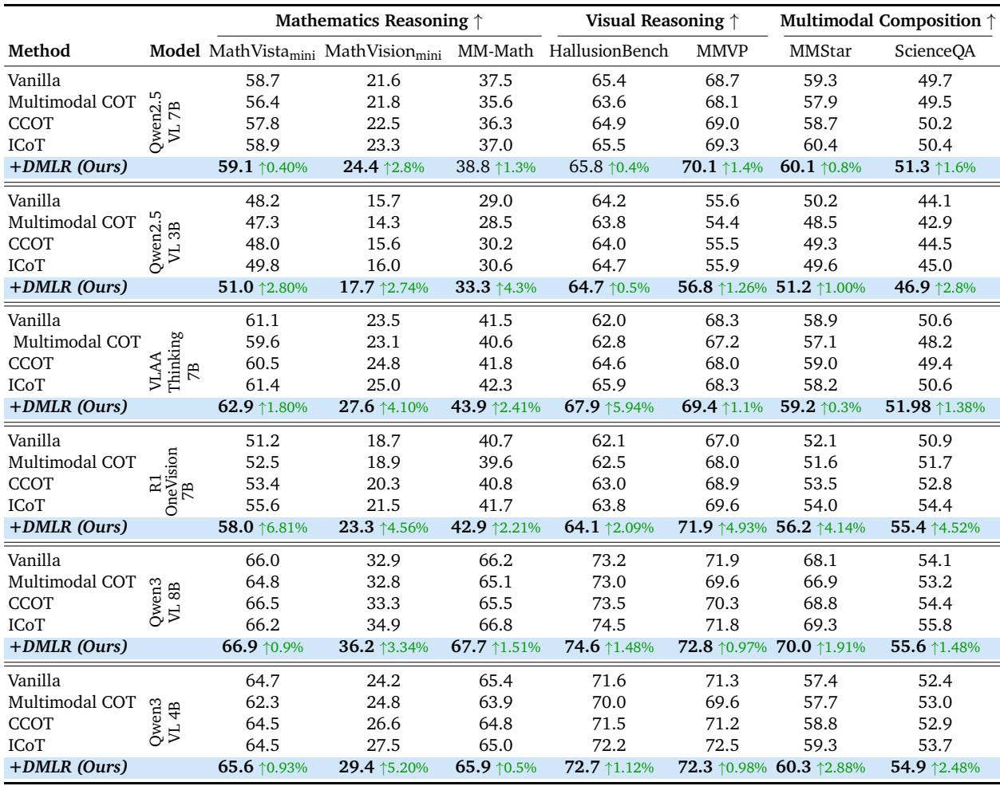

[← 返回 README](../README.md)

# 4. Methodology

## 📌 预览
Methodology 给出 DMLR 的完整机制：冻结 MLLM 参数，只优化 latent think tokens；用 top-k entropy 构造 confidence reward；用 REINFORCE 风格 policy gradient 更新 latent；再通过 Dynamic Visual Injection 选择最有帮助的视觉 patch。

---

# 4. Methodology

# 4.1 Problem Formulation

Given a text input sequence $\mathcal { Q } = \left( q _ { 1 } , \ldots , q _ { k } \right)$ and a set of visual embeddings $\mathcal { Z } = \left( z _ { 1 } , \ldots , z _ { I } \right)$ extracted by a visual encoder, the MLLM $\pi _ { \theta }$ encodes the text sequence into embeddings and incorporates visual features to generate the reasoning sequence $\mathcal { X } = ( x _ { 1 } , x _ { 2 } , \ldots , x _ { N } )$ .

> 💡 **问题形式化**: 输入是文本 query $Q$ 和视觉 embedding $Z$，输出是 reasoning sequence $X$。DMLR 不改变这个生成接口，只在输入序列中额外插入 latent think tokens 并在生成前优化它们。

$$
\pi _ { \boldsymbol { \theta } } ( { \mathcal { X } } \mid q , z ) = \prod _ { n = 1 } ^ { N } \pi _ { \boldsymbol { \theta } } ( x _ { n } \mid { \mathcal { X } } _ { < n } , q , z )
$$

> 💡 **生成公式批读**: 这是标准 autoregressive 分解。DMLR 的区别不在 decoder 形式，而在 decoder 前的 latent state 被 test-time optimization 改写。

where $x _ { < n }$ denotes the sequence of tokens preceding position $n$ . Different from approaches that use the last hidden state of the previous reasoning step as latent think tokens [44, 18], we introduce $L$ learnable latent think tokens into the input sequence, whose embeddings after projection are denoted as $\mathcal { T } = \left[ \pmb { \tau } _ { 1 } , \pmb { \tau } _ { 2 } , \dots , \pmb { \tau } _ { L } \right]$ . These tokens are concatenated with the original inputs and fed into the model. During test-time inference, our core idea is to keep model parameters fixed and improve reasoning solely by optimizing the embeddings of the latent think tokens. Motivated by the observations in Section 3, we define a reward function $\mathcal { R }$ to quantify the confidence of the current latent reasoning state. This leads to the following test-time optimization objective:

> 💡 **latent token 定义**: 这里的 $T$ 是可优化 embedding，不是自然语言 token，也不是上一推理步的 hidden state。冻结参数只更新 $T$，让方法可以接在已有 MLLM 后面，但代价是每个样本都要做一小段 test-time search。

$$
\mathcal { T } ^ { * } = \arg \operatorname* { m a x } _ { \mathcal { T } } \mathcal { R } ( \mathcal { T } , \mathcal { Q } , \mathcal { Z } ) ,
$$

> 💡 **目标函数批读**: 目标是找能最大化 confidence reward 的 latent think tokens。它把 reasoning improvement 转化成连续空间优化问题，而不是生成更多 CoT 文本。

In practice, the model iteratively update the latent think tokens for $T$ steps, allowing them to progressively evolve toward directions that maximize the reward.

> 💡 **实现含义**: 推理时会有多个 optimization steps。README 里要避免把它说成“零额外计算”；更准确是“避免长链文本生成，但引入 latent forward/update 开销”。

# 4.2 Dynamic Multimodal Latent Reasoning

In light of the observations in Section 3, DMLR comprises two key processes: dynamic visual injection strategy for RQ1, and confidence-guided optimization of latent think tokens for RQ2, as shown in Figure 5 and Algorithm 1.

> 💡 **模块映射**: RQ1 问“是否每步都要看图”，对应 DVI；RQ2 问“内部表示能否提示何时需要视觉/推理”，对应 confidence-guided optimization。方法结构和 motivation 是一一对应的。

Latent Think Tokens Initialization. We initialize the latent think tokens before each iteration to facilitate exploration in the latent space. To this end, we adopt a stochastic perturbation strategy that adds controlled randomness while preserving representation stability. Specifically, multiplicative noise sampled from a Gaussian distribution is applied as a local perturbation to the current latent state:

> 💡 **初始化与探索**: 加噪声不是为了 regularization，而是为了在 test-time latent space 里探索更高 reward 的方向。它类似 policy search 的局部扰动。

$$
\boldsymbol { { \mathcal { T } } } ^ { \prime ( t ) } = \boldsymbol { { \mathcal { T } } } ^ { ( t ) } + \boldsymbol { \xi } ^ { ( t ) } , \quad \boldsymbol { \xi } ^ { ( t ) } \sim \mathcal { N } ( 0 , \sigma ^ { 2 } I )
$$

*Figure 5: Overview of the proposed DMLR framework. The model performs exploration through controlled noise (Eq. 5) and iteratively optimizes the latent think tokens via confidence-guided policy updates (Eq. 8–9). Dynamic Visual Injection (Eq. 10) selects and updates the best visual patches during optimization, and the optimized latent tokens are decoded (Eq. 3) to produce the output.*

> 💡 **Figure 5 批读**: 图 5 是方法数据流：latent token 先加噪探索，再用 confidence reward 更新；视觉侧根据 attention/reward 维护 best patches；最后把优化后的 latent tokens 与图文输入一起解码。图中最重要的闭环是 reward 同时影响 latent 更新和视觉 patch 更新。

where $\sigma ^ { 2 }$ is a variance hyperparameter that controls the magnitude of exploration and $\xi ^ { ( t ) }$ is the multiplicative Gaussian noise sampled at iteration $t$ . More analyses and results are shown in Section 5.3.

> 💡 **超参风险**: $\sigma$ 控制探索范围，太小找不到更好 latent，太大会让更新不稳定。后文 Figure 7(b) 正是在验证这个 trade-off。

Reward Formulation. We propose a confidence-guided reward that dynamically optimizes latent think tokens during reasoning. In contrast to prior approaches [45, 30] that use confidence ony for post-hoc evaluation, we treats it as an intrinsic feedback signal that continuously guides latent reasoning optimization. Given the latent think state $\mathscr { T } ^ { ( t ) }$ , the query $q$ , and visual features $z$ , the model $\pi _ { \theta }$ generates token-level probability distributions $\mathcal { P } _ { i } ^ { ( t ) }$ over the vocabulary $w$ . We further quantify the model’s confidence for each latent think token by computing the truncated entropy over its top- $k$ most probable tokens, defined as:

> 💡 **reward 设计**: 真正部署时没有 ground truth，所以作者用 top-k truncated entropy 作为 confidence proxy。低 entropy 表示分布更集中，模型对当前位置更确定；reward 用它的 complement。

$$
\mathcal { H } _ { k } \big ( \mathcal { P } _ { i } ^ { ( t ) } \big ) = - \sum _ { w \in \mathrm { T o p } _ { k } \big ( \mathcal { P } _ { i } ^ { ( t ) } \big ) } \mathcal { P } _ { i } ^ { ( t ) } ( w ) \log \big ( \mathcal { P } _ { i } ^ { ( t ) } ( w ) \big )
$$

> 💡 **熵公式批读**: 只看 top-k 是为了聚焦模型最可能输出的候选，而不是让长尾 vocabulary 噪声主导 entropy。这个 reward 的弱点也明显：更自信不必然更正确，所以需要第 3 节相关性和第 5 节实验兜底。

where $\mathrm { T o p } _ { k } ( \cdot )$ denotes the set of the $k$ tokens with the highest probabilities. A lower value of the entropy $\mathcal { H } _ { k } ( \cdot )$ corresponds to higher confidence in the model’s prediction at that position. The reward for the entire latent reasoning sequence is defined as the complement of the mean truncated entropy computed over all $L$ latent think tokens:

> 💡 **sequence reward**: 对 $L$ 个 latent think tokens 求平均，意味着每个 latent token 都被鼓励形成更稳定的内部预测状态，而不是只优化最后一个 token。

$$
\mathcal { R } ( \mathcal { T } ^ { ( t ) } ) = 1 - \frac { 1 } { L } \sum _ { i = 1 } ^ { L } \mathcal { H } _ { k } ( \mathcal { P } _ { i } ^ { ( t ) } )
$$

> 💡 **reward 方向**: $R$ 越高代表平均 entropy 越低。这里没有显式 accuracy loss，也没有 teacher answer，DMLR 因此是 training-free，但也更依赖模型自身 confidence 的可靠性。

Test-Time Latent Optimization. Recent works [15, 46, 38] have explored test-time gradient optimization to enable adaptation in language tasks, whereas we focus on optimization processes for multimodal latent reasoning. Specifically, during the test-time inference, guided by the objective defined in Equation 7, we adopt a REINFORCE-based [47] direct policy gradient method to adaptively optimize the latent think tokens $\left. T ^ { ( t ) } \right.$ . Assuming that each latent think token is independent, the update rule is formulated as:

> 💡 **优化机制**: 作者用 REINFORCE 风格更新而不是反传到模型参数。独立 token 假设简化了估计，但也可能忽略 latent tokens 之间的组合关系。

$$
\mathcal { T } ^ { ( t ) }  \mathcal { T } ^ { ( t ) } + \eta \nabla _ { \mathcal { T } ^ { ( t ) } } \mathcal { I } ( \mathcal { T } ^ { ( t ) } )
$$

> 💡 **公式解析注意**: MinerU 这里漏掉了赋值箭头，语义应是 $T^{(t)}$ 沿 reward gradient 方向更新。批读时保留原文，但理解上按 “latent update” 读。

where $\eta$ denotes the learning rate. According to the Policy Gradient Theorem and Equation 5, the gradient can be formulated and further expressed as:

$$
\nabla _ { T } \mathcal { J } ( T ) = \mathbb { E } _ { T ^ { \prime } \sim \pi ( \cdot \vert \mathcal { T } ) } \left[ \mathcal { R } ( T ^ { \prime } ) \nabla _ { T } \log \pi ( \mathcal { T } ^ { \prime } \mid \mathcal { T } ) \right] = \mathbb { E } \left[ \mathcal { R } ( T ^ { \prime } ) \frac { \xi } { \sigma ^ { 2 } } \right] .
$$

> 💡 **policy gradient 批读**: 由于扰动来自高斯噪声，score function gradient 可以写成 $R(T')\xi/\sigma^2$ 的期望。直觉是：如果某个噪声方向带来更高 reward，就沿这个方向更新 latent think tokens。

Visual Injection Strategy. Different from methods that directly inject high-attention regions [41], our strategy updates the most informative visual patches based on the reward at each iteration and injects them as latent visual tokens. As illustrated in Algorithm 1, we first use the initial attention of the latent think token to collect $m$ highly relevant image patches (see Section 5.1), which serve as the initial best patch $\mathcal { V } _ { b e s t }$ . At each iteration, the model resamples $m$ candidate patches $\mathcal { Z } _ { c a n d } = \{ \mathcal { Z } _ { 1 } , \ldots , \mathcal { Z } _ { m } \}$ based on the updated attention and injects them together with the previous best patch into the latent sequence for reward, as formulated in Equation 10. If the reward $r > r _ { b e s t }$ , indicating that the candidate patches provide enhanced visual evidence, the best patch $\nu _ { \mathrm { b e s t } }$ is updated; otherwise, the previous best is retained.

> 💡 **DVI 机制拆解**: DVI 不是直接拿最高 attention patch 一路用到底，而是每轮重采 candidate patches，把 candidate 与 previous best 一起放入 latent sequence，再用 reward 判断是否更新 best。这个机制让视觉注入从“看哪里”变成一个带记忆的搜索过程。

$$
r = \mathcal { R } { \left( \mathcal { Z } , \mathcal { Q } , [ { T } ^ { ( t ) } , \mathcal { V } _ { b e s t } , \mathcal { Z } _ { c a n d } ] \right) }
$$

> 💡 **DVI reward 批读**: Eq. 10 把 candidate visual patches 是否有用转成同一个 confidence reward。若加入新 patches 后 reward 更高，就更新 best；否则保留旧 patch，避免视觉噪声反复污染 latent state。

As the iterations progress, the best visual patch converges to the regions most relevant to the latent think state, guiding the latent reasoning toward more effective optimization.

> 💡 **收敛直觉**: 这里的 “converges” 后文 Figure 8 会用 reward 与 selected patch 稳定性来展示。它不是严格优化收敛证明，更像 empirical behavior。

# Algorithm 1: Dynamic Multimodal Latent Reasoning

*Algorithm 1: Dynamic Multimodal Latent Reasoning.*

> 💡 **Algorithm 1 批读**: 算法把两个循环写在一起：先对 latent tokens 做 policy gradient optimization，再在每轮里用 attention select 候选视觉 patches 并根据 reward 更新 best。复现时关键变量是 latent token 数 $L$、candidate patch 数 $m$、优化步数、学习率和噪声尺度。

X ← Decode(T (t), Z , Q) return X

> 💡 **输出阶段**: 最终仍调用原 MLLM 解码答案，只是上下文中多了优化后的 latent think tokens 和视觉 patch 状态。因此 DMLR 是一个 inference-time wrapper，而不是新训练的模型。

# 4.3 Theoretical Analysis

To further understand why DMLR achieves high efficiency and robust performance, we provide theoretical explanations through the following two theorems.

> 💡 **理论节定位**: 这部分给的是 sufficient-style 解释：如果 confidence gradient 和 quality gradient 对齐，confidence ascent 才会改善推理；如果视觉注入提升 latent-visual mutual information，confidence 期望才会提升。

Theorem 4.1 (Confidence Reflects Reasoning Quality). Let $h$ denote the latent reasoning state in DMLR, where $C ( h )$ represents the model’s confidence level and $Q ( h )$ denotes the corresponding reasoning quality. If and only if the gradients of $C ( h )$ and $Q ( h )$ are positively aligned, the DMLR update along the confidence ascent direction will consequently improve the reasoning quality:

$$
\nabla C ( h ) \cdot \nabla Q ( h ) > 0
$$

> 💡 **Theorem 4.1 批读**: 这个定理其实把关键假设摊开了：DMLR 有效依赖 confidence ascent 与 quality ascent 同向。第 3 节和实验支持这种对齐在 benchmark 上常见，但部署到新域时应重新验证。

Theorem 4.2. (Visual Injection Enhances Confidence). Let $\tau$ be the latent reasoning states, $\hat { \tau }$ denote the updated states after visual injection, and $z _ { v }$ be the visual features. Visual injection in DMLR increases the mutual information between latent states and visual features, thereby enhancing the expected confidence $J _ { c o n f } ( { \boldsymbol { T } } ) _ { \cdot }$ , satisfying:

$$
I ( \hat { T } ; z _ { v } ) \geq I ( \mathcal T ; z _ { v } ) \Rightarrow J _ { \mathrm { c o n f } } ( \hat { T } ) \geq J _ { \mathrm { c o n f } } ( \mathcal T )
$$

> 💡 **Theorem 4.2 批读**: 这条理论解释 DVI 的正面作用：视觉注入如果提升 latent state 与相关视觉特征的互信息，就会提高 confidence。反过来，如果 patch 不相关或冗余，互信息/信噪比可能下降，这正是 Table 2 中全量注入不稳的原因。

---

## 🔖 Section 总结

### 关键数字速查
| 变量 | 含义 |
|------|------|
| $L$ | latent think token 数 |
| $m$ | 每轮候选 visual patches 数 |
| $\sigma$ | latent perturbation 噪声尺度 |
| $\eta$ | latent update 学习率 |
| $R$ | 1 - 平均 top-k truncated entropy |

### 核心洞察
1. DMLR 把多模态推理变成 test-time continuous optimization 问题。
2. confidence reward 是方法核心，也是最大风险点：它便宜、无标签，但不是 correctness oracle。
3. DVI 的本质是 reward-gated visual memory，保留能提高 confidence 的 patch，拒绝冗余视觉噪声。

### Q&A 批注记录
- **Q: DMLR 改了模型参数吗？**
  A: 不改。它冻结 $\theta$，只优化输入侧 latent think token embeddings。
- **Q: 为什么不用全图或全部 patch？**
  A: 第 3 节显示视觉依赖稀疏；第 5 节 Table 2 显示全量注入会带来不稳定。
