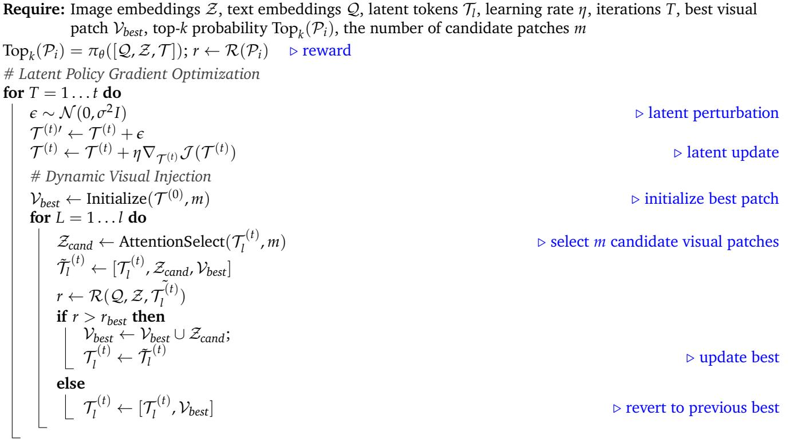
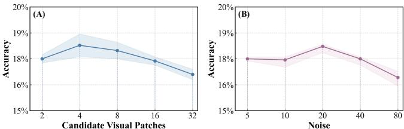
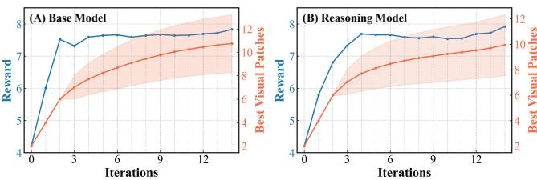
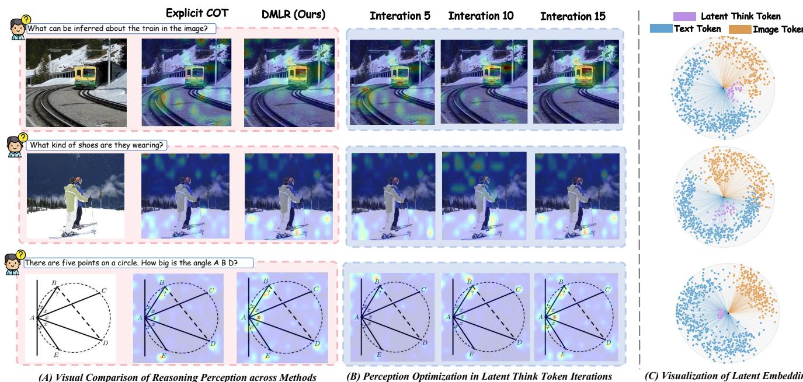
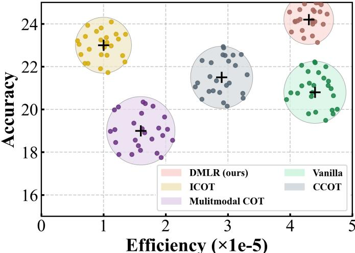

[← 返回 README](../README.md)

# 5. Experiments

## 📌 预览
实验按证据链展开：先说明 backbone、benchmark 和超参，再看主结果是否普遍提升，随后用消融验证 DVI、迭代次数、噪声尺度、patch 数和 latent token 数，最后看 grounding、latent 分布和效率。

---

# 5. Experiments

# 5.1 Experiment Setup

Baselines. We evaluate the proposed DMLR using two types of baselines: model-based and method-based. For the model baselines, we consider six representative MLLMs, including two reasoning models, R1- OneVision [48] and VLAA-Thinking [49], as well as four non-reasoning models, Qwen2.5-VL-3B/7B [42] and Qwen3-VL-4B/8B [50]. For method baselines, we consider two reasoning paradigms: Text-only Reasoning (CCoT [51]) and Vision-Text Involved Reasoning (ICoT [41], Multimodal-CoT [52]). We further include a Vanilla baseline where non-reasoning models answer directly and reasoning models use their default prompts.

> 💡 **baseline 设计**: 模型维度覆盖 Qwen2.5、Qwen3、R1-OneVision、VLAA-Thinking；方法维度覆盖 Vanilla、text-only CCoT、vision-text ICoT/Multimodal-CoT。这样能检验 DMLR 是不是只对某个 backbone 或某类 prompt 有效。

Evaluation Benchmarks. We evaluate our method on three tasks across six benchmarks: (1) Mathematics Reasoning (MathVista $\mathrm { \ m i n i }$ [53], MathVision $\mathrm { \ m i n i }$ [54], MM Math [55] ); (2) Visual Reasoning (Hallusion-Bench [56], MMVP [24]); (3) Multimodal Composition (MMStar [57], ScienceQA [58]). Details are provided in Appendix A.1.

> 💡 **任务覆盖**: 正文说 “six benchmarks”，但列出了 7 个：MathVista mini、MathVision mini、MM-Math、HallusionBench、MMVP、MMStar、ScienceQA。README 里按 7 个 benchmark 记录，与摘要和 Table 1 一致。

Implementation Details. All frameworks adopt the eager attention mode to enable access to internal attention maps. A total of 4 latent think tokens $\tau$ are used, with $m = 2$ visual candidate patches injected at each iteration. The defaultnumber of optimization iterations is set to 15, with a learning rate of $1 0 ^ { - 3 }$ . To ensure stable exploration in the latent space, the perturbation magnitude $\sigma$ is set to $1 0 \%$ . All experiments are conducted on four NVIDIA H100 GPUs, with further detailed parameter analyses in Appendix A.3.

> 💡 **实现细节批读**: eager attention 是 DVI 的工程依赖，因为需要内部 attention map 选 patch。默认配置是 4 latent tokens、每轮 2 个 candidate patches、15 步、lr=1e-3、$\sigma=10\%$。这说明 DMLR 不需要训练，但推理部署需要能访问 attention 且要承担 15 步优化成本。

# 5.2 Main Results

Overall Results. As shown in Table 1, models integrated with DMLR achieve the best performance on over $9 5 \%$ of tasks. On mathematical and visual reasoning benchmarks, Qwen2.5-VL-7B achieves average improvements of $+ 1 . 5 \%$ in mathematics and $+ 0 . 9 \%$ in visual reasoning, while the reasoning counterpart R1-OneVision attains average gains of $+ 4 . 5 \%$ and $+ 3 . 4 5 \%$ on the two domains, respectively. These results indicate that DMLR generalizes robustly across diverse model paradigms and scales. Unlike other baseline methods that often involve trade-offs between reasoning and perception, DMLR consistently improves performance in both domains. For instance, while ICoT yields noticeable gains on mathematical tasks but provides only limited improvements on visual reasoning (e.g., MMVP), DMLR delivers more stable cross domain enhancements, with DMLR-integrated VLAA-Thinking averaging $+ 2 . 4 3 \%$ higher across all benchmarks.

> 💡 **主结果解读**: 这段给出三类关键信号：超过 95% 任务最佳，非 reasoning 模型 Qwen2.5-VL-7B 也能涨，reasoning 模型 R1-OneVision 涨幅更大。说明 DMLR 不是只给弱模型补丁，也能增强已有 reasoning model。

*Table 1: Comparison of different reasoning methods and DMLR across various benchmarks. All metrics are reported in Accuracy (%). Results are evaluated over a diverse suite of mathematics reasoning, visual reasoning, and multimodal composition tasks under multiple backbone models.*

> 💡 **Table 1 批读**: Table 1 是论文最核心证据。DMLR 在 Qwen2.5-VL-3B 上 MathVista 从 48.2 到 51.0、MM-Math 从 29.0 到 33.3；在 R1-OneVision 上 MathVista 从 51.2 到 58.0、MMVP 从 67.0 到 71.9。增益覆盖数学、视觉和组合任务，支撑“不是单一指标调参”的 claim。

# 5.3 Ablation Study

Table 2: Ablation on Latent Visual Injection. We compare different injection strategies across multiple benchmarks. All injects all visual patches at every iteration, while Ours injects the best visual patches. Refer to Section 5.1 for detailed settings.

*Table 2: Ablation on Latent Visual Injection. w/o Injection, all-patch injection, and DVI best-patch injection across MathVista, MathVision, MMStar, and ScienceQA.*

> 💡 **Table 2 批读**: DVI 在四个任务上都是三者最高：MathVista 0.634、MathVision 0.340、MMStar 0.694、ScienceQA 0.549。关键对比是 +Injection(All) 不等于更好，MathVista 和 ScienceQA 甚至低于 w/o Injection，说明“看更多”会引入冗余视觉噪声。

Impact of Visual Injection Strategies. We evaluate various visual injection strategies to assess their effects on reasoning performance. As shown in Table 2, removing visual injection maintains stable reasoning results but leads to a clear drop in perceptual accuracy, underscoring the necessity of visual cues during latent optimization. Injecting all visual patches enhances perception but introduces instability due to redundant visual information. In contrast, DMLR exhibits consistently more stable performance, indicating that its continuously selects more relevant and stable visual information throughout the iterative optimization.

> 💡 **消融结论**: 这一段验证 DVI 的必要性：没有视觉注入会少证据，全量注入会多噪声，reward-gated best patch 是中间最稳解。这和第 3 节“视觉依赖稀疏”呼应。

Impact of Iteration Number. As shown in Figure 6, increasing the number of iterations leads to a steady improvement on both reasoning and perception tasks, indicating that iterative optimization effectively enhances latent reasoning. Morever, the reasoning model maintains consistently higher accuracy throughout the process and continues to yield gains even after multiple iterations, demonstrating a stronger ability to benefit from iterative refinement.

> 💡 **迭代次数批读**: 如果迭代越多越好，说明 latent token 不是一次性 prompt trick，而是在优化过程中逐步变成更有用的内部状态。这里也提示 latency 与性能存在可调 trade-off。

Impact of Noise Scale. We further analyze the influence of the perturbation magnitude $\sigma$ on latent optimization. As shown in Figure 7(b), increasing the initial noise scale promotes effective exploration, allowing the model to cover a wider range of latent trajectories and identify higher-confidence reasoning paths. However, when $\sigma$ becomes excessively large, the injected perturbation makes the updates unstable, leading to a subsequent drop in performance. This indicates that latent reasoning benefits from only a modest level of perturbation.

> 💡 **噪声尺度批读**: $\sigma$ 是 exploration knob。太小容易困在当前 latent，太大破坏语义稳定性。论文默认 10%，附录还提到 decay factor 0.95，说明它不是可忽略细节。

Impact of Visual Patch Number. As shown in Figure 7(a), performance improves when a moderate number of candidate visual patches are injected, whereas injecting an excessive number of patches leads to a clear decline. This trend indicates that a limited number of candidates is sufficient for effective updates, while excessive patches introduce redundant visual information that negatively affect optimization. Furthermore, Figure 8 shows that as the iterations progress, the reward steadily increases and the selected best patch becomes increasingly stable, exhibiting a clear convergence trend. This trend indicates that the dynamic injection strategy does not continually introduce additional visual patches into the latent space, but instead converges toward a small set of highly relevant patches during optimization.

> 💡 **patch 数批读**: 视觉 patch 数和效果不是单调关系。DMLR 的优势在于保留少数稳定 patch，而不是扩大视觉上下文。Figure 8 的 reward/patch 稳定性则说明 DVI 有“收敛到相关区域”的行为。

*Figure 6: Effect of iterations on performance. For both the base model and the reasoning model, accuracy on both datasets increases as the number of iterations grows.*

> 💡 **Figure 6 批读**: 图 6 支撑 latent optimization 的过程性收益：更多 iteration 带来更高 accuracy。应用时可以把 iteration 数当成 test-time compute budget。

*Figure 7: (A) Effect of the number of injected candidate visual patches on performance. (B) Impact of noise magnitude (%) on performance. All results are evaluated on the MathVision dataset.*

> 💡 **Figure 7 批读**: 图 7 同时回答“看多少”和“探索多大”。候选 patch 数适中最好，噪声尺度也适中最好，说明 DMLR 的稳定性来自受控搜索，而不是无限增加视觉信息或扰动。

*Figure 8: Confidence reward and best visual patch injection across iterations. Both the base model and the reasoning model exhibit a clear positive correlation.*

> 💡 **Figure 8 批读**: 这张图是 DVI 的行为证据：reward 上升时 selected best patch 也趋于稳定。它说明 DVI 不是每步随机换视觉证据，而是在优化中逐步锁定相关区域。

*Figure 9: Effect of the number of latent tokens. Increasing the number of latent tokens initially improves performance, but excessive tokens lead to noticeable degradation.*

> 💡 **Figure 9 批读**: latent token 数也不是越多越好。2-4 个较稳，太多会让优化空间变大、状态更不稳定。论文默认 4 个 latent think tokens 是从这个消融来的。

Number of Latent Think Tokens. We further evaluate the impact of the number of latent think tokens on overall performance. As shown in Figure 9, setting the number of latent tokens to a small range (2–4) yields stable improvements on both reasoning and perception tasks. However, as the number of tokens continues to increase, performance on both tasks begins to decline, with the reasoning model exhibiting more pronounced fluctuations. This overall trend indicates that increasing the number of latent tokens beyond a moderate level does not provide additional benefits and instead makes the optimization process less stable.

> 💡 **latent 数量结论**: 这段给复现一个很实用的提示：不要把 latent token 数当成免费 compute。超过适中范围后，连续空间优化更难，可能拖累 reasoning model 的稳定性。

# 5.4 Quantitative Analysis

Visual Grounding Analysis. We visualize the attention heatmaps of VLAA-Thinking during the reasoning process. As shown in Figure 10(a), the explicit CoT baseline often shifts its attention toward task-irrelevant regions, whereas DMLR maintains a stable focus on task-relevant areas. This demonstrates that latent multimodal reasoning produces more consistent and reliable visual grounding throughout the reasoning process. Figure 10(b) further shows the evolution of attention across iterations. The attention distribution gradually converges toward task-relevant regions in models integrated with DMLR, reflecting a more stable and consistent focus throughout the optimization.

> 💡 **grounding 可视化**: 作者用 VLAA-Thinking 的 attention heatmap 说明 DMLR 不只是答案更准，也改变了视觉关注路径：显式 CoT 可能漂移到无关区域，DMLR 更稳定地收敛到任务相关区域。

*Figure 10: Qualitative analysis of our DMLR framework. (A) Visual comparison of visual grounding behaviors between Explicit CoT and DMLR across diverse queries. DMLR produces more focused and stable visual grounding than explicit CoT. (B) Perception optimization across latent think token iterations, where visual attention becomes progressively sharper and better aligned with relevant regions. (C) Visualization of latent embeddings showing the geometric separation of latent think tokens, text tokens, and image tokens, illustrating the structured organization of the latent reasoning space.*

> 💡 **Figure 10 批读**: A/B 看视觉注意力是否更稳定，C 看 latent think tokens 在 embedding 空间是否形成独立簇。C 的价值是说明 latent tokens 不是简单贴近文本或图像 token，而是在两者之间形成跨模态中间表示。

Latent Behavior Analysis. We visualize the final distributions of latent think tokens, text tokens, and image tokens using t-SNE [59] to analyze the effect of the iterative optimization on the latent reasoning. As shown in Figure 10(c), the latent think tokens form a tight cluster that is well separated from both text and visual embeddings, and are located in a stable intermediate region between the two modalities. This distribution suggests that the optimized latent tokens become modality-independent, forming a unified cross-modal semantic representation. The compactness of the cluster further indicates that the optimization process yields more stable and consistent latent reasoning states.

> 💡 **latent 行为解读**: t-SNE 不能证明 causal mechanism，但能给出直观证据：优化后的 latent think tokens 不是噪声散点，而是稳定聚簇。对 latent-space-processing 方向，这说明“思考状态”可能有独立几何结构。

Inference Efficiency Analysis. As shown in Figure 11, different reasoning paradigms exhibit distinct tradeoffs between accuracy and efficiency. The explicit methods such as Multimodal CoT rely on long-chain text generation, incurring substantial computational overhead. Although ICoT enhances reasoning to some extent, it injects a large volume of visual information during decoding, which significantly slows inference. In contrast, DMLR performs optimization entirely within the latent space, introducing no additional sequence generation cost. Moreover, its dynamic visual injection strategy selects only the relevant visual patches to the current latent state at each iteration, eliminating redundant visual computation. By preserving accuracy gains while reducing inference overhead, DMLR achieves a more favorable balance between efficiency and performance.

> 💡 **效率批读**: 这里的效率优势主要来自“不生成长链文本”和“不全量注入视觉”。但 DMLR 仍有 15 次 latent optimization，实际部署要看 batch time、attention map 开销和硬件支持。

*Figure 11: Comparison of efficiency and accuracy across various reasoning methods on the MathVision Benchmark. DMLR achieves the best overall trade-off, delivering higher accuracy while maintaining strong inference efficiency. The $\mathbf { X }$ -axis reports the efficiency metric (Acc/AvgBatchTime)2.*

> 💡 **Figure 11 批读**: Figure 11 把 accuracy 和效率放在同一图上，支撑 DMLR 的“快且准”claim。横轴使用 $(Acc/AvgBatchTime)^2$，会放大准确率和速度的乘积差异；读图时要记住它不是纯 latency，而是复合效率指标。

---

## 🔖 Section 总结

### 关键数字速查
| 指标 | 数值 |
|------|------|
| Backbone | Qwen2.5-VL-3B/7B, Qwen3-VL-4B/8B, R1-OneVision, VLAA-Thinking |
| Benchmark | MathVista mini, MathVision mini, MM-Math, HallusionBench, MMVP, MMStar, ScienceQA |
| latent think tokens | 4 |
| candidate patches | $m=2$ |
| optimization iterations | 15 |
| learning rate | $1e^{-3}$ |
| perturbation | $\sigma=10\%$ |
| GPUs | 4 x NVIDIA H100 |

### 核心洞察
1. DMLR 的主结果覆盖 6 个 backbone 与 7 个 benchmark，普适性证据较强。
2. DVI 消融说明视觉注入要“少而准”，全量视觉 patch 不是免费增益。
3. 迭代数、噪声、patch 数、latent token 数都存在稳定区间，复现需要认真调参。

### Q&A 批注记录
- **Q: DMLR 的收益主要来自视觉注入还是 latent optimization？**
  A: Table 2 说明 DVI 是感知收益的关键；Figure 6 说明 iterative latent optimization 本身也持续提升。两者是叠加机制。
- **Q: 为什么默认 4 个 latent tokens？**
  A: Figure 9 显示 2-4 个较稳定，更多 token 会让优化不稳。
