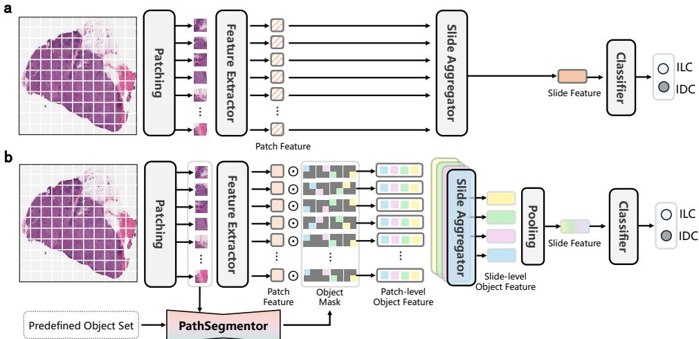

[← 返回 README](../README.md)

# 03 Methodology

## 📌 内容预览

方法论分为三部分：(1) PathSeg 数据集构建（数据采集、层级标签重格式化、数据标准化），(2) PathSegmentor 架构（图像/文本编码器、联合特征交互模块、目标函数），(3) 可解释癌症诊断（分类-分割和分割-分类两条管道）。

---

## 原文 (Section 4 Methods)

### 4.1 PathSeg Dataset Construction

In this work, we create the PathSeg dataset by integrating 21 publicly available pathology image segmentation datasets, totaling 275k image-mask-label triples. The statistical details and download links of each dataset are presented in Supplementary Table A1. The diverse pathology image samples included in the PathSeg dataset cover 20 anatomical regions, 3 histological structures, and 61 object types.

However, integrating these datasets for training presents two key challenges. 1) Ambiguous labels. Original labels typically specify only object types while neglecting critical anatomical and histological context. For instance, identically labeled cells from different anatomical regions exhibit distinct morphological characteristics, yet current labels fail to capture these biologically meaningful differences. Besides, identical labels may describe distinct biological entities across datasets, such as tumor variably denotes either tumor tissue or tumor cells. This definitional ambiguity critically necessitates standardized label hierarchies that explicitly distinguish between anatomical regions and histological structures. 2) Heterogeneous data. Pathology image datasets exhibit substantial variations in image characteristics, including scales of patch or whole-slide images, image resolutions ranging from 256 x 256 to 5412 x 7215, and magnification levels of 100x, 40x, 20x, 10x. Such inconsistencies prevent the model from learning unified feature representations. In the following parts, we present details of label reformat and data standardization.

**Hierarchical label reformat.** To avoid potential ambiguity and confusion, we rename the semantic labels in a three-level hierarchical structure, defined as [anatomical region] - [histological structure] - [object type], where [anatomical region] and [histological structure] are derived from the official metadata, and [object type] preserves the original dataset annotation without additional modification. Note that if a dataset does not specify the anatomical region for each image, the [anatomical region] field should be marked as unspecified. Cells annotated with region-wise masks instead of individual cell-wise masks, such as plasma cells and smooth muscle cells, are classified under the histological structure category of tissue. As a result, we obtain 20 anatomical regions, 3 histological structures, and 61 object types (statistics detailed in Supplementary Table A2, Table A3 and Table A4), yielding a total of 160 hierarchical semantic labels (statistics detailed in Supplementary Table A5).

**Data standardization.** Prior to model training, we perform data preprocessing to standardize images from different datasets. The processing includes the following steps on both images and corresponding masks.

1) Magnification normalization. According to dataset metadata, images from 12 datasets in the PathSeg dataset have an initial magnification of 40x (Supplementary Table A1). To standardize magnification, images from the remaining datasets are rescaled to 40x using bilinear interpolation, while the corresponding masks are rescaled using nearest-neighbor interpolation. This approach ensures that the same object type maintains a relatively consistent size across different images, preventing significant variations in appearance.

2) Patching. Whole-slide images are split into a series of image patches using a sliding window. For any image dimension D in height or width, if it exceeds 1500 pixels, we apply a sliding window of size 1024. The uniform overlap between adjacent patches is calculated as ((1024 x ceil(D/1024)) - D) / (ceil(D/1024) - 1). This ensures complete coverage while maintaining spatial regularity. The same method is applied to corresponding masks.

3) Resolution standardization. Image patches are resized to a consistent 1024 x 1024 resolution via bilinear interpolation, and the mask patches are resized using nearest-neighbor interpolation. This unified input dimension facilitates batch processing during training.

Finally, we split the datasets for model training and testing (Supplementary Table A1). We use the official split when available. If no official split is provided, we randomly divide the original dataset into 80% for training and 20% for testing.

### 4.2 PathSegmentor Architecture

We develop PathSegmentor, a pathology segmentation foundation model that can handle a wide spectrum of pathological objects using textual prompts. Formally, each segmentation sample is represented as a triplet (x, y, t), where x in R^{HxWx3} is the input pathology image, y in R^{HxW} is the binary mask annotation, t is the textual prompt describing the target object. As depicted in Fig. 2a, PathSegmentor follows SEEM [16] with three key components, including an image encoder Phi_image that extracts visual features of the pathology image, a text encoder Phi_text that generates semantic embeddings from the textual prompt, and a joint feature interaction module Phi_joint where learnable queries fuse multi-modal features through cross-attention and self-attention mechanisms. Overall, the model predicts the object mask ŷ in the image x using the textual prompt t:

ŷ = Phi_joint( Phi_image(x), Phi_text(t) ).   (1)

**Image encoder.** We employ a FocalNet model [53] as our image encoder Phi_image. For an input pathology image x, the encoder is used to extract visual features represented as a sequence of m tokens with a channel dimension d:

F_image = Phi_image(x) in R^{m x d}.   (2)

**Text encoder.** The text encoder Phi_text utilizes a PubMedBERT model [54] to process textual prompts specifying the target object and generate text features of length L:

F_text = Phi_text(t) in R^{L x d}.   (3)

> 💡 **文本提示生成模板**：`[histological structure]-level [object type] in [anatomical region] pathology`。
> 例如：`"tissue-level tumor in breast pathology"`, `"nuclei-level neoplastic in lung pathology"`。与 BiomedParse 的模板 `[object type] in [anatomical region] pathology`（缺少组织学结构层级）相比，显式编码了目标对象的尺度信息。

**Joint feature interaction module.** As illustrated in Fig. 2b, we employ a set of learnable queries q in R^{n x d}, where n is the number of queries, to effectively extract geometric and semantic information regarding the segmentation target. These queries interact with image features F_image and text features F_text through cross-attention and self-attention layers [33, 34].

First, the learnable queries q in R^{n x d} interact with image features F_image in R^{m x d} via a multi-head cross-attention layer. Specifically, with q as the query and F_image as both the key and value, we obtain the image-enhanced queries q' as:

```
q' = MultiHead-CrossAttn(q, F_image)
   = Concat(head_1, ..., head_h) W_O_c in R^{n x d},
head_i = Softmax( Q_c^{(i)} (K_c^{(i)})^T / sqrt(d_h) ) V_c^{(i)} in R^{n x d_h},   (4)
```

where Q_c^{(i)} = q W_Q_c^{(i)}, K_c^{(i)} = F_image W_K_c^{(i)}, and V_c^{(i)} = F_image W_V_c^{(i)} are the linear projections for the i-th attention head, with projection matrices W_Q_c^{(i)}, W_K_c^{(i)}, W_V_c^{(i)} in R^{d x d_h}. The outputs of all heads are concatenated and projected using W_O_c in R^{h d_h x d}. The term sqrt(d_h) is a scaling factor to stabilize training.

Second, the image-enhanced queries q' in R^{n x d} are concatenated with text features F_text to perform multi-head self-attention. Specifically, [q' || F_text] in R^{(n+L) x d} serve as the query, key, and value for computing the joint features F_joint, formulated as:

```
F_joint = MultiHead-SelfAttn([q' || F_text])
        = Concat(head_1, ..., head_h) W_O_s in R^{(n+L) x d},
head_i = Softmax( Q_s^{(i)} (K_s^{(i)})^T / sqrt(d_h) ) V_s^{(i)} in R^{(n+L) x d_h},   (5)
```

where Q_s^{(i)} = [q' || F_text] W_Q_s^{(i)}, K_s^{(i)} = [q' || F_text] W_K_s^{(i)}, and V_s^{(i)} = [q' || F_text] W_V_s^{(i)}. The projection matrices W_Q_s^{(i)}, W_K_s^{(i)}, W_V_s^{(i)} in R^{d x d_h} are specific to the i-th attention head, and the final output projection matrix is W_O_s in R^{h d_h x d}.

Third, the joint features F_joint are passed through a feed-forward network, denoted as FFN, to obtain enhanced features F_joint':

F_joint' = FFN(F_joint) = MLP(F_joint) in R^{(n+L) x d},   (6)

where FFN is composed of a two-layer multilayer perceptron (MLP) with a non-linear activation function between the layers. The first n tokens of F_joint' corresponding to the image-enhanced queries q' are extracted and denoted as the semantic-aware queries q'' in R^{n x d}, which integrate information from both image and text features, enabling semantic segmentation mask generation.

Finally, the semantic-aware queries q'' in R^{n x d} are processed through two parallel projection heads, including a mask projector P_mask to generate mask embeddings E_mask = P_mask(q'') in R^{n x d}, and a class projector P_cls to produce category embeddings E_cls = P_cls(q'') in R^{n x d}. The mask projector P_mask is implemented as a three-layer MLP, whereas the class projector P_cls is realized using a single fully connected layer. Note that each query in q'' generates a corresponding mask embedding and a class embedding. The mask embeddings E_mask = {e_mask^i}_{i=1}^n are used to decode candidate mask logits, representing the probability of each pixel belonging to the segmentation target. The class embeddings E_cls = {e_cls^i}_{i=1}^n encode the semantic information of the candidate masks, which can be used to classify their categories. The final segmentation mask is selected by matching class embeddings with the input text prompt's global embedding F_text', which corresponds to the last token of F_text:

ŷ = e_mask^j,  j = argmax_i Sim(e_cls^i, F_text'),   (7)

where the similarity metric Sim() is defined as cosine similarity.

**Objective function.** We optimize the model using a loss function combining binary cross-entropy (BCE) and Dice loss. For a ground-truth mask y in {0,1}^{HxW} and predicted mask ŷ in {0,1}^{HxW}, the per-sample loss is computed as:

L(y, ŷ) = lambda_1 L_bce + lambda_2 L_dice,   (8)

L_bce = -1/(HW) sum_{i,j} ( y_{ij} log(ŷ_{ij}) + (1-y_{ij}) log(1-ŷ_{ij}) ),   (9)

L_dice = 1 - (2 sum_{i,j} y_{ij} ŷ_{ij} + epsilon) / (sum_{i,j} y_{ij} + sum_{i,j} ŷ_{ij} + epsilon),   (10)

where lambda_1, lambda_2 are weighting hyperparameters, epsilon is used for numerical stability.


*Fig. 2: Overview of PathSegmentor. a, The text-prompted framework of PathSegmentor, comprising an image encoder, a text encoder, and a joint feature interaction module. b, The details of the joint feature interaction module, where learnable queries interact with image features and text features through cross-attention and self-attention. c, PathSegmentor can handle diverse segmentation across anatomical regions and histological structures.*

### 4.3 Explainable Cancer Diagnosis

To demonstrate how the comprehensive segmentation capability of PathSegmentor can support explainable cancer diagnosis, we investigate two analyses, including a classification-segmentation pipeline for object-based feature importance estimation and a segmentation-classification framework for imaging biomarker discovery.

#### 4.3.1 Breast Cancer Subtyping Dataset

The experiments are conducted on a breast cancer subtyping dataset derived from the TCGA-BRCA dataset [42], which includes 787 slides of invasive ductal carcinoma (IDC) and 198 slides of invasive lobular carcinoma (ILC). For training and evaluation, the dataset was label-stratified into train-validation-test folds in a ratio of 7:1:2, resulting in 689 slides for training, 99 slides for validation, and 197 slides for testing.

#### 4.3.2 Classification-Segmentation for Feature Importance Estimation

To enhance the explainability of classification models for cancer diagnosis, we construct a classification-segmentation pipeline. PathSegmentor's segmentation capability can be used to explain a standard classification model through object-based feature importance estimation.

First, we train a standard model [55] based on WSIs for cancer diagnosis (Fig. 11a), which involves patch feature extraction, slide aggregation, and diagnostic prediction. In the patch feature extraction step, the input WSI is divided into N non-overlapping patches X = {X_i}_{i=1}^N. Each patch X_i in R^{HxWx3} is fed into a feature extractor f to obtain patch features P_i = f(X_i) in R^{hxwxd}. For slide aggregation, the average pooled patch-level features P in R^{Nxd} are then aggregated into a slide-level representation S = phi(P) in R^d through a slide aggregator phi. Finally, the slide-level feature S is fed into a classifier g for IDC and ILC classification, resulting in predictions Ŷ = g(S). The diagnosis model is trained using the standard cross-entropy loss, which minimizes the difference between the prediction Ŷ and the ground-truth label Y:

L_ce = -(Y log Ŷ + (1-Y) log(1-Ŷ)).   (11)

After training the classification model, the importance of each pathological object o_i is calculated as the ratio between the perturbation loss and the original loss, defined as:

IMP_i = loss_pert^i / loss_orig.   (12)

Here, the original loss_orig denotes the cross-entropy loss produced by the network without any input perturbation. To compute the perturbation loss loss_pert^i of the object o_i, we first use PathSegmentor to segment the object o_i, then apply blurring to its corresponding region in the WSI. This modified image is then fed through the trained classification model to obtain the perturbation cross-entropy loss. The feature importance estimation is conducted on the validation and test set.


*Fig. 11: Model architectures of the standard model and the object-aware model for cancer diagnosis on WSIs. a, The standard model consists of patch feature extraction, slide aggregation, and classification. b, The object-aware model incorporates PathSegmentor to decompose patch-features into object-features for object-based visual explanations.*

#### 4.3.3 Segmentation-Classification for Imaging Biomarker Discovery

We build a segmentation-classification framework to enable object-aware visual explanations for imaging biomarker discovery. Specifically, we modify the standard WSI diagnosis model to an object-aware approach through integration with PathSegmentor's segmentation capabilities (Fig. 11b). The modified pipeline consists of four stages, including patch feature extraction, object-aware feature generation, slide aggregation, and diagnostic prediction.

First, the input WSI is divided into N non-overlapping patches X = {X_i}_{i=1}^N. Each patch X_i in R^{HxWx3} is fed into a feature extractor f to obtain patch features P_i = f(X_i) in R^{hxwxd}. Next, PathSegmentor segments L predefined pathological objects within each patch, resulting in object masks M_i = {M_i^j}_{j=1}^L, where M_i^j in R^{hxw} is resized to match the same shape of patch features. Patch features are then decomposed into object-specific features O_i through element-wise multiplication with corresponding object masks and masked average pooling:

O_i in R^{Lxd}, where O_i^j = MaskedAvgPool(P_i * M_i^j) in R^d.   (13)

Subsequently, parallel aggregators phi = {phi_j}_{j=1}^L, one for each object class, combine patch-level object features O^j in R^{Nxd} into slide-level object features S^j = phi_j(O^j) in R^d. Finally, all slide-level object features are pooled into a unified slide feature S_bar = AvgPool({S^j}_{j=1}^L) in R^d and passed through a classifier g to generate final predictions Ŷ = g(S_bar). We employ the cross-entropy loss to minimize the difference between the predictions Ŷ and the ground-truth label Y.

**Patch-based Class Activation Map.** For the standard classification framework, we generate the activation maps that highlight the most discriminative patches in the WSI. Given the averaged patch features P_i in R^d, attention weights alpha_bar in R^N from the MIL module, and classifier weights W in R^{dxC} for C classes. With regard to the predicted class c, we calculate the activation value of the i-th patch by taking the dot product between the weighted patch features P_i alpha_i in R^d and the corresponding weight W^c in R^d. The resulting activation value can be regarded as part of the final logit for class c, and thus directly reflects the patch's contribution to the classification:

A_i^c = sum_d W_d^c * P_{i,d} alpha_i.   (14)

The activation value A^c(x,y) at spatial location (x,y) is defined by:

A^c(x,y) = A_i^c, if (x,y) in Patch i.   (15)

**Object-aware Class Activation Map.** From our object-aware classification model, we generate the object-aware CAM that can reflect which specific objects contribute most to the prediction. Given the slide-level object feature S^j in R^d and the weights of the classifier W in R^{dxC}, we focus on the predicted class c by selecting the corresponding class-specific weight vector W^c in R^d. Similar to the method used in the patch-based activation map, the activation value of the j-th object is computed as the dot product between S^j and W^c, which can be viewed as a partial classification logit and quantifies the object's contribution to the prediction result.

A_j^c = sum_d W_d^c * S_d^j.   (16)

The activation value A^c(x,y) at spatial location (x,y) on the WSI is defined by:

A^c(x,y) = A_j^c, if (x,y) in Object j.   (17)


*Fig. 10: PathSegmentor supports explainable cancer diagnosis. a, A classification-segmentation pipeline for object-based feature importance estimation. Features whose perturbation significantly increases model error are identified as important predictors. b, A segmentation-classification framework for imaging biomarker discovery through object-aware class activation maps, which highlight the most discriminative regions with pathological identification.*

### 4.4 Implementation Details

**Pathology image segmentation.** The input images are resized to 1024 x 1024. During the training phase, data augmentations are applied to samples, including random resizing via ResizeScale with a scale range of [0.9, 1.1] followed by fixed-size cropping via FixedSizeCrop to a target resolution of 1024 x 1024. PathSegmentor is trained for 20 epochs with a batch size of 32. We use the AdamW [56] optimizer with a base learning rate of 8e-4 and a weight decay of 5e-2. The values of lambda_1 and lambda_2 used in the loss function are both set to 1. PathSegmentor is initialized using BiomedParse's model weights, and all its parameters are trained. PathSegmentor is implemented in PyTorch [57] and runs on four NVIDIA H20 Tensor Core GPUs.

**Explainable cancer diagnosis.** For both standard and object-based cancer diagnosis models (Fig. 11), we employ the image encoder of CONCH [28] as a frozen feature extractor, training only the slide aggregator and classifier. We adopt Attention-Based Multiple Instance Learning (ABMIL) [58] as the slide aggregator and a fully connected layer as the classifier. Following the CLAM [59] toolkit's preprocessing pipeline, we extract patches with 1024x1024 pixels at level 0 for all slides, resizing them to 224x224 pixels while excluding slides with insufficient tissue area. We use the Adam [60] optimizer with a learning rate of 2e-4 and a weight decay of 1e-5. The diagnosis models are implemented in PyTorch [57] and run on one NVIDIA GTX3090 GPU.

**Objects used in explainability analysis.** From the 47 initially segmented breast tissue objects (Supplementary Table A2), we apply a Dice score threshold (0.4) to select 21 high-performance pathological objects for imaging biomarker discovery analysis, ensuring reliable segmentation quality for downstream tasks. For feature importance estimation, we further refine this set to the 12 objects most diagnostically relevant to IDC/ILC differentiation according to medical literature [46, 61]. In the implementations of imaging biomarker discovery, we augment these 21 objects with an other class encompassing all remaining WSI regions, thereby maintaining comprehensive tissue coverage. The detailed lists of pathological objects utilized in each experiment are provided in Supplementary Table A20.

### 4.5 Evaluation Metrics

**Segmentation.** To evaluate the segmentation performance of PathSegmentor and other competing models, we employ the Dice score [62], a standard metric for evaluating medical image segmentation. This score quantifies the overlap between model's prediction Ŷ and ground truth Y, and is formally defined as follows:

Dice(Ŷ, Y) = 2|Ŷ cap Y| / (|Ŷ| + |Y|).   (18)

**Object characteristics quantitation.** We adopt three quantitative metrics that assess shape irregularity, instance size, and instance density to evaluate intricate object segmentation. For a given ground-truth object mask M in image I:

1) Shape Irregularity, which quantifies the deviation of the object's shape from a perfect circle [35], calculated as:

Irregularity = 1 - (4pi * Area(M)) / (Perimeter(M))^2,   (19)

where Area(M) represents the total number of pixels within M, and Perimeter(M) denotes the number of pixels along the boundary of M. Higher irregularity values indicate greater shape complexity.

2) Instance Ratio, which measures the relative size of individual instances within the object mask M, defined as:

InstanceRatio = (1/N) sum_{i=1}^N Area(Instance_i) / Area(I),   (20)

where Area(Instance_i) and Area(I) represent the pixel count of the i-th instance in M and the entire image I, respectively, and N is the total number of instances in M. Smaller ratios indicate finer instances, which are typically harder to segment accurately.

3) Instance Count, which quantifies instance density by measuring the number of distinct instances within each object mask. To obtain this, we apply connected component analysis using 8-connectivity to identify spatially separated regions within each binary mask [63]. Each connected region is treated as an individual instance. To reduce the effect of annotation noise, we filtered out instances smaller than 36 pixels.

4) Instance Dispersion, which quantifies the spatial distribution of object instances within the image I, is measured in this work as the maximum pairwise Euclidean distance between instance centroids, defined as:

InstanceDis = max_{i!=j} ||c_i - c_j||_2,   (21)

where c_i and c_j denote the centroids of the i-th and j-th instances, respectively. The centroids are computed using connected component analysis with 8-connectivity on each ground truth mask. To reduce the impact of annotation noise, we exclude instances with fewer than 36 pixels before computing pairwise distances.

**Cancer diagnosis.** We evaluate our cancer subtyping models using three comprehensive metrics, including Macro AUC, Macro Accuracy (ACC), and Macro F1 score. These metrics are computed by averaging the performance scores across all diagnostic categories, ensuring balanced assessment regardless of class distribution.

### 4.6 Competing Methods

We compare PathSegmentor with three types of state-of-the-art methods, i.e., specialized segmentation models, spatial-prompted segmentation foundation models, and text-prompted segmentation foundation models.

**Specialized segmentation models** include nnU-Net [9], DeepLabV3+ [32], and SAM-Path [10]. In prior medical image segmentation studies [19, 21], nnU-Net and DeepLabV3+ have been recognized as representative baselines. SAM-Path is a specific pathology segmentation model that integrates a frozen SAM image encoder with a frozen pathology encoder to generate features, then utilizes trainable class prompts for mask prediction on each dataset. We train each specialized model individually on all 16 datasets of the PathSeg dataset using optimized configurations. Adopting a multiclass segmentation setting, these models predict all category masks in the dataset simultaneously. In total, we obtain three groups of 16 specialized models, which serve as competitive methods for comparison with our single PathSegmentor model.

**Spatial-prompted segmentation foundation models** include MedSAM [19] and SAM-Med2D [20], which adapt the original SAM model on 1.5M and 19.7M medical image masks, respectively. These models facilitate medical image segmentation across various modalities by employing bounding box prompts. We utilize their official pretrained implementations for evaluation on PathSeg dataset, using bounding box prompts derived from ground-truth masks. For the overall evaluation, we adopt the union box as the default setting, which represents the tight rectangular boundary that encloses all instances in the ground truth semantic mask. Each mask is associated with a single union box, allowing for a fair comparison with a single text prompt for the image. In the analysis of prompt efficiency, we also evaluate the instance box, which closely bounds each individual instance within the ground truth mask. Additionally, we consider using the instance box prompts directly as predictions. Each mask can contain numerous instance boxes.

**Text-prompted segmentation foundation model** includes BiomedParse [21], the state-of-the-art foundation model based on textual prompts for medical image segmentation. Employing BiomedParse's official pretrained implementation, we assess its performance on PathSeg dataset. The textual prompts of BiomedParse are generated from its predefined template "[object type] in [anatomical region] pathology", which omits critical histological structure details that our PathSegmentor explicitly incorporates.

---

## 🔖 批读摘要

> 💡 **问题动机（数据集构建的两个核心挑战）**：
> 1. **标签歧义**：不同数据集中，同一标签可能表示不同的生物学实体。例如 "tumor" 在 BCSS 中指组织级肿瘤区域，在 PanNuke 中可能指细胞核级的肿瘤细胞。如果没有层级区分，模型将无法学习一致的表示。PathSeg 的三级层级 [解剖区域]-[组织学结构]-[对象类型] 从根本上解决了这一问题。
> 2. **数据异质性**：不同数据集的图像分辨率 (256x256 到 5412x7215)、放大倍数 (100x/40x/20x/10x)、图像尺度（patch vs. WSI）差异巨大。三步标准化（放大倍数归一化 → 滑窗切块 → 分辨率统一到 1024x1024）保证了训练的一致性。

> 💡 **机制拆解（Joint Feature Interaction Module 的逐步解读）**：
>
> **Step 1: 跨注意力 (Cross-Attention) -- 视觉信息聚合**
> - 输入：learnable queries q (可学习的位置/语义嵌入) + 图像特征 F_image
> - 操作：q 作为 query，F_image 作为 key 和 value
> - 效果：每个可学习查询 "观察" 图像，聚合出最相关的视觉上下文
> - **类比**：这就像是每个查询在问 "图中哪里可能有目标对象？"，然后提取相关的视觉特征
>
> **Step 2: 自注意力 (Self-Attention) -- 图文特征融合**
> - 输入：[视觉增强查询 q' || 文本特征 F_text] 的拼接
> - 操作：拼接后的序列做自注意力
> - 效果：文本语义引导视觉特征的细化（例如 "nuclei-level" 的文本特征会让查询更关注小而密集的视觉模式）
> - **类比**：文本说 "找细胞核"，查询就学会关注图中体积小、圆形的密集对象
>
> **Step 3: 前馈网络 (FFN) -- 特征增强**
> - 操作：两层 MLP + 非线性激活
> - 效果：进一步变换和增强融合后的特征
>
> **Step 4: 双头投影 -- 掩码生成 + 类别匹配**
> - 掩码头 (3层 MLP)：生成候选掩码嵌入 E_mask，与图像特征点积得到分割 logits
> - 分类头 (单层 FC)：生成类别嵌入 E_cls，与文本全局嵌入做余弦相似度匹配
> - 掩码选择：余弦相似度最高的候选掩码作为最终输出
> - **关键设计**：掩码和类别的解耦意味着一个查询可以同时输出 "分割在哪里" 和 "这是什么类别" -- 这是语义分割的核心

> 💡 **公式批读**：
>
> **公式 (4) -- Cross-Attention**:
> ```
> q' = CrossAttn(q, F_image)
> head_i = Softmax( (q W_Q) (F_image W_K)^T / sqrt(d_h) ) * (F_image W_V)
> ```
> 这是标准的多头交叉注意力。关键在于 q 是学习得到的嵌入（不来自图像或文本），它通过不断训练优化，学会"在图像中寻找对应文本所描述的目标"。
>
> **公式 (5) -- Self-Attention**:
> ```
> F_joint = SelfAttn([q' || F_text])
> ```
> 将视觉增强的查询 q' 与文本特征 F_text 拼接后做自注意力。此时，每个位置不仅能关注图像上下文（通过 q'），还能关注文本语义（通过 F_text），实现了真正的多模态融合。
>
> **公式 (7) -- 掩码选择**:
> ```
> ŷ = e_mask^j,  j = argmax_i Sim(e_cls^i, F_text')
> ```
> 在 n 个候选掩码中选择与文本全局嵌入最匹配的那一个。这里的 F_text' 是 PubMedBERT 提取的 [CLS] token（即文本的整体语义表示）。选择机制基于余弦相似度，简单但有效。
>
> **公式 (8) -- 损失函数**:
> ```
> L = lambda_1 * BCE + lambda_2 * Dice
> ```
> BCE + Dice 是医学图像分割的标准损失组合。BCE 提供像素级分类监督，Dice 关注区域重叠（对类别不平衡鲁棒）。lambda_1 = lambda_2 = 1 表示两者等权重。

> 💡 **可解释诊断的两个方向**：
>
> **方向 1: 分类→分割 (Feature Importance Estimation)**
> - 思路：先训练一个 "黑盒" 分类模型 → 用 PathSegmentor 分割出病理对象 → 逐对象模糊扰动 → 测量预测误差变化 → 误差增加越大的对象越重要
> - **为何优于传统方法**：RISE [44] 用灰色方块随机遮挡（无病理意义），LIME [45] 用超像素（无语义标签）。PathSegmentor 的扰动是 "生物有意义的" -- 例如扰动 "breast-tissue-tumor" 区域看分类变化，比遮挡随机像素更有临床解释性
> - 公式 (12): `IMP_i = loss_pert^i / loss_orig`，比值越大说明该对象对分类越重要
>
> **方向 2: 分割→分类 (Imaging Biomarker Discovery)**
> - 思路：先用 PathSegmentor 分割对象 → 将图像特征分解为对象特征 → 每个对象独立聚合 → 统一分类 → 生成对象感知 CAM
> - **与普通 CAM 的关键区别**：普通 CAM 告诉你 "红色区域重要"，对象感知 CAM 告诉你 "breast-tissue-tumor（红色的区域是肿瘤组织）重要"
> - 公式 (16): `A_j^c = dot(W^c, S^j)` -- 对象 j 对类别 c 的贡献
> - 公式 (17): 激活值在空间上按对象分配，而非按 patch 分配
>
> **TCGA-BRCA 实验结果**：
> - 标准模型 AUC: 0.936 → 对象感知模型 AUC: 0.953（保持甚至提升诊断性能的同时增加了可解释性）
> - 从 47 个乳腺对象中筛选 21 个高 Dice（>0.4）对象用于分析，精选 12 个 IDC/ILC 最具鉴别力的对象做特征重要性

> 💡 **Q&A 批注记录**：
> - **Q: 为什么选择 FocalNet 而非 ViT 或 CNN 作为图像编码器？** A: 论文没有给出消融实验，但从架构角度看，FocalNet 的焦点调制机制（focal modulation）在细粒度视觉任务上表现出色，能更好地捕获病理图像中的局部细节（如细胞核边界）。PathSegmentor 初始化自 BiomedParse 的权重，BiomedParse 也使用 FocalNet，因此这也保持了架构一致性。
>
> - **Q: 为什么 "instance count" 和 "instance dispersion" 是两个不同的定量指标？** A: Instance count 衡量的是密度（同一掩码内有多少个独立实例），instance dispersion 衡量的是空间分布（这些实例是聚集在局部还是分散在整个图像中）。例如在 CoNSeP 分析中，endothelial cells 虽然实例数少但聚集分布，而 epithelial cells 实例数多且分散分布 -- PathSegmentor 在后者表现好而在前者表现差，说明文本提示擅长捕获"分布广泛、模式一致"的对象，但对"稀疏聚集"的对象缺乏空间定位精度。
>
> - **Q: 为什么联合框 (union box) 是公平对比，而不是实例框 (instance box)？** A: 公平性体现在 "提示数量" 上 -- PathSegmentor 使用 1 个文本提示，MedSAM 的 union box 使用 1 个空间提示（框），两者都是一次性输入。实例框需要每个对象一个框（平均 ~15 个/掩码），虽然分割性能更高但提示成本不具可比性。论文在 prompt efficiency 分析中同时对比了所有策略，展示了 "1 文本 vs. 1 union box vs. ~15 instance boxes" 的性能/成本折衷，这是非常严谨的做法。
>
> - **Q: 从 BiomedParse 初始化权重意味着什么？训练数据是否有重叠？** A: 初始化利用了 BiomedParse 在通用医学数据上学到的多模态对齐能力，然后全部参数在 PathSeg 上微调。对于与 BiomedParse 训练集有重叠的数据集（PanNuke, GlaS），即使在这两个集合上 PathSegmentor 也持续优于 BiomedParse，说明精细化训练确实带来了提升而非过度拟合。
