[← 返回 README](../README.md)

# 04 Experiments

## 📌 内容预览

实验分为六大模块：(1) PathSeg 数据集概览，(2) PathSegmentor 架构概览，(3) 内部验证（三组对比：专用模型、空间提示模型、文本提示模型），(4) 复杂对象分析，(5) 外部评估，(6) 可解释癌症诊断应用。

---

## 原文 (Section 2 Results)

### 2.1 Overview of PathSeg Dataset

Developing a model that can recognize and segment a diverse range of pathological objects requires a large-scale pathology image dataset with comprehensive segmentation annotations. However, current public datasets face limitations in both sample size and object type diversity. To bridge this gap, we first introduce PathSeg, the largest and most comprehensive dataset for pathology image semantic segmentation, as illustrated in Fig. 1.

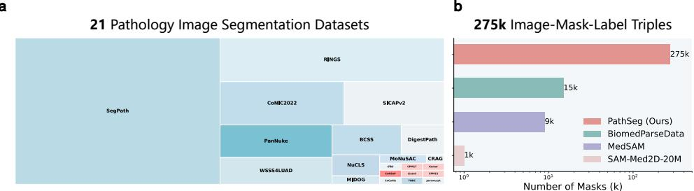

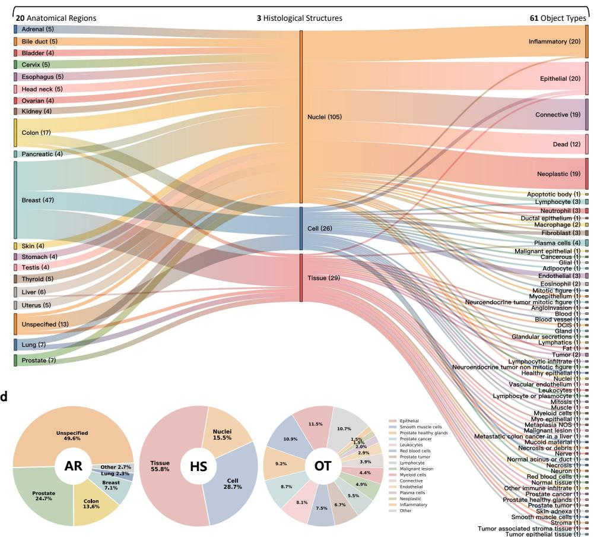
*Fig. 1: Overview of PathSeg dataset. a, Treemap chart of 21 pathology segmentation datasets in PathSeg (internal, blue; external, red), where area size and color intensity indicate the number of masks and labels, respectively. b, PathSeg contains a total of 275k image-mask-label triples, significantly surpassing the amount of pathology data in other medical image segmentation benchmarks. c, Label distribution in PathSeg illustrated by a Sankey diagram, highlighting the relationships among different anatomical regions (AR), histological structures (HS), and object types (OT). The number in parentheses indicates the count of categories included in each grouping. d, Donut charts visualizing mask distribution across three hierarchical levels in PathSeg.*

**Extensive data scale.** We construct the PathSeg dataset by collecting samples from 21 publicly available datasets (Fig. 1a) for pathology image semantic segmentation, all containing annotated pixel-level masks with categorical labels. The complete list of datasets including statistic information and download links is provided in Supplementary Table A1. The inclusion criteria comprises H&E-stained histopathology images from human tissue specimens and high-quality segmentation masks with precisely delineated contours. As a result, our PathSeg dataset comprises a total number of 275k image-mask-label triples (Fig. 1b), which significantly surpasses the pathology subsets of existing medical segmentation datasets such as BiomedParseData (15k) [21], MedSAM (9k) [19], and SAM-Med2D-20M (1k) [20]. The extensive data and semantic labels in PathSeg dataset provide strong support for the development of effective segmentation foundation models for pathology images.

**Diverse and hierarchical object categories.** Different datasets often use varying terminologies or definitions for object types, and merging them directly can lead to labeling inconsistencies. To enhance clarity and standardization, we reorganize the original labels into a unified hierarchical structure, formatted as:

```
[ anatomical region ] - [ histological structure ] - [ object type ],
```

where [anatomical region] and [histological structure] are extracted directly from official metadata, and [object type] preserve exactly as provided in the source datasets. This process produces a comprehensive taxonomy of 160 distinct hierarchical semantic labels, systematically organized into three levels (Fig. 1c):

- 20 anatomical regions: such as breast, lung, colon, prostate, etc. Unspecified denotes datasets with diverse regional samples without specifying individual image origins.
- 3 histological structures: tissue, cell, and nuclei.
- 61 object types: including epithelial, connective, inflammatory, neoplastic, dead, neutrophil, eosinophil, plasma, apoptotic body, lymphocyte, among others.

In addition, Fig. 1c quantitatively illustrates the hierarchical label distributions, where the breast (47 labels), colon (17), lung (7), and prostate (7) contain the most diverse object types. Fig. 1d presents the mask distributions across three levels. Among anatomical regions, the prostate (24.7%), colon (13.6%), breast (7.1%), and lung (2.3%) exhibit the predominant proportions of masks. For histological structures, masks are distributed among tissue (55.8%), cell (28.7%), and nuclei (15.5%). We show the top 15 object types. The complete numbers of labels, images, and masks for each anatomical region, histological structure, and object type are provided in Supplementary Tables A2, A3, and A4, respectively.

> 💡 **Figure 1 批读**: 图 1 是 PathSeg 数据集的四维概览。(a) 通过树形图展示 21 个来源数据集，蓝色为内部数据集（16个），红色为外部数据集（5个），面积代表掩码数量，颜色深度代表标签数量。(b) 条形图对比：PathSeg 的 275k 是 BiomedParseData 病理子集（15k）的 18 倍。(c) 桑基图展示标签分布的三级流动关系，直观显示各解剖区域下组织学结构和对象类型的分布。(d) 环形图展示三个层级的掩码分布 -- 组织级层面占 55.8%，与临床实际一致（病理图像中大面积的组织区域注释远多于单个细胞/细胞核注释）。

### 2.2 Overview of PathSegmentor

As illustrated in Fig. 2a, PathSegmentor takes a pathology image and a text prompt as inputs, and outputs the predicted mask. Building upon the Transformer encoder-decoder architecture of SEEM [16], PathSegmentor integrates an image encoder, a text encoder, and a joint feature interaction module with learnable queries. First, the image encoder and text encoder transform the pathology image and text prompt into their respective feature representations. Subsequently, the joint feature interaction module combines a set of learnable queries with image and text features to capture the potential association between them through cross-attention and self-attention [33, 34], resulting in more semantically meaningful representations of mask embeddings and class embeddings. Finally, we generate candidate masks via dot-product operations between mask embeddings and image features, then select the final mask based on maximal similarity between class embeddings and text features.

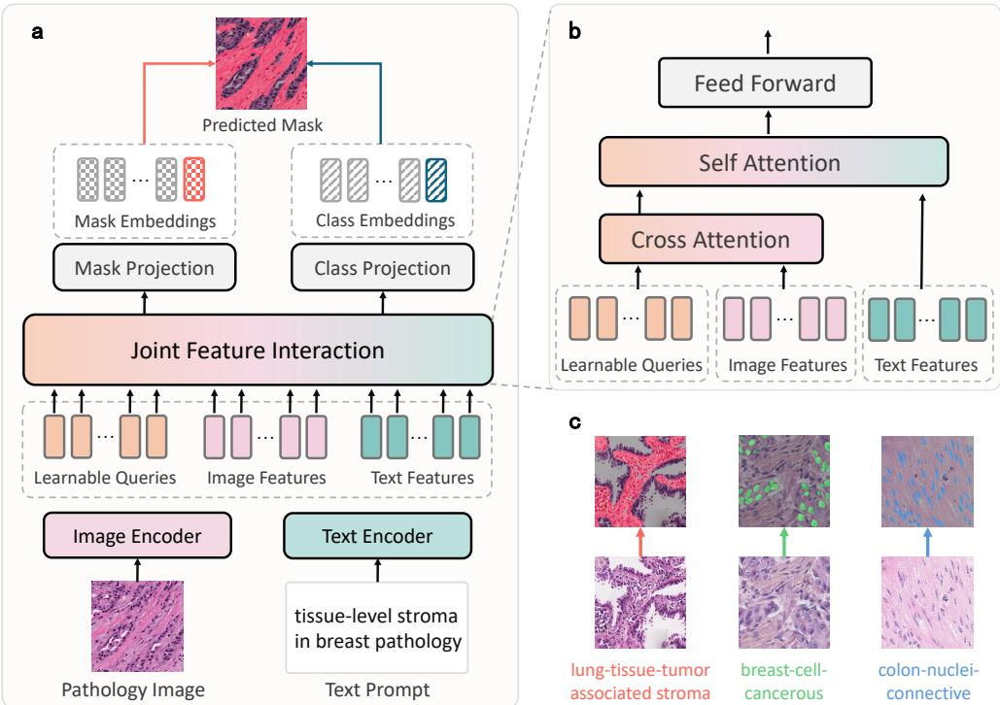
*Fig. 2: Overview of PathSegmentor. a, The text-prompted framework of PathSegmentor, comprising an image encoder, a text encoder, and a joint feature interaction module. b, The details of the joint feature interaction module, where learnable queries interact with image features and text features through cross-attention and self-attention. c, PathSegmentor can handle diverse segmentation across anatomical regions and histological structures.*

**Textual prompt generation.** For the input text, we generate the textual prompts using a predefined template based on the hierarchical semantic labels, enhancing the model's understanding of the context:

```
[histological structure]-level [object type] in [anatomical region] pathology.
```

**Joint feature interaction module.** As one of the key components in PathSegmentor, the joint feature interaction module integrates cross-attention layers, self-attention layers, and feed-forward networks (Fig. 2b and Section 4.2). We create a set of learnable queries, along with image and text features as input to this module. Learnable queries first interact with image features through cross-attention, serving as adaptive filters to aggregate critical visual context. The vision-enhanced queries are then concatenated with text features and processed via self-attention, facilitating deep interactions where textual semantics guide the refinement of visual features. The final output from feed-forward networks is used to generate mask embeddings and class embeddings.

PathSegmentor supports versatile pathology image segmentation spanning diverse anatomical regions, histological structures, and object types, as illustrated in Fig. 2c. All dataset samples are aggregated to train PathSegmentor in an end-to-end manner for pathology image segmentation. During inference, users simply provide an input pathology image and a text prompt specifying the target using hierarchical semantic information, and the model outputs the corresponding segmentation mask.

### 2.3 Segmentation Performance on PathSeg Dataset

In our experiments, 16 datasets from the PathSeg dataset are partitioned into training and testing splits at a ratio of 8:2, with the testing splits combined for internal validation. We evaluate PathSegmentor against three representative model groups, selected to comprehensively assess performance across different paradigms.

- Three specialized segmentation models that are trained and optimized for each dataset independently: following previous works [19, 21], we choose 1) nnU-Net [9], the most representative medical segmentation model with automated architecture optimization; 2) DeepLabV3+ [32], which leverages atrous convolution for multiscale pathology feature extraction; 3) SAM-Path [10], which implements the frozen SAM encoder [13] for specialized pathology segmentation.

- Two leading spatial-prompted segmentation foundation models adapted from the SAM [13] architecture for medical imaging: 1) MedSAM [19], which improves prompt robustness through 1.5M medical image-mask pairs, specifically optimizing bounding box prompt effectiveness; 2) SAM-Med2D [20], which extends the medical data scales to 19.7M while supporting multiple prompts (points, boxes, and masks) for enhanced clinical flexibility.

- One text-prompted segmentation foundation model: BiomedParse [21], representing the state-of-the-art medical model with textual prompting capabilities.

#### 2.3.1 Comparison with Specialized Segmentation Models

First, we compare PathSegmentor against three state-of-the-art specialized segmentation models (nnU-Net, DeepLabV3+, SAM-Path) on internal datasets. Each specialized model is trained using dataset-optimized configurations through their official implementations.

The quantitative results on 16 datasets are shown in Fig. 3a and Supplementary Table A6. Among the three specialized models, nnU-Net achieves superior Dice scores on 11 out of 16 datasets, while SAM-Path and DeepLabV3+ excel on 3 and 2 datasets, respectively. Notably, as a segmentation foundation model, PathSegmentor further outperforms all three on 14 out of 16 datasets with statistical significance (p <= 0.05, one-sided, paired Student's t-tests). Specifically, on SegPath, a challenging multi-category dataset containing eight cell types, PathSegmentor scores 0.442, achieving a 0.280 performance improvement over DeepLabV3+'s score of 0.162. The superiority of PathSegmentor can be attributed to large-scale training data and hierarchical semantic modeling. Our constructed PathSeg dataset facilitates robust feature learning across diverse pathology patterns, whereas specialized models are constrained by the sizes of individual datasets. Additionally, hierarchical textual inputs explicitly encode structured pathology knowledge to enhance morphological discrimination. These results illustrate how foundation models trained on comprehensive data with semantic priors can overcome the limitations of traditional paradigms that rely on one specialized model per dataset.

We also compare the overall performance of four models by averaging the Dice scores of all samples on 16 internal datasets. As illustrated in Fig. 3b, PathSegmentor achieves a superior overall Dice score of 0.671, compared to 0.502 for nnU-Net, 0.462 for DeepLabV3+, and 0.472 for SAM-Path.

PathSegmentor exhibits three key advantages. 1) Unified architecture: a single PathSegmentor model outperforms a group of 16 specialized nnU-Net models with a large margin of 0.169 Dice score. 2) Category scalability: PathSegmentor can support all 160 semantic classes in the PathSeg dataset, which is 40x more than the average capacity of specialized models, each handling approximately 4 classes based on the total of 16 models for 61 object types. 3) Model efficiency: PathSegmentor has a significantly smaller model size of 0.45B parameters and achieves a 75% size reduction compared to the group of 16 SAM-Path models, which have 1.86B parameters. This makes PathSegmentor more suitable for clinical deployment. In addition, we present more detailed anatomical region level results in Supplementary Table A12, histological structure level results in Supplementary Table A13, and object type level results in Supplementary Table A14.

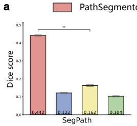
*Fig. 3: Internal validation between PathSegmentor and specialized models across 16 datasets from PathSeg dataset. a, Bar charts of Dice scores on each dataset, calculated using bootstrapping with 95% confidence interval. Statistical significance is indicated as **p<=0.01, *p<=0.05. P-values are computed using one-sided, paired Student's t-tests. b, Scatter plots of overall performance for each model with the number of models, number of categories, and total model size.*

> 💡 **Figure 3 批读**: 图 3a 的柱状图以逐数据集方式对比 Dice 分数。关键观察：PathSegmentor 在 14/16 数据集上统计显著地优于所有三个专用模型，优势在最复杂的数据集（SegPath 8 类别、CoNIC2022 6 类别）上尤为明显。图 3b 的散点图从三个维度（模型数量、类别覆盖、参数总量）展示了 PathSegmentor 的优势 -- 单模型胜过 16 个 nnU-Net，覆盖 160 类 vs. 平均 4 类，0.45B 参数 vs. 1.86B（16x SAM-Path）。

#### 2.3.2 Comparison with Spatial-prompted Segmentation Foundation Models

In this experiment, we compare PathSegmentor with two state-of-the-art spatial-prompted segmentation foundation models for medical imaging, i.e., MedSAM [19] and SAM-Med2D [20]. We generate two types of oracle bounding box prompts based on the ground-truth masks.

- Instance box: a set of individual boxes, each representing the smallest rectangular bounding box around each instance.
- Union box: a single box that serves as the smallest rectangular bounding box encompassing all instance boxes.

To ensure a fair comparison between spatial-prompted models and our text-prompted PathSegmentor, we first use union box prompts for evaluation. These prompts provide a single box for each image, making them comparable to PathSegmentor's single description per image approach, rather than instance boxes that require dense localization. Additionally, we will analyze the performance of instance boxes and their prompt efficiency in the intricate objects analysis part.

As illustrated in Fig. 4, PathSegmentor achieves superior overall segmentation performance, outperforming MedSAM by 0.145 and SAM-Med2D by 0.239 in Dice scores. Across 16 datasets, PathSegmentor shows statistically significant enhancements over MedSAM on 15 of them, with particularly pronounced gains exceeding 0.4 on challenging datasets such as CoNIC2022 and WSSS4LUAD. These improvements underscore the limitations of MedSAM's general medical pretraining when applied to complex pathology-specific segmentation tasks. Notably, PathSegmentor maintains superiority even on MedSAM's training-included GlaS dataset, with a 0.094 Dice score improvement that suggests inherent architectural advantages. While showing a slight 0.044 Dice score disadvantage on MIDOG, PathSegmentor demonstrates robust competitiveness in the internal validation, highlighting text prompting's efficacy in capturing pathological semantics beyond spatial cues.

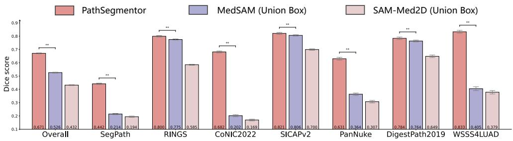
*Fig. 4: Internal validation between PathSegmentor and spatial-prompted segmentation foundation models across 16 datasets from PathSeg dataset. Bar charts of Dice scores for overall performance and each dataset, calculated using bootstrapping with 95% confidence interval. Statistical significance is indicated as **p<=0.01. P-values are computed using one-sided, paired Student's t-tests.*

**Intricate object analysis.** Next, we evaluate PathSegmentor's advantages in segmenting intricate objects, compared to the best-performing spatial-prompted model MedSAM [19]. Intricate objects, characterized by complexities such as irregular shapes, small sizes, and high density, present significant challenges for precise segmentation of pathology images. Fig. 5a, c, f illustrate how segmentation performance varies with object shape, instance size, and instance density, respectively. Taking object shape (Fig. 5a) as an example, each scatter point represents the mean performance across samples with the corresponding irregularity values. The dashed lines indicate the best-fit curves for these data points with confidence intervals, reflecting the trend in performance variation. The fitting functions are presented in Supplementary Table A7.

**1) Irregular object shape.** Pathological objects often exhibit irregular morphologies due to lesions, inflammation, or tumor infiltration. To quantify irregularity, we employ the metric derived from circularity [35] (Section 4.5). Fig. 5a and Supplementary Table A8 demonstrate that while both MedSAM and PathSegmentor attain Dice scores exceeding 0.9 for regular-shaped objects, their performance diverges significantly with increasing shape irregularity. MedSAM exhibits a parabolic decline in Dice score that drops to 0.282, whereas PathSegmentor sustains stable performance at 0.790 with only marginal degradation. This performance gap under maximal irregularity highlights PathSegmentor's superior shape robustness. Visual confirmation is provided in Fig. 5b, where PathSegmentor precisely delineates the complex boundaries of irregular tissues across different anatomical regions that challenge the spatial-prompted approaches.

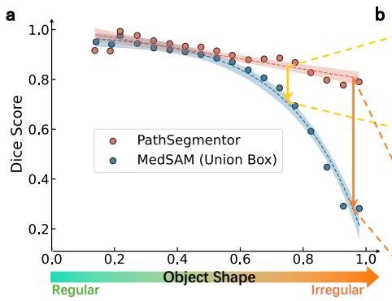
*Fig. 5: Comparison of segmentation performance on intricate objects between PathSegmentor and MedSAM. a, Performance trends for irregular object shapes, with the x-axis representing the metric of irregularity. b, Examples of segmentation for irregular tissues. The blue boundary outlines the ground truth, the colored masks indicate the predictions, and the red bounding boxes represent the spatial prompts provided to MedSAM. c, Performance trends for small instance sizes, with the x-axis representing the metric of instance size. d, Examples of segmentation for small cells and nuclei. e, Distribution of instance counts per object mask in the PathSeg test set. f, Performance trends related to instance density. g, Prompt efficiency, illustrating the trade-off between performance and the number of prompts required per mask. h, Examples of highly dense nuclei and cells, with 288 and 396 instances in a single image.*

> 💡 **Figure 5 批读**: 图 5 是本文最重要的实验分析之一，通过四个维度（不规则形状、小尺寸、高密度、提示效率）系统论证了文本提示相对空间提示的优势。
> - **(a) 形状不规则性**：PathSegmentor 的 Dice 随不规则性增加仅从 ~0.9 略降至 0.79，而 MedSAM 从 ~0.95 崩塌至 0.282。拟合函数差异更说明问题 -- PathSegmentor 是线性下降（y=0.2085x+0.7998），MedSAM 是指数下降（y=-0.8436*exp(-4.4946x)+0.9802）。文本提示学到的形状先验远比单一 union box 鲁棒。
> - **(c) 小实例**：当实例尺寸趋近于 0 时，PathSegmentor Dice 保持 0.531 而 MedSAM 仅 0.159，差距 0.372。空间提示用一个框框住一堆小细胞核时，框里大部分是背景，模型无法区分具体实例。文本提示 "nuclei-level" 天然编码了 "目标是小型密集对象" 的先验。
> - **(e-f) 高密度**：90% 的掩码包含 0-72 个实例，但最密集的超过 800 个实例。在高密度区间，MedSAM Dice 下降 >0.3，而 PathSegmentor 保持稳定在 ~0.7。这是文本提示相对 union box 最显著的优势场景。
> - **(g) 提示效率**：路径分段器使用 1 个提示达 Dice 0.671；MedSAM Union Box 也是 1 个提示但 Dice 仅 0.526；MedSAM Instance Box 需要平均 14.7 个提示达 Dice 0.774。在实际临床中，给一张有数百个细胞的病理图逐一画框是绝对不可行的。

**2) Small instance size.** Small instance sizes frequently occur in pathology images, where objects such as small tumors, individual cells, and nuclei are particularly tiny and challenging to differentiate from the surrounding tissue. For each object type, we use the ratio of the average instance scale to the image scale to reflect the instance size. Fig. 5c and Supplementary Table A9 illustrate the trends in model performance as the instance size decreases. PathSegmentor consistently surpasses MedSAM across different instance sizes, especially exhibiting a remarkable improvement of 0.372 in Dice score for very small instance sizes approaching zero. Fig. 5d presents examples of nuclei and cells with small size, demonstrating that PathSegmentor segments small and individual objects effectively, while MedSAM segments a larger area instead.

**3) High instance density.** Pathology images frequently exhibit exceptionally high instance densities, posing significant challenges for segmentation tasks. We use the number of distinct instances within each object mask to indicate instance density. In Fig. 5e, statistic analysis of our PathSeg test set reveals an instance count distribution: 90% of masks contain 0-72 instances, while the upper 10% contain cases extending beyond this range, reaching a maximum count surpassing 800 instances within a mask. This distribution underscores the inherent high density in pathology images. Fig. 5f and Supplementary Table A10 illustrate the variation in segmentation results of PathSegmentor and MedSAM as a function of instance density. When instance density rises, MedSAM suffers a more than 0.3 Dice decline, which is attributed to the union box prompts lacking sufficient spatial information to resolve individual instances in crowded regions. In contrast, PathSegmentor maintains robust performance with a Dice score around 0.7, demonstrating superior capability in segmenting objects with dense instances through text prompts.

**4) Prompt efficiency analysis.** Furthermore, we analyze prompt efficiency by evaluating the trade-off between performance and the number of prompts across different prompting strategies. This is clinically important as the required number of prompts directly correlates with pathologist annotation time. Fig. 5g and Supplementary Table A11 compare four segmentation approaches in terms of their performance and the number of prompts required per mask, including PathSegmentor, MedSAM (Union Box), MedSAM (Instance Box), and Instance Box which directly uses the instance boxes as prediction. PathSegmentor demonstrates superior single-prompt efficiency, achieving a 0.145 higher Dice score than MedSAM (Union Box) when limited to one prompt per image. The enhanced performance of MedSAM (Instance Box) and Instance Box primarily results from their extensive reliance on precise spatial localization cues. This requires approximately 15x more prompts per mask overall, specifically 12 for tissues, 16 for nuclei, and 28 for cells. However, this increased demand creates significant challenges for clinical workflows that limit practical adoption. Fig. 5h visually demonstrates these challenges in extreme cases, where single patches already contains 288 nuclei and 396 cells. When extended to whole-slide images that typically comprise thousands of such patches, the annotation complexity becomes prohibitively expensive, potentially requiring annotation of millions of individual objects. These results demonstrate PathSegmentor's advantage in balancing accuracy with practical usability through its efficient text-prompted paradigm for real-world pathology practice.

#### 2.3.3 Comparison with Text-prompted Segmentation Foundation Models

In this experiment, we compare PathSegmentor to BiomedParse [21], a state-of-the-art text-prompted model for biomedical image segmentation. Text-prompted segmentation relies solely on semantic information without incorporating spatial information, making it more challenging.

As illustrated in Fig. 6a and Supplementary Table A6, BiomedParse achieves only a 0.242 Dice score for overall performance. It struggles significantly on three complex datasets (SegPath, DigestPath2019, and MIDOG), with Dice scores falling below 0.1. In contrast, after being trained on our extensive and comprehensive PathSeg dataset, PathSegmentor improves Dice score by 0.429 in absolute term over BiomedParse. This substantial enhancement highlights the effectiveness of PathSegmentor. Notably, PathSegmentor consistently exceeds BiomedParse's performance across all 16 datasets, including PanNuke and GlaS, which are also included in BiomedParse's training set, further showcasing its superior performance.

Fig. 6b presents the comparison results between PathSegmentor and BiomedParse across three specific levels, including anatomical region, histological structure, and object type. For anatomical regions, we focus on five primary areas with over 1,000 masks, including prostate, colon, breast, lung, and unspecified, whereas the results for all regions can be found in Supplementary Table A12. The results indicate that PathSegmentor demonstrates a significant advantage in segmentation accuracy across these key anatomical regions. In terms of histological structure, PathSegmentor significantly outperforms BiomedParse across tissue, cell, and nuclei, ranging from large and irregular features to small and dispersed ones (Supplementary Table A13). Regarding object type, we showcase the top eight objects with the highest number of masks, including epithelial, smooth muscle cells, prostate healthy glands, prostate cancer, leukocytes, red blood cells, prostate tumor, and lymphocyte, which have mask counts ranging from 15k to 30k. The results for all object types are provided in Supplementary Table A14. This highlights PathSegmentor's ability to segment a diverse array of biological entities effectively. The segmentation results of all 160 categories in PathSeg dataset are presented in Supplementary Table A15.

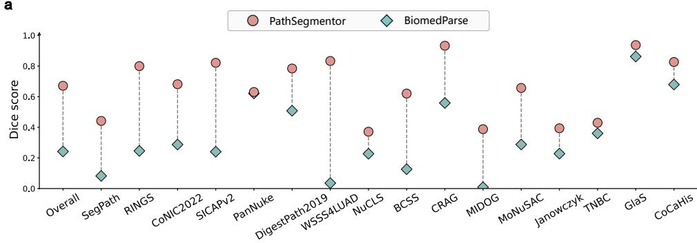
*Fig. 6: Internal validation between PathSegmentor and BiomedParse across 16 datasets from PathSeg dataset. a, Dice scores for overall performance and individual datasets. b, Results averaged and presented at three levels, including anatomical region, histological structure, and object type.*

> 💡 **Figure 6 批读**: 图 6 是最能体现 PathSegmentor 领域特定优势的对比。BiomedParse 在 SegPath（0.083）、DigestPath2019（0.508）和 MIDOG（0.009）上完全失效（Dice < 0.1 甚至接近 0），而 PathSegmentor 分别达 0.442、0.784、0.388。这一巨大差距的核心原因：(1) 数据规模 -- BiomedParse 仅用 ~15k 病理样本训练，(2) 标签粒度 -- BiomedParse 的文本模板缺少组织学结构层级，无法区分同一对象类型在不同尺度上的差异。图 6b 的三级分析更验证了 PathSegmentor 在组织、细胞、细胞核三个层面的全面优势。

### 2.4 External Evaluation

We assess the generalization performance of PathSegmentor and other segmentation models across pathology images acquired from diverse clinical environments. The external validation employs datasets that are completely independent from the internal training datasets, while ensuring that the evaluated categories were previously learned during model training.

In our experiments, we conduct external evaluation using 5 datasets where the [object type] in each external category align with categories present in our internal datasets. Specifically, CPM17, CPM15, Kumar, and Lizard datasets contain the nuclei category, while CoNSeP dataset includes 6 types of colon cells.

As segmentation foundation models, PathSegmentor, MedSAM, SAM-Med2D, and BiomedParse are directly tested on the external datasets. For specialized models, given their tailored configurations for each dataset, we systematically evaluate the specialized models that can handle the corresponding internal category for each external category. As illustrated in Supplementary Table A16, for example, to evaluate the performance on colon-cell-malignant epithelial in CoNSeP, we adopt the specialized models trained on WSSS4LUAD, which involves the category of tumor epithelial tissue. For the categories appearing in multiple training datasets, including colon-cell-healthy epithelial, colon-cell-fibroblast, and colon-cell-endothelial, we adopt the results of the best-performing specialized models. The external validation results are shown in Fig. 7 and Supplementary Table A17.

The comparison results of overall performance in Fig. 7a-e reveal that foundation models (PathSegmentor, MedSAM, SAM-Med2D, and BiomedParse) collectively demonstrate significantly stronger performance than specialized models (nnU-Net, DeepLabV3+, and SAM-Path), highlighting their remarkable generalization capability in real-world clinical settings. Among these, PathSegmentor establishes consistent state-of-the-art performance across all external datasets. Specifically for nuclei segmentation, PathSegmentor achieves 0.705, 0.485, 0.427, and 0.319 Dice scores on CPM17, CPM15, Kumar, and Lizard, respectively, demonstrating superior performance in dense object segmentation tasks. On CoNSeP dataset, PathSegmentor surpasses the second best-performing model BiomedParse by 0.074 Dice score, which clearly shows its enhanced effectiveness.

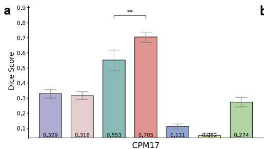
*Fig. 7: External evaluation of PathSegmentor compared to foundation and specialized models. a-e, Overall Dice scores with bootstrapped 95% confidence interval on 5 external datasets. Statistical significance is indicated as **p<=0.01. f, Per-category Dice scores for all object types on CoNSeP dataset. PathSegmentor results are visually emphasized through enlarged markers and annotated with rank positions. g, A scatter plot illustrating the number of instances and the maximum inter-instance distance per image on CoNSeP dataset, with horizontal and vertical error bars.*

Furthermore, we focus on the performance of each category in CoNSeP dataset, all of which are colon cells. Fig. 7b illustrates that PathSegmentor with text prompts consistently achieves superior performance for the five cells (malignant epithelial, healthy epithelial, muscle, inflammatory, and fibroblast cells), outperforming all competing models. Particularly, it reaches Dice scores of 0.624 for malignant epithelial and 0.596 for healthy epithelial cells, representing 0.162 and 0.331 improvements over MedSAM (Union Box), the best spatial-prompted model.

However, we notice an important exception. Although text-prompted models excel for most cell types, both PathSegmentor and BiomedParse underperform spatial-prompted models (MedSAM and SAM-Med2D) on endothelial cells. This divergence motivates our investigation of cellular distribution patterns. To quantify these differences, we visualize each sample's amount-dispersion distribution in Fig. 7c, where amount represents the instance count per category in each image, and dispersion measures the maximum inter-instance distance within each category mask. Distribution statistics of mean and standard deviation for each category are detailed in Supplementary Table A18. The analysis reveals that the five better-performance cell types exhibit both abundant instances and wide spatial distributions, whereas endothelial cells appear sparsely with clustered arrangements. This explains PathSegmentor's strength in segmenting high-density, high-dispersion cellular regions, while spatial prompts provide more precise localization cues for few and concentrated cells.

> 💡 **Figure 7 批读**: 图 7 的外部验证是衡量基础模型泛化能力的金标准。关键发现：
> - **(a-e) 基础模型 > 专用模型**：所有 5 个外部数据集上，基础模型组（PathSegmentor, MedSAM, SAM-Med2D, BiomedParse）的整体表现明显优于专用模型组。这验证了基础模型的跨域泛化优势。PathSegmentor 在所有 5 个数据集上都取得最优。
> - **(f) CoNSeP 逐类别分析**：在 6 种结肠细胞中，PathSegmentor 在 5 种上最优，唯独内皮细胞 (endothelial) 落后于空间提示模型。这是论文中最诚实的发现之一。
> - **(g) 数量-分散度分析**：散点图揭示了内皮细胞失效的原因 -- 内皮细胞实例数少（平均 ~5个/图像）且空间分布聚集（最大分散度 ~200px），与其他 5 种细胞（实例数多、分布广）形成鲜明对比。文本提示缺乏精确的空间定位能力，对于 "少且聚集" 的对象天然不如空间提示（框）高效。

### 2.5 Qualitative Results

In this experiment, we conduct a comprehensive qualitative analysis of PathSegmentor's segmentation performance through two aspects, including comparative visualizations and practical applications.

**Comparative visualizations.** Fig. 8 presents a systematic comparison between PathSegmentor and three representative segmentation models, including specialized nnU-Net, spatial-prompted MedSAM, and text-prompted BiomedParse. The evaluation spans four critical anatomical regions, including prostate, colon, breast, and lung, along with three histological structures of tissue, cell, and nuclei. PathSegmentor achieves superior cross-region generalization (Fig. 8a), despite significant variability between different anatomical regions in pathological features. For example, in the prostate images where the target objects exhibit low contrast against surrounding tissues, PathSegmentor can delineate their edges more accurately compared to other models. Additionally, PathSegmentor showcases its robust multi-scale segmentation capabilities (Fig. 8b), effectively handling a range of objects from large tissues such as cancer tissue and malignant lesions, to small and dense nuclei including neoplastic and inflammatory nuclei. These results highlight PathSegmentor's effectiveness and versatility in segmenting a diverse array of objects across different anatomical regions and histological structures.

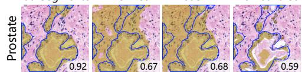
*Fig. 8: Visualization of segmentation results. We compare PathSegmentor with other state-of-the-art segmentation models, including specialized nnU-Net, spatial-prompted MedSAM, and text-prompted BiomedParse across four anatomical regions and three histological structures. The blue contour lines indicate the ground truth, while the numbers in the bottom right corner of each image represent the Dice score.*

**Potential applications.** By leveraging its text-prompted segmentation capabilities, PathSegmentor establishes a bridge between natural language and medical image segmentation, serving as an efficient segmentation agent for large language models (LLMs). Fig. 9 illustrates three clinically relevant applications.

- Case 1: Report-referenced segmentation, where LLMs automatically parse clinical reports to identify targets of interest and generate optimized textual prompts. These prompts then guide PathSegmentor to produce precise segmentation that visually ground pathological findings, significantly enhancing report interpretation.
- Case 2: Targeted conversational segmentation, where LLMs allow end-users to naturally request specific pathological objects segmentation through free-form dialogue, translate these queries into the required prompts in the predefined template for PathSegmentor.
- Case 3: Exploratory conversational segmentation, where end-users without prior pathological knowledge can initiate exploratory analysis through open-ended queries. LLMs infer comprehensive segmentation targets based on anatomical regions, prompting PathSegmentor to delineate all relevant objects, which can serve as an interactive educational tool.

PathSegmentor's seamless integration with LLMs not only contributes to more flexible segmentation but also significantly improves interactive and versatile medical image analysis. The prompts of LLM used to generate text inputs of target objects for PathSegmentor are detailed in Supplementary Fig. A1.

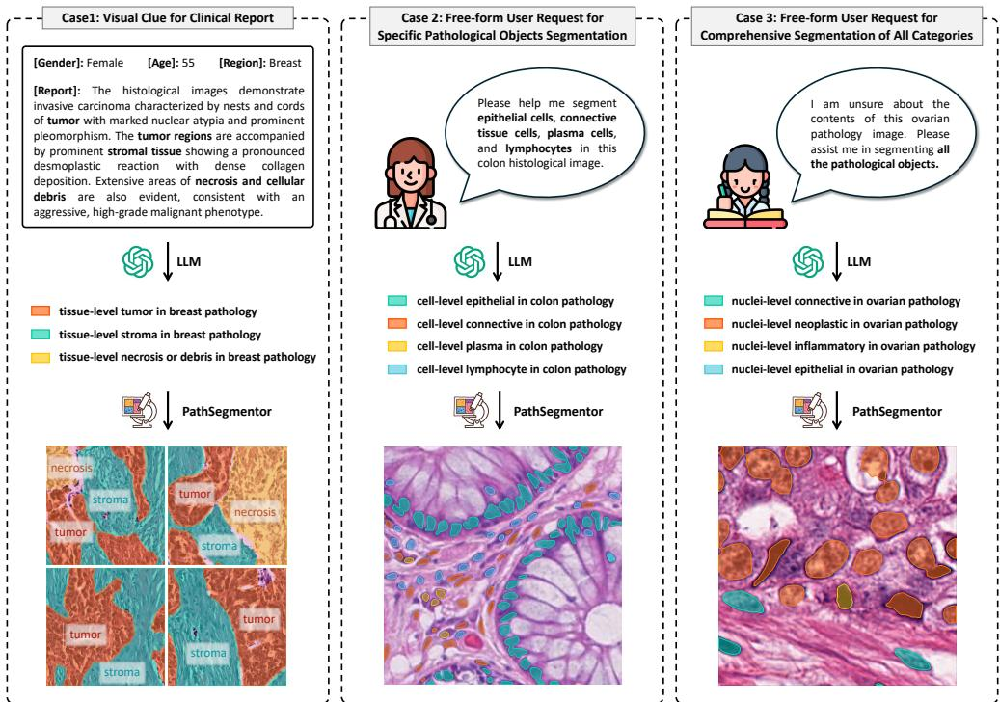
*Fig. 9: Potential applications of PathSegmentor. PathSegmentor can be seamlessly integrated with LLMs to support interactive segmentation-related tasks, such as providing visual clues for clinical reports, free-form user request for specific pathological objects segmentation or comprehensive segmentation of all categories.*

> 💡 **Figure 8 批读**: 定性结果非常直观地展示了四组模型的视觉对比。在低对比度的前列腺图像中，nnU-Net 和 MedSAM 分割边界模糊或过度分割，而 PathSegmentor 精确刻画了目标边缘。在多尺度对象（从大面积癌组织到密集细胞核）上，PathSegmentor 和 MedSAM 表现接近，但都远好于 BiomedParse（后者常输出空白或大片误分割），进一步验证了领域特定训练的重要性。

> 💡 **Figure 9 批读**: 图 9 展示了 PathSegmentor 与 LLM 集成的三种应用模式，这是文本提示模型的天然优势（空间提示模型无法与 LLM 直接交互）。场景一（报告引导分割）对临床最有价值 -- 医生写报告描述所见病变，系统自动定位并分割出对应区域。场景三（探索式分割）为病理教学提供了交互式工具。

### 2.6 PathSegmentor for Explainable Cancer Diagnosis

Explainable AI in medical image analysis is essential for enhancing the interpretability and trustworthiness of diagnostic models [36-39]. In pathology, accurate cancer diagnosis relies on the identification, morphological assessment, and quantitative analysis of specific pathological objects, such as characteristic tissue patterns, cell structures, and nuclear features [40, 41]. Therefore, precise segmentation of these objects is critical for diagnostic decision-making. By extracting and analyzing diagnostically relevant biomarkers, PathSegmentor can generate interpretable, human-understandable explanations that help pathologists make more precise, evidence-based diagnostic judgments.

In this study, we investigate how PathSegmentor's segmentation capability can enhance the interpretability of classification models for cancer diagnosis through two complementary approaches: 1) a classification-segmentation pipeline where we first train a classification model and then employ segmentation to explain the classification model's decisions through object-based feature importance estimation; and 2) a segmentation-classification framework that first identifies pathological objects in pathology images and then performs object-aware classification, facilitating imaging biomarker discovery via object-aware visual explanations. We evaluate our method using the TCGA-BRCA dataset [42] for breast cancer classification, as PathSegmentor can segment the wider variety of objects in breast compared to other anatomical regions. This dataset comprises 985 whole-slide images (WSIs) representing two major breast cancer subtypes, i.e., Invasive Ductal Carcinoma (IDC) and Invasive Lobular Carcinoma (ILC).

#### 2.6.1 Classification-Segmentation for Feature Importance Estimation

A common deep learning approach for cancer diagnosis involves training an end-to-end classification model that takes a WSI as input and outputs a diagnostic prediction directly. However, the black-box nature of such models raises concerns about their trustworthiness. Feature importance estimation can provide global explainability of which features are most important to each disease class. This estimation not only verifies whether the model learns the correlation between biologically meaningful patterns and disease classes, but also generates interpretable evidence to assist pathologists by quantifying feature contributions for informed decision-making process. In our experiments, we adopt a classification-segmentation pipeline (Fig. 10a), first training a standard cancer diagnosis model based on multi-instance learning [43], and then using PathSegmentor to segment pathological objects for object-based feature importance estimation to enhance interpretability.

The standard classification model for breast cancer diagnosis is trained on WSIs from the TCGA-BRCA dataset, following the conventional pipeline of patch feature extraction, slide aggregation, and final classification (Fig. 11a and Section 4.3). This model achieves high classification performance with a macro AUC of 0.936 (Supplementary Table A19). To investigate model behavior, we implement an object-based perturbation approach to estimate feature importance. Different from traditional methods that use non-semantic perturbations, such as gray squares [44] or superpixel occlusions [45], our approach aims to perform biologically meaningful perturbations. We utilize PathSegmentor to segment predefined pathological objects within an image, and then apply localized blurring perturbations exclusively to these segmented regions. Feature importance is quantified by measuring the relative increase in prediction error (Section 4.3). For example, when applying perturbations to segmented regions of breast-tissue-tumor, the model's prediction error increases from 0.003 to 0.012 (Fig. 10a, top right). Given a set of predefined pathological objects relevant to IDC and ILC diagnosis, the analysis across all TCGA-BRCA testing samples (Fig. 10a, bottom) reveals that these pathological objects generally contribute more significantly to the IDC class than ILC. Notably, the highly discriminative IDC features discovered by PathSegmentor, including breast-nuclei-ductal epithelium, breast-cell-cancerous, breast-nuclei-neoplastic, breast-tissue-tumor, breast-nuclei-epithelial, and breast-tissue-dcis, well correspond to established pathological diagnostic criteria for the IDC class [46]. These results establish PathSegmentor as an effective explanation tool that both validates model's learning of medically relevant patterns and provides interpretable insights by quantifying decisive features in histological terms.

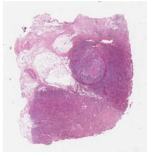
*Fig. 10: PathSegmentor supports explainable cancer diagnosis. a, A classification-segmentation pipeline for object-based feature importance estimation. Features whose perturbation significantly increases model error are identified as important predictors. b, A segmentation-classification framework for imaging biomarker discovery through object-aware class activation maps, which highlight the most discriminative regions with pathological identification.*

#### 2.6.2 Segmentation-Classification for Imaging Biomarker Discovery

Another approach to improve the interpretability of standard classification models for cancer diagnosis is to develop an object-aware classification model capable of generating object-aware visual explanations. In our experiments, we build a segmentation-classification framework (Fig. 10b), first leveraging PathSegmentor to predict masks of pathological objects, and then decomposing whole-image features into explicit pathological object representations, using object-based multi-instance learning to make final predictions (Fig. 11b and Section 4.3). While Class Activation Maps (CAMs) [47] from standard classification models highlight prediction-relevant regions that potentially serve as imaging biomarkers [48], their clinical utility is limited by an inability to specify the pathological nature of salient regions [49]. Our object-aware classification model bridges this semantic gap by generating object-aware CAMs, which not only localize discriminative regions but also associate them with specific pathological objects. This capability significantly enhances clinical interpretability, as pathologists require both precise pathological identification and spatial localization to discover biomarkers and inform diagnostic decisions.

After training on the TCGA-BRCA dataset, our object-aware classification model maintains diagnostic performance with a macro AUC of 0.953 for IDC and ILC classification (Supplementary Table A19). We generate object-aware CAMs by measuring the similarity between object features and classifier weights (Section 4.3). Comparing vanilla CAMs with object-aware CAMs (Fig. 10c), we observe that both methods identify similar discriminative regions indicated by warmer color intensities, while our method additionally provides semantic information about these regions. For the IDC case in the top row, our object-aware CAM accurately localizes compact tumor mass regions and, importantly, identifies imaging biomarkers with high activation values that include breast-tissue-necrosis or debris, breast-tissue-tumor, breast-nuclei epithelial. For the ILC case in the bottom row, our method effectively captures dispersed infiltration patterns of cancerous cells and ranks the salience of pathological biomarkers, highlighting the top three as breast-cell-cancerous, breast-nuclei-ductal epithelium, breast-nuclei-neoplastic. By resolving the semantic ambiguity of traditional CAMs, PathSegmentor delivers clinically meaningful visual explanations that assist pathologists in their diagnostic processes and has the potential to uncover previously under-recognized biomarker candidates.

> 💡 **Figure 10 批读**: 图 10 是可解释性实验的核心。上半部分 (a) 展示了分类-分割管道的特征重要性估计：左侧是原始 WSI + 病理对象的扰动区域，右上角展示了扰动 "breast-tissue-tumor" 后预测误差从 0.003 升到 0.012 的具体案例，底部柱状图对比了各对象对 IDC 和 ILC 诊断的重要性。下半部分 (b) 对比了普通 CAM 和对象感知 CAM -- 两者都标出暖色区域（重要性高），但对象感知 CAM 额外标注了每个区域对应的病理对象类别（如 "breast-tissue-necrosis or debris"）。

---

## 🔖 批读摘要

> 💡 **实验设计的层次结构**：
> 1. **内部验证 vs. 外部验证**：内部验证（16 个训练过的数据集）测试模型的学习能力，外部验证（5 个独立数据集）测试泛化能力。两者结合是评估基础模型的标准范式。
> 2. **三组对比的递进逻辑**：(a) 与专用模型比 -- 验证 "基础模型 > 一组专用模型"；(b) 与空间提示模型比 -- 验证 "文本提示 > 空间提示"；(c) 与文本提示模型比 -- 验证 "领域特定 > 通用"。
> 3. **复杂对象分析**：从形状不规则性、实例大小、实例密度、提示效率四个维度，系统论证了文本提示优于空间提示的根本原因。

> 💡 **消融解读（隐含消融）**：
> 论文没有传统的消融实验表格，但在多组对比中包含了几个 "隐含消融"：
> - **领域特定性消融**：PathSegmentor vs. BiomedParse 对比 = 消融 "病理专域数据 + 层级标签" 的贡献（+0.429 Dice）
> - **文本 vs. 空间消融**：PathSegmentor vs. MedSAM 对比 = 消融 "文本提示 vs. 框提示" 的贡献（+0.145 Dice）
> - **层级标签消融**：BiomedParse 用 "[object type] in [anatomical region]" 模板，PathSegmentor 用 "[HS]-level [OT] in [AR] pathology" 模板 -- 可视为消融 "组织学结构层级" 的贡献
> - **数据规模消融**：BiomedParse ~15k vs. PathSeg 275k 病理数据 -- 消融大数据训练的贡献

> 💡 **外部评估的关键洞察（内皮细胞失效）**：
> CoNSeP 上的内皮细胞失效是最有意义的一个负面结果。论文没有掩盖而是深入分析：通过数量-分散度散点图（Fig. 7g）发现，文本提示适合分割 "多且散" 的对象（如上皮细胞），但"少且聚" 的对象（如内皮细胞）需要空间提示的精确定位。这个发现为未来多提示融合方向（文本+框/点）提供了直接的实证支撑。

> 💡 **Q&A 批注记录**：
> - **Q: PathSegmentor 在 CPM17/CPM15/Kumar/Lizard 上的 Dice 分别是 0.705/0.485/0.427/0.319，为什么差异这么大？** A: 这四个都是细胞核数据集，但难度递增。CPM17 和 CPM15 是相对早期的基准（CPM17 仅 15 张图像），而 Kumar 和 Lizard 包含更多组织类型和染色变异。Dice 的下降反映了数据分布的多样性增加。但关键点是：PathSegmentor 在所有四个上都优于其他所有模型，表明其鲁棒性。
>
> - **Q: 特征重要性估计中，为什么选择模糊（blurring）而非遮挡（occlusion）作为扰动方式？** A: 论文没有详细说明，但可以推断：灰色方块或黑色遮挡会引入人为的边缘伪影，这些伪影本身就可能影响模型预测（模型可能对边缘突变敏感而非对象缺失）。高斯模糊保留了局部纹理的统计特性但消除细节信息，是更 "平滑" 的扰动方式。此外，模糊避免了大面积遮挡导致模型收到完全无信息的输入，更接近 "对象不可见" 而非 "输入异常"。
>
> - **Q: 对象感知 CAM 的 AUC 从 0.936 提升到 0.953，为什么分割辅助反而提升了分类性能？** A: 对象感知模型将图像特征显式分解为病理对象特征，这种分解相当于引入了 "归纳偏置" -- 模型不再从整个 patch 中盲目提取特征，而是明确地 "只看" 特定病理对象区域。这减少了背景组织带来的噪声，使特征更具判别性。同时也说明 PathSegmentor 的分割精度足以支持下游任务。
