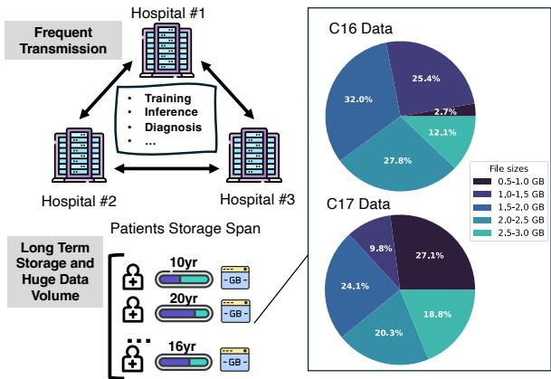

[← 返回 README](../README.md)

# 1. Introduction

## 预览

Introduction 先用医院存储与传输成本建立问题，再解释为什么 lossy 不够安全、通用 lossless 又不够强，最后把 WISE 的三段式核心机制和贡献列出来。

The ever-increasing utilization of advanced medical imaging techniques, such as Whole-Slide Images (WSI) [18, 30], has led to a surge in the generation of gigapixel medical image data. These detailed volumetric images are indispensable for accurate diagnosis and effective treatment planning. However, their considerable size presents notable challenges for storage and transmission. For instance, a single digital pathology WSI scan can produce a fourdimensional (4D) image of a patient's tissue sample comprising width, height, color channels, and multiple resolution levels, resulting in a total data volume reaching several gigabytes [15]. As shown in Fig.1, two well-known datasets, C16 [6] and C17 [20], consist primarily of whole slide images (WSIs) ranging in size from 1 to 5GB. The large size of these images presents significant challenges for storage and transmission. Considering a person got a WSI image as a teenager, the WSI records need to be stored for decades to keep track. Those cold, huge data can cost a lot for storage. Also, as the cloud-based medical ecosystem expands, the frequency of WSI transfers between data centers is increasing due to the growing demands for training, inference, and diagnosis [20, 21, 31].

> 💡 **问题动机**: WSI 的压缩需求来自“长期保存 + 高频跨中心传输”两个压力。这里的 4D 不是体积 CT 那种三维空间，而是 width、height、color channels、multiple resolution levels；这也解释了后面为什么作者只压 base level，因为 pyramid 的其他层可由 base level downsample 得到。

*Figure 1: WSIs are extremely large images (~3 GB/slide uncompressed) of high resolution (0.25 microns per pixel), presenting a significant data storage challenge for hospitals wishing to adopt digital pathology. In practice, hospitals often ship physical drives via FedEx to transfer WSIs.*

> 💡 **Figure 1 批读**: 这张图承担“现实约束”证据：C16/C17 slide 的 GB 级规模把问题从普通图像压缩推到医疗数据基础设施。FedEx 物理硬盘这个例子说明瓶颈不只是模型推理，也包括医院之间的数据搬运。

Given the aforementioned challenges in using WSI images for digital pathology, there exists a clear need for efficient and lossless WSI compressors. However, most existing WSI compression approaches focus on lossy compression, including those classical methods that leverage lossy compressors such as JPEG-2000, as well as those modern compressors that utilize DNN to encode WSI patches into embeddings [5, 11, 12, 15]. While lossy compression techniques can achieve high compression ratios, they risk introducing distortions that could compromise the diagnostic integrity of the WSI images and potentially lead to medical issues. On the other hand, lossless compression techniques can avoid distorting the original WSI information. However, our preliminary experiments with existing lossless compression techniques show that even state-of-the-art lossless compressors can not yield the desired compression performance. Traditional lossless image compressors like PNG, entropy encoders like Huffman, or dictionary compressors like Gzip, demonstrate limited effectiveness on WSI images. Even modern Neural Network (NN)-based compressors can achieve only limited compression, around 1.6 to 2 times for the non-empty area in WSI images, which is far from satisfactory given that a single WSI image contains tens of gigabytes.

> 💡 **lossy 与 lossless 的医学分界**: 这段把 WISE 的设计空间限定为 lossless。对病理 slide，微小结构可能有诊断意义，embedding 或 JPEG-2000 的高压缩率不能直接作为合格替代。作者也没有只批评传统 PNG，而是把 neural lossless 在 non-empty region 只有 1.6x-2x 一并列为动机。

Therefore, in this work, we fill this gap by developing an efficient lossless WSI compressor. First, we observe that most WSI images consist of empty areas that can be efficiently encoded as simple coordinate tuples. While removing these empty regions can easily save some storage space, our findings indicate that the true challenge in losslessly compressing WSI images lies in handling their informative regions. Following this observation, we conduct an in-depth analysis of the compression properties of WSI images, building on a preliminary evaluation of existing lossless compression methods. Our analysis reveals that WSI images generically exhibit high information irregularity, where the high-frequency signals are widely distributed across the WSI images, and demonstrate high volatility. The irregular frequency patterns pose significant challenges to prevalent entropy-based or prediction-based compression methods. Based on those findings, we propose a simple yet effective dictionary-based lossless compression method called WISE, specifically designed for WSI images. WISE consists of three major steps: i) including a hierarchical projection coding step, ii) a bitmap coding step, and iii) a dictionary-based compressor. Through i) and ii), WISE effectively reduces the entropy of the sequence and disentangles proper locality patterns for dictionary-based compression. We conduct extensive experiments and demonstrate that by using our proposed WISE method, WSI images can be compressed to 36 times on average and up to 136 times smaller. Our contributions can be summarized as follows:

> 💡 **方法总览**: WISE 不是“空白区删除”一个 trick。空白区处理只解决 sparsity；真正难点是 informative tissue region 的 irregularity。hierarchical projection coding 先把局部差分变小，bitmap coding 再把 bit position 相同的信号聚到一起，最后 dictionary compressor 才能收集长重复模式。

To the best of our knowledge, this paper is the first to conduct a comprehensive study on the application of various lossless methods in WSI;   
•This paper reveals why lossless methods often fall short with WSI images and offers insights into enhancing the effectiveness of lossless compression for WSI applications;   
•We propose a simple yet powerful lossless compression method called WISE based on a composite encoding scheme;   
•We conduct extensive experiments that verify the effectiveness of WISE.

> 💡 **贡献定位**: 四条贡献中最有复用价值的是第二条：解释“为什么失败”。如果只看最终 36x，容易误以为空白区占比高就是全部原因；但论文后面用 Table 1、Figure 3、Table 5 证明 informative region 的信息重排也很关键。

> 💡 **Q&A 批注记录**:
> - Q: 为什么论文坚持 lossless，而不是用病理任务指标证明 lossy 不影响诊断？
> - A: Introduction 的医学风险论证把目标设成原始信息完全保留；这让 WISE 避开“某个下游任务不掉点是否代表诊断安全”的争议，也更适合长期病历归档。

## Section 总结

| 关键点 | 读法 |
|--------|------|
| WSI 规模 | GB 级 slide、长期保存、跨中心传输 |
| 技术缺口 | lossy 有诊断失真风险；通用 lossless 在 WSI 上压缩率不足 |
| 核心判断 | 空白区容易处理，informative region 才是压缩难点 |
| WISE 主线 | sparsity preprocessing → irregularity-aware encoding → dictionary compression |

