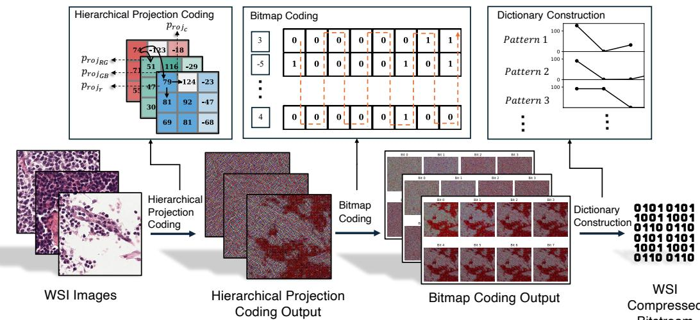
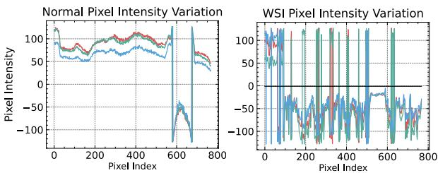
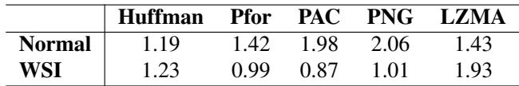
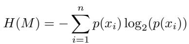
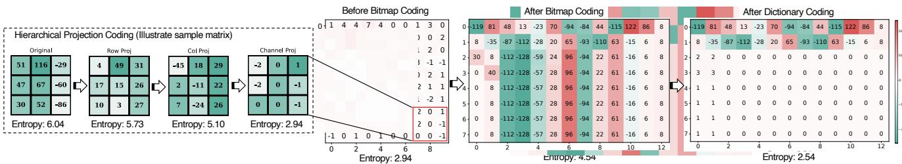
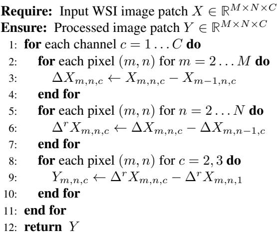

[← 返回 README](../README.md)

# 3. WISE Framework

## 预览

WISE Framework 是论文核心：先证明 WSI 的 information irregularity，再给出四步 pipeline：non-zero region preprocessing、hierarchical projection coding、bitmap encoding、dictionary encoding。

To overcome the information irregularity issue of the WSI image compression, inspired by the analysis in the previous section, we propose a dictionary-based compression method called WISE. In what follows, we first provide an overview of WISE, and then elaborate more on the details of each step in WISE.

> 💡 **Section 路线图**: 这里的“dictionary-based”不要理解成只调用 LZW。WISE 先让 WSI byte stream 更适合 dictionary：差分降低数值范围，bitmap 重排增强 bit-level 局部重复，LZW 才作为 final backend。

*Figure 2: WISE pipeline overview. MinerU 将该图 caption 部分拆断，原文残留为 “pattern in transformed image for further compression.”*

> 💡 **Figure 2 批读**: 这张图应作为整篇方法的数据流图来看：输入 WSI 经过空白区处理得到 non-empty tissue data；hierarchical projection 将 raw pixel 改成多方向差分；bitmap encoding 按 bit position 重排；最终 dictionary encoding 压缩长重复模式。它解释了为什么 WISE 的压缩收益不是来自单一 codec。

*Figure 3: WSI image's pixel intensity variation is quite different from normal image. It has a large portion of high-frequency features thus affecting the performance of entropy-based compressors.*

> 💡 **Figure 3 批读**: Figure 3 是 information irregularity 的视觉证据。普通图像的频率/强度变化更平滑，WSI 的局部极值和高频区域更多，因此基于相邻像素预测或全局频率分布的压缩器难以稳定给出短码。

## 3.1. Information Irregularity in WSI Images

Essentially, the success of many compression methods relies on identifying the locality properties within adjacent pixels or the pixel value distributions. Nevertheless, WSI images may demonstrate a different locality pattern from normal images such that existing compression methods fail to achieve satisfactory performance.

> 💡 **失败假设定位**: PNG、PixelCNN、PAC 这类方法都隐含“邻域可预测”或“分布可建模”。WISE 的核心诊断是 WSI 破坏了这些假设。

To begin with our analysis, we start by conducting an empirical study on the data extracted from a normal image from Kodak dataset [1] and a sample WSI image from TCGA [32]. The results are given in Table 1. Specifically, we consider five prevalent lossless compression methods, covering all the mainstream compression approaches, including traditional compressors like Huffman [14], Pfor [39], Arithmetic Coding [33], PNG [3], and LZMA [17]. The compression ratio values reflect the effectiveness of each algorithm in reducing WSI image size, where higher values generically indicate better compression performance for the given data. Specifically, the best compressor for normal image data, PNG, can only achieve littleto-no compression ratio on WSI images. On the contrary, the dictionary-based method lzma yields a relatively high compression ratio on WSI images. The same phenomenon happens to the other compressors such as Huffman, Pfor, and PAC. Nevertheless, the simple dictionary-based compression method LZMA can achieve relatively high compression ratios on both normal and WSI images.

> 💡 **Table 1 前置结论**: PNG 在 normal image 上 2.06x，但在 WSI 上 1.01x；LZMA 在 normal 上 1.43x，在 WSI 上 1.93x。这个反转说明 WSI 不像自然图像那样适合图像专用预测/滤波路径，反而更适合先找重复 byte pattern。

To better understand the failure reasons of the existing compression methods. We further analyze the characteristics of the WSI images. As the identification of locality properties has been shown to be quite sensitive to the frequency patterns in the input data [24], we focus on analyzing the frequency characteristics of the WSI images. As illustrated in Fig. 3, compared with normal images, WSI images demonstrate unique properties in the frequency domain, which we term as information irregularity. Specifically, the frequency information in the WSI images consists of a large part of the high-frequency features and more local extremes. The high volatility of the WSI data poses a significant challenge to capturing the locality for compression, especially for prediction-based compressors [11, 24].

> 💡 **information irregularity 拆解**: 这里的 irregularity 包含两个层面：一是 high-frequency features 大量存在，二是 local extremes 多、变化快。对 compressor 来说，这意味着短距离预测的残差不够小，entropy model 的符号概率也不够集中。

Based on this analysis, we can better understand why dictionary-based methods, which typically perform poorly on multi-dimensional image data, outperform imagespecific compressors like PNG on WSI images. The reason is that constructing a dictionary instead of predicting the sequential patterns is more robust to the high volatility of the WSI data. Yet, a near $2 \mathbf { x }$ compression ratio remains insufficient for WSI data (often with sizes of several gigabytes).

> 💡 **设计转折**: 这段是 WISE 选择 LZW/LZMA 类方法的理论依据。但作者也承认裸字典只有约 2x，所以必须先做 hierarchical projection 和 bitmap encoding，把“可被字典收集的模式”显式放大。

Table 1. Empirical study for a normal image from Kodak datatet and a WSI Image from TCGA.

*Table 1: Normal image 与 WSI image 在 Huffman、Pfor、PAC、PNG、LZMA 上的压缩率对比。*

> 💡 **Table 1 批读**: 最关键的数字是 PNG: 2.06→1.01 和 LZMA: 1.43→1.93。它们共同支持“WSI 不适合普通图像局部预测，但字典方向更有潜力”的判断。

## 3.2. Pipeline Overview

WSI images are typically stored in a multi-resolution pyramid structure. In this paper, we focus on compressing only the base level of the pyramid, as the other layers can be generated by downsampling this primary level. We process the WSI in a patch-based manner.

> 💡 **处理范围**: 只压 base level 是合理的工程简化：WSI pyramid 的低分辨率层可以由最高分辨率层重建。真正需要注意的是，真实 WSI 文件还包含 metadata、tile index、scanner-specific tags，这些不是本文重点。

The WISE framework consists of four steps, as shown in Fig. 2. In the first step, we identify the non-zero regions in the WSI images, as it is common that a huge part of the WSI images contain meaningless information (i.e., pixels in zero value). In the second step, we incorporate a hierarchical linear projection encoding algorithm to remove the unnecessary information between adjacent regions or pixels. In the third step, we investigate the correlations at an even more fine-grained level to achieve a higher compression ratio. Specifically, we consider the correlations of the bits from the same positions in each byte, and further compress the image reorganized via byte transformation. Finally, with proper encodings obtained from the last two steps, we introduce a dictionary-based compression method that captures the local repetitive patterns.

> 💡 **数据流批注**: 四步分别处理四种冗余：空白区域冗余、相邻像素/通道差分冗余、bit position 层面的 effective-bit 冗余、byte pattern 重复冗余。WISE 的核心是把 WSI 从“难预测图像”转成“可字典化 byte stream”。

## 3.3. Preprocessing

A considerable part of sizable WSI images consists of regions outside the tissue area (so-called "white-space" without any clinically relevant information). In this study, we first developed an image-processing algorithm that can remove the unneeded background in a WSI. Specifically, we remove areas where the column sum or the row sum has the value of zero. Another pre-process we apply is to remove the alpha channel. Different from normal image data, the original WSI images contain four channels, where there is additional alpha information. We directly ignore the additional alpha channel as it contains little to no information about the diagnosis. We apply all the downstream operations to the remaining informative areas with three channels.

> 💡 **空白区预处理**: row/column sum 为 0 的区域可用坐标元数据表示，不必逐像素存储。alpha channel 直接丢弃是一个重要假设：作者认为它对诊断几乎无信息；如果某些 scanner/vendor 在 alpha 或 metadata 中编码有用信息，复现时需要重新确认。

## 3.4. Hierarchical Projection Coding

Since the WSI images demonstrate heterogeneous patterns in the frequency domains, we consider a hierarchical encoding structure of the whole image information to achieve maximal compression. Instead of directly storing the entire dataset, the method stores the first-order difference between consecutive data points across three dimensions: row, column, and channel. Each pixel has three reference data points, which are taken from the nearest points in its row, column, and channel, based on physical proximity to the target pixel. This approach is chosen because WSIs often exhibit significant variability, making it challenging to model over long distances. This variability is also the reason why prediction-based methods, as discussed earlier, tend to be ineffective. The main purpose of this technique is to optimize storage space and reduce bandwidth usage by capturing and representing only the differences (or deltas) between sequential data points, such that one could use a smaller regime of values to represent pixels. The detailed algorithm is illustrated in Alg. 1.

> 💡 **hierarchical projection 机制**: 这里不是学习一个 predictor，而是固定地做 row、column、channel 方向一阶差分。好处是可逆、低成本，并且把像素值域压小；风险是如果差分顺序、边界条件、符号编码不规范，解码端必须完全一致才能 lossless。

We provide a sample to illustrate the effectiveness of the proposed Hierarchical Projection Coding. Figure 4 presents a sample matrix extracted from an informative WSI area, showing its entropy after each step of the linear projection process. The entropy $H$ of a matrix $M$ can be calculated using Shannon's entropy formula [26]:

*Equation: Shannon entropy used to measure entropy change after projection coding.*

> 💡 **公式批读**: 这个公式不是 WISE 的优化目标，而是分析工具。作者用 entropy 下降来解释为什么差分后的矩阵更容易压缩：唯一值分布更集中，理论上需要的平均编码长度更短。

where: $x _ { i }$ represents each unique value in the matrix, $p ( x _ { i } )$ is the probability of $x _ { i }$ (i.e., the frequency of $x _ { i }$ divided by the total number of elements), $n$ is the total number of unique values in the matrix. As observed, with the application of each coding level, the entropy of the matrix progressively decreases. According to Shannon's information theory, the lower the entropy, the higher the compression ratio [26]. Evaluation of compression ratio on six WSI datasets will be provided in Sec. 4.2.

> 💡 **entropy 与实际压缩率**: entropy 下降说明潜在可压缩性提高，但最终压缩率还取决于 byte stream 排列和字典算法是否能捕获这些模式。这也是为什么后面还需要 bitmap encoding 和 LZW。

## 3.5. Bitmap Encoding

The encodings given by the Hierarchical Projection Coding provide a new perspective of the original WSI images, where the range of the pixel values is largely shortened.

> 💡 **承上启下**: 差分让值域变小，但如果 bit 仍按原 byte 顺序混在一起，字典算法未必能直接看到长重复模式。bitmap encoding 就是把 bit-level 结构显式整理出来。

Not every bit in the current byte stream carries meaningful data. For instance, leading zeros in certain encoding schemes may not represent valid information, with only the bits following the first '1' considered as containing useful data. We define these bits as effective bits, since only after encountering the first '1' do subsequent bits hold significance. For example, a sample sequence such as [1, -1, 2] would have most of its bit positions empty, with only the bits following the first '1' carrying relevant information.

> 💡 **effective bits**: 由于 hierarchical projection 后的差分值通常更小，高位 bit 经常为空或重复。WISE 利用的不是单个 byte 内的值，而是同一 bit position 在邻近 bytes 之间的相似性。

*Algorithm 1: Hierarchical Projection Coding for WSI Image Patch.*

> 💡 **Algorithm 1 批读**: 算法图给出可逆差分顺序：先 channel 内按行方向，再按列方向，再跨 channel。它的输出仍是同尺寸 patch，只是每个位置存 delta，而不是原始 RGB 值。

*Figure 4 / extracted table asset: MinerU 将该页的算法/示例区域提取为表格图片。*

> 💡 **Figure 4 批读**: Figure 4 在正文中同时承担“entropy 逐步下降”和“bitmap 后出现长模式”的证据。阅读重点不是具体小矩阵数值，而是顺序：raw informative matrix → hierarchical projection 降 entropy → bitmap rearrangement 暴露可字典化模式 → dictionary 后 entropy 继续下降。

The distribution of effective bits in the encodings produced by the Hierarchical Projection Coding algorithms exhibits two key characteristics: (a) higher-position bits contain less information than lower-position bits, and (b) the redundancy in low-position information increases. Therefore, it is natural to reorganize the ordering of the delta-encoded information, such that bits from the same positions in each byte have higher predictability. The high predictability enables us to transform the delta-encoded bit information to achieve a higher compression ratio, as shown in Fig. 4.

> 💡 **bitmap 重排逻辑**: 如果把每个 byte 看作 8 个 bitplane，WISE 把相同 bitplane 的 bits 聚在一起。higher bits 更空，lower bits 更有规律，重排后这些规律在 byte stream 中变成连续片段，便于 LZW 收集。

To gather the effective bits, we transpose the encodings produced by the Hierarchical Projection Coding into bitmaps, then group the bits from the same position across adjacent bytes and re-pack them into new byte representations. As shown in Fig. 4, the proposed bitmap coding transforms the sample WSI matrix into a new format, revealing numerous repetitive patterns that can be collected using a dictionary-based compressor. In the next section, we will demonstrate that applying an additional dictionary collection step on top of this bitmap coding can further reduce the entropy of the sample WSI matrix.

> 💡 **输入输出对齐**: bitmap encoding 的输入是 delta-coded bytes，输出是 repacked bytes。它本身不是有损筛选，也不是只保留 effective bits；为了 lossless，所有重排所需顺序都必须可逆。

## 3.6. Dictionary Encoding

As illustrated in Fig. 4, the output of bitmap encoding contains clearly long patterns. Those patterns are raised by the grouping of effective bits and in-effective bits. Therefore, we incorporate a dictionary encoding method at the final stage of the compression process to achieve even lower entropy and a higher compression ratio. For the specific dictionary algorithm, we incorporate LempelZivWelch (LZW) algorithm. The LZW Algorithm is a dictionarybased lossless data compression method. Unlike Arithmetic Coding, for LZW compression, there is no need to know the probability distribution of each character in the text alphabet. This allows compression to be done while the message is being received. The main idea behind compression is to encode character strings that frequently appear in the text with their index in the dictionary. The first 256 words of the dictionary are assigned to extended ASCII table characters.

> 💡 **为什么用 LZW**: LZW 不需要预先估计符号概率，这一点适合 WSI 的高波动数据。WISE 前两步的作用是让 LZW 看到更多“字符串重复”，而不是让 LZW 直接面对原始 RGB byte stream。

After dictionary coding, as shown in Fig. 4, the entropy is further reduced from 2.94 to 2.54. This reduction is achieved because the dictionary encodes long patterns into shorter, repeated signals, transforming the matrix into a collection dominated by repetitive symbols. Additionally, by concentrating effective and ineffective bits separately, this final dictionary-based encoding step further compresses the information within the WSI image.

> 💡 **局部证据**: entropy 从 2.94 到 2.54 是样例级解释，不等同于全数据集压缩率；真正的整体效果在 Sec. 4 Table 2-5。这里证明的是 bitmap 输出确实给字典编码创造了更多重复符号。

> 💡 **Q&A 批注记录**:
> - Q: WISE 的核心创新到底在 compressor 还是 transform？
> - A: 更偏 transform。最终 compressor 是 LZW，创新在 WSI-specific preprocessing、hierarchical projection 和 bitmap repacking，使普通字典编码器在 WSI 上更有效。

## Section 总结

| 模块 | 解决的问题 | 输出 |
|------|------------|------|
| Preprocessing | 大面积空白和 alpha channel 冗余 | non-empty RGB informative region |
| Hierarchical projection | WSI 值域/局部波动太大 | row/column/channel delta-coded patch |
| Bitmap encoding | 有效 bit 分散在 byte stream 中 | 同 bit-position 聚合的 repacked bytes |
| LZW dictionary | 捕获长重复模式 | lossless compressed stream |

