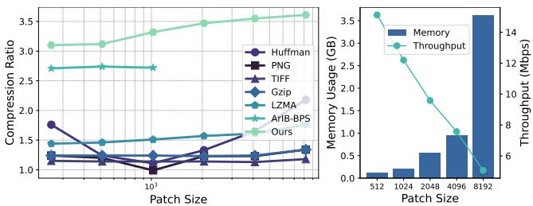
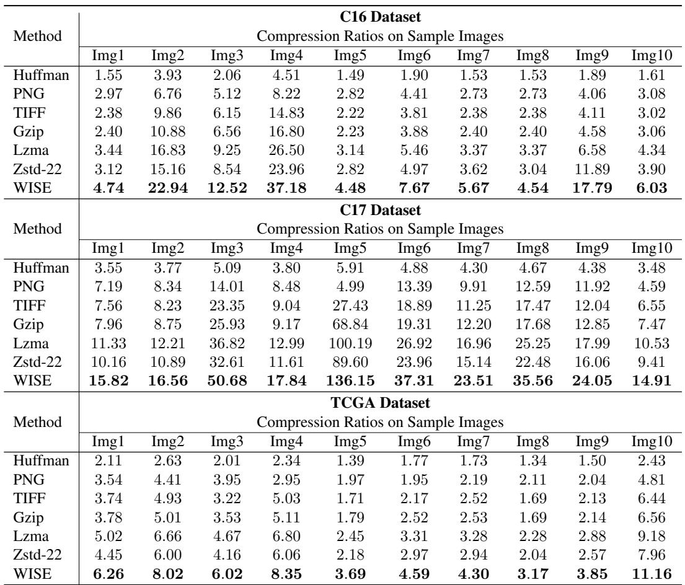
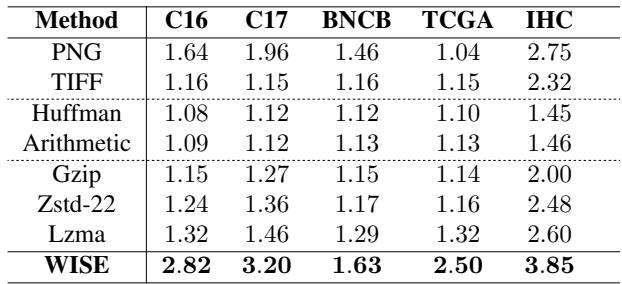
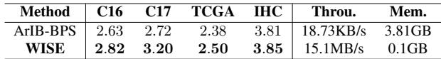
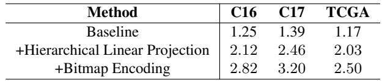
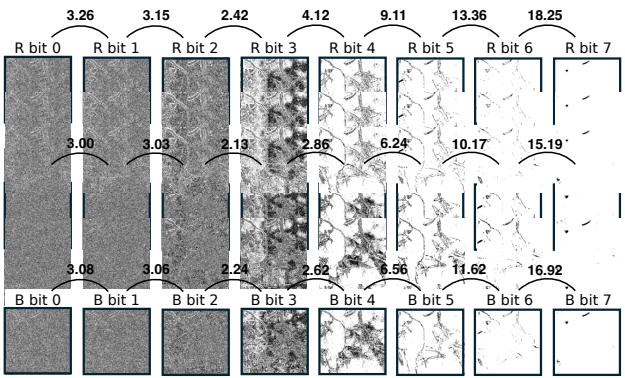
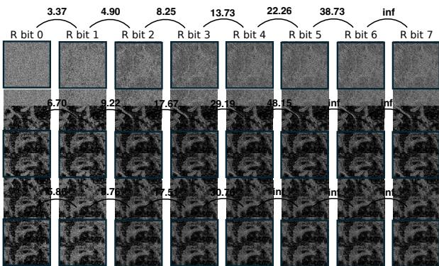

[← 返回 README](../README.md)

# 4. Experiments

## 预览

实验围绕三个问题：WISE 是否压得更高、是否更快、每个模块是否有效。证据链包括 gigapixel WSI 主结果、non-empty patch 结果、NN compressor 对比、吞吐/内存、消融和 bitmap PSNR 经验研究。

In this section, we conduct extensive experiments on realistic WSI images to answer the following research questions:

•RQ1: Can WISE achieve higher compression ratios than existing methods?   
•RQ2: Can WISE achieve higher compression throughput compared to current methods?   
•RQ3: What role does each technique in WISE play in improving compression performance?

> 💡 **实验结构**: RQ1 对应 Table 2/3/4，RQ2 对应 Table 4 和 Figure 5 右图，RQ3 对应 Table 5 与 Figure 6/7。阅读时按 claim 找证据，比逐表读更清晰。

## 4.1. Experimental Setups

Datasets We selected five H&E datasets and one IHC dataset as our benchmarks. The H&E datasets include famous and well-known C16 [6], C17 [20], TCGA [32], BNCB [34], and DigestPath [9]. To further increase dataset diversity, we incorporated a recently emerging IHC [4] dataset named IHC4BC, alongside the more commonly used H&E-stained datasets.

> 💡 **数据覆盖**: C16/C17/TCGA 是主流 WSI benchmark，BNCB/DigestPath/IHC4BC 增加组织和染色多样性。IHC 的加入有意义，因为不同 staining 会改变颜色分布和 bit-level redundancy。

Baselines Our selected baseline encompasses nearly all types of lossless compression algorithms, including image encoders, deep learning-based image encoders, entropy encoders, and dictionary-based encoders. Specifically, for image encoders, we selected PNG and TIFF; for deep learning-based image encoders, we chose ArIB-BPS. For entropy encoders, we included the well-known Huffman and arithmetic coding. As for dictionary-based encoders, which are of particular interest to us, we selected three options: GZip, Zstd-22(level 22), and LZMA.

> 💡 **baseline 设计**: baseline 覆盖 image、entropy、dictionary、NN 四类，能支撑“不是只赢某一种 codec”的结论。Zstd-22 是强字典 baseline，ArIB-BPS 是 learned bit-plane baseline，二者是最关键对照。

Evaluation Metrics For lossless compression, the compression ratio is the primary performance metric. Additionally, we also consider throughput. Lossless compression does not cause any information loss in the image. Therefore, unlike typical lossy methods, we do not measure PSNR and SSIM for the decoded image in our experiments. However, we still use PSNR in Sec. 4.6 to measure the similarity between bitmaps, aiming to demonstrate that the bitstream after bitmap coding has higher local similarity.

> 💡 **指标边界**: decoded image 不测 PSNR/SSIM 是正确的，因为 lossless 解码应完全一致；Sec. 4.6 的 PSNR 不是质量指标，而是 bitmap 相似性指标，用来解释字典压缩为何更有效。

## 4.2. Compression Performance on Gigapixel WSIs

Tab. ?? presents the main compression results comparing WISE with the existing state-of-the-art compression methods. We present a comparison of average compression ratios between six lossless baseline methods and our approach on three of the most well-known datasets—C16, C17, and TCGA. As shown, WISE achieves a substantial improvement over all other lossless compression methods. Specifically, WISE improves compression rates by $100 \%$ to $500 \%$ compared to non-dictionary-based methods. For dictionarybased methods, our compression ratio surpasses Gzip by $100 \%$ , and even outperforms the current best dictionarybased method, Zstd-22 (highest compression level of Zstd), by $70 \%$ to $80 \%$ . WISE 's compression improvements are consistent across the different datasets.

> 💡 **主结果读法**: “Tab. ??” 是 MinerU/论文引用编号异常，实际对应 Table 2。这里的强 claim 是 WISE 在整张 gigapixel WSI 上同时赢 non-dictionary 和 dictionary baselines，说明前面的 WSI-specific transform 不是只对某个数据集有效。

To further illustrate the characteristics of WSI data, we provide specific compression ratios for 10 sample WSI images, each approximately 2GB in size. The compression rates vary significantly across images, mainly due to two factors: (i) the substantial blank areas in WSI images, and (ii) variations in tissue density. For instance, the first sample in Fig. 2 clearly contains large blank areas. Regardless of the image type, however, WISE consistently achieves exceptionally high compression ratios.

> 💡 **压缩率波动来源**: 整张 slide 的压缩率受空白面积和组织密度影响很大。C17 中最高 136.15x 很可能来自空白占比高/组织稀疏的样本；因此 Table 3 的 non-empty patch 结果更能看出 informative region 上算法本身的收益。

*Figure 5: Left: Compression ratio variations on different image sizes. Right: WISE's memory usage and throughput on different image sizes.*

> 💡 **Figure 5 批读**: 左图说明输入越大，dictionary-based 方法更容易利用已收集模式，压缩率通常上升；右图说明工程代价也随尺寸上升，LZW 字典搜索让 memory 增加、throughput 下降。

We further investigate the compression performance on non-empty patches, as these regions pose the primary challenge in compressing WSIs. Here, we expand our dataset to include five source: C16 $( 2 5 6 \times 2 5 6 )$ , C17 $( 2 5 6 \times 2 5 6 )$ , TCGA $2 5 6 \times 2 5 6 )$ , BNCB $( 2 5 6 \times 2 5 6 )$ , and an IHC dataset $( 1 0 2 4 \times 1 0 2 4 )$ . WISE consistently achieves significant compression improvements across different patch sizes, staining techniques, and datasets.

> 💡 **non-empty patch 证据**: 这一段专门排除“大量空白区让整图压缩率虚高”的质疑。Table 3 中 WISE 在 C16/C17/TCGA/BNCB/IHC 上都优于传统 lossless baselines，说明信息重排对 tissue region 仍有效。

## 4.3. Comparision with Neural-based Compressor

We also compared our method with NN-based approaches and found that it consistently outperforms the state-of-theart ArIB-BPS across all datasets, with improvements of $7 . 1 \%$ , $1 7 . 6 \%$ , and $5 \%$ on C16, C17, and TCGA, respectively. Additionally, we compared the efficiency of our method with NN-based compressors. This experiment was conducted on a CPU to ensure a fair comparison. As shown, the NN-based method is extremely slow, with a throughput of only $1 8 . 7 3 ~ \mathrm { K B / s }$ , whereas our method achieves a throughput of $1 5 . 1 \mathrm { M B } / \mathrm { s }$ , suitable for practical use. Furthermore, the NN-based method requires 3.81 GB of memory even for compressing a $2 5 6 \times 2 5 6$ patch, while WISE only needs 0.1 GB.

> 💡 **NN compressor 对比**: WISE 对 ArIB-BPS 的优势不只在压缩率，更在吞吐和内存。15.1 MB/s vs 18.73 KB/s 是约三个数量级差距；0.1 GB vs 3.81 GB 说明 WISE 更接近医院归档/批处理管线可用的 CPU 工具。

## 4.4. Framework Effectiveness

To further evaluate the practical applicability of our method, we explore its throughput and memory usage across different input image sizes in this section. All experiments were conducted using single-threaded Python code. We focus primarily on the compression efficiency of the informative areas, as the compression of empty areas has minimal impact. While the search algorithm for empty areas is important, it falls outside the scope of this paper, which is focused on compressing the informative regions. As observed, both throughput decreases and memory usage increases with the input size. This is primarily due to the LZW algorithm's dictionary collection process, where memory usage grows as the input size increases, driven by the increased complexity of the search. However, this is accompanied by an improvement in compression ratio. It is worth noting that when the input size reaches $8 1 9 2 \times 8 1 9 2 \times 3$ ,our method achieves a memory usage comparable to ArIB-BPS, but with a significantly lower memory footprint of only $_ { 3 \mathrm { ~ G B ~ } }$ .

> 💡 **效率权衡**: 更大 patch 给字典更多上下文，所以压缩率变好；但 LZW 字典搜索和存储让 memory 增加、throughput 降低。这个权衡决定了实际部署时 patch size 不能只按压缩率最大化。

Table 2. Compression results for C16, C17, and TCGA datasets (without overall average column).

*Table 2: C16、C17、TCGA 整图样本压缩率。*

> 💡 **Table 2 批读**: Table 2 是 36x/136x claim 的主要来源。MinerU 的 HTML 表格文本有错位，因此这里使用原始表格图片。阅读重点是 WISE 在不同 slide 样本上都高于 Zstd-22/LZMA，且 C17 某样本达到 136.15x。

Table 3. Comparison of our method with other traditional compressor on patches on various WSI datasets including C16, C17, TCGA, BNCB, and IHC4BC.

*Table 3: WISE 与传统 compressor 在 non-empty patches 上的压缩率。*

> 💡 **Table 3 批读**: 这张表更能说明 informative tissue region 的难点。WISE 在 C16/C17/TCGA/IHC 上相对 LZMA 仍明显提升；BNCB 提升较小但仍最高，说明不同数据集的组织密度和 stain 分布会影响收益。

Table 4. Comparison of WISE with Neural-Network compressor on patches from various WSI datasets including C16, C17, TCGA, BNCB, and IHC4BC. Throu. stands for throughput and Mem. stands for memory usage.

*Table 4: WISE 与 ArIB-BPS 的 patch 压缩率、吞吐和内存对比。*

> 💡 **Table 4 批读**: ArIB-BPS 的压缩率接近 WISE，但吞吐和内存明显不适合大规模 WSI 归档。WISE 的优势是“足够高压缩率 + CPU 可运行 + 低内存”三者同时成立。

## 4.5. Ablation Study

Effectiveness of Proposed Techniques We conducted ablation experiments on C16, C17, and TCGA to demonstrate the effectiveness of each proposed technique. The baseline shown in the table is a basic dictionary-based algorithm, LZMA. Results indicate that applying LZMA alone is not highly effective, even though, as discussed in the previous section, LZMA provides a certain level of compression compared to other lossless algorithms. Medcomp improves the compression ratio of the dictionary-based method to $1 1 3 . 5 \% \sim 1 3 0 . 2 \%$ Specifically, the proposed Hierarchical encoding achieves relative improvements over the baseline by $6 9 . 6 \%$ , $7 6 . 9 \%$ ,and $7 3 . 5 \%$ on C16, C17, and TCGA, respectively. Furthermore, the proposed bitmap encoding can further increase the compression ratio to $1 2 5 . 6 \%$ , $1 3 0 . 2 \%$ , and $1 1 3 . 5 \%$ .

> 💡 **消融主结论**: LZMA alone 是 baseline，+hierarchical linear projection 给最大第一跳提升，+bitmap encoding 再进一步提升。正文中 “Medcomp” 很可能是作者笔误/残留命名，结合上下文应指 WISE 的 proposed techniques。

Table 5. Ablation Study on various WSI datasets including C16, C17, TCGA.

*Table 5: LZMA baseline、+Hierarchical Linear Projection、+Bitmap Encoding 的消融。*

> 💡 **Table 5 批读**: C16 从 1.25 到 2.12 再到 2.82，C17 从 1.39 到 2.46 再到 3.20，TCGA 从 1.17 到 2.03 再到 2.50。这个阶梯结果直接支撑“transform 让 dictionary coding 更有效”的机制解释。

Compression ratio under different input image sizes. In Fig. 5, we show the variation in compression ratios for six baselines and our method across different input image sizes. The ArIB-BPS, a neural network-based approach, was tested on a single 24GB Nvidia-4090 GPU. Due to memory constraints, it was limited to processing images of size $1 0 2 4 \times 1 0 2 4$ and smaller. As observed, the compression ratio for images smaller than $1 0 2 4 \times 1 0 2 4$ remains largely unchanged. Another key observation is that all dictionary-based compression methods show improved compression ratios as the input size increases. This is intuitive, as dictionary-based methods can better exploit previously collected patterns when more input data is available. In contrast, the compression ratios for entropy-based methods are less consistent and do not show the same trend.

> 💡 **尺寸效应**: 这段解释为什么 Figure 5 左图中大输入更有利于 dictionary methods。对 WISE 来说，patch size 是压缩率、内存、吞吐之间的系统参数。

## 4.6. Empirical Study

We present an empirical study on a specific WSI patch to validate several conclusions discussed earlier from a different perspective. Figs. 6 and Fig 7 illustrate the similarity between the original WSI patch and its bitmap representation after delta coding, with similarity measured using PSNR. Bitmap transposition improves the efficiency of dictionary collection. From Fig. 6, it can be observed that after performing a bitmap split on the original image, the bitmap similarity for each channel is around 3 to approximately 18. Moreover, the similarity between lower-bit bitmaps is lower, while the similarity between higher-bit bitmaps is higher. Next, we examine Fig 7, which shows the similarity between the bitmaps of the sample patch after applying the proposed hierarchical linear coding. The first conclusion from this figure is that the similarity between the bitmaps after hierarchical linear coding significantly increases compared to the original patch, rising from 3 to 48. In fact, some higher-bit bitmaps reach an infinite PSNR value, as they have no information variance and are identical, confirming that "the range of pixel values is largely shortened by hierarchical linear coding" as stated in Sec. 3.5. Hierarchical linear coding further concentrates information in the lower bit positions. The second conclusion is that, due to the high similarity between the bitmaps after hierarchical linear coding, they are more easily grouped into similar patterns, making them more compressible. Indeed, during the experimental process, we observed a similar phenomenon in the dictionary coding stage. The collected patterns across different channels and bitmaps showed high similarity.

> 💡 **经验研究意义**: Figure 6/7 不是证明图像质量，而是证明 bitmaps 的局部相似性提高。higher-bit bitmap 甚至 infinite PSNR，说明高位几乎没有变化；这正是 bitmap encoding 能帮助 LZW 的原因。

*Figure 6: PSNR of bitmaps before Bitmap Coding. Bitmaps in higher bit positions have larger empty areas and higher PSNR values, indicating they contain less information.*

> 💡 **Figure 6 批读**: 原始 bitmap split 后，bit position 越高越空，PSNR 越高；低位仍更杂乱。这说明“有效信息集中在低位”已经存在，但还没有经过 hierarchical projection 进一步强化。

*Figure 7: PSNR of bitmaps after Bitmap Coding. The PSNR between bitmaps increases significantly, indicating more repetitive patterns among bitmaps, which enhances dictionary coding.*

> 💡 **Figure 7 批读**: hierarchical linear coding 后 bitmap 间相似性显著上升，最高到 48 或 infinite。它把 Table 5 的消融结果解释成 bit-level 现象：不是 LZW 突然变强，而是输入流变得更重复。

> 💡 **Q&A 批注记录**:
> - Q: WISE 的平均 36x 是否完全来自空白区域？
> - A: 不是。Table 2 的整图结果确实受空白面积影响，但 Table 3/4/5 都在 non-empty patch 或 informative area 上验证了 hierarchical projection + bitmap encoding 的独立收益。

## Section 总结

| Claim | 证据 |
|-------|------|
| WISE 整图压缩率高 | Table 2，平均 36x、最高 136x |
| WISE 对 non-empty patch 也有效 | Table 3，多个 WSI 数据集均高于传统 compressor |
| WISE 比 neural compressor 更实用 | Table 4，15.1 MB/s、0.1 GB vs 18.73 KB/s、3.81 GB |
| 两个 transform 都必要 | Table 5，LZMA→hierarchical→bitmap 逐步提升 |
| bitmap 重排帮助字典收集 | Figure 6/7，bitmap PSNR/相似性显著提高 |

