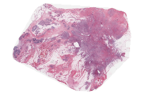
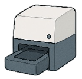

# 03 Methodology

[← 返回 README](../README.md)

## 📌 Preview

> 方法核心五个模块：(1) Content Score 生成——用病理基础模型 CHIEF 提取 attention，经 MLP + Tanh-Sigmoid 门控 + 指数映射得到 patch 级诊断分数；(2) 编码器——RBS 降采样 + TCM (Swin Transformer-CNN 混合) 建模 4x4 patch 间关系；(3) QCM——用 MLP 从 content score 生成 channel-wise scale & bias，仿射变换调制特征；(4) 熵模型——Hyperprior + Channel-wise Context Model；(5) 区域级比特流格式——支持全图/按区域解码。训练时 Q~U[0,1] 模拟所有压缩水平，推理时切换为真实 Q。

---

## 原文

We illustrate the overall framework of PathoLIC in Fig. 2. The input WSI is first partitioned into non-overlapping patches, each assigned with a content score according to its clinical relevance. Neighboring patches are then grouped into fixed-size regions of L x L patches. PathoLIC compresses each region into a bitstream under the guidance of patch-level content scores. The compressed WSI is obtained by aggregating the bitstreams generated from all regions, which can be decompressed to reconstruct the original WSI. Section 3.1 introduces the measurement of patch-level diagnostic value. The generated patch-level content scores guide the subsequent context-aware compression and decompression processes (see Sections 3.2 and 3.3), while the training and inference strategies of PathoLIC are detailed in Section 3.4.

*Figure 2. An overview of the proposed framework for WSI compression. (a) Generation of content scores for WSI-level inference. A pretrained foundation model (e.g., CHIEF (Wang et al., 2024)) is used to produce an attention map, highlighting diagnostically salient areas. The map is normalized and converted into patch-level content scores. (b) Detailed architecture of PathoLIC. The framework consists of an encoder ga, a hyper-encoder ha, a decoder gs, a hyper-decoder hs, a channel-wise context model, and quality control modules (QCMs). QCMs are inserted at multiple stages to adapt feature representations based on input content scores. During training, AE and AD are excluded, and the rate is estimated using the entropy model (* means inference only).*

> 💡 **Figure 2 批读**：这张 overview 图是理解 PathoLIC 的关键。分成两个子图：(a) Content Score Generation——用 CHIEF (一个预训练的病理基础模型) 提取 attention map，然后通过 MLP+Tanh-Sigmoid 门控 → 归一化 → 指数映射，得到每个 patch 的 content score Q；(b) PathoLIC Architecture——注意 QCM 模块出现在四个位置：encoder output (y)、hyper-encoder output (z)、entropy parameters (μ, σ)、decoder input (ŷ)。每个 QCM 都接受 content score Q 作为条件，实现了从编码到解码的全链路内容感知调制。训练时 AE/AD 被排除（*星号标记 inference only），用熵模型的负对数似然估计 R。

### 3.1. Assessment of patch-level diagnostic relevance

Our objective is to achieve variable-rate compression of WSI based on the patch-level diagnostic importance. Traditional measures, such as entropy, are effective at capturing pixel-level statistics but fail to reflect the clinical relevance of different regions within the WSI. In contrast, recent pathology foundation models can automatically extract disease-relevant features to perform WSI-level predictive tasks (Xu et al., 2024; Wang et al., 2024). Thus, we adopt CHIEF, a pretrained foundation model (Wang et al., 2024), to estimate patch-level content scores. As illustrated in Fig. 2(a), patch-level features extracted by CHIEF are processed through an attention module composed of multilayer perceptron (MLP) layers and a Tanh-Sigmoid gating mechanism, which produces an attention score for each patch. To obtain the final content scores for variable-rate compression, attention values are projected using an exponential function. In practice, high content scores align with diagnostically salient areas such as tumors or inflammatory regions, whereas low content scores are associated with less informative tissues such as adipose or stromal areas.

> 💡 **问题动机**：选择 CHIEF 作为 content score 的来源是一个"借力打力"的设计——与其从零训练一个诊断重要性评估模型，不如直接利用已在大规模病理数据上预训练的 foundation model 的 attention。CHIEF (Nature 2024) 的 attention 已经在病理诊断任务中被验证能定位到肿瘤区域。Tanh-Sigmoid 门控机制是一种常见的 attention gating 设计，能有效抑制噪声。指数映射则是为了将 attention 值从一个窄区间（由门控压缩后的值）扩展到 [0,1] 区间，使得后续的 λ 映射有足够的动态范围。

### 3.2. Content-aware WSI compression

A distinctive characteristic of WSIs is that adjacent patches often share similar tissue morphology. Leveraging this property, our first key innovation is to exploit the correlations among neighboring patches during compression, thereby enhancing compression efficiency. As shown in Fig. 2(b), an encoder ga(x) first maps the input region x of L x L patches into latent features:

**y = ga(x),** (1)

where ga is composed of Residual Blocks with Stride (RBS) (Cheng et al., 2020) and Transformer-CNN Mixture (TCM) blocks (Liu et al., 2023). Specifically, the RBS modules apply residual downsampling via stridden convolutions and progressively reduce the spatial resolution of feature maps. The TCM block employs a hybrid design that combines convolutional layers with Transformer layers. Convolutional layers capture local patterns like nuclei boundaries and textures, while Transformer layers model long-range spatial dependencies, allowing patches to refine their representations through global interactions. By combining the complementary strengths of convolution and self-attention, the proposed framework achieves a balance between local detail preservation and global contextual representation.

> 💡 **公式批读**：Eq. (1) y = ga(x) 是标准的编码器映射。关键在于 ga 的内部结构——RBS (Residual Block with Stride) 通过步长卷积实现空间降采样（类似 CNN 编码器的下采样），TCM (Transformer-CNN Mixture) 则在降采样后的特征图上同时做两种操作：CNN 捕捉局部纹理（核边界、细胞形态），Swin Transformer 的自注意力捕捉跨 patch 的长程依赖（如多个相邻 patch 是否都属于同一肿瘤区域）。这种"CNN 管局部 + Transformer 管全局"的分工是自然图像 LIC 中的成熟范式（Liu et al. 2023），PathoLIC 将其直接迁移到 WSI 的 region-wise 编码中。

Another key aspect of our framework is variable-rate compression guided by patch-level diagnostic relevance. In particular, the latent features are modulated by the proposed Quality Control Module (QCM) under the guidance of content scores Q of the input region:

**y_control = QCM_y(y, Q).** (2)

*Figure 3. Architecture of the proposed QCM. Content scores Q are mapped by an MLP to generate scale (alpha) and bias (beta) parameters, which modulate the input feature map via an affine transformation for content-aware compression.*

> 💡 **Figure 3 批读**：QCM 的结构非常简洁——content score Q 通过 MLP 生成两个 C 维向量（α 和 β），然后对输入特征图 F 进行 channel-wise 的仿射变换：F_mod = (α+1) * F + β。注意这里的 (α+1) 不是 α，而是一个残差形式的缩放——当 α≈0 时退化为 F_mod ≈ F + β（轻微的偏置调整），保留了原始特征的恒等路径。这种设计保证了 QCM 在不需要调制时的稳定性。

As illustrated in Fig. 3, QCM applies a feature-wise affine transformation conditioned on Q. Given an input feature F, QCM generates channel-wise scale and bias parameters using a lightweight MLP:

**[alpha, beta] = MLP(Q), alpha, beta in R^C,** (3)

**F_modulated = (alpha + 1) * F + beta,** (4)

where C is the channel dimensionality and (*) denotes the element-wise channel scaling. The residual-style scaling (alpha + 1) preserves the stability of the original features while allowing controlled amplification or attenuation with respect to the target quality. The bias beta further introduces a flexible shift, allowing the network to adjust feature distributions as needed. Together, these two operations provide fine-grained modulation of intermediate representations, allowing QCM to seamlessly adapt across different compression levels.

> 💡 **公式批读**：Eq. (3)-(4) 是 QCM 的全部数学。MLP 的输入是标量 Q（单个 content score），输出是 2C 个参数（α 和 β 各 C 维）。这意味着一个 MLP 同时生成 scaling 和 shifting 参数，然后对 C 个通道分别应用独立的缩放和偏移。关键观察：QCM 的参数量非常小（MLP 轻量级 + channel-wise 操作），但被插入在编码器、超编码器、熵参数、解码器的四个位置——这种"轻量模块 + 多处插入"的设计在保证表达力的同时不显著增加模型大小。

To improve entropy modeling, a hyper-encoder ha extracts side information from the modulated latent features:

**z = ha(y_control),** (5)

which is further processed by another QCM:

**z_control = QCM_z(z, Q),** (6)

and then quantized:

**z_hat = Quantize(z_control).** (7)

The hyperprior pathway, therefore, provides accurate distributional priors for entropy coding of the main latent information. Importantly, quantization (Q), arithmetic encoding (AE) and decoding (AD) are utilized exclusively during inference. Specifically, AE converts y_hat, z_hat, and the corresponding content scores into binary streams for storage, while AD reconstructs features from these streams. Consequently, the final compressed WSI is represented as the aggregation of the binary streams from all input WSI regions.

> 💡 **机制拆解**：Hyperprior 路径（ha → QCM_z → Quantize → z_hat）的作用是"用极少量的边信息（side information）来建模主潜在变量 y 的概率分布"。这是 Ballé et al. 2018 的经典设计——z 捕获 y 的空间结构信息，用于估计每个 y 元素的均值和方差，使熵编码更压缩。注意 Q 不仅调制 y，还调制 z——这意味着 content score 同时影响"主信号"和"边信息"的表示，实现了全链路的自适应。

### 3.3. Content-aware WSI decompression

The decoder of PathoLIC mirrors the encoding process to reconstruct image patches, with reconstruction fidelity explicitly guided by the content scores. In particular, the hyper-decoder hs estimates the channel-wise spatial statistics-specifically, the mean (mu) and variance (sigma)-from z_hat, which are subsequently modulated by the content scores:

**mu, sigma = hs(z_hat),** (8)

**(mu_control, sigma_control) = QCM_mu_sigma(mu, sigma, Q).** (9)

The modulated latent y_control is then quantized and passed through the channel-wise context model (CCM) for entropy coding:

**y_hat = CCM(Quantize(y_control); mu_control, sigma_control),** (10)

where the CCM employs masked convolutions and attention layers to capture both local and non-local dependencies across latent channels (see (Liu et al., 2023) for details). By leveraging these dependencies, the CCM produces more accurate probability estimates, further reducing the expected bits.

> 💡 **公式批读**：Eq. (8)-(10) 描述了解码/解压过程。hs 从 z_hat 预测 μ 和 σ（每个空间位置的均值和方差），这些参数定义了 y 条件概率分布（通常建模为高斯分布 N(μ, σ^2)）。QCM 再次使用 content score Q 调制 μ 和 σ——这意味着对于高诊断价值的 patch（Q→1），熵模型倾向于保留更大的方差（更"保守"的编码，更多比特），而对于低诊断价值 patch（Q→0），方差被压缩（更"激进"的编码，更少比特）。CCM 的 masked convolution 是自回归模型——解码 ŷ_i 时只能看到已解码的 ŷ_{<i}，利用通道间的条件依赖性进一步提高概率估计精度。

Finally, the quantized latent y_hat is modulated once more:

**y_hat_control = QCM_y_hat(y_hat, Q),** (11)

before being decoded by gs to reconstruct the input region:

**x_hat = gs(y_hat_control).** (12)

> 💡 **机制拆解**：注意 QCM 的四处插入位置形成了一个"闭环调制"：Encoder output (y) → Hyper latent (z) → Entropy params (μ, σ) → Decoder input (ŷ)。每一处调制都在不同的语义层次上影响压缩行为——y 层的调制影响"哪些特征需要保留"，z 层的调制影响"边信息分配多少比特"，μ/σ 层的调制影响"熵编码的保守程度"，ŷ 层的调制影响"最终重建的保真度"。这种多层联动的设计比仅在编码器输出端做一次调制更为精细。

### 3.4. Optimization and inference strategy

It is important to note that the content scores derived from foundation models are applied only at the inference stage to guide compression. During training, the model instead relies on the content scores randomly sampled from a fixed range, which enhances generalization of PathoLIC across diverse compression levels. For each patch x, a content score q is sampled from a uniform distribution, q ~ U[0, 1], and mapped to the corresponding weighting factor lambda in [0.0025, 0.04] via an exponential projection:

**lambda(q) = 0.0025 * (0.04 / 0.0025)^q.**

Crucially, we treat the content score Q as a continuous 'soft prior' for rate allocation. The mapping is bounded (lambda in [0.0025, 0.04]) to establish a quality floor, preventing overly aggressive compression in low-score regions regardless of the foundation model's bias. The model is then optimized end-to-end to minimize the rate-distortion loss:

**L = E_{x,Q} [R(x; Q) + lambda(Q) * D(x, x_hat(Q))],** (13)

where R(x) denotes the estimated rate term, computed as the sum of the negative log-likelihoods (expected bit cost) of the quantized latents and hyper-latents, Q denotes the set of content scores of all patches within the input region, D(x) is the distortion measured by MSE, and lambda(Q) controls the trade-off between compression efficiency and reconstruction fidelity. This setup forces the model to learn a continuous mapping from content scores to different compression levels, thereby improving its generalization across diverse compression settings. During inference, each patch is assigned a content score derived from the attention values of the pathology foundation model (Wang et al., 2024), as outlined in Section 3.1. The same exponential mapping is then applied to compute lambda(Q).

> 💡 **公式批读**：Eq. (13) 是 PathoLIC 最核心的优化目标。与标准 LIC (L = R + λD) 的关键区别：(1) λ 不是全局常数，而是 patch-adaptive 的 λ(Q)；(2) 期望是对 (x, Q) 的联合分布求的——x 来自训练数据分布，Q 来自 U[0,1] 均匀采样。这确保了模型在训练中见过各种 λ 值，推理时可以泛化到真实 content score 对应的 λ。

> 💡 **机制拆解**：指数映射 λ(q) = 0.0025 * (0.04/0.0025)^q 的设计值得深入理解。当 q=0（最低诊断价值），λ=0.0025（最小权重，允许最大失真/最小码率）；当 q=1（最高诊断价值），λ=0.04（最大权重，要求最小失真/最大码率）。λ 的范围 [0.0025, 0.04] 跨了一个数量级（ratio=16），这意味着最高和最低诊断价值的 patch 之间的 RD trade-off 可以相差 16 倍。底部的 0.0025 是一个"质量地板"，防止即使 q=0 的背景区域也被完全破坏（仍需保留一定结构信息以便下游模型使用）。

### 3.5. WSI bitstream storage and decompression

For model deployment, we design a region-wise WSI bitstream format to enable efficient storage and access of compressed WSIs in standard digital pathology settings. Specifically, the WSI is partitioned into non-overlapping regions, where every 4 x 4 adjacent patches are aggregated into a single compressed bitstream segment. A lightweight index table is maintained in the file header to map the spatial coordinates of these units to their corresponding byte offsets, enabling high-speed random access without global scanning. Based on the practical needs of clinicians during diagnosis, the decoding scheme is designed to provide two key functionalities:

- **WSI-level decompression**: It supports decoding the complete bitstream back into standard pyramidal SVS formats, ensuring compatibility with existing commercial slide viewers (e.g., Aperio ImageScope, QuPath).

- **Region-level decompression**: Leveraging the spatial independence of our block-based compression, the interface allows users to decode specific regions based on coordinates or diagnostic scores without processing the entire file. For example, clinicians can choose to decode only the top 10% diagnostically relevant patches for rapid assessment, significantly reducing I/O latency in bandwidth-constrained environments.

> 💡 **机制拆解**：比特流格式设计是"工程落地"的关键。4x4 patch 的分组粒度有两个好处：(1) 与压缩模型的输入 region 大小一致，无需额外切分或拼接；(2) 提供足够的空间独立性——每 16 个 patch 的压缩是独立的，因此可以按需解码任意 region。索引表（coordinate → byte offset）的方案类似于 TIFF 的 IFD 结构，是成熟的文件格式设计模式。按诊断分数选择性解码 top-10% 区域是一个很实用的场景——病理医生在远程会诊时可以快速获取最相关的区域开始分析，而不需要等待整个 GB 级文件下载和解压。

---

## 🔖 方法论批注总结

- **五个模块协同**：Content Score（自动化诊断评估）→ Encoder（RBS+TCM 混合架构）→ QCM（四处插入的内容感知调制）→ Entropy Model（Hyperprior+CCM）→ Bitstream Format（区域独立存储+索引）
- **训练/推理不对称设计**：训练时 Q~U[0,1] 均匀采样 → 模型学习任意 λ 下的压缩行为；推理时 Q 来自真实病理模型 → 零样本泛化。这是全文最巧妙的设计之一
- **λ 的语义**：λ(Q) 从"RD trade-off 超参数"升级为"诊断重要性的函数"——Q 高 → λ 高 → 更注重保真度（保留诊断特征）；Q 低 → λ 低 → 更注重压缩（可以丢失视觉细节）
- **QCM 的四处插入**：Encoder output → Hyper-latent → Entropy params → Decoder input，形成从编码到解码的全链路内容感知
- **一个未详细讨论的细节**：训练时 AE/AD 被排除，R 用熵模型的负对数似然估计。这在 LIC 中是标准操作（因为 AE/AD 不可微），但在推理时需要实际的算术编码器
