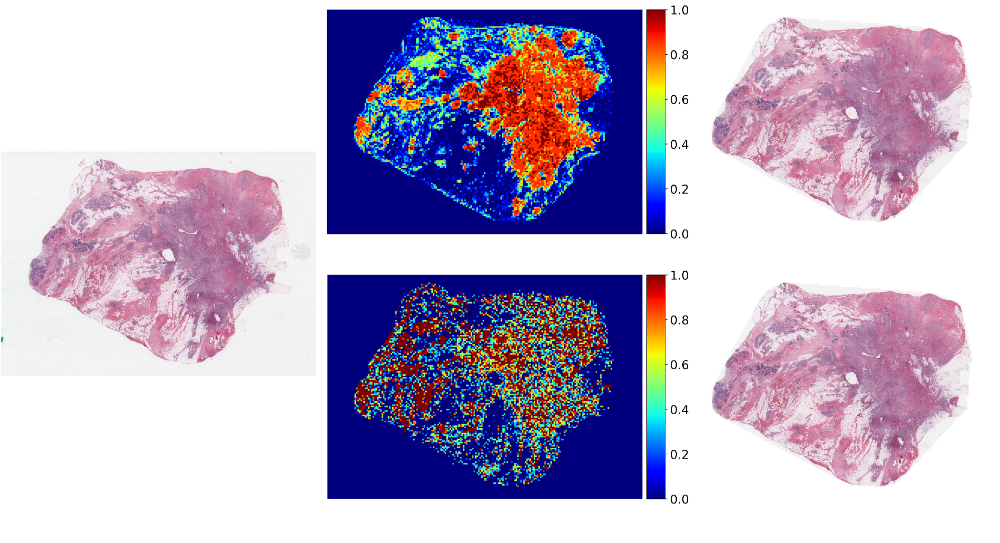
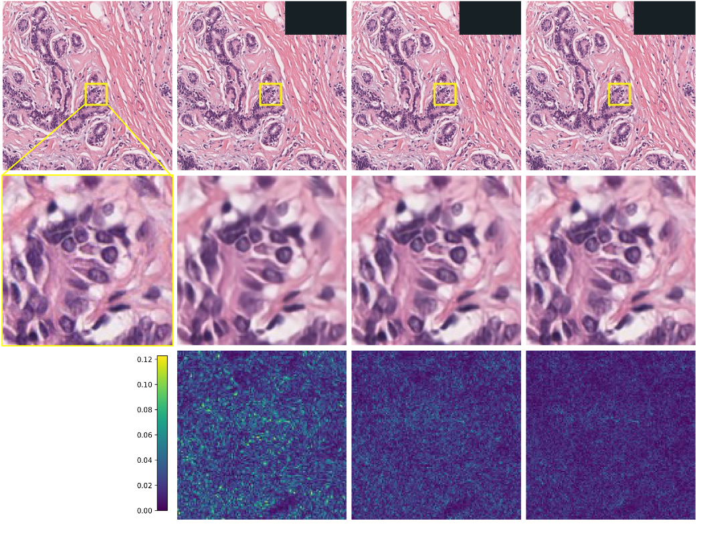
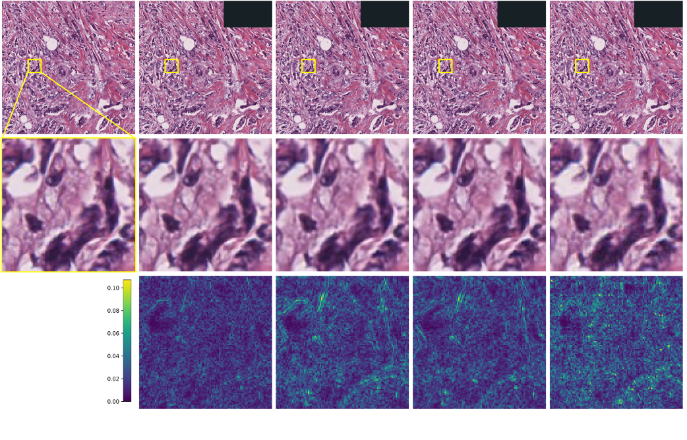
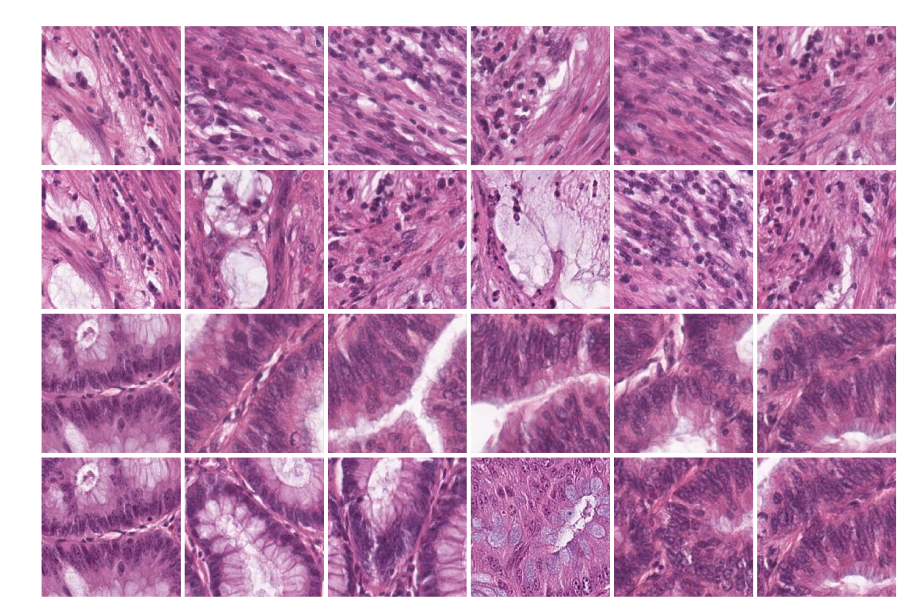
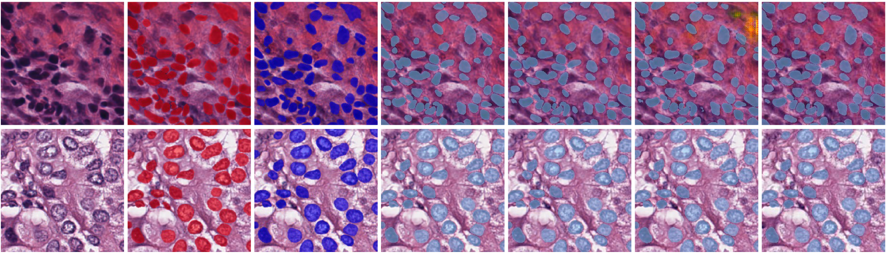
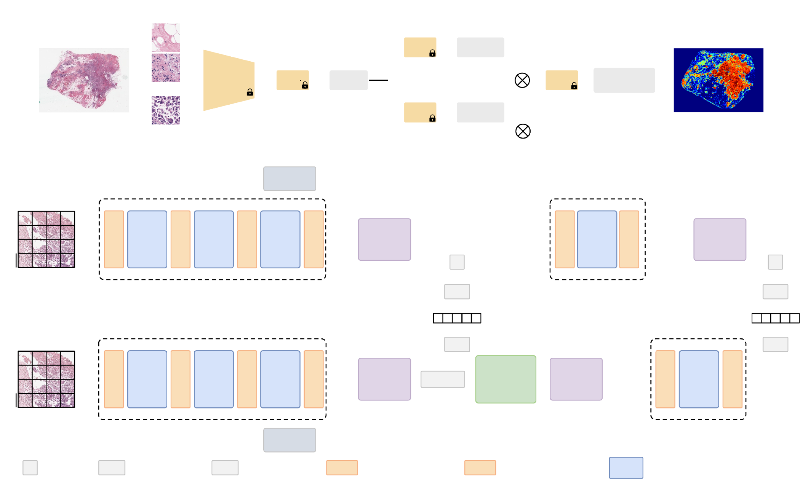
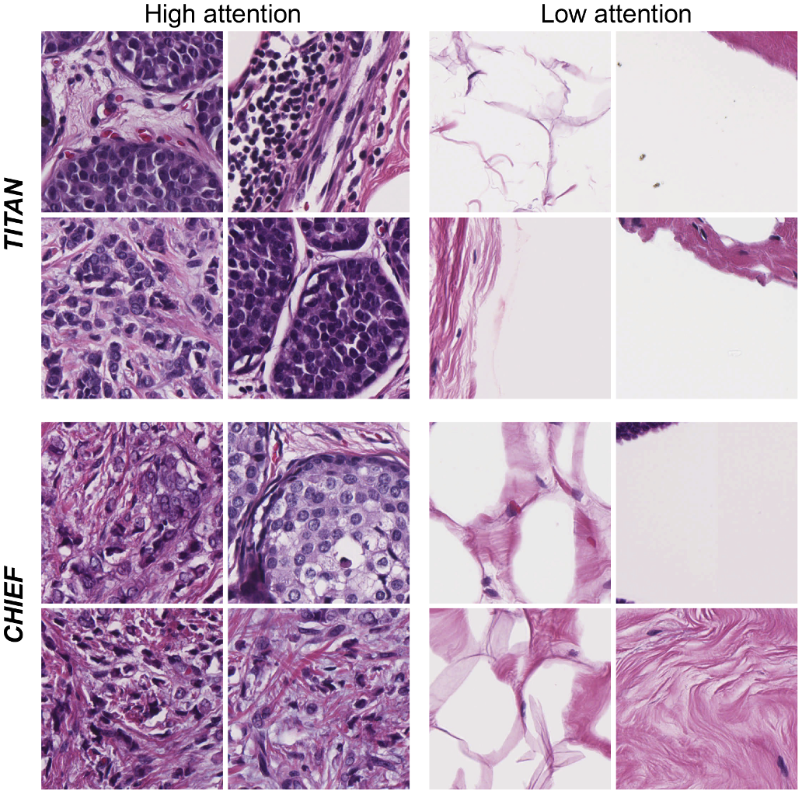

# 04 Dataset Preparation and Experimental Settings & 05 Experiments and Results

[← 返回 README](../README.md)

## 📌 Preview

> 实验部分的评估体系设计得非常系统：从 R-D 性能（压缩质量基准）→ 下游任务层级评估（WSI 亚型 → 生存预测 → patch 分类 → ROI 检索 → 细胞核分割）→ 基础模型影响分析 → 消融实验。每一层都同时给出定量指标和定性可视化（重建图/热力图/检索结果/分割边界）。核心结论：PathoLIC 在 5 类任务、10+ 数据集上均保持与原始数据接近甚至相当的诊断性能，同时实现 8x+ 压缩。

---

## 4. Dataset preparation and experimental settings

### 4.1. Datasets for training and evaluation

We first introduce the training dataset of PathoLIC, followed by a description of diverse public and in-house datasets used to evaluate our framework across multiple tissue types and downstream tasks. We evaluate PathoLIC following a hierarchy of downstream clinical tasks, including WSI-level tasks (subtyping and survival prediction), patch-level tasks (histology classification and ROI retrieval), and cell-level task (nuclei segmentation).

> 💡 **机制拆解**：实验设计的逻辑是从"压缩本身好不好"（R-D 性能）到"压缩后诊断还能不能做"（下游任务层级评估）。这种两层验证结构是医学影像压缩论文的标准范式——在计算机视觉领域，PSNR/MS-SSIM 就够了；但在医学影像领域，必须证明压缩不影响临床决策。

#### 4.1.1. Datasets for compression

As shown in Table 1, PathoLIC is trained on 73,730 patches, with 1000 patches reserved for validation and 3694 for test. All patches (1,024 x 1,024 pixels at 40x magnification) are extracted from TCGA-BRCA (Weinstein et al., 2013), TCGA-NSCLC, as well as from an in-house dataset collected at Yunnan Cancer Hospital. Importantly, patches used to train the compression model are excluded from the validation of downstream tasks.

> 💡 **机制拆解**：训练/评估的数据隔离做得很好——用于训练压缩模型的 patch 被**完全排除**在下游评估之外。这避免了一个常见的实验污染：如果压缩模型和下游模型看到了相同的 patch，那么 downstream performance 的保持可能不是因为压缩好，而是因为下游模型过拟合了特定 patch。7.3 万 patch 的训练量在 LIC 中算是中等规模。

**Table 1: Overview of dataset usage and data splits.**

| Dataset | Unit | Training | Validation | Test | Downstream Evaluation |
|---------|------|----------|------------|------|-----------------------|
| TCGA-BRCA | WSI | 623 | 208 | 209 | WSI-level subtyping, Survival prediction |
| TCGA-NSCLC | WSI | 620 | 206 | 207 | WSI-level subtyping, Survival prediction |
| TCGA-RCC | WSI | 561 | 188 | 188 | WSI-level subtyping |
| BACH | WSI/Patch | 18 / 12,384 (512) / 3,060 (1024) | 2 / 4,127 / 1,019 | 8 / 4,130 / 1,023 | Patch-level classification |
| In-house | WSI/Patch | 18 / 3,940 (512) / 122 (1024) | 4 / 1,313 / 40 | 8 / 1,315 / 43 | Patch-level classification |
| PanNuke | Patch | 5,179 | -- | 2,722 | Cell-level segmentation |
| MNS | Patch | 431 | -- | 209 | Cell-level segmentation |
| NCT-CRC-HE-100K | Patch | 100,000 | -- | 7,180 | ROI retrieval |

> 💡 **表 1 批读**：注意训练数据的下划线标记——只有 TCGA-BRCA、TCGA-NSCLC 和 In-house 的 patch 被用于训练压缩模型（73,730 张）。其他数据集（TCGA-RCC, BACH, PanNuke, MNS, NCT-CRC-HE-100K）完全没有参与压缩模型的训练，仅用于下游评估。这是评估泛化性的强设计——跨数据集、跨癌种、跨任务的 zero-shot 评估。

#### 4.1.2. Datasets for WSI-level subtyping

We employ three datasets from The Cancer Genome Atlas (TCGA) for WSI-level evaluation:
- **TCGA-BRCA**: Invasive breast carcinoma WSIs for tumor subtyping.
- **TCGA-NSCLC**: Lung adenocarcinoma (LUAD) and lung squamous cell carcinoma (LUSC).
- **TCGA-RCC**: Three renal cell carcinoma subtypes (KIRC, KIRP, KICH).

#### 4.1.3. Datasets for WSI-level survival prediction

We conduct WSI-level survival prediction on TCGA-BRCA and TCGA-NSCLC datasets. Model performance is evaluated using the Concordance Index (C-index).

#### 4.1.4. Datasets for patch-level classification

We utilize two datasets for patch-level histology classification. Non-overlapping patches are cropped at two resolutions (512 x 512 and 1,024 x 1,024) to evaluate performance across different scales.

- **BACH**: Expert-annotated WSIs for multi-class histology classification.
- **In-house dataset**: Breast cancer WSIs from Yunnan Cancer Hospital, curated for a binary classification task (normal vs. invasive).

#### 4.1.5. Datasets for ROI retrieval

We utilize the NCT-CRC-HE-100K dataset (Kather et al., 2018) to evaluate patch-level retrieval performance, strictly following the data distribution and experimental settings of UNI (Chen et al., 2024). This dataset consists of 107,180 non-overlapping patches (224 x 224 pixels at 0.5 mpp) extracted from H&E-stained colorectal cancer WSIs, covering 9 tissue classes.

#### 4.1.6. Datasets for cell-level segmentation

We assess fine-grained segmentation performance using two benchmarks:
- **PanNuke**: H&E-stained patches from 19 different tissue types (Gamper et al., 2019).
- **Merged nuclei segmentation benchmark (MNS)**: A unified benchmark merging four public datasets: CoNSeP (Graham et al., 2019), Lizard (Graham et al., 2021), MoNuSeg (Kumar et al., 2017), and MoNuSAC (Verma et al., 2021).

### 4.2. Implementation details

#### 4.2.1. Model architecture and training

We implement our LIC framework with the PyTorch library and conduct all experiments on a single NVIDIA A100 GPU with 80 GB memory under Python 3.10. The architecture follows the hybrid Transformer-CNN framework of Liu et al. (2023), employing Swin Transformer blocks (with window sizes of 8 and 4 for main and hyperprior paths, respectively) and latent dimensions of 320 and 192 for y and z, respectively. Training is performed for 80,000 iterations using Kingma and Ba (2014) with a constant learning rate 4 x 10^-5.

#### 4.2.2. WSI preprocessing for training

WSIs are first partitioned into 256 x 256 patches at 40x magnification. Foreground tissue is identified using the pipeline in CLAM (Lu et al., 2021). These foreground patches are then grouped into training regions of size 1,024 x 1,024, each containing 16 patches.

#### 4.2.3. Inference strategies

We employ two distinct inference modes tailored to different downstream tasks:
- **Fixed high-fidelity compression**: For patch- and cell-level tasks that demand maximal detail preservation (patch-level classification, ROI retrieval, and nuclei segmentation), we uniformly assign the highest content score (q = 1) to all patches to minimize information loss.
- **Content-aware variable-rate compression**: For WSI-level analyses (subtyping and survival prediction), we employ the proposed content-aware strategy. We generate attention maps using pretrained foundation models, CHIEF (Wang et al., 2024) and TITAN (Ding et al., 2025).

> 💡 **机制拆解**：两种推理模式的切换逻辑值得注意。为什么 WSI 级任务可以用 content-aware 而 patch/cell 级必须用 fixed high-fidelity？WSI 级任务的输入是成百上千个 patch 的聚合（通过 MIL），单个 patch 的细节损失可以被全局上下文补偿——所以你可以在背景 patch 上省比特，在肿瘤 patch 上花比特，整体诊断性能不变。但 patch/cell 级任务输入就是单个或几个 patch，没有"全局补偿"的机会，必须全保真。

### 4.3. Experimental protocol

#### 4.3.1. Comparison methods

- **JPEG** (Wallace, 2002): Quality settings from 10 to 90.
- **JPEG2000** (Taubman et al., 2002): Wavelet-based standard.
- **QmapCompression** (Song et al., 2021): Spatial quality map for fine-grained rate control.
- **I2C** (Cai et al., 2024): Invertible neural network-based codec enabling continuous rate control via normalizing flows.

#### 4.3.2. Evaluation metrics

- **Reconstruction fidelity**: PSNR, MS-SSIM.
- **WSI-level classification**: Accuracy, BACC, AUROC, AUPRC.
- **Survival prediction**: C-index (Mean +/- Std).
- **Patch-level classification**: Accuracy, BACC, AUROC.
- **ROI retrieval**: ACC@K (K=1,3,5), MVACC@5.
- **Cell-level segmentation**: Dice, IoU, precision, recall, specificity.

---

## 5. Experiments and results

### 5.1. Rate-distortion performance and efficiency

As illustrated in Fig. 5 and summarized in Table 3, PathoLIC consistently outperforms all comparison methods in the high-fidelity setting (0.23-0.46 BPP), which is the most critical for preserving diagnostic information. For instance, at diagnostically relevant rate of 0.28 BPP, PathoLIC achieves a PSNR of 40.6 dB and an MS-SSIM of 0.990, surpassing both QmapCompression (40.2 dB / 0.989) and I2C (39.7 dB / 0.989). Traditional codecs such as JPEG and JPEG2000 excel in speed but suffer from lower reconstruction fidelity. Among the learned approaches, PathoLIC achieves a strong balance of high fidelity, efficient runtime, and moderate model size, making it particularly suitable for real-world digital pathology workflows. QmapCompression offers faster inference but lags behind in R-D performance, whereas I2C demonstrates considerably lower speed due to the large parameter count in its invertible CNN architecture. By contrast, our lightweight transformer design enables efficient processing while maintaining competitive reconstruction quality.

*Figure 5. Rate-distortion comparison. PathoLIC achieves superior Multi-Scale Structural Similarity Index (MS-SSIM) and Peak Signal-to-Noise Ratio (PSNR) across a range of Bits-Per-Pixel (BPP) compared to traditional compression methods (JPEG, JPEG2000) and other LIC methods (QmapCompression, I2C).*

> 💡 **Figure 5 批读**：RD 曲线显示 PathoLIC 在 MS-SSIM 和 PSNR 两个指标上全面领先。注意两个细节：(1) "high-fidelity setting (0.23-0.46 BPP)"——PathoLIC 的优势集中在低码率区（质量好且文件小），而这些码率正是临床诊断中最重要的区域（太低的码率会丢失诊断信息，太高的码率压缩比不够）；(2) QmapCompression 在 PSNR 上咬得更紧（40.2 vs 40.6），但在 MS-SSIM（结构相似性）上差距更大——说明 PathoLIC 的 Transformer 结构在保留组织纹理等结构信息上有明显优势。

**Table 2: Storage statistics (GB) and compression ratios for TCGA-NSCLC dataset.**

| Split | Original (GB) | PathoLIC(CHIEF) (GB) | Ratio(CHIEF) | PathoLIC(TITAN) (GB) | Ratio(TITAN) | JPEG (GB) | Ratio(JPEG) |
|-------|---------------|---------------------|--------------|---------------------|--------------|-----------|-------------|
| Training | 470.60 | 88.36 | 5.33x | 52.11 | 9.03x | 98.07 | 4.80x |
| Validation | 138.95 | 26.61 | 5.22x | 15.63 | 8.89x | 28.35 | 4.90x |
| Test | 148.92 | 28.16 | 5.29x | 16.60 | 8.97x | 30.01 | 4.96x |
| All | 758.47 | 143.13 | 5.30x | 84.34 | 8.99x | 150.58 | 5.04x |

> 💡 **表 2 批读**：PathoLIC(TITAN) 的 8.99x 压缩比 vs JPEG 的 5.04x——在绝对文件大小上，758GB 压缩到 84GB vs 151GB，差距 67GB。对数据中心来说这是非常实际的价值。CHIEF 引导的版本压缩比只有 5.30x（与 JPEG 差距不大），说明 content score 的"稀疏性"直接决定了最终的压缩效率。

**Table 3: Comparison of average encoding/decoding time and model size.**

| Method | Enc. Time (s) | Dec. Time (s) | Model Size (MB) |
|--------|---------------|---------------|-----------------|
| JPEG | 0.035 | 0.004 | - |
| JPEG2000 | 0.206 | 0.001 | - |
| QmapCompression | 0.207 | 0.117 | 316 |
| I2C | 9.114 | 21.831 | 576 |
| Ours | 0.293 | 0.310 | 879 |

> 💡 **表 3 批读**：速度上有明显 trade-off——PathoLIC 比 JPEG 慢约 8 倍编码、75 倍解码，但比 I2C 快两个数量级（0.29s vs 9.1s 编码，0.31s vs 21.8s 解码）。I2C 的瓶颈在于 invertible neural network 的反向传播计算。模型大小方面 879MB 是最大的，但考虑到 WSI 压缩通常是离线批处理场景，模型大小可以通过一次加载来摊销。

**Qualitative effect of rate control.** Complementing the quantitative curves, Fig. 6 illustrates the reconstruction quality across different lambda values. Higher lambda values produce sharper reconstructions with finer texture detail and reduced reconstruction errors, confirming that PathoLIC enables controlled variable-rate compression.

*Figure 6. Region-level visualization across different lambda values using our model. The first row shows original and reconstructed regions, the second row presents zoomed-in diagnostically relevant patches, and the third row depicts difference maps between original images and reconstruction images.*

> 💡 **Figure 6 批读**：这张图直观展示了 λ 对重建质量的控制效果。三行：(1) 原始 vs 重建全图——低 λ 时可见明显平滑，(2) 放大后的关键区域——肿瘤细胞核在高 λ 时清晰可见，(3) difference map（差值图）——低 λ 时红色（误差大）遍布，高 λ 时几乎全黑（误差小）。这正是 variable-rate 的直观验证。

**Qualitative comparison at matched bitrate.** Fig. 7 compares PathoLIC with representative baselines at a matched bitrate budget. PathoLIC yields fewer visible structural deviations and blocking artifacts in the zoomed regions compared to baselines, which is consistent with the higher MS-SSIM and PSNR values reported in the quantitative analysis.

*Figure 7. Region-level comparison across methods. All models are shown at a similar bit-per-pixel (BPP) rate. Notably, even under a lower or comparable BPP, our method achieves higher perceptual quality and preserves more structural details, as reflected by the higher PSNR values and the reduced residuals in the difference maps.*

> 💡 **Figure 7 批读**：匹配码率下的公平对比。注意 JPEG 的块效应（blocking artifact）在差值图中非常明显（格状模式），而 PathoLIC 的误差分布更均匀/稀疏——这是因为 Transformer 的全局感受野避免了 DCT 的 8x8 块边界问题。QmapCompression 和 I2C 表现介于 JPEG 和 PathoLIC 之间。

### 5.2. Impact on downstream clinical tasks

Preserving diagnostic performance is essential in medical image compression. Consequently, we evaluate PathoLIC across a hierarchy of downstream tasks, including WSI-level subtyping and survival prediction, patch-level classification and ROI retrieval, and cell-level nuclei segmentation.

#### 5.2.1. WSI-level cancer subtyping

We assess the impact of our content-aware compression on cancer subtyping using the Prov-GigaPath foundation model (Xu et al., 2024). Prov-GigaPath employs a two-stage pretraining approach: a tile encoder based on DINOv2 captures local patterns at the patch level, while a slide encoder utilizing the LongNet architecture models global patterns across the entire slide. We evaluate three compression schemes: PathoLIC guided by CHIEF scores (PathoLIC(CHIEF)), PathoLIC guided by TITAN scores (PathoLIC(TITAN)), and the standard JPEG codec. For each, we test four scenarios: training and test on original WSIs (i.e., original -> original), and three other combinations involving compressed data. Besides, Table 2 summarizes the original and compressed sizes of the test sets for TCGA-NSCLC datasets. Notably, PathoLIC(TITAN) achieves the highest average compression ratio, outperforming both PathoLIC(CHIEF) and the JPEG baseline.

**Table 4: WSI-level subtype classification performance.**

*(Key results excerpted)*

- **TCGA-BRCA**: PathoLIC(CHIEF) demonstrates superior robustness, with the Compressed -> Original setting yielding improvements across all metrics compared to the uncompressed baseline. PathoLIC(TITAN) maintains competitive performance (AUROC 0.951) despite its aggressive compression.
- **TCGA-RCC**: PathoLIC(CHIEF) and PathoLIC(TITAN) achieve AUROCs of 0.985 and 0.985 in the Original -> Compressed setting, closely matching uncompressed performance (0.985).
- **TCGA-NSCLC**: PathoLIC(TITAN) achieves an AUROC of 0.990 in the Original -> Compressed setting, matching JPEG (0.990).

> 💡 **消融解读**：表 4 的关键发现——Compressed->Original 训练（用压缩数据训练，用原始数据测试）有时能**提升**性能。例如 BRCA 数据集上 PathoLIC(CHIEF) 的 BACC 从 0.907 (Original->Original) 提升到 0.937 (Compressed->Original)。这说明压缩起到了"正则化/去噪"的作用——压缩过程中丢失的恰好是与诊断无关的高频纹理噪声，保留的是有判别力的形态学特征。

**Table 5: WSI-level survival prediction performance.**

| Dataset | Method | Original->Original | Compressed->Compressed (C-index) |
|---------|--------|-------------------|----------------------------------|
| BRCA | - | 0.665+/-0.090 | - |
| BRCA | PathoLIC(CHIEF) | - | 0.696+/-0.070 |
| BRCA | PathoLIC(TITAN) | - | 0.688+/-0.074 |
| BRCA | JPEG | - | 0.682+/-0.069 |
| NSCLC | - | 0.600+/-0.058 | - |
| NSCLC | PathoLIC(CHIEF) | - | 0.592+/-0.041 |
| NSCLC | PathoLIC(TITAN) | - | 0.583+/-0.045 |
| NSCLC | JPEG | - | 0.577+/-0.043 |

> 💡 **消融解读**：生存预测是比分类更敏感的任务——它依赖全局的纹理特征来估计预后。PathoLIC(CHIEF) 在 BRCA 的 Compressed->Compressed 场景下 C-index 达到 0.696，不仅超过 JPEG (0.682)，甚至超过 Original->Original (0.665)。这是"压缩反而提升性能"最极端的例子，进一步支持了"压缩作为特征筛选"的假说——压缩滤除了混淆预后的非信息性纹理。

**TCGA-NSCLC results:** For NSCLC, models trained on original data show slight sensitivity to compression, training on compressed data effectively recovers performance. Notably, PathoLIC(TITAN) achieves an AUROC of 0.990 in the Original -> Compressed setting, matching the performance of JPEG (0.990). This confirms that PathoLIC can deliver high-fidelity diagnostic features comparable to standard codecs but with reduced storage overhead.

#### 5.2.2. Survival prediction

**TCGA-BRCA results:** PathoLIC(CHIEF) maintains a C-index of 0.696 (Compressed -> Compressed), which slightly outperforms the JPEG baseline (0.682). Furthermore, PathoLIC(TITAN) achieves a compelling efficiency-performance trade-off by retaining a comparable C-index (0.688 vs. 0.682) despite a higher compression ratio compared to JPEG. This indicates that our content-aware strategy preserves sparse, critical morphological features required for survival stratification, with better efficiency than standard codecs.

**TCGA-NSCLC results:** PathoLIC(CHIEF) achieves a C-index of 0.592 (Compressed -> Compressed), notably outperforming the JPEG baseline (0.577). This suggests that the blocking artifacts introduced by JPEG may disrupt subtle prognostic features in lung tissue, whereas PathoLIC's learned compression effectively retains the global contextual information necessary for prognostication.

#### 5.2.3. Patch-level histology classification

We next focus on patch-level tasks, which demand fidelity to fine image details. All experiments are conducted with PathoLIC in the fixed high-fidelity setting (q = 1). To assess practical utility, we benchmark PathoLIC against the standard JPEG codec, utilizing quality settings calibrated to match the average bitrate of PathoLIC for a fair comparison.

**BACH dataset results (Table 6):** On the four-class BACH dataset, models trained on original patches exhibit performance degradation when tested on compressed patches (original -> compressed). However, PathoLIC consistently demonstrates classification accuracy comparable to or exceeding the JPEG baseline across both ResNet-18 and ResNet-50 architectures. Crucially, as detailed in Table 11, PathoLIC yields higher reconstruction quality (PSNR/MS-SSIM) than JPEG at equivalent or lower bitrates (e.g., 39.3 dB vs. 39.0 dB at 1.00 BPP).

**In-house dataset results (Table 7):** For the simpler binary classification task, PathoLIC achieves robust performance, matching the ceiling accuracy of uncompressed data and performing on par with JPEG. Notably, for 1,024 x 1,024 patches, PathoLIC maintains this performance at a highly efficient bitrate (0.59 BPP), underscoring its capability to handle large-context patches.

> 💡 **消融解读**：Patch 级分类的实验揭示了一个重要的训练策略——Compressed->Compressed 训练（在压缩数据上训练和测试）可以大幅缩小与 Original->Original 的差距，甚至在某些情况下超越。例如 BACH ResNet-18 (512)：Original->Original ACC=0.749，Compressed->Compressed ACC=0.684 vs Original->Compressed ACC=0.648。这说明下游模型学会了对压缩伪影"免疫"。

#### 5.2.4. ROI retrieval

*Figure 8. ROI retrieval visualization on NCT-CRC-HE-100K. The figure displays query patches (left column) and their top-5 retrieved candidates. Rows 1 and 3 present results using PathoLIC, while rows 2 and 4 show results using JPEG. The displayed tissue classes are: STR (Cancer-Associated Stroma), TUM (Colorectal Adenocarcinoma Epithelium), MUC (Mucus), and NORM (Normal Colon Mucosa). PathoLIC demonstrates stronger semantic consistency (e.g., in row 3), whereas JPEG exhibits semantic inconsistency (e.g., retrieving normal tissue for a tumor query in row 4).*

**Table 8: ROI retrieval accuracy on NCT-CRC-HE-100K.**

| Method | Training Input | Test Input | ACC@1 | ACC@3 | ACC@5 | MVACC@5 |
|--------|---------------|------------|-------|-------|-------|---------|
| - | Original | Original | 0.957 | 0.969 | 0.972 | 0.963 |
| PathoLIC | Original | Compressed | 0.953 | 0.971 | 0.974 | 0.967 |
| PathoLIC | Compressed | Compressed | 0.968 | 0.972 | 0.977 | 0.970 |
| JPEG | Original | Compressed | 0.953 | 0.973 | 0.976 | 0.965 |
| JPEG | Compressed | Compressed | 0.967 | 0.971 | 0.974 | 0.967 |

> 💡 **Figure 8 / Table 8 批读**：ROI 检索是最考验"特征语义保留"能力的任务。PathoLIC 在 ACC@1 上达到 0.953-0.968，与原图 0.957 几乎持平。注意 Table 8 中 Compressed->Compressed 设置下 PathoLIC 的 MVACC@5=0.970 甚至超过了 Original->Original 的 0.963——这说明压缩滤除了跨类别的混淆性纹理，提高了特征的可辨别性。Figure 8 中的定性结果非常直观：PathoLIC 的肿瘤检索（row 3）全部匹配到同类型的肿瘤区域，而 JPEG（row 4）将正常组织错误匹配为肿瘤查询的结果。

**NCT-CRC-HE-100K results (Tables 8 and 10):** PathoLIC demonstrates superior preservation of feature semantics essential for ROI retrieval. As shown in Table 8, PathoLIC achieves Top-1 and Top-5 retrieval accuracies nearly identical to the uncompressed upper bound, indicating negligible loss in discriminative feature power.

#### 5.2.5. Cell-level nuclei segmentation

Finally, we assess the preservation of fine-grained cellular structures via a nuclei segmentation task using the nnU-Net framework (Isensee et al., 2021). We also benchmark performance against JPEG under matched bitrate conditions.

*Figure 9. Qualitative comparison of nuclei segmentation robustness against compression artifacts. The baseline prediction (on uncompressed input) is compared with results from PathoLIC, I2C, QmapCompression, and JPEG. PathoLIC yields segmentation masks closest to the Ground Truth (GT) with higher Dice scores (e.g., 0.927 vs. 0.917 for JPEG).*

**Table 9: Cell-level nuclei segmentation performance.**

- **PanNuke**: PathoLIC(Compressed->Compressed) Dice=0.834, JPEG(Compressed->Compressed) Dice=0.831. PathoLIC 几乎与原图 (0.834) 持平。
- **MNS**: PathoLIC(Compressed->Compressed) Dice=0.799 vs JPEG Dice=0.788, Original Dice=0.796. PathoLIC 在更具挑战性的跨数据集基准上甚至略有提升。

> 💡 **Figure 9 / Table 9 批读**：核分割是对压缩质量的"终极考验"——核边界模糊会导致分割失败。Table 9 中 PathoLIC 的表现令人惊讶：在 PanNuke 和 MNS 上的 Dice 几乎与原图一致（差异 <0.002），而 JPEG 有明显下降。Figure 9 的视觉对比更直观：JPEG 引入了块效应导致核边界断开，而 PathoLIC 的分割 mask 与原图几乎不可区分。

**Visual analysis (Fig. 9 and Table 12):** The quantitative gain is supported by the rate-distortion analysis in Table 12, where PathoLIC demonstrates higher PSNR (e.g., +1.3 dB on MNS) compared to JPEG. Visually, segmentation masks produced from PathoLIC-compressed images are indistinguishable from original inputs (Fig. 9), whereas JPEG compression can introduce blocking artifacts that degrade nuclear boundary definition.

### 5.3. Impact of foundation model

Our extensive validation confirms that PathoLIC's efficacy is robust to the choice of guiding priors. As visualized in Figs. 4 and 12, although CHIEF and TITAN utilize distinct attention mechanisms, they yield semantically consistent heatmaps, effectively isolating tumor regions from background stroma. Notably, the framework exhibits an adaptive capability: it automatically calibrates the average file size based on the sparsity of the attention map. The TITAN-driven version achieves higher compression without downstream accuracy loss, confirming that our framework preserves diagnostic integrity across foundation models.

*Figure 4. Visual comparison of the proposed framework guided by two foundation models (CHIEF vs. TITAN). Both models consistently highlight tumor regions (red) and suppress background.*

*Figure 12. Patch-level visual verification of content scores. Representative patches with high vs. low attention scores derived from TITAN (top) and CHIEF (bottom) are shown. High attention regions consistently correspond to diagnostic tumor nests and cellular areas. Low attention regions consistently correspond to adipose tissue, stroma, or background.*

> 💡 **Figure 4 / Figure 12 批读**：两组热力图展示了 content score 的语义一致性。红色=高诊断价值（肿瘤巢、富细胞区），蓝色=低诊断价值（脂肪、基质、背景）。CHIEF 和 TITAN 的热力图虽然由不同的 attention 机制产生，但语义高度一致——都正确地将诊断信息定位到肿瘤区域。这验证了 PathoLIC 对底层基础模型的选择是鲁棒的。

### 5.4. Ablation study

To validate our architectural design, we further conduct ablation studies focusing on the Quality Control Module (QCM). The results in Fig. 10 show that each QCM component enhances rate-distortion (R-D) performance. The most pronounced degradation in both MS-SSIM and PSNR occurs when the QCMs modulating the primary latent space (y and y_hat) are removed, underscoring the critical role of conditioning the main encoder and decoder. In addition, modulating the hyper-prior (z) and the entropy model parameters (mu, sigma) yields clear, complementary gains.

*Figure 10. Component-wise ablation of QCM shows that removing any submodule (QCM_y & QCM_y_hat, QCM_z, or QCM_mu_sigma) degrades reconstruction quality across all BPPs.*

> 💡 **Figure 10 批读**：消融实验的结论层次清晰：(1) 最重要的 QCM 是编码器输入侧的 QCM_y 和解码器输出侧的 QCM_y_hat——移除它们导致最大的 RD 性能下降；(2) QCM_z（超先验调制）和 QCM_mu_sigma（熵参数调制）提供补充增益，单独移除影响较小。这说明"在编码器和解码器的主路径上进行内容感知调制"是最核心的设计选择。

**Figure 11: Impact of removing the residual connection in the QCM.**

Disabling the residual path leads to a noticeable drop in both MS-SSIM and PSNR, confirming its importance for stable and high-fidelity feature modulation.

> 💡 **Figure 11 批读**：残差连接 (α+1) 的消融验证了一个重要的设计细节——去掉残差后直接使用 F_mod = α*F + β 会导致性能下降，尤其是在低码率区。原因：(α+1) 为 QCM 提供了一个"身份捷径"——当某个通道不需要调制时，α→0 即可退化为恒等映射 F_mod ≈ F + β（轻微偏置调整），而不是从零重建特征分布。这种设计让网络学习的是"调制增量"而不是"全量重建"。

### 5.5. Limitations

Despite the demonstrated robustness of PathoLIC, it currently lacks a fully integrated graphical user interface (GUI)-based software solution that supports compression, decompression, and direct visualization of WSIs. In addition, the current implementation does not support the direct integration or modification of pathologist annotations, such as tumor boundaries or tumor classification labels, within the compressed files. Future work will focus on developing a comprehensive, user-friendly GUI platform that unifies these capabilities into a single, end-to-end system, enabling interactive visualization, annotation management, and seamless deployment in clinical workflows.

> 💡 **问题动机**：Limitations 虽然简短但指出了两个真实的工程痛点：(1) 缺少 GUI 意味着临床病理学家无法直接使用——他们需要命令行工具或 SDK，门槛太高；(2) 不支持标注集成——在临床工作流中，压缩之前和之后都需要嵌入病理学家的 ROI 标注和诊断标签。这两个都是"从论文到产品"的关键一步。

---

## 🔖 实验批注总结

- **R-D 基线**：PathoLIC 在诊断相关的码率范围 (0.23-0.46 BPP) 内全面领先 JPEG/JPEG2000/QmapCompression/I2C
- **下游任务免疫力**：5 类任务 × 10+ 数据集，PathoLIC 在绝大多数配置下保持或超过原图性能
- **反直觉发现**：Compressed->Original 训练有时能**提升**性能——压缩作为"诊断特征筛选"的正则化
- **TITAN vs CHIEF**：TITAN 引导的压缩比显著更高 (8.99x vs 5.30x)，因为其 attention map 更稀疏
- **QCM 消融**：主编码器/解码器的 QCM 最重要，残差连接 (α+1) 对低码率稳定性至关重要
- **工程局限**：缺乏 GUI + 不支持标注集成，距离临床部署还差"最后一公里"
- **Table 10-12 (Rate-distortion on specific datasets)**：PathoLIC 在匹配码率下持续提供更高的 PSNR 和 MS-SSIM（如 MNS 上 PSNR=33.1 vs JPEG=31.8 @ 更低 BPP）
