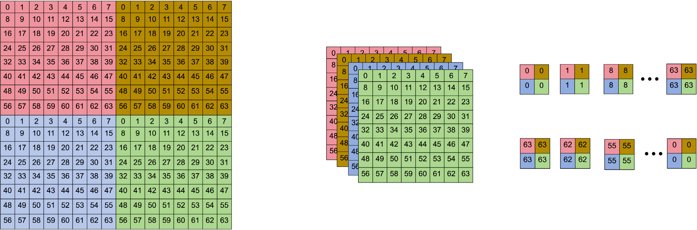

# 01 — Introduction

[← 返回 README](../README.md)

---

## 📌 Preview

病理 WSI 具有千兆像素分辨率，制造商的 JPEG 有损压缩只能缓解部分存储压力，而深度有损压缩会损害诊断保真度。因此，对已压缩 JPEG 进行二次无损重压缩成为数字病理管线的关键需求。现有方法（Lepton、JPEG XL、CMIX）依赖手工启发式，而 CNN 方法受限于局部感受野且缺乏大规模异构数据的泛化验证。本文提出 ULRFM，用 Transformer 上下文建模打破这些局限。

---

## 原文

Pathological whole-slide images (WSIs) are typically have gigapixel resolution, imposing substantial burdens on storage and data transmission infrastructure. To alleviate these demands, manufacturers commonly employ standard lossy JPEG compression under strict diagnostic quality constraints (Goode et al., 2013). Although this reduces storage to several extent, the rapid accumulation of pathology images continues to exert pressure on storage systems. As further lossy compression is unsuitable due to potential degradation of diagnostic fidelity, applying a secondary lossless recompression to already JPEG compressed images has become increasingly crucial in modern digital pathology pipelines.

JPEG compression (Wallace, 2002) quantizes luma and chroma components in the discrete cosine transform (DCT) domain and subsequently encodes the quantized coefficients using Huffman coding (Huffman, 2006). Two factors inherently limit the efficiency of this pipeline: (1) the quantization process introduces additional data redundancy, and (2) Huffman coding (Huffman, 2006) is less efficient than more advanced entropy coding schemes such as arithmetic coding (Witten et al., 1987) or asymmetric numeral systems (ANS) (Duda, 2013; Duda et al., 2015). Consequently, JPEG bitstreams retain considerable potential for further compression. Existing solutions attempt to exploit this potential through improved coding strategies or context-mixing mechanisms, such as Lepton (Horn et al., 2017), JPEG XL (Alakuijala et al., 2019, 2020), and CMIX. Among them, Lepton and JPEG XL are specifically developed for JPEG recompression, whereas CMIX is a general purpose compressor. Despite their effectiveness, these approaches rely heavily on hand crafted heuristics, fundamentally constraining their ultimate compression performance.

> 💡 **问题动机**：JPEG 管道有两个天然的低效来源——量化引入了冗余（丢失了原本可以更紧凑表达的信息），而 Huffman 编码的效率上限低于算术编码和 ANS。Lepton 和 JPEG XL 虽然解决了编码效率问题，但仍然依赖手工设计的概率模型（hand-crafted heuristics），这从根本上限制了压缩率的上限。

Recent advances in learned JPEG lossless recompression have been driven by convolutional neural networks (CNNs). Guo et al. (2022) introduced a CNN-based Laplacian entropy model combined with modern coding frameworks, achieving measurable reductions in bitrates. Fan et al. (2022) employed an end-to-end learnable lossy transform coding architecture to reduce redundancy within the DCT domain. Eff-Net (Guo et al., 2023) proposed a multi-level parallel conditional modeling network that constructs Gaussian entropy models for luma and chroma components, thereby improving compression ratios while maintaining low latency. More broadly, large-scale foundation models have achieved remarkable success across natural language processing, computer vision, and biomedical image analysis, demonstrating strong capabilities in representation learning, transferability, and cross-domain generalization. In computational pathology, such models have also shown promise in diagnostic and prognostic tasks by capturing morphology-aware representations from gigapixel whole-slide images. Although CNN-based models outperform traditional approaches on natural image benchmarks, they remain limited by two major factors: (1) CNNs predominantly model local spatial dependencies and are less capable than transformer architectures in capturing long-range interactions, which are critical for accurate entropy modeling; and (2) the lack of investigation on large-scale, heterogeneous datasets limits the assessment of generalization, thereby hindering their practical deployment in real-world scenario.

> 💡 **机制拆解**：这个段落清晰地指明了从 CNN 到 Transformer 的技术演进逻辑。CNN 熵模型的数学本质是用卷积核学习局部 DCT 系数之间的条件概率分布 P(x_i | context_local)。但 DCT 系数的统计依赖是全局的——低频 DC 分量与高频 AC 分量的关系跨越整个 8×8 块甚至跨块。这就是为什么 Transformer 的自注意力机制天然更适合这个任务。此外，CNN 方法（Guo 2022, Eff-Net）在自然图像小数据集上的性能数字（~30% saving）在大规模病理数据上会显著下降（本文实验也证实了这一点），说明数据规模和多样性的缺失会掩盖模型的真实泛化能力。

> 💡 **Q&A 批注记录**：
>
> **Q3: 为什么 Pathology WSI 的存储问题比自然图像更严重？**
> A: 两个原因：（1）单张 WSI 在 40x 放大下可以达到 100,000×100,000 像素量级，一张 WSI 的存储开销相当于数百张自然图像；（2）法规要求病理图像长期保留（通常 10 年以上），导致数据只增不减。因此即使是 30% 的压缩节约也是巨大的成本改善。

In response to these limitations, we introduce a Universe Pathology JPEG Lossless Recompression Foundation Model (ULRFM). The core innovation of ULRFM lies in its transformer-based context model, which explicitly models long-range dependencies among DCT quantized coefficients to enable substantially more accurate entropy estimation and, consequently, more effective compression. Built upon the previous framework (Guo et al., 2023), ULRFM reconstructs independent transformer-based context models for luma and chroma components. As show in Fig. 1, each component first passes through a dedicated hyper-network to generate side information, which is subsequently utilized as conditional input to the corresponding context model. This parallelized design reduces transformer sequence length and computational cost without compromising modeling power. Importantly, research on lossless recompression of pathological JPEG images remains scarce, and no existing work has explored this problem at scale. This gap limits the feasibility of learned compression techniques in clinical workflows. To the best of our knowledge, we present the first foundation model solution for large-scale pathology JPEG lossless recompression, systematically examine the impact of data quantity and model capacity on compression performance, and substantially surpass prior CNN-based approaches while demonstrating robust out-of-distribution generalization.

> 💡 **Figure 1 批读**：Fig. 1 展示了 ULRFM 的整体架构。关键设计选择：（1）Y 和 CbCr 各自独立的 pipeline——Hyper-Network 生成 side information (h) 作为条件输入，Context Model 做熵估计；（2）编码流程：DCT 系数通过 Hyper Encoder → 量化成 z̃ → 算术编码（AE）压缩成 bitstream → Arithmetic Decoder（AD）解压 → Hyper Decoder 生成 side info h → Transformer Context Model 利用 h 估计每个 DCT 系数的熵 → 用 ANS Encoder 进行无损压缩。这个设计与 Ballé et al. 2018 的 scale hyperprior 框架一脉相承，但用 Transformer 替代了其中的卷积层。

*Fig. 1. Overview of the Proposed Universe Pathology JPEG Lossless Recompression Foundation Model. For the luma (Y) and chroma (Cb and Cr) components, each component comprises a hyper-network and a Transformer-based context model. The hyper-network extracts side information to learn global correlation priors, while the Transformer context model establishes long-range dependencies among coefficients to capture fine-grained local details and further reduce redundancy. The primary workflow proceeds as follows: the hyper-network encodes the DCT coefficients and quantizes them into z̃, which is subsequently compressed into a bitstream using an Arithmetic Encoder (AE). Subsequently, an Arithmetic Decoder (AD) decompresses the bitstream and generates the side information h. The Transformer context model exploits the obtained side information to estimate the entropy of each DCT coefficient, and then performs lossless compression of the DCT coefficients using the estimated entropy in conjunction with an Asymmetric Numeral System Encoder (ANS-E).*

The main contributions of this work are summarized as follows:

(1) To the best of our knowledge, this is the first foundation model specifically designed for pathology image JPEG lossless recompression.

(2) We propose a transformer-based context modeling framework that captures long-range dependencies among DCT coefficients, enabling more accurate entropy estimation and improved compression efficiency.

(3) We provide the first systematic investigation into how data quantity and model capacity influence the performance of transformer-based JPEG recompression model.

(4) We conduct extensive experiments across multi-organ and multi-cancer in-distribution pathology datasets as well as multiple out-of-distribution benchmarks. Results demonstrate that our approach significantly surpasses CNN-based learned methods, setting a new state of the art while exhibiting strong out-of-distribution generalization.

> 💡 **贡献拆解**：四个贡献层层递进——（1）问题定位（首次做病理 JPEG 重压缩基础模型），（2）技术创新（Transformer 上下文建模），（3）规律发现（scaling law 的系统性研究），（4）实验验证（域内+域外泛化）。注意（3）是本文的一个重要卖点：很少有工作对压缩模型的 scaling behavior 做如此系统的消融研究。

---

## 🔖 Introduction 批读小结

ULRFM 的 Introduction 写得很扎实：从 WSI 存储困境 → JPEG 压缩机制的低效本质（量化冗余 + Huffman 编码局限）→ 传统方法的启发式局限 → CNN 方法的两个短板（局部感受野、缺乏大规模泛化验证）→ 提出基于 Transformer 的 Foundation Model 方案。逻辑链条清晰。一个值得关注的点是，本文刻意强调"foundation model"的定位——不仅是技术创新，更是试图在病理压缩任务上建立可扩展的训练范式（数据量 scaling、模型容量 scaling），这与当下 Foundation Model for Medical Imaging 的潮流吻合。
