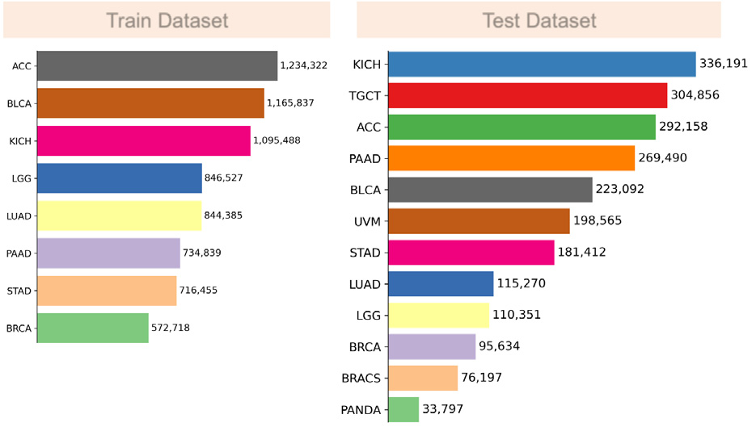

# 03 — Methodology

[← 返回 README](../README.md)

---

## 📌 Preview

ULRFM 的方法设计包含四个核心组件：（1）**预处理**——将 JPEG DCT 系数重排为频率-空间表征以利于网络学习；（2）**Hyper-Network**——生成侧信息（side information）作为全局相关先验；（3）**Transformer Context Model**——Y 分量采用 spatial-frequency 双向划分（s=4, f=9），CbCr 分量采用 Checkerboard 空间重排；（4）**大规模数据库**——976 张 WSI，11 个癌种/器官，约 1000 万张 256×256 瓦片。

---

## 原文

The overall structure of the proposed ULRFM is illustrated in Fig. 1. For the luma (Y) and chroma (Cb and Cr) components, each component consists of a Hyper-Network and a Transformer Context Model, although the Context Models differ slightly between luma and chroma. The Hyper-Network extracts side information to learn a global correlation prior, while the Transformer Context Model establishes long-range dependencies among coefficients in order to capture finer local details and further reduce redundancy. Specifically, the luma Transformer Context Model performs partitioning in both spatial and frequency directions, whereas the chroma Context Model employs a checkerboard spatial reassembly. It is important to note that the two chroma channels (Cb and Cr) are concatenated along the channel dimension and processed by the same network in parallel with the luma branch, which significantly lowers the computational overhead of the attention mechanism. Based on our foundation model, we have constructed a dataset of more than nine million image tiles, covering ten cancers from ten organs.

> 💡 **机制拆解**：Y 和 CbCr 分离建模是整个方法设计的核心思想。这样做有三个好处：（1）亮度包含更多高频纹理细节，需要更强的建模（spatial + frequency 双方向划分）；（2）色度在 4:2:0 下分辨率只有 1/4，且两个通道共享网络，大幅降低计算开销；（3）分离避免了跨分量的无意义注意力计算（亮度和色度的系数统计特性差异大）。这实际上是一种 inductive bias——告诉模型"亮度和色度的分布不同，不要混在一起学"。

---

## 3.1. Preprocessing

### 原文

JPEG encoders first partition an input image into non-overlapping 8 x 8 pixel blocks and transform each block via the DCT into an 8 x 8 coefficient matrix. In this matrix, each coefficient theoretically corresponds to a specific frequency: the top-left element is the DC component, and the remaining 63 elements are AC components. As illustrated in Fig. 2, for a 16 x 16 example image we collect the DCT outputs of its four blocks and reshape them into a single 4 x 8 x 8 tensor. Because DCT coefficient matrices contain substantial redundancy, we apply a zig-zag scan to each 8 x 8 block along the channel dimension, clustering zero-valued coefficients and emphasizing structurally informative elements to aid network learning. Following Guo et al. (2023), we then reshape this tensor so that coefficients of the same frequency are aggregated across spatial locations, while different frequencies are aligned along the channel dimension. An inverse re-ordering along the frequency axis finally arranges the coefficients from high to low frequency. This frequency representation facilitates more accurate estimation of entropy model from the side information.


*Fig. 2. Data Preprocessing. Taking a 16 x 16 image as an example, four 8 x 8 DCT blocks are processed according to frequency, zigzag scanning, and inverse ordering.*

> 💡 **机制拆解**：预处理管道的三个步骤：
> 1. **Zig-Zag 扫描**：将 8×8 DCT 矩阵按 Zig-Zag 顺序展开（从 DC 到最高频 AC），目的是将零值系数聚集在尾部（高频区域通常有很多零），方便网络学习稀疏性模式。
> 2. **频率聚合**：将同一频率位置的系数从不同空间块中聚到一起（cross-block frequency grouping），这样相同频率但不同空间位置的系数成为一个"通道"。
> 3. **逆序排列**：从高频到低频重新排列，使网络更关注低频分量（对压缩质量影响更大）。
>
> 这个预处理的核心目的是将原始的 DCT 系数矩阵转化为更适合 Transformer 学习的表示。原始 DCT 域的系数分布具有"块内频率相关 + 块间空间相关"的双重结构，预处理通过频率聚合和逆序排列将这些结构显式地暴露给网络。

> 💡 **Q&A 批注记录**：
>
> **Q6: 为什么要做 Zig-Zag 扫描和频率聚合？直接用原始 DCT 系数不行吗？**
> A: 可以直接用，但效果会差。原因：（1）DCT 系数在高频区域通常为零或接近零，Zig-Zag 扫描可以让这些零聚在一起，方便上下文模型学习稀疏性；（2）频率聚合让网络以"频率"而非"空间"作为通道维度，这更符合熵建模的需要——同一频率在不同位置的系数具有相似的边缘分布。逆序排列（高频到低频）是一种课程学习（curriculum learning）策略——高频分量更难建模但影响小，低频分量更容易建模但影响大。

---

## 3.2. Hyper-Network

### 原文

The design of the hyper-network follows Guo et al. (2022, 2023), which is divided into a Hyper Encoder and a Hyper Decoder. The Hyper Encoder adopts the architecture: Conv -> LeakyReLU -> Conv -> LeakyReLU -> Conv, where the first convolutional layer employs a stride of 1, while the remaining convolutional layers utilize a stride of 2. The Hyper Decoder comprises Conv -> LeakyReLU -> Deconv -> LeakyReLU -> Deconv, where Deconv denotes a transposed convolution layer. Specifically, the first and second deconvolutional layers employ a stride of 2, while the final deconvolutional layer adopts a stride of 1. As illustrated in Fig. 1, the overall computational pipeline proceeds as follows: the DCT coefficient array is encoded through the Hyper Encoder to obtain the latent feature z. Subsequently, z is quantized via torch.round to yield z̃. Finally, the Hyper Decoder produces the side information h. To maintain unimpeded gradient flow during back-propagation through the quantization operation, the quantize_STE function is utilized, which approximates the gradient via the derivative of the identity function (straight-through estimator) (Theis et al., 2017). It is noteworthy that the side information must also be encoded as a bitstream to provide conditional information for subsequent decompression. Specifically, a factorized entropy model (Ballé et al., 2018; Minnen et al., 2018) is employed to compress z̃ into a bitstream.

> 💡 **公式批读**：Hyper-Network 的数理角色与 Ballé et al. 2018 的 scale hyperprior 一致。设原始 DCT 系数为 y，side information h 通过以下过程产生：
>
> z = Encoder_hyper(y), &emsp; z̃ = round(z), &emsp; h = Decoder_hyper(z̃)
>
> 其中 round() 是不可导的量化操作，训练时用 STE（直通估计器）传递梯度：前向用 round()，反向直接把梯度拷贝过去（gradient = 1）。
>
> Side information h 包含全局相关先验（如亮度水平、对比度、纹理复杂度），其本身也需要编码成比特流。作者使用 factorized entropy model（Ballé et al. 2018）对 z̃ 做熵编码——这是一个全分解的熵模型（假设 z̃ 各分量独立），虽然建模能力弱于联合模型，但计算开销极小且足够有效。

> 💡 **Q&A 批注记录**：
>
> **Q7: Hyper-Network 和 Context Model 有什么区别？为什么需要两个网络？**
> A: 这是典型的 VAE 式分层压缩框架。Hyper-Network 负责捕获**全局**统计特性（整张图的亮度范围、纹理复杂度等），输出 coarse-grained 的 side information h。Context Model 则在 h 的指导下，精细建模**局部** DCT 系数的条件概率分布。两者类似"宏观先验 vs. 微观细节"的分工——hyper-prior 提供全局参数，context model 做逐系数的精细调整。这种分层结构在 learned compression 中是标配（Ballé et al. 2018）。

---

## 3.3. Transformer Context Model

### 3.3.1. Transformer Context Model for CbCr

#### 原文

We adopt the Checkerboard Rearrangement context modeling approach proposed by Guo et al. (2023), which mitigates the spatial redundancy in computations inherent to the original checkerboard context model. To ensure the long-range dependency modeling capability of the context model, the entire context model is implemented using pure Transformer architecture. As illustrated in Fig. 1, the CbCr coefficients are first partitioned into anchor and non-anchor regions according to their spatial positions. Subsequently, the anchor and non-anchor regions are spatially rearranged to eliminate vacant regions. Specifically, the anchor region is conditioned on h (the side information of CbCr) and fed into a Transformer model to learn the mean and scale parameters of a Gaussian entropy model, thereby enabling the compression of the anchor region. The non-anchor region, in turn, is conditioned on both h and the anchor region, and is processed by a separate Transformer model that learns a new Gaussian entropy model for compressing the non-anchor region.

> 💡 **机制拆解**：Checkerboard 上下文模型是自回归建模的一个精巧优化。原始的自回归方法需要严格按 pixel/coefficient 顺序逐个处理，效率极低。Checkerboard 的技巧是：将空间位置分成两种颜色（类似棋盘格），先建模"黑格"（anchor，只依赖 side info h），再建模"白格"（non-anchor，同时依赖 h 和已知的 anchor），这样只需要两步即可建模所有位置。CbCr 的上下文模型利用了这一技巧，而且用了纯 Transformer 替代 CNN，保证了长程依赖的建模质量。

### 3.3.2. Transformer Context Model for Y

#### 原文

We propose a transformer-based context model to learn more powerful Gaussian entropy models for each subregion in both spatial and frequency directions. As illustrated in Fig. 1, we partition the DCT coefficient matrix Y into s x f subregions by dividing it into s rows in the spatial direction and f columns in the frequency direction. For each subregion, we employ an independent transformer model to characterize the corresponding Gaussian entropy. Specifically, the first subregion y(1,1) utilizes the side information h decoded from z̃ via the Hyper Decoder as conditional input to a transformer model, which learns the mean and scale parameters of the Gaussian entropy for compression. Once y(1,1) is compressed, the subsequent subregion y(1,2) in the frequency direction takes both y(1,1) and the side information h as conditional inputs to its corresponding transformer model for entropy modeling. This process continues sequentially, where each subsequent y(1,f) conditions on both {y(1,j)}^{f-1}_{j=1} and h. Upon completion of entropy modeling for the first spatial subregion across all frequency directions, the remaining s-1 spatial subregions are modeled in a similar manner. Notably, y(i,j) depends not only on the side information h but also on the previously modeled coefficients y<(i,j), and this dependency pattern continues recursively for subsequent subregions. As illustrated in Algorithm 1, the decoding process reconstructs the DCT coefficient matrix Y from its compressed bitstream Ỹ and the hyper-prior bitstream z̃. In this experiment, we configure s = 4 and f = 9. The spatial partitioning yields 4 rows, while the frequency partitioning yields 9 columns with lengths [28, 8, 7, 6, 5, 4, 3, 2, 1] respectively. The cumulative length across all frequency columns is 64, which corresponds to 64 frequency coefficients in total.

> 💡 **公式批读**：Luma Context Model 的自回归结构可以形式化表达为：
>
> P(Y | h) = ∏<sub>i=1</sub><sup>s</sup> ∏<sub>j=1</sub><sup>f</sup> P(y<sub>(i,j)</sub> | h, {y<sub>(k,l)</sub>}<sub>(k,l) < (i,j)</sub>)
>
> 其中 s=4, f=9，每个 y(i,j) 服从高斯分布 N(μ<sub>(i,j)</sub>, σ<sub>(i,j)</sub>)，均值和尺度由对应的 Transformer 子模型 TM<sub>(i,j)</sub> 输出。关键设计细节：
> - **频率方向 f=9 列**，长度分别为 [28, 8, 7, 6, 5, 4, 3, 2, 1]，总和 = 64。注意第一列 28 个低频分量被优先处理，因为低频分量对视觉质量影响最大，且更容易被精确建模。
> - **空间方向 s=4 行**，每个空间子区域的第一行是串行建模的，但剩余的 s-1=3 行可以并行处理（因为它们共享相同的已建模条件集  C）。
> - **编码阶段串行，解码阶段行间并行**：这是 Algorithm 1 的核心设计智慧。编码时第一行各频率分量必须串行（前一个的输出是后一个的输入），但解码时 Step 3 中所有剩余行的同一频率分量可以并行解码（都已满足条件依赖）。

> 💡 **Algorithm 1 批读**：
> ```
> Algorithm 1 ULRFM: Decoding Process with Y
> Input: Side information bitstream z̃ and compressed bitstream Ỹ.
> Output: Reconstructed DCT coefficient matrix Y.
>
> Step 1: h = HyperDecoder(z̃)          → 从 hyper-prior 复原全局先验
>          C = h                          → 条件集初始化
>
> Step 2: for j = 1 to f:               → 串行处理第一空间行的各频率列
>            (μ(1,j), σ(1,j)) = TM(1,j)(C)
>            y(1,j) = ANSDecoder(N(μ,σ), Ỹ)
>            C = C ∪ y(1,j)             → 将新解码的系数加入条件集
>
> Step 3: for j = 1 to f:               → 并行处理剩余空间行的各频率列
>            {(μ(i,j), σ(i,j))}^s_{i=2} = {TM(i,j)(C)}^s_{i=2}
>            {y(i,j)}^s_{i=2} = {ANSDecoder(N(μ,σ), Ỹ)}^s_{i=2}
>            C = C ∪ {y(i,j)}^s_{i=2}
>
> Step 4: Y = {y(i,j)}^{s,f}_{i=1,j=1}
> ```
>
> 关键观察：Step 3 中 s-1 个空间行的同一频率列是**并行**执行的——所有空间行的 TM(i,j) 共享同一个更新后的条件集 C，因此可以同时解码。这大大提升了解码效率（否则 s×f = 36 个串行步骤 vs 实际 f + f = 18 个步骤）。

> 💡 **Q&A 批注记录**：
>
> **Q8: 为什么 Y 用 spatial-frequency 双方向划分，而 CbCr 只用 Checkerboard？**
> A: 因为两者数据特性不同。（1）Y 分量：64 个 DCT 系数跨频率的差异很大，低频分量高度相关且信息量大，高频分量稀疏，因此频率方向的分组（f=9 列）可以让模型对不同频率段分别学习专门的熵参数。空间方向分组（s=4）则让模型有条件地聚合相近空间位置的上下文。（2）CbCr 分量：本身已经下采样到 1/4，且两个通道拼接后序列长度已经缩短，而且色度的频率结构不如亮度复杂（色度本身变化平缓），Checkerboard 两步法足以应对。
>
> **Q9: 为什么第一列（f=1）有 28 个系数而不是 64/9≈7 个？**
> A: 作者做了非均匀划分——低频系数承载了绝大部分视觉信息，需要作为优先编码的"基础层"。28 个系数来自低频区域（DC + 部分中低频 AC），是压缩中最重要的 28 个维度。这种"低频多、高频少"的不均匀分配类似于 JPEG 的量化表设计思路——在信息更密集的地方分配更多建模资源。

---

## 3.4. Large-Scale Database

### 原文

An extensive dataset of image tiles forms the foundation of our model. In this study, leveraging the publicly available TCGA dataset, PANDA (Bulten et al., 2022), and BRACS datasets (Brancati et al., 2022), we have constructed, to our knowledge, the largest multi-organ and multi-cancer image tiles for JPEG lossless recompression. As summarized in Table 1, the dataset comprises 976 WSIs spanning eleven cancer types from eleven organs, yielding approximately ten million foreground image tiles. For each tile, PNG images are paired with quantized DCT coefficients extracted from their JPEG counterparts using the torchjpeg.codec.quality module under various quality factors and chroma-subsampling configurations. Notably, we focus primarily on the industry-standard YCbCr 4:2:0 sampling at 75% quality. Data from eight organ types in the TCGA dataset were randomly split into in-distribution training and test sets with an 80:20 ratio. Meanwhile, data from the remaining two TCGA organ types, as well as images from non-TCGA datasets (PANDA and BRACS), were reserved as out-of-distribution (OOD) test sets. Detailed partitioning information is provided in Fig. 3.



*Fig. 3. Comprehensive visualization of the distribution characteristics and sample quantities across the training and test datasets.*

> 💡 **数据流：输入 → 中间表示 → 输出**：
> ```
> 输入: PNG 256×256 WSI tiles
>   ↓ torchjpeg.codec.quality (Q=75, YCbCr 4:2:0)
> 中间表示: 量化后的 DCT 系数矩阵 (64 coeffs per 8×8 block)
>   ↓ Preprocessing: Zig-Zag → Frequency Aggregation → Inverse Ordering
> 网络输入: 频率-空间重排的特征张量
>   ↓ Hyper-Network → Side Info h
>   ↓ Transformer Context Model → Gaussian Entropy Params (μ, σ)
>   ↓ ANS Encoder
> 输出: 压缩比特流 (lossless over JPEG input)
> ```

> 💡 **Q&A 批注记录**：
>
> **Q10: 数据集划分为什么要把 TGCT 和 UVM 作为 OOD？这两个癌种有什么特殊之处？**
> A: 论文没有详细解释选择这两个癌种作为 TCGA-OOD 的原因，但从数据统计来看，TGCT（睾丸生殖细胞瘤）和 UVM（葡萄膜黑色素瘤）在表 1 中的 WSI 数量最少（各 30 张），且涉及的器官（睾丸、眼睛）在训练集的 8 个器官中未被覆盖。这是一种按器官/癌种做 leave-out 划分的策略，测试的是"模型在从未见过的器官/癌种上的泛化能力"。而 PANDA 和 BRACS 作为非 TCGA 数据集，涉及不同医院和扫描仪，测试的是跨域的泛化能力。

---

## 🔖 Methodology 批读小结

ULRFM 方法设计的核心智慧在于"分而治之"：
1. **Y vs. CbCr 分离**——尊重 JPEG 色彩空间的物理意义，降低计算复杂度
2. **Hyper-Network vs. Context Model 分层**——宏观先验 + 微观细节，沿用 VAE 压缩框架
3. **Spatial-Frequency 双向自回归**——Y 分量独有设计，在频率和空间两个维度上逐步解码，兼顾建模精度和并行效率
4. **大规模多癌种数据**——系统性验证 scaling law，使结果更具说服力

方法的一个潜在局限是 Y 分量的解码仍需要 s-1+f = 12 个"宏步骤"（Step 2 串行多次 + Step 3 循环 f 次），虽然比 naive 自回归的 36 个步骤快了很多，但在延迟敏感的场景下仍较慢（Table 5 显示 ~5s/tile）。
