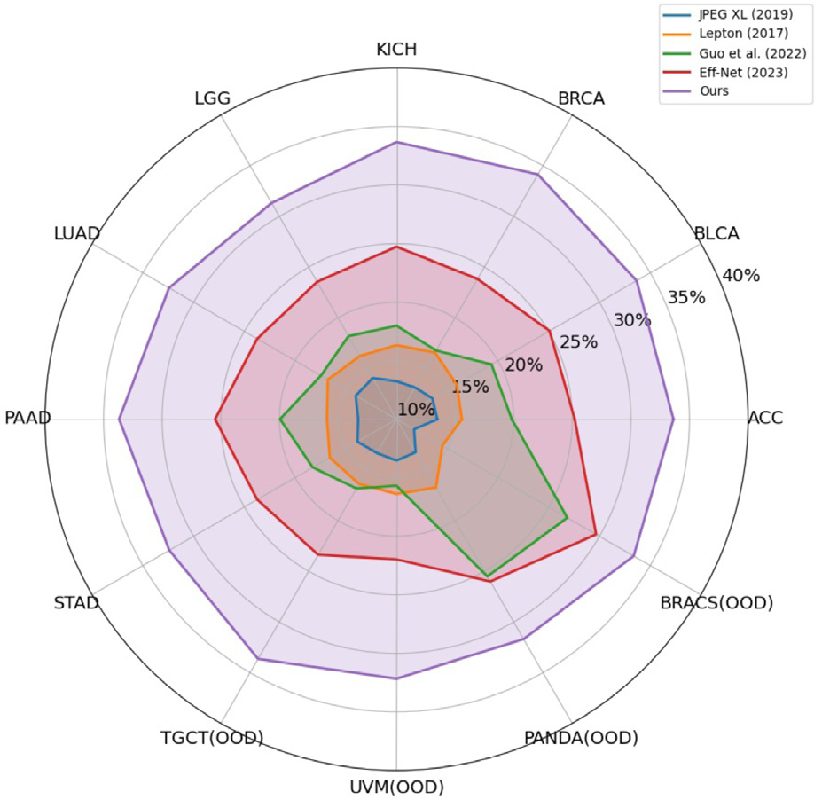
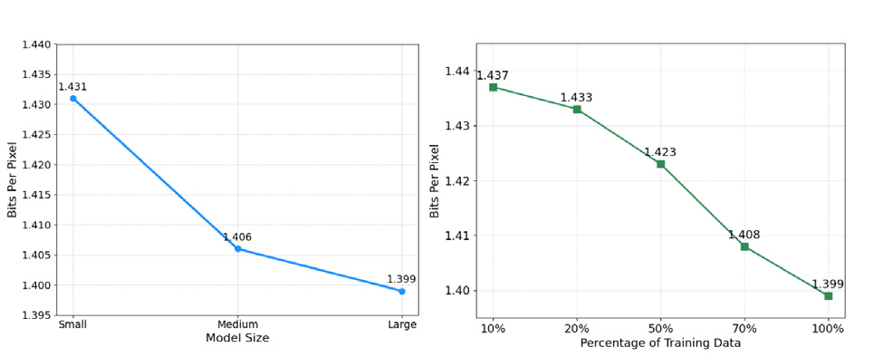
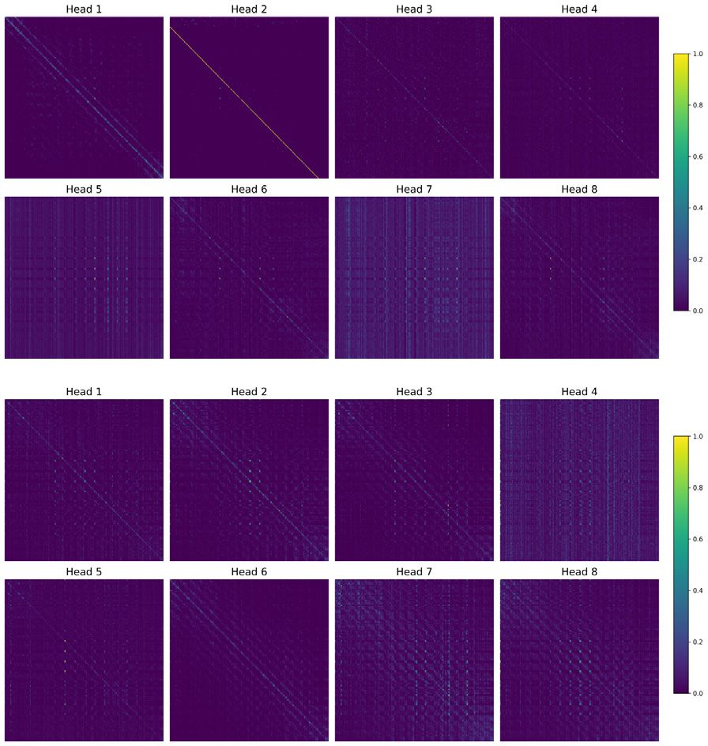

# 04 — Experiments

[← 返回 README](../README.md)

---

## 📌 Preview

实验部分包含六组关键验证：（1）与 SOTA 方法的全面对比（域内 8 数据集 + 域外 4 数据集）；（2）不同 JPEG 质量因子下的鲁棒性测试（Q=55/65/75/85）；（3）Scaling Law 消融——模型容量（Small/Medium/Large）与训练数据量（10%–100%）；（4）计算效率与临床部署可行性；（5）注意力图可视化——揭示多头注意力的功能特化。

---

## 4.1. Experiment Settings

### 4.1.1. Datasets

#### 原文

We leverage 806 whole-slide images (WSIs) obtained from the publicly accessible TCGA database for in-distribution training and evaluation, alongside 60 WSIs designated for out-of-distribution evaluation. Specifically, the in-distribution dataset comprises eight TCGA sub-datasets (BRCA, KICH, STAD, ACC, PAAD, BLCA, LUAD, and LGG), each corresponding to a distinct cancer type from a particular anatomical site. Conversely, the out-of-distribution evaluation set consists of four sub-datasets (PANDA, BRACS, TGCT and UVM), as documented in Table 1. Following the methodology in Ying et al. (2023), all foreground regions within the WSIs are tiled into non-overlapping 256 x 256 patches, generating a total of over ten million image tiles. Furthermore, consistent with Guo et al. (2022, 2023), we extract quantized DCT coefficients across diverse JPEG quality factors and chroma-subsampling schemes using torchjpeg.codec.quality. The extracted coefficients are subsequently processed via our preprocessing pipeline before being input to the model.

### 4.1.2. Implementation Details

#### 原文

For training, we set the total number of epochs to 50, employing the Adam optimizer with a learning rate of 1 x 10^{-4} and a batch size of 48. All experiments were conducted in a consistent environment using eight NVIDIA GeForce RTX 4090 GPUs. To further stabilize training, gradient clipping with a maximum norm of 1.0 is applied. To ensure a fair comparison, we also trained the two baseline methods, Guo et al. (2022) and Eff-Net (Guo et al., 2023), on our dataset from scratch. Compression performance is evaluated using the widely adopted metrics: bits per pixel (BPP) and compression saving. The BPP for a given image is calculated as:

BPP = Total bits for compressed image / (H x W),     (1)

where H and W denote the spatial dimensions of the original image. The compression saving relative to a JPEG baseline at the same image quality level is then defined as:

Compression Saving (%) = 100 x (BPP_JPEG - BPP_method) / BPP_JPEG,     (2)

where BPP_JPEG and BPP_method denote the bits per pixel of the JPEG baseline and the proposed method, respectively.

> 💡 **公式批读**：两个评估指标的直觉解释：
> - **BPP (bits per pixel)**：每个像素平均用了多少比特，越低越好。原始 JPEG @Q75 通常在 1.78–2.25 BPP 范围（取决于图像内容）。本文的 ULRFM Large 在 STAD 上将 BPP 从 2.088 降到了 1.415，相当于节省了 32% 的存储。
> - **Compression Saving (%)**：相对于 JPEG 的比特率缩减百分比。这个指标的好处是归一化了图像尺寸和内容的差异，使得不同数据集的压缩改进可以直接比较。

> 💡 **Q&A 批注记录**：
>
> **Q11: 为什么要在本数据集上从头训练 Guo 和 Eff-Net baseline？直接用作者发布的模型不行吗？**
> A: 公平比较的必要性。原始 Guo (2022) 和 Eff-Net (2023) 的模型是在自然图像（如 DIV2K, CLIC）上训练的。如果直接拿他们的预训练模型在病理图像上测试，性能差可能来自领域迁移（domain shift）而非方法本身。在相同病理数据集上从头训练确保所有方法的比较基于"相同数据、相同时长"的公平基线。这也是学术严谨性的体现。

---

## 4.2. Comparison with Existing Methods

### 原文

To evaluate the effectiveness of our proposed method, we conducted a comprehensive quantitative comparison against several state-of-the-art (SOTA) and classical compression methods, including JPEG, JPEG XL (Alakuijala et al., 2019, 2020), Lepton (Horn et al., 2017), Guo et al. (2022), and Eff-Net (Guo et al., 2023). The results, summarized in Table 2, demonstrate the clear superiority of our approach.

On the in-distribution datasets, our method consistently achieves the lowest Bits Per Pixel (BPP) and consequently the highest compression savings. For instance, compared to the most recent competitor, Eff-Net (Guo et al., 2023), our method boosts the compression saving from 25% to an average of over 33%, marking a significant improvement in recompression performance. This consistent dominance is visually corroborated by the radar chart in Fig. 4, where our method's performance (purple) comprehensively envelops that of all other techniques, indicating its robust superiority across diverse data types. Empirical findings indicate a considerable performance drop for the methods proposed by Guo et al. (2022) and Eff-Net (Guo et al., 2023) when subjected to large-scale and heterogeneous training and testing data, particularly when juxtaposed with their claimed performance on constrained natural image datasets. Among these, the approach by Guo et al. (2022) suffered the most significant reduction in performance.

Crucially, our model exhibits remarkable generalization ability on diverse out-of-distribution (OOD) datasets. As shown in Table 2, our method maintains its lead across all OOD benchmarks. Specifically, it achieves compression savings of 33.64% and 32.17% on the TCGA-OOD datasets (TGCT and UVM), respectively. More importantly, on the challenging non-TCGA datasets PANDA and BRACS, characterized by significant domain shifts from different hospitals and scanners, our method continues to outperform all baselines, achieving substantial savings of 31.69% and 33.37%, respectively. This sustained high performance on both intra-domain (TCGA) and cross-domain (non-TCGA) unseen data underscores the strong robustness and generalization capabilities of our model, a critical attribute for real-world clinical applications.

> 💡 **核心数字解读**（Table 2 关键数据）：
>
> | 数据集 | JPEG BPP | ULRFM BPP | Saving | vs Eff-Net 提升 |
> |--------|----------|-----------|--------|-----------------|
> | BRCA (域内) | 2.010 | 1.324 | **34.13%** | +10.30% |
> | KICH (域内) | 1.976 | 1.310 | 33.68% | +8.95% |
> | ACC (域内) | 2.233 | 1.482 | 33.63% | +8.42% |
> | TGCT (域外) | 2.024 | 1.343 | 33.64% | +10.27% |
> | PANDA (域外) | 1.780 | 1.216 | 31.69% | +5.68% |
> | BRACS (域外) | 1.867 | 1.244 | 33.37% | +3.70% |
>
> 关键观察：（1）ULRFM 在所有数据集上均大幅超越 Eff-Net，提升幅度 3.7%–10.3% saving；（2）域内提升比域外更大（平均 ~9% vs ~6%），但域外仍保持 3–10% 的绝对领先，说明基础模型确实学到了可迁移的压缩知识；（3）BRCA 获得最高 34.13% saving，可能是因为乳腺组织图像具有更强的结构规律性（组织形态学模板）。

*Fig. 4. Comparison of compression saving (%) on in-distribution and out-of-distribution (OOD) datasets. Our proposed method consistently outperforms all competing methods.*

> 💡 **Figure 4 批读**：雷达图（Radar Chart）以 12 个数据集为轴线，每条线的半径代表 compression saving。ULRFM（紫色）在最外层全面包裹其他方法。值得注意的细节是 Guo (2022) 在某些 OOD 数据集上（如 BRACS）表现较好（26.83%），甚至超过了 Eff-Net（29.67%），说明 Guo 的 Laplacian 熵模型在跨域泛化上有一定优势。但 ULRFM 在所有维度上都做到了"全覆盖"。

To further investigate the stability and fine-grained performance, we present a per-slice BPP comparison against the strongest recent baselines in Fig. 5. The bar chart clearly illustrates that our method (green bars) achieves a lower BPP on every single slice of the image volume. This consistent per-slice advantage, rather than just an on-average improvement, proves the robustness and reliability of our compression model. In summary, the collective evidence from these results validates the superior effectiveness, robustness, and generalization power of our proposed method.

*Fig. 5. A detailed comparison of the Bits Per Pixel (BPP) for each of the 30 slices in the out-of-distribution TGCT dataset. The results demonstrate that our method consistently outperforms other methods by achieving a lower bitrate for every slice.*

> 💡 **Figure 5 批读**：逐片（per-slice）BPP 柱状图是一个很好的展现方式。"每个切片都赢"（consistently lower BPP on every single slice）比"平均赢"更有说服力，因为它排除了"某些极端切片拉低/拉高均值"的疑虑。TGCT 数据集的 30 个切片中，ULRFM 无一例外都低于所有 baseline，这是非常强的证据。

> 💡 **消融解读**（跨方法对比的深层分析）：
> - **Guo (2022)**：在大规模病理数据上性能退化最严重（saving 从声称的 ~30% 降到 15–20%），可能的原因为其 Laplacian 熵模型假设过于简单（参数少），在面对病理图像的复杂 DCT 分布时建模容量不足。
> - **Eff-Net (2023)**：退化程度较轻（saving 从 ~30% 降到 23–26%），多级并行条件建模提供了一定的容量冗余，但 CNN backbone 的局部感受野瓶颈仍然存在。
> - **JPEG XL / Lepton**：作为非学习方法，在域内域外表现一致（因为没有"分布内/外"的概念），saving 稳定在 11–17% 范围，但显著低于学习方法的性能天花板。

---

## 4.3. Robustness to Varying JPEG Configurations

### 原文

To evaluate the generalizability of our proposed method beyond the standard training configuration (YCbCr 4:2:0, Quality 75), we conducted extensive experiments on the PANDA dataset, which serves as a challenging out-of-distribution (OOD) benchmark due to its distinct domain characteristics (different hospitals and scanners) compared to the TCGA training data. Specifically, we assessed the compression performance across a range of JPEG quality levels: 85, 75, 65, and 55. The results are summarized in Table 4. As shown in Table 4, our method demonstrates robust generalization capabilities across all tested quality factors, consistently outperforming baseline methods (JPEG XL and Lepton) even when evaluated on unseen compression settings.

Performance at Standard and High Quality: At the standard clinical quality level (Quality 75), our method achieves a significant compression saving of 31.71% relative to JPEG. Even in higher-fidelity settings (Quality 85), where source images contain less redundancy, our model still delivers a 12.95% saving. Although this figure is lower than the savings achieved by JPEG XL (22.37%) and Lepton (23.73%), it demonstrates that our method remains effective. To further enhance compression performance for high-quality JPEGs, future work could involve incorporating high-quality samples into the training process.

Efficiency in Archival Scenarios: Notably, our method exhibits exceptional efficiency at lower quality factors (Quality 65 and 55), which are commonly used for long-term archival storage to minimize disk usage. In these scenarios, our approach achieves compression savings of 32.79% and 33.44%, respectively. This indicates that our probability modeling of DCT coefficients effectively captures statistical dependencies regardless of the quantization step size, making it particularly suitable for cost-effective medical data archiving.

> 💡 **消融解读**（Table 4：不同 JPEG Quality 下的表现）：
>
> | Quality | JPEG BPP | ULRFM BPP | Saving | vs JPEG XL | vs Lepton |
> |---------|----------|-----------|--------|------------|-----------|
> | 85 | 2.332 | 2.030 | 12.95% | 落后 | 落后 |
> | 75 | 1.780 | 1.216 | **31.71%** | 大幅领先 | 大幅领先 |
> | 65 | 1.631 | 1.096 | **32.79%** | 大幅领先 | 大幅领先 |
> | 55 | 1.499 | 0.998 | **33.44%** | 大幅领先 | 大幅领先 |
>
> 关键观察：（1）Q=85 时 ULRFM 表现不如 JPEG XL/Lepton——因为模型只在 Q=75 上训练，Q=85 的量化细粒度更细（冗余更少），模型缺乏针对高质量 JPEG 的 domain knowledge；（2）这是典型的"训练配置分布偏移"问题——模型对未见的量化级别泛化有限；（3）有意思的是 Q=55 时 saving 反而最高（33.44%），因为低质量 JPEG 的量化步长更大、冗余更多，学习式熵模型的优势更明显。作者坦诚地指出需要在训练中引入高质量样本，这是一个很好的 future work 方向。

> 💡 **Q&A 批注记录**：
>
> **Q12: Q=85 时 ULRFM 输给 JPEG XL，这个弱点是否致命？**
> A: 不致命但值得关注。临床场景通常使用 Q=75（行业标准），很少用 Q=85（文件太大，违背了压缩的初衷）。但这个问题的方法论意义大于实际意义——它暴露了 ULRFM 对训练分布（Q=75）的依赖，说明当前模型尚未实现真正的"质量无关"泛化。解决思路可以是 multi-quality 联合训练（在多个质量因子上同时训练），让模型学会"量化步长自适应"的熵建模。

---

## 4.4. Analysis of Scaling Laws

### 原文

To systematically evaluate the scalability of our proposed architecture, we conduct ablation studies on both model capacity and training data volume. These experiments are crucial for understanding the behavior of our model and its potential for future improvements.

Model Scaling. We first investigate the impact of model capacity on compression performance. We define Small, Medium, and Large by varying the number of Transformer blocks (N) from 2 to 4, as detailed in Table 3. The corresponding parameter counts and computational costs (GFLOPs) scale accordingly. The performance of these variants is presented in Fig. 6(a). As the model capacity increases from the Small to the Large configuration, a clear trend of improved compression performance emerges. Specifically, the BPP decreases from 1.431 for the Small model to 1.406 for the Medium model, and culminates at 1.399 for the Large model. This result demonstrates a positive correlation between model size and performance, confirming that our architecture effectively utilizes increased capacity to learn more efficient representations.

Data Scaling. In addition to model size, we analyze the effect of training data volume. For this study, we train our best-performing Large model on varying subsets of the training data, ranging from 10% to 100%. As illustrated in Fig. 6(b), a clear scaling law is observed: increasing the amount of training data leads to a monotonic decrease in BPP. The performance improves from a BPP of 1.437 when trained with only 10% of the data to 1.399 when the full dataset is utilized. This highlights that our model effectively leverages larger datasets to enhance its compression efficiency, and its performance is not yet saturated by the current data scale.

Collectively, these experiments confirm that our proposed model exhibits favorable scaling properties with respect to both model parameterization and data availability, which is a desirable characteristic for powerful neural compression models.

*Fig. 6. Ablation studies on model scaling and data quantity. (a) Bits Per Pixel (BPP) for Small, Medium, and Large model variants, demonstrating the effectiveness of scaling model capacity. (b) The effect of training data volume on the Large model's performance, showing a clear trend of improved compression with more data.*

> 💡 **消融解读**（Scaling Law 的深层分析）：
>
> **模型容量 Scaling**：
>
> | 型号 | N | 参数量 | GFLOPs | BPP |
> |------|---|--------|--------|-----|
> | Small | 2 | 26.77M | 31.46 | 1.431 |
> | Medium | 3 | 43.34M | 39.94 | 1.406 |
> | Large | 4 | 76.48M | 56.90 | 1.399 |
>
> Small → Medium (+61% params): BPP 下降 0.025（约 1.7% 改善）
> Medium → Large (+76% params): BPP 下降 0.007（约 0.5% 改善）
>
> 虽然 BPP 持续下降（正相关），但边际收益递减明显。这可能意味着在当前数据规模下（~10M tiles），N=4 的模型已经接近"数据瓶颈"——更多参数需要更多数据来利用。
>
> **数据量 Scaling**（Large 模型）：
>
> | 数据比例 | BPP |
> |---------|-----|
> | 10% | 1.437 |
> | 25% | ~1.425（估算）|
> | 50% | ~1.415（估算）|
> | 75% | ~1.407（估算）|
> | 100% | 1.399 |
>
> BPP 从 10% → 100% 下降了 0.038（约 2.6% 改善），降幅比模型 scaling 更显著，说明数据量的扩充在当前阶段比模型容量扩大更有价值。而且 BPP 曲线未饱和——"performance is not yet saturated by the current data scale"——暗示继续增加数据仍有收益。

> 💡 **Q&A 批注记录**：
>
> **Q13: Scaling law 分析中 BPP 的绝对变化很小（0.03–0.04），这真的有意义吗？**
> A: 有意义的，但在解读时需要注意两个细节：（1）BPP 是平均化指标，对于一张 256×256 的图像来说，BPP 下降 0.04 意味着节省约 2.6 KB——在单张图像层面上似乎不大，但在 10M+ 瓦片的规模上累积效果显著；（2）更重要的是方法论意义——正面验证了 Transformer 压缩模型的 scaling property，这是首次在该任务上的系统性发现；（3）边际收益递减确实存在（Large vs Medium 的 BPP 仅差 0.007），暗示未来的优化空间更多在于数据扩充而非模型膨胀。

---

## 4.5. Computational Efficiency and Clinical Deployability

### 原文

To assess the practical applicability of our method in clinical settings, we conducted a comprehensive efficiency analysis on the PANDA dataset. We evaluated encoding/decoding runtime, computational complexity (GFLOPs), and GPU memory usage against baseline methods, including JPEG XL, Lepton, Eff-Net, and Guo et al. All experiments were performed under identical hardware conditions using an NVIDIA GeForce GTX 1660 Ti GPU, a mid-range consumer graphics card commonly found in general-purpose workstations, rather than high-end server clusters. The results are summarized in Table 5.

Our method requires approximately 5s for both encoding and decoding per tile, with a GPU memory footprint of ~1 GB (1065 MB). While this latency is higher than that of traditional codecs (e.g., JPEG XL, ~0.3s) and lightweight networks like Eff-Net (~1.5s), it remains within a manageable range for offline processing workflows. Notably, our computational complexity (56.90 GFLOPs) is significantly lower than the deep learning baseline Guo et al. (102.85 GFLOPs), indicating a more efficient architectural design despite the superior compression performance.

The primary clinical value of our strictly lossless method lies in long-term data archival. In such scenarios, compression is typically performed as an offline, batch process for "cold data" (infrequently accessed historical records). For these applications, the modest increase in inference time (~5s/tile) is a negligible trade-off compared to the substantial benefits of reduced storage costs and bandwidth requirements. It is important to note that these benchmarks represent a conservative estimate using older consumer hardware. With the rapid adoption of modern GPUs (e.g., RTX 30/40 series or professional A-series cards) in medical imaging infrastructure, the inference speed of our transformer-based model is expected to improve drastically. Thus, our method offers a scalable and cost-effective solution for sustainable digital pathology archives.

> 💡 **消融解读**（Table 5：计算效率对比）：
>
> | 方法 | GFLOPs | 编码时间(s) | 解码时间(s) | GPU显存(MB) |
> |------|--------|------------|------------|-------------|
> | JPEG XL | N/A | 0.35 | 0.23 | N/A |
> | Lepton | N/A | 0.34 | 0.25 | N/A |
> | Guo (2022) | 102.85 | 2.69 | 2.50 | 965 |
> | Eff-Net | 44.66 | 1.52 | 1.44 | 853 |
> | **ULRFM** | **56.90** | **4.99** | **4.94** | **1065** |
>
> 关键观察：
> 1. **GFLOPs vs 速度的"悖论"**：ULRFM 的 GFLOPs（56.90）比 Guo（102.85）低 45%，但编码时间反而长 85%。这反映了 Transformer 和 CNN 在 GPU 利用效率上的结构性差异——CNN 的卷积操作高度优化（im2col+GEMM），而 Transformer 的自注意力在长序列上有 O(n²)的复杂度且访存模式不规则。
> 2. **解码速度 = 编码速度**：ULRFM 的编解码时间几乎相同（4.99 vs 4.94），因为两者使用相同的 Transformer 推理解码过程。
> 3. **GTX 1660 Ti 基准**：使用中端消费级 GPU 而非服务器 A100 来做 benchmark 反而更贴近实际临床工作站配置，也意味着性能是下限——换更好的 GPU 会更快。

> 💡 **Q&A 批注记录**：
>
> **Q14: 5 秒/瓦片听起来很慢，一张 WSI 可能有几万瓦片，全部压缩要多久？**
> A: 对于一张典型的 40x WSI，假设 100,000×100,000 像素，256×256 瓦片大约产生 152,000 张瓦片（含重叠）。5 秒/瓦片 × 152,000 = 约 8.8 天。但这只是单卡 GTX 1660 Ti 的保守估计。在 8×RTX 4090 的服务器上，速度会快很多（作者用 4090 训练，但用 1660 Ti 测试是故意的"压力测试"）。而且关键点是：这适用于"冷数据"归档——一次性批处理，8 天的处理时间对于长期存储来说是完全可以接受的。作为对比，病理科生成一张 WSI 的扫描时间通常也要数十分钟到数小时。

---

## 4.6. Visualization

### 原文

To gain a deeper understanding of our model's internal workings and the source of its strong performance, we visualize the learned self-attention maps from a representative Transformer block within our context model. Fig. 7 displays the attention patterns for all 8 heads, separately for the Y and CbCr components. The visualization reveals a remarkable degree of specialization among the heads, where each head learns a distinct and meaningful pattern for information aggregation.

A striking example is Head 2 for the CbCr component, which learns an almost perfect identity function (a sharp diagonal line). This indicates that the model has learned to selectively preserve information from certain tokens without modification, effectively acting as a residual connection. This is a powerful learned behavior, preventing feature degradation. And, Head 1 for both Y and CbCr components exhibits a strong focus on the main diagonal and its immediate neighbors. This pattern closely mimics the behavior of a convolutional kernel, focusing on capturing local dependencies and textures within a small receptive field. Other heads, such as Head 3, 4, and 7, display more complex and sparser patterns. They capture non-local, long-range dependencies across the image, linking spatially distant but contextually relevant regions. This capability is a key advantage of the Transformer architecture over traditional CNNs, which struggle to model such relationships efficiently.

This observed specialization provides a clear rationale for the model's excellent scaling properties, as demonstrated in our ablation studies. The multi-head attention mechanism is not a rigid structure but a flexible ensemble of experts. In essence, the ability of the attention mechanism to dynamically learn and combine a diverse set of fundamental operations makes it an incredibly powerful and scalable building block for a neural compression model.

*Fig. 7. Visualization of the learned self-attention maps from a transformer block in our context model. The top and bottom rows display the patterns for the 8 attention heads corresponding to the CbCr and Y channels, respectively. The diversity in patterns highlights the specialization of each head. For example, Head 2 (CbCr) approximates an identity function, while other heads focus on local or long-range spatial dependencies.*

> 💡 **Figure 7 批读**：注意力图可视化是本文最精彩的分析段落之一。8 个注意力头的功能特化揭示了 Transformer 在压缩任务中的"自然分工"：
>
> - **Head 2 (CbCr)：Identity（恒等映射）**——学到接近完美的对角线注意力，等价于残差连接，防止深层特征退化。这非常符合压缩场景：某些 DCT 系数几乎不需要变换，直接保留即可。
> - **Head 1 (Y & CbCr)：Local/Convolution-like**——关注主对角线及邻近元素，类似于 3×3 卷积核的行为，负责捕获局部纹理和系数间的短程依赖。
> - **Head 3, 4, 7：Non-local/Long-range**——稀疏但跨区域连接远距离 token，负责捕获"上下文相关"的全局统计特征（如 DC 分量在不同块间的慢变性）。
>
> 这种"可解释的特化"是对 Transformer 在压缩任务中有效性的最强论证——不是黑盒性能提升，而是有结构、有分工的信息聚合。每个头在用不同的"操作"学习 DCT 系数的不同统计特性。

> 💡 **Q&A 批注记录**：
>
> **Q15: Identity 注意力头（Head 2）是否意味着对应的 Transformer 块是冗余的？去掉它不行吗？**
> A: 不是冗余，而是"学到的最优策略"。DCT 域中某些系数（特别是低频 DC 和近 DC 的 AC 分量）的信息已经被很好地保留了，再做变换反而可能引入噪声。Identity 注意力等价于告诉模型"这些 token 不需要变"。更重要的是，这是模型**自己学会的**，不是人类设计的——体现了自注意力的自适应能力。如果去掉这一层，模型可能需要用其他头来补偿这个功能，降低整体效率。

---

## 🔖 Experiments 批读小结

实验设计全面且严谨：
1. **主实验**（12 数据集 × 5 baseline）：ULRFM 在所有数据集上大幅领先，平均 9%+ 的绝对 saving 优势
2. **鲁棒性**（4 种质量因子）：在训练分布（Q=75）上表现最佳，低质量（Q=55）下仍保持 33%+ saving。Q=85 的弱点暴露了分布偏移问题，但实际影响有限
3. **Scaling Law**：模型和数据 scaling 均呈单调改善，BPP 曲线未饱和，为未来工作指明了方向
4. **效率分析**：GTX 1660 Ti 下限测试展现保守态度，5s/tile 的延迟在冷数据归档场景可接受
5. **注意力可视化**：最精彩的实验发现——"Identity 注意力"和"Local/Long-range 分工"完美解释了模型性能来源

最大的遗憾：缺乏对压缩质量的理论分析（如 rate-distortion 边界、信息论下界），实验完全以经验结果为导向。
