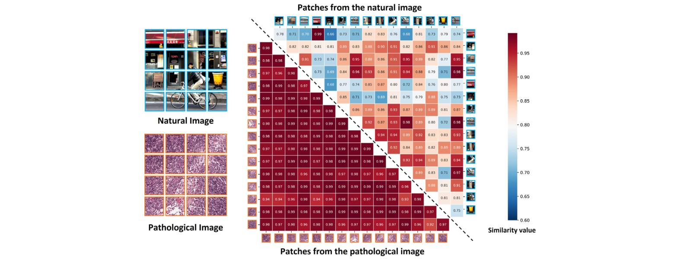

[← 返回 README](../README.md)

# 1. Introduction

## 📌 预览

Introduction 先从 WSI 数字化带来的临床工作流变化讲起，再指出 gigapixel WSI 和弱监督 MIL 让计算效率成为瓶颈。作者随后用 Figure 1 说明病理 patch 相似度高于自然图像 patch，相似性就是可压缩冗余的证据。最后给出 WSIR2 的两个模块：token compression 和 lightweight classifier。

## WSI 效率问题

Whole Slide Images (WSIs) scanned by digital slide scanners have profoundly changed the diagnostic paradigm of clinical pathology. The laborious operation of targeting biological patterns under the classical microscope has been replaced by the ability to access the patients' pathological status via electronic devices, which has greatly streamlined pathologists' workflow.

> 💡 **场景定位**: WSI 数字化让病理诊断从显微镜人工定位转为电子设备浏览和算法辅助，但这也把“寻找病灶”的负担变成了“处理巨量像素/patch”的计算问题。

Concomitantly, the digitalization of pathology has introduced the challenge of efficiently and effectively processing the colossal volumes of ever-increasing WSIs, whose gigapixel-level resolution further aggravates the computational burden.

> 💡 **瓶颈批注**: 这里的 efficiently and effectively 是双目标：快但不能漏诊。Medical-Compression 主题下的核心判断也类似：压缩要能保留诊断证据。

Due to the gigapixels of WSI and scarce pixel-level annotations, previous works have assumed that WSI contains abundant information and have developed various effective methods within the framework of weakly-supervised learning (WSL) for pathological diagnosis, where only slide-level labels are available, while patch-level labels are not.

> 💡 **弱监督难点**: 只有 slide-level labels 意味着模型不知道哪个 patch 真正致病。token pruning 如果太早太硬，可能删掉稀疏但关键的肿瘤区域。

Furthermore, based on multiple instance learning (MIL), which treats a WSI as a bag and patches from it as instances, numerous methods have constructed promising deep models to capture the relationship between bags and their labels, achieving impressive accuracy on general tasks. However, most of these works overlook the practical demand for efficiency in clinical tasks.

> 💡 **MIL 数据流**: WSI -> patches/instances -> bag -> slide label。传统 MIL 聚焦 bag-to-label 关系，WSIR2 改动的是 bag 内 token 的数量和维度。

## 病理图像的冗余证据

On the other hand, compared to natural images, pathological images contain monotonous, similar biological patterns such as cells, tissues, and sub-organ structures.

*Figure 1: Cosine-similarity of patches from natural image and pathological image.*

> 💡 **Figure 1 批读**: 上半部分自然图像 patch 语义差异大，下半部分病理 patch 颜色/纹理更相似；右侧相似度矩阵显示 pathological patches 的 pairwise cosine similarity 更高。这张图不是证明所有 token 都可删，而是证明 WSI 里存在大面积重复模式，适合做 merging 或 budget reduction。

As Fig. 1 illustrates, patches from pathological images exhibit higher similarity with each other than patches from natural images, which indicates that reducing redundant patches can improve diagnostic efficiency while retaining critical information within a single image.

> 💡 **机制前提**: 如果 patch features 本身高度相似，合并后仍可能保留 slide-level representation；这也是 WSIR2 不只 pruning、还 merging 的合理性来源。

Additionally, during the diagnostic process, pathologists focus on disease-related patterns or features against a regular background, e.g. a partial tumor region in the tissue landscape. This also suggests that only a few significant patches adequately represent the entire status of patients.

> 💡 **临床类比**: 病理医生不会均匀检查每个背景区域，而会寻找局部异常模式。WSIR2 把这种注意力行为近似成 top-k informative patches。

## WSIR2 概览

Motivated by the observations above, we propose a WSI redundancy reduction method, i.e. WSIR2, for efficient WSI analysis and diagnosis. WSIR2 is characterized by two modules: token compression and a lightweight classifier.

> 💡 **模块边界**: token compression 负责减少输入 token bag 的大小；lightweight classifier 负责用更低复杂度聚合 compressed tokens。两者同时出现，才解释 Table 2 中参数量、FLOPs、吞吐和显存的综合收益。

In the token compression module, we simultaneously prune and merge tokens within a single block. Based on the efficient cross-attention mechanism with O(n) computational complexity and its interpretation of attention values as indicators of token significance, WSIR2 achieves redundancy reduction of WSIs.

> 💡 **Q&A 批注记录**:
> - Q: attention value 为什么能做 token significance?
> - A: learnable query q* cross-attends to all patch tokens，score 高表示该 token 对 query 聚合贡献大。它是模型内部的弱监督重要性估计，但仍需 Figure 4 和下游性能验证其临床含义。

It simultaneously reduces features along both the feature dimension and the token dimension by selecting top-k tokens and fusing the non-significant tokens. Then, a lightweight classifier is proposed to further reduce computational costs of features aggregation for WSI classification, which is constructed with several cross-attention blocks.

> 💡 **压缩维度批注**: token dimension 是 n，feature dimension 是 d。WSIR2 先把 X in R^{n x d} 投影到 K in R^{n x d'}，再减少 token 数。这比只做 token pruning 更彻底，因为每个保留 token 也更小。

To evaluate the efficiency and effectiveness of WSIR2, we conducted extensive experiments on multiple datasets, including Camelyon16, TCGA-NSCLC, and UniToPatho. The experimental results demonstrate that WSIR2 significantly reduces FLOPs and model size to 1.02 or 0.29 GFLOPs and 225K parameters on these datasets, while maintaining competitive performance compared to other MIL methods.

> 💡 **关键数字批读**: 1.02/0.29 GFLOPs 对应不同平均 patch 数场景，225K 是模型参数量。后续 Table 2 需要核对这些效率数字与 r=0.50 的关系。

Furthermore, incorporating the token compression module into other MIL methods also significantly accelerates their inference, demonstrating its broad applicability.

> 💡 **可插拔性批注**: plug-and-play 是 WSIR2 的外推价值。如果 compression module 只能配合自家 classifier，贡献会更窄；Table 3 把它插入 ABMIL/DSMIL/TransMIL 后仍加速，说明它可作为 WSI MIL 前置压缩层。

## 贡献列表

The paper concludes its contributions as follows:

1. WSIR2 is an efficient MIL method for pathological diagnosis and analysis, composed of a token compression module and a lightweight classifier.
2. Token compression uses cross-attention to select top-k patches and merge non-top-k patches, accelerating inference efficiency.
3. Extensive experiments validate the effectiveness and efficiency of WSIR2 for high-throughput diagnosis.

> 💡 **贡献读法**: 三点贡献对应“模型结构、压缩机制、实验证据”。读完整篇后要检查：是否有只 selection/只 merging 的消融、不同 r 的稳定性、以及接入其他 MIL 的公平对照。

## 🔖 Section 总结

### 关键数字速查

| 指标 | 数值 |
|---|---|
| 数据集 | Camelyon16, TCGA-NSCLC, UniToPatho |
| 压缩后参数 | 225K |
| 代表 GFLOPs | 1.02 / 0.29 |
| 主要模块 | token compression; lightweight classifier |

### 核心洞察

1. Figure 1 把“病理图像有重复形态”从直觉变成可视化证据。
2. 作者同时强调 prune 和 merge，避免把低分 patch 全部当噪声。
3. Introduction 已经把后文实验的关键检查项列出来：效率、性能、可插拔性。
