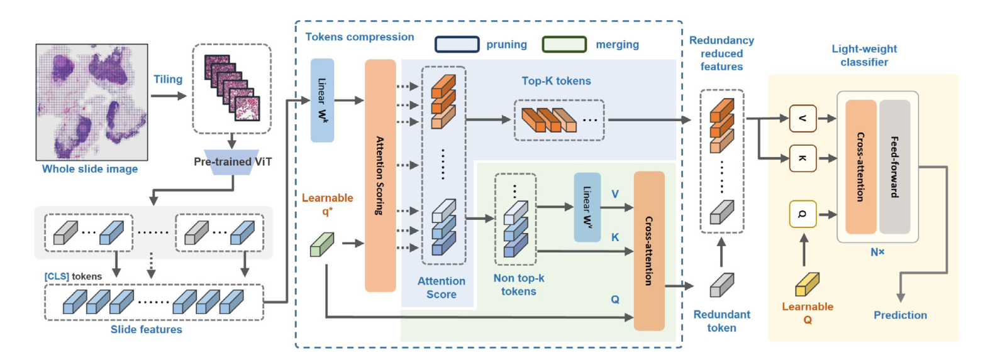

[← 返回 README](../README.md)

# 3. Methodology

## 📌 预览

Methodology 分两步：先复述 embedding-based MIL 的 bag-label 公式，再提出 WSIR2 的 WSI redundancy reduction。核心变量是原始 slide feature X in R^{n x d}、压缩 feature K in R^{n x d'}、learnable query q*、attention scores A、top-k informative tokens K_t、non-top-k tokens K_r、merged redundant token x_r，以及 lightweight classifier 的 global representation X_g。

## 3.1 MIL formulation

Taking binary classification as an example, the paper defines a WSI bag with n instances {x_i,1, x_i,2, ..., x_i,n}; instance-level labels are unknown, and the slide-level label is positive if any instance is positive.

```text
Y_i = 0, if all instance labels y_i,j = 0
Y_i = 1, if any instance label y_i,j = 1
```

> 💡 **MIL 公式批读**: 这个定义表达了经典 MIL 假设：一个阳性 slide 可能只需要少数阳性 patches。它也解释了为什么 token compression 有风险：如果那个少数阳性 patch 被剪掉，bag-level prediction 会直接受损。

The embedding-based MIL framework adopts a transformation function f to obtain instance representations and a MIL classifier S to predict the bag label:

```text
Y_hat_i = S(f(x_i,1), f(x_i,2), ..., f(x_i,n))
```

> 💡 **接口批注**: WSIR2 接在 f(.) 之后、S(.) 之前。它不重新定义 patch encoder，而是把已经提取好的 patch features 压缩后交给轻量 S。



*Figure 2: Framework of WSIR2.*

> 💡 **Figure 2 批读**:
> - 左侧是 WSI tiling 与 pre-trained ViT feature extraction，得到 slide features。
> - 中间虚线框是 token compression：learnable q* 产生 attention score，保留 top-k tokens，non-top-k tokens 经过 V projection 和 cross-attention 合并。
> - 右侧是 lightweight classifier：用 learnable Q 作为 query 做 cross-attention，得到 global representation 后预测。
> - 图中同时标注 pruning 和 merging，说明 WSIR2 的压缩不是简单抽样，而是保留诊断高分 token 并压缩低分背景。

## 3.2 WSI redundancy reduction

The frequent recurrence of similar biological patterns in WSIs suggests that disease-related semantics are globally sparse and largely redundant. Selecting informative patches for diagnosis offers an efficient paradigm, allowing MIL aggregation to focus on fewer yet more critical tokens.

> 💡 **问题动机**: globally sparse 说的是诊断区域在整张 WSI 中占比小；largely redundant 说的是大量背景/正常组织重复。top-k selection 对应前者，merging 对应后者。

Unlike token pruning and merging in ViTs for natural images, token compression in WSIs cannot be performed progressively across multiple self-attention blocks, because the enormous number of tokens renders direct vanilla ViT impractical.

> 💡 **为什么不用普通 ViT 压缩**: 自然图像 ViT 可以先跑几层 self-attention 再逐层删 token；WSI token 太多，先完整 self-attention 已经太贵。因此 WSIR2 需要在 MIL feature bag 上直接做轻量 compression。

The extracted patch-level features are concatenated into a slide-level feature X in R^{n x d}, where n is the number of patches and d is the feature dimension. WSIR2 compresses features in two dimensions: token pruning/merging reduces n, and dimensionality reduction reduces d.

> 💡 **数据流批注**: 这里有两个压缩轴。只减少 n 会降低 attention aggregation 成本；同时减少 d' 还会降低投影、分类器和内存成本。Table 4 后面专门消融 d'。

Concretely, patch-level features are first transformed to K in R^{n x d'}, which represents compressed features retaining critical information for each patch.

```text
K = W_k X = {k_i | i = 0, 1, ..., n}
```

> 💡 **公式批读**: W_k 是 learnable projection，把原始 d 维特征变成 d' 维。主实验中 d'=96，而 ViT-small hidden dim 是 384，等于先做 4x feature dimension reduction。

A learnable parameter q* in R^{d'} is introduced to select informative patches and merge non-significant patches through cross-attention. q* assigns attention weights a_i to each token in K and compresses redundant tokens into a single representative token.

```text
A = softmax(q* K^T / sqrt(d')) = {a_i | i = 1, 2, ..., n}
```

> 💡 **attention significance 批读**: q* 像一个“诊断查询向量”，询问哪些 patch features 对 slide-level prediction 更有用。a_i 是排序信号，但它是训练出来的 proxy，不等价于病理医生标注的 lesion mask。

Then, the top-k tokens with the highest attention values are selected from K according to a predefined ratio r:

```text
k = max(1, ceil(n * r))
K_t = {k_i | i in TopK(a_i, k)}
K_r = {k_i | i not in TopK(a_i, k)}
```

> 💡 **top-k ratio 批读**: r 是全局固定预算。r=0.50 保留一半 token；r=0.01 只保留 1%。Table 1 显示 r 太小会在 Camelyon16 上损失性能，因此 r 是效率/准确率的主要旋钮。

For less informative tokens, WSIR2 compresses them into a single redundant token x_r in R^{d'}, aiming to preserve some background information of the WSI:

```text
V_r = W_v K_r
A_r = {a_i | i not in TopK(a_i, k)}
x_r = A_r V_r
```

> 💡 **merging 批读**: non-top-k tokens 没有被全部删除，而是加权聚成一个 redundant token。这个设计承认低分区域仍可能提供正常背景、组织类型或染色上下文，尤其在小病灶/低肿瘤比例 slide 中很重要。

To minimize computational cost, the authors reuse q* attention scores for K_r and apply a linear mapping directly to K_r rather than raw features.

> 💡 **工程取舍**: 复用 A_r 避免再算一套 importance；在压缩维度 d' 上做 W_v 避免在原始 d 上做重投影。这是低成本近似，后续训练会把这个近似调到任务可用。

The pruned tokens K_t and merged token x_r are concatenated and fed into a lightweight classifier. A class token Q is initialized as query, attends to the compressed features, and produces global representation X_g:

```text
X_k = concat(K_t, x_r)
X_g = softmax(Q (W_k' X_k)^T / sqrt(d')) (W_v' X_k)
Y_hat = S(X_g)
```

> 💡 **classifier 批读**: classifier 仍是 cross-attention，而不是 full self-attention。它用少量 query 聚合 compressed token set，所以复杂度保持 O(n) 量级，并且 n 已经被 top-k 压小。

## Q&A 批注记录

- Q: 为什么 x_r 只有一个 token，会不会太粗?
  A: 这是效率优先的设计。一个 redundant token 能保留全局背景均值式信息，但对多种 tissue subtype 或局部空间上下文可能不足，这是后续可改成 multi-prototype merging 的地方。

- Q: WSIR2 的 compression 是训练时还是推理时生效?
  A: 公式中 top-k selection 和 merging 是模型前向路径的一部分，训练和推理都生效；不同 r 控制每次输入 classifier 的 token budget。

- Q: d' 和 r 哪个更关键?
  A: 二者控制不同成本。d' 控制每个 token 的宽度，r 控制 token 数。Table 4 显示 d'=96 时效率最好且对 pruning 更稳；r 越小 FLOPs 越低但性能可能下降。

## 🔖 Section 总结

### 关键数字速查

| 变量 | 含义 |
|---|---|
| X in R^{n x d} | 原始 slide-level patch feature matrix |
| K in R^{n x d'} | 压缩维度后的 patch features |
| q* | 用于 scoring/compression 的 learnable query |
| A | token attention/significance scores |
| r | top-k ratio |
| K_t | informative top-k tokens |
| K_r | non-top-k tokens |
| x_r | merged redundant token |
| Q | classifier 中的 class/query token |
| X_g | slide-level global representation |

### 核心洞察

1. WSIR2 的方法本质是 “dimension projection + top-k selection + residual background merging + cross-attention aggregation”。
2. 低分 token 仍被合成 x_r，说明作者避免了纯 pruning 的信息损失。
3. 所有核心模块都围绕降低 O(n) 聚合中的 n 和 d'，与论文效率 claim 一致。
