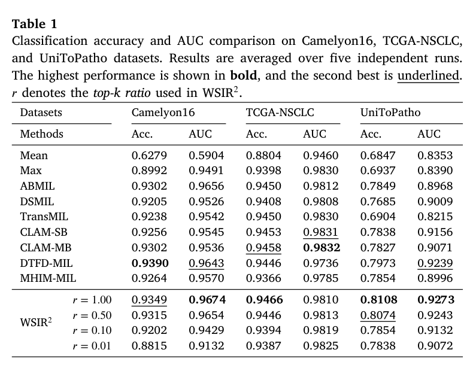
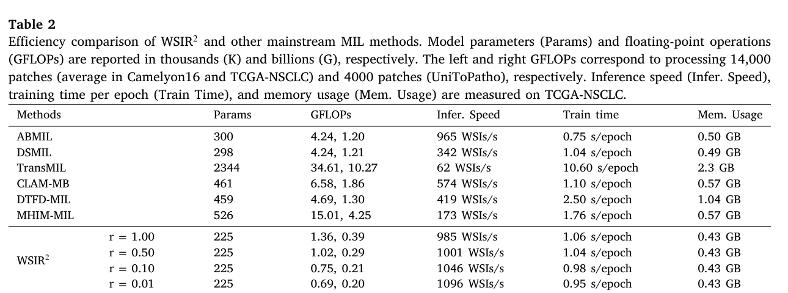
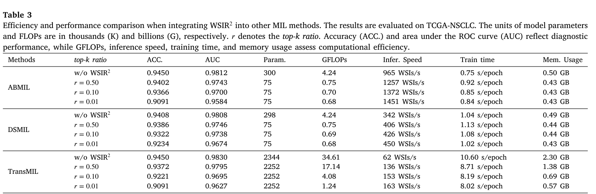
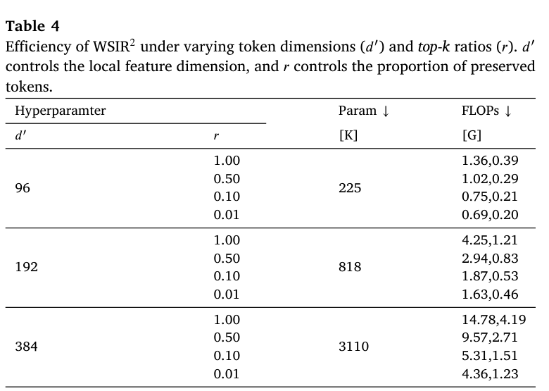
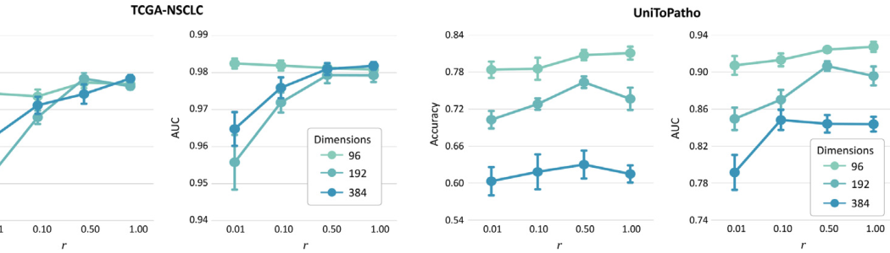
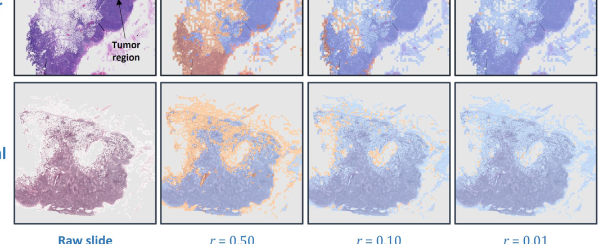

[← 返回 README](../README.md)

# 4. Experiments

## 📌 预览

Experiments 是 WSIR2 的证据核心：三组数据集验证分类性能，Table 2 看模型大小/FLOPs/吞吐/训练时间/显存，Table 3 看把 WSIR2 接入 ABMIL/DSMIL/TransMIL 后的 plug-and-play 加速，Table 4 和 Figure 3 分析 d' 与 r 的效率-性能折中，Figure 4 检查被保留/合并 patch 是否符合病理直觉。

## 4.1 Datasets

WSIR2 is evaluated on Camelyon16, TCGA-NSCLC, and UniToPatho. Camelyon16 contains Normal/Tumor breast cancer metastasis slides, officially providing 270 training samples and 129 testing samples, tiled into roughly 57.18 million patches at 20x magnification.

> 💡 **数据集批读**: Camelyon16 的二分类和 metastasis 场景适合检查小病灶是否会被压缩掉。Table 1 中 r=0.01 在 Camelyon16 上下降明显，和小病灶风险吻合。

TCGA-NSCLC contains LUAD and LUSC lung cancer subtypes. The authors obtained 1042 slides and tiled them into 145.63 million patches at 20x magnification, then used an 8:2 train/test split.

> 💡 **规模批注**: TCGA-NSCLC patch 数最大，最能体现 token compression 的计算价值。它的 performance 对 r 变化较稳，可能说明 subtype signal 分布更广或更容易被 top-k 捕捉。

UniToPatho is a colorectal polyp dataset; the authors used 243 WSIs, tiled into 9.87 million patches at 20x, with four disease subtypes and the official train/test split.

> 💡 **任务差异批注**: UniToPatho 平均 token 数更少，作者后面指出大 d' 容易过拟合/引入噪声；这说明 token compression 不只是为了大数据，也可能有去噪效果。

## 4.2 Implementation details

The authors tile WSIs into non-overlapping 224 x 224 patches at 20x magnification and discard background patches. They conduct self-supervised pre-training with DINO using ViT-small/16, then extract features for WSI classification.

> 💡 **实现批读**: WSIR2 的效率数字主要发生在 feature-level MIL 阶段。patch extraction 和 ViT feature extraction 是前处理，真实部署时不能把这些成本忽略。

For classification, they use cross-entropy loss, AdamW with learning rate 2e-4, cosine annealing without warm restarts, and evaluate top-k ratio r in [0.01, 0.1, 0.5, 1.0]. Efficiency metrics include parameter count and FLOPs for 14,000 and 4,000 patches.

> 💡 **公平性批注**: 报 14,000/4,000 patch 的 FLOPs 有助于跨数据集比较，但也意味着每个真实 slide 的实际成本会随 patch 数变化。系统部署应按 slide-specific token count 估算。

## 4.3 Main results

*Table 1: Classification accuracy and AUC comparison on Camelyon16, TCGA-NSCLC, and UniToPatho.*

> 💡 **Table 1 批读**:
> - r=1.00 时 WSIR2 在 Camelyon16 Acc/AUC 为 0.9349/0.9674，TCGA-NSCLC 为 0.9466/0.9810，UniToPatho 为 0.8108/0.9273。
> - r=0.50 基本保持性能：Camelyon16 0.9315/0.9654，TCGA-NSCLC 0.9446/0.9813，UniToPatho 0.8074/0.9243。
> - r=0.01 在 Camelyon16 降到 0.8815/0.9132，但 TCGA-NSCLC AUC 仍有 0.9825，说明不同任务对 extreme pruning 的敏感度不同。

The authors state that WSIR2 with lightweight classifier and d'=96 achieves competitive classification performance while using substantially fewer parameters.

> 💡 **性能解读**: 这张表不证明 WSIR2 永远最高，但证明它在明显更轻的情况下没有系统性崩盘。Medical compression 里这就是可接受压缩的核心标准。

*Table 2: Efficiency comparison of WSIR2 and mainstream MIL methods.*

> 💡 **Table 2 批读**:
> - ABMIL/DSMIL 的 GFLOPs 约 4.24G，TransMIL 是 34.61G，MHIM-MIL 是 15.01G；WSIR2 r=0.50 只有 1.02G。
> - WSIR2 参数量 225K，低于 ABMIL 300K、DSMIL 298K、CLAM-MB 461K、MHIM-MIL 526K，更远低于 TransMIL 2344K。
> - throughput 从 ABMIL 965 WSIs/s 到 WSIR2 r=0.50 的 1001 WSIs/s，极端 r=0.01 到 1096 WSIs/s；显存保持 0.43 GB。

> 💡 **效率证据链**: Table 2 是全文最关键的效率表。它说明 WSIR2 的收益不是单一 FLOPs 数字，而是参数、FLOPs、吞吐、训练时间和显存一起下降或保持较优。

*Table 3: Efficiency and performance when integrating WSIR2 into other MIL methods.*

> 💡 **Table 3 批读**:
> - ABMIL + WSIR2 r=0.50: Acc 从 0.9450 到 0.9402，GFLOPs 从 4.24G 到 0.75G，throughput 从 965 到 1257 WSIs/s。
> - DSMIL + WSIR2 r=0.50: Acc 从 0.9408 到 0.9386，GFLOPs 从 4.24G 到 0.75G。
> - TransMIL + WSIR2 r=0.50: Acc 从 0.9450 到 0.9372，GFLOPs 从 34.61G 到 17.14G，throughput 从 62 到 136 WSIs/s。

> 💡 **plug-and-play 批注**: 这张表支持 compression module 是可迁移组件。不过也要注意：接入后有轻微准确率损失，特别是 r 越小越明显；真实部署应选择 r=0.50 或按风险自适应。

## 4.4 Ablation

*Table 4: Efficiency under varying token dimensions and top-k ratios.*

> 💡 **Table 4 批读**:
> - d'=96, r=0.50: 225K params, 1.02/0.29 GFLOPs。
> - d'=192, r=0.50: 818K params, 2.94/0.83 GFLOPs。
> - d'=384, r=0.50: 3110K params, 9.57/2.71 GFLOPs。
> - 维度 d' 比 r 同样重要：即使 r 相同，d' 从 96 到 384 会让参数和 FLOPs 大幅上升。

*Figure 3: Effect of token dimension and top-k ratio on WSIR2 performance.*

> 💡 **Figure 3 批读**: TCGA-NSCLC 上 d'=192/384 在较高 r 下表现不错，但 UniToPatho 上 d'=384 明显不稳；作者解释为 UniToPatho token 更少、组织结构信息更稀疏，大模型更容易引入噪声和过拟合。这个结果提醒我们：压缩不只是省算力，也可能是正则化。

The authors observe that fewer feature dimensions (d'=96) show stable robustness as tokens are pruned, especially on UniToPatho.

> 💡 **消融解读**: d'=96 的优势不是“越小越好”的绝对结论，而是在这些 feature encoder 和数据集上，96 维足够表达诊断信号，同时抑制冗余/噪声。

## 4.5 Visualization

*Figure 4: Visualization of pruned and merged patches in WSIs using WSIR2.*

> 💡 **Figure 4 批读**:
> - Tumor slide 中 top-k patches 更集中在 tumor/fat 等诊断区域，merged patches 覆盖大面积相似背景。
> - Normal slide 中 orange top-k 与 blue merged patch 的分布更分散，符合“没有单一肿瘤热点”的场景。
> - r 从 0.50 到 0.01 越小，top-k 区域越稀疏，说明极端压缩更依赖 attention score 的可靠性。

The paper states that patches with highly similar biological morphology, such as parenchymal cells and background information, are merged, while WSIR2 focuses more on indispensable diagnostic regions such as fat cells and tumor cells.

> 💡 **可解释性批注**: Figure 4 是 qualitative evidence，说明模型行为和病理直觉一致。但它只展示两个 Camelyon16 examples，不能替代大规模 lesion-level recall 或专家评分。

## Q&A 批注记录

- Q: WSIR2 最实用的 r 是多少?
  A: 从 Table 1/2 看，r=0.50 是较好的默认折中：GFLOPs 从 1.36 到 1.02，同时 accuracy/AUC 基本保持；r=0.01 虽更快，但 Camelyon16 性能下降明显。

- Q: 为什么 Table 2 中 r=0.01 throughput 只比 r=0.50 稍高?
  A: 可能因为固定开销、GPU batch 调度、feature loading 和 classifier 非 token 相关开销占比上升；token 数继续减少后，端到端吞吐不会线性增长。

- Q: Plug-in TransMIL 为什么 GFLOPs 下降很大但训练时间仍较长?
  A: TransMIL 自身结构较重，WSIR2 压缩了输入 token，但 backbone 聚合器内部计算和实现开销仍存在，所以只看 GFLOPs 不等于全部 runtime。

## 🔖 Section 总结

### 关键数字速查

| 结果 | 数值 |
|---|---|
| WSIR2 r=0.50 GFLOPs | 1.02G / 0.29G |
| WSIR2 r=0.50 throughput | 1001 WSIs/s |
| WSIR2 r=0.50 memory | 0.43 GB |
| WSIR2 params | 225K |
| ABMIL plug-in r=0.50 | 4.24G -> 0.75G |
| TransMIL plug-in r=0.50 | 34.61G -> 17.14G |

### 核心洞察

1. WSIR2 的最好证据不是单表最高 accuracy，而是效率和性能同时可接受。
2. r=0.50 是更稳的工作点，r=0.01 是极限压缩点。
3. d'=96 在这些数据上表现为轻量、稳健且抗过拟合。
4. Figure 4 支持 attention top-k 与病理关键区域有一定对齐，但仍需更强定量验证。
