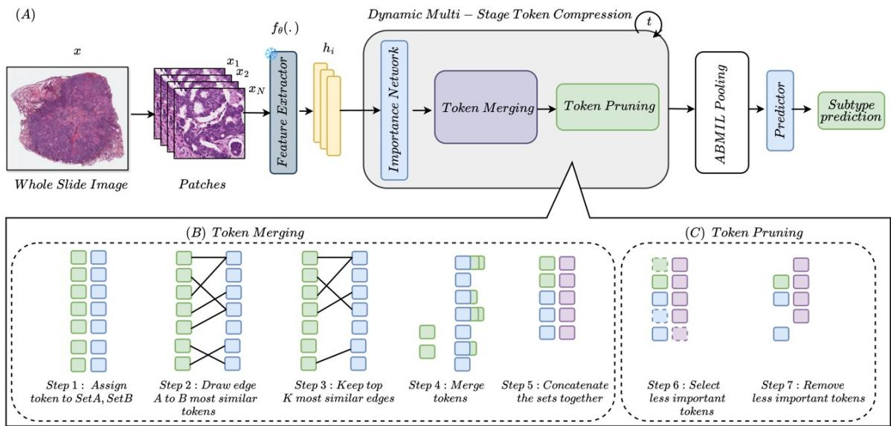

[← 返回 README](../README.md)

# 01 - Introduction

## 预览

引言的逻辑是：WSI 的 patch 数量使 MIL/Transformer 聚合变贵；病理图像中大量 token 冗余；纯 pruning 在弱监督下风险高；自然图像 ToMe 提供 merging 思路，但 WSI 需要 saliency-aware、multi-stage 的改造。

# 1. Introduction

Whole-slide images (WSIs) are gigapixel-scale pathology scans that exhibit rich and highly heterogeneous morphological patterns over extremely large spatial extents (El Nahhas et al., 2025; Srinidhi et al., 2021; Cui and Zhang, 2021). Since WSIs cannot be processed at native resolution, modern computational pathology pipelines partition each slide into thousands of fixed-size patches and employ multiple instance learning (MIL) to aggregate patch-level representations into slide-level predictions (Obeid et al., 2025; Gurcan et al., 2009; Bruny´e et al., 2010). Recent attention-based and transformer-based MIL models—including AB-MIL (Ilse et al., 2018), CLAM (Lu et al., 2021), TransMIL (Shao et al., 2021), DSMIL (Li et al., 2021), as well as hierarchical architectures such as HIPT (Chen et al., 2022)—have demonstrated strong performance across tasks such as cancer subtyping, grading, and prognosis. However, these approaches face a fundamental scalability challenge: a single diagnostic WSI can yield tens of thousands of patch tokens, leading to substantial computational and memory overhead in MIL scoring modules and transformer attention layers (Rahman et al., 2025a; Yang et al., 2022; Kapse et al., 2024).

> 💡 **问题定义**: 本文的压缩对象是 patch embedding token，而不是 WSI 像素或 SVS/JPEG2000 文件。MIL/Transformer 的瓶颈随 token 数增长，尤其是 attention 类模块的成本，会把 tens of thousands patches 变成显存和延迟瓶颈。

This challenge is exacerbated by the structural properties of histopathology images. Large regions contain visually redundant or weakly discriminative tissue—including stroma, adipose, necrosis, and repeated tumor textures (Tang et al., 2024). Treating all patches as independent tokens forces models to process extensive redundancy, increasing computation without adding discriminative signal (Rahman et al., 2025b). Prior attempts to mitigate this include hierarchical MIL (Yue et al., 2025), patch clustering (Sharma et al., 2021), and token pruning (Tang et al., 2023a; Rao et al., 2021). Yet pruning irreversibly discards tokens and risks removing diagnostically relevant regions, a severe limitation under weak supervision where slide-level labels provide no guidance for early-stage pruning decisions (Jiang et al., 2023; Shi et al., 2021; Lyu et al., 2025).

> 💡 **为什么 pruning 不够**: WSI 中 redundancy 很多，但 diagnostically relevant token 可能很少且分散。slide-level label 不告诉模型哪个 patch 是关键证据，早期硬 pruning 一旦删错，MIL 后端无法恢复；这就是本文把“先 merge 冗余，再 prune 低 saliency”作为核心组合的动机。

Meanwhile, the natural-image community has demonstrated that token merging can accelerate Vision Transformers by fusing redundant tokens rather than removing them. Methods such as ToMe (Bolya and Hoffman, 2023) exploit similarity structure to merge tokens without losing information. However, these methods have not been adapted to computational pathology, where redundancy patterns are more complex, token counts are orders of magnitude larger, and merging must be guided by task-driven saliency to avoid collapsing diagnostically meaningful structures (Zhen et al., 2025; Hu et al., 2024; Wu et al., 2025).

> 💡 **ToMe 到 WSI 的差异**: 自然图像 token merging 主要利用视觉相似性；病理 WSI 里“相似”不一定等于“可合并”，因为两个相似 tumor patches 可能分别承载 subtype/grade 的细微信号。因此 DTC-WSI 在 merge utility 里加入 importance consistency，避免 saliency 差异大的 token 被粗暴融合。

To address these limitations, we propose Dynamic Token Compression for Whole-Slide Images (DTC-WSI), a unified framework that combines similarity-guided token merging with importance-guided pruning in a progressive multi-stage pipeline. DTC-WSI fuses redundant patches via efficient bipartite matching while learning patch saliency through a differentiable importance network trained with slide-level supervision. Unlike single-step or merge-only approaches, our curriculum-style multi-stage compression gradually reduces tokens, preventing early information collapse and stabilizing saliency estimation. This hybrid design enables efficient gigapixel WSI processing while preserving diagnostically critical regions. Our contributions are summarized as follows:

> 💡 **方法总览**: “Dynamic”体现在两个层面：一是每个 slide/token 的 saliency 动态决定保留与剪枝；二是 compression 是多阶段 curriculum，而不是固定一次性采样。这对弱监督尤其重要，因为 saliency network 需要时间从 diffuse weights 过渡到有选择性的 tumor-rich weights。

1. A unified multi-stage token compression framework that jointly performs similarity-guided token merging and importance-guided pruning, enabling aggressive token reduction while preserving diagnostic morphology.
2. A differentiable importance network that learns patch saliency under weak supervision, guiding compression during training and enabling deterministic, high-efficiency inference.
3. Comprehensive evaluation on four major WSI benchmarks (TCGA-NSCLC, TCGA-BRCA, TCGA-RCC, PANDA), demonstrating that DTC-WSI achieves $^ { 5 - }$ $\mathbf { 1 0 \times }$ token reduction, up to 5.3 $\times$ faster inference, 20–40% lower memory

Figure 1: Overview of the proposed Dynamic Token Compression (DTC-WSI) framework. (A) End-to-end pipeline: patch extraction, feature encoding, multi-stage token compression, and MIL prediction. (B) Token merging: similar patches are fused into unified representations via bipartite soft matching. (C) Token pruning: low-importance tokens are removed to produce a compact, discriminative set for classification.

> 💡 **Figure 1 批读**: 图中 pipeline 的重点是 compression 插在 encoder 和 MIL aggregator 之间，因此它理论上可替换不同 feature encoders 和 MIL backbones。B/C 两个子图对应后文的两条证据线：merge 要证明冗余区域能被融合，prune 要证明低重要度区域被删除而 tumor-rich token 留下。

usage, and 2–4% accuracy gains over state-of-the-art MIL and token-efficient baselines.

## Section 总结

| 引言问题 | DTC-WSI 对应设计 |
|---|---|
| WSI token 太多 | 在 MIL 前压缩 patch token |
| 组织形态冗余 | similarity-guided merging |
| 纯 pruning 易误删 | 训练期 soft pruning + 多阶段渐进 |
| ToMe 未适配病理 | importance consistency + WSI benchmarks |
| 弱监督 saliency 不稳定 | differentiable importance network + sparse regularization |
