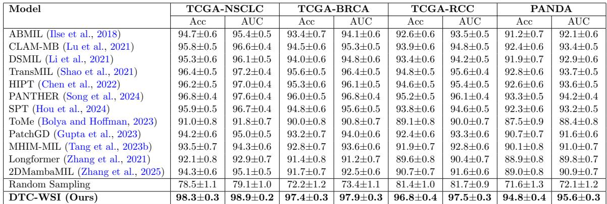
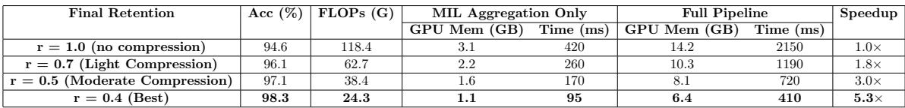
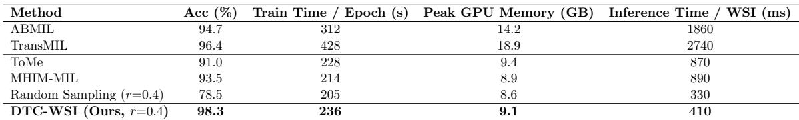
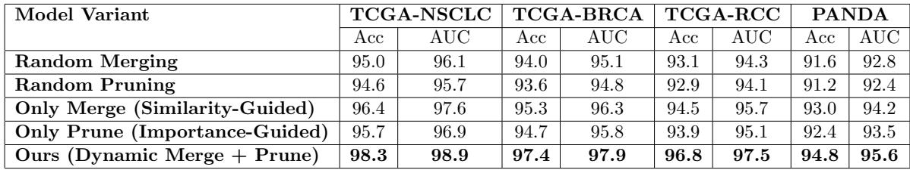
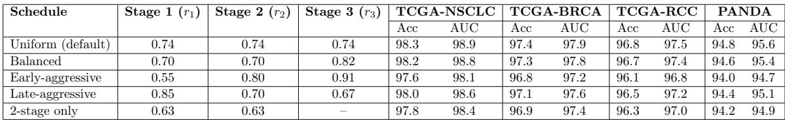
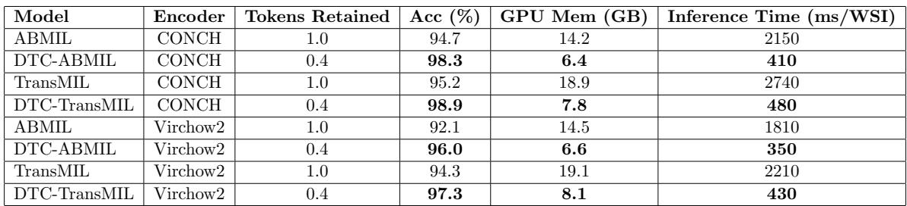

[← 返回 README](../README.md)

# 03 - Results

## 预览

结果部分最值得按三条线读：主性能 Table 1 证明 r=0.4 不是简单省 token；效率 Table 2/3 证明 FLOPs/显存/延迟下降；消融 Table 4/5/6/7 证明 merge、prune、multi-stage schedule、sparsity loss、encoder/backbone 泛化各自有作用。

# 3. Results

# 3.1. Datasets

We evaluated DTC-WSI across four large-scale histopathology classification benchmarks and one cellular-level morphology task to assess both its robustness on diverse cancer subtyping problems and its generalizability beyond WSIs.

> 💡 **数据集声明小心读**: 这句提到 one cellular-level morphology task，但后续正文主要展开四个 WSI classification benchmarks。读结论时应以实际表格呈现的 NSCLC/BRCA/RCC/PANDA 为主，不要过度外推到细胞级任务。

TCGA-NSCLC. (Tomczak et al., 2015) This dataset comprises 993 whole-slide images (WSIs) from Formalin-Fixed Paraffin-Embedded (FFPE) tissue samples, with 507 slides corresponding to lung adenocarcinoma (LUAD) and 486 to lung squamous cell carcinoma (LUSC).

TCGA-BRCA. (Tomczak et al., 2015) The TCGA-BRCA dataset includes 938 FFPE WSIs, of which 772 are diagnosed with Invasive Ductal Carcinoma (IDC) and 166 with Invasive Lobular Carcinoma (ILC).

TCGA-RCC. (Tomczak et al., 2015) The TCGA-RCC cohort contains 884 diagnostic WSIs covering three renal cell carcinoma subtypes: Chromophobe (TCGA-KICH), Clear Cell (TCGA-KIRC), and Papillary (TCGA-KIRP). The dataset includes 111 slides from 99 CRCC cases, 489 slides from 483 CCRCC cases, and 284 slides from 264 PRCC cases. On average, each slide contributed approximately 13,900 patches at $\times 2 0$ magnification.

PANDA. (Bulten et al., 2022) The PANDA dataset consists of 12,625 prostate biopsy WSIs collected from six different institutions. The dataset includes 3,628 nontissue/background slides, 3,151 non-epithelium/non-cancerous slides, 1,644 benign slides, and 4,202 cancerous slides. For our classification task, we focused on benign and cancerous slides to ensure a clinically meaningful evaluation.

> 💡 **WSI token 规模证据**: RCC 平均 13,900 patches/slide 给了一个可量化背景：即便不是最大 resection slide，MIL 也已经面对万级 token。DTC-WSI 的收益主要会在这种长 token bag 上体现，patch 少的 biopsy 子集收益可能不同。

# 3.2. Experimental Setup and Evaluation Metrics

All experiments were implemented in PyTorch and executed on a compute server equipped with four NVIDIA Tesla V100 GPUs and 32 CPU cores. Models were trained using a batch size of 256, the Adam optimizer with an initial learning rate of 0.001, and early stopping based on validation performance. We employed 5-fold cross-validation for all datasets to ensure robust performance estimation. The token retention ratio $r$ was used to tune the effective thresholds for both similarity-based merging and importance-guided pruning, with hyperparameters (merge utility weights, pruning ratios, and sparsity coefficient) optimized separately for each dataset. We report classification performance using Accuracy and Area Under the ROC Curve (AUC), where multi-class accuracy is computed as the average perclass accuracy and AUC is macro-averaged across classes.

> 💡 **公平性与调参点**: 所有方法同 encoder / hardware 是公平性基础；但 DTC-WSI 的 merge weights、pruning ratios、sparsity coefficient 按数据集优化，说明 r=0.4 之外还有调参自由度。复现实验时不能只设置 retention ratio。

Table 1: Comparison of DTC-WSI ( $r = 0 . 4$ ) with MIL and token-efficient baselines across four datasets. Results are reported as mean $\pm$ std over 5 folds. All methods use the same pretrained encoder (CONCH (Lu et al., 2024)) and identical hardware settings.

<table><tr><td rowspan=2 colspan=1>Model</td><td rowspan=1 colspan=2>TCGA-NSCLC</td><td rowspan=1 colspan=2>TCGA-BRCA</td><td rowspan=1 colspan=2>TCGA-RCC</td><td rowspan=1 colspan=2>PANDA</td></tr><tr><td rowspan=1 colspan=1>Acc</td><td rowspan=1 colspan=1>AUC</td><td rowspan=1 colspan=1>Acc</td><td rowspan=1 colspan=1>AUC</td><td rowspan=1 colspan=1>Acc</td><td rowspan=1 colspan=1>AUC</td><td rowspan=1 colspan=1>Acc</td><td rowspan=1 colspan=1>AUC</td></tr><tr><td rowspan=3 colspan=1>ABMIL (Ilse et al., 2018)CLAM-MB (Lu et al., 2021)DSMIL (Li et al., 2021)</td><td rowspan=1 colspan=1>94.7±0.6</td><td rowspan=1 colspan=1>95.4±0.5</td><td rowspan=1 colspan=1>93.4±0.7</td><td rowspan=1 colspan=1>94.1±0.6</td><td rowspan=1 colspan=1>92.6±0.6</td><td rowspan=1 colspan=1>93.5±0.5</td><td rowspan=1 colspan=1>91.2±0.7</td><td rowspan=1 colspan=1>92.1±0.6</td></tr><tr><td rowspan=1 colspan=1>95.8±0.5</td><td rowspan=1 colspan=1>96.6±0.4</td><td rowspan=1 colspan=1>94.5±0.6</td><td rowspan=1 colspan=1>95.3±0.5</td><td rowspan=1 colspan=1>93.9±0.6</td><td rowspan=1 colspan=1>94.8±0.5</td><td rowspan=1 colspan=1>92.4±0.6</td><td rowspan=1 colspan=1>93.4±0.5</td></tr><tr><td rowspan=1 colspan=1>95.3±0.6</td><td rowspan=1 colspan=1>96.1±0.5</td><td rowspan=1 colspan=1>94.0±0.6</td><td rowspan=1 colspan=1>94.8±0.6</td><td rowspan=1 colspan=1>93.4±0.6</td><td rowspan=1 colspan=1>94.2±0.5</td><td rowspan=1 colspan=1>91.9±0.7</td><td rowspan=1 colspan=1>92.9±0.6</td></tr><tr><td rowspan=6 colspan=1>TransMIL (Shao et al., 2021)HIPT (Chen et al., 2022)PANTHER (Song et al., 2024)SPT (Hou et al., 2024)ToMe (Bolya and Hoffman, 2023)PatchGD (Gupta et al., 2023)</td><td rowspan=1 colspan=1>96.4±0.5</td><td rowspan=1 colspan=1>97.2±0.4</td><td rowspan=1 colspan=1>95.6±0.5</td><td rowspan=1 colspan=1>96.4±0.5</td><td rowspan=1 colspan=1>94.8±0.5</td><td rowspan=1 colspan=1>95.6±0.4</td><td rowspan=1 colspan=1>92.8±0.6</td><td rowspan=1 colspan=1>93.7±0.5</td></tr><tr><td rowspan=1 colspan=1>96.2±0.5</td><td rowspan=1 colspan=1>97.0±0.4</td><td rowspan=1 colspan=1>95.3±0.6</td><td rowspan=1 colspan=1>96.1±0.5</td><td rowspan=1 colspan=1>94.6±0.5</td><td rowspan=1 colspan=1>95.4±0.5</td><td rowspan=1 colspan=1>92.6±0.6</td><td rowspan=1 colspan=1>93.6±0.5</td></tr><tr><td rowspan=1 colspan=1>96.8±0.4</td><td rowspan=1 colspan=1>97.6±0.4</td><td rowspan=1 colspan=1>96.0±0.5</td><td rowspan=1 colspan=1>96.8±0.4</td><td rowspan=1 colspan=1>95.2±0.5</td><td rowspan=1 colspan=1>96.1±0.4</td><td rowspan=1 colspan=1>93.3±0.5</td><td rowspan=1 colspan=1>94.2±0.4</td></tr><tr><td rowspan=1 colspan=1>95.9±0.5</td><td rowspan=1 colspan=1>96.7±0.4</td><td rowspan=1 colspan=1>94.8±0.6</td><td rowspan=1 colspan=1>95.6±0.5</td><td rowspan=1 colspan=1>93.8±0.6</td><td rowspan=1 colspan=1>94.6±0.5</td><td rowspan=1 colspan=1>92.3±0.6</td><td rowspan=1 colspan=1>93.2±0.5</td></tr><tr><td rowspan=1 colspan=1>91.0±0.8</td><td rowspan=1 colspan=1>91.8±0.7</td><td rowspan=1 colspan=1>90.0±0.8</td><td rowspan=1 colspan=1>90.8±0.7</td><td rowspan=1 colspan=1>89.1±0.8</td><td rowspan=1 colspan=1>90.0±0.7</td><td rowspan=1 colspan=1>87.5±0.9</td><td rowspan=1 colspan=1>88.4±0.8</td></tr><tr><td rowspan=1 colspan=1>94.2±0.6</td><td rowspan=1 colspan=1>95.0±0.5</td><td rowspan=1 colspan=1>93.2±0.7</td><td rowspan=1 colspan=1>94.0±0.6</td><td rowspan=1 colspan=1>92.4±0.6</td><td rowspan=1 colspan=1>93.3±0.6</td><td rowspan=1 colspan=1>90.7±0.7</td><td rowspan=1 colspan=1>91.6±0.6</td></tr><tr><td rowspan=1 colspan=1>MHIM-MIL (Tang et al., 2023b)</td><td rowspan=1 colspan=1>93.5±0.7</td><td rowspan=1 colspan=1>94.3±0.6</td><td rowspan=1 colspan=1>92.8±0.7</td><td rowspan=1 colspan=1>93.6±0.6</td><td rowspan=1 colspan=1>91.9±0.7</td><td rowspan=1 colspan=1>92.8±0.6</td><td rowspan=1 colspan=1>90.1±0.8</td><td rowspan=1 colspan=1>91.0±0.7</td></tr><tr><td rowspan=2 colspan=1>Longformer (Zhang et al., 2021)2DMambaMIL (Zhang et al., 2025)</td><td rowspan=1 colspan=1>92.1±0.8</td><td rowspan=1 colspan=1>92.9±0.7</td><td rowspan=1 colspan=1>91.4±0.8</td><td rowspan=1 colspan=1>91.2±0.7</td><td rowspan=1 colspan=1>89.6±0.8</td><td rowspan=1 colspan=1>90.4±0.7</td><td rowspan=1 colspan=1>88.9±0.8</td><td rowspan=1 colspan=1>89.8±0.7</td></tr><tr><td rowspan=1 colspan=1>94.3±0.6</td><td rowspan=1 colspan=1>95.1±0.5</td><td rowspan=1 colspan=1>91.7±0.7</td><td rowspan=1 colspan=1>92.5±0.6</td><td rowspan=1 colspan=1>90.7±0.7</td><td rowspan=1 colspan=1>91.6±0.6</td><td rowspan=1 colspan=1>89.0±0.8</td><td rowspan=1 colspan=1>90.9±0.7</td></tr><tr><td rowspan=1 colspan=1>Random Sampling</td><td rowspan=1 colspan=1>78.5±1.1</td><td rowspan=1 colspan=1>79.1±1.0</td><td rowspan=1 colspan=1>72.2±1.2</td><td rowspan=1 colspan=1>73.4±1.1</td><td rowspan=1 colspan=1>81.4±1.0</td><td rowspan=1 colspan=1>81.7±0.9</td><td rowspan=1 colspan=1>71.6±1.3</td><td rowspan=1 colspan=1>72.1±1.2</td></tr><tr><td rowspan=1 colspan=1>DTC-WSI (Ours)</td><td rowspan=1 colspan=1>98.3±0.3</td><td rowspan=1 colspan=1>98.9±0.2</td><td rowspan=1 colspan=1>97.4±0.3</td><td rowspan=1 colspan=1>97.9±0.3</td><td rowspan=1 colspan=1>96.8±0.4</td><td rowspan=1 colspan=1>97.5±0.3</td><td rowspan=1 colspan=1>94.8±0.4</td><td rowspan=1 colspan=1>95.6±0.3</td></tr></table>

> 💡 **Table 1 主读数**: DTC-WSI 在四个数据集均最高，且 random sampling 同样保留 40% token 却大幅掉点，说明“选择/合并哪些 token”比“token 数减少”更重要。ToMe 作为 merge baseline 在 WSI 上表现差，也侧面支持 task-aware importance 的必要性。

# 3.3. Performance Comparison

We evaluated DTC-WSI on four benchmark WSI datasets—TCGA-NSCLC, TCGA-BRCA, TCGA-RCC, and PANDA—and compared it against a comprehensive set of state-of-the-art MIL and token-efficient approaches. These include classical MIL models (ABMIL, CLAM-MB, DSMIL), transformer-based and hierarchical methods (TransMIL, HIPT, PANTHER, SPT), as well as recent efficiency-oriented baselines such as ToMe, PatchGD, MHIM-MIL, Longformer, and 2DMambaMIL. For fair comparison, all methods use the same pretrained feature encoder ( CONCH (Lu et al., 2024)). In addition, we include a random sampling baseline that retains the same fraction of tokens ( $r = 0 . 4$ ) as DTC-WSI to isolate the effect of dynamic compression from simple token reduction. The results are summarized in Table 1.

DTC-WSI consistently achieves the best performance across all datasets, reaching $\mathbf { 9 8 . 3 \% }$ accuracy on TCGA-NSCLC, 97.4% on TCGA-BRCA, $\mathbf { 9 6 . 8 \% }$ on TCGA-RCC, and $\mathbf { 9 4 . 8 \% }$ on PANDA. Compared to strong MIL and token-efficient baselines, DTC-WSI improves accuracy by approximately $1 . 8 { - } 3 . 6 \%$ and AUC by 1.6–3.5% across datasets, while retaining only $4 0 \%$ of the original tokens.

Importantly, random sampling—despite using the same token budget—exhibits a substantial performance drop across all datasets, indicating that efficiency gains alone do not account for the improvements. This underscores the importance of saliency-aware dynamic compression: DTC-WSI preserves diagnostically informative regions via importance-guided pruning and similarity-aware merging, rather than indiscriminate token removal. We find that $r = 0 . 4$ provides the best accuracy–efficiency trade-off (Appendix B). Overall, DTC-WSI achieves a superior balance compared to static sampling and existing token-efficient methods.

> 💡 **性能解释边界**: 作者把 accuracy 增益解释为去掉冗余/低 saliency token 后表示更聚焦，这在分类任务上合理。但这不等于所有被删 token 都无临床价值；对于 report generation、rare pattern detection、segmentation，低分类 saliency 的区域仍可能重要。

Table 2: Computational efficiency and accuracy of DTC-WSI under different token retention ratios. All rows correspond to the same DTC-WSI framework with different final token budgets.

<table><tr><td rowspan=2 colspan=1>Final Retention</td><td rowspan=2 colspan=1>Acc (%)</td><td rowspan=2 colspan=1>FLOPs (G)</td><td rowspan=1 colspan=1>MIL Aggregation Only</td><td rowspan=1 colspan=1>Full Pipeline</td><td rowspan=2 colspan=1>Speedup</td></tr><tr><td rowspan=1 colspan=1>GPU Mem (GB)Time (ms)</td><td rowspan=1 colspan=1>GPU Mem (GB)Time (ms)</td></tr><tr><td rowspan=1 colspan=1>r = 1.0 (no compression)</td><td rowspan=1 colspan=1>94.6</td><td rowspan=1 colspan=1>118.4</td><td rowspan=1 colspan=1>3.1          420</td><td rowspan=1 colspan=1>14.2         2150</td><td rowspan=1 colspan=1>1.0×</td></tr><tr><td rowspan=1 colspan=1>r = 0.7 (Light Compression)</td><td rowspan=1 colspan=1>96.1</td><td rowspan=1 colspan=1>62.7</td><td rowspan=1 colspan=1>2.2          260</td><td rowspan=1 colspan=1>10.3         1190</td><td rowspan=1 colspan=1>1.8×</td></tr><tr><td rowspan=1 colspan=1>r = 0.5 (Moderate Compression)</td><td rowspan=1 colspan=1>97.1</td><td rowspan=1 colspan=1>38.4</td><td rowspan=1 colspan=1>1.6          170</td><td rowspan=1 colspan=1>8.1          720</td><td rowspan=1 colspan=1>3.0×</td></tr><tr><td rowspan=1 colspan=1>r = 0.4 (Best)</td><td rowspan=1 colspan=1>98.3</td><td rowspan=1 colspan=1>24.3</td><td rowspan=1 colspan=1>1.1          95</td><td rowspan=1 colspan=1>6.4         410</td><td rowspan=1 colspan=1>5.3×</td></tr></table>

> 💡 **Table 2 效率证据**: r=0.4 时 FLOPs 118.4G -> 24.3G、full pipeline 2150ms -> 410ms、GPU memory 14.2GB -> 6.4GB。这里最有意思的是 Acc 从 94.6 升到 98.3，说明压缩同时在做 denoising / redundancy removal，而不仅是工程加速。

Table 3: Training, Inference Efficiency, and Accuracy Comparison (TCGA-NSCLC). All methods use the same pretrained encoder ( CONCH (Lu et al., 2024)) and identical hardware settings.

<table><tr><td>Method</td><td>Acc (%)</td><td>Train Time / Epoch (s)</td><td>Peak GPU Memory (GB)</td><td>Inference Time / WSI (ms)</td></tr><tr><td>ABMIL</td><td>94.7</td><td>312</td><td>14.2</td><td>1860</td></tr><tr><td>TransMIL</td><td>96.4</td><td>428</td><td>18.9</td><td>2740</td></tr><tr><td>ToMe</td><td>91.0</td><td>228</td><td>9.4</td><td>870</td></tr><tr><td>MHIM-MIL</td><td>93.5</td><td>214</td><td>8.9</td><td>890</td></tr><tr><td>Random Sampling (r=0.4)</td><td>78.5</td><td>205</td><td>8.6</td><td>330</td></tr><tr><td>DTC-WSI (Ours, r=0.4)</td><td>98.3</td><td>236</td><td>9.1</td><td>410</td></tr></table>

> 💡 **Table 3 trade-off**: Random Sampling 更快 330ms，但 Acc 只有 78.5；DTC-WSI 410ms 换来 98.3 Acc。真正的比较不是“最快”，而是 accuracy-efficiency Pareto：DTC 接近高效方法的耗时，但性能超过 ABMIL/TransMIL。

# 3.4. Computational Efficiency of Token Compression

Beyond accuracy improvements, DTC-WSI provides substantial computational savings through progressive multi-stage token compression. Table 2 reports the impact of different token retention ratios within the same DTC-WSI framework on both efficiency and accuracy. As the retention ratio decreases, FLOPs, GPU memory usage, and inference latency consistently decline, while classification accuracy steadily improves. Using the full token set ( $r = 1 . 0$ ), DTC-WSI requires 118.4 G FLOPs, 14.2 GB GPU memory, and 2150 ms per WSI. Light compression ( $r = 0 . 7$ ) nearly halves computation and yields a 1.8 $\times$ speedup, while moderate compression ( $r = 0 . 5$ ) further reduces inference time to 720 ms.

The best trade-off is achieved at $r = 0 . 4$ , where DTC-WSI retains only $4 0 \%$ of the original tokens yet attains the highest accuracy (98.3% on TCGA-NSCLC). At this setting, FLOPs are reduced to 24.3 G, peak GPU memory drops to 6.4 GB, and end-to-end inference time decreases to 410 ms, corresponding to a ${ \bf 5 . 3 \times }$ speedup over the uncompressed setting. Importantly, these efficiency gains are accompanied by improved predictive performance, indicating that dynamic compression removes redundant and low-saliency tokens while preserving diagnostically relevant regions.

To contextualize these gains, Table 3 also reports training and inference efficiency comparisons against standard MIL and token-efficient baselines. We include a random sampling baseline that retains the same $4 0 \%$ token budget as DTC-WSI. Although random sampling achieves low inference latency due to aggressive token reduction, it leads to severe accuracy degradation (Table 1), highlighting that computational savings alone are insufficient. In contrast, DTC-WSI maintains competitive training cost and memory usage while significantly outperforming random and static selection strategies in accuracy, demonstrating the necessity of saliency-aware, dynamic token allocation. Overall, these results confirm that DTC-WSI delivers a superior accuracy–efficiency trade-off compared to both na¨ıve sampling and existing token-efficient MIL approaches.

> 💡 **效率结论的边界**: 表格的 full pipeline 看起来包括更多 than MIL aggregation，但仍是在已提取 patch features 的实验语境下。真实临床部署还要算 WSI loading、tiling、feature extraction、HDF5/IO 和多倍率 pyramid，DTC-WSI主要解决的是聚合阶段 token burden。

Table 4: Ablation study comparing merging and pruning strategies (r=0.4) across four datasets. Metrics reported as Accuracy (Acc) and AUC ( $\%$ ).

<table><tr><td rowspan=2 colspan=1>Model Variant</td><td rowspan=1 colspan=2>TCGA-NSCLC</td><td rowspan=1 colspan=2>TCGA-BRCA</td><td rowspan=1 colspan=2>TCGA-RCC</td><td rowspan=1 colspan=2>PANDA</td></tr><tr><td rowspan=1 colspan=1>Acc</td><td rowspan=1 colspan=1>AUC</td><td rowspan=1 colspan=1>Acc</td><td rowspan=1 colspan=1>AUC</td><td rowspan=1 colspan=1>Acc</td><td rowspan=1 colspan=1>AUC</td><td rowspan=1 colspan=1>Acc</td><td rowspan=1 colspan=1>AUC</td></tr><tr><td rowspan=1 colspan=1>Random Merging</td><td rowspan=1 colspan=1>95.0</td><td rowspan=1 colspan=1>96.1</td><td rowspan=1 colspan=1>94.0</td><td rowspan=1 colspan=1>95.1</td><td rowspan=1 colspan=1>93.1</td><td rowspan=1 colspan=1>94.3</td><td rowspan=1 colspan=1>91.6</td><td rowspan=1 colspan=1>92.8</td></tr><tr><td rowspan=1 colspan=1>Random Pruning</td><td rowspan=1 colspan=1>94.6</td><td rowspan=1 colspan=1>95.7</td><td rowspan=1 colspan=1>93.6</td><td rowspan=1 colspan=1>94.8</td><td rowspan=1 colspan=1>92.9</td><td rowspan=1 colspan=1>94.1</td><td rowspan=1 colspan=1>91.2</td><td rowspan=1 colspan=1>92.4</td></tr><tr><td rowspan=1 colspan=1>Only Merge (Similarity-Guided)</td><td rowspan=1 colspan=1>96.4</td><td rowspan=1 colspan=1>97.6</td><td rowspan=1 colspan=1>95.3</td><td rowspan=1 colspan=1>96.3</td><td rowspan=1 colspan=1>94.5</td><td rowspan=1 colspan=1>95.7</td><td rowspan=1 colspan=1>93.0</td><td rowspan=1 colspan=1>94.2</td></tr><tr><td rowspan=1 colspan=1>Only Prune (Importance-Guided)</td><td rowspan=1 colspan=1>95.7</td><td rowspan=1 colspan=1>96.9</td><td rowspan=1 colspan=1>94.7</td><td rowspan=1 colspan=1>95.8</td><td rowspan=1 colspan=1>93.9</td><td rowspan=1 colspan=1>95.1</td><td rowspan=1 colspan=1>92.4</td><td rowspan=1 colspan=1>93.5</td></tr><tr><td rowspan=1 colspan=1>Ours (Dynamic Merge + Prune)</td><td rowspan=1 colspan=1>98.3</td><td rowspan=1 colspan=1>98.9</td><td rowspan=1 colspan=1>97.4</td><td rowspan=1 colspan=1>97.9</td><td rowspan=1 colspan=1>96.8</td><td rowspan=1 colspan=1>97.5</td><td rowspan=1 colspan=1>94.8</td><td rowspan=1 colspan=1>95.6</td></tr></table>

> 💡 **Table 4 消融核心**: Only Merge > Random Merging，Only Prune > Random Pruning，但 Dynamic Merge + Prune 又明显高于单一策略。这个表最直接支持“redundancy consolidation”和“saliency selection”是互补机制，而不是任意一种 token compression 就足够。

Table 5: Sensitivity analysis of DTC-WSI to multi-stage retention schedules. Final token budget is fixed to ${ \sim } 4 0 \%$ across all settings.

<table><tr><td rowspan="2">Schedule</td><td rowspan="2">Stage 1 (r1)</td><td rowspan="2">Stage 2 (r2)</td><td rowspan="2">Stage 3 (r3)</td><td colspan="2">TCGA-NSCLC</td><td colspan="2">TCGA-BRCA</td><td colspan="2">TCGA-RCC</td><td colspan="2">PANDA</td></tr><tr><td>Acc</td><td>AUC</td><td>Acc</td><td>AUC</td><td>Acc</td><td>AUC</td><td>Acc</td><td>AUC</td></tr><tr><td>Uniform (default)</td><td>0.74</td><td>0.74</td><td>0.74</td><td>98.3</td><td>98.9</td><td>97.4</td><td>97.9</td><td>96.8</td><td>97.5</td><td>94.8</td><td>95.6</td></tr><tr><td>Balanced</td><td>0.70</td><td>0.70</td><td>0.82</td><td>98.2</td><td>98.8</td><td>97.3</td><td>97.8</td><td>96.7</td><td>97.4</td><td>94.6</td><td>95.4</td></tr><tr><td>Early-aggressive</td><td>0.55</td><td>0.80</td><td>0.91</td><td>97.6</td><td>98.1</td><td>96.8</td><td>97.2</td><td>96.1</td><td>96.8</td><td>94.0</td><td>94.7</td></tr><tr><td>Late-aggressive</td><td>0.85</td><td>0.70</td><td>0.67</td><td>98.0</td><td>98.6</td><td>97.1</td><td>97.6</td><td>96.5</td><td>97.2</td><td>94.4</td><td>95.1</td></tr><tr><td>2-stage only</td><td>0.63</td><td>0.63</td><td>−</td><td>97.8</td><td>98.4</td><td>96.9</td><td>97.4</td><td>96.3</td><td>97.0</td><td>94.2</td><td>94.9</td></tr></table>

> 💡 **Table 5 schedule 读法**: final budget 都约 40%，uniform 0.74/0.74/0.74 最好但 balanced 几乎持平，说明方法不是极度依赖某个精确 schedule。early-aggressive 掉点更明显，符合“早期 saliency 未稳定，不宜压太猛”的动机。

# 3.5. Ablation Studies

Ablation on Merging and Pruning Strategies. Table 4 presents an ablation study isolating the effects of token merging and pruning strategies under a fixed token budget of $r = 0 . 4$ for all variants. Random merging and random pruning result in noticeable performance degradation across all datasets, indicating that indiscriminate compression disrupts discriminative slide-level signals. Using similarity-guided merging alone consistently outperforms random merging by preserving redundant yet morphologically coherent regions, while importance-guided pruning alone yields moderate gains by suppressing low-saliency tokens. However, neither strategy alone matches the full DTC-WSI framework. Combining similarity-guided merging with importance-guided pruning achieves the best performance across all benchmarks, improving accuracy by $2 { - } 4 \%$ over single-strategy variants. These results demonstrate that dynamic, saliency-aware merging and pruning are both necessary and complementary, and that performance gains cannot be attributed to token reduction alone, but to the proposed joint dynamic compression mechanism.

Sensitivity to Multi-Stage Retention Schedules. Table 5 analyzes the sensitivity of DTC-WSI to different multi-stage token retention schedules, while fixing the final token budget to approximately $4 0 \%$ across all settings. We observe that performance remains consistently strong across a wide range of stage-wise retention ratios, indicating that DTC-WSI is not overly sensitive to precise hyperparameter choices. The uniform schedule ( $r _ { 1 } =$ $r _ { 2 } = r _ { 3 } = 0 . 7 4$ ) yields the best overall performance and is used as the default configuration.

More aggressive early or late compression leads to a modest accuracy drop, suggesting that progressively reducing tokens helps preserve diagnostically relevant regions under weak supervision. Overall, these results demonstrate that the proposed multi-stage compression strategy is stable, robust, and does not require fine-tuning of stage-wise retention ratios to achieve strong performance.

> 💡 **消融合起来看**: Table 4 回答“为什么 merge + prune 都要有”；Table 5 回答“为什么要 multi-stage 而不是一把压到底”。两者合起来支撑 dynamic multi-stage token compression 这个完整设计，而不是孤立 trick。

Encoder and backbone ablation. Table 6 analyzes the impact of encoder choice and MIL backbone on predictive performance and computational efficiency. Across both encoders (CONCH and Virchow2) and MIL backbones (ABMIL and TransMIL), DTC-WSI consistently improves accuracy while substantially reducing GPU memory usage and inference time. For instance, with the CONCH encoder, DTC-ABMIL improves accuracy from $9 4 . 7 \%$ to $9 8 . 3 \%$ while reducing GPU memory by more than 2 $\times$ and inference time by over 5 $\times$ . Similar trends are observed for transformer-based aggregation, where DTC-TransMIL outperforms vanilla TransMIL while reducing memory consumption and runtime by approximately 3–5 $\times$ . Importantly, these gains are consistent across encoders of different strengths, indicating that the improvements stem from the proposed dynamic token compression rather than the upstream feature extractor. Overall, the results demonstrate that DTC-WSI is both encoder-agnostic and backbone-agnostic, providing a favorable accuracy– efficiency trade-off for both lightweight and transformer-based MIL pipelines.

Table 6: Ablation of encoder choice and MIL backbone. All models are evaluated under identical data splits and training protocols.

<table><tr><td rowspan=1 colspan=1>Model</td><td rowspan=1 colspan=1>Encoder</td><td rowspan=1 colspan=1>Tokens Retained</td><td rowspan=1 colspan=1>Acc (%)</td><td rowspan=1 colspan=1>GPUMem(GB)</td><td rowspan=1 colspan=1>InferenceTime(ms/WSI)</td></tr><tr><td rowspan=1 colspan=1>ABMIL</td><td rowspan=1 colspan=1>CONCH</td><td rowspan=1 colspan=1>1.0</td><td rowspan=1 colspan=1>94.7</td><td rowspan=1 colspan=1>14.2</td><td rowspan=1 colspan=1>2150</td></tr><tr><td rowspan=1 colspan=1>DTC-ABMIL</td><td rowspan=1 colspan=1>CONCH</td><td rowspan=1 colspan=1>0.4</td><td rowspan=1 colspan=1>98.3</td><td rowspan=1 colspan=1>6.4</td><td rowspan=1 colspan=1>410</td></tr><tr><td rowspan=1 colspan=1>TransMIL</td><td rowspan=1 colspan=1>CONCH</td><td rowspan=1 colspan=1>1.0</td><td rowspan=1 colspan=1>95.2</td><td rowspan=1 colspan=1>18.9</td><td rowspan=1 colspan=1>2740</td></tr><tr><td rowspan=1 colspan=1>DTC-TransMIL</td><td rowspan=1 colspan=1>CONCH</td><td rowspan=1 colspan=1>0.4</td><td rowspan=1 colspan=1>98.9</td><td rowspan=1 colspan=1>7.8</td><td rowspan=1 colspan=1>480</td></tr><tr><td rowspan=1 colspan=1>ABMIL</td><td rowspan=1 colspan=1>Virchow2</td><td rowspan=1 colspan=1>1.0</td><td rowspan=1 colspan=1>92.1</td><td rowspan=1 colspan=1>14.5</td><td rowspan=1 colspan=1>1810</td></tr><tr><td rowspan=1 colspan=1>DTC-ABMIL</td><td rowspan=1 colspan=1>Virchow2</td><td rowspan=1 colspan=1>0.4</td><td rowspan=1 colspan=1>96.0</td><td rowspan=1 colspan=1>6.6</td><td rowspan=1 colspan=1>350</td></tr><tr><td rowspan=1 colspan=1>TransMIL</td><td rowspan=1 colspan=1>Virchow2</td><td rowspan=1 colspan=1>1.0</td><td rowspan=1 colspan=1>94.3</td><td rowspan=1 colspan=1>19.1</td><td rowspan=1 colspan=1>2210</td></tr><tr><td rowspan=1 colspan=1>DTC-TransMIL</td><td rowspan=1 colspan=1>Virchow2</td><td rowspan=1 colspan=1>0.4</td><td rowspan=1 colspan=1>97.3</td><td rowspan=1 colspan=1>8.1</td><td rowspan=1 colspan=1>430</td></tr></table>

> 💡 **Table 6 泛化证据**: DTC-ABMIL 和 DTC-TransMIL 都提升，CONCH 和 Virchow2 都提升，说明压缩模块不是只适配某个 aggregation head。不过表里不同 encoder 的 baseline 强弱差异较大，不能直接把 DTC-WSI 的增益归因于某个 foundation encoder。

Ablation on Sparsity Regularization. We analyze the effect of the sparsity regularizer $\mathcal { L } _ { \mathrm { s p a r s e } }$ applied to the importance scores by training DTC-WSI with and without the $\ell _ { 1 }$ penalty. Removing $\mathcal { L } _ { \mathrm { s p a r s e } }$ results in denser importance distributions, which weakens the pruning behavior and leads to higher token retention and increased inference cost. This also causes a consistent degradation in classification performance. In contrast, incorporating the sparsity term encourages selective saliency assignment, stabilizes multi-stage token compression, and yields both improved accuracy and computational efficiency. These results demonstrate that $\mathcal { L } _ { \mathrm { s p a r s e } }$ is a critical component for learning compact yet discriminative representations under weak slide-level supervision.

> 💡 **sparsity regularization 批读**: 这段解释了为什么 importance weights 需要显式稀疏化。没有 $\ell_1$，softmax 仍能排序，但分布不够尖，pruning gate 不敢强删 token，最终 retained tokens 和推理时间都上升。

## Section 总结

| 证据 | 支持的判断 |
|---|---|
| Table 1 | r=0.4 下 DTC-WSI 在四个 WSI 分类 benchmark 上性能最佳 |
| Random Sampling | token 少本身不够，saliency-aware 选择是关键 |
| Table 2/3 | DTC-WSI 处于更好的 accuracy-efficiency Pareto |
| Table 4 | merging 与 pruning 互补，任一单独使用都不够 |
| Table 5 | progressive multi-stage 比 early aggressive 更稳 |
| Table 6 | 压缩模块可接 ABMIL/TransMIL 和 CONCH/Virchow2 |
| Sparsity ablation | sparse importance 是剪枝效率和性能的必要条件 |
