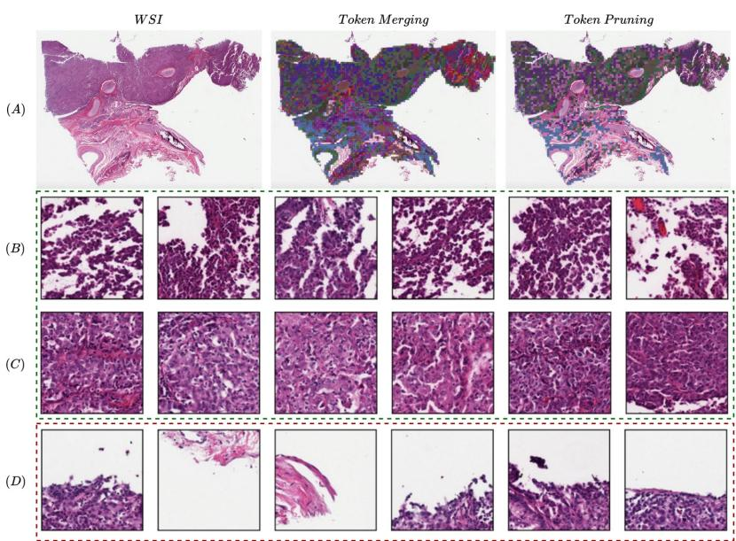
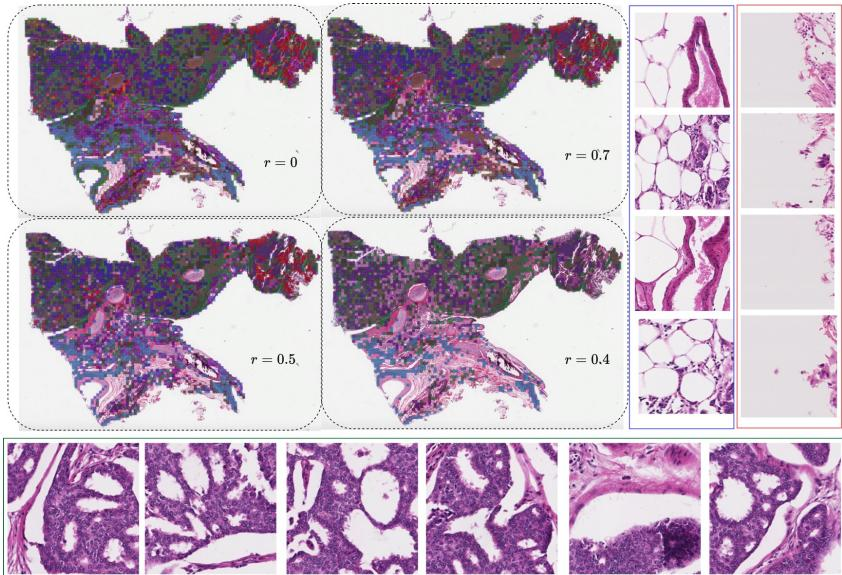
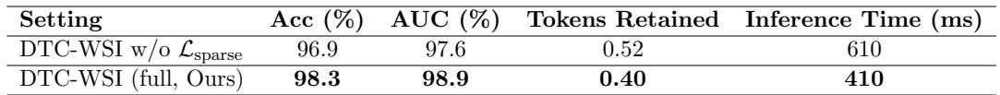

[← 返回 README](../README.md)

# 04 - Visualization

## 预览

可视化部分要看“方法行为是否符合论文叙事”：merged patches 是否主要是 stroma/adipose/repeated texture，pruned patches 是否偏 background/border/artifact，retained patches 是否集中在 tumor-rich diagnostically relevant regions。

# 4. Visualization of Token Compression

Figure 2 illustrates the full multi-stage compression process performed by DTC-WSI. Panel (A) shows the original WSI along with overlaid heatmaps depicting the model output after similarity-guided token merging and after importance-guided pruning. Panels (B) and (C) present examples of visually similar patches that are merged into unified representations; these merged groups are highlighted with green borders, demonstrating how redundant regions—such as uniform stromal areas or repeated tumor patterns—are effectively consolidated. Panel (D) displays patches removed through importance-guided pruning, marked with red borders, revealing low-saliency regions that contribute minimally to the slidelevel prediction. Overall, these visualizations show that DTC-WSI performs structured, interpretable compression: reducing redundancy through merging while selectively pruning non-informative regions, ultimately preserving the most diagnostically meaningful tissue patterns.

> 💡 **可视化证据链**: Figure 2 是对 Table 4 的视觉补充：如果 Only Merge 和 Only Prune 都有作用，那么图上应该能同时看到“重复形态被合并”和“低 saliency 区域被剪掉”。它不是单纯 attention heatmap，而是把 compression 操作本身可视化。

Figure 2: Visualization of multi-stage token compression in DTC-WSI: (A) Original WSI with post-merging and post-pruning heatmaps. (B–C) Similar patches merged into unified tokens (green), and (D) low-saliency patches removed by pruning (red).

> 💡 **Figure 2 批读**: 绿色合并组应被理解为“token 表征合并”，不是原图区域消失；红色剪枝才对应 token 被移出 MIL aggregation。这个区分很重要，因为 merge 仍保留某种汇总信息，而 prune 是更强的信息删除。

Figure 3: Visualization of multi-stage token compression in DTC-WSI across retention ratios $r \in { 1 . 0 , 0 . 7 , 0 . 5 , 0 . 4 }$ . Example merged patches (e.g., adipose or stroma) are shown in blue boxes, pruned patches (e.g., background or slide borders) in red boxes, and high-importance patches retained for final prediction (e.g., tumor regions) in green boxes, highlighting diagnostically relevant tissue patterns.

> 💡 **Figure 3 retention 读法**: r 从 1.0 到 0.4 时，蓝色 merged 和红色 pruned 区域逐渐增加，而绿色 retained 区域应保持诊断相关形态。这张图对应 Table 2/8 的“适度压缩提升，过度压缩下降”：r=0.4 看起来保住核心区域，但 r=0.3 在 Appendix B 已明显掉点。

Table 7: Ablation study on sparsity regularization. Effect of removing the $\ell _ { 1 }$ sparsity loss $\mathcal { L } _ { \mathrm { s p a r s e } }$ on performance and compression behavior (TCGA-NSCLC).

<table><tr><td>Setting</td><td>Acc (%)</td><td>AUC (%)</td><td>Tokens Retained −</td><td>Inference Time (ms)</td></tr><tr><td>DTC-WSI w/o Lsparse</td><td>96.9</td><td>97.6</td><td>0.52</td><td>610</td></tr><tr><td>DTC-WSI (full, Ours)</td><td>98.3</td><td>98.9</td><td>0.40</td><td>410</td></tr></table>

> 💡 **Table 7 与可视化的连接**: 如果没有 sparsity loss，importance heatmap 可能更 diffuse，pruning 会保守，token retained 变多但性能反而下降。说明“少删一点”不一定更好，关键是 saliency distribution 要能把冗余/噪声 token 明确压低。

Figure 3 illustrates how DTC-WSI progressively compresses a whole-slide image as the token retention ratio decreases from $r = 1 . 0$ (no compression) to $r = 0 . 7$ , $r = 0 . 5$ , and $r = 0 . 4$ . For each retention level, we visualize the WSI after applying similarity-guided token merging and importance-guided pruning. Each panel illustrates the effect of these operations as the token budget decreases. Example merged patches (blue boxes) correspond to visually homogeneous and redundant regions (e.g., adipose or stromal tissue), which are fused to reduce redundancy. Pruned patches (red boxes) highlight low-saliency or non-informative regions (e.g., slide borders or artifacts) that are removed during compression. In contrast, high-importance patches retained for final prediction (green boxes) capture diagnostically relevant tumor tissue patterns. At $r = 1 . 0$ , all extracted patches are preserved, resulting in a dense and highly redundant representation, whereas by $r = 0 . 4$ the representation becomes substantially more compact while preserving salient tissue structures. These visualizations demonstrate that DTC-WSI performs semantically meaningful compression by preserving informative regions while aggressively removing redundancy, thereby concentrating model capacity on morphologically relevant content and enabling both computational efficiency and improved predictive performance.

> 💡 **可解释性边界**: 这些图能说明 compression 行为与人类直觉一致，但不能单独证明被剪掉区域对所有任务都无用。它支持的是“对当前 slide classification label 的 discriminative evidence”被保留，而不是完整病理信息被无损保留。

## Section 总结

| 可视化对象 | 读法 |
|---|---|
| post-merging heatmap | 相似冗余区域被聚合成共享表示 |
| post-pruning heatmap | 低 saliency token 被移出 aggregation |
| blue boxes | adipose/stroma 等 homogeneous regions 可被 merge |
| red boxes | background/border/artifact 或低贡献区域可被 prune |
| green boxes | tumor-rich / diagnostically relevant regions 应被保留 |
| Table 7 | sparse importance 是可解释 pruning 的训练约束 |
