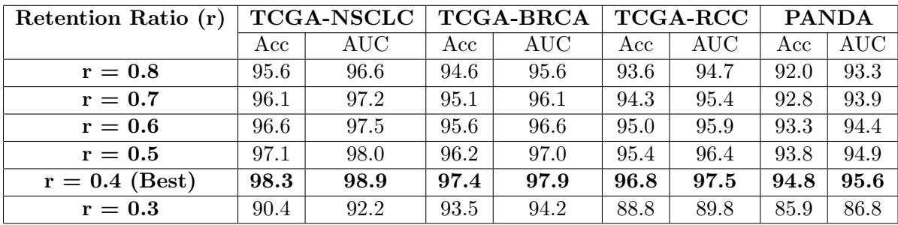
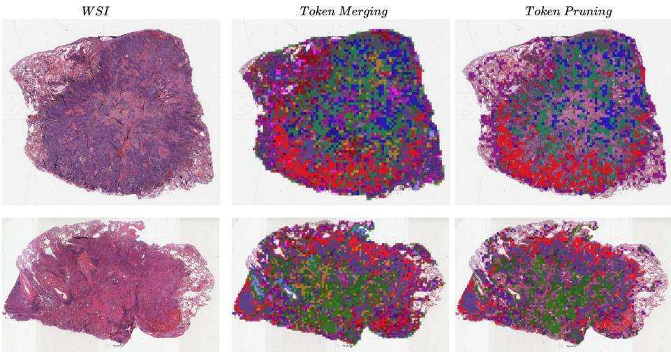

[← 返回 README](../README.md)

# 06 - Appendix

## 预览

Appendix 补充了三个关键点：WSI patch 是如何通过 tissue segmentation 得到的；retention ratio 从 0.8 到 0.3 的扩展消融证明 r=0.4 是甜点区；Algorithm 1 把 importance estimation、bipartite matching、merge、soft/hard pruning 串成可复现流程。

# Appendix A.

# Whole Slide Image Preprocessing

Whole slide image (WSI) preprocessing begins with automated tissue segmentation. Each WSI is first loaded into memory at a downsampled resolution, such as 20 $\times$ , and converted from RGB to HSV colorspace. Tissue regions (foreground) are identified by thresholding the saturation channel after applying median blurring to smooth edges. A binary mask is then generated and refined using morphological closing to eliminate small gaps and holes. The contours of detected tissue regions are filtered based on an area threshold, ensuring only relevant regions are retained for further processing. The segmentation mask for each slide is also available for optional visual inspection. To facilitate manual adjustments, a human-readable text file is generated, listing processed files along with editable segmentation parameters. Once segmentation is complete, 256 $\times$ 256 patches are extracted from within the segmented contours at the specified magnification. These patches, along with their coordinates and slide metadata, are stored in the HDF5 hierarchical data format. The number of extracted patches per slide varies significantly—ranging from hundreds in biopsy slides at $2 0 \times$ magnification to hundreds of thousands in large resection slides at 40 $\times$ magnification.

> 💡 **预处理与 token budget**: DTC-WSI 的输入 token 数首先由 tissue segmentation 和 patch extraction 决定。背景去除越激进，后续 compression 可删的 low-saliency token 可能越少；大 resection slide 在 40x 下能到 hundreds of thousands patches，才是真正考验 token compression 的场景。

# Appendix B. Ablation study

# Comparison of Different Threshold Values

The extended ablation in Table 8 evaluates DTC-WSI under a wide range of token retention ratios $r \in [ 0 . 3 , 0 . 8 ]$ ) across four benchmark datasets. Performance improves consistently as redundant tokens are removed, with accuracy rising steadily from $r = 0 . 8$ to $r = 0 . 5$ on all cohorts. The model achieves its best results at $r = 0 . 4$ , reaching $\mathbf { 9 8 . 3 \% }$ (NSCLC), $\mathbf { 9 7 . 4 \% }$ (BRCA), $\mathbf { 9 6 . 8 \% }$ (RCC), and $\mathbf { 9 4 . 8 \% }$ (PANDA), demonstrating that moderate compression enhances discriminative focus while preserving essential morphology. When compression becomes too aggressive ( $r = 0 . 3$ ), performance drops sharply—e.g., NSCLC declines from $\mathbf { 9 8 . 3 \% }$ to $\mathbf { 9 0 . 4 \% }$ —indicating loss of critical diagnostic tokens. These results highlight a clear U-shaped trend: light compression reduces redundancy, moderate compression maximizes accuracy, and over-compression degrades performance. Overall, the study confirms that DTC-WSI benefits most from token retention around $r = 0 . 4$ , where efficiency and predictive power are jointly optimized.

> 💡 **r=0.4 的含义**: Table 8 给出的不是单调“越压越好”，而是 U-shaped trend。r=0.8/0.7 还保留很多冗余，r=0.3 已丢掉诊断 token；r=0.4 是这组分类任务上的经验甜点区，不应被当作所有 WSI 任务的固定常数。

Table 8: Extended ablation study evaluating token retention ratios across four datasets. Metrics reported as Accuracy (Acc) and AUC ( $\%$ ).

<table><tr><td rowspan=2 colspan=1>Retention Ratio(r)</td><td rowspan=1 colspan=2>TCGA-NSCLC</td><td rowspan=1 colspan=2>TCGA-BRCA</td><td rowspan=1 colspan=2>TCGA-RCC</td><td rowspan=1 colspan=2>PANDA</td></tr><tr><td rowspan=1 colspan=1>Acc</td><td rowspan=1 colspan=1>AUC</td><td rowspan=1 colspan=1>Acc</td><td rowspan=1 colspan=1>AUC</td><td rowspan=1 colspan=1>Acc</td><td rowspan=1 colspan=1>AUC</td><td rowspan=1 colspan=1>Acc</td><td rowspan=1 colspan=1>AUC</td></tr><tr><td rowspan=1 colspan=1>r = 0.8</td><td rowspan=1 colspan=1>95.6</td><td rowspan=1 colspan=1>96.6</td><td rowspan=1 colspan=1>94.6</td><td rowspan=1 colspan=1>95.6</td><td rowspan=1 colspan=1>93.6</td><td rowspan=1 colspan=1>94.7</td><td rowspan=1 colspan=1>92.0</td><td rowspan=1 colspan=1>93.3</td></tr><tr><td rowspan=1 colspan=1>r = 0.7</td><td rowspan=1 colspan=1>96.1</td><td rowspan=1 colspan=1>97.2</td><td rowspan=1 colspan=1>95.1</td><td rowspan=1 colspan=1>96.1</td><td rowspan=1 colspan=1>94.3</td><td rowspan=1 colspan=1>95.4</td><td rowspan=1 colspan=1>92.8</td><td rowspan=1 colspan=1>93.9</td></tr><tr><td rowspan=1 colspan=1>r =0.6</td><td rowspan=1 colspan=1>96.6</td><td rowspan=1 colspan=1>97.5</td><td rowspan=1 colspan=1>95.6</td><td rowspan=1 colspan=1>96.6</td><td rowspan=1 colspan=1>95.0</td><td rowspan=1 colspan=1>95.9</td><td rowspan=1 colspan=1>93.3</td><td rowspan=1 colspan=1>94.4</td></tr><tr><td rowspan=1 colspan=1>r = 0.5</td><td rowspan=1 colspan=1>97.1</td><td rowspan=1 colspan=1>98.0</td><td rowspan=1 colspan=1>96.2</td><td rowspan=1 colspan=1>97.0</td><td rowspan=1 colspan=1>95.4</td><td rowspan=1 colspan=1>96.4</td><td rowspan=1 colspan=1>93.8</td><td rowspan=1 colspan=1>94.9</td></tr><tr><td rowspan=1 colspan=1>r = 0.4(Best)</td><td rowspan=1 colspan=1>98.3</td><td rowspan=1 colspan=1>98.9</td><td rowspan=1 colspan=1>97.4</td><td rowspan=1 colspan=1>97.9</td><td rowspan=1 colspan=1>96.8</td><td rowspan=1 colspan=1>97.5</td><td rowspan=1 colspan=1>94.8</td><td rowspan=1 colspan=1>95.6</td></tr><tr><td rowspan=1 colspan=1>r = 0.3</td><td rowspan=1 colspan=1>90.4</td><td rowspan=1 colspan=1>92.2</td><td rowspan=1 colspan=1>93.5</td><td rowspan=1 colspan=1>94.2</td><td rowspan=1 colspan=1>88.8</td><td rowspan=1 colspan=1>89.8</td><td rowspan=1 colspan=1>85.9</td><td rowspan=1 colspan=1>86.8</td></tr></table>

> 💡 **过压缩证据**: r=0.3 在 NSCLC、RCC、PANDA 上跌幅很大，说明 importance-guided pruning 也不是无风险的 oracle。对更小病灶或更强 heterogeneity 的 slide，应优先考虑 adaptive r 或更保守 schedule。

# Appendix C. Visualization of Token Compression

We provide visualizations to illustrate how DTC-WSI compresses WSIs while preserving diagnostically important tissue. In Figure. 2, which shows the original WSI of lung adenocarcinoma, the second panel visualizes similarity-guided merging by assigning identical interior and boundary colors to patches that are merged into a single token. This reveals how homogeneous tissue regions—such as smooth stroma or repeated tumor textures—are consolidated into compact groups, while heterogeneous or diagnostically subtle regions remain unmerged. The third panel displays the result of importance-guided pruning, where tokens with low saliency scores are removed entirely, leaving a focused set of highly informative patches concentrated around tumor-rich or otherwise relevant regions. Together, these visualizations demonstrate that DTC-WSI performs structured and interpretable compression, reducing redundancy while retaining the critical morphological patterns needed for accurate WSI classification.

> 💡 **Appendix 可视化补强**: 这里强调同色内框/边框代表 merged token group，帮助区分“merge 后仍以共享表示存在”和“prune 后完全移除”。这也是 DTC-WSI 相比纯 pruning 更安全的核心直觉。

Appendix D. Algorithm of DTC-WSI

Figure 4: Visualization of the multi-stage token compression in DTC-WSI. (Left) Original WSI thumbnail. (Middle) Similarity-guided merging groups redundant patches into shared representations(Patches with the same inner and border color are merged together.) (Right) Importance-guided pruning removes low-saliency tokens.

> 💡 **Figure 4 批读**: 这张 appendix 图更直接地展示“合并组”和“剪枝结果”的空间布局。若要复现实验，可用类似图检查模型是否学到 tissue-aware compression，而不是把高频小区域或 slide 边缘 artifact 当作重要 token。

Algorithm 1: Dynamic Token Compression for Whole-Slide Images (DTC-WSI)

Input: Patch features $H ^ { ( 0 ) } = \{ h _ { i } ^ { ( 0 ) } \} _ { i = 1 } ^ { N ^ { ( 0 ) } }$ , # stages $T$ , target token counts $\{ N ^ { ( t ) } \} _ { t = 1 } ^ { T }$ , mode $\in \{ \mathrm { t r a i n } , \mathrm { i n f e r } \}$
Output: Compressed token set $H ^ { ( T ) }$
for $t = 0$ to $T - 1$ do $N ^ { ( t ) } \gets | H ^ { ( t ) } |$ ; // current #tokens $^ { \mathbf { \nabla } / * \mathbf { \nabla } 1 }$ . Importance estimation \*/ for $i = 1$ to $N ^ { ( t ) }$ do b $s _ { i } ^ { ( t ) } \gets g _ { \phi } ( h _ { i } ^ { ( t ) } )$ ; // importance score end $\alpha ^ { ( t ) } \gets \mathrm { s o f t m a x } ( s ^ { ( t ) } ) $ ; // normalized importance $^ { \prime * 2 }$ . Bipartite soft matching for token fusion \*/ $/ /$ Interleaved partition: odd indices $ A$ , even indices $ B$ $A  [ 1 , 3 , 5 , \dots ]$ , $B  [ 2 , 4 , 6 , . . . ]$ Let $L = \operatorname* { m i n } ( | A | , | B | )$ for $k = 1$ to $L$ do $i \gets A _ { k } , \quad j \gets B _ { k } \ \sin _ { i j } \gets \frac { \langle h _ { i } ^ { ( t ) } , h _ { j } ^ { ( t ) } \rangle } { \| h _ { i } ^ { ( t ) } \| \| h _ { j } ^ { ( t ) } \| } \ u _ { i j } ^ { ( t ) } \gets \lambda \sin _ { i j } - ( 1 - \lambda ) | \alpha _ { i } ^ { ( t ) } - \alpha _ { j } ^ { ( t ) } |$ end // Number of pairs to merge K(t) ← max 0, N (t) − N (t+1) Select top-N (t) pairs P (t) sorted by u(t)ij $\times ~ 3$ . Merge selected pairs \*/ Initialize $H _ { \mathrm { m e r g e } } ^ { ( t + 1 ) }  \emptyset$ , mark all indices as “unassigned” foreach $( i , j ) \in \mathcal { P } ^ { ( t ) }$ with both $i , j$ unassigned do b $\tilde { h } _ { i } ^ { ( t ) } \gets \frac { \alpha _ { i } ^ { ( t ) } h _ { i } ^ { ( t ) } + \alpha _ { j } ^ { ( t ) } h _ { j } ^ { ( t ) } } { \alpha _ { i } ^ { ( t ) } + \alpha _ { j } ^ { ( t ) } }$ Add $\tilde { h } _ { i } ^ { ( t ) }$ to $H _ { \mathrm { m e r g e } } ^ { ( t + 1 ) }$ Mark $i$ and $j$ as “assigned” end $\times \ 4$ . Carry over unmerged tokens \*/ $H _ { \mathrm { c a r r y } } ^ { ( t + 1 ) }  \{ h _ { k } ^ { ( t ) } \mid k \mathrm { ~ u n a s s i g n e d } \} ~ H _ { \mathrm { r a w } } ^ { ( t + 1 ) }  H _ { \mathrm { m e r g e } } ^ { ( t + 1 ) } \cup H _ { \mathrm { c a r r y } } ^ { ( t + 1 ) }$ $\mathord { / } * 5$ . Importance-guided pruning \*/ if mode $=$ train then // soft, differentiable pruning foreach (t) $h _ { k } ^ { ( t + 1 ) } \in H _ { r a w } ^ { ( t + 1 ) }$ do (t $m _ { k } ^ { ( t ) } \stackrel { \cdot \cdot } {  } \sigma ( \gamma ( \alpha _ { k } ^ { ( t ) } - \tau ) ) h _ { k } ^ { ( t + 1 ) }  m _ { k } ^ { ( t ) } h _ { k } ^ { ( t + 1 ) }$ end $H ^ { ( t + 1 ) } \gets H _ { \mathrm { r a w } } ^ { ( t + 1 ) }$ end else // hard top-N(t+1) pruning at inference Rank all $h _ { k } ^ { ( t + 1 ) } \in H _ { \operatorname { r a w } } ^ { ( t + 1 ) }$ by $\alpha _ { k } ^ { ( t ) }$ $\mathrm {  ~ \Lambda ~ } ^ { ( ) } \ : \hat { H } ^ { ( t + 1 ) } \gets \mathrm { T o p K } ( H _ { \mathrm { r a w } } ^ { ( t + 1 ) } , \alpha ^ { ( t ) } , N ^ { ( t + 1 ) } )$ end
end
return H(T)

> 💡 **Algorithm 1 复现要点**: 每个 stage 都重新做 importance estimation，而不是复用初始 saliency；merge 后 unassigned tokens carry over；训练模式保留 raw set 但用 gate 抑制，推理模式才按 target token count hard Top-K。实现时这三个细节决定结果是否接近论文。

## Section 总结

| Appendix 内容 | 关键判断 |
|---|---|
| WSI preprocessing | token budget 首先受 tissue detection / patch extraction 控制 |
| Table 8 | r=0.4 是经验最佳，r=0.3 明显过压缩 |
| Appendix visualization | merge 和 prune 的空间行为与方法叙事一致 |
| Algorithm 1 | DTC-WSI 是 stage-wise loop，不是单次 sampling |
