[← 返回 README](../README.md)

# 02 - Results

## 预览

Results 是全文主干：先定义 AdaSlide pipeline 和 information disequilibrium，再分别验证 FIE、CDA、13 个 downstream tasks、lambda 选择和 WSI 级应用。

# Results

# Overview of AdaSlide

AdaSlide trains in two stages: First, the FIE, designed to handle diverse magnification and cancer types, is trained. Subsequently, the CDA is trained using reinforcement learning to determine the optimal compression level for each patch image based on its information content. AdaSlide’s inference process consists of two stages: encoding and decoding. During encoding, the CDA decides action (keep or compress), and the original patch is compressed accordingly. Compressed patches are restored during decoding with the FIE. The entire AdaSlide pipeline is shown in Figure 1B and Box 1.

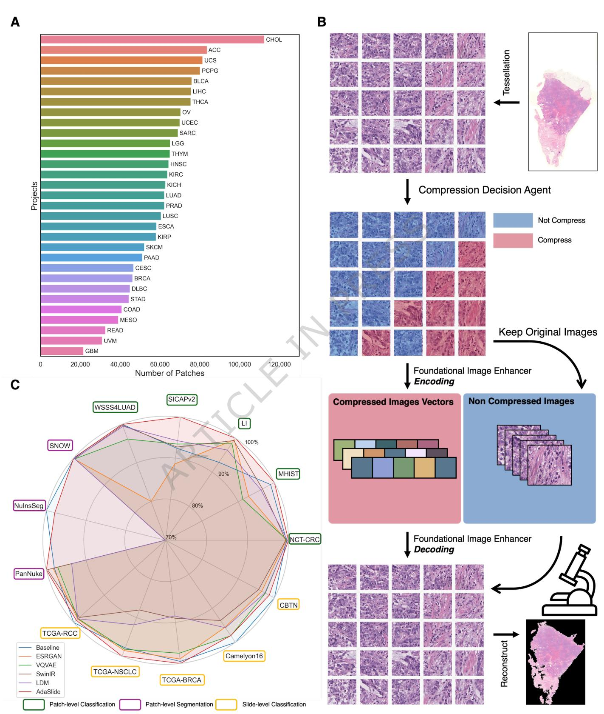

*Figure 1: Overview of AdaSlide. A, PanCancer patch distributions; B, CDA-driven patch keep/compress pipeline plus FIE encoding/decoding; C, 13-task performance overview.*

> 💡 **Figure 1 批读**: Figure 1B 是最重要的数据流图：WSI 先 tessellate 成 patch；CDA 给每个 patch 上色，蓝色 keep 原图，粉色 compress；compress 分支进入 FIE encoder/decoder，keep 分支绕过 FIE；最后二者合并重建 WSI。这个设计避免所有 patch 都被复原模型改写，因此高信息区域可以保持原始形态。

# Information Disequilibrium

Information disequilibrium arises from the giga-pixel scale of WSIs, where not all pixels contribute equally to clinical diagnosis. For instance, in identifying tumor regions within a WSI, areas densely packed with cells are more relevant than background, adipose tissue, or bone. Similarly, detecting lymphovascular invasion or perineural invasion requires focusing on specific tube-like structures, such as lymph nodes, vascular tubes, or perineural regions. This suggests that clinically important regions vary dynamically with diagnostic tasks and goals, rendering equal attention across all regions unnecessary.

For instance, MIL divides a WSI into multiple patch instances and applies attention mapping to selectively identify regions that significantly contribute to label prediction [? ? ? ]. Advanced MIL models incorporate locality and global patterns [? ? ], prioritize key instances [? ], or leverage clustering loss to effectively differentiate labelrelevant instances [? ]. This study defines this dynamic allocation of importance across regions as information disequilibrium. Specifically, Li et al. [? ] proposed an adaptive decompression method that leverages MIL-based attention maps to assign different decompression depths to image patches. While the paper does not explicitly define the concept of information disequilibrium, its strategy effectively leverages the inherent information imbalance across regions to prioritize the decompression of diagnostically relevant areas.

> 💡 **概念边界**: information disequilibrium 不是一个新的病理标签，而是一个压缩假设：同一张 WSI 内 patch 对不同诊断任务的边际价值不同。AdaSlide 后续用“cell-rich + hard-to-restore”近似高价值/高风险区域。

# Hypothesis of AdaSlide

Information disequilibrium is the cornerstone of this study because traditional uniform compression models fail to address it, leading to unavoidable information loss by compressing all regions equally. To design an information content aware compression framework that accounts for information disequilibrium, we propose the following hypotheses:

1. Tumor-related diagnosis is one of the primary tasks.   
2. Cellular information is clinically critical for tumor diagnosis.   
3. Certain patch instances are more challenging to reconstruct than others.

While tumor-related diagnosis is not the sole clinical priority, we focused on it due to our training data’s characteristics and the prominence of tumor-related research in CPath. Accordingly, we designed a CDA reward function tailored to tumor-related diagnosis. In this study, clinically informative regions are defined as tumor-related areas. However, AdaSlide is flexible and can redefine clinically informative regions by modifying the reward function.

To quantify regions contributing to tumor-related diagnosis, we utilized cellular information, recognizing that the morphological features and distribution of cells are crutial to tumor diagnosis. Furthermore, we incorporated the compression difficulty of cellular information to balance the information loss and compression performance. Guided by hypotheses (2) and (3), we constructed a 2x2 conditional matrix (Figure 2).

• Clinically informative and easy to restore (Zone A).   
• Clinically informative and hard to restore (Zone B).   
• Clinically uninformative and easy to restore (Zone C).   
$\bullet$ Clinically uninformative and hard to restore (Zone D).

In this hypothesis field, the CDA is designed to prioritize Zone $\mathbf { B }$ by maintaining its original information as much as possible, while employing compression strategies for the remaining zones. This is achieved through a combination of compression rewards and information penalties.

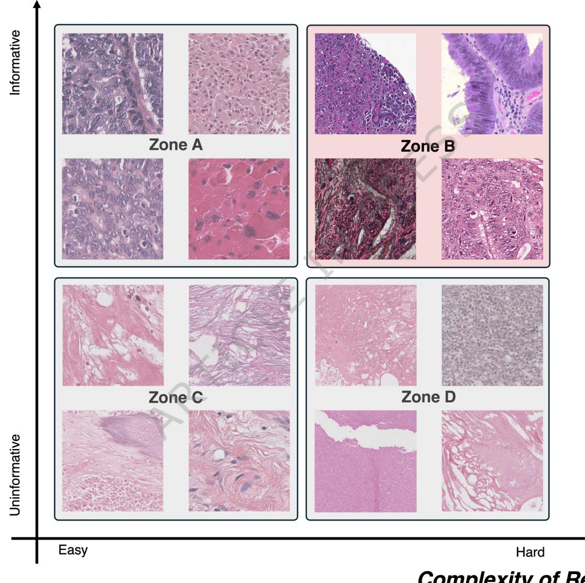

*Figure 2: Hypothesis field of AdaSlide. Zone B is clinically informative and hard to restore, so AdaSlide should preferentially keep it.*

> 💡 **Figure 2 批读**: 2x2 矩阵把 CDA 的目标说清楚：Zone C 最适合压缩，Zone B 最不该压缩，Zone A/D 需要 reward 权衡。本文没有直接训练“Zone 分类器”，而是通过 HoverNet mask Dice 把“压缩后是否损害细胞信息”转成 reward penalty。

# Datasets

The PanCancer dataset, derived from 31 projects from The Cancer Genome Atlas (TCGA) dataset, has 930 WSIs, with 30 WSIs extracted from each project. It also includes 1.8 million patch images extracted at 20x and 40x magnifications (Figure 1A). The PanCancer dataset was divided into training (94.5%), validation ( $5 \%$ ), and test (0.5%) sets, corresponding to 1,766,502, 93,307, and 9,393 patch images, respectively.

To further evaluate the FIEs’ reconstruction performance, we utilized datasets from the Clinical Proteomic Tumor Analysis Consortium (CPTAC). A total of 110 WSIs were selected, with 10 WSIs per project across 11 projects. Additionally, 29,861 patch images were extracted using the same patch generation pipeline and were used for performance evaluation. Details of the TCGA and CPTAC projects are summarized in Supplementary Note 2.

We evaluated the performance of AdaSlide on patch-level tasks (classification and segmentation) and slide-level tasks (classification) using 13 benchmark datasets, as summarized in Table 1. Detailed information, including preprocessing steps, is provided in the Methods section.

For the patch-level calssification tasks, we used five datasets: NCT-CRC (9 class; colon) [? ], MHIST (binary class; colon) [? ], LI (binary class; stomach) [? ], SICAPv2 (4 class; prostate) [? ], and WSSS4LUAD (binary class; lung) [? ] datasets.

For patch-level segmentation tasks, we used the SNOW (binary class; breast) [? ], NuInsSeg (binary class; various organs) [? ], and PanNuke (binary class; various organs) [? ] datasets. The NuInsSeg and PanNuke datasets include multiple classes; however, for simplicity, we converted the multi-class masks into binary masks. Moreover, the NuInsSeg dataset contains mouse-derived H&E images and mask pairs, which we excluded from the analysis.

For the slide-level classification, we used the TCGA-RCC, TCGA-NSCLC, TCGA-BRCA, Camelyon16, and Children’s Brain Tumor Network (CBTN) [? ] datasets for slide-level classification analysis. The TCGA-RCC dataset combines multiple renal cell carcinoma (RCC) projects: TCGA-KICH, TCGA-KIRC, and TCGA-KIRP. Similarly, the TCGA-NSCLC dataset integrates non-small cell lung cancer (NSCLC) subtypes, including TCGA-LUAD and TCGA-LUSC. The TCGA-BRCA dataset was used for binary subtype classification, while the Camelyon16 dataset was used for tumor vs. non-tumor slide classification tasks. Lastly, the CBTN dataset was used for pediatric brain tumor subtype classification, including two pediatric-specific brain tumor cancer types: medulloblastoma and ependymoma.

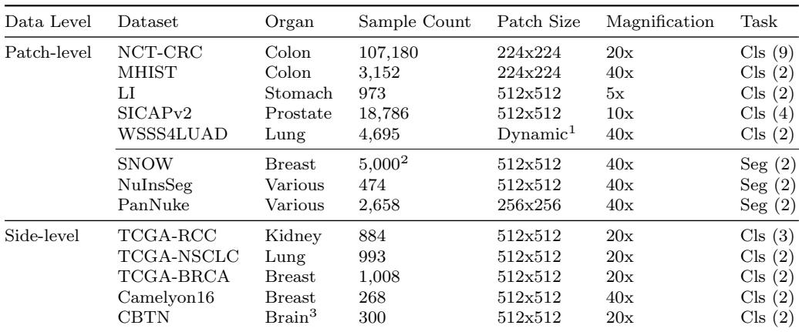

*Table 1: Summarization of downstream task datasets.*

> 💡 **Table 1 批读**: 13 个任务不是同质 benchmark：NCT-CRC/MHIST/LI/SICAPv2/WSSS4LUAD 是 patch classification，SNOW/NuInsSeg/PanNuke 是 patch segmentation，TCGA-RCC/NSCLC/BRCA/Camelyon16/CBTN 是 slide classification。这个组合让作者能观察 global pattern、local morphology、in-domain/OOD 对压缩策略的不同要求。

# Foundational Image Enhancer (FIE)

The image restoration performances of the FIEs are shown in Figure 3A, and sample output images are illustrated in Figure 3B and Supplementary Figure 2-3. We used the VAE [? ], VQVAE [? ], ESRGAN [? ], Swin Image Restoration (SwinIR) [? ], and Latent Diffusion Model (LDM) [? ] as FIE backbones, as these models have been widely adopted for digital pathology image compression tasks in previous studies[? ? ? ]. In addition, we included Transformer-based and diffusion-based models that have demonstrated strong performance in image restoration tasks, to provide a comprehensive comparison across different model families. Three evaluation metrics were used: Structural Similarity Index Measure (SSIM), Peak Signal-to-Noise Ratio (PSNR), and Learned Perceptual Image Patch Similarity (LPIPS) [? ].

The overall performance ranking was as follows: VQVAE, SwinIR, LDM, ESRGAN, and VAE. VQVAE demonstrated consistently strong reconstruction performance across both internal and external datasets. However, it occasionally produced artificial noise artifacts during reconstruction, as shown in Figure 3B. SwinIR and LDM exhibited excellent performance on the internal dataset; however, their performance substantially degraded on the external dataset, indicating potential limitations in generalizability. In contrast, ESRGAN exhibited lower internal performance compared to SwinIR and LDM, but its performance degradation on the external dataset was less pronounced.

Although AdaSlide is designed to be agnostic to the choice of FIE model, it is necessary to fix the FIE during CDA training. This is because the reward function explicitly incorporates the quality of the enhanced images reconstructed from lowresolution inputs. Based on these considerations, we selected the FIE backbone by evaluating two key factors: (1) compatibility with compression, and (2) efficiency in training and inference.

VAE achieved the highest compression ratio, but the resulting image degradation was so severe that the reconstructed images were difficult to interpret visually. Therefore, this model was excluded from the candidate list. VQVAE demonstrated excellent compression and reconstruction performance. However, although the feature dimension of VQVAE $( \mathbb { R } ^ { 1 2 8 \times 1 2 8 \times 2 } + \mathbb { R } ^ { 6 4 \times 6 4 \times 2 } )$ is theoretically smaller than that of the original image $\left( \mathbb { R } ^ { 5 1 2 \times 5 1 2 \times 3 } \right)$ , this only applies to the raw, uncompressed feature space. In practical applications, where image formats such as JPEG or PNG are used, the compressed features of VQVAE require larger storage space than imagebased formats. Therefore, to support real-world applications such as demo systems, we focused on models that enable compression to low-resolution image files and subsequent reconstruction. As a result, the candidate models were SwinIR, LDM, and ESRGAN.

While LDM and SwinIR demonstrated strong performance, both required substantial computational resources and long processing times for training and inference. In particular, LDM, due to the inherent characteristics of diffusion models, was especially time-consuming. This makes LDM and SwinIR less practical for processing WSIs, which typically contain thousands to tens of thousands of image patches, as they would demand excessive computing resources and time. In contrast, ESRGAN offers the advantages of lower computational demands and the ability to leverage larger batch sizes during training, making it a more practical choice.

Based on these considerations, ESRGAN was selected as the FIE backbone for CDA training and for demonstration experiments, as it provided a good balance between performance and efficiency. However, it is important to note that this does not imply that AdaSlide is dependent on a specific FIE. To further assess the feasibility of FIE, we conducted a reader study involving a Visual Turing Test (VTT) with five pathology experts. The VTT evaluated whether the FIE-generated images could be distinguished from real images, using the internal dataset. The VTT results are summarized in Supplementary Table 1. VQVAE was excluded from this analysis due to its characteristic artificial noise (Figure 3B), which made it visually easy to differentiate. The VTT results indicated that FIE-generated images were challenging to distinguish from real ones, demonstrating the practicality of FIE-based reconstruction $5 6 \% ; Z = 6$ , $\scriptstyle { p = n . s }$ .).

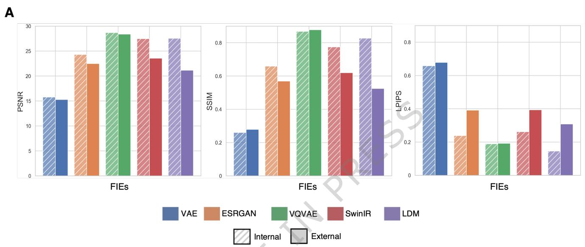

*Figure 3A: Quantitative results of enhanced images.*

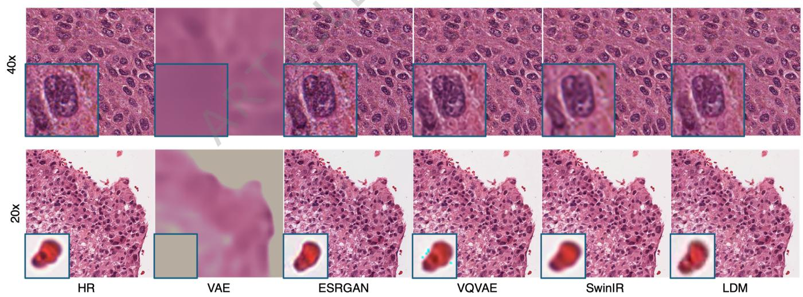

*Figure 3B: Example enhanced image outputs.*

> 💡 **Figure 3 批读**: VQVAE 指标强但会在白背景产生噪声，VAE CR 强但复原太糊，SwinIR/LDM 质量好但泛化或算力成本不利。ESRGAN 不是绝对最优，而是 AdaSlide 演示中“能处理大量 WSI patch、视觉上可接受、文件格式实用”的折中选择。

> 💡 **VTT 结果解读**: 5 位专家近 chance 的判断结果支持 FIE 复原图在视觉层面不容易被识别为假图。但这只证明 ESRGAN restored patch 的感知保真，不能单独证明所有下游任务安全；所以后面还必须看 13-task performance。

# Compression Decision Agent (CDA)

To determine the compression level of an image, we employ a reinforcement learningbased agent that assesses the information content, reconstruction difficulty, and importance of each image. A conceptual diagram of the CDA is shown in Figure 4A. We designed a reward function to compensate for the gain from compression and the loss of information (Equation 3). This simplifies training by removing the need for human-annotated data and enhances model stability by eliminating inter-observer variation. To discourage the shortcut where the agent tries to compress every ROI, the agent receives a penalty for the amount of significant information lost during restoration. We defined the penalty as a difference between the cell segmentation output of the original image and the restored image, using HoverNet [? ]. The concept of penalty based on HoverNet outputs is illustrated in Figure 4B.

To control the tendency of CDA, we include a $\lambda$ parameter. A higher $\lambda$ value strengthens the penalty term, making the agent more conservative and less likely to compress images. We used grid search to find the optimal combination of $\lambda$ and learning rate, observing that as $\lambda$ increases, the learning rate and CR decrease (Figure 4C). This indicates that a more conservative agent (higher $\lambda$ ) achieves a lower CR while likely preserving more image information.

To determine the backbone architecture for the CDA, we experimented with ResNet-18, ResNet-50, and Vision Transformer (ViT) models. Considering the alignment between the $\lambda$ parameter and CR, as well as the efficiency of each model, ResNet-18 was selected as the final backbone for the CDA. The results are summarized in Supplementary Table 2.

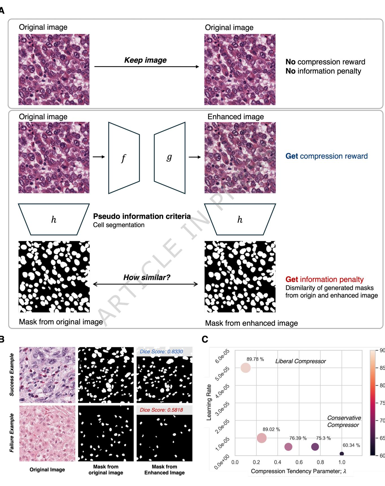

*Figure 4: Overview of the CDA. Keep gets no compression reward/penalty; Compress gets reward plus HoverNet-mask information penalty; lambda controls compression tendency.*

> 💡 **CDA 机制拆解**: CDA 的 action 是二元的：Keep 直接存原图，reward 为 0；Compress 会得到压缩收益，但如果 FIE 复原后 HoverNet mask 和原图 mask 不一致，就付出信息惩罚。这个 penalty 阻止 agent 学到“所有 patch 都压缩”的捷径。

> 💡 **lambda 控制杆**: lambda 不是后处理阈值，而是 reward 中的信息惩罚强度。高 lambda 会让同样的 Dice 损失更贵，CDA 更保守；低 lambda 更偏向压缩。Figure 4C 中 lambda 上升、CR 下降，是 reward 设计生效的主要证据。

# Evaluation of Information Disequilibrium

We quantitatively evaluate the core assumption of information disequilibrium in CDA, based on its actual inference results. Specifically, we assess whether CDA effectively recognizes information imbalance across image regions through two complementary analyses: (1) whether cell-dense regions are appropriately prioritized, and (2) whether reconstruction difficulty is properly accounted for during compression decisions. Those results are summarized in Table 2.

To examine the first aspect, we leveraged cell segmentation results to implicitly guide CDA toward recognizing the importance of cell-rich regions. To validate this behavior, we utilized the zero-shot inference capability of the PLIP pathology visionlanguage model [? ]. PLIP is a CLIP-based model trained on pathology image-caption pairs sourced from Twitter, and is designed to capture the semantic relationships between images and textual descriptions within the pathology domain. For this analysis, we employed the following two query prompts to evaluate the relative similarity of each image:

• A photo of densely packed with cells.   
• A photo of showing adipose tissue, stroma, or acellular background.

For each $\lambda$ condition and compression decision, we measured the similarity of images to the first prompt (“A photo of densely packed with cells.”) to assess whether CDA preferentially retained cell-rich regions. The findings indicate that in regions where compression was applied, the similarity to the cell-rich prompt was relatively lower, suggesting that CDA effectively depriorizes semantically less informative regions during compression.

The second analysis aimed to verify whether the penalty design in CDA appropriately discourages indiscriminate compression, by considering the difficulty of reconstructing compressed images. Specifically, we compared the pre- and postreconstruction SSIM scores between images where CDA selected compression versus those where it selected retention (keep). The results show that as $\lambda$ increases, images selected for compression exhibit higher SSIM scores compared to retained images. This trend suggests that CDA adapts its compression decisions to avoid high-penalty scenarios, demonstrating sensitivity to reconstruction difficulty and supporting the intended information-aware behavior.

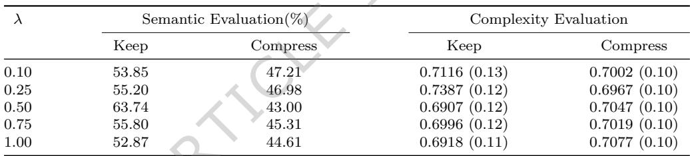

*Table 2: Joint evaluation of semantic relevance and enhancement complexity across compression levels.*

> 💡 **Table 2 批读**: Semantic Evaluation 中 Keep 的 cell-rich 相似度普遍高于 Compress，说明 CDA 倾向保留细胞密集区域。Complexity Evaluation 看的是原图 mask 与复原图 mask 的 SSIM/Dice 类似信号；高 lambda 下 Compress patch 的复原一致性更高，说明 agent 在学“只压缩比较容易复原的 patch”。

# Downstream Tasks

We assessed AdaSlide across 13 downstream tasks, encompassing patch-level classification, patch-level segmentation, and slide-level classification. Information loss was quantified as the reduction in performance compared to results achieved with highresolution image-based analysis. CR is a ratio of compression compare to original high-resolution images. Hence, a lower CR value indicates a smaller file size (i.e. higher compression). Except for the training dataset, where images were compressed and enhanced using FIEs, all other conditions remained consistent. This ensured that any performance gap between original image-based analysis and processed image-based analysis was solely due to image information degradation during the image processing stages.

AdaSlide includes several variants depending on the backbone models (ESRGAN, VQVAE, SwinIR, LDM) and the compression tendency parameter $\lambda$ (0.1, 0.25, 0.5, 0.75, 1.0). The average performance, best performance, and best CR of AdaSlide were reported in Figure 5, while the detailed performances are summarized in Supplementary Table 3-15. Since VAE’s performance was substantially lower, its results are omitted from Figure 5 for clarity.

Supplementary Table 3-7 summarize the patch-level classification results. Overall, the uniform compression models (VAE, ESRGAN, VQVAE, SwinIR, LDM) achieved the highest CR (smallest file sizes) but tended to degrade performance more than AdaSlide. Specifically, VAE exhibited a severe performance drop in every dataset (e.g., MHIST AUROC: 0.5552 vs. baseline 0.8437; LI AUROC: 0.5696 vs. baseline 0.8321), presumably due to the blurred reconstructions (Figures 3B and Supplementary Figure 2).

In contrast, AdaSlide outperformed the baseline on NCT-CRC, MHIST, LI, and SICAPv2, although it slightly underperformed in WSSS4LUAD. For instance, on NCT-CRC, VQVAE-based AdaSlide with a $\lambda$ parameter of 0.5 (AdaSlide0.5VQVAE) achieved the highest AUROC of 0.9943 (vs. baseline 0.9895). On MHIST, AdaSlide0.5ESRGAN reached an AUROC of 0.8509, outperforming the baseline 0.8437.

The optimal $\lambda$ and backbone model varied across datasets, indicating that compression preferences are dataset-specific.

Supplementary Table 8-10 presents the segmentation results (Examples images are in Supplementary Figure 3). In contrast to classification tasks, segmentation requires high pixel-level fidelity for accurate mask delineation. As anticipated, VAE reconstructions often appeared too blurry, causing significant performance deterioration. Notably, in the NuInsSeg dataset, uniform compression models (VAE, ESRGAN, VQVAE without adaptive compressions) showed near-zero Dice scores, underscoring their difficulty in preserving crucial details.

Meanwhile, AdaSlide substantially mitigated information loss. For exampNuInsSeg dataset, AdaSlide1.00SwinIR achieved a Dice score of 0.7068, with only a $2 . 1 2 \%$ drop from the baseline (0.7221). Conversely, in the same dataset, uniform compression models showed severly decreased performances (Dice: 0.0000). Interestingly, AdaSlide outperformed the baseline on certain datasets, including SNOW and PanNuke. For instance, on SNOW, AdaSlide0.25LDM achieved a Dice of 0.9434, higher than the baseline (0.9334). Similarly, on PanNuke, AdaSlide0.50VQVAE attained a Dice of 0.7304 (vs. baseline 0.7158).

For slide-level analysis, we employed the CLAM framework [? ], a widely used MIL method. As summarized in Supplementary Tables 11-15, AdaSlide slightly underperformed compared to the baseline in TCGA-RCC, Camelyon16, and CBTN but outperformed it in TCGA-NSCLC and TCGA-BRCA. For instance, in Camelyon16, AdaSlide ranked third (AUROC = 0.8676), slightly below the uniform compression VQVAE model (AUROC = 0.8679), and both were lower than the baseline (0.8852). Conversely, in TCGA-NSCLC, AdaSlide1.00SwinIR achieved an AUROC of 0.8970, outperforming the baseline 0.8774.

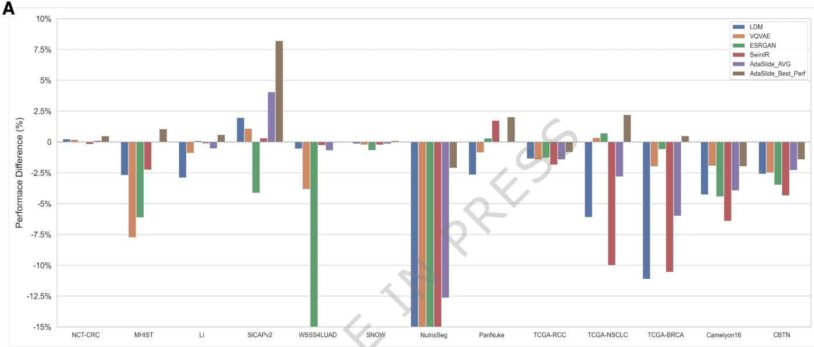

*Figure 5A: Performance difference from baseline across 13 downstream tasks.*

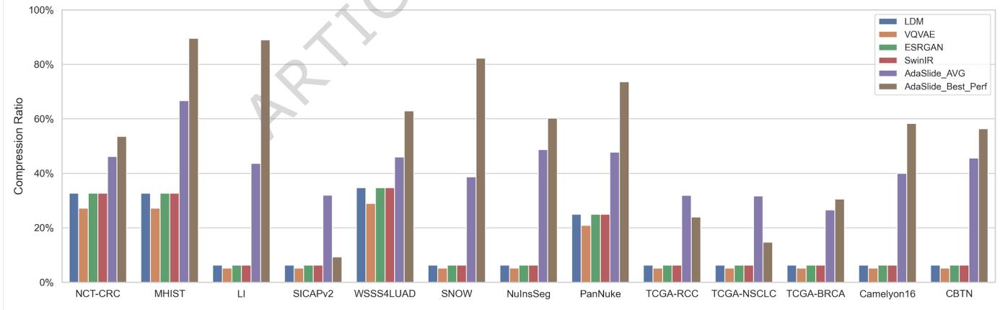

*Figure 5B: Compression ratio summary across downstream tasks and models.*

> 💡 **Figure 5 批读**: Figure 5A 证明 AdaSlide 的主张不是“所有任务都提升”，而是“比 uniform compression 更少破坏性能”。Figure 5B 则展示代价：AdaSlide 平均 CR 通常高于纯 uniform FIE 压缩，因为它保留了一部分高风险 patch。这个 trade-off 正是 AdaSlide 的目标。

> 💡 **13-task 证据链**: patch classification 更能容忍 global pattern 级别的信息损失；segmentation 对 nucleus boundary/local texture 更敏感，所以 NuInsSeg 的 near-zero uniform Dice 是最有力的失败案例。AdaSlide 在这些任务上的优势来自“别让难复原、细胞信息重的 patch 进压缩分支”。

AdaSlide’s performance, information loss, optimal $\lambda$ parameter, and FIE type vary based on the characteristics of the downstream datasets. This section reviews AdaSlide’s performance from the following perspectives: (1) regularization effects, (2) global and local patterns, (3) in-domain and out-of-domain datasets, and (4) dataset difficulty.

(1) Regularization Effects. A noteworthy observation across most datasets was that applying AdaSlide frequently improved performance compared to the baseline. As performance degradation relative to the baseline was defined as information loss, this improvement can be considered an information benefit. We hypothesize that this improvement stems from a regularization effect. Unlike uniform compression models, AdaSlide determines whether to pass an image through the FIE or use the original based on CDA’s decision. The FIE processes images only when the CDA predicts that it will not significantly degrade quality or affect performance. This selective approach likely enhances performance by reducing noise and normalizing colors in images, resulting in better outcomes for downstream tasks.

Key regions of high importance, where the FIE could potentially harm image quality, are left uncompressed by the CDA. This rationale explains why AdaSlide outperformed uniform compression models in most datasets, with the exception of Camelyon16. However, not all datasets exhibited positive effects, with some experiencing information loss, highlighting the limitations of the regularization hypothesis.

> 💡 **regularization 解读**: AdaSlide 有时超过 baseline，不一定表示压缩“增加了医学信息”，更可能是 FIE 对低风险 patch 做了颜色/噪声归一化。CDA 的作用是只让适合被 FIE 处理的 patch 进入这个“正则化”路径。

(2) Global and Local Patterns. The VAE model’s performance is constrained by its severe output blurriness. Nevertheless, this limitation offers insights into whether specific tasks rely more on global patterns or local details. Tasks that achieve acceptable performance despite blurry outputs suggest that while detailed information adds value, the primary directionality remains discernible.

For example, datasets such as NCT-CRC (patch-level classification) and slidelevel classification datasets predominantly rely on global patterns, whereas datasets like NuInsSeg and other segmentation tasks depend heavily on local patterns. Tasks involving cell boundary segmentation or tumor infiltration detection rely heavily on fine-grained details (local patterns), while tasks focused on overall distribution and coloration (e.g., NCT-CRC) can be adequately performed using global patterns.

In tasks primarily driven by global patterns, even uniform compression models delivered satisfactory results. Conversely, for tasks dependent on local patterns, AdaSlide outperformed uniform compression models, effectively addressing information disequilibrium.

> 💡 **任务敏感性**: 这一段给 lambda/backbone 选择提供直觉：宏观颜色和组织分布任务可以更激进压缩；核边界、浸润、细胞级分割任务需要保守压缩。

(3) In-domain and Out-of-domain Problem. Out-of-domain (OOD) challenges in AdaSlide arise from two primary sources of risk: (1) the image reconstruction performance of the FIE, and (2) the compression decision accuracy of the CDA. Since image reconstruction directly affects the amount of retained information, an FIE trained on in-domain data may fail to accurately reconstruct images from out-of-domain distributions, potentially introducing artifacts or blur. In parallel, the CDA, trained on cell information and image reconstruction difficulty, may misclassify important regions or overestimate reconstruction difficulty on unfamiliar data, resulting in information loss.

Among the 13 downstream tasks evaluated, AdaSlide exhibited notable performance degradation on three datasets: NuInsSeg, CBTN, and Camelyon16. These issues can be interpreted as follows: NuInsSeg represents a dataset shift in image brightness; CBTN introduces a domain shift to pediatric pathology; and Camelyon16 introduces a domain shift via lymph node sections, which differ from the tissue sections used in TCGA.

For NuInsSeg, performance degradation is primarily attributable to the FIE, as all FIE-based segmentation models failed (Dice score near zero), and the LDM-based model failed to generate adequate cell structures (Supplementary Figure 3). This indicates that segmentation performance is highly dependent on the fidelity of the original high-resolution information—that is, on the compression ratio.

For CBTN, although performance degradation was less severe than for NuInsSeg, applying FIE alone resulted in noticeable performance drops. This is likely due to the pediatric-specific disease distribution, which diverges from the training domain of the FIE. However, when AdaSlide was applied, performance improved relative to using FIE alone, suggesting that the CDA mitigated some of the domain-induced reconstruction errors, and that the primary issue lay with the FIE.

Camelyon16 exhibited a distinct pattern: it was the only case where FIE alone outperformed the full AdaSlide pipeline. Specifically, VQVAE—previously shown to generalize robustly—performed well, but adding CDA reduced performance. The CDA likely failed to operate effectively in this setting, as evidenced by the elevated CR and performance drop. Camelyon16 lymph node sections contain substantially higher cell densities than typical TCGA tissue sections. The CDA, trained to prioritize regions with high cell content, likely responded too aggressively in this context.

Despite these challenges, AdaSlide, composed of both FIE and CDA, outperformed FIE alone in most cases, suggesting that the CDA can compensate for FIE-induced information loss. Nevertheless, since both modules carry inherent OOD risks, careful experimental design and additional robustness strategies will be important considerations for future applications.

> 💡 **OOD 风险定位**: AdaSlide 有两个失败点：FIE 可能复原错，CDA 可能判断错。Camelyon16 尤其有启发，因为 lymph node 高细胞密度让 CDA 的“cell-rich = keep/high-risk”代理可能过度触发，说明信息代理需要按应用域校准。

(4) Dataset Difficulty. The difficulty of each task played a significant role in determining the optimal $\lambda$ parameter. For most datasets, $\lambda ~ = ~ 0 . 5 0$ produced the best results. For example, in patch-level segmentation tasks, dataset difficulty ranked as SNOW $>$ PanNuke $>$ NuInsSeg. This ranking considered both VAE performance and dataset characteristics, such as noise levels, with SNOW being a synthetic dataset with minimal noise. The optimal $\lambda$ values were 0.25 for SNOW, 0.50 for PanNuke, and 1.00 for NuInsSeg. Higher $\lambda$ values were more appropriate for out-of-domain datasets where the FIE struggled to reconstruct images accurately.

Slide-level classification showed relatively smaller performance differences compared to patch-level classification when selecting FIE and $\lambda$ values. This was likely due to the reduced influence of individual patch instances in slide-level tasks, where classification relies more on shared global patterns. Although restoring fine-grained patterns remains important, the preservation of macroscopic patterns had a greater impact on slide-level classification. As a result, mid-range λ values typically achieved the best performance across most datasets, except for the CBTN dataset.

# Best Practice for Selecting the Optimal $\pmb { \lambda }$ Parameter

AdaSlide is not explicitly trained for any particular downstream task. Instead, its compression behavior is implicitly controlled through the choice of the $\lambda$ parameter. Selecting an appropriate $\lambda$ value is therefore important to balance compression efficiency and downstream task performance. Our experiments show that no single $\lambda$ value performs optimally across all datasets and tasks. The optimal choice depends on several factors, including the target task’s sensitivity to fine-grained details, the relative importance of preserving subtle information, and the potential benefits of noise reduction introduced by the FIE. Because of this variability, the most reliable strategy is to conduct small-scale validation experiments that reflect the characteristics of the target task, as demonstrated in our downstream evaluations. Such experiments provide empirical guidance on selecting the $\lambda$ value that best suits the intended application.

When performing dedicated validation is not feasible, either due to a lack of labeled data or limited computational resources, a practical heuristic can be used. In our experiments, we observed that $\lambda = 0 . 5 0$ generally provided a good balance between information preservation and compression across a wide range of datasets. Therefore, $\lambda = 0 . 5 0$ can be recommended as a reasonable default choice for general applications. For use cases where preserving fine-grained information is particularly important, such as tasks that are highly sensitive to local image patterns or applications where domain shift is expected between training and deployment data (for example, between TCGA and external cohorts), a more conservative setting such as $\lambda = 1 . 0 0$ is advisable. This choice reduces the risk of losing important information due to excessive compression. On the other hand, if storage efficiency is the primary concern and some level of information loss is acceptable, smaller $\lambda$ values can be explored to maximize compression. More details can be found in Supplementary Note 4, and Supplementary Figure 4.

> 💡 **lambda 选择实践**: 本文给出的默认策略很务实：有标签就做小规模 validation；没有标签时 lambda=0.5 起步；如果是细粒度分割或 OOD 部署，lambda=1.0 更稳；如果只为归档成本且容忍损失，再试更小 lambda。

# Application Example of AdaSlide

To evaluate compression performance at the WSI level, we implemented a real-world application of AdaSlide pipelines and validated both compression and enhancement. We selected one samples from TCGA-BRCA, TCGA-KIRC, and Camelyon16 dataset, respectively. The compression results are depicted in Figure 6, and Supplementary Figure 5-6.

Tumor regions exhibited a higher tendency for the Keep action, and the AUROC for distinguishing tumor versus non-tumor regions based on CDA action probabilities was 0.6288, indicating performance above chance level (Figure 6B). The table in Figure 6D summarizes the effective compression performance when storing the compressed images. While JPEG format achieved the smallest storage footprint due to its inherent lossy compression, we observed notable image quality degradation during ESRGAN-based reconstruction, rendering it suboptimal for practical use (Supplementary Figure 7). Conversely, PNG format provided the best reconstruction quality owing to its lossless nature, but resulted in substantially larger storage requirements. To balance these trade-offs, we adopted a hybrid strategy wherein high-resolution (keep) images were stored as JPEG to minimize storage demands, while compressed (compress) images were stored as PNG to preserve reconstruction quality. This approach provided an effective balance between storage efficiency and image fidelity.

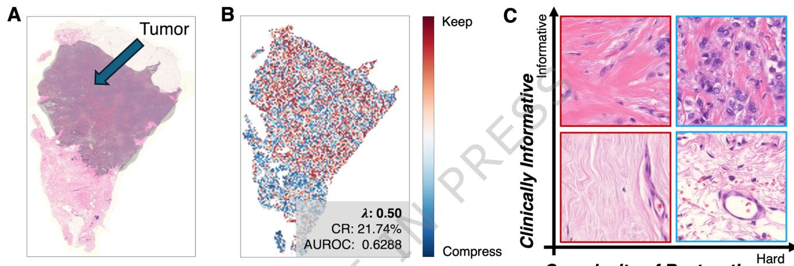

*Figure 6: WSI-level AdaSlide application example. The extracted image shows tumor/decision map and information/complexity examples.*

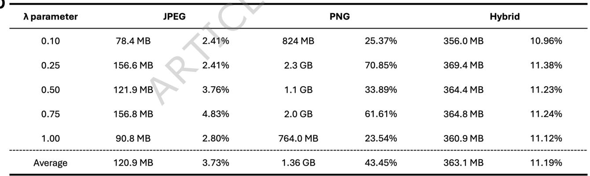

*Figure 6D Table: WSI application storage comparison for JPEG, PNG, and hybrid strategies.*

> 💡 **WSI 应用批读**: Figure 6B 的 AUROC 0.6288 说明 CDA action probability 对 tumor/non-tumor 有弱但高于随机的区分能力；这不是诊断器，而是证明压缩决策与病理信息有相关性。Figure 6D 的 hybrid 平均 11.19% 说明真实文件格式会影响存储结论：JPEG 最小但复原差，PNG 质量好但大，hybrid 才是工程上更平衡的 demo。

## Section 总结

| 模块/实验 | 关键结论 |
|---|---|
| Information disequilibrium | WSI patch 临床信息量和复原难度不均衡 |
| FIE | ESRGAN 是演示用工程折中，VTT 约 56% 支持视觉保真 |
| CDA | HoverNet mask 差异作为信息惩罚，lambda 控制保守程度 |
| Table 2 | CDA 保留更 cell-rich、压缩更易复原 patch |
| 13 tasks | AdaSlide 通常比 uniform compression 更少损害下游性能 |
| lambda best practice | 0.5 默认，OOD/细粒度任务用 1.0 更保守 |
| WSI demo | hybrid JPEG/PNG 存储约 11.19%，但文件格式仍是实用挑战 |
