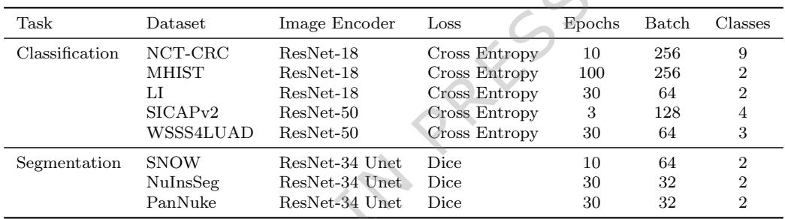

[← 返回 README](../README.md)

# 05 - Appendix

## 预览

本节收纳正文后的 data/code availability、作者声明、表格和图注。主要用途是复查数据来源、代码入口、利益冲突，以及 MinerU 提取出的图表图片。

# Data availability

This study used publicly accessible WSI datasets. TCGA data (including TCGA-RCC, TCGA-NSCLC, TCGA-BRCA) can be accessed via the NIH Genomic Data Commons (https://portal.gdc.cancer.gov). CPTAC datasets are available through The Cancer Imaging Archive (https://www.cancerimagingarchive.net/). Additional publicly available datasets used in this work include Camelyon16 (https://camelyon16.grand-challenge.org/), NCT-CRC (https://zenodo.org/record/ 1214456), MHIST (https://bmirds.github.io/MHIST/), LI (https://zenodo.org/ records/10020633), SICAPv2 (https://data.mendeley.com/datasets/9xxm58dvs3/1), WSSS4LUAD (https://wsss4luad.grand-challenge.org/), SNOW (https://zenodo.org/ records/6633721), NuInsSeg (https://www.kaggle.com/datasets/ipateam/nuinsseg), and PanNuke (https://warwick.ac.uk/fac/cross fac/tia/data/pannuke). The CBTN dataset is available under controlled access and can be requested from the Children’s Brain Tumor Network (https://cbtn.org/). Source data are provided in this paper.

> 💡 **数据可用性批读**: AdaSlide 的训练/评估核心依赖公开 WSI 或 patch 数据，但 CBTN 是 controlled access。复现实验时还要注意 TCGA/CPTAC 下载、WSI patch tessellation 和公开 benchmark split 的一致性。

# Code availability

A demo version of the AdaSlide code, including example usage, is available for academic research through GitHub (https://github.com/PathfinderLab/AdaSlide demo) and Zenodo (https://doi.org/10.5281/zenodo.17445388), and the corresponding demo outputs can be accessed at https://zenodo.org/records/15665900. The full AdaSlide training and evaluation code is provided at https://github. com/PathfinderLab/AdaSlide and also archived in Zenodo (https://doi.org/10. 5281/zenodo.17445388). The trained FIE and CDA model weights are available via Zenodo (https://zenodo.org/record/11069591). Additional publicly available resources used in this study include HoverNet (https://github.com/vqdang/ hover net), ESRGAN (https://github.com/XPixelGroup/BasicSR), VQVAE (https: //github.com/rosinality/vq-vae-2-pytorch), KAIR (https://github.com/cszn/KAIR), LDM (https://github.com/CompVis/latent-diffusion), and CLAM (https://github. com/mahmoodlab/CLAM).

> 💡 **代码入口批读**: 论文区分 demo code、full training/evaluation code、trained weights。复现 AdaSlide 时需要同时检查 FIE/CDA 权重、HoverNet、BasicSR/ESRGAN、KAIR/SwinIR、LDM 和 CLAM 版本。

# References

# Acknowledgements

This research was supported by the Korea Health Technology R&D Project through the Korea Health Industry Development Institute (KHIDI), funded by the Ministry of Health and Welfare, Republic of Korea (grant number RS-2021-KH113146; S.J., S.H.L.). It was also supported by the National Research Foundation of Korea (NRF) grant funded by the Korean government (MSIT) (grant number RS-2025-02215813; S.J.), as well as the Digital-Bio AI $^ +$ X Global Innovative Talent Nurturing Project with Hands-on Experience of the NRF, funded by the Korean government (MSIT) (grant number RS-2024-00441029; S.J.). Additional support was provided by the High-Performance Computing Support Project, funded by the Government of the Republic of Korea (Ministry of Science and ICT) (grant number RQT-25-090105; S.J.).

# Author Contributions

J.L. and L.T. carried out the experiments. J.L. wrote the manuscript with support from L.T., D.M.B., D.O., D.K., W.J.. S.A., and S.H.L. conceived the original idea. D.O., D.K., S.A., and S.H.L. supervised the project.

# Competing Interests

The authors declare a related patent application covering the methodological aspects of this work (Applicants: Korea University and The Catholic University of Korea Industry–Academic Cooperation Foundations; Inventors: Sangjeong Ahn, Seong Hak Lee, and Jonghyun Lee; PCT/KR2025/007948; filed and pending). The remaining authors declare no competing interests.

> 💡 **利益冲突批读**: AdaSlide 方法本身有 pending patent。读应用/部署价值时需要把学术复现、开源代码和潜在专利边界分开看。

# Tables

Table 1 Summarization of downstream task datasets.   


*Table 1: Summarization of downstream task datasets.*

> 💡 **Table 1 批读**: 13 个任务覆盖 patch-level 与 slide-level，分类与分割，多个器官和倍率。它是 AdaSlide “task-agnostic” claim 的实验基础。

Cls: classification; Seg: segmentation; The number in the bracket indicates the number of classes. 1The width and height range from 150 to 300, with an average size of 220×222. 2The original SNOW dataset has 20k images. We sampled 5k images. 3Pediatric tissue samples.

Table 2 Joint evaluation of semantic relevance and enhancement complexity across compression levels.   


*Table 2: Joint evaluation of semantic relevance and enhancement complexity across compression levels.*

> 💡 **Table 2 批读**: Keep patch 的 cell-rich prompt 相似度高于 Compress patch，是 CDA 识别信息不均衡的直接证据；Compress patch 在高 lambda 下更易复原，说明 penalty 影响了决策边界。

Semantic preference ratio indicate relative similarity to the first prompt (“A photo of densely packed with cells.”). Complexity scores represent SSIM computed between HR-based cell segmentation masks and segmentation masks obtained from enhanced images (mean (SD)).

Table 3 Training configurations for patch-level tasks. Each dataset was paired with a specific image encoder, loss function, and trained with specified epochs and batch sizes.   



*Table 3: Training configurations for patch-level tasks.*

> 💡 **Table 3 批读**: patch classification 和 segmentation 的训练配置不同，尤其 segmentation 使用更多 augmentation。读下游结果时要注意性能差异不只来自压缩，还和任务训练难度、样本数、encoder 有关。

# Figure Legends/Captions

Fig. 1 Overview of AdaSlide. A, Patch distributions of the PanCancer dataset used to train AdaSlide. Using 930 WSIs from 31 TCGA projects, we extracted $4 0 \mathrm { x }$ and $2 0 \mathrm { x }$ magnification patch images (each magnification has equal proportions). B, AdaSlide pipeline. A WSI is tessellated into multiple patch images, and the compression ratios are decided using the CDA. Patch images selected for compression undergo encoding and decoding steps using the FIE. Finally, the patch images excluded from compression, along with the enhanced images, were collected and reconstructed for further analysis. C, Overall performance of AdaSlide on 13 datasets. The baseline indicates the conventional supervised learning using original images. The degraded performance implies information loss during compression and enhancement. AdaSlide showed comparable performance to the baseline, whereas the other compression models (ESRGAN, VQVAE, SwinIR, LDM) did not. WSI, whole-slide image; TCGA, The Cancer Genome Atlas; CDA, Compression Decision Agent; FIE, Foundational Image Enhancer.


Fig. 2 Example of Hypothesis Field of AdaSlide. AdaSlide is trained to preserve Zone B (clinically informative and hard to restore) while compressing other zones, including Zones A, C, and D.


Fig. 3 Overview of FIEs. A, Quantitative results of enhanced images. The VAEs show lower performance in every metric; conversely, VQVAEs outperform all methods. ESRGAN shows comparable performance to VQVAE. B, Example enhanced image outputs. The outputs of VAEs are notably blurry; conversely, the outputs of ESRGAN, VQVAE, SwinIR, and LDMs are clear. However, the VQVAEs exhibit unexpected noise patterns during reconstruction of white background areas. Exact numerical values and statistics are provided in the Source Data file. FIE, Foundational Image Enhancer.


Fig. 4 Overview of the CDA. A, Two possible outcomes depending on the CDA’s binary decision. When the action is Keep $[ a = 0 ^ { \cdot }$ ), the original image patch is stored directly, yielding zero reward. When the action is Compress $\mathbf { \Phi } _ { a } = \mathbf { \Phi } _ { 1 } \mathbf { \Phi } _ { , }$ ), the patch is encoded $( f )$ and decoded $( g )$ , and the CDA receives a positive compression reward while incurring an information penalty proportional to the dissimilarity between the original and reconstructed segmentation masks $\langle S _ { \mathrm { i n f o } } = 1 - S _ { \mathrm { D i c e } } \rangle$ ). B, Representative examples of successful and failed compression decisions, illustrating mask similarity and reconstruction fidelity. $\mathbf { C }$ , Relationship between the hyperparameter $\lambda$ and the CR. Increasing $\lambda$ strengthens the information-preservation term, resulting in a lower CR and a negative association between $\lambda$ and compression tendency. Exact numerical values and statistics are provided in the Source Data file. CDA, Compression Decision Agent; CR, compression ratio; $S _ { \mathrm { D i c e } }$ , Dice score.


Fig. 5 Overview of various downstream tasks. AdaSlide is presented in three parts; average, best performance, and best CR, respectively. A, Performance difference from baseline across downstream tasks. The baseline represents performance using uncompressed images. AUROC scores were used for classification tasks (green and yellow border), and Dice scores for segmentation tasks (purple border). Positive values indicate improved performance compared to the baseline, while negative values indicate degradation. Detailed information is presented in Supplementary Table 3-15. B, Summary of CR. The baseline has a $1 0 0 \%$ CR; whereas, the other models have lower CRs than the baselines. AdaSlide achieves a balance between high CR and maintaining task performance, compared to ESRGAN and VQVAE. Exact numerical values and statistics are provided in the Source Data file. CR, compression ratio; AUROC, area under the receiver operating characteristic curve.


> 💡 **图注批读**: MinerU 将 Figure 6 图像和表格提取在图注块之后，但正文 Application Example 已引用它们；这里保留为 appendix 索引，Results 中也已按引用位置放入。

## BibTeX

```bibtex
@article{lee2026adaslide,
  title = {Adaptive compression framework for giga-pixel whole slide images},
  author = {Lee, Jonghyun and Takemaru, Lina and Bappy, D. M. and Jeong, Ye Sul and Jeong, Won-Ki and Oldridge, Derek and Kim, Dokyoon and Ahn, Sangjeong and Lee, Sung Hak},
  journal = {Nature Communications},
  year = {2026},
  url = {https://www.nature.com/articles/s41467-025-66889-0}
}
```

## Section 总结

| 附录项 | 阅读价值 |
|---|---|
| Data availability | 复查公开数据源和 controlled access |
| Code availability | 查 demo/full code/weights 与依赖项目 |
| Competing interests | 方法相关 pending patent |
| Tables | 任务覆盖、CDA 信息检验、训练配置 |
| Figure captions | 快速回看图 1-6 证据链 |
