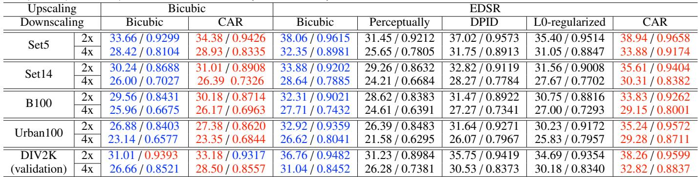
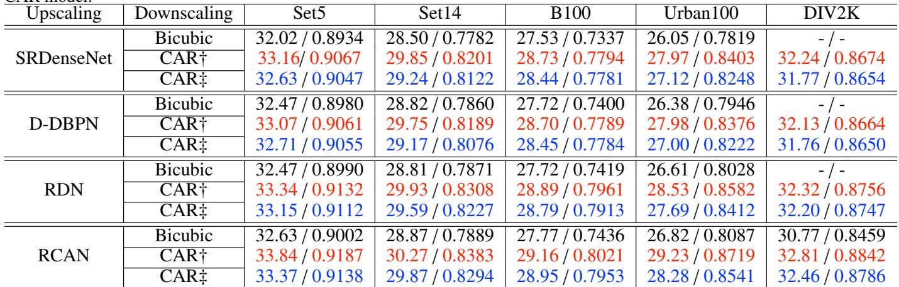
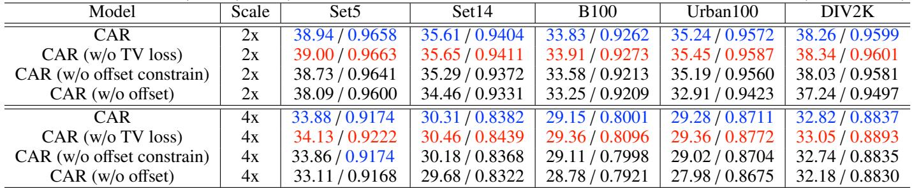
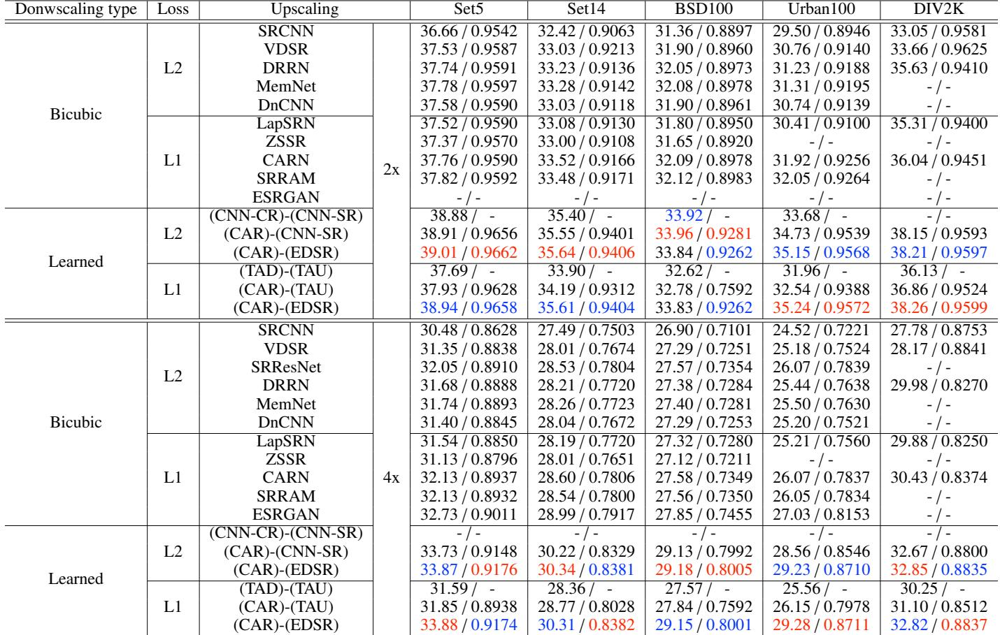
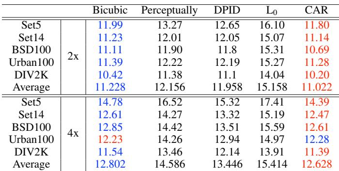

[← 返回 README](../README.md)

# 4 Experiments

## 📌 预览
Experiments 从 PSNR/SSIM、跨 SR 网络泛化、消融、频谱/bpp、用户研究五个角度验证：CAR 的 LR 更适合 SR，且压缩性和直接视觉质量接近 bicubic，但存在 LR 视觉质量与 SR gain 的取舍。

---

# 4 Experiments

> 💡 **实验证据链**: 实验分四层：主结果证明 CAR-LR 更适合 SR；消融证明 offsets/offset 正则有效；频谱与 bpp 证明 LR 不只是作弊纹理；用户研究说明 CAR 的 SR 图像更受偏好，但 LR 本身不如专门感知增强方法讨喜。

# 4.1 Experimental setup

# 4.1.1 Datasets and metrics

> 💡 **数据与指标设置**: 训练只用 DIV2K HR 图像，不需要配对 LR。测试采用 SR 标准数据集 Set5/Set14/BSD100/Urban100，并在 YCbCr 的 Y 通道算 PSNR/SSIM，这让结果可和 EDSR 及传统 SR 论文直接比较。

For training the proposed content adaptive image downscaling resampler generation network under the guidance of EDSR, we employed the widely used DIV2K [46] image dataset. There are 1000 high-quality images in the DIV2K dataset, where 800 images for training, 100 images for validation and the other 100 images for testing. In the testing, four standard datasets, i.e., the Set5 [47], Set14 [48], BSD100 [49] and Urban100 [50] were used as suggested by the EDSR paper [33]. Since we focus on how to downscale images without any supervision, only HR images of the mentioned datasets were utilized. Following the setting in [33], we evaluated the peak noise-signal ratio (PSNR) and SSIM [16] on the Y channel of images represented in the YCbCr (Y, Cb, Cr) color space.

# 4.1.2 Implementation details

> 💡 **复现参数抓手**: ResamplerNet 的主体是 5 个 128-channel residual blocks，kernel/offset 分支用 256-channel Conv-LeakyReLU，再经 sub-pixel convolution 输出每个 LR 位置的采样参数。EDSR 配置为 32 residual blocks、256 features，是强 teacher。

Regarding the implementation of the ResamplerNet, we first subtracted the mean RGB value of the DIV2K training set. During the downsampling process, we gradually increased the channels of the output feature map from 3 to 128 using $3 \times 3$ convolution operation followed by the LeakyReLU activation. 5 residual blocks with each having features of 128 channels are used to model the context. For the two branches estimating the resampling kernels and offsets, we used the same architecture which is composed of ‘Conv-LeakyReLU’ pairs with 256 feature channels. A sub-pixel convolution was applied to upscale and transform the input feature maps into resampling kernels and offsets. For the configuration of the EDSR, we adopted the one with 32 residual blocks and 256 features for each convolution in the residual block.

One of the important hyper-parameters must be determined is the resampling kernel size and the unit offset length. We defined a $3 \times 3$ kernel size on the downscaled image space. Its actual size on the HR image space is $( 3 \times s ) \times ( 3 \times s )$ , where $s$ is the downscaling factor. The unit offset length was defined as one pixel on the downscaled image space whose corresponding unit length on the HR image space is $s$ . For the offset distance weight regulator in Equation 9, we empirically set it to be 1.

The entire framework was trained on the DIV2K training set using the Adam optimizer [51] with $\beta _ { 1 } = 0 . 9$ , $\beta _ { 2 } = 0 . 9 9 9$ and $\epsilon = \overline { { 1 0 ^ { - 6 } } }$ β . β .. We set the mini-batch size as 16, and randomly crop the input HR image into $1 9 2 \times 1 9 2$ (for $4 \times$ downscale and SR) and $9 6 \times 9 6$ (for $2 \times$ downscale and SR) patches. Training samples were augmented by applying random horizontal and vertical flip. During training, we conducted validation using 10 images from the DIV2K validation set to select the trained model parameters, and the PSNR on validation was performed on full RGB channels [33]. The initial learning rate was $1 0 ^ { - 4 }$ and decreased when the validation performance does not increase within 100 epoch.

# 4.2 Evaluation of downscaling methods for SR

> 💡 **对照组设计**: 对比对象覆盖固定下采样 Bicubic 和三类感知/细节增强下采样。关键公平点是：每种 LR 都重新训练 SR 模型，而不是拿一个只适配 bicubic 的 SRNet 直接测试。

This section reports the quantitative and qualitative performance of different image downscaling methods for SR. Then results of ablation studies of the proposed CAR model is presented. We compared the CAR model with four image downscaling methods, i.e., the bicubic downscaling (Bicubic), and other three stateof-the-art image downscaling methods: perceptually optimized image downscaling (Perceptually) [15], detail-preserving image downscaling (DPID) [17], and L0-regularized image downscaling (L0-regularized) [19]. We trained SR models using LR images downscaled by those four downscaling algorithms and LR images downscaled by the proposed CAR model. The DPID requires to manually tune a hyper-parameter, which is content variant, to produce better perceptually favorable results. However, it is unpractical for us to generate large amount LR images by manually tuning, also different people may have different perceptual preference. Thus, default value provided by the source code was adopted.

# 4.2.1 Quantitative and qualitative analysis

Table 1 summarizes the quantitative comparison results of different image downscaling methods for SR. It consists of two parts, one for bicubic upscaling and one for upscaling using the EDSR. We first analyze the SR performance using the EDSR. As shown in Table 1 (Upscaling EDSR), the proposed CAR model trained under the guidance of EDSR considerably boosts the PSNR metric over all the testing cases, and a noticeable gain on the SSIM metric is also obtained. The significant performance gain is benefited from the joint training of the CAR image downscaling model and the EDSR in the end-to-end manner, where the goal of maximizing SR performance encourages the CAR to estimate better resamplers that produce the most suitable downscaled image for SR.

When compared to the SR performance of the LR images downscaled by the bicubic interpolation, the three state-of-the-art image downscaling algorithms can hardly achieve satisfying results, although the visual quality superiority of the downscaled images is reported by those original work. This is because those image downscaling methods are designed for better human perception thus the original information is changed considerably, which makes the downscaled image not well adapted to the SR defined by distortion metrics. Additionally, compared to the SR baseline of the bicubic image downscaling, we note a significant performance degradation on the perceptually based image downscaling method. This indicates that downscaled image produced by the SSIM optimization cannot be well super-resolved by the state-of-the-art EDSR. The key reason can be illustrated as the SSIM optimization depends on patch selection which may lead to sub-pixel offset in the downscaled image. Other artifacts may underperform SR includes color splitting and noise exaggeration incurred during SSIM optimization [19].

In addition, we also evaluated SR performance of the CAR model trained under the guidance of the bicubic interpolation based upscaling where the bicubic downscaling was used as the baseline. As reported in Table 1 (Upscaling Bicubic), the CAR model outperforms the fixed bicubic downscaling methods in terms of upscaling using the fixed bicubic interpolation. The comparison results demonstrate the effectiveness of the proposed CAR model that it is flexible and can be trained under the guidance of differentiable upscaling operations, even if the upscaling operator is not learnable. With this discovery, the proposed CAR model can potentially replace the traditional and commonly used bicubic image downscaling operation under the hood, and end users can obtain extra image zoom in quality gain freely when using the bicubic interpolation for upscaling.

To further validate the effectiveness of the CAR image downscaling model, we evaluated the CAR model trained with another four state-of-the-art deep SR models, i.e., the SRDenseNet [34], D-DBPN [52], RDN [35] and RCAN [37], using $4 \times$ downscaling and upscaling factor on five testing datasets. We trained all models using the DIV2K training dataset and all other training setup is set to be the same as described in Section 4.1.2. Table 2 presents the PSNR and SSIM of $4 \times$ upscaled images corresponding to LR images generated using the bicubic interpolation (MATLAB’s imresize function with default settings) and the CAR model. Experimental results (Bicubic and $\mathrm { C A R \dagger }$ ) demonstrate a consistent performance gain of the SR task on images downscaled using the CAR model against that of the bicubic interpolation downscaling. When considering the SR performance of the CAR model trained under the guidance of the bicubic interpolation (Table 1) we can reasonably arrive at the conclusion that the CAR image downscaling model can be learned to adapt to SR models as long as the SR operation is differentiable.

*Table 1: Quantitative evaluation results (PSNR / SSIM) of different image downscaling methods for SR on benchmark datasets: Set5, Set14, BSD100, Urban100 and DIV2K (validation set).*

> 💡 **Table 1 主结果读法**: 这张表把 CAR 的核心 claim 拆成两层验证：用 EDSR 上采样时，CAR 下采样在 Set5/Set14/B100/Urban100/DIV2K 的 2x、4x 几乎全面超过 Bicubic、Perceptually、DPID、L0；即使用固定 bicubic 上采样，CAR 也能胜过固定 bicubic 下采样，说明 CAR 学到的是“更适合后续放大”的 LR 表示，而不是只适配 EDSR 的偶然技巧。

Note: Red color indicates the best performance and Blue color represents the second.

*Table 2: Evaluation results (PSNR / SSIM) of $4 \times$ upscaling using different SR networks on benchmark images downscaled by the CAR model.*

> 💡 **Table 2 跨 SRNet 泛化**: 这里区分 CAR† 和 CAR‡ 很关键：CAR† 与目标 SR 网络联合训练，CAR‡ 使用 EDSR 引导学到的 CAR 生成 LR 再训练其他 SR 网络。两者都超过 Bicubic，说明 CAR 保存的内容自适应信息不只对一个 teacher 有效，但联合训练仍是最强设置。

$\mathrm { C A R \dagger }$ : the CAR model is trained jointly with its corresponding SR model. $\mathrm { C A R \ddag }$ : the SR model is trained using the downscaled images generated by the CAR model that is jointly with the EDSR. Note: Red color indicates the best performance and Blue color represents the second. The ‘-’ indicates that results are not provided by the corresponding original publication.

In order to illustrate that the CAR image downscaling model can effectively preserve essential information which can help SR models learn to better recover the original image content, we conducted another experiment. The four state-of-the-art SR models are trained using LR images generated by the proposed CAR model trained jointly with the EDSR. Experimental results shown by the $\mathbf { \hat { C } A R } \mathbf { \ddagger } ^ { \prime }$ in Table 2 indicate that the performance of SR models trained using LR images generated by the CAR model trained jointly with the EDSR significantly surpasses that trained using images downscaled by the bicubic interpolation. We also observed that the performance gain of the $\mathrm { C A R \ddagger }$ against the Bicubic is larger than the performance degradation against the $\mathrm { C A R \dagger }$ . The two findings lead to the conclusion that the CAR image downscaling model does preserve content adaptive information that are essential to superior SR using deep SR

models.

> 💡 **Figure 3 视觉证据预告**: 作者选择 Barbara、Comic、PPT3 等含高频方向纹理/连续边缘的例子，是因为这些区域最容易暴露固定下采样造成的 aliasing 与方向错误。CAR 的优势应体现在 SR 后纹理方向和边缘连续性，而不只是 LR 看起来锐。

A qualitative comparison of $4 \times$ downscaled images for SR is presented in Fig. 3. As can be seen, the CAR model produces downscaled images that are super-resolved with the best visual quality when compared with that of the other four models trained using the EDSR. As shown by the ‘Barbara’ example, due to obvious aliasing occurred during downscaling by other four methods, the EDSR cannot recover the correct direction of the parallel edge pattern formed by a stack of books. The downscaled image generated by the CAR incurs less aliasing and the EDSR well recovered the direction of the parallel edge pattern. For the ‘Comic’ example, we can observe that the SR result of the CAR downscaled image preserves more details. Visual results of the ‘PPT3’ example demonstrates that the SR of downscaled images produced by the CAR better restore continuous edges and produce sharper HR images.

# 4.2.2 Ablation studies

> 💡 **消融问题**: 这里要回答两个复现问题：offset 是否真的必要，offset 正则是否只是让 LR 更平滑。Table 3、Figure 4、Figure 5 合起来说明 offsets 提升 SR，可是过自由会带来不稳定采样和 LR jaggies。

We conducted ablation experiments on the proposed CAR model to verify the effectiveness of our design. We mainly concern

This figure is best viewed in color. Zoom in to see details of the downscaled image.

*Figure 3: Qualitative results.*

> 💡 **Figure 3 批读**: Barbara 的书脊方向、Comic 的细节、PPT3 的连续边缘分别对应三类 SR 难点。CAR 的 LR 未必在小图上最“锐”，但 EDSR 重建后更接近 HR，说明它保存的是 SRNet 可解码的信息，而不是单纯增强视觉对比。

Figure 3: Qualitative results of $4 \times$ downscaled image and SR using the EDSR on four example images from the Set14 dataset. (More results are presented in the supplementary file.)   

*Table 3: Ablation results (PSNR / SSIM) of the CAR model on the Set5, Set14, BSD100, Urban100 and DIV2K (validation set).*

> 💡 **Table 3 消融读法**: 消融链条对应 CAR 的三个设计：只有 kernel 权重最弱；加入 offsets 后 PSNR/SSIM 明显上升，因为采样点可沿结构移动；加入 offset distance regularization 后多数指标继续改善，说明约束不是装饰项，而是在保留非均匀采样自由度的同时稳定拓扑。TV loss 是另一种取舍：LR 更顺眼，但 SR 指标会下降。

Note: Red color indicates the best performance and Blue color represents the second.

about the contribution of kernel element offset and the constraint on offset distance to the performance of the SR. Table 3 shows the quantitative ablation results, from which we can observe that the SR performance on all testing cases constantly increases with the addition of kernel element offset and the constraint on offset distance. The baseline model is the CAR without kernel element offset (w/o offset), meaning that the CAR only needs to estimate the resampling kernel weights which will be applied to the position defined by Equation 1 on the HR image (also illustrated as the pixel center in Fig. 2). Then, kernel element offset was incorporated, which brings a noticeable performance improvement. Introducing kernel element offset makes the resampling kernel to be non-uniform and each element in the resampling kernel can seek to proper sampling position to better preserve useful information for the end SR task. Further SR performance is gained by adding kernel element offset distance regularization. The kernel element offset distance regularization encourages the preservation of the resampling kernel topology and avoids unnecessary kernel element movement on the plain region with less structured texture, which potentially makes the training more stable and easier.

> 💡 **Offset 正则可视化问题**: 如果没有 offset distance regularization，模型会在平坦区域也移动采样点，因为 SR loss 只关心重建；加入正则后，只有强边缘/纹理区域出现明显移动，更符合“把自由度用在信息密集处”的直觉。

In order to better illustrate how the kernel offset distance regularization works, we visualized an example of resampling kernel elements and its corresponding offsets (Fig. 4) in the configuration of with (w/) and without (w/o) the offset distance regularization. We only visualized the central 9 of many kernel elements and offsets for a better demonstration. Fig. 4 (c) and (d) present kernel elements and offsets by the CAR model trained without offset distance regularization. Fig. 4 (e) and (f) show the kernel elements and offsets estimated by the CAR model trained with offset distance regularization. It can be observed that kernel elements estimated by the CAR model trained with offset distance regularization only present obvious movement on the strong edges and textured regions (the wheel ring and handle), and almost hold still at the rather smoothed region (the sky region). The kernel elements estimated by the CAR model trained without offset distance regularization also move towards the strong edges. However, it presents intensive movements on the plain region, which may lead to an unstable training process and sub-optimal testing performance, since the gradient of the resampling kernel depends on the interpolated pixel value (Equation 4). The fixed bicubic kernel is also visualized in Fig. 4 (b). When compared with the content varying kernels shown in Fig. 4 (c) and (e), the fixed bicubic kernel will be uniformly applied to all the resampling region no matter what image content is going to be resampled.

> 💡 **LR 质量与 SR 收益冲突**: 这段是 CAR 最重要的限制讨论。模型会学会把边缘排列成规律 jaggies 来帮助 SRNet 解码，这对 PSNR 有利但对人眼看 LR 不友好。partial TV loss 是把 LR 可视质量拉回来的手段。

The superior SR performance with the CAR model is achieved from the powerful capability of deep neural networks that can approximate arbitrary functions. However, the deep learning model tends to find a tricky way to produce LR images preserving details that are in favor of generating accurate SR images but not for better human perception. Fig. 5 shows an example of $4 \times$ downscaled image by the CAR and $4 \times \mathrm { S R }$ image by the jointly trained EDSR. As shown in Fig. 5 (b), the CAR model learned to preserve more information using much fewer pixel spaces by arranging vertical edges in a regular criss-cross way, which makes the vertical edges in the LR image look jaggy. Jaggies are one type of aliasing that normally manifest as regular artifacts near sharp changes in intensity. However, the human visual system finds regular artifacts more objectionable than irregular artifacts [54]. This problem is possibly caused by the inconsistent movement of the resampling kernels represented by the resampling kernel offsets near the sharp edges. To alleviate it, we introduced the partial TV loss of the horizontal and vertical resampling kernel offsets (Section 3.4) to constrain the rather free movements of the resampling kernel elements. As shown in Fig. 5 (c), we can observe a smoother LR image with much less unsightly artifacts.

  
*Figure 4: An example.*

> 💡 **Figure 4 批读**: Bicubic kernel 在所有位置形状固定；CAR w/o regularization 在天空等平坦区也大幅移动；CAR w/ regularization 把 offset 主要集中在车轮、把手等结构区域。这张图是 offset distance loss 的直接机制证据。

Figure 4: An example of the $4 \times$ downscaled resampling kernel elements and its corresponding offsets. In the figure we only visualized one bicubic resampling kernel, since it will be uniformly applied to all resampling regions. We only visualize the centeral 9 kernel elements $( ( 3 \times h , 3 \times w ) )$ predicted by the CAR ,model. The kernel element offset is visualized using the color wheel presented in [53].

  
*Figure 5: An example trade off.*

> 💡 **Figure 5 批读**: b 图的 LR 更 jaggy，但对应 SR 更像 HR；c 图加 TV 后 LR 更顺眼，却损失 SR 细节。对压缩/传输应用来说，这提示需要根据“用户是否会直接看 LR”来调 TV 权重。

Figure 5: An example trade off between perception of the $4 \times$ downscaled image and distortion of the $4 \times$ SR image. The first row shows the HR patch (a) and patch of SR results (b and c), the second row shows the downscaled version of the HR patch. The introduction of partial TV loss can produce visually better downscaled image at the expense of some SR performance.

By employing the partial TV loss of the resampling kernel offsets, the CAR model generates better images for perception. However, we also observed SR performance degradation on each testing dataset, which is shown in the ‘CAR’ and ‘CAR (w/o TV loss)’ entries of Table 3. This is because the introduction of the partial TV loss breaks the optimal way of keeping information during downsampling. Other types of aliasing inevitably occurred on the sample-rate conversion, and the SR model cannot recover correct textures from those irregular patterns when compared with that of the regular jaggies. As illustrated by the SR patches shown in Fig. 5 (b) and (c), we can recognize that the SR image corresponding the jagged LR image can better represent the original HR patch than that corresponding to the LR image with less jaggies.

# 4.2.3 Comparison with public benchmark SR results

To compare the SR performance of downscaled images generated by the proposed CAR model with other deep SR models trained neither on images downscaled using predefined operations (such as bicubic interpolation) or images downscaled by end-to-end trained task driven image downscaling models, we listed several commonly compared public benchmark results on Table 4. The comparison was organized into two groups, SR models trained with LR images produced using the bicubic interpolation method (‘Bicubic‘ group) and LR images generated by models trained under the guidance of SR task (‘Learned’ group). In each group, it was further split into models trained using L2 loss function and L1 loss function. SR models in the ‘Bicubic’ group include the SRCNN [28], VDSR [29], DRRN [55], MemNet [56], DnCNN [57], LapSRN [38], ZSSR [58], CARN [59], SRRAM [60]. In the ‘Learned’ group, we compared the CAR model with two recent state-of-the-art image downscaling models trained jointly with deep SR models, i.e., the CNN-CR CNN-SR [4] model and the TAD TAU model [21]. We also jointly trained the CAR model with the CNN-SR and TAU to do fair comparisons with the performance reported in its corresponding paper.

*Table 4: Public benchmark results (PSNR / SSIM) of $2 \times$ and $4 \times$ upscaling using different SR networks on the Set5, Set14, BSD100, Urban100 and DIV2K validation set.*

> 💡 **Table 4 公共榜单定位**: 这张表把 CAR 放到 SR 文献常用配置里比较。重点不是“EDSR 本身很强”，而是 Learned downscaling 组相对 Bicubic 组整体更高；CAR 在 4x 上尤其突出，Urban100 的边缘/建筑纹理收益解释了 offsets 对结构信息保存的价值。

Note: Red color indicates the best performance and Blue color represents the second. The ‘-’ indicates that results are not provided by the corresponding original publication.

As shown in Table 4, SR performance of upscaling models trained jointly with learnable image downscaling model outperform that of SR models trained using images downscaled in a predefined manner. This is because that LR images generated by learnable image downscaling models adaptively preserve content dependent information during downscaling, which essentially helps deep SR models learn to better recover original image content. Comparing our model with recent state-of-theart SR driven image downscaling models, the proposed model achieved the best PSNR performance on four out of five testing datasets on the $2 \times$ image downscaling and upscaling track. On the $4 \times$ track, the proposed model achieved the best performance. Noticeable improvement on the Urban100 dataset [50] can be observed. This can be possibly explained by the reason that images of the Urban100 are all buildings with rich sharp edges, and TAD is trained under the constraint of producing LR images similar to images downscaled by bicubic interpolation with pre-filtering which inevitably constrain the edges of LR images generated by the TAD to be blurry like that downscaled by the bicubic interpolation. Therefore, the jointly trained up sampler cannot well recover original edges from those blurred edges of the LR images. As to the proposed CAR model, it is trained without any LR constraint, since the resampling method naturally makes the LR result a valid image. Benefiting from the unsupervised training strategy, the CAR model can adaptively preserve essential edge information for better super-resolution.

# 4.3 Evaluation of downscaled images

> 💡 **LR 质量验证**: 作者没有只报 SR 指标，而是用频谱和 JPEG-LS bpp 检查 LR 本身。如果 CAR 只是制造不可压缩的隐藏信号，bpp 会异常升高；如果 aliasing 很强，频谱也会暴露。

This section presents the analysis of the quality of the downscaled image produced by the CAR model from two perspectives. We first analyzed the downscaled image in the frequency domain. We used the ‘Barbara’ image from the Set14 dataset as an example because it contains a wealth of high-frequency components (as shown in the first example of Fig. 3). Fig. 6 shows the spectrum obtained by applying FFT on the HR image and the downscaled images generated by the CAR model and four downscaling methods been compared. Each point in the spectrum represents a particular frequency contained in the spatial domain image. The point in the center of the spectrum is the DC component, and points closely around the center point represents low-frequency components. The further away from the center a point is, the higher is its corresponding frequency.

The spectrum of the HR image (Fig. 6 (a)) contains a lot of high-frequency components. During image downscaling, spatialaliasing is inevitably occurred since the sampling rate is below the Nyquist frequency. Aliasing can be spotted in the spectrum as spurious bands that are not presented in the spectrum of the HR image (high frequency component is aliased into low frequency), e.g., the black box marked regions in Fig. 6 (c-e)

  
*Figure 6: Spectrum analysis.*

> 💡 **Figure 6 批读**: Barbara 的高频纹理适合看 aliasing。CAR 的频谱比感知增强方法少低频异常增强，接近 bicubic 的可控频谱，同时 SR 端收益更大，说明它不是靠明显破坏 LR 频谱换取恢复。

Figure 6: Spectrum analysis of the $4 \times$ downscaled ‘Barbara’ image in the Set14 dataset using different downscaling methods.

compared to thaty of the original spectrum in Fig. 6 (a). One way to remove aliasing is to use a blurry filter upon resampling (so does the default MATLAB imresize function). As shown by the black box marked regions in Fig. 6 (b), aliasing of the downscaled image produced by the MATLAB imresize function is alleviated. Compared with the spectrum of image produced by the three state-of-the-art image downscaling methods (Fig. 6 (c-e)), less power exaggeration of low frequency components can be observed in the black box indicated regions. Therefore, the spectrum of the CAR generated image demonstrates that less aliasing is produced during the downscaling by the CAR model. A cropped region from the downscaled ‘Barbara’ image is shown in Fig. 6 (g) and less spatial aliasing can be observed from the Bicubic and CAR downscaled image when compared with that of the other three image downscaling methods.

*Table 5: Bpp of lossless compressed downscaled images using the JPEG-LS*

> 💡 **Table 5 存储动机读法**: CAR 的 LR 不是为了第一眼锐化而制造大量高频边缘，因此 JPEG-LS bpp 接近 Bicubic、明显低于部分感知增强方法。这一点直接连接论文开头的存储/传输动机：LR 既要可压缩，又要能被 SRNet 恢复。

Note: Red color indicates the best performance and Blue color represents the second.

Additionally, we analyzed the downscaled image from the perspective of lossless compression. Table 5 presents the average bits-per-pixel (bpp) of the lossless compressed images using the lossless JPEG (JPEG-LS) [61]. Downscaled images produced by the CAR model can be more easily compressed than that by downscaling algorithms designed for better human perception. The reason why this happened is that downscaling methods designed for better human perception tend to preserve or enhance edges in a pre-defined manner, and much more high frequency components are retained, thus the downscaled images are less compressible on average. When compared with the bpp of compressed bicubic downscaled images, the CAR model achieved similar compression performance.

# 4.4 User study

  
*Figure 7: User study results.*

> 💡 **Figure 7 批读**: 上半部分评价 SR 图像，CAR 至少 73% preference；下半部分评价 LR 图像，CAR 不如 Perceptually/DPID/L0 那些专门锐化小图的方法，但接近 Bicubic。这个结果精确支持论文定位：CAR 优先服务“可恢复”，不是追求最讨喜的缩略图。

Figure 7: User study results comparing the proposed CAR model against reference image downscaling algorithms for the image super-resolution and image downscaling tasks. Each data point is an average over valid records evaluated on 20 image groups and the error bars indicate $9 5 \%$ confidence interval. The upper part (above the zero axes) is the image quality preference of the SR task, and the lower part (below the zero axes) is the image quality preference of the image downscaling task.

To evaluate the visual quality of the generated SR images and LR images corresponding to different downscaling algorithms, we conducted user study which is widely adopted in many image generation tasks. We picked 59 sample images from different testing datasets, i.e., the Set5 (5 images), Set14 (20 images), BSD100 (20 images), and Urban100 (20 images) dataset. Samples are randomly selected with diverse properties, including people, animal, building, natural scenes and computergenerated graphics. We adopted similar evaluation settings used in [14, 15, 17, 19]. The user study were conducted as the $\mathbf { A } / \mathbf { B }$ testing: the original image was presented in the middle place with two variants (SR images or downscaled images) showed in either side, among which one is produced by the CAR method and another is generated by one of the competing methods, i.e., Bicubic, Perceptually [15], DPID [17] and L0-regularized [19]. Users were required to answer the question ‘which one looks better’ by exclusively selecting one of the three options from: 1) A is better than B; 2) A equals to B; 3) B is better than A. For all 59 sample images, there are 236 pairwise decisions for each user. All image pairs were shown in random temporal order and the two variants of the original image of a pair are also randomly shown in position A or position B. To test the reliability of the user study result, we add additional 10 image groups by randomly repeating question from the 236 trials. All images were displayed at native resolution of the monitor and zoom functionality of the UI was disabled. Users can only pan the view if the total size of a group of images exceeds the screen resolution. No other restrictions on the viewing way were imposed and users can judge those images at any viewing distance and angle without time limits.

> 💡 **用户研究读法**: 29 名参与者、重复题一致性过滤，分别得到 29 个 SR 有效记录和 28 个 downscaling 有效记录。SR 偏好强、LR 偏好中等，和 Table 1/5 的客观指标形成互补证据。

We invited 29 participants for both the user study on $4 \times$ image super-resolution and $4 \times$ image downscaling tasks. Answers from each participant are filtered out if it achieves less than $80 \%$ consistency [14, 15] on the repeated 10 questions, which generates 29 and 28 valid records for the image super-resolution and image downscaling tasks, respectively. As can be seen from Fig. 7, the total preferences of the SR and image downscaling task opted for the CAR model are larger than that of the reference methods. The upper part (above the zero axes) of Fig. 7 shows the results of the user study on $4 \times$ image super-resolution task, each group of bars present the comparison between SR images corresponding to the CAR generated LR images and SR images corresponding to LR images produced by the reference method. The results indicate that the CAR model achieves at least $73 \%$ preference over all other algorithms. Besides, our algorithm achieves more than $98 \%$ preference compared with the Perceptually method, demonstrating that there is a distinct difference between the SR image corresponding to the perceptually based [15] downscaled image and the original HR image. Although there are about $20 \%$ preference on ‘A equals to $\mathbf { B } ^ { \ast }$ plus ‘B is better than $\aleph ^ { \prime }$ on the DPID and L0-regularized entry, it still cannot compete with the significant superiority of the CAR method. When combined with the objective metrics presented in Table 1, we can arrive at the conclusion that LR images produced by algorithms solely optimized for better human perception cannot be well recovered.

The lower part (below the zero axes) of Fig. 7 shows the users’ perceptual preference for the $4 \times$ downscaled images generated by the CAR method versus the Bicubic, Perceptually, DPID, and L0-regularized image downscaling algorithms. We observed that the CAR method gets distinct less preference when compared with that of the Perceptually, DPID, and L0-regularized algorithm, which illustrates that the three state-of-the-art algorithms generate more perceptually favored LR images. However, when compared with the Bicubic downscaling algorithm, the user preference for the CAR method is slightly inferior to that for the Bicubic, and at most cases, participants tend to give no preference for both methods. This indicates that the CAR image downscaling method is comparable to the bicubic downscaling algorithm in terms of human perception. Among the three stateof-the-art image downscaling algorithms, the DPID achieves less agreement since its hyper-parameter is content dependent, and during the test, default value is used. The perceptually based image downscaling and the L0-regularized method achieve more than $7 5 \%$ user preference because these methods artificially emphasize the edges of image content, which can be good if the image is going to be displayed at a very small size, such as an icon. Whether it is desirable in other cases is debatable. It does tend to make images look better at first glance, but at the expense of realism in terms of signal fidelity.

## 🔖 Section 总结

### 关键数字速查

| 指标 | 数值 / 结论 |
|---|---|
| DIV2K | 800 train / 100 validation / 100 test |
| ResamplerNet | 5 residual blocks, 128 channels |
| EDSR teacher | 32 residual blocks, 256 features |
| Batch / patch | batch 16; 192x192 for 4x, 96x96 for 2x |
| Table 1 | CAR+EDSR 在各测试集 2x/4x 相对 bicubic/感知下采样有显著 PSNR/SSIM 增益 |
| User study | SR 图像 CAR 至少 73% preference；相对 Perceptually 超过 98% preference |

> 💡 **Q&A 批注记录**:
> - Q: 为什么 w/o TV loss 指标反而更高？
> - A: Table 3 和 Figure 5 说明 TV loss 会打断最有利于 SRNet 的规则 jaggies 信息编码；它提升 LR 观感，但牺牲部分 SR 可恢复性。
> - Q: CAR 是否把不可压缩信息藏进 LR？
> - A: Table 5 用 JPEG-LS bpp 反证：CAR 的 bpp 接近 bicubic，低于多种感知增强下采样，说明没有明显依赖高频隐藏噪声。
