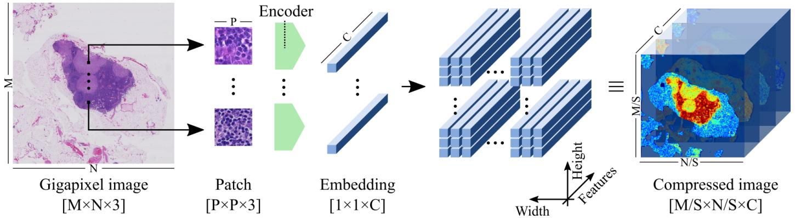

[← 返回 README](../README.md)

# 01 - Introduction

## 📌 预览

Introduction 先定义 gigapixel 弱监督的低信噪比问题，再把已有方法分成“已知 patch 语义”和“MIL 找 patch”两类，最后提出 NIC：用 encoder 把 WSI 转成保留空间结构的 latent grid，让 CNN 同时解决 what 和 where。

---

# 1 INTRODUCTION

GIGAPIXEL images are three-dimensional arrays composed of more than 1 billion pixels; these are common in fields like Computational Pathology [1] and Remote Sensing [2], and are often associated with labels at image level. The fundamental challenge of gigapixel image analysis with weak image-level labels resides in the low signal-to-noise ratio present in these images. Typically, the signal consists of a subtle combination of high- and low-level patterns that are related to the image-level label, while most of the pixels behave as distracting noise. Furthermore, the nature and spatial distribution of the signal are both unknown, often referred to as the what and the where problems, respectively.

> 💡 **what/where 问题定义**: what 是“哪些视觉模式和标签有关”，where 是“这些模式在 WSI 的什么位置”。NIC 的设计目标不是只找单个 positive patch，而是让 CNN 在压缩后的二维网格上同时学习模式类型和空间分布。

# 1.1 The what and the where problems

Researchers have addressed the challenge of gigapixel image analysis by making different assumptions about the signal, simplifying either the what or the where problem.

The most widespread simplification assumes that the signal is fully recognizable at a low level of abstraction, i.e., the image-level label has a patch-level representation. This simplification addresses the what problem by decomposing the gigapixel image into a set of patches that can be independently annotated. Typically, these patches are manually annotated to perform automatic detection or segmentation using a neural network, relegating the task of performing image-level prediction to a rule-based decision model about the patch-level predictions [1], [3]–[5]. This assumption is not valid for image-level labels that do not have a known patch-level representation. Furthermore, patch-level annotation in gigapixel images is a tedious, time consuming and error-prone process, and limits what machine learning models can learn to the knowledge of human annotators.

> 💡 **patch annotation 的上限**: 对 metastasis 这类有明确 lesion 的任务，patch 标注可行但昂贵；对 proliferation speed 这类由基因表达定义的标签，人类甚至未必知道 patch 级视觉模式是什么。

Other researchers have assumed that the signal can exist at a low level of abstraction, but it is then not fully recognizable, i.e., the image-level label has a patch-level representation that is unknown to human annotators. Furthermore, the mere presence of these patches is enough evidence to make a prediction at the image level, ignoring the spatial arrangement between patches, thus solving the where problem. Making this assumption falls into the multipleinstance learning (MIL) framework, which reduces the gigapixel image analysis problem into detecting patches that contain the true signal while suppressing the noisy ones [6]– [10]. However, these methods can only take into account patterns present within individual patches, neglecting the potential relationships among them. More generally, MIL techniques cannot exploit patterns present in higher levels of abstraction since they ignore the spatial distribution among patches. This is also true for methods that aggregate patch-level information by means of spatial pooling [6], [11].

> 💡 **和 MIL 的分歧**: 作者批评的不是 MIL 能否弱监督，而是 MIL 常把 WSI 简化为 patch bag 或弱空间池化，难以表达“多个局部结构按某种空间关系共同决定标签”的高层模式。

In this work, we do not make any assumptions about the nature or spatial distribution of the visual cues associated with image-level labels. We argue that convolutional neural networks (CNN) are designed to solve the what and the where problems simultaneously [12], and propose a method to use them for gigapixel image analysis. However, feeding CNNs directly with gigapixel images is computationally unfeasible. Instead, we propose Neural Image Compression (NIC), a technique that maps images from a low-level pixel space to a higher-level latent space using neural networks. In this way, gigapixel images are compressed into a highly compact representation, which can be used to train a CNN using a single GPU for predicting any kind of image-level label.

> 💡 **NIC 的核心假设**: CNN 本来能处理 what/where，但原始 WSI 太大；如果先把每个 patch 变成语义向量并保持二维排列，CNN 就能在 latent image 上工作。

*Fig. 1: Gigapixel neural image compression. Left: a gigapixel histopathology whole-slide image is divided into a set of patches mapped to a set of low-dimensional embedding vectors using a neural network (the encoder). Center: these embeddings are stored keeping the spatial arrangement of the original patches. Right: the resulting array is a compressed representation of the gigapixel image.*

> 💡 **Figure 1 批读**: 这张图把 NIC 和普通 feature extraction 区分开：embedding 不是被全局平均，而是按 patch 原始坐标存成网格。后续 CNN 的卷积核深度等于 $C$，空间维度则对应 WSI 上 patch 的邻接关系。

# 1.2 Neural Image Compression

Gigapixel NIC was designed to reduce the size of a gigapixel image while retaining semantic information by shrinking its spatial dimensions and growing along the feature direction (see Fig. 1). The method works by, first, dividing the gigapixel image into a set of high-resolution patches. Second, each high-resolution patch is compressed with a neural network (the encoder) that maps every image into a low-dimensional embedding vector. Finally, each embedding is placed into an array that keeps the original spatial arrangement intact so that neighbor embeddings in the array represent neighbor patches in the original image.

> 💡 **形状变化**: “shrinking spatial + growing feature direction” 是本文压缩的关键。它不是 JPEG 式保真压缩，而是把像素分辨率换成语义通道数。

NIC was inspired by cognitive mechanisms. Human observers can describe complex visual patterns using only a few words without needing to describe each individual pixel. Similarly, the encoder can describe patches with lowdimensional embedding vectors, ignoring superfluous details. It is a powerful method that competes with classical approaches in terms of compression rate [13]. Moreover, previous works on representation learning and transfer learning have demonstrated that neural networks excel at extracting features that can be exploited by other networks to solve a variety of downstream tasks [14]–[17]. This makes NIC an ideal candidate for reducing the size of gigapixel images before feeding a CNN.

> 💡 **不是重建优先**: 这段强调“忽略 superfluous details”。对下游 WSI 标签来说，保留语义比重建每个 stain 细节更重要，这也解释了后面 VAE 不如 BiGAN 的讨论。

The encoder network can be trained using a wide variety of techniques. In this work, we selected and compared representative methods from three well-known families of unsupervised representation learning algorithms: reconstruction error minimization, contrastive training, and adversarial feature learning. First, autoencoders (AE) have been proposed as a straightforward method to learn a compact representation of a given data manifold [12]. AEs are neural networks that follow a particular encoder-bottleneckdecoder architecture. They aim to reconstruct input images by minimizing a reconstruction loss, e.g., the mean squared error (MSE). In particular, we considered the case of the variational autoencoder (VAE), a powerful modification of the original AE that relies on a probabilistic approach [18]. Second, we investigated a discriminative model based on contrastive training [16], [19]–[21]. This model senses the world via an encoding network that maps images to embedding vectors. By training this model to distinguish between pairs of images with same or different semantic information, the encoder is enforced to learn a compact representation of the input data. Third, we investigated adversarial feature learning [14], [15], a training framework based on Generative Adversarial Networks (GAN) [22]. GANs emerged as powerful generative models that map low-dimensional latent distributions into complex data. There is evidence that these latent spaces capture some of the high-level semantic information present in the data [23]. However, standard GAN models do not support the reverse operation, i.e., mapping data to the latent space. The Bidirectional GAN model (BiGAN [14]) learns this mapping using an explicit encoding network in the training loop. Intuitively, the encoder benefits from all the high-level features which were fully automatically discovered by the generator.

> 💡 **三类 encoder 的对照**: VAE 优先重建像素；contrastive 优先区分“同一位置增强 vs 邻近/异图 patch”；BiGAN 优先让 image-embedding pair 无法被 discriminator 区分。它们都输出 $E(x)=e$，但学习信号完全不同。

# 1.3 Gigapixel Image Analysis

Without any loss of generality, we applied our method to two of the largest publicly available histopathology datasets to demonstrate its effectiveness in real-world applications: the Camelyon16 Challenge [4] and the TUPAC16 Challenge [3]. These datasets consist of gigapixel images of human tissue acquired with brightfield microscopy at very high magnification, also known as whole-slide images (WSI). These WSIs were stained with hematoxylin and eosin (H&E), the most widely used stain in routine histopathology diagnostics, that highlights general tissue morphology such as cell nuclei and cytoplasm. Each WSI is associated with a single image-level label: the presence of tumor metastasis for Camelyon16, and the tumor proliferation speed based on gene-expression profiling for TUPAC16.

> 💡 **两个真实任务互补**: Camelyon16 的标签有专家 lesion 标注可做定位 sanity check；TUPAC16 的 proliferation speed 更接近“未知视觉线索”的弱监督任务，能检验 NIC 是否超出人类显式 patch 知识。

A benefit of using a CNN for gigapixel image analysis is that, once trained, the CNN’s areas of interest in the input image can be visualized using gradient-weighted classactivation maps (Grad-CAM) [24]. These saliency maps provide an answer to the where problem by locating visual cues related to the image-level labels. Identifying visual evidence for CNN predictions is of utmost importance in the medical domain regarding algorithm interpretation and knowledge discovery. For the first time, we performed this saliency analysis on gigapixel images and compared the resulting maps with the patch-level annotations of an expert observer.

> 💡 **Q&A 批注记录**:
> - Q: 为什么 Grad-CAM 是本文必要组成，而不是附加可视化？
> - A: 因为论文声称 CNN 能同时解决 what/where。预测指标只证明 what 有用；Grad-CAM 与人工标注重叠才给 where claim 提供证据。

# 1.4 Contributions

This work is an extension of our conference paper [25]. A number of additions have been made: three new datasets, an additional encoding method, the Grad-CAM analysis, a new experiment at the patch level, a new experiment at the image level, a more thorough evaluation using crossvalidation, and an independent test evaluation performed by a third-party.

Our contributions can be summarized as follows:

We propose Neural Image Compression (NIC) as a method to reduce gigapixel images to highlycompact representations, suitable for training a CNN end-to-end to predict image-level labels using a single GPU and standard deep learning techniques. We compared several encoding methods that map high-resolution image patches to low-dimensional embedding vectors based on different unsupervised learning techniques: reconstruction error minimization, contrastive training, and adversarial feature learning. • We evaluated NIC in three publicly available datasets: a synthetic set designed to evaluate the method; and two histopathological breast cancer sets of whole-slide images used to train the system to predict the presence of tumor metastasis and the tumor proliferation speed. We generated saliency maps representing the CNN’s areas of interest in the image in order to discover and localize visual cues associated to the image-level labels.

The paper is organized as follows: Sec. 2 and Sec. 3 describe the methods in depth; Materials and experimental results are described in Sec. 4; the discussions and conclusions are stated in Sec. 5 and Sec. 6, respectively.

## 🔖 Section 总结

1. NIC 的主要技术动作是把 WSI 变成“可卷积的 latent image”。
2. 论文有两条证据链：预测性能证明 compressed grid 可用；Grad-CAM 证明模型确实在相关区域取证。
3. 关键追问是 encoder 是否真的保留下游语义，特别是小病灶和未知视觉线索。
